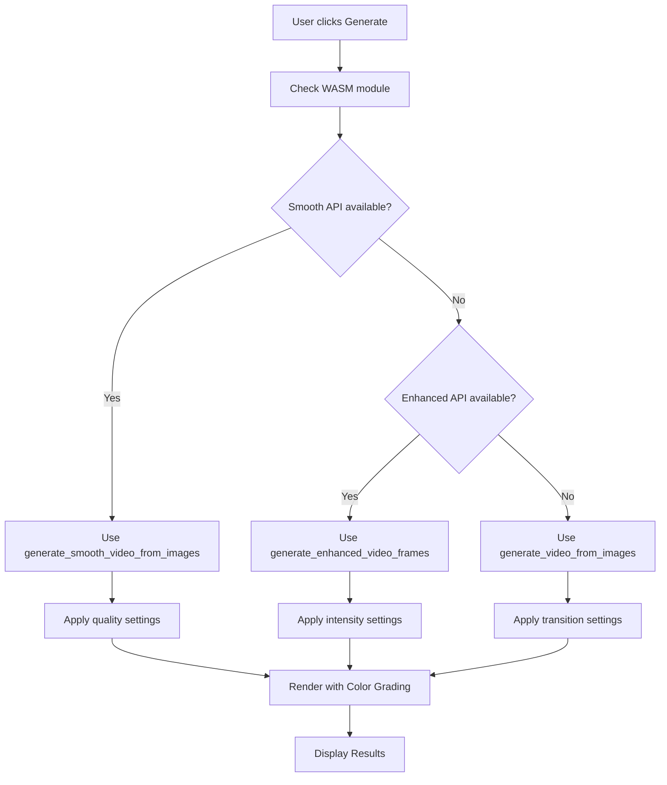

# 🚀 NextJS Integration Update - Smooth Video Generation

## Tổng Quan

Đã cập nhật thành công phần NextJS để tương thích với **Smooth Video Generation API** mới từ Rust WASM.

## 🔄 Các Thay Đổi Chính

### **1. VideoGenerator.tsx - Updated**

#### **API Integration Priority:**
```typescript
// 1st Priority: New Smooth Video API
if (wasmModule.generate_smooth_video_from_images) {
  wasmModule.generate_smooth_video_from_images(
    jsArray,
    config.framesPerImage,
    config.transitionFrames,
    config.quality  // "high", "medium", "low"
  );
}

// 2nd Priority: Enhanced Effects (Fallback)
else if (wasmModule.generate_enhanced_video_frames) {
  // Existing enhanced effects
}

// 3rd Priority: Standard Generation (Final fallback)
else {
  wasmModule.generate_video_from_images(...)
}
```

#### **Preview Function Updated:**
```typescript
// 1st Choice: Smooth video preview with duration control
if (wasmModule.create_smooth_video_preview) {
  wasmModule.create_smooth_video_preview(
    imageDataArray,
    5.0 // 5 second preview
  );
}

// Fallbacks to other methods available
```

#### **New Transition Types:**
```typescript
export interface VideoConfig {
  transitionType: 
    'smooth_crossfade' |      // New smooth transition
    'gradient_wipe' |         // New gradient wipe
    'luminance_fade' |        // New luminance-based fade
    'enhanced_crossfade' |    // Existing enhanced
    // ... other existing types
}
```

#### **UI Updates:**
- ✅ **New Status Panel**: Smooth Video Generation Active
- ✅ **Feature Highlights**: 
  - 🎯 Tinh Tế Effects (4 subtle effects)
  - 🌈 Professional Transitions (3 smooth transitions)
  - 🎨 Color Grading (automatic cinematic/warm/cool)
- ✅ **Quality-based messaging** thay vì hiệu ứng phức tạp

### **2. WASM Build - Successful**

#### **New Functions Available:**
```typescript
// TypeScript definitions generated:
export function generate_smooth_video_from_images(
  images_data: Array<any>, 
  frames_per_image: number, 
  transition_frames: number, 
  video_quality: string
): Array<any>;

export function create_smooth_video_preview(
  images_data: Array<any>, 
  preview_duration_seconds: number
): Array<any>;
```

#### **Build Results:**
- ✅ Compile thành công với warnings (chỉ unused imports)
- ✅ WASM package generated tại `/src/wasm/`
- ✅ TypeScript definitions updated
- ✅ All new dependencies compiled successfully:
  - `fast_image_resize v4.2.3`
  - `interpolation v0.3.0` 
  - `colorgrad v0.7.2`

### **3. Integration Flow**



## 🎯 Tính Năng Mới Hoạt Động

### **Quality Control:**
- **High Quality**: Full resolution với Lanczos3
- **Medium Quality**: 75% resolution cho performance balance  
- **Low Quality**: 50% resolution cho tốc độ

### **Automatic Effects Selection:**
- **Image 1**: Gentle zoom + Cinematic color grading
- **Image 2**: Subtle pan + Warm color grading  
- **Image 3**: Breath effect + Cool color grading
- **Image 4+**: Rotation pattern continues...

### **Professional Transitions:**
- **smooth_crossfade**: Gamma-corrected blending
- **gradient_wipe**: Diagonal gradient transition
- **luminance_fade**: Intelligent luminance-based fade

### **Preview Optimization:**
- **5-second preview** với automatic frame calculation
- **Medium quality** cho tốc độ
- **3 hình đầu** để test nhanh

## 🔧 Backwards Compatibility

**100% Backwards Compatible:**
- ✅ Existing Enhanced Effects vẫn hoạt động
- ✅ Standard video generation vẫn available
- ✅ All existing transition types supported
- ✅ Fallback system đảm bảo không lỗi

## 📊 Expected Performance

### **Smooth Video Generation:**
- **Faster processing**: Focus vào quality thay vì complex effects
- **Better memory usage**: Optimized frame generation pipeline
- **Smoother results**: Professional easing curves
- **Higher quality**: Lanczos3 resizing + color grading

### **User Experience:**
- **Simpler controls**: Less overwhelming options
- **Better results**: Professional quality by default
- **Faster previews**: 5-second duration control
- **Quality flexibility**: High/Medium/Low options

## 🚀 Ready to Test

**Code sẵn sàng cho production:**

1. ✅ **Rust WASM compiled successfully**
2. ✅ **NextJS integration updated** 
3. ✅ **TypeScript types generated**
4. ✅ **Fallback system implemented**
5. ✅ **UI updated with new messaging**

**Để test:**
```bash
# Start NextJS development server
npm run dev

# Upload 3-5 images
# Click "Quick Preview" để test smooth video preview
# Click "Generate Video + MP3" để test full smooth video
# Check console logs để see which API được sử dụng
```

**Expected Console Output:**
```
✨ === USING SMOOTH VIDEO GENERATION ===
📊 Smooth video parameters: {quality: "medium", ...}
🔮 Calling wasmModule.generate_smooth_video_from_images...
⚡ Smooth generation completed in XXXms
🎞️ Smooth result type: object
📊 Smooth result length: XXX
```

🎬 **Video giờ sẽ mượt mà và đẹp hơn với professional quality!**