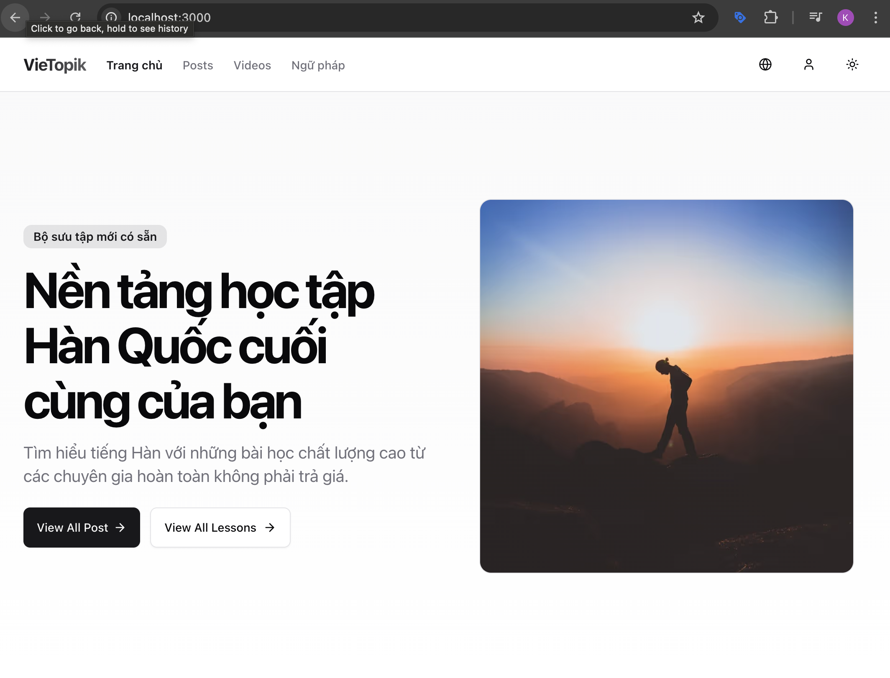
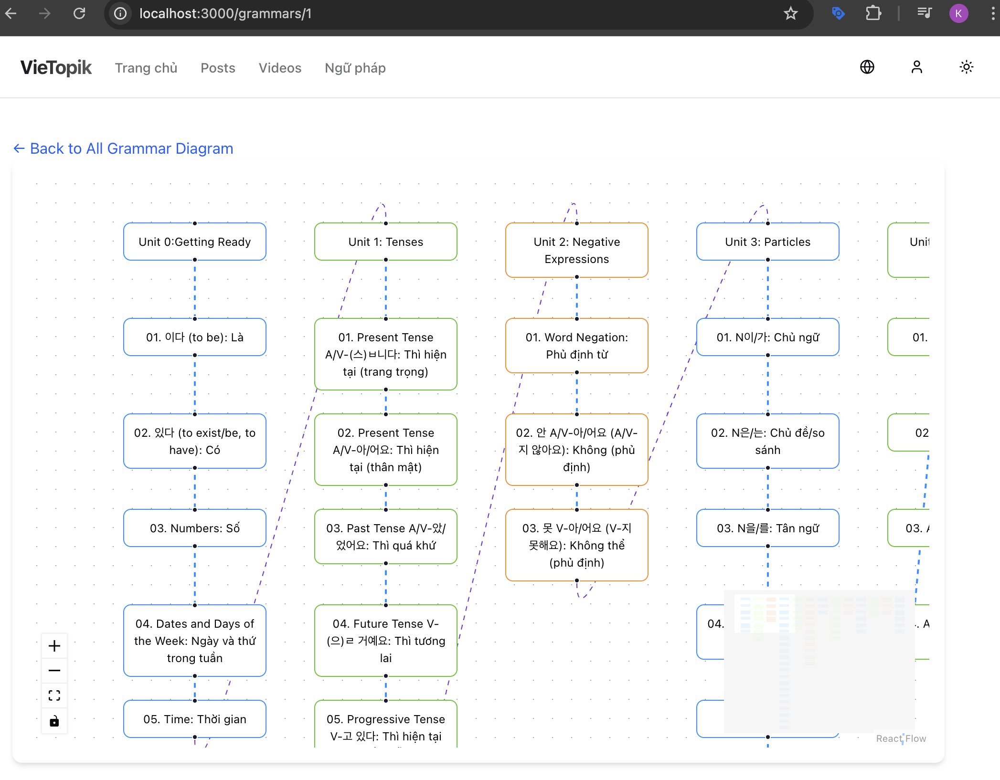
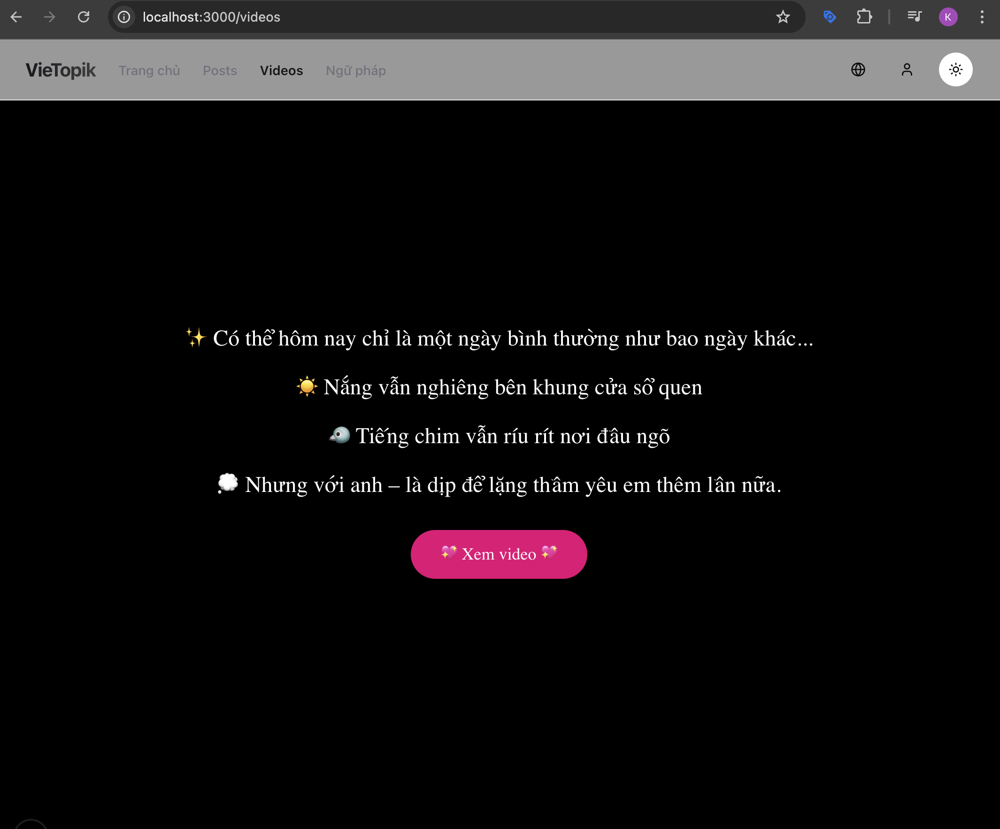

# VieTopik 🧠🇰🇷  
A modern, open-source web project built with **Next.js**, **PocketBase**, and **TailwindCSS** to support learning Korean (TOPIK).

<p align="center">
  
  
</p>

<p align="center">
  
  

</p>


## 🚀 Features
- ✅ Generate videos from images and audio – Perfect for sending sweet messages to someone special!
- ✅ Built with **Next.js App Router**
- ✅ Backend powered by **PocketBase** (lightweight, easy to self-host)
- ✅ Styled using **TailwindCSS**
- ✅ Clean and modular code structure
- ✅ Ready-to-use template for personal or educational projects

---

## 🛠️ Tech Stack

- **Next.js** - Full-stack React framework
- **PocketBase** - Backend-as-a-Service (auth, DB, file storage)
- **TailwindCSS** - Utility-first CSS framework

---

## 📦 Getting Started

### 1. Clone the repo

```bash
git clone https://github.com/khieu-dv/vietopik.git
cd vietopik
```

### 2. Install dependencies

```bash
npm install
# or
yarn install
```

### 3. Run PocketBase (local)

1. **Navigate to the pocketbase-docker directory**:

   Open your terminal and navigate to the directory containing the docker-compose.yml file:

   ```bash
   cd ./vietopik/pocketbase-docker
   ```

2. **Start the Docker container**:

   Run the following command to start the PocketBase service:

   ```bash
   docker-compose up -d
   ```

   - The `-d` flag runs the container in detached mode (in the background).

3. **Verify the service is running**:

   Check the status of the PocketBase container:

   ```bash
   docker ps
   ```

   You should see a container named `pocketbase` running.

4. **Access PocketBase**:

   Open your browser and navigate to:

   ```
   http://localhost:8090/_/
   ```

   This will take you to the PocketBase admin interface.

---


### 4. Start the development server

```bash
npm run dev
```

Open [http://localhost:3000](http://localhost:3000) in your browser to see the app.

---

## 📁 Folder Structure

```
vietopik/
├── app/                            # Next.js App Router pages and components
│   ├── favicon.ico                 # Favicon for the app
│   ├── globals.css                 # Global CSS styles
│   ├── i18n.ts                     # Internationalization setup
│   ├── layout.tsx                  # Root layout for the app
│   ├── page.tsx                    # Home page
│   ├── api/                        # API routes
│   │   ├── auth/                   # Authentication-related API routes
│   │   └── chat/                   # Chat-related API routes
│   ├── auth/                       # Authentication pages
│   │   ├── layout.tsx              # Layout for authentication pages
│   │   ├── backup-codes/           # Backup codes page
│   │   ├── sign-in/                # Sign-in page
│   │   ├── sign-up/                # Sign-up page
│   │   └── two-factor/             # Two-factor authentication page
│   ├── chat/                       # Chat-related pages
│   ├── components/                 # Reusable components
│   │   ├── contact-button.tsx      # Contact button component
│   │   ├── DevToolsDetector.tsx    # DevTools detection component
│   │   ├── Emitter.tsx             # Emitter component for animations
│   │   └── ...                     # Other components
│   ├── dashboard/                  # Dashboard pages
│   ├── diagrams/                   # Grammar diagrams pages
│   ├── grammars/                   # Grammar-related pages
│   ├── posts/                      # Blog post pages
│   │   ├── [id]/                   # Dynamic post detail pages
│   │   └── page.tsx                # Posts listing page
│   ├── profile/                    # User profile pages
│   ├── showcase/                   # Showcase pages
│   ├── video-feed/                 # Video feed pages
│   └── videos/                     # Video-related pages
├── db/                             # Database configuration and schema
│   ├── index.ts                    # Database connection setup
│   ├── types.ts                    # Database types
│   └── schema/                     # Database schema definitions
├── lib/                            # Utility libraries and services
│   ├── auth-client.ts              # Authentication client
│   ├── auth-client_v2.ts           # Updated authentication client
│   ├── auth.ts                     # Authentication utilities
│   ├── flowService.ts              # Flow-related services
│   ├── utils.ts                    # General utility functions
│   └── hooks/                      # Custom React hooks
├── ui/                             # UI primitives and components
│   ├── components/                 # Reusable UI components
│   ├── primitives/                 # Low-level UI primitives (e.g., buttons, modals)
│   └── layouts/                    # Layout components
│       ├── auth-layout.tsx         # Layout for authentication pages
│       └── dashboard-layout.tsx    # Layout for dashboard pages
├── utils/                          # Server-side utilities
│   └── serverI18n.ts               # Server-side internationalization utilities
```


┌──────────────┐         ┌──────────────┐
│   Người A    │         │   Người B    │
│  (ChatRoom)  │         │  (ChatRoom)  │
└────┬─────────┘         └────┬─────────┘
     │                        │
     ▼                        ▼
 GET /api/socket?roomId=123  (SSE: Listen for messages)
     │                        │
     ▼                        ▼
  SSE mở kết nối đến Server  ←────────┐
                                      │
  POST /api/messages                  │
    gửi message M                     │
            ▼                         │
    Lưu M vào Redis                   │
    Push M đến tất cả SSE clients────┘


### Key Highlights:
- **`app/`**: Contains all Next.js pages and components, organized by feature (e.g., `auth`, `posts`, `grammars`).
- **`db/`**: Manages database schema and connections using Drizzle ORM.
- **`lib/`**: Includes reusable libraries for authentication, API services, and utilities.
- **`ui/`**: Houses reusable UI components and primitives for consistent styling.
- **`utils/`**: Contains server-side utilities, such as internationalization helpers.

This structure ensures modularity, scalability, and maintainability for the project.

---

## 💡 Why VieTopik?

This project was created to help learners of Korean (especially TOPIK) with a clean, modern learning platform. It’s also a great starting point for developers looking to work with PocketBase and Next.js.

---

## 📄 License

This project is licensed under the **MIT License**. Feel free to use, modify, and share!

---

## ❤️ Support

If you like this project, please consider:

- ⭐ Giving it a star on [GitHub](https://github.com/khieu-dv/vietopik)
- 📣 Sharing with your friends or community

---

## 📬 Contact

Feel free to reach out via GitHub issues or discussions if you have any questions or feedback!

```

