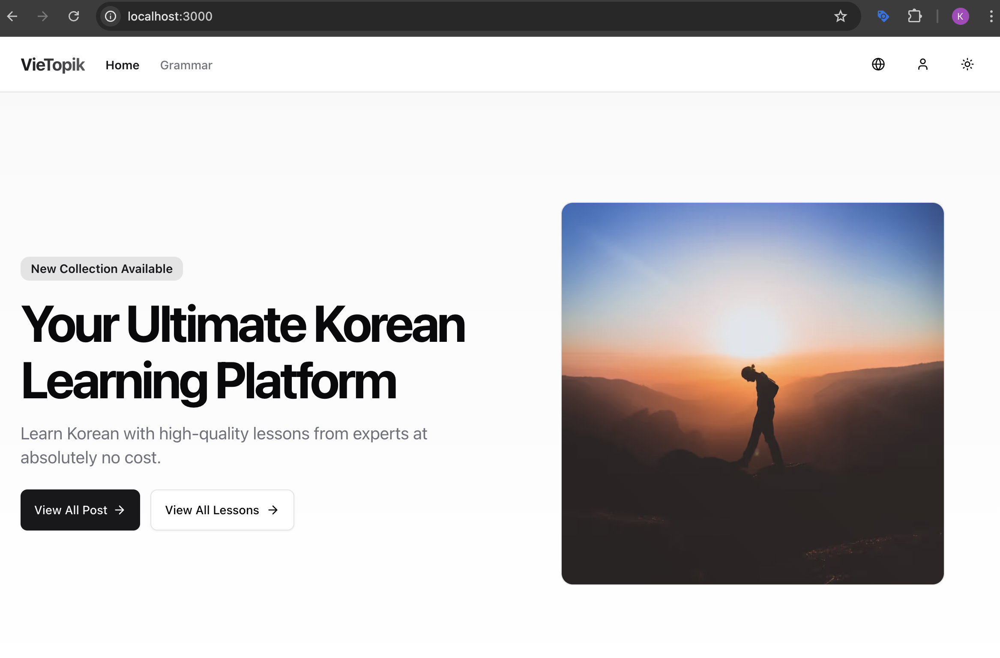
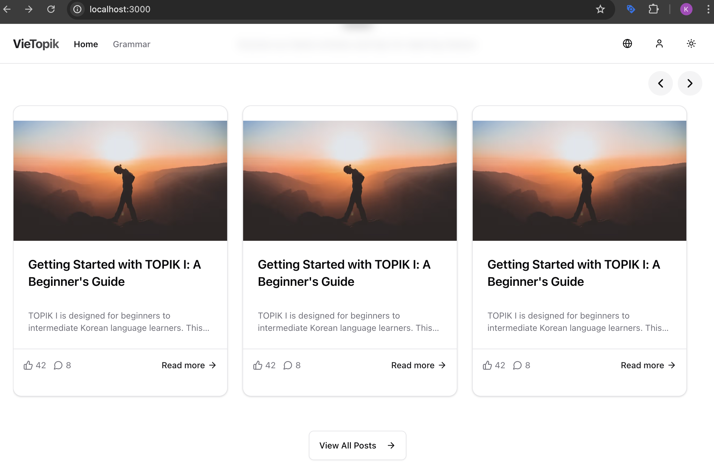
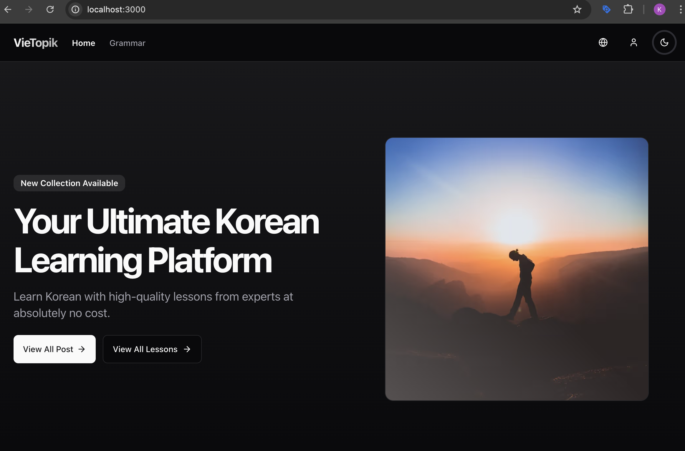
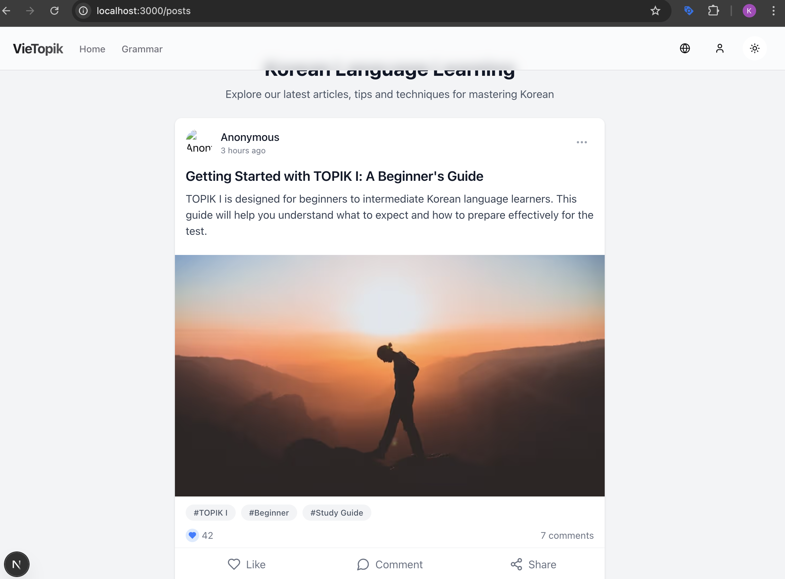

# VieTopik 🧠🇰🇷  
A modern, open-source web project built with **Next.js**, **PocketBase**, and **TailwindCSS** to support learning Korean (TOPIK).

<p align="center">
  

  
</p>

<p align="center">
  
    

</p>


## 🚀 Features

- ✅ Built with **Next.js App Router**
- ✅ Backend powered by **PocketBase** (lightweight, easy to self-host)
- ✅ Styled using **TailwindCSS**
- ✅ Clean and modular code structure
- ✅ Ready-to-use template for personal or educational projects

---

## 🛠️ Tech Stack

- **Next.js** - Full-stack React framework
- **PocketBase** - Backend-as-a-Service (auth, DB, file storage)
- **TailwindCSS** - Utility-first CSS framework

---

## 📦 Getting Started

### 1. Clone the repo

```bash
git clone https://github.com/khieu-dv/vietopik.git
cd vietopik
```

### 2. Install dependencies

```bash
npm install
# or
yarn install
```

### 3. Run PocketBase (local)

Download PocketBase from https://pocketbase.io, then run:

```bash
./pocketbase serve
```

> You can also use hosted PocketBase or run with Docker if preferred.

### 4. Start the development server

```bash
npm run dev
```

Open [http://localhost:3000](http://localhost:3000) in your browser to see the app.

---

## 📁 Folder Structure

```
vietopik/
├── app/                # Next.js App Router pages
├── components/         # Reusable UI components
├── lib/                # API and PocketBase client
├── public/             # Static assets
├── styles/             # Tailwind CSS config and global styles
└── pocketbase/         # Sample data/schema (optional)
```

---

## 💡 Why VieTopik?

This project was created to help learners of Korean (especially TOPIK) with a clean, modern learning platform. It’s also a great starting point for developers looking to work with PocketBase and Next.js.

---

## 📄 License

This project is licensed under the **MIT License**. Feel free to use, modify, and share!

---

## ❤️ Support

If you like this project, please consider:

- ⭐ Giving it a star on [GitHub](https://github.com/khieu-dv/vietopik)
- 📣 Sharing with your friends or community

---

## 📬 Contact

Feel free to reach out via GitHub issues or discussions if you have any questions or feedback!

```

