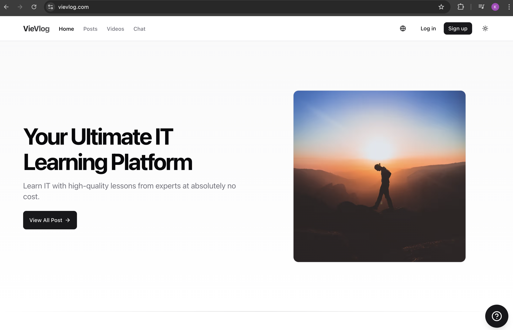
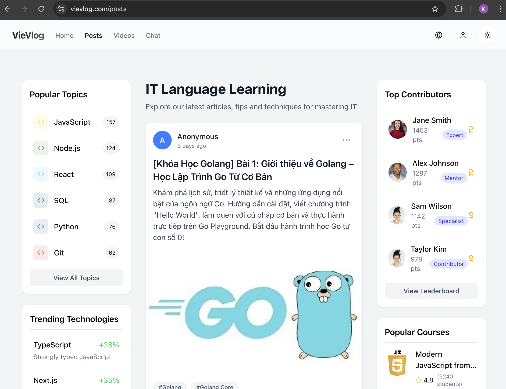
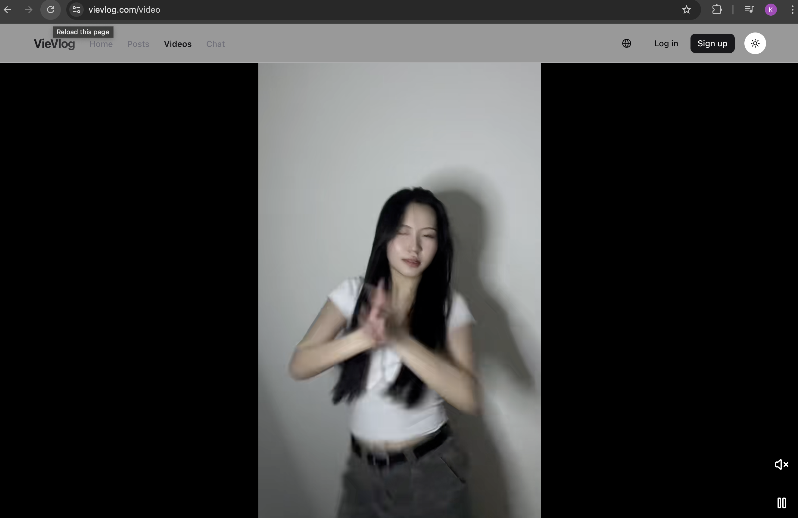

# VieVlog 🧠 - Modern Learning Platform for IT Education

<div align="center">

[](https://github.com/khieu-dv/vievlog/stargazers)
[](https://github.com/khieu-dv/vievlog/network/members)
[](https://github.com/khieu-dv/vievlog/issues)
[](https://github.com/khieu-dv/vievlog/blob/main/LICENSE)
[](https://www.youtube.com/watch?v=bLqeFoANuTg)

</div>

## 🌟 Overview

VieVlog is a cutting-edge, open-source educational platform built with modern web technologies to revolutionize IT learning experiences. Perfect for educators, students, and tech enthusiasts!

<p align="center">
  
  
</p>

<p align="center">
  
  
</p>

## 🎓 Learning Resources

📹 **Watch our comprehensive tutorial**: [Create a Modern Web App with Next.js & PocketBase](https://www.youtube.com/watch?v=bLqeFoANuTg)


## ✨ Why Choose VieVlog?

- 🚀 **Production-Ready**: Built with enterprise-grade architecture and best practices
- 🔧 **Developer-Friendly**: Clean code structure with modern tooling
- 📱 **Responsive Design**: Perfect experience across all devices
- 🔌 **Easy Integration**: Minimal setup required to get started
- 🌐 **Internationalization Ready**: Built with global audiences in mind

## 🎯 Key Features

- ⚡ Generate engaging videos from images and audio
- 🎨 Create personalized learning materials
- 🔐 User authentication and profile management
- 📝 Content creation and management tools
- 📊 Progress tracking and analytics
- 💬 Interactive discussion platform

## 🛠️ Technology Stack

<div align="center">
  
| Technology | Purpose |
|------------|---------|
| [Next.js](https://nextjs.org/) | Full-stack React framework with App Router |
| [PocketBase](https://pocketbase.io/) | Lightweight self-hostable Backend-as-a-Service |
| [TailwindCSS](https://tailwindcss.com/) | Utility-first CSS framework |
| [Docker](https://www.docker.com/) | Containerization for easy deployment |

</div>

## 🚀 Getting Started in 4 Simple Steps

### 1. Clone the Repository

```bash
git clone https://github.com/khieu-dv/vievlog.git
cd vievlog
```

### 2. Install Dependencies

```bash
npm install
# or
yarn install
```

### 3. Start PocketBase (Backend)

```bash
cd ./vievlog/pocketbase-docker
docker-compose up -d
```

Access the PocketBase admin interface at: http://localhost:8090/_/

### 4. Launch Development Server

```bash
npm run dev
# or
yarn dev
```

Visit [http://localhost:3000](http://localhost:3000) to see your app running!

## 📚 Documentation

### Project Structure

```
vievlog/
├── app/                  # Next.js App Router components and pages
│   ├── api/              # API endpoints
│   ├── auth/             # Authentication flows
│   ├── chat/             # Real-time communication
│   ├── components/       # Shared components
│   ├── posts/            # Content management
│   ├── profile/          # User profiles
│   └── videos/           # Video generation tools
├── lib/                  # Utility functions and services
├── ui/                   # UI components and primitives
└── utils/                # Server-side helpers
```


## 🤝 Contributing

We welcome contributions of all sizes! Here's how you can help:

1. Fork the repository
2. Create your feature branch: `git checkout -b feature/amazing-feature`
3. Commit your changes: `git commit -m 'Add some amazing feature'`
4. Push to the branch: `git push origin feature/amazing-feature`
5. Open a Pull Request

Check out our [Contributing Guidelines](CONTRIBUTING.md) for more details.

## 📊 Project Status

VieVlog is under active development. We're working hard to add more features and improvements!

<div align="center">

[](https://github.com/khieu-dv/vievlog)
[](https://github.com/khieu-dv/vievlog/commits/main)

</div>

## 📄 License

This project is licensed under the MIT License - see the [LICENSE](LICENSE) file for details.

## 👨‍💻 Author

**Khieu DV** - [GitHub Profile](https://github.com/khieu-dv)

## 🙏 Support the Project

If you find VieVlog helpful, please consider:

- ⭐ Star this repository
- 🔄 Fork it and contribute
- 📢 Share with your network
- 📝 Create issues for bugs or feature requests

## 📬 Contact & Community

- 💬 [Join our Youtube Community](https://www.youtube.com/@vie-vlogs)

---

<div align="center">
  
  <p>Made with ❤️ for the open-source community</p>
</div>