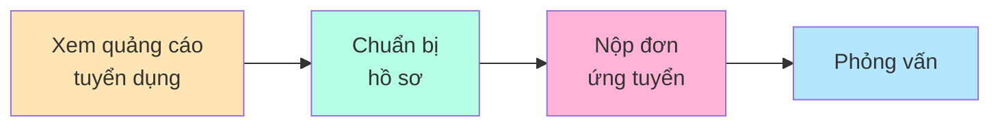
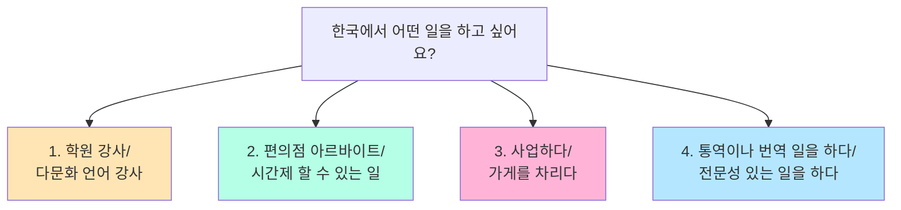
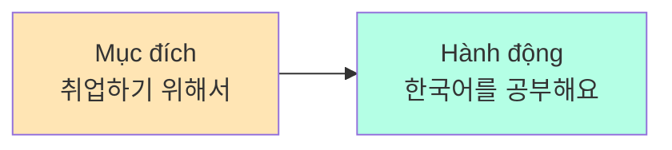
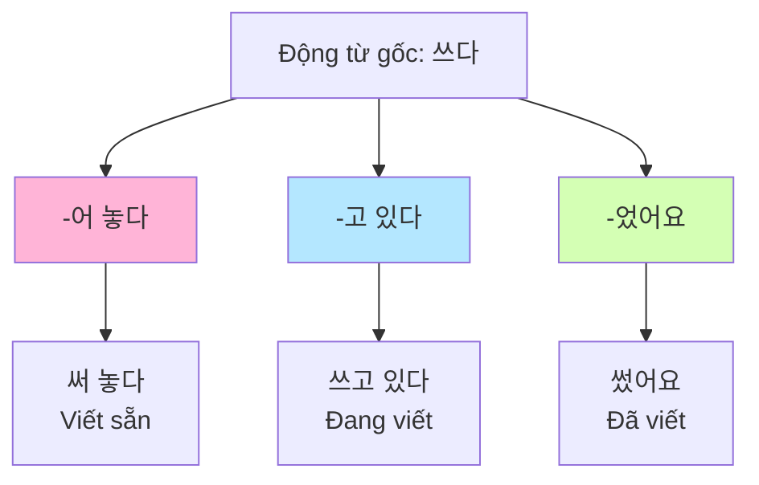
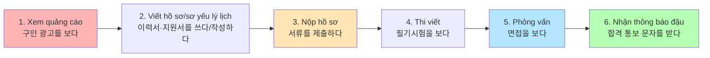
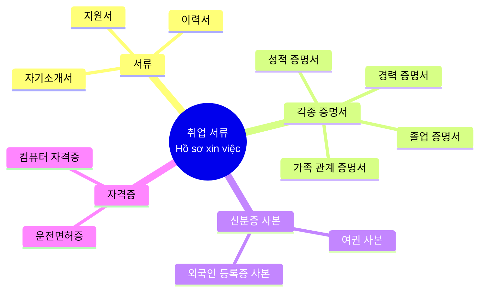
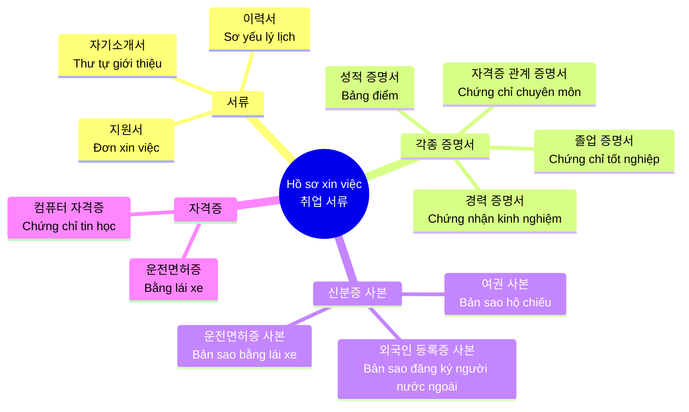
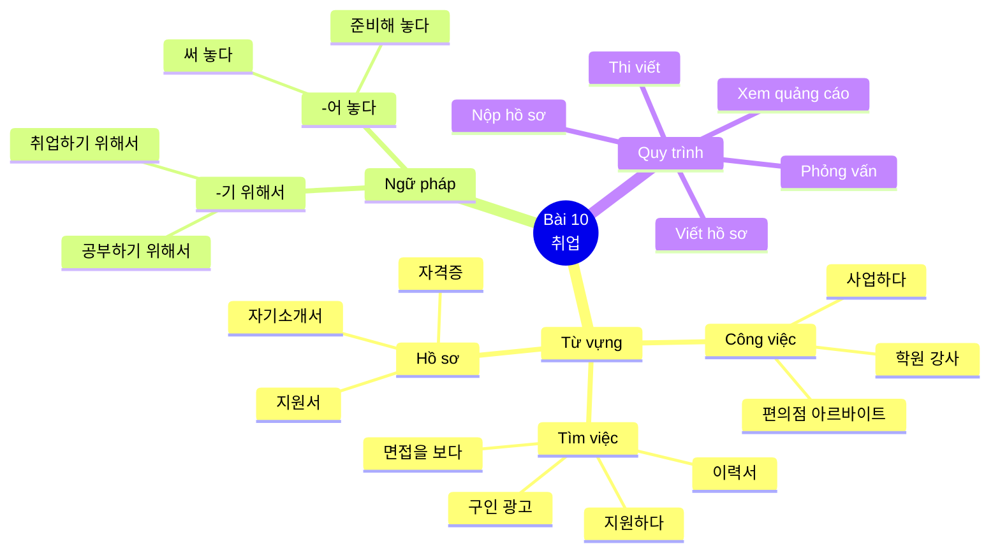

# Bài 10: 취업 (Việc làm)

## 📋 Mục tiêu bài học

- **Từ vựng**: Học các từ vựng liên quan đến việc làm, tìm kiếm việc làm và phỏng vấn
- **Ngữ pháp**:
  - **-기 위해서** (Để... / Nhằm mục đích...)
  - **-어 놓다** (Làm xong và để đó / Chuẩn bị trước)

---

## 🎯 KHỞI ĐỘNG

### Câu hỏi mở đầu

Hãy quan sát các hình ảnh và trả lời câu hỏi:

**이 사람은 무엇을 하려고 해요?**
(Người này định làm gì?)

**여러분은 한국에서 어떤 일을 하고 싶어요?**
(Các bạn muốn làm công việc gì ở Hàn Quốc?)



---

## 📚 I. TỪ VỰNG

### 1. Các loại công việc và ngành nghề

| STT | Từ vựng tiếng Hàn | Nghĩa tiếng Việt | Ví dụ |
|-----|------------------|------------------|-------|
| 1 | 학원 강사 | Giáo viên trung tâm | 초등학교의 다문화 언어 강사 (Giáo viên ngôn ngữ đa văn hóa tiểu học) |
| 2 | 다문화 언어 강사 | Giáo viên ngôn ngữ đa văn hóa | 초등학교의 다문화 언어 강사 (Giáo viên ngôn ngữ đa văn hóa tiểu học) |
| 3 | 편의점 아르바이트 | Làm thêm ở cửa hàng tiện lợi | 편의점 아르바이트/ 시간제 할 수 있는 일 (Làm thêm ở cửa hàng tiện lợi/công việc bán thời gian) |
| 4 | 시간제 일 | Công việc bán thời gian | 편의점 아르바이트/ 시간제 할 수 있는 일 (Làm thêm cửa hàng tiện lợi/công việc bán thời gian) |
| 5 | 사업하다 | Kinh doanh | 사업하다 (Kinh doanh) |
| 6 | 가게를 차리다 | Mở cửa hàng | 가게를 차리기 위해 준비하고 있어요 (Đang chuẩn bị để mở cửa hàng) |
| 7 | 통역 | Phiên dịch | 통역 (Phiên dịch) |
| 8 | 번역 | Dịch thuật | 번역 (Dịch thuật) |
| 9 | 법무 | Pháp lý | 법무 (Pháp lý) |
| 10 | 전문성 | Tính chuyên môn | 전문성 (Tính chuyên môn) |
| 11 | 안정적이다 | Ổn định | 안정적이다 (Ổn định) |
| 12 | 근무 환경 | Môi trường làm việc | 근무 환경 (Môi trường làm việc) |
| 13 | 월급 | Lương tháng | 오늘은 월급 받는 날! (Hôm nay là ngày nhận lương!) |
| 14 | 출퇴근이 자유롭다 | Giờ giấc làm việc tự do | 출퇴근이 자유롭다 (Giờ giấc làm việc tự do) |
| 15 | 발전 가능성 | Khả năng phát triển | 발전 가능성이 있는 회사 (Công ty có khả năng phát triển) |
| 16 | 자기 계발 | Tự phát triển bản thân | 자기 계발 (Tự phát triển bản thân) |
| 17 | 보람을 느끼다 | Cảm thấy ý nghĩa, cảm thấy bổ ích | 보람을 느끼다 (Cảm thấy ý nghĩa) |
| 18 | 사회에 기여하다 | Đóng góp cho xã hội | 사회에 기여하다 (Đóng góp cho xã hội) |

### 2. Từ vựng về tìm kiếm việc làm

| STT | Từ vựng tiếng Hàn | Nghĩa tiếng Việt | Ví dụ |
|-----|------------------|------------------|-------|
| 1 | 취업 | Việc làm | 요즘 어떤 일을 준비하고 있어요? (Dạo này đang chuẩn bị việc gì?) |
| 2 | 취업하다 | Xin việc, có việc làm | 무역 회사에 취직하고 싶어요 (Tôi muốn xin việc vào công ty thương mại) |
| 3 | 구인 광고 | Quảng cáo tuyển dụng | 구인 광고를 보다 (Xem quảng cáo tuyển dụng) |
| 4 | 지원하다 | Nộp đơn ứng tuyển | 그 회사에 지원하려고 하는데 뭘 준비해야 돼요? (Tôi định ứng tuyển vào công ty đó, phải chuẩn bị gì?) |
| 5 | 지원서 | Đơn xin việc | 이력서나 지원서가 필요해요 (Cần sơ yếu lý lịch hoặc đơn xin việc) |
| 6 | 이력서 | Sơ yếu lý lịch | 미리 이력서를 써 놓는 것이 좋을 거예요 (Nên viết sẵn sơ yếu lý lịch trước) |
| 7 | 자기소개서 | Thư giới thiệu bản thân | 자기소개서 (Thư giới thiệu bản thân) |
| 8 | 서류를 제출하다 | Nộp hồ sơ | 서류를 제출하다 (Nộp hồ sơ) |
| 9 | 필기시험을 보다 | Thi viết | 필기시험을 보다 (Thi viết) |
| 10 | 면접을 보다 | Phỏng vấn | 면접을 보다 (Phỏng vấn) |
| 11 | 합격 통보 문자를 받다 | Nhận tin nhắn thông báo đậu | 합격 통보 문자를 받다 (Nhận tin nhắn thông báo đậu) |
| 12 | 입사하다 | Nhập công ty, nhận việc | 입사하다 (Nhập công ty) |

### 3. Câu hỏi phỏng vấn thường gặp

| STT | Câu tiếng Hàn | Nghĩa tiếng Việt |
|-----|---------------|------------------|
| 1 | 우리 회사에 지원한 이유가 무엇입니까? | Lý do ứng tuyển vào công ty chúng tôi là gì? |
| 2 | 입사하면 어떤 일을 하고 싶습니까? | Nếu nhập công ty muốn làm công việc gì? |
| 3 | 우리 회사에 입사하기 위해 무엇을 준비했습니까? | Đã chuẩn bị gì để vào công ty chúng tôi? |

### 4. Thông tin trong đơn xin việc

| STT | Từ vựng tiếng Hàn | Nghĩa tiếng Việt | Ví dụ |
|-----|------------------|------------------|-------|
| 1 | 모집 분야 | Lĩnh vực tuyển dụng | 화장품 판매직 (Nhân viên bán hàng mỹ phẩm) |
| 2 | 판매직 | Nhân viên bán hàng | 화장품 판매직 (Nhân viên bán hàng mỹ phẩm) |
| 3 | 영업직 | Nhân viên kinh doanh | 영업직 (Nhân viên kinh doanh) |
| 4 | 생산직 | Nhân viên sản xuất | 생산직 (Nhân viên sản xuất) |
| 5 | 기술직 | Nhân viên kỹ thuật | 기술직 (Nhân viên kỹ thuật) |
| 6 | 연구직 | Nhân viên nghiên cứu | 연구직 (Nhân viên nghiên cứu) |
| 7 | 모집 인원 | Số lượng tuyển dụng | 모집 인원: 00명 (Số lượng tuyển dụng: 00 người) |
| 8 | 0명 | 0 người | 00명 (00 người) |
| 9 | 약간 명 | Vài người | 약간 명 (Vài người) |
| 10 | 지원 자격 | Điều kiện ứng tuyển | 지원 자격: 고졸 (Điều kiện ứng tuyển: Tốt nghiệp trung học) |
| 11 | 고졸 | Tốt nghiệp trung học | 고졸 (Tốt nghiệp trung học) |
| 12 | 대졸 | Tốt nghiệp đại học | 대졸(영어 전공) (Tốt nghiệp đại học chuyên ngành tiếng Anh) |
| 13 | 경력 2년 이상 | Kinh nghiệm từ 2 năm trở lên | 경력 2년 이상 (Kinh nghiệm từ 2 năm trở lên) |
| 14 | 제출 서류 | Hồ sơ nộp | 제출 서류: 이력서 (Hồ sơ nộp: Sơ yếu lý lịch) |
| 15 | 이력서 | Sơ yếu lý lịch | 이력서를 작성하시고 (Viết sơ yếu lý lịch) |
| 16 | 자격증 사본 | Bản sao chứng chỉ | 자격증 사본 (Bản sao chứng chỉ) |
| 17 | 운전면허증 사본 | Bản sao bằng lái xe | 운전면허증 사본 (Bản sao bằng lái xe) |
| 18 | 문의 | Liên hệ | 문의: (주)사누라네(02-123-4567) (Liên hệ: Công ty Sanurare) |
| 19 | 전화 | Điện thoại | 전화 (Điện thoại) |
| 20 | 이메일 | Email | 이메일 (Email) |
| 21 | 지원 방법 | Cách ứng tuyển | 지원 방법: 온라인 접수 (Cách ứng tuyển: Nộp trực tuyến) |
| 22 | 방문 접수 | Nộp trực tiếp | 방문 접수 (Nộp trực tiếp) |
| 23 | 온라인 접수 | Nộp trực tuyến | 온라인 접수 (Nộp trực tuyến) |

### 5. Các loại chứng chỉ và tài liệu

| STT | Từ vựng tiếng Hàn | Nghĩa tiếng Việt | Ví dụ |
|-----|------------------|------------------|-------|
| 1 | 서류 | Hồ sơ, tài liệu | 서류를 제출하다 (Nộp hồ sơ) |
| 2 | 지원서 | Đơn xin việc | 이력서·지원서를 쓰다/작성하다 (Viết đơn xin việc/sơ yếu lý lịch) |
| 3 | 이력서 | Sơ yếu lý lịch | 이력서를 작성하시고 컴퓨터 자격증도 미리 따 놓으세요 (Hãy viết sơ yếu lý lịch và lấy chứng chỉ tin học trước) |
| 4 | 자기소개서 | Thư giới thiệu bản thân | 자기소개서 (Thư giới thiệu bản thân) |
| 5 | 성적 증명서 | Bảng điểm | 성적 증명서 (Bảng điểm) |
| 6 | 졸업 증명서 | Chứng chỉ tốt nghiệp | 졸업 증명서 (Chứng chỉ tốt nghiệp) |
| 7 | 경력 증명서 | Chứng nhận kinh nghiệm | 경력 증명서 (Chứng nhận kinh nghiệm) |
| 8 | 자격증 관계 증명서 | Chứng chỉ liên quan đến trình độ | 자격증 관계 증명서 (Chứng chỉ liên quan đến trình độ) |
| 9 | 자격증 사본 | Bản sao chứng chỉ | 자격증 사본 (Bản sao chứng chỉ) |
| 10 | 컴퓨터 자격증 | Chứng chỉ tin học | 컴퓨터 자격증도 미리 따 놓으세요 (Hãy lấy chứng chỉ tin học trước) |
| 11 | 운전면허증 | Bằng lái xe | 운전면허증 (Bằng lái xe) |

### 6. Các động từ liên quan đến việc làm

| STT | Từ vựng tiếng Hàn | Nghĩa tiếng Việt | Ví dụ |
|-----|------------------|------------------|-------|
| 1 | 졸업하다 | Tốt nghiệp | 한국 대학 졸업 (Tốt nghiệp đại học Hàn Quốc) |
| 2 | 찾다 | Tìm kiếm | 일하는 엄마들은 아이 맡길 곳을 찾기 위해 노력하고 있다 (Những bà mẹ đi làm đang nỗ lực để tìm nơi gửi con) |
| 3 | 취득하다 | Đạt được, lấy (chứng chỉ) | 한국 국적을 취득하기 위해 1년 전부터 한국어 공부를 하고 있다 (Để lấy quốc tịch Hàn Quốc, từ 1 năm trước đã học tiếng Hàn) |
| 4 | 지원하다 | Ứng tuyển | 우리 회사에 지원한 이유가 무엇입니까? (Lý do ứng tuyển vào công ty chúng tôi là gì?) |
| 5 | 쓰다/작성하다 | Viết | 이력서를 작성하시고 (Viết sơ yếu lý lịch) |
| 6 | 제출하다 | Nộp | 서류를 제출하다 (Nộp hồ sơ) |
| 7 | 보다 | Thi, xem | 필기시험을 보다 (Thi viết) |
| 8 | 받다 | Nhận | 합격 통보 문자를 받다 (Nhận tin nhắn thông báo đậu) |
| 9 | 준비하다 | Chuẩn bị | 가게를 차리기 위해 준비하고 있어요 (Đang chuẩn bị để mở cửa hàng) |
| 10 | 합격하다 | Đậu, đỗ | 토픽 시험에 합격하기 위해 열심히 공부하고 있어요 (Để đậu kỳ thi TOPIK, đang học chăm chỉ) |

### 7. Bài tập từ vựng với hình ảnh

#### 1. 한국에서 어떤 일을 하고 싶어요?

**한국에서 어떤 일을 구해요? 여기에서 어떤 일을 하고 싶어요?**
(Bạn tìm công việc gì ở Hàn Quốc? Bạn muốn làm việc gì ở đây?)



#### 2. 어떤 회사에서 일하고 싶어요?

**어떤 회사에서 일하고 싶어요? 어떤 회사에 취직하고 싶어요?**
(Bạn muốn làm việc ở công ty nào? Bạn muốn xin việc vào công ty nào?)

| STT | Loại công ty | Tiếng Hàn | Ghi chú |
|-----|--------------|-----------|---------|
| 5 | Công ty ổn định, môi trường tốt | 안정적인 회사<br/>근무 환경이 좋은 회사 | Ưu tiên sự ổn định |
| 6 | Công ty lương cao, giờ giấc tự do | 월급을 많이 주는 회사<br/>출퇴근이 자유로운 회사 | Ưu tiên thu nhập và linh hoạt |
| 7 | Công ty có tiềm năng, đóng góp xã hội | 발전 가능성이 있는 회사<br/>사회에 기여할 수 있는 회사 | Ưu tiên phát triển và ý nghĩa |
| 8 | Công ty phát triển bản thân, có ý nghĩa | 자기 계발을 할 수 있는 회사<br/>일에 대한 보람을 느낄 수 있는 회사 | Ưu tiên sự trưởng thành cá nhân |

---

## 📝 II. NGỮ PHÁP

### 1. **-기 위해서** (Để... / Nhằm mục đích...)

#### Ý nghĩa
Cấu trúc này diễn tả mục đích hoặc ý định của hành động. Người nói thực hiện hành động ở vế sau với mục đích đạt được điều gì đó ở vế trước.

#### Cấu trúc

```
Động từ gốc + -기 위해서
```

#### Quy tắc sử dụng

| Dạng động từ | Cách chia | Ví dụ |
|-------------|----------|-------|
| **Mọi động từ** | Gốc động từ + **-기 위해서** | 공부하다 → 공부하**기 위해서** |
| | | 찾다 → 찾**기 위해서** |
| | | 먹다 → 먹**기 위해서** |

#### Ví dụ minh họa

| Câu tiếng Hàn | Nghĩa tiếng Việt |
|--------------|------------------|
| 쓰레기를 줄이**기 위해** 어떤 노력을 해야 합니까? | Để giảm rác thải, phải nỗ lực như thế nào? |
| 한국 국적을 취득하**기 위해** 1년 전부터 한국어 공부를 하고 있다. | Để lấy quốc tịch Hàn Quốc, từ 1 năm trước đã học tiếng Hàn. |
| 일하는 엄마들은 아이 맡길 곳을 찾**기 위해** 노력하고 있다. | Những bà mẹ đi làm đang nỗ lực để tìm nơi gửi con. |
| 요즘 어떤 일을 준비하고 있어요? | Dạo này bạn đang chuẩn bị việc gì? |
| 가게를 차리**기 위해** 준비하고 있어요. | Đang chuẩn bị để mở cửa hàng. |

#### So sánh **-기 위해서** và **-(으)려고**

| Ngữ pháp | Ý nghĩa | Ví dụ |
|----------|---------|-------|
| **-기 위해서** | Mục đích trang trọng, chính thức | 한국어를 배우**기 위해서** 한국에 왔어요. |
| **-(으)려고** | Mục đích thông thường, thân mật | 한국어를 배우**려고** 한국에 왔어요. |

#### Biểu đồ cấu trúc câu



---

### 2. **-어 놓다** (Làm xong và để đó / Chuẩn bị trước)

#### Ý nghĩa
Cấu trúc này diễn tả việc hoàn thành một hành động và giữ nguyên kết quả của hành động đó, thường với mục đích sử dụng sau này. Có thể hiểu là "làm trước", "chuẩn bị sẵn".

#### Cấu trúc

```
Động từ gốc + -어/아/해 놓다
```

#### Quy tắc chia động từ

| Gốc động từ | Cách chia | Ví dụ |
|------------|----------|-------|
| Gốc có nguyên âm cuối là ㅏ, ㅗ | + **아 놓다** | 사다 → 사**아 놓다** → 사 놓다 |
| Gốc có nguyên âm khác | + **어 놓다** | 적다 → 적**어 놓다** |
| 하다 | → **해 놓다** | 준비하다 → 준비**해 놓다** |

#### Ví dụ minh họa

| Câu tiếng Hàn | Nghĩa tiếng Việt |
|--------------|------------------|
| 그 회사에 지원하려고 하는데 뭘 준비해야 돼요? | Tôi định ứng tuyển vào công ty đó, phải chuẩn bị gì? |
| 이력서나 지원서가 필요해요. 미리 이력서를 써 **놓는** 것이 좋을 거예요. | Cần sơ yếu lý lịch hoặc đơn xin việc. Nên viết sẵn sơ yếu lý lịch trước. |
| 오늘 친구들과 등산을 가기로 했다. 그래서 아침 일찍 샌드위치를 만들**어 놓았다**. | Hôm nay hẹn với bạn đi leo núi. Vì thế sáng sớm đã làm sẵn sandwich. |
| 숙제를 미리 **해 놓아서** 마음이 편하다. | Vì làm bài tập trước nên tâm trí thoải mái. |
| 토요일이 아나이스 씨 생일인데 선물은 준비**했어요**? | Thứ 7 là sinh nhật Anaïs, quà đã chuẩn bị chưa? |
| 네, 선물을 준비**해 놓았어요**. | Vâng, đã chuẩn bị quà sẵn rồi. |

#### So sánh các mẫu câu

| Cấu trúc | Câu ví dụ | Ý nghĩa |
|----------|-----------|---------|
| **-어 놓다** | 물을 끓여 놓았어요. | Đã đun nước sẵn rồi. |
| **-고 있다** | 물을 끓이고 있어요. | Đang đun nước. |
| **-었어요** | 물을 끓였어요. | Đã đun nước. |

#### Biểu đồ so sánh



---

## 💬 III. MẪU CÂU VÀ HỘI THOẠI

### 1. Mẫu câu với **-기 위해서**

| Tình huống | Mẫu câu tiếng Hàn | Nghĩa tiếng Việt |
|-----------|------------------|------------------|
| Học tiếng Hàn | 한국 회사에 취직하**기 위해서** 뭘 준비하고 있어요? | Để xin việc vào công ty Hàn Quốc, bạn đang chuẩn bị gì? |
| Phỏng vấn | 토픽 시험에 합격하**기 위해** 열심히 공부하고 있어요. | Để đậu kỳ thi TOPIK, đang học chăm chỉ. |
| Tìm việc | 가게를 차리**기 위해** 좋은 자리도 알아보고 운전도 배우고 있어요. | Để mở cửa hàng, đang tìm hiểu vị trí tốt và học lái xe. |

### 2. Mẫu câu với **-어 놓다**

| Tình huống | Mẫu câu tiếng Hàn | Nghĩa tiếng Việt |
|-----------|------------------|------------------|
| Chuẩn bị phỏng vấn | 미리 이력서를 써 **놓는** 것이 좋아요. | Nên viết sẵn sơ yếu lý lịch trước. |
| Nộp hồ sơ | 서류를 준비**해 놓았어요**. | Đã chuẩn bị hồ sơ sẵn rồi. |
| Chuẩn bị sinh nhật | 선물을 미리 사 **놓았어요**. | Đã mua quà trước rồi. |

### 3. Hội thoại mẫu 1: Nói về kế hoạch nghề nghiệp

```
👤 라 흥 만: 아나이스 씨는 무슨 일을 하고 싶어요?
           (Anaïs muốn làm công việc gì?)

👤 아나이스: 네, 저는 무역 회사에 취직하고 싶어요.
           (Vâng, tôi muốn xin việc vào công ty thương mại.)

👤 라 흥 만: 아, 그래요? 아나이스 씨는 한국말을 어느 정도 할 수 있으니까 문제없을 거예요.
           (À, vậy à? Anaïs có thể nói tiếng Hàn ở mức độ nào đó nên chắc không có vấn đề.)

👤 아나이스: 그런데 한국에서 일하기 위해서 무엇이 필요해요?
           (Nhưng để làm việc ở Hàn Quốc cần gì?)

👤 라 흥 만: 무역 회사에 취직하려면 컴퓨터를 할 줄 알아야 해요.
           그러니까 이력서를 작성하시고 컴퓨터 자격증도 미리 따 놓으세요.
           (Để xin việc vào công ty thương mại phải biết máy tính.
           Vì vậy hãy viết sơ yếu lý lịch và lấy chứng chỉ tin học trước.)

👤 아나이스: 네, 그럴게요.
           (Vâng, tôi sẽ làm vậy.)
```

### 4. Hội thoại mẫu 2: Chuẩn bị phỏng vấn

```
👤 민수: 한국에서 일하기 위해 무엇을 준비하고 있어요?
       (Để làm việc ở Hàn Quốc đang chuẩn bị gì?)

👤 후엔: 이력서하고 자격증을 준비하고 있어요.
       (Đang chuẩn bị sơ yếu lý lịch và chứng chỉ.)

👤 민수: 면접 준비도 해야겠네요.
       (Phải chuẩn bị phỏng vấn nữa nhỉ.)

👤 후엔: 네, 면접 연습을 미리 해 놓으려고 해요.
       (Vâng, định luyện tập phỏng vấn trước.)

👤 민수: 그럼 휴대 전화로 모의 면접을 해 볼까요?
       (Vậy thử phỏng vấn thử bằng điện thoại nhé?)
```

### 5. Bài tập phân loại

**아래 상황에 맞게 구직하려는 사람과 조언하는 사람이 되어 대화해 보세요. 그리고 여러분의 이야기를 해 보세요.**
(Hãy đóng vai người tìm việc và người cho lời khuyên phù hợp với tình huống dưới đây và thực hành hội thoại. Sau đó hãy nói về câu chuyện của các bạn.)

#### Phân loại người và công việc

| 구직하는 사람<br/>(Người tìm việc) | 조언하는 사람<br/>(Người cho lời khuyên) |
|----------------------------------|----------------------------------------|
| 초등학교의 다문화 언어 강사<br/>(Giáo viên ngôn ngữ đa văn hóa tiểu học) | 교육 연수를 받아야 한다<br/>(Phải tham gia khóa đào tạo giáo dục) |
| _________________________________ | _________________________________ |
| _________________________________ | _________________________________ |

**Gợi ý thêm:**

**Người tìm việc (구직하는 사람):**
- 무역 회사 직원 (Nhân viên công ty thương mại)
- 편의점 아르바이트 (Làm thêm cửa hàng tiện lợi)
- 통역·번역 (Phiên dịch/Dịch thuật)

**Lời khuyên (조언하는 사람):**
- 컴퓨터 자격증을 따야 한다 (Phải lấy chứng chỉ tin học)
- 토픽 시험에 합격해야 한다 (Phải đậu kỳ thi TOPIK)
- 전문성을 키워야 한다 (Phải nâng cao tính chuyên môn)

---

## 👂 III-B. NGHE (듣기)

### 1. Câu hỏi phỏng vấn thường gặp

Hãy quan sát hình ảnh buổi phỏng vấn và trả lời các câu hỏi sau:

**여러분은 면접을 본 경험이 있습니까? 보통 어떤 질문을 받습니까?**
(Các bạn đã có kinh nghiệm phỏng vấn chưa? Thường nhận được câu hỏi gì?)

#### Các câu hỏi phỏng vấn phổ biến:

| Câu hỏi tiếng Hàn | Nghĩa tiếng Việt |
|-------------------|------------------|
| 우리 회사에 지원한 이유가 무엇입니까? | Lý do ứng tuyển vào công ty chúng tôi là gì? |
| 입사하면 어떤 일을 하고 싶습니까? | Nếu nhập công ty muốn làm công việc gì? |
| 우리 회사에 입사하기 위해 무엇을 준비했습니까? | Đã chuẩn bị gì để vào công ty chúng tôi? |

### 2. Bài nghe 1: Kinh nghiệm phỏng vấn

**에나 씨가 면접을 본 경험이 있습니까? 잘 듣고 질문에 답해 보세요.**
(Chị Ena đã có kinh nghiệm phỏng vấn chưa? Hãy nghe kỹ và trả lời câu hỏi.)

**1) 에나 씨는 왜 여기에 지원했습니까?**
(Chị Ena đã ứng tuyển vào đây vì sao?)

_Đáp án:_ ___________________________________

### 3. Bài nghe 2: Đúng hay sai

**2) 들은 내용과 같으면 ○, 다르면 X 하세요.**
(Nếu nội dung nghe giống thì đánh ○, khác thì đánh X.)

| STT | Nội dung | Đ/S |
|-----|----------|-----|
| ① | 에나 씨는 학생들을 가르친 적이 없다. | ( ) |
| ② | 에나 씨는 자격증을 따기 위해 준비하고 있다. | ( ) |
| ③ | 에나 씨는 면접관과 일주일 후에 만나기로 약속했다. | ( ) |

_Đáp án:_ ① ( ), ② ( ), ③ ( )

### 4. Phát âm: Thêm phụ âm ㄴ, ㄷ, ㅂ, ㅅ, ㅈ

Khi thêm các phụ âm **ㄱ, ㄷ, ㅂ, ㅅ, ㅈ** vào trước **ㄴ, ㄷ, ㅂ**, chúng sẽ phát âm thành âm kép tương ứng.

#### Quy tắc phát âm

```mermaid
graph LR
    A[Gốc] --> B[+ ㄴ, ㄷ, ㅂ, ㅅ, ㅈ]
    B --> C[Âm kép<br/>[ㄲ, ㄸ, ㅃ, ㅆ, ㅉ]]

    style A fill:#FFE5B4
    style B fill:#B4FFE5
    style C fill:#FFB4D7
```

#### Bảng quy tắc phát âm

Khi phụ âm cuối **ㄱ, ㄷ, ㅂ, ㅅ, ㅈ** gặp phụ âm đầu **ㄱ, ㄷ, ㅂ, ㅅ, ㅈ** của âm tiết sau, phụ âm đầu sẽ phát âm thành âm kép tương ứng.

| Phụ âm cuối | + Phụ âm đầu | = Phát âm | Ví dụ |
|-------------|--------------|-----------|-------|
| **ㄱ, ㄷ, ㅂ, ㅅ, ㅈ** | **ㄱ** | → **[ㄲ]** | 학교 [학꾜] |
| **ㄱ, ㄷ, ㅂ, ㅅ, ㅈ** | **ㄷ** | → **[ㄸ]** | 받다 [받따] |
| **ㄱ, ㄷ, ㅂ, ㅅ, ㅈ** | **ㅂ** | → **[ㅃ]** | 학부모 [학뿌모] |
| **ㄱ, ㄷ, ㅂ, ㅅ, ㅈ** | **ㅅ** | → **[ㅆ]** | 옷소매 [옫쏘매] |
| **ㄱ, ㄷ, ㅂ, ㅅ, ㅈ** | **ㅈ** | → **[ㅉ]** | 꽃집 [꼳찝] |

#### Ví dụ minh họa

| Từ gốc | Phát âm | Nghĩa |
|--------|---------|-------|
| 자격증 [자격쯩] | → [자격쯩] | Chứng chỉ |
| 이력서 [이력써] | → [이력써] | Sơ yếu lý lịch |
| 경력 증명서 [경력 쯩명서] | → [경력 쯩명서] | Chứng nhận kinh nghiệm |

**Luyện tập:**

답을 듣고 따라 읽으세요.
(Hãy nghe đáp án và đọc theo.)

1) 교사 **자격증**을 땄습니다. → [자격쯩]
2) **이력서**를 어떻게 써야 돼요? → [이력써]
3) **경력 증명서**를 제출해 주세요. → [경력 쯩명서]

---

## 🔍 IV. QUY TRÌNH TÌM VIỆC VÀ ỨNG TUYỂN

### Sơ đồ quy trình xin việc



### Bảng phân loại công việc

| Loại người | Ví dụ | Yêu cầu cơ bản |
|----------------|-------|----------------|
| **구직자** (Người tìm việc) | Giáo viên tiểu học đa văn hóa | Cần có năng lực chuyên môn |
| **조언자** (Người cho lời khuyên) | Giáo viên dạy tiếng | Cần có kinh nghiệm giảng dạy |

---

## 📖 V. ĐỌC (읽기)

### 1. Đọc quảng cáo tuyển dụng

**사람을 구하는 광고입니다. 다음 빈칸에 들어갈 단어를 아래에서 찾아보세요.**
(Đây là quảng cáo tuyển dụng. Hãy tìm từ thích hợp điền vào chỗ trống dưới đây.)

#### 신입/경력 사원 모집 (Tuyển nhân viên mới/có kinh nghiệm)

| Mục | Nội dung cần điền |
|-----|-------------------|
| ① _____________ | 화장품 판매직 |
| ② _____________ | 00명 |
| ③ _____________ | 고졸 |
| ④ _____________ | 이력서 |
| ⑤ _____________ | 서울화장품(02-723-1111) |
| ⑥ _____________ | 온라인 접수 |

**Ngân hàng từ:**

| 모집 분야<br/>(Lĩnh vực tuyển) | 모집 인원<br/>(Số lượng) | 지원 자격<br/>(Điều kiện) | 제출 서류<br/>(Hồ sơ nộp) | 문의<br/>(Liên hệ) | 지원 방법<br/>(Cách ứng tuyển) |
|-------------------------------|-------------------------|--------------------------|---------------------------|-------------------|-------------------------------|
| 판매직<br/>영업직<br/>생산직<br/>기술직<br/>연구직 | 0명<br/>약간 명 | 고졸<br/>대졸<br/>경력 2년 이상 | 이력서<br/>자격증 사본<br/>운전면허증 사본 | 전화<br/>이메일 | 방문 접수<br/>온라인 접수 |

**Đáp án:**
① 모집 분야, ② 모집 인원, ③ 지원 자격, ④ 제출 서류, ⑤ 문의, ⑥ 지원 방법

### 2. Phân loại hồ sơ ứng tuyển

**회사에 지원하려고 합니다. 무엇을 제출해야 됩니까?**
(Bạn định ứng tuyển vào công ty. Phải nộp gì?)

#### Phân loại 4 nhóm tài liệu:



| Nhóm | Tài liệu | Giải thích |
|------|----------|------------|
| **〈서류〉**<br/>Hồ sơ | 지원서 (Đơn xin việc)<br/>이력서 (Sơ yếu lý lịch)<br/>자기소개서 (Thư tự giới thiệu) | Các tài liệu cơ bản cần viết |
| **〈각종 증명서〉**<br/>Các chứng nhận | 성적 증명서 (Bảng điểm)<br/>졸업 증명서 (Chứng chỉ tốt nghiệp)<br/>경력 증명서 (Chứng nhận kinh nghiệm)<br/>가족 관계 증명서 (Giấy quan hệ gia đình) | Các giấy tờ chứng minh |
| **〈신분증 사본〉**<br/>Bản sao giấy tờ | 여권 사본 (Bản sao hộ chiếu)<br/>외국인 등록증 사본 (Bản sao đăng ký người nước ngoài) | Giấy tờ tùy thân |
| **〈자격증〉**<br/>Chứng chỉ | 컴퓨터 자격증 (Chứng chỉ tin học)<br/>운전면허증 (Bằng lái xe) | Chứng chỉ nghề nghiệp |

### 3. Đọc hai quảng cáo tuyển dụng

Hãy đọc hai quảng cáo sau và trả lời câu hỏi:

#### Quảng cáo 1: 외국인 영어 교사를 모집니다

```
외국인 영어 교사를 모집니다

모집 분야: 방과 후 영어 교사
모집 인원: 2명
지원 자격: 대졸(영어 전공)
제출 서류: 이력서, 여권 사본

※ 궁금한 점은 ○○중학교(032-289-1234)로 문의하세요.
```

**1) 무엇을 하기 위해서 쓴 글입니까?**
(Bài viết này để làm gì?)

_Đáp án:_ ___________________________________

**2) 윗글의 내용과 같으면 ○, 다르면 X 하세요.**
(Nếu nội dung giống với bài viết trên thì đánh ○, khác thì đánh X.)

| STT | Nội dung | Đ/S |
|-----|----------|-----|
| ① | 중학교에서 근무합니다. | ( ) |
| ② | 이력서와 여권 사본을 제출해야 합니다. | ( ) |

**3) 누가 여기에 지원할 수 있습니까?**
(Ai có thể ứng tuyển vào đây?)

| Ứng viên | Thông tin | Có thể? |
|----------|-----------|---------|
| ① 마이클(25세) | 대졸(영어 전공)<br/>학원 영어 강사<br/>경력 3년 | ○ / X |
| ② 마리(23세) | 대졸(아동영문학 전공)<br/>경력 없음 | ○ / X |

_Đáp án:_ ① ____, ② ____

#### Quảng cáo 2: 아르바이트 직원 구함

```
아르바이트 직원 구함

○ 업무: 사무용품 배송
○ 인원: ○명
○ 자격: 고졸, 운전면허증 소지자
○ 근무 시간: 월~금 14:00~19:00
○ 제출 서류: 이력서
○ 지원 방법: 온라인 접수
  stationeryshop@moj.co.kr
○ 문의: ㈜사무나라(02-123-4567)
```

**1) 무엇을 하기 위해서 쓴 글입니까?**
(Bài viết này để làm gì?)

_Đáp án:_ ___________________________________

**2) 윗글의 내용과 같으면 ○, 다르면 X 하세요.**
(Nếu nội dung giống với bài viết trên thì đánh ○, khác thì đánh X.)

| STT | Nội dung | Đ/S |
|-----|----------|-----|
| ① | 사무용품을 배달하는 일을 합니다. | ( ) |
| ② | 오후에 근무합니다. | ( ) |

**3) 누가 여기에 지원할 수 있습니까?**
(Ai có thể ứng tuyển vào đây?)

| Ứng viên | Thông tin | Có thể? |
|----------|-----------|---------|
| ① 자림(30세) | 고졸<br/>택배 기사 경력 1년<br/>운전면허증 없음 | ○ / X |
| ② 소천(28세) | 고졸<br/>백화점 판매 사원으로<br/>10년 근무 | ○ / X |

_Đáp án:_ ① ____, ② ____

---

## 📄 VI. VIẾT (쓰기)

### 1. Thông tin cá nhân trong hồ sơ

**취직하려면 이력서가 필요합니다. 이력서에는 어떤 내용이 들어갑니까?**
(Để xin việc cần có sơ yếu lý lịch. Sơ yếu lý lịch bao gồm những nội dung gì?)

#### Các mục trong CV:

| Mục | Nội dung | Ví dụ |
|-----|----------|-------|
| **주소** | Địa chỉ | 경기도 의정부시 동일로 150 102동 1205호 |
| **학력** | Học vấn | 2011. 3.~2014. 2. 다카고등학교 |
| **경력** | Kinh nghiệm | 2018. 1.~현재 케이 코스메틱스회사 사원 |

### 2. Mẫu sơ yếu lý lịch (이력서)

**다음은 이력서 양식입니다. 여러분의 이력서를 써 보세요.**
(Đây là mẫu sơ yếu lý lịch. Hãy viết sơ yếu lý lịch của bạn.)

```
이    력    서

┌──────────────────────────────────────────────┐
│ 이름          │ 영문      │           │ 국적 │          │
│ 전화번호      │           │ 휴대 전화 │      │          │
│ 여권 번호     │           │ E-mail    │      │          │
│ 주소          │                              │          │
└──────────────────────────────────────────────┘

학력
┌────────────────────────────────────────────────┐
│ 기간    │      학교명 및 전공              │ 구분 │
├─────────┼──────────────────────────────────┼──────┤
│         │                                  │      │
│         │                                  │      │
│         │                                  │      │
└────────────────────────────────────────────────┘

경력
┌────────────────────────────────────────────────┐
│ 기간    │  기관명        │ 직위 │   비고        │
├─────────┼────────────────┼──────┼───────────────┤
│         │                │      │               │
│         │                │      │               │
└────────────────────────────────────────────────┘

자격증
┌────────────────────────────────────────────────┐
│ 취득일  │  자격증/면허증      │ 등급 │   발행처 │
├─────────┼─────────────────────┼──────┼──────────┤
│         │                     │      │          │
│         │                     │      │          │
└────────────────────────────────────────────────┘

위에 기재한 사항은 사실과 틀림이 없습니다.

                                    년    월    일
                            성 명 :         (인)
```

**Hướng dẫn điền:**
- **이름** (Tên): Họ và tên đầy đủ
- **영문** (Tiếng Anh): Tên bằng tiếng Anh
- **국적** (Quốc tịch): Việt Nam
- **전화번호** (SĐT): Số điện thoại nhà
- **휴대 전화** (Di động): Số điện thoại di động
- **여권 번호** (Số hộ chiếu): Ghi số passport
- **E-mail**: Địa chỉ email
- **주소** (Địa chỉ): Địa chỉ hiện tại tại Hàn Quốc
- **학력** (Học vấn): Trường học đã tốt nghiệp
- **경력** (Kinh nghiệm): Nơi làm việc và vị trí
- **자격증** (Chứng chỉ): Các chứng chỉ đã có

---

## 📄 V. MẪU HỒ SƠ TRONG TIẾNG HÀN

### Cấu trúc đơn xin việc (신입/경력 사원 모집)

| Mục | Nội dung |
|-----|----------|
| ① | **화장품 판매직** (Nhân viên bán hàng mỹ phẩm) |
| ② | **00명** (Số lượng) |
| ③ | **고졸** (Tốt nghiệp trung học) |
| ④ | **이력서** (Sơ yếu lý lịch) |
| ⑤ | **서울화장품(02-723-1111)** (Công ty mỹ phẩm Seoul) |
| ⑥ | **온라인 접수** (Nộp trực tuyến) |

### Các loại hồ sơ cần nộp



---

## 📖 VI. BÀI TẬP THỰC HÀNH

### Bài tập 1: Điền **-기 위해서**

1. 요즘 어떤 일을 준비하고 있어요?
   → 토픽 시험에 합격________ 열심히 공부하고 있어요.

2. 한국 회사에 취직하려면 무엇이 필요해요?
   → 무역 회사에 취직________ 컴퓨터를 할 줄 알아야 해요.

**Đáp án**: 1. 하기 위해서, 2. 하기 위해서

### Bài tập 2: Điền **-어 놓다**

1. 면접은 준비했어요?
   → 네, 서류를 준비________.

2. 생일 선물은 샀어요?
   → 네, 미리 선물을 사________.

**Đáp án**: 1. 해 놓았어요, 2. 놓았어요

### Bài tập 3: Ghép tình huống với hành động

| Tình huống | Hành động |
|-----------|-----------|
| 1. 우리 회사에 지원한 이유가 무엇입니까? | a. 토픽 시험에 합격하기 위해 |
| 2. 입사하면 어떤 일을 하고 싶습니까? | b. 무역 회사에 취직하고 싶어요 |
| 3. 요즘 무엇을 공부하고 있습니까? | c. 저는 무역 회사에서 일하고 싶어서 |

**Đáp án**: 1-c, 2-b, 3-a

---

## 📌 VII. TỔNG KẾT

### Điểm ngữ pháp chính

1. **-기 위해서**: Diễn tả mục đích (Để...)
2. **-어 놓다**: Diễn tả việc làm trước, chuẩn bị sẵn (Làm sẵn...)

### Sơ đồ tư duy tổng hợp



---

## 🎯 VIII. LƯU Ý VĂN HÓA

### Lương và chế độ làm việc tại Hàn Quốc

Ở Hàn Quốc, người lao động thường quan tâm đến:

1. **직장인들의 보수** (Lương của người đi làm):
   - Lương trung bình tăng đều qua các năm (từ 200 triệu won năm 2013 lên khoảng 350 triệu won năm 2019)
   - Ngày 25 hàng tháng thường là ngày trả lương (월급날)

2. **Các yếu tố khi chọn công việc**:
   - **안정적이다** (Ổn định)
   - **근무 환경** (Môi trường làm việc)
   - **발전 가능성** (Khả năng phát triển)
   - **출퇴근이 자유롭다** (Giờ giấc tự do)

3. **Hệ thống tuyển dụng**:
   - Thường có nhiều vòng: Nộp hồ sơ → Thi viết → Phỏng vấn
   - Rất coi trọng **자격증** (chứng chỉ) và **경력** (kinh nghiệm)

---

## ✅ IX. DANH SÁCH TỪ VỰNG ĐÃ HỌC (배운 어휘 확인)

Hãy đánh dấu ✓ vào những từ vựng bạn đã nắm vững:

### Nhóm 1: Công việc và ngành nghề

| ☐ | 학원 강사<br/>(Giáo viên trung tâm) | ☐ | 이력서<br/>(Sơ yếu lý lịch) |
|---|-------------------------------------|---|---------------------------|
| ☐ | 다문화 언어 강사<br/>(Giáo viên đa văn hóa) | ☐ | 지원서<br/>(Đơn xin việc) |
| ☐ | 편의점 아르바이트<br/>(Làm thêm tiện lợi) | ☐ | 서류를 제출하다<br/>(Nộp hồ sơ) |
| ☐ | 시간제<br/>(Bán thời gian) | ☐ | 필기시험을 보다<br/>(Thi viết) |
| ☐ | 사업하다<br/>(Kinh doanh) | ☐ | 면접을 보다<br/>(Phỏng vấn) |
| ☐ | 가게를 차리다<br/>(Mở cửa hàng) | ☐ | 분야<br/>(Lĩnh vực) |

### Nhóm 2: Đặc điểm công việc

| ☐ | 통역<br/>(Phiên dịch) | ☐ | 인원<br/>(Số người, nhân viên) |
|---|----------------------|---|---------------------|
| ☐ | 번역<br/>(Dịch thuật) | ☐ | 제출<br/>(Nộp) |
| ☐ | 법무<br/>(Pháp lý) | ☐ | 문의<br/>(Liên hệ) |
| ☐ | 전문성<br/>(Tính chuyên môn) | ☐ | 안정적이다<br/>(Ổn định) |
| ☐ | 출퇴근이 자유롭다<br/>(Giờ giấc tự do) | ☐ | 자격증<br/>(Chứng chỉ) |
| ☐ | 발전 가능성<br/>(Tiềm năng phát triển) | ☐ | 사회에 기여하다<br/>(Đóng góp xã hội) |

### Nhóm 3: Hồ sơ và tài liệu

| ☐ | 보람을 느끼다<br/>(Cảm thấy ý nghĩa) | ☐ | 자기 계발<br/>(Tự phát triển) |
|---|--------------------------------------|---|------------------------------|
| ☐ | 구인 광고<br/>(Quảng cáo tuyển dụng) | ☐ | 분야<br/>(Lĩnh vực) |
| ☐ | 지원하다<br/>(Ứng tuyển) | ☐ | 사본<br/>(Bản sao) |
| ☐ | 월급<br/>(Lương tháng) | ☐ | 증명서<br/>(Chứng nhận) |

### Nhóm 4: Quy trình và thủ tục

| ☐ | 자기소개서<br/>(Thư tự giới thiệu) | ☐ | 모집<br/>(Tuyển dụng) |
|---|-------------------------------------|---|----------------------|
| ☐ | 성적 증명서<br/>(Bảng điểm) | ☐ | 인원<br/>(Số người) |
| ☐ | 졸업 증명서<br/>(Chứng chỉ tốt nghiệp) | ☐ | 지원 자격<br/>(Điều kiện) |
| ☐ | 경력 증명서<br/>(Chứng nhận kinh nghiệm) | ☐ | 지원 방법<br/>(Cách ứng tuyển) |
| ☐ | 자격증 관계 증명서<br/>(Chứng chỉ liên quan) | ☐ | 방문 접수<br/>(Nộp trực tiếp) |
| ☐ | 자격증 사본<br/>(Bản sao chứng chỉ) | ☐ | 온라인 접수<br/>(Nộp trực tuyến) |

### Nhóm 5: Vị trí công việc

| ☐ | 컴퓨터 자격증<br/>(Chứng chỉ tin học) | ☐ | 판매직<br/>(Nhân viên bán hàng) |
|---|---------------------------------------|---|--------------------------------|
| ☐ | 운전면허증<br/>(Bằng lái xe) | ☐ | 영업직<br/>(Nhân viên kinh doanh) |
| ☐ | 고졸<br/>(Tốt nghiệp THPT) | ☐ | 생산직<br/>(Nhân viên sản xuất) |
| ☐ | 대졸<br/>(Tốt nghiệp đại học) | ☐ | 기술직<br/>(Nhân viên kỹ thuật) |
| ☐ | 경력<br/>(Kinh nghiệm) | ☐ | 연구직<br/>(Nhân viên nghiên cứu) |

### Nhóm 6: Động từ quan trọng

| ☐ | 졸업하다<br/>(Tốt nghiệp) | ☐ | 찾다<br/>(Tìm kiếm) |
|---|--------------------------|---|---------------------|
| ☐ | 취득하다<br/>(Đạt được, lấy) | ☐ | 지원하다<br/>(Ứng tuyển) |
| ☐ | 쓰다/작성하다<br/>(Viết) | ☐ | 제출하다<br/>(Nộp) |
| ☐ | 보다<br/>(Thi, xem) | ☐ | 받다<br/>(Nhận) |
| ☐ | 준비하다<br/>(Chuẩn bị) | ☐ | 합격하다<br/>(Đậu, đỗ) |

**Ghi chú:**
- Hãy ôn tập những từ chưa đánh dấu
- Thực hành sử dụng các từ này trong câu
- Kết hợp với ngữ pháp -기 위해서 và -어 놓다

---

**Chúc các bạn học tốt và tìm được công việc như ý!** 화이팅! 💪
