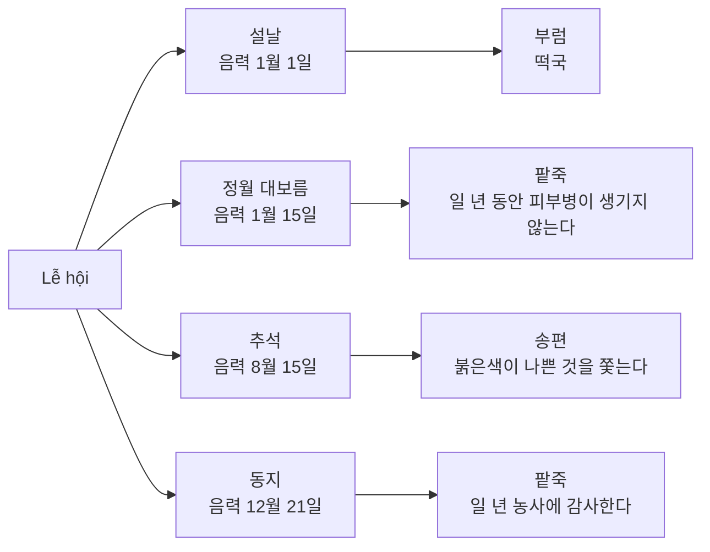
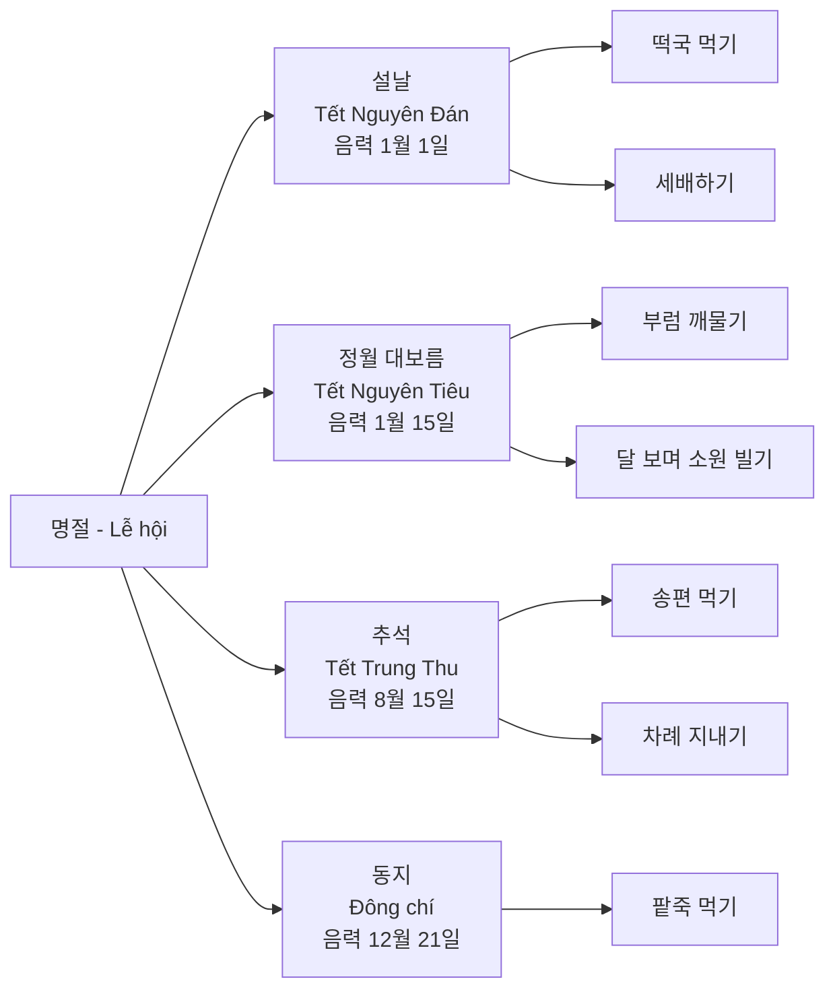
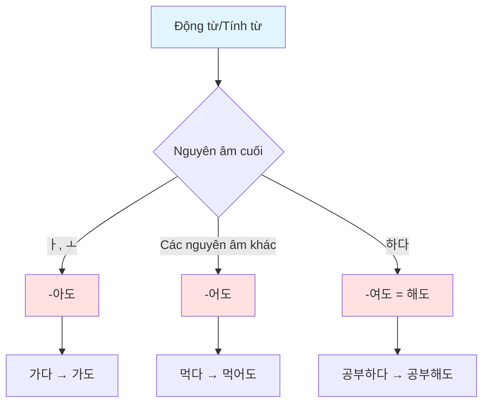
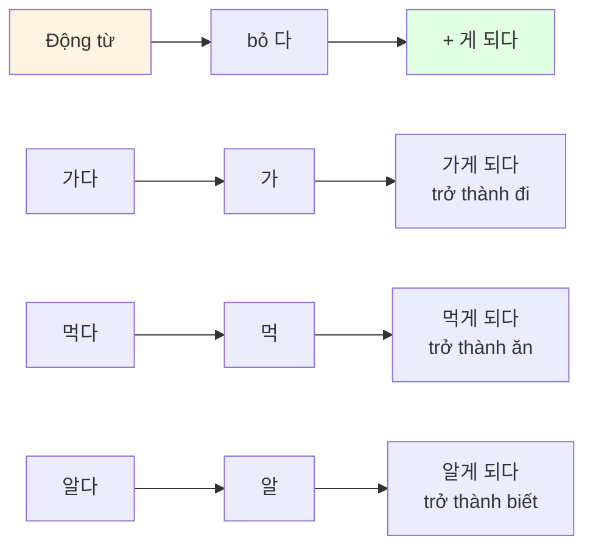
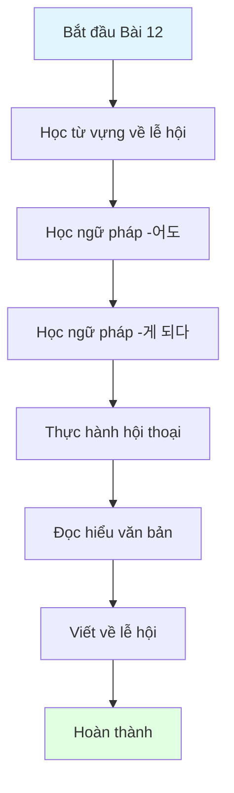

# Bài 12: 전통 명절 (Các Lễ Hội Truyền Thống)

## 📚 Mục tiêu học tập

Sau khi hoàn thành bài học này, học viên sẽ có khả năng:
- Hiểu và sử dụng từ vựng liên quan đến các lễ hội truyền thống Hàn Quốc
- Nắm vững cấu trúc ngữ pháp **-어도** (mặc dù, dù cho)
- Phân biệt và sử dụng **-게 되다** (trở nên, trở thành)
- Giao tiếp về các phong tục tập quán trong ngày lễ

---

## 🎯 KHỞI ĐỘNG

### Câu hỏi mở đầu

**어떤 명절이에요? 이 사람들은 무엇을 하고 있어요?**
_(Đây là ngày lễ nào? Những người này đang làm gì?)_

**여러분은 설날과 추석에 어떻게 지내요?**
_(Các bạn trải qua Tết Nguyên Đán và Trung Thu như thế nào?)_

---

## 📖 I. TỪ VỰNG (어휘)

### 1. Từ vựng về các lễ hội truyền thống

| **Tiếng Hàn** | **Nghĩa tiếng Việt** | **Ví dụ** |
|---------------|---------------------|-----------|
| 명절 | lễ hội, ngày lễ | 한국의 대표적인 명절에는 설날과 추석이 있다. |
| 전통 | truyền thống | 또한 전통적으로 가족과 친척들이 모여 윷놀이를 하거나 아이들은 연날리기, 제기차기 놀이를 즐기기도 했다. |
| 설날 | Tết Nguyên Đán | 설날은 음력 1월 1일이다. |
| 정월 대보름 | Tết Nguyên Tiêu | 부럼을 먹으면 일 년 동안 피부병이 생기지 않는다. |
| 추석 | Tết Trung Thu | 추석은 음력 8월 15일로 한가위라고도 한다. |
| 동지 | Đông chí | 동지에는 팥죽을 먹는다. |
| 풍습 | phong tục | 창포물에 머리를 감는 풍습이 있었으며 남자들은 씨름을 하고 여자들은 그네를 탔다. |
| 세배 | lạy chúc Tết | 세배 인사를 할 때 아랫사람이 웃사람에게 세배를 한다. |
| 차례 | lễ tế tổ tiên | 추석에는 조상에게 차례를 지낸다. |
| 성묘 | viếng mộ | 추석에 성묘를 한다. |

### 2. Từ vựng về món ăn ngày lễ

| **Tiếng Hàn** | **Nghĩa tiếng Việt** | **Ví dụ** |
|---------------|---------------------|-----------|
| 떡국 | súp bánh gạo | 한국 사람들은 설날에 떡국을 먹어야 나이가 한 살 더 먹어진다고 생각하거든요. |
| 팥죽 | cháo đậu đỏ | 동지에는 붉은색의 팥죽을 먹는다. |
| 송편 | bánh Songpyeon | 추석에는 송편을 빚어서 먹는데 송편을 예쁘게 빚으면 예쁜 아이를 낳는다는 말도 전해지고 있다. |
| 전 | bánh rán | 명절에 전을 만든다. |
| 나물 | rau trộn | 명절에 나물을 만든다. |

### 3. Từ vựng về hoạt động ngày lễ

| **Tiếng Hàn** | **Nghĩa tiếng Việt** |
|---------------|---------------------|
| 가족과 친척들이 모여 윷놀이를 하다 | gia đình và họ hàng sum họp chơi trò chơi yut |
| 연날리기, 제기차기 놀이를 즐기다 | thích chơi thả diều, đá cầu |
| 보름달을 보며 소원을 빌다 | nhìn trăng rằm cầu nguyện ước mơ |
| 햇곡식과 햇과일로 차례를 지내다 | làm lễ tế tổ tiên bằng ngũ cốc và trái cây mới |
| 덕담을 하다 | chúc lời tốt lành |
| 세뱃돈을 받다 | nhận tiền mừng tuổi |

### 4. Từ vựng bổ sung

| **Tiếng Hàn** | **Nghĩa tiếng Việt** | **Ví dụ** |
|---------------|---------------------|-----------|
| 한가위 | tên gọi khác của Trung Thu | 추석은 음력 8월 15일로 한가위라고도 한다. |
| 황금연휴 | kỳ nghỉ vàng | 명절에 황금연휴가 있다. |
| 귀성 전쟁 | cuộc chiến về quê | 명절에는 귀성 전쟁이 시작된다. |
| 귀성객 | người về quê | 귀성객들이 터미널에 모인다. |
| 귀성길 | đường về quê | 귀성길이 막힌다. |
| 고속 도로 | đường cao tốc | 고속 도로가 붐빈다. |
| 붐비다 | trở nên đông đúc | 명절에 터미널이 붐빈다. |
| 더도 말고 덜도 말고 한가위만 같아라 | Không nhiều không ít, chỉ mong như Trung Thu | 더도 말고 덜도 말고 한가위만 같아라. |
| 건강하기 바라다 | mong mỏi sức khỏe | 건강하게 오래 살기를 기원한다. |
| 부럼 | các loại hạt | 부럼을 먹으면 일 년 동안 피부병이 생기지 않는다. |
| 달을 보면서 소원을 빌다 | nhìn trăng rằm cầu nguyện | 전통적으로 추석 밤에는 보름달을 바라보면서 소원을 빌었다. |
| 세배 인사 | lời chào năm mới, lễ lạy Tết | 설날에는 아무리 바빠도 가족들이 모두 모여서 세배 인사를 한다. |
| 웃사람 | người lớn tuổi hơn | 세배를 받은 웃사람은 아랫사람에게 덕담을 해 주고, 아이들에게는 세뱃돈을 준다. |
| 아랫사람 | người nhỏ tuổi hơn | 세배 인사를 할 때 아랫사람이 웃사람에게 세배를 한다. |
| 함께 | cùng nhau | 그리고 함께 떡국을 먹는다. |
| 윷놀이 | trò chơi Yut | 전통적으로 가족과 친척들이 모여 윷놀이를 하거나 아이들은 연날리기, 제기차기 놀이를 즐기기도 했다. |
| 연날리기 | thả diều | 아이들은 연날리기, 제기차기 놀이를 즐기기도 했다. |
| 제기차기 | đá cầu | 아이들은 연날리기, 제기차기 놀이를 즐기기도 했다. |
| 햇곡식 | ngũ cốc mới thu hoạch | 그 해에 처음으로 얻은 햇곡식과 햇과일을 준비해서 조상에게 감사하는 마음을 표현하는 것이다. |
| 햇과일 | trái cây mới thu hoạch | 그 해에 처음으로 얻은 햇곡식과 햇과일을 준비해서 조상에게 감사하는 마음을 표현하는 것이다. |
| 빚다 | nặn, làm (bánh) | 추석에는 송편을 빚어서 먹는데 송편을 예쁘게 빚으면 예쁜 아이를 낳는다는 말도 전해지고 있다. |
| 표현하다 | biểu hiện, thể hiện | 조상에게 감사하는 마음을 표현하는 것이다. |
| 전해지다 | được truyền lại | 송편을 예쁘게 빚으면 예쁜 아이를 낳는다는 말도 전해지고 있다. |
| 직접 | trực tiếp | 친척이나 아는 사람들을 직접 찾아가는 대신에 명절 인사를 문자 메시지로 보낸다. |
| 문자 메시지 | tin nhắn văn bản | 친척이나 아는 사람들을 직접 찾아가는 대신에 명절 인사를 문자 메시지로 보낸다. |
| 개인적 | cá nhân | 개인적인 시간을 보내기도 한다. |
| 휴식하다 | nghỉ ngơi | 일상에서 휴식하는 의미가 더 커지게 되었다. |
| 피부병 | bệnh da | 부럼을 먹으면 일 년 동안 피부병이 생기지 않는다. |
| 쫓다 | xua đuổi | 붉은색이 나쁜 것을 쫓는다. |
| 농사 | công việc nông nghiệp, vụ mùa | 일 년 농사에 감사한다. |
| 감사하다 | cảm ơn | 조상에게 감사하는 마음을 표현하는 것이다. |
| 붉은색 | màu đỏ | 붉은색의 팥죽을 먹는다. |
| 생기다 | sinh ra, xuất hiện | 일 년 동안 피부병이 생기지 않는다. |
| 기원하다 | cầu nguyện | 건강하게 오래 살기를 기원한다. |
| 창포물 | nước thủy thương bồ | 창포물에 머리를 감는 풍습이 있었으며 남자들은 씨름을 하고 여자들은 그네를 탔다. |
| 씨름 | đấu vật | 남자들은 씨름을 하고 여자들은 그네를 탔다. |
| 그네 | đu, xích đu | 남자들은 씨름을 하고 여자들은 그네를 탔다. |
| 규모 | quy mô | 규모도 크고 내용도 다양하여 한국을 대표하는 축제이자 민속놀이로 널리 알려져 2005년에 유네스코 세계 무형유산이 되었다. |
| 내용 | nội dung | 규모도 크고 내용도 다양하여 한국을 대표하는 축제이자 민속놀이로 널리 알려져 2005년에 유네스코 세계 무형유산이 되었다. |
| 다양하다 | đa dạng | 내용도 다양하여 한국을 대표하는 축제이자 민속놀이로 널리 알려져 2005년에 유네스코 세계 무형유산이 되었다. |
| 민속놀이 | trò chơi dân gian | 한국을 대표하는 축제이자 민속놀이로 널리 알려져 2005년에 유네스코 세계 무형유산이 되었다. |
| 널리 | rộng rãi | 한국을 대표하는 축제이자 민속놀이로 널리 알려져 2005년에 유네스코 세계 무형유산이 되었다. |
| 유네스코 | UNESCO | 2005년에 유네스코 세계 무형유산이 되었다. |
| 세계 무형유산 | Di sản văn hóa phi vật thể thế giới | 강릉 단오제는 세계가 함께 지켜야 할 문화유산으로서의 의미를 갖게 되었다. |
| 지역 주민 | cư dân địa phương | 강릉 단오제는 온 지역 주민들이 하나가 되는 축제이다. |
| 문화유산 | di sản văn hóa | 세계가 함께 지켜야 할 문화유산으로서의 의미를 갖게 되었다. |
| 공동체 | cộng đồng | 한국에서는 예로부터 마을 공동체의 신앙을 바탕으로 풍년과 지역의 안전을 기원하였다. |
| 신앙 | tín ngưỡng | 마을 공동체의 신앙을 바탕으로 풍년과 지역의 안전을 기원하였다. |
| 바탕 | nền tảng, cơ sở | 마을 공동체의 신앙을 바탕으로 풍년과 지역의 안전을 기원하였다. |
| 풍년 | năm mùa màng bội thu | 풍년과 지역의 안전을 기원하였다. |
| 안전 | an toàn | 풍년과 지역의 안전을 기원하였다. |
| 제사 | lễ tế | 매년 풍요를 바라는 제사와 공연을 올리고 참가자들을 위한 여러 행사도 진행하고 있다. |
| 공연 | biểu diễn | 매년 풍요를 바라는 제사와 공연을 올리고 참가자들을 위한 여러 행사도 진행하고 있다. |
| 올리다 | dâng lên, tổ chức | 매년 풍요를 바라는 제사와 공연을 올리고 참가자들을 위한 여러 행사도 진행하고 있다. |
| 참가자 | người tham gia | 참가자들을 위한 여러 행사도 진행하고 있다. |
| 행사 | sự kiện | 참가자들을 위한 여러 행사도 진행하고 있다. |
| 진행하다 | tiến hành | 참가자들을 위한 여러 행사도 진행하고 있다. |
| 근하신년 | cung chúc năm mới | 근하신년 복 많이 받으세요. |
| 귀성계 | kế hoạch về quê | 귀성계를 세우다. |
| 넉넉하다 | dư dả, rộng rãi | 넉넉한 한가위 되세요. |
| 풍성하다 | phong phú, dồi dào | 풍성한 한가위 되세요. |
| 가득하다 | đầy ắp | 행복이 가득한 명절 되세요. |
| 발다 | sáng | 보름달이 밝다. |
| 천지를 | trời đất | 천지를 밝히다. |
| 보름달 | trăng rằm | 전통적으로 추석 밤에는 보름달을 바라보면서 소원을 빌었다. |
| 오곡밥 | cơm năm loại ngũ cốc | 정월 대보름에 오곡밥을 먹는다. |
| 강강술래 | Ganggangsullae | 추석에 강강술래를 한다. |
| 액운 | vận xui | 액운을 쫓다. |
| 팥속 | nhân đậu đỏ | 송편에 팥속을 넣는다. |
| 세배하다 | lạy chúc Tết | 설날에 세배하다. |
| 설빔을 입다 | mặc quần áo mới ngày Tết | 설날에 설빔을 입다. |
| 새해를 맞다 | đón năm mới | 새해를 맞아 복 많이 받으세요. |
| 색별 | quần áo mới (ngày Tết) | 색별을 입다. |
| 세배 인사를 하다 | chào năm mới theo cách truyền thống | 아무리 바빠도 가족들이 모두 모여서 세배 인사를 한다. |
| 모으다 | thu thập, tập hợp | 가족들이 모두 모여서 세배 인사를 한다. |
| 모이다 | tụ họp, sum họp | 가족들이 모이다. |
| 꺾다 | gãy, bẻ gãy | 꽃을 꺾다. |
| 만물 | vạn vật | 단오는 음력 5월 5일로 1년 중에서 만물의 기운이 가장 강한 날이다. |
| 기운 | khí, năng lượng | 만물의 기운이 가장 강한 날이다. |
| 강하다 | mạnh, khỏe | 기운이 강하다. |
| 음식 | đồ ăn, thức ăn | 만물에서 나는 것으로 음식을 만들어 먹고 창포물에 머리를 감는 풍습이 있었다. |
| 만들다 | làm, chế tạo | 음식을 만들어 먹고 창포물에 머리를 감는 풍습이 있었다. |
| 연휴 | kỳ nghỉ liên tiếp | 과장님도 연휴 동안 잘 지내셨어요? |
| 시대 | thời đại | 시대가 바뀌면서 현대의 명절 모습도 예전과 많이 달라졌다. |
| 바뀌다 | thay đổi | 시대가 바뀌면서 현대의 명절 모습도 예전과 많이 달라졌다. |
| 현대 | hiện đại | 현대의 명절 모습도 예전과 많이 달라졌다. |
| 예전 | trước đây | 현대의 명절 모습도 예전과 많이 달라졌다. |
| 찾아가다 | đi thăm | 친척이나 아는 사람들을 직접 찾아가는 대신에 명절 인사를 문자 메시지로 보낸다. |
| 대신에 | thay vì | 친척이나 아는 사람들을 직접 찾아가는 대신에 명절 인사를 문자 메시지로 보낸다. |
| 여행 | du lịch | 그리고 가족들이 함께 여행을 가기도 하고 개인적인 시간을 보내기도 한다. |
| 의미 | ý nghĩa | 요즘은 오랜만에 가족이 모인다는 의미와 일상에서 휴식하는 의미가 더 커지게 되었다. |
| 커지다 | trở nên lớn hơn | 요즘은 오랜만에 가족이 모인다는 의미와 일상에서 휴식하는 의미가 더 커지게 되었다. |
| 일상 | đời thường, cuộc sống hàng ngày | 일상에서 휴식하는 의미가 더 커지게 되었다. |
| 뵈다 | thăm, gặp (kính ngữ) | 아무리 바빠도 명절에는 부모님을 뵈러 가니까요. |
| 고향 | quê hương | 고향 부모님 댁에 다녀왔어요. |
| 댁 | nhà (kính ngữ) | 고향 부모님 댁에 다녀왔어요. |
| 다녀오다 | đi và trở về | 고향 부모님 댁에 다녀왔어요. |
| 터미널 | bến xe, ga | 터미널이 붐빈다. |
| 주차장 | bãi đậu xe | 주차장이 가득하다. |
| 결석하다 | vắng mặt | 고쳔 씨는 몸이 아무리 아파도 수업 시간에 결석하지 않는다. |
| 차가운 | lạnh (tính từ) | 차가운 커피를 마시다. |

### 5. Bài tập từ vựng

#### 1. 한국에는 어떤 명절이 있어요? 명절이 언제이고 명절에 어떤 음식을 먹는지 이야기해 보세요.

**Ở Hàn Quốc có những ngày lễ nào? Hãy nói về các ngày lễ diễn ra khi nào và ăn món gì trong ngày lễ đó.**



| **Món ăn** | **Lễ hội** | **Ý nghĩa** |
|------------|-----------|-------------|
| 부럼 (các loại hạt) | 설날 | 건강하게 오래 살기를 기원한다 |
| 팥죽 (cháo đậu đỏ) | 정월 대보름 | 일 년 동안 피부병이 생기지 않는다 |
| 송편 (bánh Songpyeon) | 추석 | 붉은색이 나쁜 것을 쫓는다 |
| 팥죽 (cháo đậu đỏ) | 동지 | 일 년 농사에 감사한다 |

#### 2. 설날과 추석에는 어떤 풍습과 놀이가 있어요? 이야기해 보세요.

**Trong Tết Nguyên Đán và Trung Thu có những phong tục và trò chơi gì? Hãy kể lại.**

| **Hình ảnh** | **Mô tả** |
|--------------|-----------|
|  | 가족과 친척들이 모여 윷놀이를 하다<br/>_(Gia đình và họ hàng sum họp chơi trò Yut)_ |
|  | 연날리기, 제기차기 놀이를 즐기다<br/>_(Thích chơi thả diều, đá cầu)_ |
|  | 보름달을 보며 소원을 빌다<br/>_(Nhìn trăng rằm cầu nguyện ước mơ)_ |
|  | 햇곡식과 햇과일로 차례를 지내다<br/>_(Làm lễ tế tổ tiên bằng ngũ cốc và trái cây mới)_ |

---

## 📘 II. NGỮ PHÁP (문법)

### 1. **-어도** (Mặc dù, dù cho)

#### 📌 Định nghĩa
Cấu trúc **-어도** được sử dụng để diễn tả ý nghĩa "mặc dù, dù cho", cho biết hành động hay tình trạng ở mệnh đề sau không bị ảnh hưởng bởi hành động hay tình trạng ở mệnh đề trước.

#### 📌 Cấu trúc

```
Động từ/Tính từ + -어도/-아도/-여도
```

**Quy tắc biến đổi:**

| **Dạng gốc** | **Thêm** | **Kết quả** |
|--------------|----------|-------------|
| 먹다 (ăn) | → | 먹어도 |
| 가다 (đi) | → | 가도 |
| 적다 (ít) | → | 적어도 |
| 가깝다 (gần) | → | 가까워도 |

#### 📌 Ví dụ minh họa

| **Tiếng Hàn** | **Tiếng Việt** |
|---------------|----------------|
| 가: 비가 오면 어떤 행사가 취소됩니까? | A: Nếu trời mưa, sự kiện nào bị hủy? |
| 나: 아닙니다. 비가 **와도** 행사는 진행됩니다. | B: Không. **Dù** trời mưa, sự kiện vẫn tiến hành. |
| 나는 시간이 **없어도** 아침밥을 꼭 먹는다. | Tôi **dù** không có thời gian vẫn nhất định ăn sáng. |
| 고쳔 씨는 몸이 아무리 **아파도** 수업 시간에 결석하지 않는다. | Dù cơ thể **có đau** đến đâu, Go Chon cũng không vắng mặt trong giờ học. |
| 날씨가 **춥다** → **추워도** | Thời tiết lạnh → **Dù** lạnh |
| 차가운 커피만 **마시다** → **마셔도** | Chỉ uống cà phê lạnh → **Dù** uống |

#### 📌 So sánh với các cấu trúc tương tự

| **Cấu trúc** | **Ý nghĩa** | **Ví dụ** |
|--------------|-------------|-----------|
| -어도 | mặc dù, dù cho | 비가 와도 갑니다 (Dù mưa vẫn đi) |
| -지만 | nhưng, tuy nhiên | 비가 오지만 갑니다 (Trời mưa nhưng vẫn đi) |
| -(으)ㄴ데도 | mặc dù... nhưng | 비가 오는데도 갑니다 (Mặc dù mưa nhưng vẫn đi) |

#### 📌 Bài tập thực hành

**1. 그림을 보고 보기와 같이 친구와 이야기해 보세요.**

**Hãy xem tranh và nói chuyện với bạn theo mẫu.**

```
보기: 매일 운동을 해요?
      → 네, 저는 아무리 피곤해도 매일 운동을 해요.

피곤하다 → 매일 운동을 하다
```

| **Tình huống** | **Câu hỏi** | **Trả lời** |
|---------------|-------------|-------------|
| 1) 날씨가 춥다 | 어제도 조깅을 했어요? | 네, 날씨가 **추워도** 조깅을 했어요. |
| | | 차가운 커피만 **마셔도** 괜찮아요. |
| 2) 늦게 자다 | 매일 6시에 일어나요? | 네, 늦게 **자도** 6시에 꼭 일어나요. |
| 3) 한국어로 말하는 것이 어렵다 | 평소에도 한국어로만 대화해요? | 네, 한국어로 말하는 것이 **어려워도** 평소에 한국어로만 대화해요. |

**2. 여러분이 매일 꼭 하는 일에 대해 친구들과 이야기해 보세요.**

**Hãy nói chuyện với bạn bè về những việc bạn nhất định phải làm mỗi ngày.**

```
보기:
A: 힘들어도 꼭 하는 일이 있어요?
B: 저는 늦은 후에 힘들어도 아이와 놀아 줘요.
```

---

### 2. **-게 되다** (Trở nên, trở thành)

#### 📌 Định nghĩa
Cấu trúc **-게 되다** biểu thị sự thay đổi về tình trạng, hành động hoặc kết quả do ảnh hưởng từ yếu tố bên ngoài hoặc sự phát triển tự nhiên của tình huống.

#### 📌 Cấu trúc

```
Động từ + -게 되다
```

**Lưu ý:** Không dùng với tính từ.

#### 📌 Ví dụ minh họa

| **Tiếng Hàn** | **Tiếng Việt** |
|---------------|----------------|
| 건강하게 오래 살기를 기원한다. | Cầu mong sống lâu khỏe mạnh. |
| 일 년 동안 피부병이 생기지 않는다. | Cả năm không bị bệnh da. |
| 붉은색이 나쁜 것을 쫓는다. | Màu đỏ xua đuổi điều xấu. |
| 일 년 농사에 감사한다. | Cảm ơn vụ mùa trong năm. |
| 상사가 안 대서 **가게 되었다**. | Vì sếp không đến nên tôi **phải đi**. |
| 이번에 새로운 회사에 **들어가게 되어서** 정말 기쁩니다. | Lần này **được vào** công ty mới nên thực sự vui. |

#### 📌 Bảng động từ minh họa

| **Động từ gốc** | **-게 되다** | **Ý nghĩa** |
|----------------|-------------|-------------|
| 가다 (đi) | 가게 되다 | trở thành đi |
| 먹다 (ăn) | 먹게 되다 | trở thành ăn |
| 알다 (biết) | 알게 되다 | trở thành biết |
| 만나다 (gặp) | 만나게 되다 | trở thành gặp |

#### 📌 Bài tập thực hành

**1. 보기의 같이 친구와 이야기해 보세요.**

**Hãy nói chuyện với bạn theo mẫu.**

```
보기:
A: 안젤라 씨는 한국에 와서 달라진 점이 있어요?
B: 고향에서는 매운 음식을 못 먹었는데 이제는 매운 음식을 잘 먹어요.

이름:     한국에 오기 전          한국에 온 후
안젤라    매운 음식을 못 먹다     매운 음식을 잘 먹다
```

| **이름** | **한국에 오기 전** | **한국에 온 후** |
|---------|------------------|-----------------|
| 1) 잔시드 | 밤에 일찍 자다<br/>차가운 커피만 마시다 | 늦게 자다<br/>한국 문화를 이해하다 |
| 2) 이랑 | 한국 문화를 못 모르다 | 한국 문화를 이해하다 |
| 3) 아나이스 | 한국의 명절 풍습을 모르다 | 설날과 추석에 대해 잘 알다 |
| 4) 제이슨 | 한국어를 한 마디도 못하다 | 한국어를 어느 정도 할 수 있다 |

**2. 여러분이 한국 생활을 하면서 달라진 점에 대해 이야기해 보세요.**

**Hãy nói về những điểm đã thay đổi khi các bạn sống ở Hàn Quốc.**

```
보기:
처음에는 한국 역사에 대해 관심이 없었는데
역사 드라마를 보고 관심을 가지게 됐어요.
```

**단어장:**
- 풍습 (phong tục)

---

## 🗣️ III. HỘI THOẠI (말하기)

### Hội thoại 1: Về ngày lễ Tết

**과장님:** 안젤라 씨, 명절 잘 보냈어요?
_(Angela, ngày lễ vui vẻ chứ?)_

**안젤라:** 네, 잘 보냈어요. 과장님도 연휴 동안 잘 지내셨어요?
_(Vâng, rất vui. Trưởng phòng cũng nghỉ lễ vui vẻ chứ ạ?)_

**과장님:** 고향 부모님 댁에 다녀왔어요. 아무리 바빠도 명절에는 부모님을 뵈러 가니까요. 그런데 안젤라 씨, 설날에 떡국 먹어 봤어요?
_(Tôi đã về thăm nhà bố mẹ ở quê. Dù bận đến đâu, ngày lễ cũng phải về thăm bố mẹ. Nhân tiện, Angela đã thử ăn súp bánh gạo ngày Tết chưa?)_

**안젤라:** 아니요. 설날에 떡국을 먹어야 해요?
_(Chưa ạ. Ngày Tết phải ăn súp bánh gạo à?)_

**과장님:** 그럼요. 안젤라 씨, 한국에서는 해가 바뀔 때 나이가 한 살 많아지잖아요. 그런데 한국 사람들은 설날에 떡국을 먹어야 나이가 한 살 더 먹어진다고 생각하거든요.
_(Đương nhiên rồi. Angela à, ở Hàn Quốc khi sang năm mới thì tuổi tăng lên một tuổi đúng không? Người Hàn Quốc tin rằng phải ăn súp bánh gạo vào ngày Tết thì mới tròn thêm một tuổi.)_

**안젤라:** 그래요? 그래서 생일이 안 지났는데 한국 나이로는 한 살이 더 많은 거군요. 과장님 덕분에 한국 문화를 잘 알게 됐어요.
_(Vậy à? Vì vậy mà dù chưa đến sinh nhật nhưng theo tuổi Hàn Quốc thì đã nhiều hơn một tuổi rồi. Nhờ trưởng phòng mà tôi hiểu rõ hơn về văn hóa Hàn Quốc.)_

#### 💡 Điểm ngữ pháp trong hội thoại:
1. **아무리 바빠도** - dù bận đến đâu (sử dụng -어도)
2. **한국 문화를 잘 알게 됐어요** - đã hiểu rõ văn hóa Hàn Quốc (sử dụng -게 되다)

### Bài tập 말하기

#### 1. 안젤라 씨와 과장님이 명절 풍경에 대해 이야기합니다. 다음 대화처럼 이야기해 보세요.

**Angela và trưởng phòng nói chuyện về cảnh tượng ngày lễ. Hãy nói chuyện theo cuộc đối thoại sau.**

```
보기:
1) 부모님을 뵈러 가다 | 한국 문화를 잘 알게 되다
2) 차례를 지내야 하다 | 한국 사람들이 나이를 더 올려 말하는 이유를 알게 되다
```

**💡 Gợi ý các mẫu câu:**
- 부모님을 뵈러 가니까요
- 한국 문화를 잘 알게 됐어요
- 차례를 지내야 해요
- 한국 사람들이 나이를 더 올려 말하는 이유를 알게 됐어요

#### 2. 한국에서는 명절에 어떤 음식을 먹는지, 그 음식에는 어떤 의미가 있는지 이야기해 보세요.

**Hãy nói về Hàn Quốc ăn món gì trong ngày lễ và món ăn đó có ý nghĩa gì.**

| **명절** | **먹는 것** | **의미** |
|---------|-----------|---------|
| 동지 | 팥죽 | 팥죽의 붉은색이 나쁜 기운을 쫓는다 |
| 정월 대보름 | 부럼 | 부럼을 먹으면 일 년 동안 피부병에 걸리지 않는다 |

---

## 📊 IV. BIỂU ĐỒ MINH HỌA

### 1. Sơ đồ các lễ hội truyền thống Hàn Quốc



### 2. Cấu trúc ngữ pháp -어도



### 3. Cấu trúc ngữ pháp -게 되다



### 4. Luồng học tập bài 12



---

## 👂 IV-B. NGHE (듣기)

### 1. 여러분은 명절에 어디에 갑니까? 다음의 신문 기사 제목을 보고 기사가 어떤 내용일지 이야기해 보세요.

**Các bạn đi đâu trong ngày lễ? Hãy xem tiêu đề báo sau và nói về nội dung bài báo sẽ như thế nào.**

📰 **Tiêu đề báo:**
- **더도 말고 덜도 말고 한가위만 같아라**
  _(Không nhiều không ít, chỉ mong như ngày Trung Thu)_
- **황금연휴 첫날, 귀성 전쟁 시작대**
  _(Ngày đầu kỳ nghỉ vàng, cuộc chiến về quê bắt đầu)_
- **귀성객들로 주차장이 된 고속 도로, 기차역과 버스 터미널도 붐벼**
  _(Đường cao tốc thành bãi đỗ xe vì người về quê, ga tàu và bến xe cũng đông đúc)_

### 2. 뉴스에서 기자가 이야기합니다. 잘 듣고 질문에 답해 보세요.

**Phóng viên đang nói chuyện trong tin tức. Hãy nghe kỹ và trả lời câu hỏi.**

🎧 **[12L.mp3]**

#### 1) 기자는 어떤 명절에 대해 말하고 있습니까?

_________________________________

#### 2) 고향에서 서울로 올라오는 부모들이 많은 이유는 무엇입니까?

_________________________________

#### 3) 들은 내용과 같으면 O, 다르면 X 하세요.

| **내용** | **O/X** |
|---------|---------|
| ① 기차표는 예매로만 살 수 있다. | (   ) |
| ② 이번 명절 연휴는 평소보다 짧다. | (   ) |
| ③ 내일부터는 기차역에 사람들이 적어질 것이다. | (   ) |

### 3. Quy tắc phát âm

#### 📌 받침 발음 (Phát âm phụ âm cuối)

**Biểu đồ minh họa:**

```mermaid
flowchart LR
    A[받침] --> B[ㄴ - 설날]
    A --> C[ㄹ - 일 년]
    A --> D[ㅁ - 연락]

    B --> B1[설날 → [설날]]
    C --> C1[일 년 → [일 련]]
    D --> D1[연락 → [열락]]
```

**Ví dụ từ bài học:**
1. **설날**에 뭐 해요? → [설날]
2. 동지는 **일 년** 중 가장 밤이 길다. → [일 련]
3. 오랫만에 **친척들**과 **연락**을 했다. → [철락]

**💡 Lưu ý từ vựng:**
- 한가위 (Trung Thu)
- 황금연휴 (kỳ nghỉ vàng)
- 귀성 전쟁 (cuộc chiến về quê)
- 귀성객 (người về quê)
- 고속 도로 (đường cao tốc)
- 붐비다 (đông đúc)

---

## 📝 V. BÀI TẬP THỰC HÀNH

### Bài tập 1: Kết hợp tranh với câu mô tả

Hãy nối các món ăn với lễ hội tương ứng:

| **Món ăn** | **Lễ hội** | **Ý nghĩa** |
|------------|-----------|-------------|
| 떡국 (súp bánh gạo) | 설날 | Cầu mong sống lâu khỏe mạnh |
| 부럼 (các loại hạt) | 정월 대보름 | Cả năm răng khỏe, không bệnh da |
| 송편 (bánh Songpyeon) | 추석 | Cảm ơn vụ mùa trong năm |
| 팥죽 (cháo đậu đỏ) | 동지 | Màu đỏ xua đuổi điều xấu |

### Bài tập 2: Điền vào chỗ trống với -어도/-게 되다

1. 날씨가 춥다 → 날씨가 __________ 괜찮아요.
2. 6시에 꼭 일어나다 → 6시에 꼭 __________.
3. 한국어를 말하는 것이 어렵다 → 한국어를 말하는 것이 __________.
4. 평소에 한국어로만 말하다 → 평소에 한국어로만 __________.

**Đáp án:**
1. 추워도
2. 일어나게 됩니다
3. 어려워도
4. 말하게 됩니다

### Bài tập 3: Trả lời câu hỏi

1. 기자는 어떤 명절에 대해 말하고 있습니까?
   - _______________________________

2. 고향에서 서울로 올라오는 부모들이 많은 이유는 무엇입니까?
   - _______________________________

3. 들은 내용과 같으면 O, 다르면 X 하세요.
   - ① 기자표는 예매로만 살 수 있다. ( )
   - ② 이번 명절 연휴는 평소보다 짧다. ( )
   - ③ 내일부터는 기차역에 사람들이 적어질 것이다. ( )

---

## 📖 VI. ĐỌC HIỂU (읽기)

### 1. 다음은 명절에 보내는 인사말입니다. 설날과 추석에 보통 어떤 인사말을 보내는지 이야기해 보세요.

**Dưới đây là lời chúc trong ngày lễ. Hãy nói về thường gửi lời chào gì trong Tết Nguyên Đán và Trung Thu.**

📱 **Tin nhắn 1:**
```
새해 복 많이 받으십시오.
새해에도 건강하고 평안하시기 바랍니다.
```
_(Chúc năm mới nhiều phước lành. Mong năm mới bạn khỏe mạnh và bình an.)_

📱 **Tin nhắn 2:**
```
근하신년!

새해에도 뜻 한 것 이루시고
가정에 행복이 가득하시길 바랍니다.
```
_(Cung chúc năm mới! Chúc năm mới thành tựu điều mong muốn và gia đình tràn đầy hạnh phúc.)_

📱 **Tin nhắn 3:**
```
가족, 친척들과 함께
보름달처럼 넉넉하고 풍성한 한가위
보내십시오.
```
_(Cùng gia đình, họ hàng trải qua một Trung Thu dư dả và phong phú như trăng rằm.)_

📱 **Tin nhắn 4:**
```
추석이 다가왔습니다.
감사와 행복이 넘치는
추석 연휴 보내시길 바랍니다.
```
_(Trung Thu đã đến gần. Chúc bạn trải qua kỳ nghỉ Trung Thu tràn đầy lòng biết ơn và hạnh phúc.)_

### 2. 설날 풍경입니다. 사람들이 무엇을 하고 있는지 이야기해 보세요.

**Đây là cảnh tượng Tết Nguyên Đán. Hãy nói về những người đang làm gì.**

🖼️ **Hình minh họa:**
```
올해에도 건강하게 지내고
공부 열심히 해라!
```

**Các hoạt động trong ngày Tết:**

| **Hoạt động** | **Từ vựng** |
|--------------|-------------|
| 덕담을 하다 | Chúc lời tốt lành |
| 세배하다 | Lạy chúc Tết |
| 세뱃돈을 받다 | Nhận tiền mừng tuổi |

### 3. Đoạn văn: 한국의 명절

한국의 대표적인 명절에는 **설날**과 **추석**이 있다. 설날은 음력 1월 1일이다. 설날에는 아무리 바빠도 가족들이 모두 모여서 세배 인사를 한다. 세배 인사를 할 때 아랫사람이 웃사람에게 세배를 한다. 세배를 받은 웃사람은 아랫사람에게 덕담을 해 주고, 아이들에게는 세뱃돈을 준다. 그리고 함께 떡국을 먹는다. 설날에 떡국을 먹으면 나이도 한 살 더 먹는다고 생각한다. 또한 전통적으로 가족과 친척들이 모여 윷놀이를 하거나 아이들은 연날리기, 제기차기 놀이를 즐기기도 했다.

한국의 또 다른 큰 명절인 **추석**은 음력 8월 15일로 한가위라고도 한다. 추석에는 조상에게 차례를 지낸다. 그 해에 처음으로 얻은 햇곡식과 햇과일을 준비해서 조상에게 감사하는 마음을 표현하는 것이다. 그리고 추석에는 송편을 빚어서 먹는데 송편을 예쁘게 빚으면 예쁜 아이를 낳는다는 말도 전해지고 있다. 또한 전통적으로 추석 밤에는 보름달을 바라보면서 소원을 빌었다.

그런데 시대가 바뀌면서 현대의 명절 모습도 예전과 많이 달라졌다. 친척이나 아는 사람들을 직접 찾아가는 대신에 명절 인사를 문자 메시지로 보낸다. 그리고 가족들이 함께 여행을 가기도 하고 개인적인 시간을 보내기도 한다. 요즘은 오랜만에 가족이 모인다는 의미와 일상에서 휴식하는 의미가 더 커지게 되었다.

#### Câu hỏi đọc hiểu:

1. **설날에 대한 설명으로 맞는 것은 무엇입니까?**
   - ① 아이들은 세배하고 세뱃돈을 받는다.
   - ② 아이들은 어른들에게 덕담을 한다.
   - ③ 떡국은 새로 수확한 쌀로 만든다.
   - ④ 웃놀이는 아이들만 즐기는 놀이다.

2. **추석에 대한 설명으로 맞지 않는 것은 무엇입니까?**
   - ① 한가위라고도 한다.
   - ② 부모님께 세배를 한다.
   - ③ 송편을 빚어서 먹는다.
   - ④ 달을 보면서 소원을 빈다.

3. **요즘 명절의 모습이 어떻게 바뀌었습니까?**
   - ① _______________________________
   - ② _______________________________

---

## 🌏 VII. VĂN HÓA VÀ THÔNG TIN (문화와 정보)

### 강릉 단오제 (Lễ hội Danoje Gangneung)

한국의 4대 명절은 **설날, 한식, 단오, 추석**이다. 그중에서 **단오**는 음력 5월 5일로 1년 중에서 만물의 기운이 가장 강한 날이다. 그러서 만물에서 나는 것으로 음식을 만들어 먹고 창포물에 머리를 감는 풍습이 있었으며 남자들은 씨름을 하고 여자들은 그네를 탔다.

**강릉 단오제**는 강릉 지역에서 단오 때 행해진 온 축제로 한국의 단오 축제 중에서 가장 유명하다. 규모도 크고 내용도 다양하여 한국을 대표하는 축제이자 민속놀이로 널리 알려져 2005년에 유네스코 세계 무형유산이 되었다. 이에 따라 강릉 단오제는 온 지역 주민들이 하나가 되는 축제이면서 세계가 함께 지켜야 할 문화유산으로서의 의미를 갖게 되었다.

한국에서는 예로부터 마을 공동체의 신앙을 바탕으로 풍년과 지역의 안전을 기원하였다. 현재 강릉 단오제에서도 매년 풍요를 바라는 제사와 공연을 올리고 참가자들을 위한 여러 행사도 진행하고 있다.

#### 💡 Câu hỏi tìm hiểu:

1. 단오의 풍습에는 무엇이 있습니까?
2. 강릉 단오제는 주로 어떤 내용으로 구성됩니까?
3. 여러분 고향에도 한국의 강릉 단오제와 비슷한 지역 축제가 있습니까?

---

## ✍️ VII-B. VIẾT (쓰기)

### 1. 여러분 고향에는 어떤 명절이 있습니까? 한국의 명절과 여러분 고향의 명절은 어떻게 다릅니까?

**Quê hương các bạn có những ngày lễ nào? Ngày lễ của Hàn Quốc và quê hương các bạn khác nhau như thế nào?**

#### Bảng so sánh:

| | **한국의 명절** | **고향의 명절** |
|---|--------------|----------------|
| **명절 이름** | | |
| **(Tên ngày lễ)** | | |
| **날짜** | | |
| **(Ngày tháng)** | | |
| **음식** | | |
| **(Món ăn)** | | |
| **그 음식을 먹는 이유** | | |
| **(Lý do ăn món đó)** | | |
| **풍습** | | |
| **(Phong tục)** | | |

### 2. 한국의 명절과 고향의 명절을 비교하는 글을 써 보세요.

**Hãy viết bài so sánh ngày lễ của Hàn Quốc và quê hương bạn.**

**Gợi ý cấu trúc bài viết:**

```
한국의 명절과 고향의 명절

한국의 대표적인 명절은 _____________이다/입니다.
_____________ 음력 __월 __일이다/입니다.

이 날에는 _________________________________.
그리고 ___________________________________.

내 고향의 대표적인 명절은 _______________이다/입니다.
_____________ __월 __일이다/입니다.

이 날에는 _________________________________.
그리고 ___________________________________.

한국의 명절과 고향의 명절은 ______________ 점에서 비슷하다/습니다.
하지만 ________________ 점에서 다르다/습니다.
```

**💡 Từ vựng gợi ý:**
- 비슷하다 (giống nhau)
- 다르다 (khác nhau)
- 공통점 (điểm chung)
- 차이점 (điểm khác biệt)
- 전통 (truyền thống)
- 의미 (ý nghĩa)

---

## 📋 VIII. BẢNG TÓM TẮT

### Bảng so sánh các lễ hội

| **Lễ hội** | **Thời gian (âm lịch)** | **Món ăn đặc trưng** | **Phong tục** |
|-----------|------------------------|---------------------|---------------|
| 설날 (Tết Nguyên Đán) | 1/1 | 떡국 | 세배, 세뱃돈, 연날리기, 제기차기 |
| 정월 대보름 (Tết Nguyên Tiêu) | 1/15 | 부럼, 오곡밥 | 부럼 깨물기, 달 보며 소원 빌기 |
| 추석 (Tết Trung Thu) | 8/15 | 송편 | 차례 지내기, 성묘, 강강술래 |
| 동지 (Đông chí) | 12/21 | 팥죽 | 팥죽 먹고 액운 쫓기 |

### Bảng tóm tắt ngữ pháp

| **Ngữ pháp** | **Cấu trúc** | **Ý nghĩa** | **Ví dụ** |
|-------------|-------------|-------------|-----------|
| -어도 | Động từ/Tính từ + 어도/아도 | mặc dù, dù cho | 바빠도 갑니다 (Dù bận vẫn đi) |
| -게 되다 | Động từ + 게 되다 | trở nên, trở thành | 알게 되었다 (đã trở nên biết) |

---

## ✅ IX. DANH SÁCH TỪ VỰNG ĐÃ HỌC (배운 어휘 확인)

### 📝 Hãy đánh dấu vào các từ vựng bạn đã học và ghi nhớ

| ☐ | **설날**<br/>(Tết Nguyên Đán) | ☐ | **풍습**<br/>(Phong tục) |
|---|------------------------------|---|------------------------|
| ☐ | **정월 대보름**<br/>(Tết Nguyên Tiêu) | ☐ | **한가위**<br/>(Trung Thu) |
| ☐ | **추석**<br/>(Tết Trung Thu) | ☐ | **황금연휴**<br/>(Kỳ nghỉ vàng) |
| ☐ | **동지**<br/>(Đông chí) | ☐ | **귀성계**<br/>(Kế hoạch về quê) |
| ☐ | **음력**<br/>(Âm lịch) | ☐ | **고속 도로**<br/>(Đường cao tốc) |
| ☐ | **부럼**<br/>(Các loại hạt) | ☐ | **붐비다**<br/>(Đông đúc) |
| ☐ | **팥죽**<br/>(Cháo đậu đỏ) | ☐ | **떡국**<br/>(Súp bánh gạo) |
| ☐ | **송편**<br/>(Bánh Songpyeon) | ☐ | **꽃다**<br/>(Nở hoa) |
| ☐ | **팥속**<br/>(Nhân đậu đỏ) | ☐ | **만물**<br/>(Vạn vật) |
| ☐ | **기운**<br/>(Khí, năng lượng) | ☐ | **피부병**<br/>(Bệnh da) |

### Các hoạt động trong ngày lễ:

| ☐ | **가족과 친척들이 모여 윷놀이를 하다**<br/>(Gia đình và họ hàng sum họp chơi Yut) |
|---|-------------------------------------------------------------------------|
| ☐ | **연날리기, 제기차기 놀이를 즐기다**<br/>(Thích chơi thả diều, đá cầu) |
| ☐ | **보름달을 보며 소원을 빌다**<br/>(Nhìn trăng rằm cầu nguyện) |
| ☐ | **햇곡식과 햇과일로 차례를 지내다**<br/>(Làm lễ tế bằng ngũ cốc và trái cây mới) |
| ☐ | **세배하다**<br/>(Lạy chúc Tết) |
| ☐ | **세뱃돈을 받다**<br/>(Nhận tiền mừng tuổi) |

### Các từ quan trọng khác:

| ☐ | **근하신년**<br/>(Cung chúc năm mới) | ☐ | **덕담을 하다**<br/>(Chúc lời tốt lành) |
|---|-----------------------------------|---|--------------------------------------|
| ☐ | **넉넉하다**<br/>(Dư dả, rộng rãi) | ☐ | **풍성하다**<br/>(Phong phú, dồi dào) |
| ☐ | **가득하다**<br/>(Đầy ắp) | ☐ | **보름달**<br/>(Trăng rằm) |
| ☐ | **강강술래**<br/>(Ganggangsullae) | ☐ | **액운**<br/>(Vận xui) |
| ☐ | **설빔을 입다**<br/>(Mặc quần áo mới ngày Tết) | ☐ | **새해를 맞다**<br/>(Đón năm mới) |
| ☐ | **창포물**<br/>(Nước thủy thương bồ) | ☐ | **씨름**<br/>(Đấu vật) |
| ☐ | **그네**<br/>(Xích đu) | ☐ | **민속놀이**<br/>(Trò chơi dân gian) |
| ☐ | **유네스코**<br/>(UNESCO) | ☐ | **세계 무형유산**<br/>(Di sản phi vật thể thế giới) |
| ☐ | **지역 주민**<br/>(Cư dân địa phương) | ☐ | **문화유산**<br/>(Di sản văn hóa) |
| ☐ | **공동체**<br/>(Cộng đồng) | ☐ | **신앙**<br/>(Tín ngưỡng) |
| ☐ | **풍년**<br/>(Năm mùa màng bội thu) | ☐ | **제사**<br/>(Lễ tế) |
| ☐ | **공연**<br/>(Biểu diễn) | ☐ | **참가자**<br/>(Người tham gia) |
| ☐ | **시대**<br/>(Thời đại) | ☐ | **현대**<br/>(Hiện đại) |
| ☐ | **예전**<br/>(Trước đây) | ☐ | **일상**<br/>(Cuộc sống hàng ngày) |

---

## ✅ TỔNG KẾT

Trong bài học này, chúng ta đã:

✓ Học từ vựng về các lễ hội truyền thống Hàn Quốc (설날, 추석, 정월 대보름, 동지)
✓ Nắm vững cấu trúc **-어도** để diễn đạt ý nghĩa "mặc dù"
✓ Hiểu và sử dụng **-게 되다** để biểu thị sự thay đổi tình trạng
✓ Tìm hiểu về phong tục tập quán trong các ngày lễ truyền thống
✓ Thực hành giao tiếp về chủ đề lễ hội qua hội thoại và bài tập

---

**📌 Ghi chú học tập:**
- Luyện tập thường xuyên các cấu trúc ngữ pháp qua các tình huống thực tế
- Tìm hiểu thêm về văn hóa Hàn Quốc để hiểu sâu hơn ý nghĩa của các lễ hội
- Thực hành viết câu sử dụng -어도 và -게 되다 trong nhiều ngữ cảnh khác nhau
