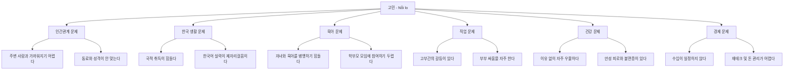
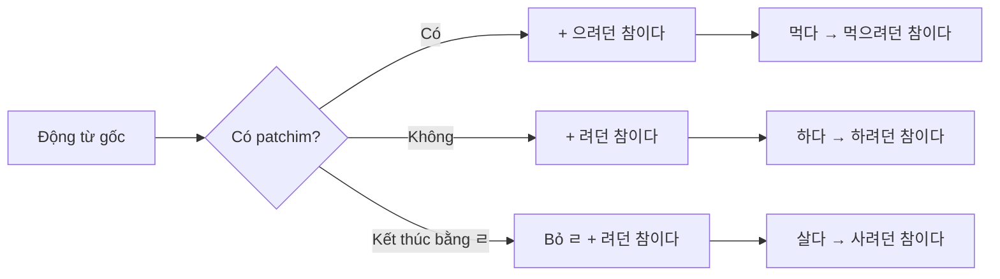
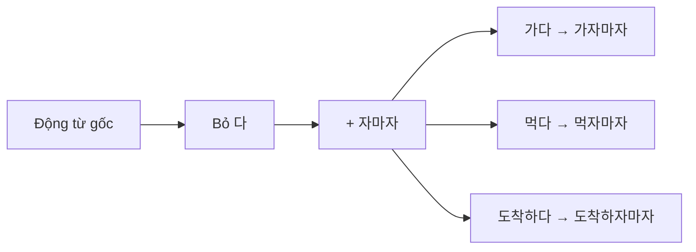
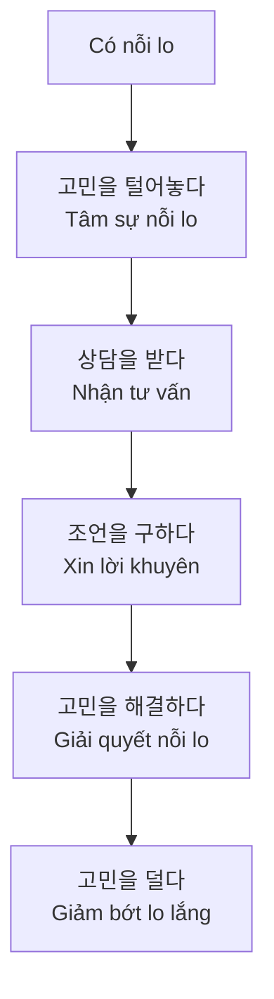

# Bài 15: 고민과 상담 (Nỗi lo và Tư vấn)

## 📚 Mục tiêu bài học

Sau khi hoàn thành bài học này, người học sẽ có khả năng:

- Sử dụng từ vựng liên quan đến nỗi lo lắng, căng thẳng và tư vấn
- Sử dụng ngữ pháp **-(으)려던** và **-자마자**
- Nói về các vấn đề lo lắng và xin lời khuyên
- Miêu tả triệu chứng sức khỏe và tình trạng tâm lý

---

## 🗂️ Phần 1: Từ vựng

### 1.1. Các loại nỗi lo lắng/vấn đề

| Tiếng Hàn | Nghĩa tiếng Việt | Ví dụ |
|-----------|-----------------|-------|
| 고민 | Nỗi lo, băn khoăn | 공부를 해도 실력이 안 늘어서 고민이구나. (Học mà không tiến bộ nên lo lắng à.) |
| 상담 | Tư vấn | 취업 상담실 (Phòng tư vấn việc làm) |
| 인간관계 문제 | Vấn đề quan hệ con người | 주변 사람들과 가까워지기 어렵다. (Khó gần gũi với người xung quanh.) |
| 한국 생활 문제 | Vấn đề cuộc sống ở Hàn Quốc | 국적 취득이 힘들다. 한국어 실력이 제자리걸음이다. (Việc nhận quốc tịch khó khăn. Trình độ tiếng Hàn giậm chân tại chỗ.) |
| 육아 문제 | Vấn đề nuôi dạy con | 직장과 육아를 병행하기 힘들다. (Khó kết hợp công việc và nuôi con.) |
| 직업 문제 | Vấn đề nghề nghiệp | 고부간의 갈등이 있다. (Có mâu thuẫn giữa mẹ chồng và nàng dâu.) |
| 건강 문제 | Vấn đề sức khỏe | 이유 없이 자주 우울하다. 만성 피로와 불면증이 있다. (Thường xuyên trầm cảm không lý do. Có mệt mỏi mãn tính và mất ngủ.) |
| 경제 문제 | Vấn đề kinh tế | 수입이 일정하지 않다. 재테크 및 돈 관리가 어렵다. (Thu nhập không ổn định. Quản lý tài chính và tiền bạc khó khăn.) |

### 1.2. Từ vựng về các loại nỗi lo

#### 고민 (Nỗi lo)

| Tiếng Hàn | Nghĩa tiếng Việt | Ví dụ |
|-----------|-----------------|-------|
| 머리가 복잡하다 | Đầu óc phức tạp | 머리가 복잡하다 (Đầu óc rối bời) |
| 신경이 쓰이다 | Bận tâm | 신경이 쓰이다 (Bận tâm, lo lắng) |
| 속이 타다 | Lo lắng, bồn chồn | 속이 타다 (Lo lắng, bồn chồn) |
| 골치가 아프다 | Đau đầu (vì lo) | 골치가 아프다 (Đau đầu vì lo lắng) |
| 눈앞이 캄캄하다 | Tối tăm trước mắt | 눈앞이 캄캄하다 (Tương lai tối tăm) |
| 발 뻗고 못 자다 | Thao thức cả đêm | 발 뻗고 못 자다 (Không thể ngủ ngon) |

#### 상담 (Tư vấn)

| Tiếng Hàn | Nghĩa tiếng Việt | Ví dụ |
|-----------|-----------------|-------|
| 고민을 털어놓다 | Tâm sự nỗi lo | 고민을 털어놓다 (Tâm sự nỗi lo) |
| 고민을 나누다 | Chia sẻ nỗi lo | 고민을 나누다 (Chia sẻ nỗi lo) |
| 조언을 구하다 | Xin lời khuyên | 조언을 구하다 (Xin lời khuyên) |
| 상담을 받다 | Nhận tư vấn | 상담을 받다 (Nhận tư vấn) |

#### 고민 해결 (Giải quyết nỗi lo)

| Tiếng Hàn | Nghĩa tiếng Việt | Ví dụ |
|-----------|-----------------|-------|
| 고민을 덜다 | Giảm bớt lo lắng | 고민을 덜다 (Giảm bớt lo lắng) |
| 고민을 해결하다 | Giải quyết nỗi lo | 고민을 해결하다 (Giải quyết nỗi lo) |
| 고민을 털어버리다 | Vứt bỏ nỗi lo | 고민을 털어버리다 (Vứt bỏ nỗi lo) |

### 1.3. Từ vựng về triệu chứng sức khỏe

| Tiếng Hàn | Nghĩa tiếng Việt | Ví dụ |
|-----------|-----------------|-------|
| 우울증 | Trầm cảm | 마음의 감기, 우울증 (Cảm lạnh của tâm hồn, trầm cảm) |
| 불면증 | Mất ngủ | 만성 피로와 불면증이 있다. (Có mệt mỏi mãn tính và mất ngủ.) |
| 고혈압 | Cao huyết áp | 고혈압 (Cao huyết áp) |
| 당뇨 | Tiểu đường | 당뇨 (Tiểu đường) |
| 전혀 없다 | Hoàn toàn không có | 전혀 없다 (Hoàn toàn không có) |
| 며칠 동안 | Trong vài ngày | 며칠 동안 (Trong vài ngày) |
| 1주일 이상 | Hơn 1 tuần | 1주일 이상 (Hơn 1 tuần) |
| 거의 매일 | Gần như mỗi ngày | 거의 매일 (Gần như mỗi ngày) |

### 1.4. Từ vựng bổ sung

| Tiếng Hàn | Nghĩa tiếng Việt | Ví dụ |
|-----------|-----------------|-------|
| 인간관계 | Quan hệ con người | 인간관계 문제 (Vấn đề quan hệ con người) |
| 긴장 | Căng thẳng | 긴장을 풀기 위해서 운동을 꼭 해야 돼요. (Phải vận động để giảm căng thẳng.) |
| 갈등 | Mâu thuẫn, xung đột | 고부간의 갈등이 있다. (Có mâu thuẫn giữa mẹ chồng và nàng dâu.) |
| 주변 사람 | Người xung quanh | 주변 사람들과 가까워지기 어렵다. (Khó gần gũi với người xung quanh.) |
| 동료 | Đồng nghiệp | 동료들과 성격이 안 맞는다. (Không hợp tính với đồng nghiệp.) |
| 성격 | Tính cách | 동료들과 성격이 안 맞는다. (Không hợp tính với đồng nghiệp.) |
| 국적 | Quốc tịch | 국적 취득이 힘들다. (Việc nhận quốc tịch khó khăn.) |
| 취직 | Xin việc | 취업 상담실 (Phòng tư vấn việc làm) |
| 퇴직 | Nghỉ việc | 퇴직 (Nghỉ việc) |
| 이직 | Chuyển việc | 이직 (Chuyển việc) |
| 제자리걸음 | Giậm chân tại chỗ | 계속 제자리걸음을 하는 거 같아요. (Tôi cứ giậm chân tại chỗ.) |
| 병행하다 | Kết hợp, song hành | 직장과 육아를 병행하기 힘들다. (Khó kết hợp công việc và nuôi con.) |
| 두렵다 | Sợ hãi | 학부모 모임에 참여하기 두렵다. (Sợ tham gia họp phụ huynh.) |
| 고부간 | Quan hệ mẹ chồng - nàng dâu | 고부간의 갈등이 있다. (Có mâu thuẫn giữa mẹ chồng và nàng dâu.) |
| 불투명하다 | Không rõ ràng | 불투명하다 (Không rõ ràng) |
| 공부를 해도 실력이 안 늘다 | Học mà không tiến bộ | 공부를 해도 실력이 안 늘어서 고민이구나. (Học mà không tiến bộ nên lo lắng à.) |
| 국적 취득이 힘들다 | Việc nhận quốc tịch khó khăn | 국적 취득이 힘들다. (Việc nhận quốc tịch khó khăn.) |

### 1.5. Các động từ và tính từ quan trọng

| Tiếng Hàn | Nghĩa tiếng Việt | Ví dụ |
|-----------|-----------------|-------|
| 출발하다 | Xuất phát, khởi hành | 지금 출발하려던 참이었어요. (Đang định xuất phát bây giờ.) |
| 슬프다 | Buồn | 슬프다 (Buồn) |
| 사귀다 | Hẹn hò, kết bạn | 사람을 사귀다 (Kết bạn với mọi người) |
| 도움을 청해 보세요 | Hãy nhờ giúp đỡ | 다른 사람에게 도움을 청해 보세요. (Hãy nhờ người khác giúp đỡ.) |
| 선배 | Tiền bối | 선배, 잠깐 얘기 좀 할 수 있어요? (Tiền bối, có thể nói chuyện một chút không?) |
| 커피 | Cà phê | 커피 한잔하려던 참이었어. (Đang định uống cà phê.) |
| 한잔하다 | Uống một ly | 커피 한잔하려던 참이었어. (Đang định uống một ly cà phê.) |
| 답답하다 | Ngột ngạt, bí bách | 답답하다 (Ngột ngạt, bí bách) |
| 감기 | Cảm lạnh | 마음의 감기 (Cảm lạnh của tâm hồn) |
| 우울하다 | Ủ rũ, buồn bã | 이유 없이 자주 우울하다. (Thường xuyên trầm cảm không lý do.) |
| 끌다 | Kéo, lôi | 끌다 (Kéo, lôi) |

### 1.6. Từ vựng về học tập

| Tiếng Hàn | Nghĩa tiếng Việt | Ví dụ |
|-----------|-----------------|-------|
| 단어장 | Sổ từ vựng | 단어장도 많은데 외우자마자 금방 잊어버려요. (Có nhiều sổ từ vựng nhưng vừa học thuộc là quên ngay.) |
| 외우다 | Học thuộc, thuộc lòng | 단어장도 많은데 외우자마자 금방 잊어버려요. (Có nhiều sổ từ vựng nhưng vừa học thuộc là quên ngay.) |
| 금방 | Ngay lập tức, nhanh chóng | 외우자마자 금방 잊어버려요. (Vừa học thuộc là quên ngay.) |
| 잊어버리다 | Quên | 외우자마자 금방 잊어버려요. (Vừa học thuộc là quên ngay.) |
| 꾸준히 | Kiên trì, bền bỉ | 무엇보다 꾸준히 하는 게 제일 중요한 것 같아. (Quan trọng nhất là kiên trì.) |
| 예습하다 | Chuẩn bị trước, dự tập | 매일 예습하고 수업 후에 바로 복습하고. (Mỗi ngày chuẩn bị trước và sau giờ học thì ôn lại ngay.) |
| 복습하다 | Ôn lại, ôn tập | 매일 예습하고 수업 후에 바로 복습하고. (Mỗi ngày chuẩn bị trước và sau giờ học thì ôn lại ngay.) |
| 실력 | Trình độ, năng lực | 요즘 한국어 실력이 통 늘지 않는 거 같아서요. (Dạo này trình độ tiếng Hàn không tiến bộ.) |
| 늘다 | Tăng lên, tiến bộ | 공부를 해도 실력이 안 늘어서 고민이구나. (Học mà không tiến bộ nên lo lắng à.) |
| 안 늘다 | Không tiến bộ | 공부를 해도 실력이 안 늘어서 고민이구나. (Học mà không tiến bộ nên lo lắng à.) |
| 통 | Hoàn toàn (dùng với phủ định) | 요즘 한국어 실력이 통 늘지 않는 거 같아서요. (Dạo này trình độ tiếng Hàn hoàn toàn không tiến bộ.) |

### 1.7. Từ vựng về triệu chứng sức khỏe (bổ sung)

| Tiếng Hàn | Nghĩa tiếng Việt | Ví dụ |
|-----------|-----------------|-------|
| 매사 | Mọi việc | 매사에 흥미나 즐거움이 거의 없다. (Gần như không có hứng thú hay niềm vui với mọi việc.) |
| 흥미 | Hứng thú | 매사에 흥미나 즐거움이 거의 없다. (Gần như không có hứng thú hay niềm vui với mọi việc.) |
| 즐거움 | Niềm vui | 매사에 흥미나 즐거움이 거의 없다. (Gần như không có hứng thú hay niềm vui với mọi việc.) |
| 기분 | Tâm trạng | 기분이 가라앉거나 우울하거나 희망이 없다고 느낀다. (Cảm thấy tâm trạng chìm xuống, trầm cảm hoặc không có hy vọng.) |
| 가라앉다 | Chìm xuống, sụp đổ | 기분이 가라앉거나 우울하거나 희망이 없다고 느낀다. (Cảm thấy tâm trạng chìm xuống, trầm cảm hoặc không có hy vọng.) |
| 희망 | Hy vọng | 기분이 가라앉거나 우울하거나 희망이 없다고 느낀다. (Cảm thấy tâm trạng chìm xuống, trầm cảm hoặc không có hy vọng.) |
| 잠들다 | Ngủ thiếp | 잠들기 어렵거나 자주 깬다. (Khó ngủ hoặc thường xuyên thức giấc.) |
| 깨다 | Thức dậy, tỉnh | 잠들기 어렵거나 자주 깬다, 혹은 잠을 너무 많이 잔다. (Khó ngủ hoặc thường xuyên thức giấc, hoặc ngủ quá nhiều.) |
| 자주 깨다 | Thức giấc thường xuyên | 잠들기 어렵거나 자주 깬다. (Khó ngủ hoặc thường xuyên thức giấc.) |
| 피곤하다 | Mệt mỏi | 피곤하다고 느끼거나 기운이 거의 없다. (Cảm thấy mệt mỏi hoặc gần như không có sức lực.) |
| 기운 | Năng lượng, sức lực | 피곤하다고 느끼거나 기운이 거의 없다. (Cảm thấy mệt mỏi hoặc gần như không có sức lực.) |
| 식욕 | Sự ngon miệng | 식욕이 줄었다. (Sự ngon miệng giảm.) |
| 줄다 | Giảm | 식욕이 줄었다, 혹은 너무 많이 먹는다. (Sự ngon miệng giảm, hoặc ăn quá nhiều.) |
| 신문 | Báo chí | 신문 기사 (Bài báo) |
| 기사 | Bài báo | 신문 기사 (Bài báo) |
| 진단 | Chẩn đoán | 자가 진단법 (Phương pháp tự chẩn đoán) |
| 극복 | Vượt qua, khắc phục | 우울증 자가 진단과 극복 방법 (Phương pháp tự chẩn đoán và vượt qua trầm cảm) |
| 증상 | Triệu chứng | 우울증 증상 (Triệu chứng trầm cảm) |
| 의심하다 | Nghi ngờ | 우울증을 의심해 볼 수 있다. (Có thể nghi ngờ trầm cảm.) |
| 보고되다 | Được báo cáo | 보고되다 (Được báo cáo) |

### 1.8. Từ vựng khác từ hội thoại và bài tập

| Tiếng Hàn | Nghĩa tiếng Việt | Ví dụ |
|-----------|-----------------|-------|
| 잠깐 | Một chút, lát | 선배, 잠깐 얘기 좀 할 수 있어요? (Tiền bối, có thể nói chuyện một chút không?) |
| 얘기 | Chuyện, câu chuyện | 선배, 잠깐 얘기 좀 할 수 있어요? (Tiền bối, có thể nói chuyện một chút không?) |
| 안 그래도 | Cũng đang, vốn dĩ | 어, 안 그래도 커피 한잔하려던 참이었어. (Ừ, tôi cũng đang định uống cà phê.) |
| 무슨 일 | Chuyện gì | 왜? 무슨 일 있어? (Sao vậy? Có chuyện gì à?) |
| 요즘 | Dạo này | 요즘 한국어 실력이 통 늘지 않는 거 같아서요. (Dạo này trình độ tiếng Hàn không tiến bộ.) |
| 말씀 | Lời nói (kính ngữ) | 선배, 좋은 말씀 고마워요. (Tiền bối, cảm ơn lời khuyên hay.) |
| 말씀대로 | Theo lời | 선배 말씀대로 한번 해 볼게요. (Tôi sẽ thử làm theo lời tiền bối.) |
| 생각에는 | Theo suy nghĩ | 내 생각에는 무엇보다 꾸준히 하는 게 제일 중요한 것 같아. (Theo tôi nghĩ, quan trọng nhất là kiên trì.) |
| 무엇보다 | Trước hết, hơn hết | 무엇보다 꾸준히 하는 게 제일 중요한 것 같아. (Quan trọng nhất là kiên trì.) |
| 제일 | Nhất, hơn cả | 꾸준히 하는 게 제일 중요한 것 같아. (Kiên trì là quan trọng nhất.) |
| 중요하다 | Quan trọng | 꾸준히 하는 게 제일 중요한 것 같아. (Kiên trì là quan trọng nhất.) |
| 매일 | Mỗi ngày | 매일 예습하고 수업 후에 바로 복습하고. (Mỗi ngày chuẩn bị trước và sau giờ học thì ôn lại ngay.) |
| 수업 후에 | Sau giờ học | 매일 예습하고 수업 후에 바로 복습하고. (Mỗi ngày chuẩn bị trước và sau giờ học thì ôn lại ngay.) |
| 바로 | Ngay lập tức | 수업 후에 바로 복습하고. (Sau giờ học thì ôn lại ngay.) |
| 한번 | Một lần, thử | 선배 말씀대로 한번 해 볼게요. (Tôi sẽ thử làm theo lời tiền bối.) |
| 해 보다 | Thử làm | 선배 말씀대로 한번 해 볼게요. (Tôi sẽ thử làm theo lời tiền bối.) |
| 친한 사람 | Người thân thiết | 친한 사람과 텔레파시가 통했다. (Thần giao cách cảm với người thân thiết.) |
| 텔레파시 | Thần giao cách cảm | 친한 사람과 텔레파시가 통했다. (Thần giao cách cảm với người thân thiết.) |
| 지갑 | Ví tiền | 지금 사려던 참이었는데 친구가 지갑을 선물해 줬어요. (Đang định mua, bạn đã tặng ví cho tôi.) |
| 선물하다 | Tặng quà | 친구가 지갑을 선물해 줬어요. (Bạn đã tặng ví cho tôi.) |
| 화해하다 | Hòa giải | 화해하고 싶으면 사과하세요. (Nếu muốn hòa giải thì hãy xin lỗi.) |
| 사과하다 | Xin lỗi | 화해하고 싶으면 사과하세요. (Nếu muốn hòa giải thì hãy xin lỗi.) |
| 사과 | Lời xin lỗi | 사과를 받아들이다 (Chấp nhận lời xin lỗi) |
| 운전면허증 | Giấy phép lái xe | 운전면허증을 가지고 다니다 (Mang theo giấy phép lái xe) |
| 급하다 | Gấp, khẩn cấp | 급하게 출발하다 (Xuất phát gấp) |
| 갈아타다 | Đổi (phương tiện) | 지하철을 갈아타다 (Đổi tàu điện ngầm) |
| 대리고 | Đại lý (gọi taxi) | 대리고를 부르다 (Gọi taxi đại lý) |
| 산책 | Đi dạo | 산책을 하거나 과도하게 운동하지 말 것 (Đi dạo hoặc không vận động quá mức) |

### 1.9. Từ vựng về trung tâm tư vấn

| Tiếng Hàn | Nghĩa tiếng Việt | Ví dụ |
|-----------|-----------------|-------|
| 이민자 | Người nhập cư | 한국에 이민자가 증가하면서 이민자들의 문제를 해결해 주거나 상담해 주는 기관도 늘고 있다. (Khi người nhập cư ở Hàn Quốc tăng lên, các cơ quan giúp giải quyết vấn đề hoặc tư vấn cũng tăng theo.) |
| 상담 센터 | Trung tâm tư vấn | 이민자를 대상으로 한 상담 센터는 지역별로 여러 곳이 있다. (Có nhiều trung tâm tư vấn cho người nhập cư theo từng khu vực.) |
| 외국인노동자지원센터 | Trung tâm hỗ trợ lao động nước ngoài | 외국인 노동자들을 대상으로 한 상담 센터는 외국인노동자지원센터다. (Trung tâm tư vấn cho lao động nước ngoài là Trung tâm hỗ trợ lao động nước ngoài.) |
| 서울글로벌센터 | Trung tâm Seoul Global | 서울글로벌센터에서 이민자들을 위한 다양한 서비스를 제공하고 있다. (Trung tâm Seoul Global cung cấp các dịch vụ đa dạng cho người nhập cư.) |
| 다문화가족지원센터 | Trung tâm hỗ trợ gia đình đa văn hóa | 다문화가족지원센터에서는 결혼 이민자 가족을 대상으로 가족 상담을 진행하고 있다. (Trung tâm hỗ trợ gia đình đa văn hóa tiến hành tư vấn gia đình cho gia đình người nhập cư kết hôn.) |
| 대상으로 | Với đối tượng | 외국인 노동자들을 대상으로 한 상담 센터 (Trung tâm tư vấn với đối tượng là lao động nước ngoài) |
| 증가하다 | Tăng lên | 한국에 이민자가 증가하면서 (Khi người nhập cư ở Hàn Quốc tăng lên) |
| 해결하다 | Giải quyết | 이민자들의 문제를 해결해 주는 기관 (Cơ quan giúp giải quyết vấn đề của người nhập cư) |
| 해결 방안 | Phương án giải quyết | 해결 방안을 마련하다 (Chuẩn bị phương án giải quyết) |
| 마련하다 | Chuẩn bị, thiết lập | 해결 방안을 마련하기 위해 상담 기관이 설립되었다. (Cơ quan tư vấn được thành lập để chuẩn bị phương án giải quyết.) |
| 상담 기관 | Cơ quan tư vấn | 이민자를 위한 상담 기관이 여러 곳에 설립되어 있다. (Cơ quan tư vấn cho người nhập cư được thành lập ở nhiều nơi.) |
| 설립되다 | Được thành lập | 상담 기관이 여러 곳에 설립되어 있다. (Cơ quan tư vấn được thành lập ở nhiều nơi.) |
| 대표적 | Đại diện, tiêu biểu | 대표적인 것이 외국인노동자지원센터이다. (Điển hình là Trung tâm hỗ trợ lao động nước ngoài.) |
| 진로 | Định hướng | 진로·취업 상담실 (Phòng tư vấn định hướng và việc làm) |
| 취업 | Xin việc | 취업 상담실 (Phòng tư vấn việc làm) |
| 자녀 교육 | Giáo dục con cái | 육아/자녀 교육 문제 (Vấn đề nuôi con và giáo dục con cái) |
| 지역별 | Theo khu vực | 이민자를 대상으로 한 상담 센터는 지역별로 여러 곳이 있다. (Có nhiều trung tâm tư vấn cho người nhập cư theo từng khu vực.) |
| 각 지방 | Mỗi địa phương | 각 지방 단체 (Tổ chức ở mỗi địa phương) |
| 단체 | Đoàn thể, tổ chức | 각 지방 단체 (Tổ chức ở mỗi địa phương) |

### 1.10. Từ vựng từ bài đọc về trầm cảm

| Tiếng Hàn | Nghĩa tiếng Việt | Ví dụ |
|-----------|-----------------|-------|
| 마음 | Tâm, lòng | 마음의 감기, 우울증 (Cảm lạnh của tâm hồn, trầm cảm) |
| 감기 | Cảm lạnh | 마음의 감기, 우울증 (Cảm lạnh của tâm hồn, trầm cảm) |
| 자가 | Tự, tự mình | 자가 진단법 (Phương pháp tự chẩn đoán) |
| 우려 | Lo ngại | 우울증을 우려하다 (Lo ngại trầm cảm) |
| 살면서 | Trong khi sống | 살면서 우울함을 경험할 수 있다 (Trong khi sống có thể trải nghiệm trầm cảm) |
| 상쾌하다 | Sảng khoái | 기분이 상쾌하다 (Tâm trạng sảng khoái) |
| 인식적 | Về nhận thức | 인식적 증상 (Triệu chứng nhận thức) |
| 기분 | Tâm trạng | 기분이 가라앉거나 우울하거나 희망이 없다고 느낀다 (Cảm thấy tâm trạng chìm xuống, trầm cảm hoặc không có hy vọng) |
| 우울 | Trầm | 우울하거나 희망이 없다고 느낀다 (Cảm thấy trầm cảm hoặc không có hy vọng) |
| 계속되다 | Tiếp tục | 우울한 기분이 2주 이상 계속되면 (Nếu tâm trạng trầm cảm tiếp tục hơn 2 tuần) |
| 의심해 볼 수 있다 | Có thể nghi ngờ | 우울증을 의심해 볼 수 있다 (Có thể nghi ngờ trầm cảm) |
| 한국건강증진개발원 | Viện Phát triển Tăng cường Sức khỏe Hàn Quốc | 한국건강증진개발원에서 소개한 자가 진단법 (Phương pháp tự chẩn đoán do Viện Phát triển Tăng cường Sức khỏe Hàn Quốc giới thiệu) |
| 자가 진단법 | Phương pháp tự chẩn đoán | 우울증 자가 진단법 (Phương pháp tự chẩn đoán trầm cảm) |
| 소개하다 | Giới thiệu | 한국건강증진개발원에서 소개한 자가 진단법 (Phương pháp tự chẩn đoán do Viện giới thiệu) |
| 다른 질병 | Bệnh khác | 다른 질병과 마찬가지로 (Giống như các bệnh khác) |
| 마찬가지 | Giống nhau | 다른 질병과 마찬가지로 빨리 발견하고 치료하는 것이 중요하다 (Giống như các bệnh khác, phát hiện sớm và điều trị là quan trọng) |
| 빨리 발견하다 | Phát hiện sớm | 빨리 발견하고 치료하는 것이 중요하다 (Phát hiện sớm và điều trị là quan trọng) |
| 치료하다 | Điều trị | 빨리 발견하고 치료하는 것이 중요하다 (Phát hiện sớm và điều trị là quan trọng) |
| 중요하다 | Quan trọng | 빨리 발견하고 치료하는 것이 중요하다 (Phát hiện sớm và điều trị là quan trọng) |
| 세계보건기구 | Tổ chức Y tế Thế giới (WHO) | 세계보건기구(WHO)는 우울하다고 느낄 때 도움을 받을 수 있는 극복 방법을 권고하고 있다 (WHO khuyến nghị phương pháp vượt qua có thể nhận được sự giúp đỡ khi cảm thấy trầm cảm) |
| 우울하다고 느낄 때 | Khi cảm thấy trầm cảm | 우울하다고 느낄 때 도움을 받을 수 있다 (Có thể nhận được sự giúp đỡ khi cảm thấy trầm cảm) |
| 받을 수 있다 | Có thể nhận | 도움을 받을 수 있다 (Có thể nhận được sự giúp đỡ) |
| 사람 | Người | 믿을 수 있는 사람에게 얘기하기 (Nói chuyện với người đáng tin cậy) |
| 자신 | Bản thân | 자신의 감정에 대해 얘기하기 (Nói về cảm xúc của bản thân) |
| 감정 | Cảm xúc | 자신의 감정에 대해 얘기하기 (Nói về cảm xúc của bản thân) |
| 얘기하다 | Nói chuyện | 믿을 수 있는 사람에게 얘기하기 (Nói chuyện với người đáng tin cậy) |
| 슬픔 | Nỗi buồn | 슬픔을 표현하다 (Bày tỏ nỗi buồn) |
| 담배 | Thuốc lá | 술·담배 피하기 (Tránh rượu, thuốc lá) |
| 피하다 | Tránh | 술·담배 피하기 (Tránh rượu, thuốc lá) |
| 술 | Rượu | 술·담배 피하기 (Tránh rượu, thuốc lá) |
| 산책 | Đi dạo | 산책을 하거나 과도하게 운동하지 말 것 (Đi dạo hoặc không vận động quá mức) |
| 과도하게 | Quá mức | 과도하게 운동하지 말 것 (Không vận động quá mức) |
| 운동하다 | Vận động | 산책을 하거나 과도하게 운동하지 말 것 (Đi dạo hoặc không vận động quá mức) |
| 가족 | Gia đình | 가족·친구와 관계 및 연락 유지하기 (Duy trì quan hệ và liên lạc với gia đình, bạn bè) |
| 친구 | Bạn bè | 가족·친구와 관계 및 연락 유지하기 (Duy trì quan hệ và liên lạc với gia đình, bạn bè) |
| 관계 | Quan hệ | 가족·친구와 관계 및 연락 유지하기 (Duy trì quan hệ và liên lạc với gia đình, bạn bè) |
| 연락 | Liên lạc | 가족·친구와 관계 및 연락 유지하기 (Duy trì quan hệ và liên lạc với gia đình, bạn bè) |
| 유지하다 | Duy trì | 가족·친구와 관계 및 연락 유지하기 (Duy trì quan hệ và liên lạc với gia đình, bạn bè) |
| 극복 방법 | Phương pháp vượt qua | 우울증 자가 진단과 극복 방법 (Phương pháp tự chẩn đoán và vượt qua trầm cảm) |
| 권고하다 | Khuyến nghị | 세계보건기구는 극복 방법을 권고하고 있다 (WHO đang khuyến nghị phương pháp vượt qua) |
| 있다 | Có | 우울증이 있다 (Có trầm cảm) |

---

## 📘 Phần 2: Ngữ pháp

### 2.1. Ngữ pháp **-(으)려던 참이다**

#### 📌 Cấu trúc

```
Động từ + -(으)려던 참이다
```

#### 📌 Ý nghĩa

Diễn tả **dự định hoặc ý định sắp thực hiện** một hành động nào đó trong quá khứ, nhưng vì một lý do nào đó mà **chưa kịp thực hiện**. Thường được dùng khi có sự việc khác xảy ra ngay trước khi thực hiện ý định đó.

Có nghĩa là "đang định...", "đang có ý định..." trong tiếng Việt.

#### 📌 Cách sử dụng

| Dạng động từ | Quy tắc | Ví dụ |
|--------------|---------|-------|
| Động từ có patchim | + **으려던 참이다** | 먹다 → 먹**으려던 참이다** |
| Động từ không patchim | + **려던 참이다** | 하다 → 하**려던 참이다** |
| Động từ kết thúc bằng ㄹ | Bỏ ㄹ + **려던 참이다** | 살다 → 사**려던 참이다** |

#### 📌 Bảng biến đổi từ thường gặp

| Động từ gốc | Nghĩa | Dạng -(으)려던 참이다 |
|-------------|-------|--------------------|
| 가다 | Đi | 가**려던 참이다** |
| 먹다 | Ăn | 먹**으려던 참이다** |
| 사과하다 | Xin lỗi | 사과하**려던 참이다** |
| 듣다 | Nghe | 들**으려던 참이다** |
| 만들다 | Làm | 만들**려던 참이다** |
| 출발하다 | Xuất phát | 출발하**려던 참이다** |

#### 📌 Dạng rút gọn: **-(으)려던 참이에요/이었어요**

| Thì | Dạng lịch sự |
|-----|-------------|
| Hiện tại | -(으)려던 **참이에요** |
| Quá khứ | -(으)려던 **참이었어요** |

#### 📌 Ví dụ minh họa

| Tình huống | Câu nói |
|-----------|---------|
| Định làm nhưng chưa kịp | 지금 사려던 **참이었어요**. 친구가 지갑을 선물해 줬어요. (Tôi đang định mua, bạn đã tặng ví cho tôi.) |
| Định xin lỗi | 화해하고 **싶으면** 사과하세요. (Nếu muốn hòa giải thì hãy xin lỗi.) |

#### 📌 So sánh với các ngữ pháp tương tự

| Ngữ pháp | Ý nghĩa | Ví dụ |
|----------|---------|-------|
| -(으)**려던 참이다** | Đang định (nhưng chưa làm) | 출발하**려던 참이었어요** |
| -(으)**려고 하다** | Có ý định (sắp làm) | 출발하**려고 해요** |
| -(으)**ㄹ 거예요** | Sẽ (dự định tương lai) | 출발**할 거예요** |

---

### 2.2. Ngữ pháp **-자마자**

#### 📌 Cấu trúc

```
Động từ (gốc nguyên) + -자마자
```

#### 📌 Ý nghĩa

Diễn tả hành động thứ hai **xảy ra ngay lập tức** sau khi hành động thứ nhất kết thúc, không có khoảng thời gian chờ đợi.

Có nghĩa là "ngay khi...", "vừa mới..." trong tiếng Việt.

#### 📌 Cách sử dụng

| Dạng động từ | Quy tắc | Ví dụ |
|--------------|---------|-------|
| Mọi động từ | Lấy gốc động từ + **-자마자** | 가다 → 가**자마자** |
| | | 먹다 → 먹**자마자** |
| | | 오다 → 오**자마자** |

#### 📌 Bảng biến đổi từ thường gặp

| Động từ gốc | Nghĩa | Dạng -자마자 |
|-------------|-------|-------------|
| 보다 | Nhìn, xem | 보**자마자** |
| 듣다 | Nghe | 듣**자마자** |
| 먹다 | Ăn | 먹**자마자** |
| 도착하다 | Đến nơi | 도착하**자마자** |
| 집에 들어가다 | Vào nhà | 집에 들어가**자마자** |
| 일어나다 | Thức dậy | 일어나**자마자** |

#### 📌 Ví dụ minh họa

| Câu hỏi | Câu trả lời |
|---------|-------------|
| 가: 졸업하면 뭐 할 거예요? | (Tốt nghiệp rồi sẽ làm gì?) |
| 나: 네, 졸업하**자마자** 일단 귀국해야 할 것 같아요. | (Vâng, ngay khi tốt nghiệp thì có lẽ tôi phải về nước.) |
| 가: 전화로 어머니의 목소리를 들**자마자** 눈물이 났어요. | (Ngay khi nghe giọng mẹ qua điện thoại thì tôi đã khóc.) |

#### 📌 Lưu ý về cách sử dụng

**-자마자** áp dụng cho tất cả động từ, chỉ cần bỏ **-다** và thêm **-자마자**:

| Động từ gốc | Bỏ -다 | Thêm -자마자 |
|-------------|--------|-------------|
| 가다 | 가 | 가**자마자** |
| 먹다 | 먹 | 먹**자마자** |
| 듣다 | 듣 | 듣**자마자** |
| 도착하다 | 도착하 | 도착하**자마자** |

#### 📌 Lưu ý về cách phát âm

Một số trường hợp đặc biệt:

| Từ gốc | Biến đổi |
|--------|----------|
| 듣자마자 | Phát âm: [듣짜마자] |
| 먹자마자 | Phát âm: [먹짜마자] |

---

## 🗣️ Phần 3: Mẫu câu và hội thoại

### 3.1. Hội thoại mẫu 1: Tư vấn tâm lý về học tập

**아나이스**: 선배, 잠깐 얘기 좀 할 수 있어요?

**선배**: 어, 안 그래도 커피 한잔하**려던 참이었어**. 왜? 무슨 일 있어?

**아나이스**: 아니, 저 요즘 한국어 실력이 통 늘지 않는 거 같아서요. 단어장도 많은데 외우자마자 금방 잊어버려요. 어떻게 하죠?

**선배**: 공부를 해도 실력이 안 늘어서 고민이구나.

**아나이스**: 네, 맞아요. 계속 제자리걸음을 하는 거 같아요.

**선배**: 내 생각에는 무엇보다 꾸준히 하는 게 제일 중요한 것 같아. 매일 예습하고 수업 후에 바로 복습하고.

**아나이스**: 선배, 좋은 말씀 고마워요. 선배 말씀대로 한번 해 볼게요.

#### Dịch nghĩa:

**Anaïs**: Tiền bối, có thể nói chuyện một chút không?

**Tiền bối**: Ừ, tôi cũng đang định uống cà phê. Sao vậy? Có chuyện gì à?

**Anaïs**: Không, dạo này tôi thấy trình độ tiếng Hàn không tiến bộ. Có nhiều sổ từ vựng nhưng vừa học thuộc là quên ngay. Phải làm sao đây?

**Tiền bối**: Học mà không tiến bộ nên lo lắng à.

**Anaïs**: Vâng, đúng vậy. Tôi cứ giậm chân tại chỗ.

**Tiền bối**: Theo tôi nghĩ, quan trọng nhất là kiên trì. Mỗi ngày chuẩn bị trước và sau giờ học thì ôn lại ngay.

**Anaïs**: Tiền bối, cảm ơn lời khuyên hay. Tôi sẽ thử làm theo lời tiền bối.

---

### 3.2. Bảng so sánh cách sử dụng ngữ pháp

| Ngữ cảnh | Câu sử dụng -(으)려던 참이다 | Câu sử dụng -자마자 |
|----------|--------------------------|------------------|
| Chuẩn bị làm việc | 커피 한잔하**려던 참이었어**. (Đang định uống cà phê.) | 집에 들어가**자마자** 샤워했어요. (Vào nhà là tắm ngay.) |
| Học từ vựng | 단어를 외우**려던 참이었어요**. (Đang định học từ.) | 단어를 외우**자마자** 잊어버렸어요. (Vừa học từ là quên ngay.) |
| Ngủ | 잠을 자**려던 참이었어요**. (Đang định đi ngủ.) | 잠들**자마자** 꿈을 꿨어요. (Vừa ngủ là mơ ngay.) |

---

### 3.3. Luyện tập với từ vựng

#### Bài tập 1: Hoàn thành câu với **-(으)려던 참이다**

1. 다른 사람에게 도움을 청해 보세요 → 다른 사람에게 도움을 **청하려던 참이에요**.
2. 그런 문제는 상담을 받아 보면 어때요? → 상담을 **받아 보려던 참이었어요**.
3. 건강을 위해서 운동을 ~ → 운동을 **하려던 참이에요**.
4. 늦지 않으려면 지금 출발하는 게 좋겠어요 → 지금 **출발하려던 참이었어요**.

#### Bài tập 2: Hoàn thành câu với **-자마자**

1. 집에 들어가다 + 뭐 해요? → 집에 **들어가자마자** 텔레비전부터 켜요
2. 도착하면 연락해요 → 도착하**자마자** 전화해요
3. 택배를 받으면 전달을 부탁드려요 → 택배를 **받자마자** 사장님께 전해 드려요
4. 수업이 끝나면 뭐 하고 싶어요? → 수업이 **끝나자마자** 여행을 다녀오고 싶어요

---

## 🎧 Phần 4: Nghe (듣기)

### 4.1. Câu hỏi khởi động

**여러분은 취업 상담실에 가 본 적이 있습니까? 취업 상담실 선생님은 무슨 질문을 할까요?**

(Các bạn đã từng đến phòng tư vấn việc làm chưa? Giáo viên phòng tư vấn việc làm sẽ hỏi những câu hỏi gì?)

#### Ba câu hỏi gợi ý:

1. **어떤 일을 하고 싶으세요?**
   - (Bạn muốn làm công việc gì?)

2. **자격증이나 운전면허증 있으세요?**
   - (Bạn có bằng cấp hoặc giấy phép lái xe không?)

3. **급여는 얼마나 받고 싶으세요?**
   - (Bạn muốn nhận lương bao nhiêu?)

---

### 4.2. Bài nghe: 잠시드 씨와 상담사의 대화입니다

**1) 잠시드 씨는 지금 무슨 일을 합니까?**
(Jamshid đang làm công việc gì?)

**2) 잠시드 씨는 왜 이직을 하고 싶어 합니까?**
(Tại sao Jamshid muốn chuyển việc?)

**3) 들은 내용과 같으면 ○, 다르면 X 하세요.**
(Nếu giống nội dung đã nghe thì đánh ○, khác thì đánh X)

① 잠시드 씨는 급여를 일당으로 받고 싶어 한다. (    )

② 잠시드 씨는 고등학교 졸업 후에 바로 한국에 왔다. (    )

③ 잠시드 씨는 운전면허증이 있다. (    )

*Đáp án:*
- 급여 (Lương)
- 일당 (Tiền công nhật)

---

### 4.3. Luyện tập phát âm

**발음 연습:**

Quy tắc phát âm khi kết hợp phụ âm:

| Quy tắc | Ví dụ gốc | Cách phát âm |
|---------|-----------|--------------|
| ㄱ, ㄷ, ㅂ, ㅅ, ㅈ + ㅁ, ㄴ, ㅇ | 먹는[멍는] | [멍는] |
| | 듣자마자 | [듣짜마자] |
| | 먹자마자 | [먹짜마자] |

#### Các câu luyện tập:

**다음을 듣고 따라 읽으세요.**

1) 주차 문제로 **옆집** 사람들과 사이가 벌어졌다.
2) 조언을 **듣자마자** 바로 실천했다.
3) 설거지는 미루지 말고 밥을 **먹자마자** 해야 돼요.

---

## 📖 Phần 5: Đọc (읽기)

### 5.1. Bài đọc: 다음 건강 문제에 대해서 이야기해 보세요

**Hãy nói về các vấn đề sức khỏe sau:**

| Hình ảnh | Tên bệnh |
|----------|----------|
| 😢 | 우울증 (Trầm cảm) |
| 😴 | 불면증 (Mất ngủ) |
| 🏥 | 고혈압 (Cao huyết áp) |
| 💉 | 당뇨 (Tiểu đường) |

---

### 5.2. Bảng đánh giá triệu chứng trầm cảm

**다음의 우울증 체크 리스트를 보고 표시해 보세요.**

(Hãy xem bảng kiểm tra trầm cảm sau và đánh dấu)

| 지난 2주 동안에 | 전혀 없음 | 며칠 동안 | 1주일 이상 | 거의 매일 |
|---------------|----------|-----------|----------|---------|
| 1. 매사에 흥미나 즐거움이 거의 없다. | ☐ | ☐ | ☐ | ☐ |
| 2. 기분이 가라앉거나 우울하거나 희망이 없다고 느낀다. | ☐ | ☐ | ☐ | ☐ |
| 3. 잠들기 어렵거나 자주 깬다, 혹은 잠을 너무 많이 잔다. | ☐ | ☐ | ☐ | ☐ |
| 4. 피곤하다고 느끼거나 기운이 거의 없다. | ☐ | ☐ | ☐ | ☐ |
| 5. 식욕이 줄었다, 혹은 너무 많이 먹는다. | ☐ | ☐ | ☐ | ☐ |
| 6. 내 자신이 실패자로 여겨지거나 자신과 가족을 실망시켰다고 느낀다. | ☐ | ☐ | ☐ | ☐ |
| 7. 신문을 읽거나 TV를 보는 것과 같은 일상적인 일에 집중하기 어렵다. | ☐ | ☐ | ☐ | ☐ |
| 8. 평소보다 말과 행동이 느리다. 혹은 너무 불안해서 가만히 없어 있을 수 없다. | ☐ | ☐ | ☐ | ☐ |
| 9. 죽고 싶다는 생각을 한다. | ☐ | ☐ | ☐ | ☐ |

---

### 5.3. Bài đọc dài: 마음의 감기, 우울증 자가 진단과 극복 방법

**OO신문 | 20XX년 4월 28일**

#### 📰 Bài báo

우리는 살면서 어떤 상황이나 사건으로 인해 일시적으로 기분이 우울해지는 것을 경험한다. 그러나 쉽게 회복하지 못하고 2주 이상 우울한 기분이 계속된다면 우울증이 아닌지 의심해 볼 수 있다.

우울증은 마음의 감기라고도 하는데 실제로 열 명 중 한 명은 우울증에 걸린다고 보고될 정도로 흔한 병이다. 한국건강증진개발원은 우울증 자가 진단법을 소개하고 "우울증은 다른 모든 질병과 마찬가지로 빨리 발견하여 치료하는 것이 중요하다."라고 덧붙였다.

우울증은 조기 진단과 치료가 중요하기 때문에 우울증이 의심되면 빨리 병원을 찾거나 지역 정신 보건 기관에서 상담을 받아 보는 것이 좋다.

세계보건기구(WHO)는 우울하다고 느낄 때 도움을 받을 수 있는 사람과 자신의 감정을 이야기하기 ▲슬픔, 담배 피하기 ▲잠은 산책이라도 꾸준히 운동하기 ▲가족·친구와 관계 및 연락 유지하기 등을 극복 방법으로 권고하고 있다.

---

#### 📝 Câu hỏi:

**1) 윗글의 중심 생각은 무엇입니까?**

① 누구나 우울증에 걸릴 수 있다.

② 우울증은 노력하면 쉽게 극복할 수 있다.

③ 우울증은 빨리 발견하여 치료하는 것이 중요하다.

④ 자가 진단법을 통해 우울증을 정확하게 진단할 수 있다.

*Đáp án:*
- 일시적 (Tạm thời)
- 의심하다 (Nghi ngờ)
- 보고되다 (Được báo cáo)

**2) 윗글의 내용과 같으면 ○, 다르면 X 하세요.**

① 기분이 우울한 것은 모두 우울증이라고 한다. (    )

② 살면서 90%의 사람이 우울증을 경험한다. (    )

③ 우울할 때는 사람들과 자주 만나거나 연락하는 것이 좋다. (    )

---

## 📊 Phần 6: Biểu đồ minh họa

### 6.1. Sơ đồ các loại nỗi lo lắng



### 4.2. Cấu trúc ngữ pháp -(으)려던 참이다



### 4.3. Cấu trúc ngữ pháp -자마자



### 6.4. So sánh hai ngữ pháp

```mermaid
graph TB
    A[Ngữ pháp so sánh] --> B[-(으)려던 참이다]
    A --> C[-자마자]

    B --> B1[Ý nghĩa: Đang định làm]
    B --> B2[Tình huống: Chưa kịp thực hiện]
    B --> B3[Ví dụ: 출발하려던 참이었어요]

    C --> C1[Ý nghĩa: Ngay khi]
    C --> C2[Tình huống: Hành động liên tiếp]
    C --> C3[Ví dụ: 집에 들어가자마자 샤워했어요]
```

### 6.5. Quy trình giải quyết nỗi lo



---

## ✍️ Phần 7: Viết (쓰기)

### 7.1. Câu hỏi khởi động

**요즘 여러분의 고민은 무엇입니까?**

(Nỗi lo của các bạn dạo này là gì?)

#### Ba câu hỏi gợi ý:

1. **무엇에 대한 고민입니까?**
   - (Nỗi lo về cái gì?)

2. **어떤 문제가 있습니까?**
   - (Có vấn đề gì?)

3. **그 고민을 해결하기 위해 어떤 노력을 해 왔습니까?**
   - (Đã nỗ lực gì để giải quyết nỗi lo đó?)

---

### 7.2. Mẫu đơn tư vấn (고민 상담 신청서)

**다음은 고민 상담 신청서입니다. 신청서를 작성해 보세요.**

(Sau đây là đơn đăng ký tư vấn nỗi lo. Hãy điền vào đơn.)

#### 📝 고민 상담 신청서

| Mục | Nội dung |
|-----|----------|
| **신청 일자** | 20    년    월    일 |
| **성명** | |
| **성별** | ☐ 남  ☐ 여 |
| **이메일** | |
| **전화번호** | |
| **국적** | |
| **상담 언어** | |
| **주소** | |
| **고민 유형** | |

**고민 유형 (Loại nỗi lo):**

| Cột 1 | Cột 2 |
|-------|-------|
| ☐ 인간관계 문제 | ☐ 취업 문제 |
| ☐ 건강 문제 | ☐ 경제적 문제 |
| ☐ 진로 문제 | ☐ 집안 문제 |
| ☐ 육아/자녀 교육 문제 | ☐ 기타(    ) |

**고민 상담 내용 (Nội dung tư vấn):**

```
_______________________________________________________________
_______________________________________________________________
_______________________________________________________________
_______________________________________________________________
_______________________________________________________________
```

---

### 7.3. Hướng dẫn điền đơn

**Các bước điền đơn tư vấn:**

1. **신청 일자**: Điền ngày tháng năm đăng ký
2. **개인 정보**: Điền thông tin cá nhân (tên, giới tính, email, số điện thoại, quốc tịch, địa chỉ)
3. **상담 언어**: Chọn ngôn ngữ tư vấn
4. **고민 유형**: Đánh dấu loại nỗi lo
5. **고민 상담 내용**: Viết chi tiết nội dung nỗi lo cần tư vấn

---

## 💡 Phần 8: Văn hóa và Thông tin

### 이민자 상담 센터 (Trung tâm tư vấn người nhập cư)

Ở Hàn Quốc, vì số lượng người nước ngoài tăng lên nên các vấn đề mà người nhập cư gặp phải cũng đa dạng. Để giúp đỡ người nhập cư, cơ quan tư vấn đã được thiết lập tại nhiều nơi. Các cơ quan chính bao gồm:

#### 📍 Các loại trung tâm tư vấn

1. **외국인노동자지원센터** (Trung tâm hỗ trợ lao động nước ngoài)
   - Giải quyết vấn đề của lao động nước ngoài tại Hàn Quốc

2. **서울글로벌센터** (Trung tâm Seoul Global)
   - Cung cấp dịch vụ đa dạng cho người nước ngoài tại Seoul

3. **다문화가족지원센터** (Trung tâm hỗ trợ gia đình đa văn hóa)
   - Hỗ trợ gia đình đa văn hóa trong cuộc sống và tư vấn

#### 🎯 Dịch vụ tư vấn

| Loại tư vấn | Nội dung |
|------------|----------|
| 인간관계 문제 | Vấn đề quan hệ con người |
| 건강 문제 | Vấn đề sức khỏe |
| 경제적 문제 | Vấn đề kinh tế |
| 진로·취업 문제 | Vấn đề định hướng nghề nghiệp và xin việc |
| 육아/자녀 교육 문제 | Vấn đề nuôi dạy con và giáo dục con cái |

#### ❓ Câu hỏi thảo luận:

1. **외국인 노동자들을 대상으로 한 상담 센터는 무엇입니까?**
   (Trung tâm tư vấn dành cho lao động nước ngoài là gì?)

2. **결혼 이민자 가족을 대상으로 한 상담은 어디에서 받을 수 있습니까?**
   (Gia đình người nhập cư kết hôn có thể nhận tư vấn ở đâu?)

3. **여러분 주변에 이민자를 대상으로 한 상담 센터가 무엇이 있습니까?**
   (Ở khu vực của bạn có trung tâm tư vấn nào dành cho người nhập cư không?)

---

## 📋 Phần 9: Bảng từ vựng tổng hợp (배운 어휘 확인)

### Danh sách từ vựng đã học trong Bài 15

| Cột 1 | Cột 2 |
|-------|-------|
| ☐ 인간관계 (Quan hệ con người) | ☐ 눈앞이 깜깜하다 (Tối tăm trước mắt) |
| ☐ 성격이 안 맞다 (Không hợp tính) | ☐ 발 뻗고 못 자다 (Thao thức) |
| ☐ 국적 취득 (Nhận quốc tịch) | ☐ 고민을 털어놓다 (Tâm sự nỗi lo) |
| ☐ 제자리걸음 (Giậm chân tại chỗ) | ☐ 고민을 나누다 (Chia sẻ nỗi lo) |
| ☐ 병행하다 (Kết hợp) | ☐ 조언을 구하다 (Xin lời khuyên) |
| ☐ 두렵다 (Sợ hãi) | ☐ 상담을 받다 (Nhận tư vấn) |
| ☐ 고부간 (Mẹ chồng - nàng dâu) | ☐ 고민을 덜다 (Giảm bớt lo lắng) |
| ☐ 불투명하다 (Không rõ ràng) | ☐ 고민을 해결하다 (Giải quyết) |
| ☐ 되풀이하다 (Lặp lại) | ☐ 고민을 털어버리다 (Vứt bỏ nỗi lo) |
| ☐ 만성 피로 (Mệt mỏi mãn tính) | ☐ 급여 (Lương) |
| ☐ 불면증 (Mất ngủ) | ☐ 일당 (Tiền công nhật) |
| ☐ 재테크 (Quản lý tài chính) | ☐ 우울증 (Trầm cảm) |
| ☐ 체크 (Kiểm tra) | ☐ 고혈압 (Cao huyết áp) |
| ☐ 머리가 복잡하다 (Đầu óc rối bời) | ☐ 당뇨 (Tiểu đường) |
| ☐ 신경이 쓰이다 (Bận tâm) | ☐ 일시적 (Tạm thời) |
| ☐ 속이 타다 (Lo lắng, bồn chồn) | ☐ 의심하다 (Nghi ngờ) |
| ☐ 골치가 아프다 (Đau đầu vì lo) | ☐ 보고되다 (Được báo cáo) |

---

## ✍️ Phần 10: Bài tập thực hành

### Bài tập 1: Nối triệu chứng với tên bệnh

| Triệu chứng | Tên bệnh |
|------------|----------|
| 매사에 흥미나 즐거움이 거의 없다 | 우울증 (Trầm cảm) |
| 기분이 가라앉거나 우울하거나 희망이 없다고 느낀다 | 우울증 (Trầm cảm) |
| 잠들기 어렵거나 자주 깬다, 혹은 잠을 너무 많이 잔다 | 불면증 (Mất ngủ) |
| 피곤하다고 느끼거나 기운이 거의 없다 | 만성피로 (Mệt mỏi mãn tính) |

### Bài tập 2: Chọn đáp án đúng

**1. 저는 집에 가**___** 샤워를 했어요.**

a) 려던 참이에요
b) **자마자**
c) 고 싶어요
d) 려고 해요

**2. 커피를 한잔 하**___**.**

a) 자마자
b) **려던 참이었어요**
c) 고 나서
d) 면서

### Bài tập 3: Điền vào chỗ trống

1. 출발하다 (xuất phát) → 출발하**려던 참이었어요** (Đang định xuất phát)
2. 집에 들어가다 (vào nhà) → 집에 들어가**자마자** 샤워했어요 (Vào nhà là tắm ngay)
3. 도착하다 (đến nơi) → 도착하**자마자** 전화할게요 (Đến nơi sẽ gọi ngay)

### Bài tập 4: Hoàn thành bảng đánh giá sức khỏe

Đánh dấu vào các triệu chứng bạn gặp phải trong 2 tuần qua:

| Triệu chứng | Không có | Vài ngày | Hơn 1 tuần | Gần như mỗi ngày |
|------------|----------|----------|-----------|----------------|
| 1. 매사에 흥미나 즐거움이 거의 없다 | ☐ | ☐ | ☐ | ☐ |
| 2. 기분이 가라앉거나 우울하거나 희망이 없다고 느낀다 | ☐ | ☐ | ☐ | ☐ |
| 3. 잠들기 어렵거나 자주 깬다, 혹은 잠을 너무 많이 잔다 | ☐ | ☐ | ☐ | ☐ |
| 4. 피곤하다고 느끼거나 기운이 거의 없다 | ☐ | ☐ | ☐ | ☐ |
| 5. 식욕이 줄었다, 혹은 너무 많이 먹는다 | ☐ | ☐ | ☐ | ☐ |

---

## 📝 Phần 11: Tổng kết

### Những điểm chính cần nhớ:

✅ **Từ vựng**: Học các từ vựng liên quan đến nỗi lo lắng, tư vấn và sức khỏe
✅ **Ngữ pháp -(으)려던 참이다**: Diễn tả ý định đang chuẩn bị làm (đang định...)
✅ **Ngữ pháp -자마자**: Diễn tả hành động xảy ra ngay lập tức (ngay khi...)
✅ **Văn hóa**: Tìm hiểu về hệ thống trung tâm tư vấn cho người nhập cư ở Hàn Quốc

### Bảng tổng hợp ngữ pháp

| Ngữ pháp | Cấu trúc | Ý nghĩa | Ví dụ |
|----------|----------|---------|-------|
| -(으)려던 참이다 | Động từ + (으)려던 참이다 | Đang định | 출발하**려던 참이었어요** (Đang định xuất phát) |
| -자마자 | Động từ (gốc) + 자마자 | Ngay khi | 집에 들어가**자마자** 샤워했어요 (Vào nhà là tắm ngay) |

### Mẹo ghi nhớ:

🔹 **-(으)려던 참이다**: Nhớ "참" = "chính lúc" → đang ở chính lúc định làm
🔹 **-자마자**: Nhớ "마자" = "ngay" → hành động xảy ra ngay lập tức

---

**Chúc các bạn học tốt! 화이팅!** 🎉
