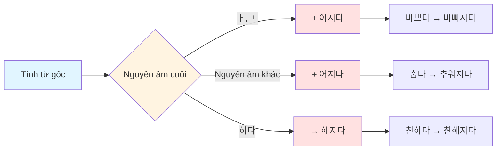
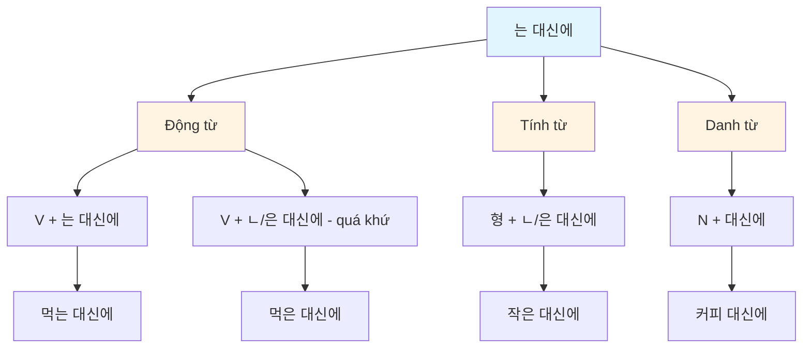
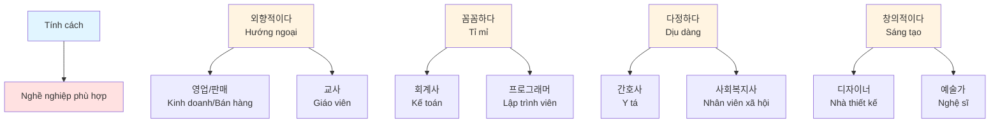
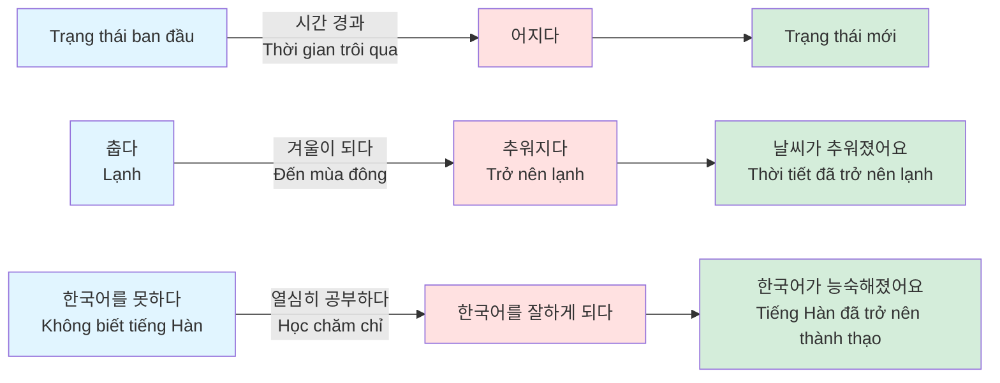
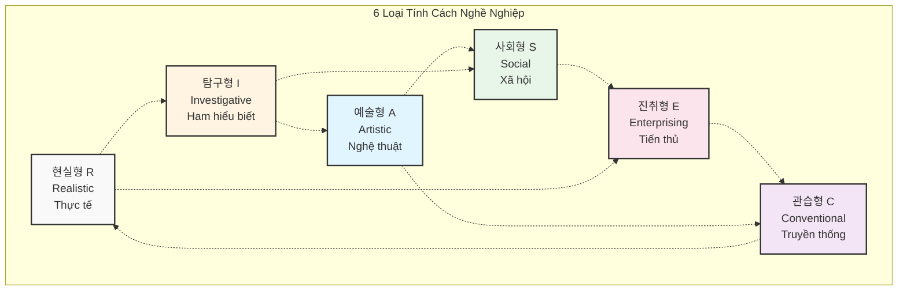
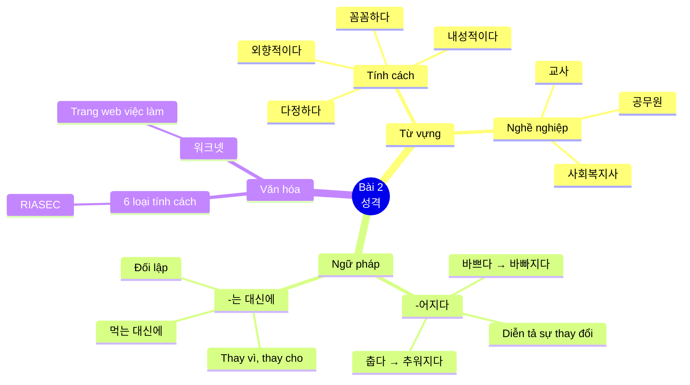

# BÀI 2: GIỚI THIỆU VỀ TÍNH CÁCH VÀ NGHỀ NGHIỆP

## MỤC TIÊU HỌC TẬP

- **Từ vựng**: Học các từ vựng về tính cách và nghề nghiệp
- **Ngữ pháp**:
  - `형-어지다`: Diễn tả sự thay đổi trạng thái
  - `동/형-는 대신(에)`: Diễn tả sự thay thế hoặc đối lập
- **Văn hóa & Thông tin**: Tìm hiểu về tính cách và nghề nghiệp trong xã hội Hàn Quốc

---

## I. TỪ VỰNG

### 1.1. Từ vựng về Tính cách

| Tiếng Hàn | Nghĩa tiếng Việt | Ví dụ |
|-----------|------------------|-------|
| 외향적이다 | Hướng ngoại | 저는 성격이 외향적이에요. 그래서 사람들과 이야기하는 것을 좋아해요. (Tôi có tính cách hướng ngoại. Nên tôi thích trò chuyện với mọi người.) |
| 내성적이다 | Hướng nội, rụt rè | 내성적이거든요. 한국에 온 지 두 달이 넘었는데 학교 친구들과 아직 못 어울리는 것 같아요. (Vì hướng nội. Đã đến Hàn Quốc được hơn hai tháng mà có vẻ vẫn chưa hòa đồng với bạn học.) |
| 적극적이다 | Tích cực | 일하기 전/후, 결혼하기 전/후에 성격이 적극적으로 변했어요. (Tính cách đã thay đổi tích cực trước/sau khi đi làm, trước/sau khi kết hôn.) |
| 소극적이다 | Thụ động, tiêu cực | 성격이 소극적이다. (Tính cách thụ động.) |
| 꼼꼼하다 | Tỉ mỉ, cẩn thận | 저는 일하기 전에는 좀 덜렁거렸어요. 하지만 요즘은 많이 꼼꼼해졌어요. (Trước khi đi làm tôi hơi bất cẩn. Nhưng gần đây đã trở nên tỉ mỉ hơn nhiều.) |
| 털털하다 | Phóng khoáng, thoải mái | 성격이 털털하다. (Tính cách phóng khoáng.) |
| 다정하다 | Dịu dàng, âu yếm | 성격이 다정하다. (Tính cách dịu dàng.) |
| 무뚝뚝하다 | Cộc cằn, lạnh lùng | 성격이 무뚝뚝하다. (Tính cách cộc cằn.) |
| 느긋하다 | Thong thả, chậm rãi | 고향에 있을 때는 성격이 느긋했어요. 한국에 와서 많이 급해졌어요. (Khi ở quê tính cách thong thả. Đến Hàn Quốc đã trở nên vội vã hơn nhiều.) |
| 급하다 | Vội vàng, nóng vội | 한국에 와서 많이 급해졌어요. (Đến Hàn Quốc đã trở nên vội vã hơn nhiều.) |
| 활발하다 | Hoạt bát, năng động | 태권도를 배운 후부터 많이 활발해졌어요. (Từ khi học Taekwondo đã trở nên hoạt bát hơn nhiều.) |
| 신중하다 | Thận trọng | 의사는 신중하면 좋을 것 같아요. (Y sĩ thì có vẻ thận trọng thì tốt.) |
| 예민하다 | Nhạy cảm | 성격이 예민하다. (Tính cách nhạy cảm.) |
| 유머 감각이 많다 | Có nhiều khiếu hài hước | 유머 감각이 많다. (Có nhiều khiếu hài hước.) |
| 자상하다 | Chu đáo, tận tình | 성격이 자상하다. (Tính cách chu đáo.) |
| 정이 많다 | Giàu tình cảm | 정이 많다. (Giàu tình cảm.) |
| 책임감이 강하다 | Có tinh thần trách nhiệm cao | 책임감이 강하다. (Có tinh thần trách nhiệm cao.) |
| 호기심이 많다 | Tò mò | 호기심이 많다. (Tò mò.) |

### 1.2. Từ vựng về Nghề nghiệp

| Tiếng Hàn | Nghĩa tiếng Việt | Ví dụ |
|-----------|------------------|-------|
| 교사(선생님) | Giáo viên | 교사(선생님)는 신중하면 좋을 것 같아요. (Giáo viên thì thận trọng thì tốt.) |
| 공무원 | Công chức | 공무원이 되고 싶어요. (Tôi muốn trở thành công chức.) |
| 출입국·외국인청 직원 | Nhân viên xuất nhập cảnh | 출입국·외국인청 직원으로 일해요. (Làm việc với tư cách nhân viên xuất nhập cảnh.) |
| 통역사 | Phiên dịch | 통역사가 되고 싶어요. (Tôi muốn trở thành phiên dịch.) |
| 미용사 | Thợ làm đẹp | 미용사/네일 아티스트로 일해요. (Làm việc với tư cách thợ làm đẹp/thợ làm móng.) |
| 네일 아티스트 | Thợ làm móng | 미용사/네일 아티스트로 일해요. (Làm việc với tư cách thợ làm đẹp/thợ làm móng.) |
| 사회 복지사 | Nhân viên phúc lợi xã hội | 사회 복지사로 일하고 있어요. (Đang làm việc với tư cách nhân viên phúc lợi xã hội.) |
| 간호사 | Y tá | 간호사는 다정하면 좋을 것 같아요. (Y tá thì dịu dàng thì tốt.) |
| 회계사 | Kế toán | 회계사는 꼼꼼하면 좋을 것 같아요. (Kế toán thì tỉ mỉ thì tốt.) |
| 프로그래머 | Lập trình viên | 프로그래머로 일하고 싶어요. (Tôi muốn làm việc với tư cách lập trình viên.) |

### 1.3. Từ vựng bổ sung

| Tiếng Hàn | Nghĩa tiếng Việt | Ví dụ |
|-----------|------------------|-------|
| 설레다 | Hồi hộp, xao xuyến | 다음 날 오전에 어머니께서 외출하시는 것을 보고 저는 아버지께 "놀았지만 결혼기념일 파티를 하면 어떨까요?"라고 말씀드렸습니다. (Sáng hôm sau nhìn thấy mẹ đi ra ngoài, tôi đã nói với bố "Tuy hơi muộn nhưng làm tiệc kỷ niệm ngày cưới thì sao ạ?") |
| 시끄럽다 | Ồn ào | 동생에게 집이 무슨 일이 있었는지 물어보니 "부모님이 결혼기념일에 그게 다녀셨는데 그때부터 대화를 안 하셔"라고 얘기 주었습니다. (Hỏi em gái việc gì đã xảy ra ở nhà, em ấy nói "Bố mẹ đã cãi vã vào ngày kỷ niệm ngày cưới mà từ đó không nói chuyện với nhau.") |
| 다투다 | Cãi nhau | 그래요? 거정하시겠어요. 그런 아이한테 동아리나 봉사 활동을 시키면 어떨까요? 우리 아이는 봉사 활동을 한 후부터 성격이 외향적이고 밝아진 것 같아요. (Vậy sao? Chắc lo lắm. Không cho con tham gia câu lạc bộ hay hoạt động tình nguyện thì sao? Con tôi từ khi hoạt động tình nguyện thì tính cách có vẻ trở nên hướng ngoại và vui vẻ hơn.) |
| 동호회 | Câu lạc bộ | 동호회 모임에 가셨는데 '특별한 날'인 것을 잊어버리고 방늦게 들어오신 겁니다. (Đã đi họp câu lạc bộ mà quên ngày đặc biệt và về muộn.) |
| 달라지다 | Thay đổi, khác đi | 성격이 달라졌다. (Tính cách đã thay đổi.) |
| 봉사 | Tình nguyện, phục vụ | 봉사 활동을 한 후부터 성격이 외향적이고 밝아진 것 같아요. (Từ khi hoạt động tình nguyện thì tính cách có vẻ trở nên hướng ngoại và vui vẻ hơn.) |
| 습관 | Thói quen | 아이에게 계획하는 습관을 만들어 주다. (Tạo thói quen lập kế hoạch cho con.) |
| (계획을) 세우다 | Lập (kế hoạch) | 계획을 세워서 일을 하니까 성격이 꼼꼼해지다. (Lập kế hoạch rồi làm việc nên tính cách trở nên tỉ mỉ.) |
| 스스로 자랑하다 | Tự hào, tự khen | 스스로 자랑하다. (Tự hào.) |
| 앞에 나서다 | Đứng ra, lên tiếng | 앞에 나서다. (Đứng ra.) |
| 불편하다 | Bất tiện, không quen | 예전에는 어땠어요? 지금은 어떻게 변했어요? (Trước đây thế nào? Bây giờ đã thay đổi như thế nào?) |
| 익숙하다 | Quen thuộc | 이제는 한국 생활에 많이 익숙해졌어요. (Bây giờ đã quen với cuộc sống ở Hàn Quốc hơn nhiều.) |
| 편하다 | Thoải mái, tiện lợi | 예전에는 한국 생활이 힘들었다. 하지만 요즘은 많이 편해졌어요. (Trước đây cuộc sống ở Hàn Quốc khó khăn. Nhưng gần đây đã trở nên thoải mái hơn nhiều.) |
| 어울리다 | Hòa hợp, hòa đồng | 한국에 온 지 두 달이 넘었는데 학교 친구들과 아직 못 어울리는 것 같아요. (Đã đến Hàn Quốc được hơn hai tháng mà có vẻ vẫn chưa hòa đồng với bạn học.) |
| (시간이) 걸리다 | Mất (thời gian) | 시간이 오래 걸리는 대신에 실수가 없으니까 괜찮아요. (Mặc dù mất nhiều thời gian nhưng không có sai sót nên không sao.) |
| 찾아뵙다 | Đến thăm (kính ngữ) | 부모님을 자주 찾아 뵙지 못하는 대신에 전화를 자주 드려요. (Thay vì không thường xuyên đến thăm bố mẹ, tôi thường xuyên gọi điện.) |
| 경험을 쌓다 | Tích lũy kinh nghiệm | 월급이 적은 대신에 다양한 경험을 쌓을 수 있어서 좋아요. (Tuy lương ít nhưng có thể tích lũy nhiều kinh nghiệm nên tốt.) |
| 동아리 | Câu lạc bộ | 동아리나 봉사 활동을 시키면 어떨까요? (Không cho tham gia câu lạc bộ hay hoạt động tình nguyện thì sao?) |
| 부끄럽다 | Xấu hổ, ngượng ngùng | 저도 한국에서 오래 살았지만 아직도 어려워요. 그래서 평소에 한국 사람들이 이야기하는 것을 신경 써서 듣고 많이 연습해요. (Tôi cũng đã sống ở Hàn Quốc lâu nhưng vẫn còn khó. Nên bình thường tôi chú ý nghe người Hàn nói chuyện và luyện tập nhiều.) |
| 장기 자랑 | Trình diễn tài năng | 동호회 모임에서 "미안해, 이제부터 달라질게."라고 말씀하시면서 선물을 주니까 어머니께서는 눈물을 흘리면서 좋아하셨습니다. (Tại buổi họp câu lạc bộ "Xin lỗi, từ giờ sẽ thay đổi" nói như vậy và tặng quà nên mẹ vừa rơi nước mắt vừa vui.) |
| 눈물을 흘리다 | Rơi nước mắt | 어머니께서는 눈물을 흘리면서 좋아하셨습니다. (Mẹ vừa rơi nước mắt vừa vui.) |

---

## II. NGỮ PHÁP

### 2.1. Ngữ pháp `형-어지다`: Trở nên, trở thành

#### 📚 Khái niệm

Cấu trúc **`형-어지다`** được sử dụng để diễn tả sự thay đổi trạng thái từ trạng thái trước sang trạng thái sau. Động từ **어지다** kết hợp với tính từ để chỉ sự biến đổi tự nhiên.

#### 🔧 Cấu tạo

```
Tính từ gốc + -어지다/-아지다/-해지다
```

**Quy tắc biến đổi:**

| Trường hợp | Cách biến đổi | Ví dụ |
|------------|---------------|-------|
| Nguyên âm cuối là ㅏ, ㅗ | + 아지다 | 바쁘다 → 바빠지다 |
| Nguyên âm khác | + 어지다 | 길다 → 길어지다 |
| Tính từ kết thúc bằng 하다 | 하다 → 해지다 | 친하다 → 친해지다 |

#### ✍️ Ví dụ minh họa

| Tính từ gốc | Công thức | Kết quả |
|-------------|-----------|---------|
| 바쁘다 (bận) | 바쁘 + 아지다 | 바빠지다 (trở nên bận) |
| 춥다 (lạnh) | 춥 + 어지다 | 추워지다 (trở nên lạnh) |
| 마르다 (gầy) | 마르 + 아지다 | 말라지다 (trở nên gầy) |
| 길다 (dài) | 길 + 어지다 | 길어지다 (trở nên dài) |
| 잦다 (thường xuyên) | 잦 + 아지다 | 잦아지다 (trở nên thường xuyên) |
| 좋다 (tốt) | 좋 + 아지다 | 좋아지다 (trở nên tốt hơn) |

#### 📝 Câu ví dụ

| Tiếng Hàn | Nghĩa tiếng Việt |
|-----------|------------------|
| 날씨가 더워졌어요. | Thời tiết trở nên nóng. |
| 한국에 와서 많이 급해졌어요. | Đến Hàn Quốc, tôi trở nên vội vã hơn nhiều. |
| 이제는 한국 생활에 많이 익숙해졌어요. | Bây giờ tôi đã quen với cuộc sống ở Hàn Quốc hơn nhiều. |

---

### 2.2. Ngữ pháp `동/형-는 대신(에)`: Thay vì, Thay cho

#### 📚 Khái niệm

Cấu trúc **`-는 대신(에)`** được sử dụng để diễn tả một hành động hoặc trạng thái được thực hiện **thay vì** hoặc **thay cho** một hành động/trạng thái khác. Nó thể hiện sự đối lập hoặc sự thay thế.

#### 🔧 Cấu tạo

```
Động từ/Tính từ + -는 대신(에)
```

**Quy tắc sử dụng:**

| Loại từ | Cách kết hợp | Ví dụ |
|---------|--------------|-------|
| Động từ (hiện tại) | Gốc + 는 대신(에) | 먹다 → 먹는 대신(에) |
| Động từ (quá khứ) | Gốc + ㄴ/은 대신(에) | 먹다 → 먹은 대신(에) |
| Tính từ | Gốc + ㄴ/은 대신(에) | 작다 → 작은 대신(에) |
| Danh từ | Danh từ + 대신(에) | 커피 → 커피 대신(에) |

#### 📊 Bảng phân loại chi tiết

**Với động từ:**

| Dạng | Cấu trúc | Ví dụ | Nghĩa |
|------|----------|-------|-------|
| Hiện tại | V + 는 대신(에) | 먹는 대신에 | Thay vì ăn |
| Quá khứ | V + ㄴ/은 대신(에) | 먹은 대신에 | Thay vì đã ăn |

**Với tính từ:**

| Trường hợp | Cấu trúc | Ví dụ | Nghĩa |
|------------|----------|-------|-------|
| Có patchim | 형 + 은 대신(에) | 작은 대신에 | Thay vì nhỏ |
| Không patchim | 형 + ㄴ 대신(에) | 큰 대신에 | Thay vì to |

**Với danh từ:**

| Cấu trúc | Ví dụ | Nghĩa |
|----------|-------|-------|
| N + 대신(에) | 커피 대신에 | Thay vì cà phê |
| N + 대신(에) | 물 대신에 | Thay vì nước |

#### ✍️ Ví dụ minh họa

| Tiếng Hàn | Nghĩa tiếng Việt |
|-----------|------------------|
| 시간이 오래 걸리는 대신에 실수가 없으니까 괜찮아요. | Mặc dù mất nhiều thời gian nhưng không có sai sót nên không sao. |
| 부모님을 자주 찾아 뵙지 못하는 대신에 전화를 자주 드려요. | Thay vì không thường xuyên đến thăm bố mẹ, tôi thường xuyên gọi điện. |
| 월급이 적은 대신에 다양한 경험을 쌓을 수 있어서 좋아요. | Tuy lương ít nhưng có thể tích lũy nhiều kinh nghiệm nên tốt. |
| 엘리베이터를 타는 대신에 계단을 자주 이용해요. | Thay vì đi thang máy, tôi thường xuyên sử dụng cầu thang. |
| 커피 대신에 물을 마셔요. | Uống nước thay vì cà phê. |

---

## III. BIỂU ĐỒ MINH HỌA

### 3.1. Biểu đồ cấu trúc ngữ pháp `-어지다`



### 3.2. Biểu đồ cấu trúc ngữ pháp `-는 대신(에)`



### 3.3. Mối quan hệ giữa Tính cách và Nghề nghiệp



### 3.4. Quy trình thay đổi trạng thái với `-어지다`



---

## III-B. HỘI THOẠI THỰC HÀNH (말하기)

### Tình huống 1: Nói về con có tính cách hướng nội

**Hội thoại mẫu:**

```
후엔: 고쳔 씨, 무슨 일이 있었어요? 얼굴이 안 좋아 보여요.

고쳔: 우리 아이 성격 때문에 고민이에요.

후엔: 성격이 성격이?

고쳔: 네, 애가 저를 닮아 성격이 많이 내성적이거든요. 한국에 온 지
      두 달이 넘었는데 학교 친구들과 아직 못 어울리는 것 같아요.

후엔: 그래요? 걱정하시겠어요. 그런 아이한테 동아리나 봉사 활동을 시키면 어떨까요?
      우리 아이는 봉사 활동을 한 후부터 성격이 외향적이고 밝아진 것 같아요.

고쳔: 그렇군요. 이따 집에 가서 우리 아이하고 얘기해 볼게요. 고마워요.
```

**Dịch:**

```
Huyền: Chị Gocheon, có chuyện gì vậy? Trông chị không được khỏe.

Gocheon: Tôi lo lắng về tính cách của con tôi.

Huyền: Tính cách ư?

Gocheon: Vâng, con bé giống tôi nên tính cách khá hướng nội. Đã đến Hàn Quốc
         được hơn hai tháng mà có vẻ vẫn chưa hòa đồng với bạn học.

Huyền: Vậy sao? Chắc chị lo lắng lắm. Không cho con tham gia câu lạc bộ hay
       hoạt động tình nguyện thì sao? Con tôi từ khi hoạt động tình nguyện thì
       tính cách có vẻ trở nên hướng ngoại và vui vẻ hơn.

Gocheon: Vậy à. Chiều nay về nhà tôi sẽ nói chuyện với con. Cảm ơn chị.
```

### Bài tập thực hành:

**1) Tình huống: Trẻ hướng nội**
- **Vấn đề:** 내성적이다, 한국에 온 지 두 달이 넘었는데 학교 친구들과 아직 못 어울리다
- **Giải pháp:** 아이한테 동아리나 봉사 활동을 시키다
- **Kết quả:** 봉사 활동을 한 후부터 성격이 외향적이고 밝다

**2) Tình huống: Trẻ hay vội vàng, hay sai sót**
- **Vấn đề:** 성격이 급하다, 무슨 일을 할 때 자꾸 실수하다
- **Giải pháp:** 아이에게 계획하는 습관을 만들어 주다
- **Kết quả:** 계획표를 세워서 일을 하니까 성격이 꼼꼼해지다

---

## III-C. BÀI TẬP NGHE (듣기)

### Bài nghe 1: Quan sát và suy đoán tính cách

**1. 두 사람의 모습을 보고 어떤 성격인지 추측하고 이야기해 보세요.**

Quan sát hình ảnh hai người và suy đoán tính cách của họ.

### Bài nghe 2: Hội thoại giữa 에나 và 제이슨

**2. 에나 씨와 제이슨 씨가 이야기합니다. 잘 듣고 질문에 답해 보세요.**

**Câu hỏi:**

**1) 에나 씨의 성격은 어떻습니까?**

   _______________________________________________________

**2) 제이슨 씨는 성격이 왜, 어떻게 달라졌습니까?**

   _______________________________________________________

**3) 들은 내용과 같으면 ○, 다르면 X 하세요.**

   ① 제이슨 씨는 행사에 참여할 것이다. (    )

   ② 에나 씨는 제이슨 씨의 성격을 부러워한다. (    )

   ③ 제이슨 씨는 한국에 와서 성격이 달라졌다. (    )

**Gợi ý từ vựng:**
- 장기 자랑 (trình diễn tài năng)
- 앞에 나서다 (đứng ra, lên tiếng)
- 부끄럽다 (ngượng, xấu hổ)

---

### 📝 **Phát âm (발음)**

**Quy tắc phát âm: [ㄱ, ㄷ, ㅂ, ㅈ] + [ㅎ]**

Khi các âm [ㄱ, ㄷ, ㅂ, ㅈ] đứng trước [ㅎ], chúng kết hợp tạo thành âm khí âm [ㅋ, ㅌ, ㅍ, ㅊ]:

```
    [ㄱ, ㄷ, ㅂ, ㅈ]  +  [ㅎ]  →  [ㅋ, ㅌ, ㅍ, ㅊ]
```

**Ví dụ:**

1) 결을 전에는 **무뚝뚝했어요**.
   → 무똑**뚝캤**어요 (ㄱ + ㅎ → ㅋ)

2) 저는 성격이 **급해서** 실수를 많이 해요.
   → **그패서** (ㅂ + ㅎ → ㅍ)

3) 고향에 있을 때는 **느긋해졌어요**.
   → **느그**태졌어요 (ㄱ + ㅎ → ㅋ)

**Lưu ý:**
- 무뚝뚝했어요 [무똑뚝캤어요] - "ㄱ + ㅎ" phát âm thành [ㅋ]
- 급해서 [그패서] - "ㅂ + ㅎ" phát âm thành [ㅍ]
- 느긋해졌어요 [느그태졌어요] - "ㄱ + ㅎ" phát âm thành [ㅋ]

---

## III-D. BÀI TẬP ĐỌC (읽기)

### Bài đọc 1: Nghề nghiệp và tính cách phù hợp

**1. 다음의 직업은 어떤 성격과 어울릴까요? 보기를 보고 친구들과 이야기해 보세요.**

Nghề nghiệp nào phù hợp với tính cách nào? Hãy thảo luận với bạn bè.

**Ngân hàng từ vựng:**
- 개방적이다 (cởi mở)
- 보수적이다 (bảo thủ)
- 신중하다 (thận trọng)
- 예민하다 (nhạy cảm)
- 유머 감각이 많다 (có khiếu hài hước)
- 자상하다 (chu đáo)
- 정이 많다 (giàu tình cảm)
- 책임감이 강하다 (có trách nhiệm cao)
- 호기심이 많다 (tò mò)
- 활발하다 (hoạt bát)
- 꼼꼼하다 (tỉ mỉ)

**Các nghề nghiệp:**

| Nghề nghiệp | Tính cách phù hợp |
|-------------|-------------------|
| 교사(선생님) - Giáo viên | 의사는 신중하면 좋을 것 같아요 |
| 출입국·외국인청 직원 - Nhân viên xuất nhập cảnh | |
| 공무원 - Công chức | |
| 통역사 - Phiên dịch | |
| 미용사/네일 아티스트 - Thợ làm đẹp | |
| 사회 복지사 - Nhân viên xã hội | |

---

### Bài đọc 2: Tư vấn về tính cách

**2. 다음은 성격 고민에 대한 글입니다. 글을 읽고 조언해 보세요.**

#### **Q1: 저는 회장을 판매합니다.**

저는 한 달 전에 입사한 신입 사원입니다. 제 성격 때문에 고민이 있습니다. 저는 친한 사람들과 대화할 때는 말도 잘 하고 다정한 편인데 업무로 만나는 사람들하고는 이야기를 나누는 것이 힘듭니다. 제 일이 회장을 판매하는 것이라서 손님들과 적극적이고 활발하게 대화해야 하는데 그게 잘 안 됩니다. 저 어떻게 해야 할까요?

**Dịch:**

Tôi làm việc bán hàng. Tôi là nhân viên mới vào làm cách đây một tháng. Tôi có lo lắng về tính cách của mình. Khi nói chuyện với người thân, tôi nói tốt và khá dịu dàng, nhưng khi nói chuyện với người gặp trong công việc thì rất khó. Công việc của tôi là bán hàng nên phải trò chuyện tích cực và hoạt bát với khách hàng, nhưng điều đó không dễ dàng. Tôi phải làm sao đây?

#### **A1: happy님 답변**

(Học viên tự viết lời khuyên)

---

### Bài đọc 3: Câu chuyện gia đình - Làm tiệc kỷ niệm ngày cưới

지난주에 휴가를 받아서 고향에 갔습니다. 오랫만에 가족을 만나는 것이어서 설레는 마음으로 집에 도착했습니다. 저희 가족은 모두 다정하고 유머 감각이 많아서 늘 대화도 많이 하고 집안이 시끄러운 편인데 이날은 조용했습니다. 동생에게 집에 무슨 일이 있었는지 물어보니 "부모님이 결혼기념일에 크게 다투셨는데 그때부터 대화를 안 하셔."라고 얘기 주었습니다.

저희 아버지는 여행사를 운영하고 계십니다. 적극적이고 활발한 편이시라서 주변에 아는 사람도 많고 모임에 나가는 걸 좋아하십니다. 그날에도 동호회 모임에 가셨는데 '특별한 날'인 것을 잊어버리고 밤늦게 들어오신 겁니다. 어머니는 아버지를 저녁 내내 기다리셨죠. 그런데 아버지는 동호회 모임에서 저녁을 드셨을 거예요. 그게 얘기하고 계셨습니다.

다음 날 오전에 어머니께서 외출하시는 것을 보고 저는 아버지께 "늦었지만 결혼기념일 파티를 하면 어떨까요?"라고 말씀드렸습니다. 아버지께서는 "그거 좋은 생각이다. 같이 준비하자."라고 하셨고 저와 동생은 아버지를 도와 작은 파티를 준비했습니다. 아버지와 동생은 어머니 선물을 사러 나갔고 저는 요리를 만들었습니다.

얼마 후 어머니께서 오셨습니다. 드디어 식사 시간이 되어 가족이 모두 식탁 앞에 앉았습니다. 그때 아버지께서 "미안해, 이제부터 달라질게."라고 말씀하시면서 선물을 주니까 어머니께서는 눈물을 흘리면서 좋아하셨습니다. 우리는 모두 크게 웃었습니다.

**Dịch:**

Tuần trước tôi được nghỉ phép nên đã về quê. Vì lâu lắm mới gặp gia đình nên tôi về đến nhà với tâm trạng háo hức. Gia đình tôi ai cũng dịu dàng và giàu khiếu hài hước nên lúc nào cũng trò chuyện nhiều và nhà cửa ồn ào, nhưng hôm đó lại yên lặng. Tôi hỏi em gái có chuyện gì xảy ra ở nhà, em ấy nói "Bố mẹ đã cãi nhau lớn vào ngày kỷ niệm kết hôn mà từ đó không nói chuyện với nhau."

Bố tôi đang điều hành công ty du lịch. Bố khá tích cực và hoạt bát nên quen biết nhiều người xung quanh và thích tham gia các buổi gặp mặt. Hôm đó cũng vậy, bố đã đi họp câu lạc bộ mà quên mất 'ngày đặc biệt' và về muộn. Mẹ đã chờ bố suốt buổi tối. Nhưng bố lại ăn tối ở buổi họp câu lạc bộ rồi. Đó là điều mẹ đang tức giận.

Sáng hôm sau nhìn thấy mẹ đi ra ngoài, tôi đã nói với bố "Tuy hơi muộn nhưng làm tiệc kỷ niệm ngày cưới thì sao ạ?". Bố nói "Đó là ý kiến hay. Cùng chuẩn bị nhé." và tôi cùng em gái đã giúp bố chuẩn bị một bữa tiệc nhỏ. Bố và em gái đi mua quà cho mẹ còn tôi làm món ăn.

Một lúc sau mẹ về. Cuối cùng đến giờ ăn, cả gia đình ngồi quanh bàn ăn. Lúc đó bố nói "Xin lỗi, từ giờ sẽ thay đổi." vừa nói vừa tặng quà, mẹ vừa rơi nước mắt vừa vui mừng. Chúng tôi đều cười lớn.

**Câu hỏi đọc hiểu:**

**1) 라흐만 씨가 고향 집에 갔을 때 가족에게 무슨 일이 있었습니까?**

_______________________________________________________

**2) 아버지의 직업은 무엇입니까? 또 성격은 어떻습니까?**

_______________________________________________________

**3) 윗글의 내용과 같으면 ○, 다르면 X 하세요.**

   ① 라흐만 씨 가족은 보통 조용한 편이다. (    )

   ② 라흐만 씨 아버지와 동생은 어머니 선물을 샀다. (    )

   ③ 라흐만 씨는 밥에 나가는 대신에 저녁 식사를 준비했다. (    )

   ④ 라흐만 씨는 부모님 결혼기념일에 같이 저녁 식사를 했다. (    )

**Gợi ý từ vựng:**
- 설레다 (hồi hộp, xao xuyến)
- 시끄럽다 (ồn ào)
- 다투다 (cãi nhau)
- 동호회 (câu lạc bộ)
- 달라지다 (thay đổi)
- 눈물을 흘리다 (rơi nước mắt)

---

## III-E. BÀI TẬP VIẾT (쓰기)

### Bài viết 1: Viết về tính cách của bản thân

**1. 여러분의 성격은 어떻습니까? 자신의 성격에 대해 메모해 보세요.**

Tính cách của bạn như thế nào? Hãy ghi chú về tính cách của mình.

| 성격 | 구체적인 상황 · 예시 |
|------|---------------------|
| **장점** (Điểm mạnh) | |
| **단점** (Điểm yếu) | |

### Bài viết 2: Viết bài văn về tính cách

**2. 위의 메모를 바탕으로 자신의 성격에 대해 장점과 단점을 써 보세요.**

Dựa vào ghi chú trên, hãy viết về điểm mạnh và điểm yếu trong tính cách của bạn.

**Gợi ý cấu trúc:**

- **Phần mở bài:** Giới thiệu về tính cách tổng quan
- **Phần thân bài:**
  - Điểm mạnh và ví dụ cụ thể
  - Điểm yếu và ví dụ cụ thể
  - Cách cải thiện điểm yếu
- **Phần kết:** Kết luận và mục tiêu phát triển

---

## IV. BÀI TẬP THỰC HÀNH

### Bài 1: Hoàn thành câu với `-어지다`

Biến đổi tính từ trong ngoặc sang dạng `-어지다` phù hợp:

1. 한국 생활이 힘들다 → 예전에는 어땠어요? 지금은 어떻게 **_____________**?
   > *Cuộc sống ở Hàn Quốc khó khăn → Trước đây thế nào? Bây giờ đã...?*

2. 물건 값이 싸다 → 요즘 **_____________**.
   > *Giá hàng rẻ → Gần đây đã...*

3. 한국 생활이 익숙하다 → 한국 생활에 **_____________**.
   > *Quen với cuộc sống Hàn Quốc → Đã trở nên...*

4. 한국어 발음이 나쁘다 → 발음이 **_____________**.
   > *Phát âm tiếng Hàn kém → Phát âm đã...*

---

### Bài 2: Hoàn thành câu với `-는 대신(에)`

Kết hợp các câu sau sử dụng `-는 대신(에)`:

1. 회사는 어떠요? / 일이 힘들어요?
   > 저는 **_____________ 타는 대신에** 계단을 자주 이용해요.

2. 엘리베이터를 타다 / 계단을 자주 이용하다
   > 저는 엘리베이터를 **_____________** 계단을 자주 이용해요.

3. 커피를 마시다 / 물을 마시다
   > 저는 커피를 마시는 **_____________** 물을 마셔요.

---

### Bài 3: Điền từ vựng về tính cách phù hợp

Chọn từ thích hợp điền vào chỗ trống:

**Ngân hàng từ vựng:**
- 외향적이다, 내성적이다, 적극적이다, 소극적이다, 꼼꼼하다, 털털하다, 다정하다, 무뚝뚝하다

1. 고쳔 씨 무슨 일이 있었어요? 얼굴이 안 좋아 보여요.
   → 고쳔: 우리 아이 성격 때문에 고민이에요.

2. 후엔: 성격이 **_____________**?

3. 고쳔: 네, 애가 저를 닮아 성격이 많이 **_____________**거든요. 한국에 온 지 두 달이 넘었는데 학교 친구들과 아직 못 어울리는 것 같아요.

---

## V. VẤN ĐỀ VĂN HÓA & THÔNG TIN

### 5.1. Giới thiệu về Tính cách và Nghề nghiệp trong xã hội Hàn Quốc

Tính cách của một người đóng vai trò quan trọng trong việc lựa chọn nghề nghiệp. Tại Hàn Quốc, có một trang web phổ biến là **워크넷(www.work.go.kr)** cung cấp nhiều bài kiểm tra tính cách để giúp mọi người tìm ra nghề nghiệp phù hợp với mình.

Theo đó, tính cách của một người có thể được phân loại thành:
- **현실형(R)** - Realistic: Thực tế
- **탐구형(I)** - Investigative: Ham hiểu biết
- **예술형(A)** - Artistic: Nghệ thuật
- **사회형(S)** - Social: Xã hội
- **진취형(E)** - Enterprising: Tiến thủ
- **관습형(C)** - Conventional: Truyền thống

### 5.2. Biểu đồ 6 loại tính cách nghề nghiệp (RIASEC)



### 5.3. Đặc điểm của từng loại tính cách

| Loại tính cách | Đặc điểm | Nghề nghiệp phù hợp |
|----------------|----------|---------------------|
| **현실형(R)** | Phân minh, chính xác, thực tế. Thích làm việc với tay chân, máy móc, công cụ | Kỹ sư, Nông dân, Thợ cơ khí, Điện công, Nông lâm ngư |
| **탐구형(I)** | Phân tích, tò mò, logic. Yêu thích nghiên cứu, khám phá | Nhà khoa học, Nhà nghiên cứu, Bác sĩ, Giáo sư |
| **예술형(A)** | Sáng tạo, giàu tưởng tượng, tự do. Thích thể hiện cảm xúc | Nhà thiết kế, Họa sĩ, Nhạc sĩ, Diễn viên, Nhà văn |
| **사회형(S)** | Hòa đồng, quan tâm người khác, giàu lòng trắc ẩn | Giáo viên, Y tá, Nhân viên xã hội, Tư vấn viên |
| **진취형(E)** | Lãnh đạo, quyết đoán, thuyết phục. Định hướng mục tiêu | Doanh nhân, Luật sư, Chính trị gia, Quản lý |
| **관습형(C)** | Ngăn nắp, tuân thủ quy tắc, cẩn thận, chính xác | Kế toán, Nhân viên văn phòng, Thủ thư, Thư ký |

### 5.4. Danh sách các nghề nghiệp thường gặp

#### Nghề nghiệp phổ biến tại Hàn Quốc

| Tiếng Hàn | Nghĩa tiếng Việt | Loại tính cách phù hợp |
|-----------|------------------|------------------------|
| 공무원 | Công chức | C (관습형) |
| 교사 | Giáo viên | S (사회형) |
| 네일 아티스트 | Thợ làm móng | A (예술형) |
| 통역사 | Phiên dịch | I (탐구형) |
| 사회복지사 | Nhân viên phúc lợi xã hội | S (사회형) |
| 간호사 | Y tá | S (사회형) |
| 회계사 | Kế toán | C (관습형) |
| 프로그래머 | Lập trình viên | I (탐구형) |
| 디자이너 | Nhà thiết kế | A (예술형) |
| 기업가 | Doanh nhân | E (진취형) |

---

## VI. TÓM TẮT BÀI HỌC

### 6.1. Điểm chính cần ghi nhớ



### 6.2. Tóm tắt ngữ pháp

| Ngữ pháp | Ý nghĩa | Cấu trúc | Ví dụ |
|----------|---------|----------|-------|
| **-어지다** | Trở nên, trở thành | Tính từ + 어/아/해지다 | 춥다 → 추워지다 |
| **-는 대신(에)** | Thay vì, thay cho | V/A/N + (는) 대신(에) | 먹는 대신에, 커피 대신에 |

---

## VII. HƯỚNG DẪN HỌC TẬP

### 7.1. Cách học từ vựng hiệu quả

1. **Ghi nhớ theo nhóm**: Phân loại từ vựng theo chủ đề (tính cách, nghề nghiệp)
2. **Sử dụng flashcard**: Tạo thẻ ghi nhớ với từ vựng và ví dụ
3. **Luyện tập hàng ngày**: Mỗi ngày học 10-15 từ mới
4. **Tạo câu ví dụ**: Viết câu với từ vựng mới để ghi nhớ tốt hơn

### 7.2. Cách luyện ngữ pháp

1. **Hiểu nguyên tắc**: Nắm vững quy tắc biến đổi của `-어지다` và `-는 대신(에)`
2. **Thực hành viết**: Tạo 5-10 câu mới cho mỗi ngữ pháp
3. **Luyện nói**: Luyện tập nói với bạn bè hoặc giáo viên
4. **Sử dụng thực tế**: Áp dụng ngữ pháp vào giao tiếp hàng ngày

---

## VIII. ĐÁP ÁN BÀI TẬP

### Đáp án Bài 1:

1. 힘들어졌어요? / 편해졌어요?
2. 싸졌어요 / 비싸졌어요
3. 익숙해졌어요
4. 좋아졌어요 / 나아졌어요

### Đáp án Bài 2:

1. 회사는 오늘도 많이 **힘든 대신에** 돈을 많이 벌어요.
2. 엘리베이터를 **타는 대신에** 계단을 자주 이용해요.
3. 커피를 **마시는 대신에** 물을 마셔요.

### Đáp án Bài 3:

1. (Tùy ngữ cảnh)
2. 내성적이에요?
3. 내성적이거든요

---

## IX. TÀI LIỆU THAM KHẢO

- 워크넷 (www.work.go.kr) - Trang web việc làm Hàn Quốc
- RIASEC Career Assessment - Đánh giá nghề nghiệp theo tính cách
- Giáo trình Tiếng Hàn Tổng hợp trung cấp 1

---

**Chúc bạn học tốt!**
