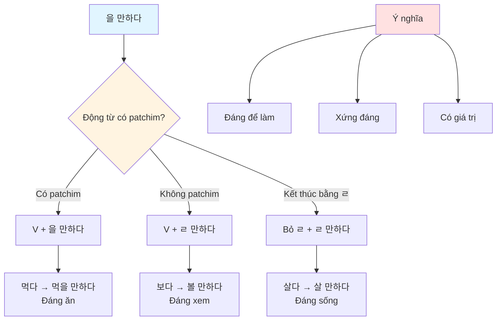
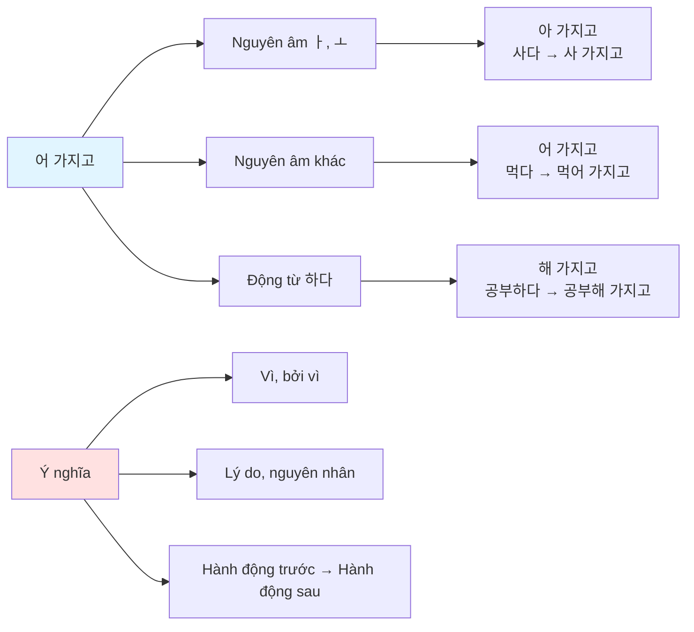
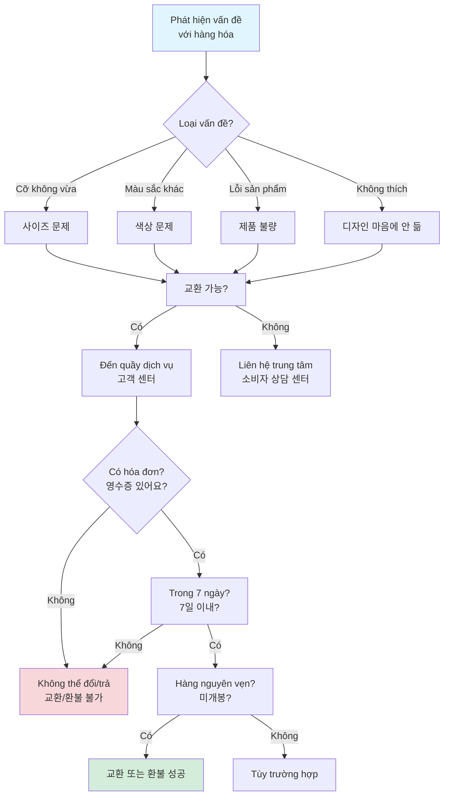
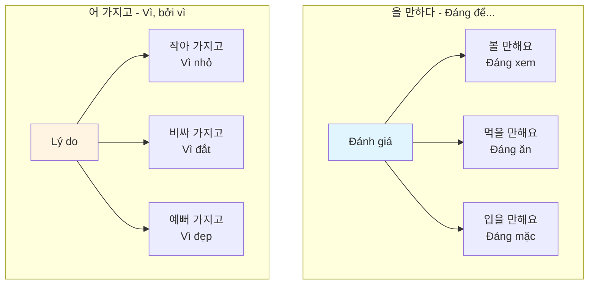
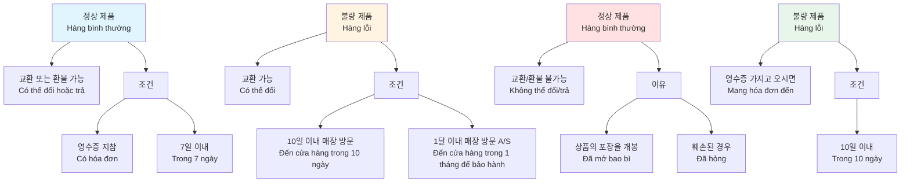
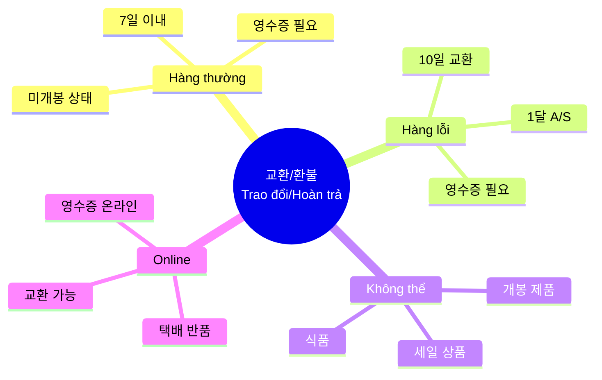
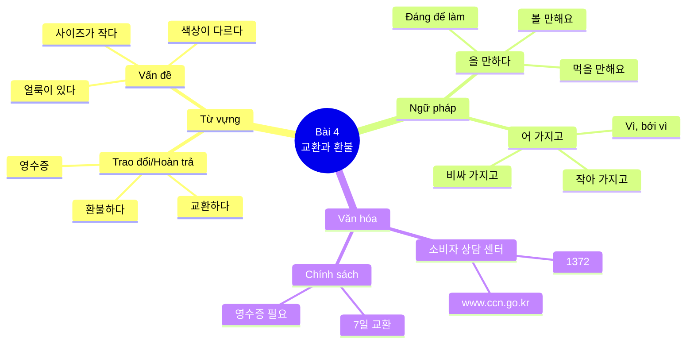

# BÀI 4: TRAO ĐỔI VÀ HOÀN TRẢ HÀNG HÓA

## MỤC TIÊU HỌC TẬP

- **Từ vựng**: Học các từ vựng về trao đổi, hoàn trả hàng hóa
- **Ngữ pháp**:
  - `동-을 만하다`: Đáng để làm gì, xứng đáng
  - `동/형-어 가지고`: Vì, bởi vì (lý do)
- **Văn hóa & Thông tin**: Tìm hiểu về Trung tâm Tư vấn Người tiêu dùng

---

## I. TỪ VỰNG - 어휘

### Bài tập khởi động

#### 1. 물건에 어떤 문제가 있어요? (Đồ có vấn đề gì?)

Các vấn đề thường gặp với hàng hóa:

- **사이즈가 작다** - Cỡ nhỏ
- **색상이 다르다** - Màu sắc khác
- **바지가 헐렁하다** - Quần rộng
- **바지가 끼다** - Quần chật
- **얼룩이 있다** - Có vết bẩn
- **단추가 떨어지다** - Cúc rơi
- **바느질이 잘못되다** - Khâu sai
- **디자인이 마음에 안 들다** - Không thích thiết kế

#### 2. 물건에 문제가 있을 때는 어떻게 해요? (Khi đồ có vấn đề thì làm thế nào?)

Các cách giải quyết:

- **교환하다** - Trao đổi, đổi hàng
- **고객 센터에 문의하다** - Hỏi tại trung tâm khách hàng
- **환불하다** - Hoàn tiền
- **소비자 상담 센터에 상담하다** - Tư vấn tại Trung tâm Tư vấn Người tiêu dùng

---

## II. DANH SÁCH TỪ VỰNG CHI TIẾT

### 1.1. Từ vựng về Trao đổi và Hoàn trả

| Tiếng Hàn | Nghĩa tiếng Việt | Ví dụ |
|-----------|------------------|-------|
| 교환하다 | Trao đổi, đổi | 어제 산 건데 단추가 떨어져 가지고 교환하고 싶은데요. (Hôm qua mua mà cúc rơi nên muốn đổi.) |
| 환불하다 | Hoàn tiền, trả lại tiền | 환불을 받을 수 있습니다. (Có thể nhận hoàn tiền.) |
| 사이즈가 작다 | Cỡ nhỏ | 사이즈가 좀 작아 가지고 큰 사이즈로 교환하려고요. (Cỡ hơi nhỏ nên định đổi sang cỡ lớn hơn.) |
| 색상이 다르다 | Màu sắc khác | 색상이나 디자인이 맞는지 확인해 보시겠어요? (Bạn kiểm tra xem màu sắc hoặc thiết kế có vừa ý không?) |
| 바지가 헐렁하다 | Quần rộng, thùng thình | 바지가 헐렁하다 (Quần rộng) |
| 바지가 끼다 | Quần chật, bó | 바지가 짧지만 입을 만해요. (Quần ngắn nhưng vẫn mặc được.) |
| 얼룩이 있다 | Có vết bẩn | 얼룩이 있다 (Có vết bẩn) |
| 단추가 떨어지다 | Cúc rơi, cúc bị tuột | 어제 산 셔츠 단추가 떨어져 가지고 교환하고 싶은데요. (Áo sơ mi hôm qua mua cúc rơi nên muốn đổi.) |
| 바느질이 잘못되다 | Khâu sai, khâu lỗi | 바느질이 잘못되다 (Khâu sai) |
| 디자인이 마음에 안 들다 | Không thích thiết kế | 디자인이 마음에 안 들다 (Không thích thiết kế) |
| 고객 센터에 문의하다 | Hỏi tại trung tâm khách hàng | 고객 센터에 문의하다 (Hỏi tại trung tâm khách hàng) |
| 소비자 상담 센터에 상담하다 | Tư vấn tại trung tâm tư vấn người tiêu dùng | 소비자 상담 센터에 상담하다 (Tư vấn tại trung tâm tư vấn người tiêu dùng) |

### 1.2. Từ vựng về Vấn đề và Lý do

| Tiếng Hàn | Nghĩa tiếng Việt | Ví dụ |
|-----------|------------------|-------|
| 불량품 | Hàng lỗi, hàng kém chất lượng | 불량 제품 - 10일 이내 매장을 방문할 경우 교환 가능합니다. (Hàng lỗi - Có thể đổi nếu đến cửa hàng trong 10 ngày.) |
| 파손되다 | Bị hỏng, bị vỡ | 배송 중 파손 (Hỏng trong quá trình giao hàng) |
| 훼손되다 | Bị hư hại, bị làm hỏng | 상품의 포장을 개봉, 훼손된 경우 (Trường hợp đã mở bao bì, làm hỏng sản phẩm) |
| 가격이 비싸다 | Giá đắt | 새 자동차는 비싸 가지고 지금 못 사겠어요. (Xe mới đắt quá nên bây giờ không thể mua.) |
| 품질이 나쁘다 | Chất lượng kém | 품질이 나쁘다 (Chất lượng kém) |
| 배송 중 파손 | Hỏng trong quá trình giao hàng | 배송 중 파손 (Hỏng trong quá trình giao hàng) |
| 제품 결함 | Lỗi sản phẩm | 제품 결함 (Lỗi sản phẩm) |
| 기간이 지나다 | Hết hạn | 기간이 지나다 (Hết hạn) |
| 주문한 것과 다르다 | Khác với đơn đặt hàng | 주문한 것과 다르다 (Khác với đơn đặt hàng) |

### 1.3. Từ vựng về Mua sắm trực tuyến

| Tiếng Hàn | Nghĩa tiếng Việt | Ví dụ |
|-----------|------------------|-------|
| 인터넷 쇼핑 | Mua sắm trực tuyến | 인터넷 쇼핑은 교환은 쉽지만 환불하기는 어려웠다. (Mua sắm online thì đổi dễ nhưng hoàn tiền khó.) |
| 택배 | Chuyển phát nhanh | 택배비 (Phí giao hàng) |
| 주문하다 | Đặt hàng | 주문한 것과 다르다 (Khác với đơn đặt hàng) |
| 배송 | Giao hàng | 배송 중 파손 (Hỏng trong quá trình giao hàng) |
| 반품하다 | Trả lại hàng | 인터넷 쇼핑에는 교환과 환불이 모두 공짜이다. (Ở mua sắm online thì đổi và trả đều miễn phí.) |
| 영수증 | Hóa đơn, biên lai | 결제하신 카드하고 영수증은 가지고 오셨지요? (Bạn có mang theo thẻ thanh toán và hóa đơn chưa?) |
| 포장하다 | Đóng gói | 상품의 포장을 개봉, 훼손된 경우 (Trường hợp đã mở bao bì, làm hỏng sản phẩm) |

### 1.4. Từ vựng bổ sung

| Tiếng Hàn | Nghĩa tiếng Việt | Ví dụ |
|-----------|------------------|-------|
| 휴대폰 | Điện thoại di động | 휴대폰 (Điện thoại di động) |
| 구입하다 | Mua, sắm | 구입하다 (Mua) |
| 신선식품 | Thực phẩm tươi sống | 신선식품, 냉동식품의 경우 7일 이내 (Trường hợp thực phẩm tươi sống, đông lạnh trong 7 ngày) |
| 냉동식품 | Thực phẩm đông lạnh | 신선식품, 냉동식품의 경우 7일 이내 (Trường hợp thực phẩm tươi sống, đông lạnh trong 7 ngày) |
| 파손 | Vỡ, hỏng | 배송 중 파손 (Hỏng trong quá trình giao hàng) |
| 수선하다 | Sửa chữa | 수선하다 (Sửa chữa) |
| 불가능 | Không thể | 교환/환불 불가능 (Không thể đổi/trả) |
| 미개봉 | Chưa mở, chưa bóc | 박스 미개봉의 경우 12월 이내 교환, 환불이 가능합니다. (Trường hợp hộp chưa mở thì trong 12 tháng có thể đổi, trả.) |
| 개봉하다 | Mở, bóc | 상품의 포장을 개봉, 훼손된 경우 (Trường hợp đã mở bao bì, làm hỏng sản phẩm) |
| 특별하다 | Đặc biệt | 특별하다 (Đặc biệt) |
| 세일 상품 | Hàng giảm giá | 세일 상품 (Hàng giảm giá) |
| 소비자 | Người tiêu dùng | 소비자 상담 센터 (Trung tâm Tư vấn Người tiêu dùng) |
| 가격표 | Nhãn giá, tem giá | 이 제품도 교환이나 환불 원하시면 일주일 이내에 가격표 제거하지 마시고 가져오세요. (Sản phẩm này nếu muốn đổi hoặc trả thì đừng bỏ nhãn giá và mang đến trong một tuần.) |
| 실수 | Nhầm lẫn, sai lầm | 실수 (Nhầm lẫn) |
| 택배비 | Phí giao hàng | 택배비 (Phí giao hàng) |
| 추천하다 | Giới thiệu, đề xuất | 추천하다 (Giới thiệu) |
| 문의하다 | Hỏi, tư vấn | 고객 센터에 문의하다 (Hỏi tại trung tâm khách hàng) |
| 상담하다 | Tư vấn | 소비자 상담 센터에 상담하다 (Tư vấn tại trung tâm tư vấn người tiêu dùng) |
| 가능하다 | Có thể | 교환 또는 환불이 가능합니다 (Có thể đổi hoặc trả) |
| 반납하다 | Trả lại | 반납하다 (Trả lại) |
| 구매점 | Cửa hàng đã mua | 구매점 (Cửa hàng đã mua) |
| 판매자 | Người bán hàng | 판매자 (Người bán hàng) |
| 차수 | Số lần, lượt | 차수 (Số lần) |

---

## III. NGỮ PHÁP

### 3.1. Ngữ pháp `동-을 만하다`: Đáng để..., xứng đáng

#### 📚 Khái niệm

Cấu trúc **`동-을 만하다`** được sử dụng để diễn tả một việc gì đó **đáng để làm** hoặc **xứng đáng** với hành động đó. Nó thể hiện rằng việc thực hiện hành động nào đó là hợp lý hoặc có giá trị.

#### 🔧 Cấu tạo

```
Động từ gốc + -을 만하다/-ㄹ 만하다
```

**Quy tắc biến đổi:**

| Trường hợp | Cách kết hợp | Ví dụ |
|------------|--------------|-------|
| Động từ có patchim | V + 을 만하다 | 먹다 → 먹을 만하다 |
| Động từ không có patchim | V + ㄹ 만하다 | 가다 → 갈 만하다 |
| Động từ kết thúc bằng ㄹ | Bỏ ㄹ + ㄹ 만하다 | 살다 → 살 만하다 |

#### 📊 Bảng biến đổi

| Động từ gốc | Có patchim? | Kết quả |
|-------------|-------------|---------|
| 먹다 (ăn) | Có | 먹을 만하다 (đáng ăn) |
| 보다 (xem) | Không | 볼 만하다 (đáng xem) |
| 읽다 (đọc) | Có | 읽을 만하다 (đáng đọc) |
| 만들다 (làm) | Có (ㄹ) | 만들 만하다 (đáng làm) |
| 듣다 (nghe) | Có | 들을 만하다 (đáng nghe) |

#### ✍️ Ví dụ minh họa

**So sánh ý nghĩa:**

| Câu | Nghĩa | Giải thích |
|-----|-------|------------|
| 이 책을 읽을 만해요. | Cuốn sách này đáng đọc. | Cuốn sách có giá trị đọc |
| 이 영화는 볼 만해요. | Bộ phim này đáng xem. | Bộ phim có giá trị xem |
| 물건이 쌀 만해요. | Đồ này đáng mua (giá hợp lý). | Giá cả phù hợp |

#### 📝 Câu ví dụ

| Tiếng Hàn | Nghĩa tiếng Việt |
|-----------|------------------|
| 사회통합프로그램 3단계 공부가 어때요? | Học chương trình Hội nhập Xã hội cấp 3 thế nào? |
| 2단계보다 어렵지만 공부할 만해요. | Khó hơn cấp 2 nhưng đáng học. |
| 물냉면은 맵지 않아서 먹을 만해요. | Mì lạnh nước không cay nên đáng ăn. |
| 요즘 볼 만한 영화가 있으면 소개해 주세요. | Nếu có phim nào đáng xem gần đây thì giới thiệu cho tôi. |
| 바지가 짧지요? | Quần ngắn phải không? |
| 바지가 짧지만 입을 만해요. | Quần ngắn nhưng vẫn mặc được. |

---

### 3.2. Ngữ pháp `동/형-어 가지고`: Vì, bởi vì (lý do)

#### 📚 Khái niệm

Cấu trúc **`동/형-어 가지고`** được sử dụng để diễn tả **lý do, nguyên nhân** hoặc **sự việc xảy ra trước** dẫn đến kết quả sau. Nó thường được dùng trong văn nói, thể hiện quan hệ nhân quả hoặc diễn tiến thời gian.

#### 🔧 Cấu tạo

```
Động từ/Tính từ gốc + -어 가지고/-아 가지고/-여 가지고
```

**Quy tắc biến đổi:**

| Trường hợp | Cách kết hợp | Ví dụ |
|------------|--------------|-------|
| Nguyên âm cuối là ㅏ, ㅗ | V/A + 아 가지고 | 사다 → 사 가지고 |
| Nguyên âm khác | V/A + 어 가지고 | 먹다 → 먹어 가지고 |
| Động từ kết thúc bằng 하다 | 하다 → 하여/해 가지고 | 공부하다 → 공부해 가지고 |

**Lưu ý:** Dạng rút gọn thông dụng là **-아/어/해 가지고** có thể được rút gọn thành **-아/어/해서** hoặc giữ nguyên để nhấn mạnh.

#### 📊 Bảng biến đổi chi tiết

| Động từ/Tính từ gốc | Nguyên âm cuối | Kết quả |
|---------------------|----------------|---------|
| 사다 (mua) | ㅏ | 사 가지고 |
| 먹다 (ăn) | ㅓ | 먹어 가지고 |
| 입다 (mặc) | ㅣ | 입어 가지고 |
| 예쁘다 (đẹp) | ㅡ | 예뻐 가지고 |
| 공부하다 (học) | 하다 | 공부해 가지고 |
| 작다 (nhỏ) | ㅏ | 작아 가지고 |

#### ✍️ Ví dụ minh họa

**So sánh với -어서:**

| Ngữ pháp | Câu ví dụ | Nghĩa |
|----------|-----------|-------|
| -어 가지고 | 옷이 작아 가지고 교환하려고 해요. | Vì quần áo nhỏ nên định đổi. |
| -어서 | 옷이 작아서 교환하려고 해요. | Vì quần áo nhỏ nên định đổi. |

**Lưu ý:** `-어 가지고` thường được dùng trong văn nói và nhấn mạnh hơn vào quá trình diễn ra.

#### 📝 Câu ví dụ

| Tiếng Hàn | Nghĩa tiếng Việt |
|-----------|------------------|
| 왜 지난주 회식에 안 왔어요? | Tại sao tuần trước không đến họp mặt? |
| 고향 친구가 와 가지고 집에 일찍 갔어요. | Bạn quê đến nên về nhà sớm. |
| 어제 잠을 못 자 가지고 아주 피곤해요. | Hôm qua không ngủ được nên rất mệt. |
| 새 자동차는 비싸 가지고 지금 못 사겠어요. | Xe mới đắt quá nên bây giờ không thể mua. |
| 사이즈가 좀 작아 가지고 큰 사이즈로 교환하려고요. | Cỡ hơi nhỏ nên định đổi sang cỡ lớn hơn. |

---

## IV. THỰC HÀNH KỸ NĂNG

### 4.1. 말하기 (NÓI)

#### Hội thoại 1: Tại quầy dịch vụ khách hàng

**Tình huống**: Bạn mua một chiếc áo sơ mi hôm qua nhưng cúc áo bị rơi, bạn đến quầy dịch vụ để đổi hàng.

**직원**: 어서 오세요. 무엇을 도와드릴까요?
> *Xin chào. Tôi có thể giúp gì cho bạn?*

**라호만**: 어제 산 건데 단추가 떨어져 가지고 교환하고 싶은데요.
> *Hôm qua mua mà cúc rơi nên muốn đổi.*

**직원**: 아, 그러세요? 잠시 제품 먼저 확인해 보겠습니다. (잠시 후) 이거 새 제품인데 색상이나 디자인이 맞는지 확인해 보시겠어요?
> *Ạ, thế ạ? Để tôi kiểm tra sản phẩm trước. (Một lúc sau) Đây là sản phẩm mới, bạn kiểm tra xem màu sắc hoặc thiết kế có vừa ý không?*

**라호만**: 이거 좋습니다.
> *Cái này tốt.*

**직원**: 그럼 이걸로 교환해 드리겠습니다. 결제하신 카드하고 영수증은 가지고 오셨지요?
> *Vậy tôi sẽ đổi cho bạn cái này. Bạn có mang theo thẻ thanh toán và hóa đơn chưa?*

**라호만**: 네, 여기요.
> *Vâng, đây.*

**직원**: 이 제품도 교환이나 환불 원하시면 일주일 이내에 가격표 제거하지 마시고 가져오세요.
> *Sản phẩm này nếu muốn đổi hoặc trả thì đừng bỏ nhãn giá và mang đến trong một tuần.*

**Các điểm chính trong hội thoại:**

1) **단추가 떨어지다** | 색상이나 디자인이 맞는지 확인하다
   - Cúc rơi | Kiểm tra màu sắc hoặc thiết kế có vừa không

2) **얼룩이 있다** | 다른 문제가 없는지 확인하다
   - Có vết bẩn | Kiểm tra xem có vấn đề khác không

#### Hội thoại 2: Về các lý do trao đổi và hoàn trả

**Bài tập thảo luận**: Hãy nói về các lý do thường gặp khi đổi/trả hàng. Thảo luận về điều kiện.

| Lý do đổi hàng | Điều kiện |
|----------------|-----------|
| **티셔츠** (Áo thun)<br/>**바지** (Quần)<br/>**가방** (Túi) | **디자인이 마음에 안 들다** (Không thích thiết kế)<br/>**바지가 끼다** (Quần chật)<br/>**사이즈가 작다** (Cỡ nhỏ) |

**Từ vựng hỗ trợ:**
- **단어장**: 치수 (kích thước), 지수 (chỉ số)

---

### 4.2. 듣기 (NGHE)

#### Bài nghe 1: Bạn đã mua sắm trực tuyến chưa?

**Câu hỏi:**

1) 라민 씨는 어디에서 쇼핑을 자주 합니까?
   > *Bạn Ramin thường mua sắm ở đâu?*

2) 이령 씨는 무엇을 가장 걱정하고 있습니까?
   > *Bạn Iryeong đang lo lắng về điều gì nhất?*

3) 들은 내용과 같으면 O, 다르면 X 하세요.
   > *Nghe và chọn O nếu đúng, X nếu sai:*

   ① 라민 씨는 시간이 있을 때 백화점에 가서 쇼핑을 한다. ( )
   > *Ramin đi mua sắm ở cửa hàng bách hóa khi có thời gian.*

   ② 인터넷 쇼핑은 교환은 쉽지만 환불하기는 어렵였다. ( )
   > *Mua sắm online thì đổi dễ nhưng hoàn tiền khó.*

   ③ 인터넷 쇼핑에서는 교환과 환불이 모두 공짜이다. ( )
   > *Ở mua sắm online thì đổi và trả đều miễn phí.*

**Từ vựng:**
- **쇼핑** - Mua sắm
- **택배비** - Phí giao hàng
- **추천하다** - Giới thiệu

#### Bài nghe 2: Luyện tập phát âm

**Nghe và luyện theo:**

**입을 만해요 [이블 만해요] / [이를 만해요]**

```
Ví dụ phát âm:

입을 만해요 [이블 만해요] [이를 만해요]
먹을 만해요 [머글 만해요]
읽을 만한 [일글 만한]
```

**Luyện tập câu:**

1) 이 옷은 따뜻해서 환절기에 **입을 만해요**.
   > *Quần áo này ấm nên đáng mặc vào mùa giao mùa.*

2) 가: 사람들에게 인기가 많은 식당인데 맛이 어때요?
   > *Nhà hàng này được nhiều người yêu thích, vậy vị thế nào?*

   나: 많은 사람들이 좋아 서서 **먹을 만해요**.
   > *Nhiều người thích nên đáng ăn.*

3) 가: 한국 소설 중에서 **읽을 만한** 책을 소개해 주세요.
   > *Hãy giới thiệu sách tiểu thuyết Hàn Quốc nào đáng đọc.*

   나: 이 책을 읽어 보세요. 요즘 베스트셀러예요.
   > *Hãy đọc cuốn này. Dạo này là sách bán chạy.*

---

### 4.3. 읽기 (ĐỌC)

#### Bài đọc 1: So sánh ý nghĩa và biểu hiện

Ghép ý nghĩa với biểu hiện tương ứng:

| Ý nghĩa | Biểu hiện |
|---------|-----------|
| 물건을 사용하지 못하게 하다<br/>(Làm cho đồ không dùng được) | → 가능하다<br/>→ 개봉하다<br/>→ **훼손하다**<br/>→ 특별하다 |
| 담힌 것을 드러어 열다<br/>(Mở ra cái đã đóng) | → **개봉하다** |
| 할 수 있거나 될 수 있다<br/>(Có thể làm hoặc có thể được) | → **가능하다** |

#### Bài đọc 2: Chính sách trao đổi và hoàn trả

Đọc thông tin về chính sách trao đổi, hoàn trả và trả lời câu hỏi:

**우리 문화마**

**교환이나 환불이 언제 가능하고 불가능한지 그림을 보고 이야기해 보세요.**

| **정상 제품** (Hàng bình thường) | **불량 제품** (Hàng lỗi) |
|--------------------------------|------------------------|
| 교환 또는 환불이 가능합니다 | 교환이 가능합니다 |
| **조건**: | **조건**: |
| 1) 구입 후 한 달 이내 반드시 영수증이 있어야만 교환, 환불이 가능합니다. (단, 신선식품, 냉동식품의 경우 7일 이내) | 10일 이내 매장을 방문할 경우 교환 가능합니다. |
| 2) 판매 가능한 상품일 경우 구입 가격으로 환불, 교환이 가능합니다. (단, 박스 미개봉, 외부 수선 시 불가, 중정품이 있을 경우 반납 후 가능) | 1달 이내 매장을 방문할 경우 교환 또는 A/S가 가능합니다. (단, 영수증 지참) |
| 3) 교환/환불은 구매점에서만 가능합니다(결제 카드 지참). | |

| **정상 제품** (Hàng bình thường) | **정상 제품** (Hàng bình thường) |
|--------------------------------|--------------------------------|
| 교환/환불 불가능 | 상품의 포장을 개봉, 훼손할 경우 교환, 환불이 불가능합니다. |
| 1) 상품의 포장을 개봉, 훼손된 경우 | |
| 2) 판매 가능한 상품 외 기타요소 | |
| 물품, 선물이 기타용품이 된 경우 판매 | |
| 되지 못합 판매. | |
| 3) 교환 환불은 구매점에서만 가능합니다 | |
| (결제 카드 지참) | |

**Câu hỏi:**

1) 이 사람은 무엇을 하고 싶습니까?
   > *Người này muốn làm gì?*

2) 이 사람은 교환, 환불을 받을 수 있습니까? 그 이유는 무엇입니까?
   > *Người này có thể đổi, trả được không? Lý do là gì?*

3) 다음 사람 중 교환, 환불을 할 수 있는 사람은 누구입니까?
   > *Trong những người sau, ai có thể đổi, trả hàng?*

**라호만** (Rahoman):
물건을 구입한 다음 7일이 지나기 전에 환불을 신청했다.
> *Yêu cầu hoàn tiền trước khi qua 7 ngày sau khi mua.*

**제이슨** (Jason):
한국으로 물건을 사고 영수증이 필요 없어서 찢어 버렸다.
> *Mua đồ bằng tiền Hàn Quốc và tưởng không cần hóa đơn nên đã xé bỏ.*

**이령** (Iryeong):
책을 사고 표장을 돈어 보니 마음에 들지 않아 교환을 하려 갔다.
> *Mua sách và mở bao bì ra xem thì không thích nên đi đổi.*

**안젤라** (Angela):
커피 기계를 사고 한 번 사용했지만 불편해서 다른 회사 기계로 교환을 하고 싶다.
> *Mua máy pha cà phê và dùng một lần nhưng bất tiện nên muốn đổi sang máy của hãng khác.*

**Từ vựng:**
- **문의하다** - Hỏi, tư vấn
- **보통** - Bình thường
- **판매자** - Người bán
- **특별하다** - Đặc biệt
- **세일 상품** - Hàng giảm giá
- **소비자** - Người tiêu dùng

---

### 4.4. 쓰기 (VIẾT)

#### Bài tập 1: Viết về trường hợp đổi hoặc trả hàng

Hãy viết về một trường hợp bạn đã đổi hoặc trả hàng:

**① 구입 물품** (Đồ đã mua)
```
_____________________________________________________________
```

**② 구입 시기** (Thời gian mua)
```
_____________________________________________________________
```

**③ 교환 또는 환불 이유** (Lý do đổi hoặc trả)
```
_____________________________________________________________
_____________________________________________________________
_____________________________________________________________
_____________________________________________________________
```

#### Bài tập 2: Viết về nhiều trường hợp đổi hoặc trả hàng

Hãy viết về trường hợp đổi hoặc trả hàng:

```
_____________________________________________________________
_____________________________________________________________
_____________________________________________________________
_____________________________________________________________
_____________________________________________________________
_____________________________________________________________
_____________________________________________________________
_____________________________________________________________
_____________________________________________________________
_____________________________________________________________
```

---

## V. BIỂU ĐỒ MINH HỌA

### 5.1. Biểu đồ cấu trúc ngữ pháp `-을 만하다`



### 5.2. Biểu đồ cấu trúc ngữ pháp `-어 가지고`



### 5.3. Quy trình Trao đổi/Hoàn trả hàng



### 5.4. So sánh `-을 만하다` và `-어 가지고`



### 5.5. Sơ đồ Chính sách Trao đổi/Hoàn trả



---

## VI. BÀI TẬP THỰC HÀNH

### Bài 1: Hoàn thành câu với `-을 만하다`

Sử dụng cấu trúc `-을 만하다` để hoàn thành các câu sau:

1. **바지가 짧지요?**
   > *Quần ngắn phải không?*

   → 바지가 짧지만 **_____________**.

2. **가격이 비싸다 / 사다**
   > *Giá đắt / Mua*

   → 가격이 비싸지만 **_____________**.

3. **조금 어렵다 / 읽다**
   > *Hơi khó / Đọc*

   → 조금 어렵지만 **_____________**.

---

### Bài 2: Hoàn thành câu với `-어 가지고`

Kết hợp các câu sau sử dụng `-어 가지고`:

1. **색상이 다르다 / 교환하고 싶은데요**
   > *Màu sắc khác / Muốn đổi*

   → 색상이 **_____________** 교환하고 싶은데요.

2. **어제 산 셔츠 단추가 떨어지다 / 교환하고 싶은데요**
   > *Hôm qua mua áo sơ mi cúc rơi / Muốn đổi*

   → 어제 산 셔츠 단추가 **_____________** 교환하고 싶은데요.

3. **새 자동차는 비싸다 / 지금 못 사겠어요**
   > *Xe mới đắt / Bây giờ không thể mua*

   → 새 자동차는 **_____________** 지금 못 사겠어요.

---

### Bài 3: Điền từ vựng về trao đổi/hoàn trả

Hoàn thành đoạn hội thoại sau với từ vựng thích hợp:

**Ngân hàng từ vựng:**
- 교환하다, 환불하다, 영수증, 사이즈, 색상, 교환하고, 싶은데요

**Hội thoại:**

직원: 어서 오세요. 무엇을 도와드릴까요?

라호만: 어제 산 **_____________** 단추가 떨어져 **_____________** 교환하고 싶은데요.

직원: 아, 그러세요? 잠시 제품 먼저 확인해 보겠습니다. (잠시 후) 이거 새 제품인데 색상이나 디자인이 **_____________**지 확인해 보시겠어요?

라호만: 이거 좋습니다.

직원: 그럼 이걸로 교환해 드리겠습니다. 결제하신 카드하고 **_____________**은 **_____________** 오셨지요?

라호만: 네, 여기요.

직원: 이 제품도 교환이나 환불 원하시면 일주일 이내에 가격표 제거하지 마시고 가져오세요.

---

### Bài 4: Chọn đáp án đúng

**1. Ý nghĩa nào phù hợp với biểu hiện sau?**

물건을 사용하지 못하게 하다

- A. 가능하다
- B. 개봉하다
- C. 훼손하다
- D. 특별하다

**2. Câu nào sử dụng đúng ngữ pháp `-을 만하다`?**

- A. 이 책은 읽어 만해요.
- B. 이 영화는 볼 만해요.
- C. 음식을 먹는 만해요.
- D. 옷을 입어 만해요.

**3. Câu nào diễn tả lý do bằng `-어 가지고`?**

- A. 바지가 작아 가지고 교환하려고 해요.
- B. 바지가 작을 만해요.
- C. 바지가 작으면 교환해요.
- D. 바지가 작아도 괜찮아요.

---

## VII. VẤN ĐỀ VĂN HÓA & THÔNG TIN

### 7.1. Trung tâm Tư vấn Người tiêu dùng (소비자 상담 센터)

**소비자 상담 센터 (Trung tâm Tư vấn Người tiêu dùng)** là nơi giúp đỡ người tiêu dùng khi họ gặp vấn đề với hàng hóa hoặc dịch vụ. Trung tâm này cung cấp tư vấn pháp lý và hỗ trợ giải quyết tranh chấp.

#### 📋 Các dịch vụ chính

Trung tâm Tư vấn Người tiêu dùng cung cấp:

- **Tư vấn về quyền lợi người tiêu dùng**: Giải thích về quyền được trao đổi, hoàn trả hàng
- **Hỗ trợ giải quyết tranh chấp**: Giúp đỡ khi có xung đột với cửa hàng
- **Tư vấn pháp lý**: Hướng dẫn về các quy định bảo vệ người tiêu dùng
- **Tiếp nhận khiếu nại**: Nhận và xử lý các khiếu nại về sản phẩm, dịch vụ

#### 🏢 Cách liên hệ

Người tiêu dùng có thể liên hệ với Trung tâm qua:
- **Số điện thoại**: 1372 (Tổng đài quốc gia)
- **Website**: www.ccn.go.kr
- **Trực tiếp**: Đến các chi nhánh trung tâm tại địa phương

---

### 7.2. Chính sách Trao đổi và Hoàn trả tại Hàn Quốc

#### Quy định chung

| Loại hàng | Điều kiện trao đổi/hoàn trả | Thời hạn |
|-----------|----------------------------|----------|
| **정상 제품** (Hàng bình thường) | - Có hóa đơn<br/>- Chưa mở bao bì<br/>- Còn nguyên vẹn | 7 ngày |
| **불량 제품** (Hàng lỗi) | - Có hóa đơn<br/>- Chứng minh lỗi | 10 ngày đổi<br/>1 tháng bảo hành |
| **정상 제품 (개봉)** (Hàng đã mở) | Không thể đổi/trả | - |

#### Các trường hợp đặc biệt

**Không thể đổi/trả:**
- Hàng đã sử dụng
- Hàng giảm giá đặc biệt
- Hàng theo đơn đặt hàng
- Thực phẩm tươi sống, thực phẩm đông lạnh

**Có thể đổi/trả:**
- Hàng lỗi do nhà sản xuất
- Hàng giao sai so với đơn đặt
- Hàng bị hư hỏng trong quá trình vận chuyển

---

### 7.3. Bảng so sánh các tình huống trao đổi/hoàn trả

| **Vấn đề** | **Giải pháp** | **Điều kiện** |
|------------|---------------|---------------|
| 사이즈가 안 맞아요 (Cỡ không vừa) | 교환 가능 (Có thể đổi) | 7일 이내, 영수증 지참 |
| 색상이 달라요 (Màu khác) | 교환 가능 (Có thể đổi) | 7일 이내, 미개봉 |
| 불량품이에요 (Hàng lỗi) | 교환/환불 가능 (Đổi/trả được) | 10일 이내, 영수증 지참 |
| 마음에 안 들어요 (Không thích) | 조건부 가능 (Có điều kiện) | 7일 이내, 미사용 |

---

### 7.4. Các loại sản phẩm và chính sách



---

## VIII. TÓM TẮT BÀI HỌC

### 8.1. Điểm chính cần ghi nhớ



### 8.2. Tóm tắt ngữ pháp

| Ngữ pháp | Ý nghĩa | Cấu trúc | Ví dụ |
|----------|---------|----------|-------|
| **-을 만하다** | Đáng để làm, xứng đáng | V + 을/ㄹ 만하다 | 볼 만해요, 먹을 만해요 |
| **-어 가지고** | Vì, bởi vì (lý do) | V/A + 아/어/해 가지고 | 작아 가지고, 비싸 가지고 |

---

## IX. HƯỚNG DẪN HỌC TẬP

### 9.1. Cách học từ vựng hiệu quả

1. **Phân loại theo tình huống**: Nhóm từ vựng theo các tình huống mua sắm
2. **Thực hành hội thoại**: Luyện tập các tình huống trao đổi/hoàn trả
3. **Ghi nhớ theo cụm**: Học theo cụm từ (예: 교환하고 싶은데요, 영수증 있어요)
4. **Sử dụng thực tế**: Áp dụng khi mua sắm thực tế

### 9.2. Cách luyện ngữ pháp

1. **Hiểu nguyên tắc**: Nắm vững cách dùng `-을 만하다` và `-어 가지고`
2. **Phân biệt sự khác nhau**: So sánh với các ngữ pháp tương tự
3. **Thực hành viết**: Tạo 10 câu cho mỗi ngữ pháp
4. **Áp dụng thực tế**: Sử dụng trong giao tiếp hàng ngày

---

## X. ĐÁP ÁN BÀI TẬP

### Đáp án Bài 1:

1. 바지가 짧지만 **입을 만해요**.
2. 가격이 비싸지만 **살 만해요**.
3. 조금 어렵지만 **읽을 만해요**.

### Đáp án Bài 2:

1. 색상이 **달라 가지고** 교환하고 싶은데요.
2. 어제 산 셔츠 단추가 **떨어져 가지고** 교환하고 싶은데요.
3. 새 자동차는 **비싸 가지고** 지금 못 사겠어요.

### Đáp án Bài 3:

- 셔츠 / 가지고 / 맞는 / 영수증 / 가지고

**Hội thoại hoàn chỉnh:**
- 라호만: 어제 산 **셔츠** 단추가 떨어져 **가지고** 교환하고 싶은데요.
- 직원: 이거 새 제품인데 색상이나 디자인이 **맞는**지 확인해 보시겠어요?
- 직원: 결제하신 카드하고 **영수증**은 **가지고** 오셨지요?

### Đáp án Bài 4:

1. **C. 훼손하다**
2. **B. 이 영화는 볼 만해요.**
3. **A. 바지가 작아 가지고 교환하려고 해요.**

---

## XI. PHỤ LỤC

### 11.1. Các mẫu câu hữu ích khi mua sắm

| Tình huống | Tiếng Hàn | Nghĩa tiếng Việt |
|------------|-----------|------------------|
| Muốn đổi hàng | 교환하고 싶은데요. | Tôi muốn đổi hàng. |
| Muốn trả lại | 환불하고 싶은데요. | Tôi muốn hoàn tiền. |
| Hỏi về chính sách | 교환 정책이 어떻게 돼요? | Chính sách đổi hàng như thế nào? |
| Hỏi về hóa đơn | 영수증 필요해요? | Cần hóa đơn không? |
| Hỏi về thời hạn | 며칠 안에 교환해야 해요? | Phải đổi trong bao nhiêu ngày? |

### 11.2. Từ vựng mở rộng về Phát âm

**입을 만해요 [이블 만해요] / [이를 만해요]**

- **입을** có 2 cách phát âm:
  1. **[이블 만해요]** - Phát âm theo quy tắc
  2. **[이를 만해요]** - Phát âm thông dụng

**Quy tắc:**
- Khi **ㅂ** ở cuối âm tiết đứng trước **ㅁ**, âm **ㅂ** thường được phát âm là **[ㅁ]** hoặc giữ nguyên.

**Các ví dụ khác:**

| Từ gốc | Phát âm | Nghĩa |
|--------|---------|-------|
| 먹을 만해요 | [머글 만해요] | Đáng ăn |
| 읽을 만해요 | [일글 만해요] | Đáng đọc |

### 11.3. Bảng tổng hợp từ vựng đã học (배운 어휘 확인)

Đánh dấu ✓ vào các từ bạn đã học:

| Từ vựng | Nghĩa | Từ vựng | Nghĩa |
|---------|-------|---------|-------|
| ☐ 사이즈가 작다 | Cỡ nhỏ | ☐ 훼손하다 | Hư hại |
| ☐ 색상이 다르다 | Màu sắc khác | ☐ 구입하다 | Mua, sắm |
| ☐ 바지가 헐렁하다 | Quần rộng | ☐ 신선식품 | Thực phẩm tươi sống |
| ☐ 바지가 끼다 | Quần chật | ☐ 냉동식품 | Thực phẩm đông lạnh |
| ☐ 얼룩이 있다 | Có vết bẩn | ☐ 파손 | Vỡ, hỏng |
| ☐ 단추가 떨어지다 | Cúc rơi | ☐ 수선하다 | Sửa chữa |
| ☐ 바느질이 잘못되다 | Khâu sai | ☐ 불가능 | Không thể |
| ☐ 디자인이 마음에 안 들다 | Không thích thiết kế | ☐ 미개봉 | Chưa mở |
| ☐ 교환하다 | Trao đổi | ☐ 개봉하다 | Mở, bóc |
| ☐ 환불하다 | Hoàn tiền | ☐ 특별하다 | Đặc biệt |
| ☐ 고객 센터에 문의하다 | Hỏi tại trung tâm khách hàng | ☐ 세일 상품 | Hàng giảm giá |
| ☐ 소비자 상담 센터에 상담하다 | Tư vấn tại trung tâm người tiêu dùng | ☐ 소비자 | Người tiêu dùng |
| ☐ 차수 | Số lần | ☐ 반납하다 | Trả lại |
| ☐ 실수 | Nhầm lẫn | ☐ 구매점 | Cửa hàng đã mua |
| ☐ 택배비 | Phí giao hàng | ☐ 판매자 | Người bán |
| ☐ 추천하다 | Giới thiệu | ☐ 문의하다 | Hỏi, tư vấn |

---

## XII. TÀI LIỆU THAM KHẢO

- Trung tâm Tư vấn Người tiêu dùng (소비자 상담 센터)
- Trang thông tin bảo vệ người tiêu dùng: www.ccn.go.kr
- Quy định về trao đổi và hoàn trả hàng hóa tại Hàn Quốc
- Giáo trình Tiếng Hàn Tổng hợp trung cấp 1

---

**Chúc bạn học tốt!**
