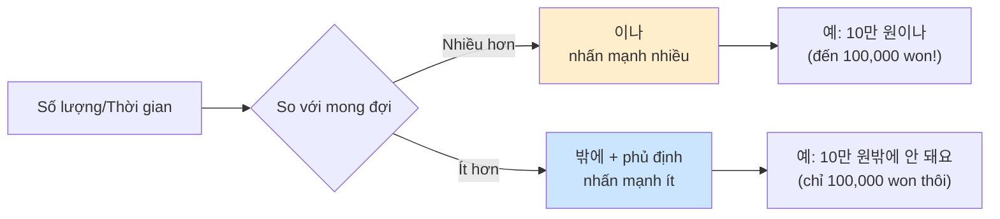
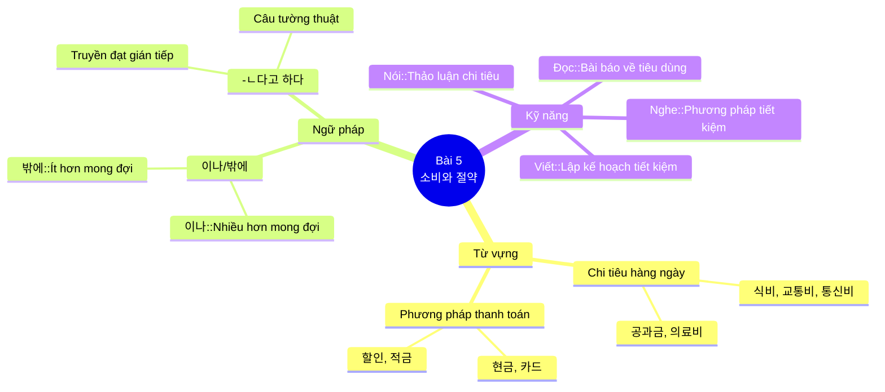

# Bài 5: 소비와 절약 (Tiêu dùng và Tiết kiệm)

## 📚 Mục tiêu bài học

- **Từ vựng**: Học các từ liên quan đến chi tiêu, tiết kiệm và phương pháp thanh toán
- **Ngữ pháp**:
  - Sử dụng **명이나/밖에** (khoảng/chỉ)
  - Sử dụng **-(으)ㄴ다고 하다** (nói rằng)
- **Chủ đề**: Thảo luận về chi tiêu và lập kế hoạch tiết kiệm
- **Văn hóa**: Tìm hiểu về văn hóa tiết kiệm ở Hàn Quốc

---

## 📖 Từ vựng (어휘)

### Câu hỏi khởi động

**Hình ảnh giới thiệu:**
- Hình 1: Sổ ghi chi tiêu gia đình (가계부) với máy tính và tiền xu
- Hình 2: Chợ trời/bán đồ cũ (벼룩시장) với nhiều gia đình tham gia

**Câu hỏi thảo luận:**

1. **이 사람들은 어디에서 돈을 지출하고 있어요?**
   > *Những người này đang chi tiêu ở đâu?*

2. **여러분은 어디에 생활비가 가장 많이 들어요?**
   > *Bạn thường chi tiêu nhiều nhất cho khoản nào?*

---

### 1. Chi tiêu theo ngày

| Phân loại | Địa điểm chi tiêu | Chi tiết hạng mục |
|-----------|-------------------|-------------------|
| **11/5** | 택시비 | 식비 |
| | 교통 카드 충전 | 통신비 |
| | 영화 관람 | 교육비 |
| **11/18** | 점심값 | 의료비 |
| | 커피 | 경조사비 |
| | 두통약 | 공과금 |
| | 영어 학원 | 교통비 |
| **11/20** | 휴대 전화 요금 | 문화생활비 |
| | 축의금 | |
| | 전기 요금 | |

### 2. Bảng từ vựng theo chủ đề

#### 🏪 Chi tiêu và thanh toán

| Từ tiếng Hàn | Nghĩa tiếng Việt | Ví dụ |
|--------------|------------------|-------|
| 소비 | tiêu dùng | 소비와 절약 (Tiêu dùng và Tiết kiệm) |
| 절약 | tiết kiệm | 난방비를 절약할 수 있는 방법이라고 해요 (Nói rằng đó là phương pháp có thể tiết kiệm tiền sưởi) |
| 생활비 | chi phí sinh hoạt | - |
| 지출 | chi tiêu | 지출 내용 (Chi tiết chi tiêu) |
| 수입 | thu nhập | - |
| 저축 | tiết kiệm (tiền) | - |
| 현금 | tiền mặt | 현금으로 결제하다 (Thanh toán bằng tiền mặt) |
| 카드 | thẻ | 할인 카드로 결제하다 (Thanh toán bằng thẻ giảm giá) |
| 할인 | giảm giá | 할인된 가격에 구입할 수 있다고 합니다 (Nói rằng có thể mua với giá giảm) |
| 가계부 | sổ ghi chi tiêu gia đình | 가계부를 쓴다 (Viết sổ ghi chi tiêu) |

#### 💳 Các loại chi phí

| Từ tiếng Hàn | Nghĩa tiếng Việt | Ví dụ |
|--------------|------------------|-------|
| 식비 | chi phí ăn uống | 점심값 (Tiền ăn trưa) - Chi tiêu ngày 11/18 |
| 교육비 | chi phí giáo dục | 영어 학원 (Học viện tiếng Anh) - Chi tiêu ngày 11/18 |
| 통신비 | chi phí thông tin | 이번 달에는 통신비가 27,000원밖에 안 나왔어요 (Tháng này chi phí thông tin chỉ có 27,000 won thôi) |
| 교통비 | chi phí giao thông | 택시비, 교통 카드 충전 (Tiền taxi, Nạp thẻ giao thông) - Chi tiêu ngày 11/5 |
| 의료비 | chi phí y tế | 두통약 (Thuốc đau đầu) - Chi tiêu ngày 11/18 |
| 공과금 | tiền điện nước, dịch vụ công | 전기 요금 (Tiền điện) - Chi tiêu ngày 11/20 |
| 경조사비 | chi phí điếu tang/hỷ sự | 축의금 (Tiền mừng) - Chi tiêu ngày 11/20 |
| 문화생활비 | chi phí sinh hoạt văn hóa | 영화 관람 (Xem phim) - Chi tiêu ngày 11/5 |

#### 💰 Các đơn vị tiền tệ và số lượng

| Từ tiếng Hàn | Nghĩa tiếng Việt | Ví dụ |
|--------------|------------------|-------|
| 원 | won (đồng tiền Hàn Quốc) | 27,000원밖에 안 나왔어요 (Chỉ có 27,000 won thôi) |
| 만 원 | 10,000 won | 난방비가 29만 원이나 나왔어요 (Tiền sưởi lên đến 29 vạn won) |
| 천 원 | 1,000 won | - |
| 값 | giá | 점심값 (Tiền ăn trưa) |
| 요금 | phí, lệ phí | 휴대 전화 요금, 전기 요금 (Phí điện thoại di động, Phí điện) |

#### 🏦 Hoạt động tài chính

| Từ tiếng Hàn | Nghĩa tiếng Việt | Ví dụ |
|--------------|------------------|-------|
| 보일러 | lò sưởi | 한국 겨울 날씨가 너무 추워서 계속 보일러를 틀었거든요 (Vì thời tiết mùa đông Hàn Quốc quá lạnh nên tôi liên tục bật lò sưởi) |
| 온도 | nhiệt độ | 온도를 조금 내리고 옷을 따뜻하게 입는 게 난방비를 절약할 수 있는 방법이라고 해요 (Nói rằng hạ nhiệt độ xuống một chút và mặc quần áo ấm là phương pháp có thể tiết kiệm tiền sưởi) |
| 통신사 | công ty viễn thông | - |
| 장을 보다 | đi chợ | 필요한 것만 메모해서 장을 보다 (Ghi chú chỉ những thứ cần thiết rồi đi chợ) |
| 공유 | chia sẻ | 공유 자전거를 이용하다 (Sử dụng xe đạp chia sẻ) |
| 전시 상품 | hàng trưng bày | 전시 상품을 구입하면 저렴하게 살 수 있다고 합니다 (Nói rằng nếu mua hàng trưng bày thì có thể mua rẻ) |
| 이월 상품 | hàng tồn kho mùa trước | 계절과 반대되는 이월 상품은 저렴하게 살 수 있다 (Hàng tồn kho mùa ngược lại có thể mua rẻ) |
| 합리적이다 | hợp lý | 합리적인 소비 (Tiêu dùng hợp lý) |
| 정보화시대 | thời đại thông tin | - |
| 절약 | tiết kiệm chi tiêu | 소비와 절약 (Tiêu dùng và Tiết kiệm) |
| 육아용품 | đồ dùng trẻ em | 육아용품, 중고도 괜찮아 (Đồ dùng trẻ em, đồ cũ cũng không sao) |
| 축의금 | tiền mừng | 축의금 (Tiền mừng) - Chi tiêu ngày 11/20 |
| 난방비 | tiền sưởi | 이번 달 난방비가 29만 원이나 나왔어요 (Tháng này tiền sưởi lên đến 29 vạn won) |
| 결제하다 | thanh toán | 할인 카드로 결제하다 (Thanh toán bằng thẻ giảm giá) |
| 포인트 | điểm thưởng | 포인트를/쿠폰을 적립하다 (Tích lũy điểm thưởng/phiếu giảm giá) |
| 쿠폰 | phiếu giảm giá, coupon | 포인트를/쿠폰을 적립하다 (Tích lũy điểm thưởng/phiếu giảm giá) |
| 적립하다 | tích lũy | 포인트를/쿠폰을 적립하다 (Tích lũy điểm thưởng/phiếu giảm giá) |
| 중고구매 | mua đồ cũ | 중고구매를 하지 않다 (Không mua đồ cũ) |
| 수리하다 | sửa chữa | - |
| 비용이 들다 | tốn phí | 비용을 줄일 수 있어서 (Vì có thể giảm chi phí) |
| 비용이 부담스럽다 | chi phí nặng nề | 새 제품의 구입 비용이 부담돼서 (Vì gánh nặng chi phí mua sản phẩm mới) |
| 충전 | nạp tiền | 교통 카드 충전 (Nạp thẻ giao thông) - Chi tiêu ngày 11/5 |
| 관람 | xem, thăm quan | 영화 관람 (Xem phim) - Chi tiêu ngày 11/5 |
| 학원 | học viện, trung tâm | 영어 학원 (Học viện tiếng Anh) - Chi tiêu ngày 11/18 |
| 메모하다 | ghi chú | 필요한 것만 메모해서 장을 보다 (Ghi chú chỉ những thứ cần thiết rồi đi chợ) |

---

## 📘 Ngữ pháp (문법)

### 1. 명이나/밖에 (khoảng/chỉ)

#### ✏️ Cấu trúc:

**Công thức:**
- **이나**: Số lượng + 이나 (chỉ số lượng nhiều hơn mong đợi, mang nghĩa "đến", "đến tận")
- **밖에**: Số lượng + 밖에 + động từ phủ định (chỉ số lượng ít hơn mong đợi, mang nghĩa "chỉ")

#### 📌 Cách sử dụng:

##### **이나** - Nhiều hơn mong đợi

Dùng khi muốn nhấn mạnh số lượng, thời gian nhiều hơn dự kiến.

**Ví dụ:**
- 16만 원 → **16만 원이나**
- 다섯 명 → **다섯 명이나**
- 27,000원 → **27,000원밖에**
- 1개 → **1개밖에**

**Câu ví dụ:**
- 가: 노트북을 사용할 때 자주 화면이 꺼지요. 나: 산 지 **1년밖에** 안 됐는데 벌써 고장 난 거예요?
  - *Khi sử dụng laptop thì màn hình thường xuyên tắt. - Mới mua được chỉ 1 năm thôi mà đã hỏng rồi sao?*

- 저는 하루에 커피를 다섯 **잔이나** 마셔요.
  - *Tôi uống đến tận 5 tách cà phê mỗi ngày.*

- 이번 달에는 통신비가 27,000**원밖에** 안 나왔어요.
  - *Tháng này chi phí thông tin chỉ có 27,000 won thôi.*

##### **밖에** - Ít hơn mong đợi

Luôn đi cùng với động từ/tính từ phủ định (안, -지 못하다, 없다).

**Ví dụ:**
- 10개 → **10개밖에**
- 두 대 → **두 대밖에**

**Câu ví dụ:**
- 10개**밖에** → 10개**밖에** 남지 않았어요.
  - *Chỉ còn lại 10 cái thôi.*

- 두 대**밖에** → 두 대**밖에** 없어요.
  - *Chỉ có 2 chiếc thôi.*

#### 🔍 Bảng so sánh

| Trường hợp | Cấu trúc | Ý nghĩa | Ví dụ |
|------------|----------|---------|-------|
| Số lượng nhiều | Số + 이나 | Nhiều hơn dự kiến | 식비 58만 원이나 → 58 vạn won tiền ăn (nhiều quá!) |
| Số lượng ít | Số + 밖에 + phủ định | Ít hơn dự kiến | 난방비 32만 원밖에 안 나왔어요 → Tiền sưởi chỉ 32 vạn won thôi |
| Thời gian dài | Thời gian + 이나 | Lâu hơn dự kiến | 하루에 4시간이나 → Đến 4 tiếng mỗi ngày |
| Thời gian ngắn | Thời gian + 밖에 + phủ định | Ngắn hơn dự kiến | 9시간밖에 안 잤어요 → Chỉ ngủ có 9 tiếng thôi |



---

### 2. -(으)ㄴ다고 하다 (nói rằng)

#### ✏️ Cấu trúc:

Được dùng để truyền đạt lại nội dung mà người khác đã nói (gián tiếp dẫn).

**Quy tắc biến đổi:**

| Loại động từ/tính từ | Cấu trúc | Ví dụ |
|---------------------|----------|-------|
| Động từ có 받침 (phụ âm cuối) | -는다고 하다 | 물려받다 → 물려받는다고 하다 |
| Động từ không 받침 (nguyên âm cuối) | -ㄴ다고 하다 | 아끼다 → 아낀다고 하다 |
| Tính từ có 받침 | -다고 하다 | 싸다 → 싸다고 하다 |
| Tính từ không 받침 | -다고 하다 | 저렴하다 → 저렴하다고 하다 |

#### 📌 Các dạng khác của -(으)ㄴ다고 하다:

- **-ㄴ다고 하다**: Dạng hiện tại, tương lai (động từ)
- **-았/었다고 하다**: Dạng quá khứ
- **-다고 하다**: Dạng tính từ

**Ví dụ:**
- 물려받다 → **물려받는다고 하다** (nói rằng nhận lại)
- 아끼다 → **아낀다고 하다** (nói rằng tiết kiệm)
- 싸다 → **싸다고 하다** (nói rằng rẻ)
- 저렴하다 → **저렴하다고 하다** (nói rằng giá cả phải chăng)

#### 💬 Câu ví dụ:

1. **라민**: 미리 항공권을 예약하면 저렴해요.
   - *Nếu đặt vé máy bay trước thì giá rẻ.*

   → **라민이** 미리 항공권을 예약하면 **저렴하다고 해요**.
   - *Ramin nói rằng nếu đặt vé máy bay trước thì giá rẻ.*

2. **이웬**: 중고차를 구입하면 싸요.
   - *Nếu mua xe cũ thì rẻ.*

   → **이웬이** 중고차를 구입하면 **싸다고 해요**.
   - *I-wen nói rằng nếu mua xe cũ thì rẻ.*

3. **안젤라**: 이웃에게 아이의 교복을 물려받으면 좋아요.
   - *Nhận lại đồng phục học sinh từ hàng xóm thì tốt.*

   → **안젤라가** 이웃에게 아이의 교복을 물려받으면 **좋다고 해요**.
   - *Angela nói rằng nhận lại đồng phục học sinh từ hàng xóm thì tốt.*

#### 🔍 Sơ đồ minh họa cấu trúc

```mermaid
graph TD
    A[Câu trực tiếp] --> B{Loại từ}
    B -->|Động từ| C[Thêm -(으)ㄴ다고 하다]
    B -->|Tính từ| D[Thêm -다고 하다]
    B -->|Danh từ| E[Thêm -(이)라고 하다]

    C --> F["저축하다 → 저축한다고 하다"]
    D --> G["싸다 → 싸다고 해요"]
    E --> H["학생이다 → 학생이라고 해요"]

    style A fill:#e1f5ff
    style F fill:#fff4e1
    style G fill:#fff4e1
    style H fill:#fff4e1
```

#### 📝 Lưu ý đặc biệt:

**TIP**: Khi truyền đạt gián tiếp, cần chú ý thay đổi ngôi và thời gian phù hợp.

**Các trường hợp cần chú ý:**

1. **전시 상품을 구입하면 저렴하게 살 수 있다고 합니다.**
   - *Nói rằng nếu mua hàng trưng bày thì có thể mua rẻ.*

2. **할인된 가격에 구입할 수 있다고 합니다.**
   - *Nói rằng có thể mua với giá giảm.*

3. **너무 추워서 계속 보일러를 틀었다고 합니다.**
   - *Nói rằng vì quá lạnh nên liên tục bật lò sưởi.*

---

## 🗣️ Hội thoại (말하기)

### Tình huống 1: Thảo luận về chi phí sinh hoạt

**Hội thoại mẫu:**

> **이주미나**: 후엔 씨, 뭘 그렇게 보고 있어요?
>
> **후엔**: 이번 달 **난방비**가 29만 **원이나** 나왔어요. 생각보다 너무 많이 나와서 어떻게 해야 할지 모르겠어요.
>
> **이주미나**: 어떻게 그렇게 많이 나왔어요?
>
> **후엔**: 한국 겨울 **날씨**가 너무 추워서 계속 **보일러**를 틀었거든요.
>
> **이주미나**: 그렇게 하면 안 돼요. 그럴 때는 **온도를 조금 내리고** 옷을 따뜻하게 입는 게 **난방비**를 **절약할 수 있는 방법**이라고 해요.

**Phân tích:**

1. **난방비**가 29만 **원이나** 나왔다
   - Tiền sưởi lên đến 290,000 won (→ nhiều hơn dự kiến)
   - Sử dụng **이나** để nhấn mạnh số tiền lớn

2. **통신비**가 10만 **원이나** 나왔다
   - Chi phí thông tin lên đến 100,000 won
   - Nhấn mạnh việc chi phí cao bất ngờ

### Tình huống 2: So sánh chi phí tiết kiệm

**Các phương pháp tiết kiệm:**

| Người có chi tiêu nhiều | Người tiết kiệm được |
|------------------------|---------------------|
| • 가족들이 고기를 좋아해서 식비가 너무 많이 나온다 | • 필요한 것만 메모해서 장을 보다 |
| • 택시를 자주 타서 교통비가 많이 나온다 | • 공유 자전거를 이용하다 |
| | • 장을 보다 |
| | • 공유 |

**Từ vựng liên quan:**
- **보일러**: lò sưởi
- **틀다**: bật (lò sưởi)
- **온도**: nhiệt độ
- **통신사**: công ty viễn thông
- **장을 보다**: đi chợ
- **공유**: chia sẻ

---

## 🎧 Luyện nghe (듣기)

### Bài tập 1: Phương pháp tiết kiệm sinh hoạt

**Câu hỏi:**

1) Người thứ nhất đã **tiết kiệm sinh hoạt** bằng cách nào?
   - *주부 김미진 씨는 어떻게 가구를 저렴하게 샀다고 합니까?*

2) Người thứ hai tại sao **không mua sản phẩm mới**?
   - *20대 남자는 왜 인터넷에서 가격을 비교해 봅니까?*

3) Nghe nội dung và chọn O (đúng) hoặc X (sai):

| Nội dung | Đúng/Sai |
|----------|---------|
| ① 전시 상품은 새 상품보다 가격이 싸다. | ( ) |
| ② 계절과 반대되는 이월 상품은 저렴하게 살 수 없다. | ( ) |
| ③ 많은 사람들이 물건을 살 때 실제 매장에 가서 산다. | ( ) |

**Từ vựng:**
- **전시 상품**: hàng trưng bày
- **이월 상품**: hàng tồn kho mùa trước
- **합리적이다**: hợp lý

---

## 📰 Đọc hiểu (읽기)

### Bài đọc 1: Q&A về chi tiêu thông minh

**어떤 일을 하는 데에는 돈이 필요합니다. 다음 사람들의 고민을 읽고 이야기해 보세요.**

> **Q&A**
>
> **Q1** 가족 여행을 가고 싶은데 **비용이 많이 들 것** 같아서 고민이에요.
> > *Muốn đi du lịch gia đình nhưng lo lắng vì chi phí có vẻ tốn nhiều.*
>
> **Q2** 집을 수리해야 하는 데 **비용이 부담돼요**.
> > *Phải sửa nhà nhưng chi phí nặng nề.*
>
> **Q3** 외국어를 배우고 싶은데 **비용이 조금 부담스러워요**. 어떻게 하면 **비용을 줄일 수 있을까요?**
> > *Muốn học ngoại ngữ nhưng chi phí hơi nặng nề. Làm thế nào để có thể giảm chi phí?*

**Từ vựng:**
- **비용이 들다**: Chi phí phát sinh, tốn phí
- **비용이 부담되다**: Chi phí nặng nề, gánh nặng
- **비용이 부담스럽다**: Chi phí hơi nặng nề
- **비용을 줄이다**: Giảm chi phí

---

### Bài đọc 2: 좋은 물건 싸게 사는 법 (Cách mua đồ tốt giá rẻ)

**물건을 살 때 비용을 아끼려면 어떻게 해야 할까요? 자신이 사용하는 방법을 이야기해 보세요.**

**좋은 물건 싸게 사는 법** - CHECK LIST ✓

**Các phương pháp thông minh:**

| ⭕ | Phương pháp | Chi tiết |
|---|-------------|----------|
| ⭕ | **인터넷에서 가격 비교를 한다** | So sánh giá trên internet |
| ⭕ | **공동 구매를 이용한다** | Sử dụng mua chung |
| ✅ | **새 상품이 아닌 중고 용품을 이용한다** | Sử dụng đồ cũ thay vì đồ mới |
| ⭕ | **집 주변의 벼룩시장에 가서 필요한 물건을 고른다** | Đến chợ trời gần nhà để chọn đồ cần thiết |
| ⭕ | **주변 사람에게 필요한 물건을 물려받는다** | Nhận đồ từ người xung quanh |
| ⭕ | **정반대 계절의 이월 상품을 이용한다** | Sử dụng hàng tồn kho mùa ngược lại |
| ⭕ | **가구나 가전제품은 전시 상품이나 홈쇼핑 스크래치 난 상품을 구입한다** | Mua đồ nội thất, đồ điện tử trưng bày hoặc hàng trầy xước từ home shopping |
| ⭕ | **마트나 편의점에서 2+1 행사 상품을 산다** | Mua sản phẩm khuyến mãi 2+1 ở siêu thị hoặc cửa hàng tiện lợi |

---

### Bài đọc 3: 육아용품, 중고도 괜찮아

**Nội dung:**

> **○○신문 | 20XX년 10월 20일**
>
> ## 육아용품, 중고도 괜찮아
>
> 최근 어떤 기관에서 만 9세 이하의 자녀가 있는 부모 1,000명을 대상으로 중고 육아용품 구입 경험에 대한 설문 조사를 실시했다. 그 결과, 80%가 중고 육아용품을 구입한 경험이 있다고 했다. 그중에서 구입한 제품이 마음에 들고 괜찮았다는 대답은 64.2%로 높게 나타났고, 보통이었다는 대답이 23.8%, 생각한 것보다는 별로였다는 대답은 12%였다. 그리고 중고 육아용품을 구입한 사람 중에서 다시 중고 육아용품을 구입할 생각이 있다는 대답이 40%를 차지했다.
>
> 많은 부모들이 중고 육아용품을 구입하는 이유는 '비용을 줄일 수 있어서'라는 대답이 52.1%로 가장 높았고, '새 제품의 구입 비용이 부담돼서'라는 대답이 33.4%, '물건의 사용 기간이 짧아서'라는 대답이 14.5%였다.
>
> 한편, 중고 육아용품을 구입한 경험이 없다고 대답한 사람들 중에서 70%는 앞으로 중고 육아용품을 사거나 주변 사람들에게 물려받을 생각이 있다고 답했다. 이를 통해 많은 사람들이 육아용품을 중고로 사는 것에 대해 긍정적으로 생각하고 있는 것을 알 수 있었다.

**Câu hỏi:**

1) Bài đọc này về nội dung gì?
   - *이 글은 무엇에 대해 설문 조사한 내용입니까?*

2) Chọn một câu hỏi phù hợp với nội dung bài đọc:
   - ① "중고 육아용품을 왜 구입했습니까?"
   - ② "중고 육아용품을 구입한 적이 있습니까?"
   - ③ "중고 육아용품을 구입해 보니까 어땠습니까?"
   - ④ "중고 육아용품을 다른 사람에게 준 적이 있습니까?"

3) Chọn nội dung đúng theo bài đọc (O = đúng, X = sai):
   - ① 중고 육아용품이 괜찮다고 생각하는 사람이 많지 않다. ( )
   - ② 비용이 저렴해서 중고 육아용품을 산다는 사람이 가장 많다. ( )
   - ③ 대부분의 사람들은 중고 육아용품을 구입해 본 적이 없다. ( )

**Từ vựng:**
- **육아용품**: đồ dùng trẻ em
- **설문 조사**: khảo sát
- **실시하다**: tiến hành, thực hiện
- **차지하다**: chiếm
- **한편**: mặt khác

---

## ✍️ Viết (쓰기)

### Bài tập 1: Lập bảng chi tiêu

Hãy viết về các khoản chi phí bạn thường xuyên sử dụng nhiều nhất và phương pháp tiết kiệm của riêng bạn:

| Chi tiêu | Phương pháp tiết kiệm |
|----------|----------------------|
| 식비 | |
| 교통비 | |
| 통신비 | |
| 교육비 | |
| 의료비 | |
| 공과금 | |
| 문화생활비 | |

### Bài tập 2: Giới thiệu phương pháp tiết kiệm

Hãy viết về phương pháp tiết kiệm mà bạn hoặc gia đình bạn thường sử dụng. Giải thích cách bạn lập kế hoạch tiết kiệm và những lợi ích của nó.

**Gợi ý cấu trúc:**

1. Giới thiệu về tình hình chi tiêu hiện tại
2. Các phương pháp tiết kiệm đang áp dụng
3. Kết quả đạt được
4. Lời khuyên cho người khác

---

## 🌏 Văn hóa và Thông tin (문화와 정보)

### 적금 가입하기 (Mở tài khoản tiết kiệm)

Ở Hàn Quốc, việc tiết kiệm rất được khuyến khích. Khi gửi tiền vào ngân hàng theo cách "정액 기간 적금", bạn sẽ gửi một số tiền cố định trong một thời gian nhất định. Nếu bạn rút tiền trước thời hạn, bạn sẽ chịu lãi suất thấp hơn. Tỷ lệ lãi suất "적금" của Hàn Quốc khoảng 2% mỗi năm.

Có hai loại "적금" chính:
- **정기 적금**: Tiết kiệm định kỳ
- **자유 적금**: Tiết kiệm tự do

**Khác biệt giữa 정기 적금 và 자유 적금:**

- **정기 적금**: Gửi số tiền cố định mỗi tháng vào cùng một ngày, với lãi suất cao hơn.
- **자유 적금**: Có thể gửi tiền bất cứ khi nào, không giới hạn số lần, với lãi suất thấp hơn.

**Câu hỏi suy ngẫm:**

1) 적금은 무엇입니까?
   - *Tiết kiệm định kỳ là gì?*

2) 정기 적금과 자유 적금의 차이는 무엇입니까?
   - *Sự khác biệt giữa tiết kiệm định kỳ và tiết kiệm tự do là gì?*

3) 여러분은 경제적인 여유가 있으면 어떤 적금에 가입하고 싶습니까?
   - *Nếu bạn có điều kiện kinh tế, bạn muốn tham gia loại tiết kiệm nào?*

---

## 📊 Tổng kết



---

## 🎯 Luyện tập bổ sung

### Bài tập 1: Hoàn thành câu với 이나/밖에

1) 교통비: 45만 원 정도 써요.
   → 저는 한 달에 교통비로 45만 원 __________ 씁니다.

2) 식비: 20만 원 쓰세요.
   → 저는 20만 원 __________ 안 써요.

3) 한국어를 공부하는 시간: 하루에 4시간
   → 한국어를 공부하는 시간이 하루에 4시간 __________.

4) 잠을 자는 시간: 9시간
   → 9시간 __________ 못 잤어요.

### Bài tập 2: Chuyển câu trực tiếp sang gián tiếp

Sử dụng **-(으)ㄴ다고 하다** để chuyển đổi:

1) 라민: "돈을 절약하려면 어떻게 하는 게 좋아요?"
   → 라민이 ___________________________________.

2) 여러분이 최근에 듣은 뉴스나 기사에 대해 '-(으)ㄴ다고 하다'를 사용해서 이야기해 보세요.
   → _______________________________________.

---

---

## 📋 Bảng từ vựng tổng hợp (배운 어휘 확인)

**Đánh dấu ✓ vào các từ bạn đã học:**

### Bảng 1: Từ vựng cơ bản về chi tiêu

| Từ vựng | Nghĩa | Từ vựng | Nghĩa |
|---------|-------|---------|-------|
| ☐ 지출 | Chi tiêu | ☐ 온도 | Nhiệt độ |
| ☐ 축의금 | Tiền mừng | ☐ 통신사 | Công ty viễn thông |
| ☐ 식비 | Chi phí ăn uống | ☐ 장을 보다 | Đi chợ |
| ☐ 통신비 | Chi phí thông tin | ☐ 공유 | Chia sẻ |
| ☐ 교육비 | Chi phí giáo dục | ☐ 전시 상품 | Hàng trưng bày |
| ☐ 의료비 | Chi phí y tế | ☐ 이월 상품 | Hàng tồn kho |
| ☐ 경조사비 | Chi phí tang lễ/hỷ sự | ☐ 합리적이다 | Hợp lý |
| ☐ 공과금 | Tiền điện nước | ☐ 정보화시대 | Thời đại thông tin |
| ☐ 교통비 | Chi phí giao thông | ☐ 절약 | Tiết kiệm |
| ☐ 문화생활비 | Chi phí sinh hoạt văn hóa | ☐ 육아용품 | Đồ dùng trẻ em |
| ☐ 가계부 | Sổ ghi chi tiêu | ☐ 결제하다 | Thanh toán |
| ☐ 포인트 | Điểm thưởng | ☐ 모으다 | Thu thập |
| ☐ 쿠폰 | Phiếu giảm giá | ☐ 가구 | Đồ nội thất |
| ☐ 적립하다 | Tích lũy | ☐ 중고구매 | Mua đồ cũ |
| ☐ 충전 | Nạp tiền | ☐ 수리하다 | Sửa chữa |
| ☐ 관람 | Xem, thăm quan | ☐ 학원 | Học viện |
| ☐ 메모하다 | Ghi chú | ☐ 벼룩시장 | Chợ trời |

### Bảng 2: Cụm từ về chi phí

| Cụm từ | Nghĩa |
|--------|-------|
| ☐ 비용이 들다 | Tốn phí |
| ☐ 비용이 부담되다 | Chi phí nặng nề |
| ☐ 비용이 부담스럽다 | Chi phí hơi nặng nề |
| ☐ 비용을 줄이다 | Giảm chi phí |
| ☐ 비용이 나오다 | Phí phát sinh |

---

## 📚 Danh sách từ vựng chi tiết

**Bảng tra cứu nhanh các từ vựng quan trọng:**

| Tiếng Hàn | Loại từ | Nghĩa tiếng Việt | Ví dụ |
|-----------|---------|------------------|-------|
| 지출 | 명사 | chi tiêu | 지출 내용 (Chi tiết chi tiêu) |
| 온도 | 명사 | nhiệt độ | 온도를 조금 내리고 (Hạ nhiệt độ xuống một chút) |
| 통신사 | 명사 | công ty viễn thông | - |
| 장을 보다 | 동사 | đi chợ | 필요한 것만 메모해서 장을 보다 (Ghi chú chỉ những thứ cần thiết rồi đi chợ) |
| 공유 | 명사 | chia sẻ | 공유 자전거를 이용하다 (Sử dụng xe đạp chia sẻ) |
| 전시 상품 | 명사 | hàng trưng bày | 전시 상품을 구입하면 저렴하게 살 수 있다고 합니다 (Nói rằng nếu mua hàng trưng bày thì có thể mua rẻ) |
| 이월 상품 | 명사 | hàng tồn kho mùa trước | 계절과 반대되는 이월 상품은 저렴하게 살 수 있다 (Hàng tồn kho mùa ngược lại có thể mua rẻ) |
| 합리적이다 | 형용사 | hợp lý | 합리적인 소비 (Tiêu dùng hợp lý) |
| 정보화시대 | 명사 | thời đại thông tin | - |
| 절약 | 명사 | tiết kiệm chi tiêu | 소비와 절약 (Tiêu dùng và Tiết kiệm) |
| 비용이 나오다 | 동사 | phí phát sinh | 난방비가 29만 원이나 나왔어요 (Tiền sưởi lên đến 29 vạn won) |
| 비용이 부담되다 | 동사 | gánh nặng chi phí | 새 제품의 구입 비용이 부담돼서 (Vì gánh nặng chi phí mua sản phẩm mới) |
| 비용을 줄이다 | 동사 | giảm chi phí | 비용을 줄일 수 있어서 (Vì có thể giảm chi phí) |
| 공동 구매 | 명사 | mua chung | - |
| 벼룩시장 | 명사 | chợ trời | - |
| 중고차 | 명사 | xe cũ | 중고차를 구입하면 싸다고 해요 (Nói rằng nếu mua xe cũ thì rẻ) |
| 물려받다 | 동사 | nhận lại (đồ cũ) | 이웃에게 아이의 교복을 물려받으면 좋다고 해요 (Nói rằng nhận lại đồng phục học sinh từ hàng xóm thì tốt) |
| 보일러 | 명사 | lò sưởi | 계속 보일러를 틀었거든요 (Liên tục bật lò sưởi) |
| 틀다 | 동사 | bật | 보일러를 틀다 (Bật lò sưởi) |
| 육아용품 | 명사 | đồ dùng trẻ em | 육아용품, 중고도 괜찮아 (Đồ dùng trẻ em, đồ cũ cũng không sao) |
| 설문 조사 | 명사 | khảo sát | 설문 조사를 실시했다 (Đã tiến hành khảo sát) |
| 실시하다 | 동사 | tiến hành | 설문 조사를 실시했다 (Đã tiến hành khảo sát) |
| 차지하다 | 동사 | chiếm | 40%를 차지했다 (Chiếm 40%) |
| 한편 | 부사 | mặt khác | 한편, 중고 육아용품을 구입한 경험이 없다고 대답한 사람들 (Mặt khác, những người trả lời chưa từng mua đồ dùng trẻ em cũ) |
| 축의금 | 명사 | tiền mừng | 축의금 (Tiền mừng) - Chi tiêu ngày 11/20 |
| 난방비 | 명사 | tiền sưởi | 난방비가 29만 원이나 나왔어요 (Tiền sưởi lên đến 29 vạn won) |
| 결제하다 | 동사 | thanh toán | 할인 카드로 결제하다 (Thanh toán bằng thẻ giảm giá) |
| 포인트 | 명사 | điểm thưởng | 포인트를 적립하다 (Tích lũy điểm thưởng) |
| 쿠폰 | 명사 | phiếu giảm giá, coupon | 쿠폰을 적립하다 (Tích lũy phiếu giảm giá) |
| 적립하다 | 동사 | tích lũy | 포인트를/쿠폰을 적립하다 (Tích lũy điểm thưởng/phiếu giảm giá) |
| 중고구매 | 명사 | mua đồ cũ | 중고구매를 하지 않다 (Không mua đồ cũ) |
| 수리하다 | 동사 | sửa chữa | - |
| 비용이 들다 | 동사 | tốn phí | - |
| 비용이 부담스럽다 | 형용사 | chi phí nặng nề | 비용이 부담스럽다 (Chi phí nặng nề) |
| 충전 | 명사 | nạp tiền | 교통 카드 충전 (Nạp thẻ giao thông) |
| 관람 | 명사 | xem, thăm quan | 영화 관람 (Xem phim) |
| 학원 | 명사 | học viện, trung tâm | 영어 학원 (Học viện tiếng Anh) |
| 메모하다 | 동사 | ghi chú | 필요한 것만 메모해서 장을 보다 (Ghi chú chỉ những thứ cần thiết) |

---

## 🎨 Phương pháp tiết kiệm (절약 방법)

**2. 생활비를 절약하려면 어떻게 해야 할까요?**
> *Để tiết kiệm chi phí sinh hoạt thì phải làm thế nào?*

### Các phương pháp tiết kiệm hiệu quả:

| Phương pháp | Hình ảnh minh họa | Giải thích |
|-------------|-------------------|------------|
| **살 것을 미리 메모하다** | 📝 Sổ ghi chú | Ghi chú trước những thứ cần mua |
| **가계부를 쓰다** | 📚 Sổ ghi chi tiêu | Viết sổ ghi chi tiêu gia đình |
| **할인 카드로 결제하다** | 💳 Thẻ giảm giá | Thanh toán bằng thẻ giảm giá 30% |
| **포인트를/쿠폰을 적립하다** | ☕ Tích điểm | Tích lũy điểm thưởng/phiếu giảm giá |
| **중고구매를 하지 않다** | 🙅 Không mua cũ | Mua đồ mới thay vì đồ cũ (nếu cần thiết) |

**Lời khuyên:**
> "쇼핑을 하기 전에 살 것을 미리 메모하는 게 좋아요."
>
> *Tốt nhất là ghi chú trước những thứ cần mua trước khi đi mua sắm.*

---

**Ghi chú:** Tài liệu này được biên soạn theo phong cách sư phạm, tập trung vào việc học từ vựng và ngữ pháp một cách có hệ thống. Các bảng biểu và sơ đồ Mermaid được bổ sung để hỗ trợ việc học trực quan và dễ dàng ghi nhớ.
