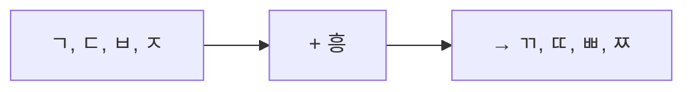
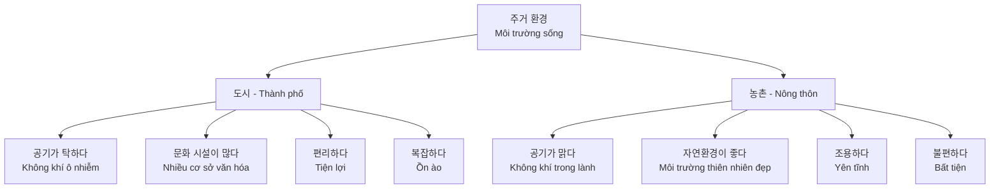
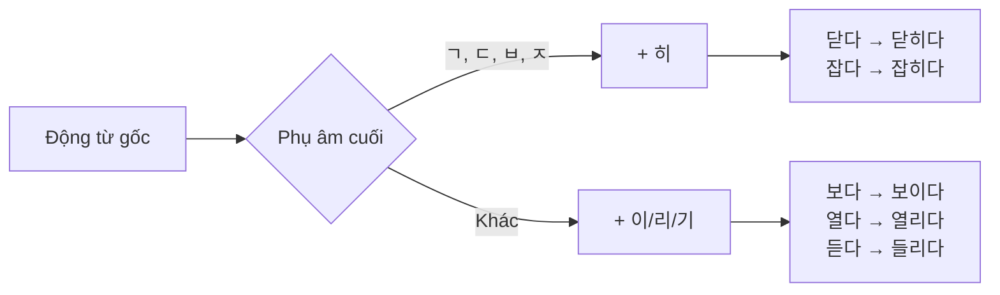
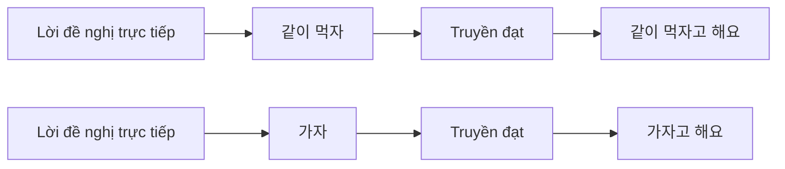
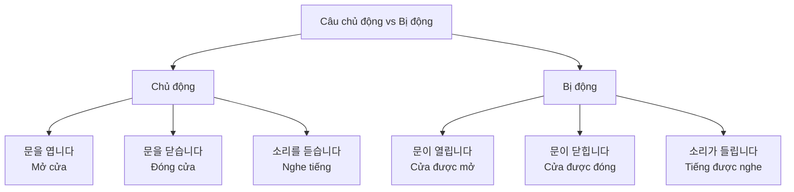
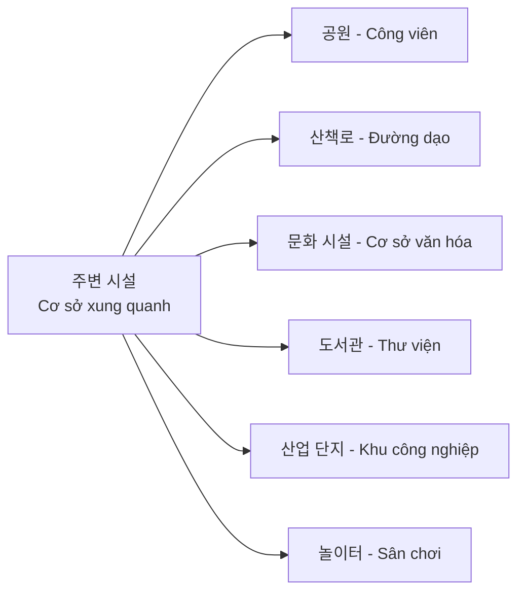

# Bài 6: 주거 환경 (Môi trường sinh sống)

## 📚 Mục tiêu bài học

Sau khi hoàn thành bài học này, người học sẽ có khả năng:

- Sử dụng từ vựng liên quan đến môi trường sinh sống (thành phố, nông thôn)
- Sử dụng ngữ pháp **피동** (thể bị động) và **-자고 하다** (truyền đạt lời đề nghị)
- Mô tả nơi ở và môi trường xung quanh
- So sánh cuộc sống ở thành phố và nông thôn

---

## 💬 Câu hỏi khởi động

### 1. 이 동네는 생활하기가 어떨 것 같아요?
> *Sống ở khu phố này thì như thế nào?*

**Hãy quan sát hai hình ảnh:**

#### 🏞️ Khu vực nông thôn:
- Có núi và cánh đồng xanh tươi
- Những ngôi nhà nhỏ
- Môi trường thiên nhiên trong lành

#### 🏙️ Khu vực đô thị:
- Nhiều tòa nhà cao tầng
- Đường phố đông đúc
- Nhiều phương tiện giao thông

### 2. 여러분은 어떤 곳에서 살고 있어요?
> *Bạn đang sống ở đâu?*

**Câu trả lời mẫu:**
- 저는 도시에서 살고 있어요. (Tôi đang sống ở thành phố.)
- 저는 시골에서 살고 있어요. (Tôi đang sống ở nông thôn.)

---

## 🗂️ Phần 1: Từ vựng

### 📝 Bài tập khởi động

#### 1. 도시는 어떤 특징이 있어요? 살기에 어떨 것 같아요?
> *Thành phố có đặc điểm gì? Sống ở đó thì như thế nào?*

**Đặc điểm của đô thị:**

| 🏙️ Đặc điểm | Tiếng Hàn | Nghĩa tiếng Việt |
|------------|-----------|-----------------|
| 🧹 | 거리가 깨끗하다 | Đường phố sạch sẽ |
| 🌫️ | 공기가 탁하다 | Không khí ô nhiễm |
| 🛍️ | 쇼핑이 쉽다 | Mua sắm dễ dàng |
| 🏢 | 빌딩 숲/산업 단지 | Rừng tòa nhà/Khu công nghiệp |
| 🔒 | 안전하다 | An toàn |
| 🎭 | 문화 시설이 많다 | Nhiều cơ sở văn hóa |
| 🌳 | 걸어서 공원에 갈 수 있다 | Có thể đi bộ đến công viên |
| 🏘️ | 산책로가 있다 | Có đường dạo |

#### 2. 농촌은 어떤 특징이 있어요? 살기에 어떨 것 같아요?
> *Nông thôn có đặc điểm gì? Sống ở đó thì như thế nào?*

**Đặc điểm của nông thôn:**

| 🏞️ Đặc điểm | Tiếng Hàn | Nghĩa tiếng Việt |
|------------|-----------|-----------------|
| 🌿 | 자연환경이 좋다 | Môi trường thiên nhiên tốt |
| 🤫 | 한적하다 | Thanh tĩnh, yên lặng |
| 💨 | 공기가 맑다 | Không khí trong lành |
| 🚜 | 직접 농사를 짓다 | Tự mình trồng trọt |
| 🏔️ | 경치가 좋다 | Phong cảnh đẹp |
| 🌾 | 논 | Ruộng lúa |
| 🥬 | 밭 | Ruộng, vườn |
| 🍎 | 과수원 | Vườn cây ăn quả |
| 🏡 | 비닐하우스 | Nhà kính |
| 💧 | 하천이 흐르다 | Sông suối chảy |

#### 3. 여러분은 어떤 환경에서 살고 싶어요? 이야기해 보세요.
> *Bạn muốn sống ở môi trường như thế nào? Hãy nói về điều đó.*

**Câu trả lời mẫu:**

💬 **저는 공기가 맑고 한적한 곳에서 살고 싶어요.**
> *Tôi muốn sống ở nơi không khí trong lành và thanh tĩnh.*

---

### 1.1. Từ vựng về đô thị (도시)

| Tiếng Hàn | Nghĩa tiếng Việt | Ví dụ |
|-----------|-----------------|-------|
| 도시 | Thành phố | 복잡한 도시를 떠나고 싶은 분들을 위한 최고의 선택! (Lựa chọn tốt nhất cho những ai muốn rời xa thành phố ồn ào!) |
| 거리 | Đường phố | 거리가 깨끗하다 (Đường phố sạch sẽ) |
| 공기 | Không khí | 공기가 탁하다 (Không khí ô nhiễm) |
| 쇼핑 | Mua sắm | - |
| 안전하다 | An toàn | 소음이 심하다 / 안전하다 (Ồn ào / An toàn) |
| 밝다 | Sáng | - |
| 산업 단지 | Khu công nghiệp | 빌딩 숲/산업 단지 (Rừng tòa nhà/Khu công nghiệp) |
| 문화 시설 | Cơ sở văn hóa | 문화 시설이 많다 (Nhiều cơ sở văn hóa) |
| 공원 | Công viên | 걸어서 공원에 갈 수 있다 (Có thể đi bộ đến công viên) |
| 도서관 | Thư viện | - |
| 공기가 탁하다 | Không khí ô nhiễm | 공기가 탁하다 (từ bảng so sánh đô thị) |
| 거리가 깨끗하다 | Đường phố sạch sẽ | 거리가 깨끗하다 (từ bảng đô thị) |
| 걸어서 공원에 갈 수 있다 | Có thể đi bộ đến công viên | 걸어서 공원에 갈 수 있다 (từ bảng đô thị) |

### 1.2. Từ vựng về nông thôn (농촌)

| Tiếng Hàn | Nghĩa tiếng Việt | Ví dụ |
|-----------|-----------------|-------|
| 농촌 | Nông thôn | 과장님은 주말에 농사를 지으십니다 (Trưởng phòng trồng trọt vào cuối tuần) |
| 자연환경 | Môi trường thiên nhiên | 자연환경이 좋다 (Môi trường thiên nhiên tốt) |
| 한적하다 | Thanh tĩnh, yên lặng | 한적하다 (từ bảng nông thôn) |
| 공기가 맑다 | Không khí trong lành | 공기가 맑다 (từ bảng so sánh nông thôn) |
| 직접 농사를 짓다 | Tự mình trồng trọt | 직접 농사를 짓다 (từ bảng nông thôn) |
| 경치 | Phong cảnh | 경치가 좋다 (Phong cảnh đẹp) |
| 경치가 좋다 | Phong cảnh đẹp | 경치가 좋다 (từ bảng nông thôn) |
| 논 | Ruộng lúa | 논 (từ hình vẽ nông thôn trang 3) |
| 밭 | Ruộng, vườn | 밭 (từ hình vẽ nông thôn trang 3) |
| 과수원 | Vườn cây ăn quả | 과수원 (từ hình vẽ nông thôn trang 3) |
| 비닐하우스 | Nhà kính | 비닐하우스를 만드십니다 (Làm nhà kính) / 비닐하우스 (từ hình vẽ nông thôn) |
| 하천 | Sông suối | 하천이 흐르다 (Sông suối chảy) |
| 하천이 흐르다 | Sông suối chảy | 하천이 흐르다 (từ bảng nông thôn) |

### 1.3. Từ vựng về nhà ở

| Tiếng Hàn | Nghĩa tiếng Việt | Ví dụ |
|-----------|-----------------|-------|
| 아파트 | Căn hộ chung cư | 우리 건설 아파트 (Căn hộ Wuri Construction - từ quảng cáo) |
| 빌딩 | Tòa nhà | 빌딩 숲 (Rừng tòa nhà) |
| 높다 | Cao | - |
| 낮다 | Thấp | - |
| 크다 | Lớn | - |
| 작다 | Nhỏ | - |
| 넓다 | Rộng | 넓은 강과 높은 산이 눈앞에! (Sông rộng và núi cao ngay trước mắt!) |
| 좁다 | Hẹp | - |
| 편리하다 | Tiện lợi | 편리한 교통에 문화 시설까지! (Giao thông tiện lợi và cả cơ sở văn hóa!) |
| 불편하다 | Bất tiện | - |

### 1.4. Động từ thường dùng

| Tiếng Hàn | Nghĩa tiếng Việt | Ví dụ |
|-----------|-----------------|-------|
| 살다 | Sống | 저는 공기가 맑고 한적한 곳에서 살고 싶어요 (Tôi muốn sống ở nơi không khí trong lành và thanh tĩnh) |
| 살고 있다 | Đang sống | - |
| 있다 | Có | 105동 앞에 놀이터가 있어요 (Trước tòa nhà 105 có sân chơi) |
| 없다 | Không có | 아무도 없는데 문이 닫혀 있어요 (Không có ai mà cửa lại đóng) |
| 들리다 | Được nghe, nghe thấy | 저쪽에서 비명 소리가 들리다 (Nghe tiếng hét từ bên kia) |
| 보이다 | Được nhìn, nhìn thấy | 놀이터에서 산책로 입구가 보일 거예요 (Từ sân chơi sẽ nhìn thấy lối vào đường dạo) |
| 열리다 | Được mở | - |
| 닫히다 | Được đóng | 아무도 없는데 문이 닫혀 있어요 (Không có ai mà cửa lại đóng) |
| 걸리다 | Bị treo, bị mắc | 과장님의 부모님 집은 기차로 3시간 거리에 있다 (Nhà bố mẹ trưởng phòng cách 3 giờ đi tàu) |
| 쌓이다 | Được chất đống | - |

### 1.5. Các cụm từ quan trọng

| Tiếng Hàn | Nghĩa tiếng Việt | Ví dụ |
|-----------|-----------------|-------|
| 이사를 오다 | Chuyển đến | 저, 이제 이 동네로 이사 왔는데요 (Tôi vừa chuyển đến khu này) |
| 이사 온 이웃 | Hàng xóm mới chuyển đến | - |
| 주변 시설 | Cơ sở vật chất xung quanh | - |
| 주변 환경 | Môi trường xung quanh | - |
| 쉽게 갈 수 있다 | Có thể đến dễ dàng | - |
| 복잡한 도시 | Thành phố ồn ào | 복잡한 도시 따라고 싶은 분들을 위한 최고의 선택! (Lựa chọn tốt nhất cho những ai muốn tránh thành phố ồn ào!) |
| 조용하다 | Yên tĩnh | - |

### 1.6. Từ vựng bổ sung (từ PDF)

| Tiếng Hàn | Nghĩa tiếng Việt | Ví dụ |
|-----------|-----------------|-------|
| 빌딩 숲 | Rừng tòa nhà | 빌딩 숲/산업 단지 (Rừng tòa nhà/Khu công nghiệp) |
| 소음이 심하다 | Ồn ào, tiếng ồn lớn | 소음이 심하다 (từ bảng đô thị) |
| 산책로 | Đường dạo | 아이가 자전거 타는 것을 좋아하면 산책로에 가는 것도 좋아요 (Nếu con thích đạp xe thì đi đến đường dạo cũng tốt) |
| 놀이터 | Sân chơi | 105동 앞에 놀이터가 있어요 (Trước tòa nhà 105 có sân chơi) / 아이가 놀러 가자고 해서 (Con tôi rủ đi chơi) |
| 체육 센터 | Trung tâm thể thao | - |
| 정문 | Cổng chính | - |
| 풍경 | Phong cảnh | - |
| 자연 경관 | Cảnh quan thiên nhiên | - |
| 최고급 | Cao cấp nhất | 복잡한 도시 따라고 싶은 분들을 위한 최고의 선택! (Lựa chọn tốt nhất cho những ai muốn tránh thành phố ồn ào!) |
| 현장 | Hiện trường, địa điểm | - |
| 옛날 | Ngày xưa | 옛날 건축물을 간직하고 있는 역사의 도시입니다 (Là thành phố lịch sử giữ gìn kiến trúc xưa) |
| 건축물 | Kiến trúc, công trình | 옛날 건축물을 간직하고 있는 역사의 도시입니다 (Là thành phố lịch sử giữ gìn kiến trúc xưa) |
| 간직하다 | Giữ gìn, lưu giữ | 역사를 간직한 곳, 사마르칸트 (Nơi lưu giữ lịch sử, Samarkand) |
| 포함되다 | Được bao gồm | - |
| 건조하다 | Khô khan | - |
| 돌 | Đá | - |
| 비명 소리 | Tiếng hét | 저쪽에서 비명 소리가 들리다 (Nghe tiếng hét từ bên kia) |
| 지역 | Khu vực | 강원 지역은 밤사이에 눈이 많이 쌓였다 (Khu vực Gangwon đêm qua tuyết rơi dày) |
| 범인 | Tội phạm | - |
| 엘리베이터 | Thang máy | 엘리베이터가 흔들렸어요 (Thang máy rung lắc) |
| 문 | Cửa | 기숙사 문이 잠기다 (Cửa ký túc xá bị khóa) / 아무도 없는데 문이 닫혀 있어요 (Không có ai mà cửa lại đóng) |
| 막히다 | Bị막, bị chặn | - |
| 잡히다 | Bị bắt | - |

---

## 📘 Phần 2: Ngữ pháp

### 2.1. Ngữ pháp **피동** (Thể bị động)

#### 📌 Cấu trúc

Thể bị động trong tiếng Hàn được tạo bằng cách thêm hậu tố vào động từ gốc.

```
Động từ gốc + -이/히/리/기 + 동사
```

#### 📌 Ý nghĩa

Diễn tả hành động mà **chủ thể nhận** thay vì **chủ thể thực hiện**. Tương đương với "được...", "bị..." trong tiếng Việt.

#### 📌 Cách sử dụng

| Hậu tố | Động từ gốc | Dạng bị động | Nghĩa |
|--------|-------------|--------------|-------|
| **-이-** | 보다 (nhìn) | 보**이**다 | Được nhìn thấy |
| **-히-** | 닫다 (đóng) | 닫**히**다 | Được đóng |
| **-히-** | 잡다 (bắt) | 잡**히**다 | Bị bắt |
| **-리-** | 열다 (mở) | 열**리**다 | Được mở |
| **-리-** | 걸다 (treo) | 걸**리**다 | Bị treo |
| **-기-** | 듣다 (nghe) | 들**리**다 | Được nghe thấy |
| **-기-** | 쌓다 (chất) | 쌓**이**다 | Được chất |

#### 📌 Bảng động từ bị động thường gặp

| Động từ chủ động | Nghĩa | Động từ bị động | Nghĩa |
|-----------------|-------|----------------|-------|
| 보다 | Nhìn | 보이다 | Nhìn thấy, được nhìn |
| 듣다 | Nghe | 들리다 | Nghe thấy, được nghe |
| 열다 | Mở | 열리다 | Được mở |
| 닫다 | Đóng | 닫히다 | Được đóng |
| 잡다 | Bắt | 잡히다 | Bị bắt |
| 쌓다 | Chất | 쌓이다 | Được chất |
| 걸다 | Treo | 걸리다 | Bị treo |

#### 📌 Quy tắc chọn hậu tố

| Nhóm | Quy tắc | Ví dụ |
|------|---------|-------|
| **ㄱ, ㄷ, ㅂ, ㅈ** | + **-히-** | 닫다 → 닫**히**다<br/>잡다 → 잡**히**다 |
| **Các âm khác** | + **-이-** | 보다 → 보**이**다<br/>쌓다 → 쌓**이**다 |

Lưu ý: Có một số từ đặc biệt như:
- 듣다 → 들**리**다 (ngoại lệ)
- 열다 → 열**리**다 (ngoại lệ)

#### 📌 Ví dụ minh họa

| Tình huống | Câu bị động |
|-----------|-------------|
| Nhìn thấy | 산책로에서 산이 **보여요**. (Từ đường dạo nhìn thấy núi.) |
| Nghe thấy | 지하에서 비명 소리가 **들렸어요**. (Nghe tiếng hét từ tầng hầm.) |
| Được đóng | 아무도 없는데 문이 **닫혀 있어요**. (Không có ai mà cửa lại đóng.) |

#### 📌 So sánh chủ động và bị động

| Câu chủ động | Câu bị động |
|-------------|-------------|
| 문을 엽니다. (Mở cửa) | 문이 **열립니다**. (Cửa được mở) |
| 문을 닫습니다. (Đóng cửa) | 문이 **닫힙니다**. (Cửa được đóng) |
| 길을 막습니다. (Chặn đường) | 길이 **막힙니다**. (Đường bị chặn) |
| 범인을 잡습니다. (Bắt tội phạm) | 범인이 **잡힙니다**. (Tội phạm bị bắt) |

#### 📌 Bài tập thực hành

**Bài tập 1. 그림을 보고 [보기]와 같이 친구와 이야기해 보세요.**
> *Xem hình và nói chuyện với bạn như ví dụ.*

**[보기]**

💬 **왜 그래요? 무슨 일이에요?**
> *Sao vậy? Có chuyện gì vậy?*

💬 **엘리베이터가 흔들렸어요.**
> *Thang máy rung lắc.*

**Các tình huống:**

| Tình huống | Mô tả | Câu trả lời mẫu |
|-----------|-------|----------------|
| 1) 기숙사 문이 잠기다 | 🚪 Cửa ký túc xá bị khóa | 기숙사 문이 **잠겼어요**. |
| 2) 저쪽에서 비명 소리가 들리다 | 📢 Nghe tiếng hét từ bên kia | 저쪽에서 비명 소리가 **들렸어요**. |
| 3) 아무도 없는데 문이 닫혀 있다 | 🔒 Không có ai mà cửa lại đóng | 아무도 없는데 문이 **닫혀 있어요**. |

**Bài tập 2. 다음의 뉴스에 대해 친구들과 이야기해 보세요.**
> *Hãy nói về tin tức dưới đây với bạn bè.*

**📰 Tin tức 1:**

| 제목 | Tiêu đề |
|-----|--------|
| **강원 지역, 밤사이에 눈 많이 쌓여** | **Khu vực Gangwon, đêm qua tuyết rơi dày** |

**📰 Tin tức 2:**

| 제목 | Tiêu đề |
|-----|--------|
| **3개월 만에 범인 잡혔다** | **Sau 3 tháng, tội phạm đã bị bắt** |

**📰 Tin tức 3:**

| 제목 | Tiêu đề |
|-----|--------|
| **지난달 유럽 시장에서 한국 자동차 많이 팔렸다** | **Tháng trước ô tô Hàn Quốc bán chạy ở thị trường Châu Âu** |

**Câu trả lời mẫu:**

💬 **강원 지역은 밤사이에 눈이 많이 쌓였어요.**
> *Khu vực Gangwon đêm qua tuyết rơi dày.*

**📓 Từ vựng hỗ trợ:**

| Tiếng Hàn | Nghĩa tiếng Việt |
|-----------|-----------------|
| 단어장 | Sổ từ vựng |
| 비명 소리 | Tiếng hét |
| 지역 | Khu vực |
| 범인 | Tội phạm |

---

### 2.2. Ngữ pháp **-자고 하다** (Truyền đạt lời đề nghị)

#### 📌 Cấu trúc

```
Động từ gốc + -자고 하다
```

#### 📌 Ý nghĩa

Dùng để **truyền đạt lời đề nghị hoặc rủ** của người khác. Có nghĩa là "rủ/đề nghị..." trong tiếng Việt.

#### 📌 Cách sử dụng

Áp dụng cho tất cả động từ, chỉ cần lấy gốc động từ và thêm **-자고 하다**:

| Động từ gốc | Dạng -자고 하다 | Nghĩa |
|-------------|----------------|-------|
| 가다 | 가**자고 하다** | Rủ đi |
| 먹다 | 먹**자고 하다** | Rủ ăn |
| 만나다 | 만나**자고 하다** | Rủ gặp |
| 회의하다 | 회의하**자고 하다** | Rủ họp |
| 살다 | 살**자고 하다** | Rủ sống |

#### 📌 Ví dụ minh họa

| Lời đề nghị trực tiếp | Truyền đạt lời đề nghị |
|----------------------|----------------------|
| 갈치: "같이 한국 음식을 **먹자**." | 갈치 씨는 같이 한국 음식을 **먹자고 해요**. |
| 리민: "가족이나 고향 친구들도 초대하**자**." | 리민은 가족이나 고향 친구들도 초대하**자고 해요**. |

#### 📌 Các dạng thì

| Thì | Cấu trúc | Ví dụ |
|-----|----------|-------|
| Hiện tại | -자고 해요 | 먹**자고 해요** (Rủ ăn) |
| Quá khứ | -자고 했어요 | 먹**자고 했어요** (Đã rủ ăn) |
| Tương lai | -자고 할 거예요 | 먹**자고 할 거예요** (Sẽ rủ ăn) |

#### 📌 Mở rộng: So sánh các cấu trúc truyền đạt

| Ngữ pháp | Ý nghĩa | Ví dụ |
|----------|---------|-------|
| **-자고 하다** | Truyền đạt lời rủ/đề nghị | 같이 **가자고 해요** |
| **-(으)라고 하다** | Truyền đạt mệnh lệnh | 빨리 **오라고 해요** |
| **-고 하다** | Truyền đạt phát biểu | 좋**다고 해요** |

#### 📌 Bài tập thực hành

**Bài tập 1. 그림을 보고 [보기]와 같이 친구와 이야기해 보세요.**
> *Xem hình và nói chuyện với bạn như ví dụ.*

**[보기] - 라흐만**

💬 **이번 달 우리 반 모임 때 친구들은 뭘 하자고 했어요?**
> *Trong cuộc họp lớp tháng này bạn bè rủ làm gì?*

💬 **라흐만 씨는 다 같이 노래방에 가자고 했어요.**
> *Bạn Rahoman rủ cùng nhau đi hát karaoke.*

**Các tình huống:**

| Tình huống | Hình ảnh | Câu trả lời mẫu |
|-----------|---------|----------------|
| 1) 알렌라 | 🎬 Rạp chiếu phim | 알렌라 씨는 재미있는 영화를 봐요. |
| 2) 아나이스 | 🏃 Thể thao | 아나이스 씨는 공원에서 남편하고 놀아요. |
| 3) 리민 | 🎵 Âm nhạc | 리민 씨는 맛있에 가서 맛있는 음식을 먹어요. |

**Bài tập 2. 우리 반 모임에서 하고 싶은 것에 대해 이야기해 보세요. 그리고 듣은 이야기를 다른 친구에게 전달하세요.**
> *Hãy nói về những gì bạn muốn làm trong buổi họp lớp. Sau đó truyền đạt những gì bạn nghe cho bạn khác.*

**📝 Ví dụ:**

**잠시드**: 같이 한국 음식을 만들어요.
> *Cùng nhau làm món ăn Hàn Quốc.*

**이 랜**: 가족이나 고향 친구들도 초대해요.
> *Cũng mời gia đình hoặc bạn bè quê hương.*

**Truyền đạt:**

💬 **잠시드 씨는 같이 한국 음식을 만들자고 해요.**
> *Bạn Jamshid rủ cùng nhau làm món ăn Hàn Quốc.*

💬 **이 랜 씨는 가족이나 고향 친구들도 초대하자고 해요.**
> *Bạn Iren rủ cũng mời gia đình hoặc bạn bè quê hương.*

**💡 Tip:**

부정형은 **'-지 말자고 하다'**를 사용한다.
> Dạng phủ định sử dụng **'-지 말자고 하다'**.

**Ví dụ:**
- 먹다 → 먹지 말자고 하다 (Rủ đừng ăn)
- 가다 → 가지 말자고 하다 (Rủ đừng đi)

---

## 🗣️ Phần 3: Mẫu câu và hội thoại

### 3.1. Hội thoại mẫu 1: Giới thiệu về nơi ở mới

**이웃**: 안녕하세요? 저, 이제 이 동네로 이사 왔는데요.

**후엔**: 아, 그러세요? 반가워요.

**이웃**: 아이가 **놀러 가자고** 해서 그러는데 혹시 동네에 아이가 놀 만한 곳이 있어요?

**후엔**: 105동 앞에 **놀이터가 있어요**. 그리고 아이가 자전거 타는 것을 좋아하면 산책로에 가는 것도 좋아요. **놀이터에서 산책로 입구가 보일 거예요**.

**이웃**: 그렇군요. 정말 감사합니다. 여쭤보길 잘했네요.

**후엔**: 궁금한 게 있으면 또 물어보세요.

#### Dịch nghĩa:

**Hàng xóm**: Xin chào? Tôi vừa chuyển đến khu này.

**Huyền**: À, vậy à? Rất vui được gặp.

**Hàng xóm**: Con tôi rủ đi chơi, có chỗ nào trong khu này để con chơi không?

**Huyền**: Trước tòa nhà 105 có sân chơi. Và nếu con thích đạp xe thì đi đến đường dạo cũng tốt. Từ sân chơi sẽ nhìn thấy lối vào đường dạo.

**Hàng xóm**: Vậy à. Cảm ơn rất nhiều. May mà hỏi anh/chị.

**Huyền**: Có gì thắc mắc cứ hỏi thêm nhé.

---

## 👂 Phần 4: Luyện nghe (듣기)

### 📻 Bài nghe 1: 여러분은 시골에서 살니까, 도시에서 살니까?

**Câu hỏi khởi động:**

1. **여러분은 시골에서 살니까, 도시에서 살니까?**
   > *Bạn sống ở nông thôn hay thành phố?*

2. **아래 그림을 보고 주변 환경이 어떤지, 이곳 사람들은 어떤 일을 할지 이야기해 보세요.**
   > *Xem hình dưới đây và nói về môi trường xung quanh, mọi người ở đây làm công việc gì?*

**🏞️ Hình ảnh minh họa:**
- Hình 1: Khu vực nông thôn với ruộng lúa, núi non
- Hình 2: Khu vực đô thị với tòa nhà cao tầng

---

### 🎧 Bài nghe 2: 안젤라 씨와 과장님이 이야기합니다

**Nghe và trả lời các câu hỏi sau:**

#### Câu hỏi 1: 과장남은 주말에 무엇을 잘 갑니까?

**📝 Ghi chú:**
- Hãy viết câu trả lời của bạn vào đây
- ___________________________________________

#### Câu hỏi 2: 과장남의 부모님은 어떤 일을 합니까?

**Chọn đáp án đúng:**

- ① **농사를 지으십니다** ✓
- ② 회사에 다니십니다
- ③ 공장에서 일하십니다
- ④ 비닐하우스를 만드십니다

#### Câu hỏi 3: 듣은 내용과 같으면 O, 다르면 X 하세요.

| Câu | Nội dung | Đáp án |
|-----|---------|--------|
| ① | 과장남의 부모님 집은 기차로 3시간 거리에 있다.<br/>*Nhà bố mẹ trưởng phòng cách 3 giờ đi tàu.* | ( ) |
| ② | 과장남의 부모님 집에서 산을 볼 수 있다.<br/>*Từ nhà bố mẹ trưởng phòng có thể nhìn thấy núi.* | ( ) |
| ③ | 과장남의 아내는 도시 생활을 좋아한다.<br/>*Vợ trưởng phòng thích cuộc sống thành phố.* | ( ) |

---

### 🗣️ Phần phát âm (발음)

#### 📌 Quy tắc phát âm: [ㄱ, ㄷ, ㅂ, ㅈ] + 흥

Khi các phụ âm **ㄱ, ㄷ, ㅂ, ㅈ** gặp âm **흥** (có chứa ㅎ), chúng sẽ được phát âm thành **ㄲ, ㄸ, ㅃ, ㅉ** (âm căng).



**Ví dụ minh họa:**

| Từ | Cách viết | Phát âm | Nghĩa |
|----|----------|---------|-------|
| 막히네요 | 막 + 히네요 | [마**키**네요] | Bị chặn |
| 잡혔어요 | 잡 + 혔어요 | [자**펴**써요] | Bị bắt |
| 좋다고 하세요 | 좋 + 다고 하세요 | [조**타**고 하세요] | Nói là tốt |

**Câu ví dụ đầy đủ:**

💬 **다음을 듣고 따라 읽으세요.**
> *Nghe và đọc theo.*

1. **길이 막히네요.** [기리 마**키**네요]
   > *Đường bị tắc.*

2. **범인이 드디어 잡혔어요.** [버미니 드디어 자**펴**써요]
   > *Tội phạm cuối cùng đã bị bắt.*

3. **부모님은 고향이 좋다고 하세요.** [부모니믄 고향이 조**타**고 하세요]
   > *Bố mẉ nói rằng thích quê hương.*

**📓 Từ vựng hỗ trợ:**

| Tiếng Hàn | Nghĩa tiếng Việt |
|-----------|-----------------|
| 건조하다 | Khô khan |
| 염소 | Dê, cừu |
| 풀 | Cỏ |

---

### 3.2. Phân tích ngữ pháp trong hội thoại

| Câu trong hội thoại | Ngữ pháp | Giải thích |
|-------------------|----------|-----------|
| 아이가 **놀러 가자고** 해서 | **-자고 하다** | Con tôi rủ đi chơi |
| 놀이터**가 있어요** | Có | Có sân chơi |
| 놀이터에서 산책로 입구**가 보일 거예요** | **보이다** (bị động) | Sẽ nhìn thấy lối vào đường dạo |

---

### 3.3. Bảng so sánh đô thị và nông thôn

| Tiêu chí | 도시 (Thành phố) | 농촌 (Nông thôn) |
|---------|----------------|----------------|
| Không khí | 공기가 탁하다 (Ô nhiễm) | 공기가 맑다 (Trong lành) |
| Môi trường | 시끄럽다, 복잡하다 (Ồn ào, náo nhiệt) | 조용하다, 한적하다 (Yên tĩnh, thanh tĩnh) |
| Cơ sở vật chất | 편리하다 (Tiện lợi) | 불편하다 (Bất tiện) |
| Phong cảnh | 빌딩이 많다 (Nhiều tòa nhà) | 자연환경이 좋다 (Môi trường thiên nhiên đẹp) |
| Đặc điểm | 문화 시설이 많다 (Nhiều cơ sở văn hóa) | 직접 농사를 지을 수 있다 (Có thể tự trồng trọt) |

---

## 📊 Phần 4: Biểu đồ minh họa

### 4.1. Sơ đồ so sánh đô thị và nông thôn



### 4.2. Cấu trúc thể bị động (피동)



### 4.3. Cấu trúc -자고 하다



### 4.4. So sánh chủ động và bị động



### 4.5. Các cơ sở vật chất xung quanh



---

## 📖 Phần 5: Luyện đọc (읽기)

### 📰 Bài đọc 1: 다음은 신문에 실린 아파트 광고입니다

**제목:** 계절마다 바뀌는 풍경처럼! 자연 속에서 생활할 수 있습니다.

---

#### 🏢 우리 건설 아파트

**그림 같은 풍경과 최고의 자연 경관!**

넓은 강과 높은 산이 눈앞에!

편리한 교통에 문화 시설까지!

**복잡한 도시를 떠나고 싶은 분들을 위한 최고의 선택!**

📍 **우리 건설**
📞 **문의 전화: 1577-57XX**

---

#### ❓ Câu hỏi hiểu bài

**주거 환경이 어떤지 이야기해 보세요.**
> *Hãy nói về môi trường sống.*

**Đáp án mẫu:**
- 넓은 강과 높은 산이 있어요. (Có sông rộng và núi cao.)
- 편리한 교통이 있어요. (Có giao thông tiện lợi.)
- 문화 시설도 있어요. (Cũng có cơ sở văn hóa.)

---

### 📰 Bài đọc 2: 다음은 여행 상품 광고입니다

**4박 6일 일정 | 최고급 호텔**

#### 🌏 실크 로드 역사의 현장으로 가는 시간 여행

**우즈베키스탄 일주**

**타슈켄트 → 사마르칸트 → 부하라 → 타슈켄트**

---

**옛날 건축물을 간직하고 있는 역사의 도시에 여러분을 초대합니다.**

넓은 평지 위에 펼쳐진 도시를 보실 수 있습니다.

낮은 언덕과 건축물의 아름다움을 느껴 보세요.

※ **박물관 관람도 포함됩니다.**

📍 **문의: 두리 여행사 1577-22XX**

---

#### ❓ Câu hỏi hiểu bài

**여행지에서 무엇을 볼 수 있는지 이야기해 보세요.**
> *Hãy nói về những gì có thể thấy ở điểm du lịch.*

**Đáp án mẫu:**
- 옛날 건축물을 볼 수 있어요. (Có thể thấy kiến trúc cổ.)
- 넓은 평지 위에 펼쳐진 도시를 볼 수 있어요. (Có thể thấy thành phố trải dài trên đồng bằng rộng.)
- 낮은 언덕과 건축물의 아름다움을 볼 수 있어요. (Có thể thấy đồi thấp và vẻ đẹp của kiến trúc.)

---

### 📰 Bài đọc 3: 다음은 고향의 환경에 대한 글입니다

#### 역사를 간직한 곳, 사마르칸트

저는 제작년에 **우즈베키스탄**에서 한국에 왔습니다. 제 친한 친구가 한국에서 같이 일하자고 해서 한국에 왔습니다.

제 고향은 **사마르칸트**입니다. **실크 로드**의 역사를 간직하고 있어서 유명합니다. 사마르칸트는 넓은 평지 위에 펼쳐진 도시입니다. 도시 곳곳에는 **옛날 건축물**이 많습니다. 그리고 주변에 낮은 언덕이 있습니다. **건조한 날씨** 때문에 언덕에 나무는 많지 않습니다. 건조해서 봄에 꽃이 잘 안 핍니다. 계절마다 색깔이 바뀌는 산의 경관이 좋습니다.

지금 제가 한국에서 사는 곳은 복잡한 도시입니다. 그렇지만 버스로 조금만 가면 산을 볼 수 있습니다. 고향과 다르게 한국의 산에는 나무가 많습니다. 그래서 봄에는 꽃, 가을에는 단풍을 보고 겨울에는 쌓인 눈을 구경합니다. 계절마다 색깔이 바뀌는 산의 경관이 좋습니다.

**지금은 고향의 모습이 그립지만 나중에 고향에 돌아가면 아름다운 한국의 산이 보고 싶어질 것입니다. 그래서 한국에 있는 동안 한국의 풍경을 많이 보려고 합니다.**

---

#### ❓ Câu hỏi hiểu bài

**1) 이 사람의 고향에는 왜 나무가 많지 않습니까?**
> *Tại sao ở quê của người này không có nhiều cây?*

**📝 Ghi chú:**
- Hãy viết câu trả lời của bạn vào đây
- ___________________________________________

**2) 이 사람의 고향에 대한 설명으로 맞는 것은 무엇입니까?**
> *Điều nào đúng về quê hương của người này?*

- ① **옛날 건축물이 많다.** ✓
- ② 바다를 볼 수 있다.
- ③ 주변에 높은 산이 있다.
- ④ 계절마다 산의 경관이 바뀐다.

**3) 옛글의 내용과 같으면 O, 다르면 X 하세요.**
> *Nếu nội dung giống như bài đọc thì đánh O, khác thì đánh X.*

| Câu | Nội dung | Đáp án |
|-----|---------|--------|
| ① | 이 사람은 친구 때문에 한국에 왔다.<br/>*Người này đến Hàn Quốc vì bạn.* | ( ) |
| ② | 이 사람 고향은 실크 로드의 역사가 있는 곳이다.<br/>*Quê hương của người này là nơi có lịch sử Con đường Tơ lụa.* | ( ) |
| ③ | 이 사람이 지금 살고 있는 곳은 한적한 도시이다.<br/>*Nơi người này đang sống là thành phố yên tĩnh.* | ( ) |

**📓 Từ vựng hỗ trợ:**

| Tiếng Hàn | Nghĩa tiếng Việt |
|-----------|-----------------|
| 단어장 | Sổ từ vựng |
| 건조하다 | Khô khan |
| 염소 | Dê, cừu |
| 풀 | Cỏ |

---

## 💡 Phần 6: Văn hóa và Thông tin

### 과거와 현대의 명당 (Phong thủy xưa và nay)

Người Hàn Quốc từ xưa đến nay rất chú trọng đến việc chọn **'집'** (nhà) và **'무덤'** (mộ). Vị trí của nhà và mộ của tổ tiên rất quan trọng vì người ta tin rằng nó ảnh hưởng đến hạnh phúc và cuộc sống của con cháu. Người ta gọi vị trí tốt là **'명당'** (phong thủy tốt).

#### 📍 Quan niệm về phong thủy

Theo quan niệm cổ, địa điểm được coi là **phong thủy tốt** thường:
- Được bao quanh bởi núi non
- Có sông suối chảy qua
- Hướng về phía nam
- Không có gió lùa mạnh

#### 🏙️ Phong thủy hiện đại

Ngày nay, quan niệm về "명당" đã thay đổi. Trong đô thị hiện đại, người ta coi **phong thủy tốt** là:
- Gần trường học tốt
- Gần công viên
- Có giao thông thuận tiện
- An toàn và yên tĩnh

#### ❓ Câu hỏi thảo luận:

1. **과거에 한국에서는 집을 짓기 좋은 위치를 어디라고 했습니까?**
   (Xưa kia ở Hàn Quốc, vị trí tốt để xây nhà được gọi là gì?)

2. **현대의 한국 사람들은 어떤 곳에 집이 있으면 좋다고 합니까?**
   (Người Hàn hiện đại cho rằng nhà nên ở đâu thì tốt?)

3. **여러분 고향에서 집을 지을 때 중요하게 생각하는 것이 있습니까?**
   (Ở quê bạn, khi xây nhà có điều gì được coi trọng không?)

---

## ✍️ Phần 7: Luyện viết (쓰기)

### 📝 Bài tập 1: 여러분이 한국에서 지금 살고 있는 동네와 여러분 고향의 동네는 어떻게 다릅니까?

**So sánh khu vực bạn đang sống ở Hàn Quốc với khu vực quê hương của bạn:**

| Tiêu chí | 한국에서 사는 동네<br/>Khu vực ở Hàn Quốc | 고향의 동네<br/>Khu vực quê hương |
|---------|----------------------------------------|--------------------------------|
| **지역 이름**<br/>Tên khu vực | | |
| **날씨나 계절**<br/>Thời tiết hoặc mùa | | |
| **주변 환경**<br/>Môi trường xung quanh | | |

---

### 📝 Bài tập 2: 지금 살고 있는 동네와 여러분 고향의 동네를 비교해서 써 보세요.

**Hãy viết so sánh khu vực bạn đang sống với khu vực quê hương của bạn:**

**Gợi ý cấu trúc bài viết:**

1. **Giới thiệu:** Tên khu vực bạn đang sống và quê hương
2. **So sánh thời tiết/mùa:** Khác nhau như thế nào?
3. **So sánh môi trường:** Đô thị hay nông thôn? Có gì khác biệt?
4. **Cảm nhận:** Bạn thích sống ở đâu hơn và tại sao?

**Dòng để viết:**

_______________________________________________________________________________

_______________________________________________________________________________

_______________________________________________________________________________

_______________________________________________________________________________

_______________________________________________________________________________

_______________________________________________________________________________

_______________________________________________________________________________

_______________________________________________________________________________

_______________________________________________________________________________

_______________________________________________________________________________

---

## 📋 Phần 8: Bảng tổng hợp từ vựng (배운 어휘 확인)

### 배운 어휘 확인 - CHECK LIST ✓

**Hãy đánh dấu ✓ vào các từ vựng bạn đã học:**

| ☐ | Từ vựng | Nghĩa | ☐ | Từ vựng | Nghĩa |
|---|---------|-------|---|---------|-------|
| ☐ | 빌딩 숲 | Rừng tòa nhà | ☐ | 놀이터 | Sân chơi |
| ☐ | 산업 단지 | Khu công nghiệp | ☐ | 여쭤보다 | Hỏi (kính ngữ) |
| ☐ | 안전하다 | An toàn | ☐ | 체육 센터 | Trung tâm thể thao |
| ☐ | 소음이 심하다 | Tiếng ồn lớn | ☐ | 정문 | Cổng chính |
| ☐ | 공기가 탁하다 | Không khí ô nhiễm | ☐ | 풍경 | Phong cảnh |
| ☐ | 산책로가 있다 | Có đường dạo | ☐ | 풍경 | Phong cảnh |
| ☐ | 거리가 깨끗하다 | Đường phố sạch sẽ | ☐ | 자연 경관 | Cảnh quan thiên nhiên |
| ☐ | 문화 시설이 많다 | Nhiều cơ sở văn hóa | ☐ | 최고급 | Cao cấp nhất |
| ☐ | 걸어서 공원에 갈 수 있다 | Có thể đi bộ đến công viên | ☐ | 현장 | Hiện trường |
| ☐ | 논 | Ruộng lúa | ☐ | 옛날 | Ngày xưa |
| ☐ | 밭 | Ruộng | ☐ | 건축물 | Kiến trúc |
| ☐ | 과수원 | Vườn cây ăn quả | ☐ | 간직하다 | Giữ gìn |
| ☐ | 비닐하우스 | Nhà kính | ☐ | 건조하다 | Khô khan |
| ☐ | 한적하다 | Thanh tĩnh | ☐ | 평지 | Đồng bằng |
| ☐ | 공기가 맑다 | Không khí trong lành | ☐ | 펼쳐지다 | Trải dài |
| ☐ | 직접 농사를 짓다 | Tự trồng trọt | ☐ | 언덕 | Đồi |
| ☐ | 경치가 좋다 | Phong cảnh đẹp | ☐ | 포함되다 | Được bao gồm |
| ☐ | 자연환경이 좋다 | Môi trường thiên nhiên tốt | ☐ | 염소 | Dê |
| ☐ | 하천이 흐르다 | Sông suối chảy | ☐ | 풀 | Cỏ |
| ☐ | 비명 소리 | Tiếng hét | ☐ | 실크 로드 | Con đường Tơ lụa |
| ☐ | 지역 | Khu vực | ☐ | 벼룩시장 | Chợ trời |
| ☐ | 범인 | Tội phạm | ☐ | 건조하다 | Khô khan |

---

## ✍️ Phần 9: Bài tập thực hành

### Bài tập 1: Chuyển sang thể bị động

| Câu chủ động | Câu bị động |
|-------------|-------------|
| 길이 막습니다. | 길이 **막힙니다**. |
| 범인을 드디어 잡았습니다. | 범인이 드디어 **잡혔습니다**. |
| 부모님은 고향이 좋다고 하세요. | (Không thay đổi - không phải bị động) |

### Bài tập 2: Chọn đáp án đúng

**1. 이웃 달 우리 반 모임 때 친구들은 뭘 하________?**

a) **자고 했어요**
b) 라고 했어요
c) 다고 했어요
d) 고 했어요

**2. 과장님은 주말에 무엇을 할 겁니까?**

① **농사를 지으십니다**
② 회사에 다니십니다
③ 공장에서 일하십니다
④ 비닐하우스를 만드십니다

### Bài tập 3: Điền từ thích hợp (피동 동사)

**1. 과장님의 부모님 집은 기차로 3시간 거리에 ________.** (있다)

**2. 과장님의 부모님 집에서 산을 볼 수 ________.** (있다)

**3. 과장님의 아내는 도시 생활을 ________.** (좋아하다)

### Bài tập 4: Hoàn thành bảng so sánh

| Nơi bạn đang sống | Quê hương của bạn |
|------------------|------------------|
| (Điền thông tin của bạn) | (Điền thông tin của bạn) |

---

## 📝 Tổng kết

### Những điểm chính cần nhớ:

✅ **Từ vựng**: Học các từ vựng về môi trường đô thị và nông thôn
✅ **Ngữ pháp 피동**: Thể bị động với các hậu tố -이/히/리/기
✅ **Ngữ pháp -자고 하다**: Truyền đạt lời đề nghị
✅ **Văn hóa**: Tìm hiểu về quan niệm phong thủy (명당) ở Hàn Quốc

### Bảng tổng hợp ngữ pháp

| Ngữ pháp | Cấu trúc | Ý nghĩa | Ví dụ |
|----------|----------|---------|-------|
| 피동 (Bị động) | Động từ + 이/히/리/기 | Được/bị... | 문이 **열립니다** (Cửa được mở) |
| -자고 하다 | Động từ + 자고 하다 | Rủ, đề nghị | 같이 **가자고 해요** (Rủ đi cùng) |

### Mẹo ghi nhớ thể bị động:

🔹 **ㄱ, ㄷ, ㅂ, ㅈ** → dùng **-히-**
🔹 **Các âm khác** → dùng **-이-**
🔹 **Ngoại lệ**: 듣다 → 들리다, 열다 → 열리다

---

**Chúc các bạn học tốt! 화이팅!** 🎉
