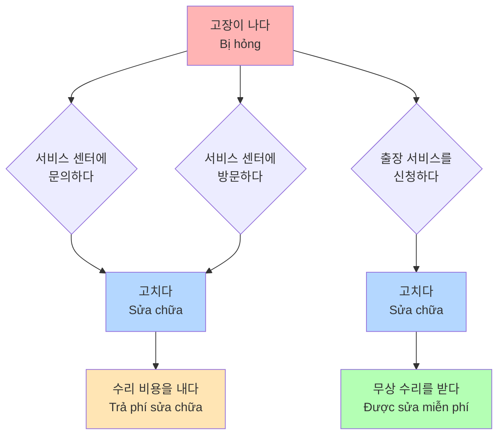
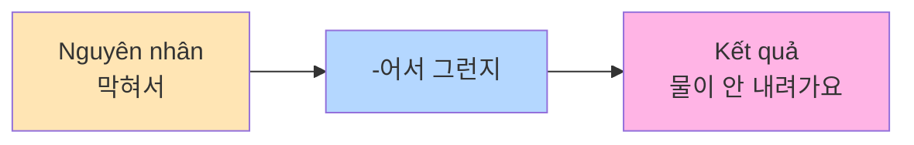
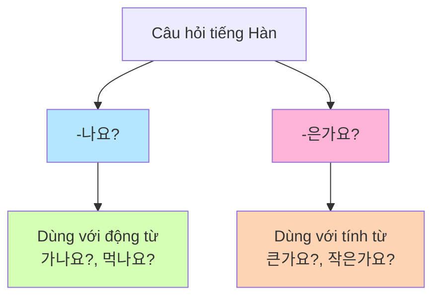
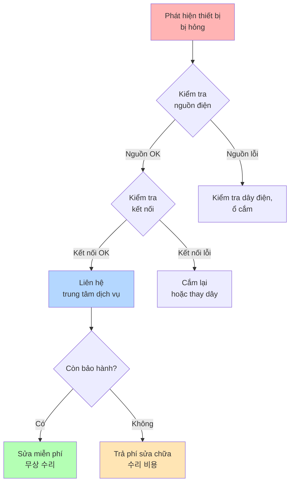
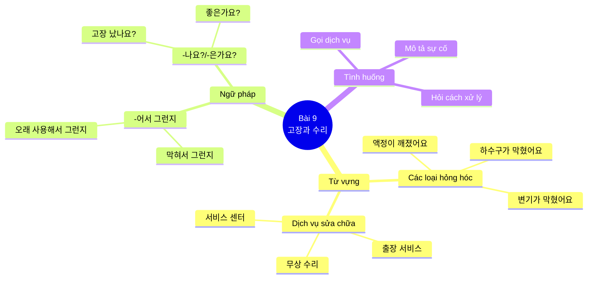

# Bài 9: 고장과 수리 (Hỏng hóc và Sửa chữa)

## 📋 Mục tiêu bài học

- **Từ vựng**: Học các từ vựng liên quan đến hỏng hóc và sửa chữa
- **Ngữ pháp**:
  - Động từ + **-어서 그런지** (có lẽ vì... nên...)
  - Động từ/Tính từ + **-나요?/-은가요?** (phải không?)

---

## 🎯 Câu hỏi khởi động

### 📷 Hình ảnh minh họa

**무슨 문제가 생긴 것 같아요?**
**여러분은 이런 문제가 생기면 어떻게 해요?**

- Bạn nghĩ vấn đề gì đã xảy ra?
- Khi gặp những vấn đề này, bạn xử lý như thế nào?

---

## 📖 어휘 (Từ vựng)

### 1. 어떤 고장이 났는지 이야기해 보세요.
**Hãy nói xem loại hỏng hóc nào đã xảy ra.**

#### Các loại hỏng hóc thường gặp:

| **Hình ảnh** | **Từ tiếng Hàn** | **Nghĩa tiếng Việt** |
|-------------|------------------|----------------------|
| 🚽 | 하수구가 막혔어요 | Cống bị tắc |
| 🚻 | 변기가 막혔어요 | Bồn cầu bị tắc |
| 🚰 | 물이 안 나와요 | Không có nước ra |
| 💧 | 물이 새요 | Nước bị rò rỉ/chảy |
| 💡 | 전등이 나갔어요 | Đèn bị tắt |
| 🚪 | 문이 잠겼어요 | Cửa bị khóa |
| 🔥 | 가스불이 안 들어와요 | Bếp gas không bật được |
| ❄️ | 냉동이 안 돼요 | Không thể đông lạnh |
| 📱 | 와이파이 연결이 안 돼요 | WiFi không kết nối được |
| 📱 | 액정이 깨졌어요 | Màn hình bị vỡ |
| 💻 | 부팅이 안 돼요 | Không khởi động được |
| 🖥️ | 전원이 안 켜져요 | Nguồn không bật được |

---

### 2. 전자 제품이 고장 나면 어떻게 해요?
**Khi thiết bị điện tử bị hỏng thì làm thế nào?**

#### 🔄 Quy trình xử lý:



---

## 📚 I. TỪ VỰNG

### 1. Các loại hỏng hóc thường gặp

| STT | Từ vựng tiếng Hàn | Nghĩa tiếng Việt | Ví dụ |
|-----|------------------|------------------|-------|
| 1 | 하수구가 막혔어요 | Cống bị tắc | 머리카락이 들어가서 그런지 하수구가 막힌 것 같아요. |
| 2 | 변기가 막혔어요 | Bồn cầu bị tắc | 변기가 막혔어요. 펌프질을 하거나 변기 뚫는 세제를 사용해서 뚫어 보세요. |
| 3 | 물이 안 나와요 | Không có nước ra | 물이 왜 이렇게 안 내려가지요? |
| 4 | 물이 새요 | Nước bị rò rỉ/chảy | 후대 전화에 물이 들어갔을 때 가요. |
| 5 | 전등이 나갔어요 | Đèn bị tắt | 냉동이 잘 안 돼요. 음식물이 자꾸 녹아요. |
| 6 | 문이 잠겼어요 | Cửa bị khóa | 문이 잠겼어요. |
| 7 | 가스불이 안 들어와요 | Bếp gas không bật được | 가스불이 안 들어와요. 밸브를 열었는지 확인해 보세요. |
| 8 | 냉동이 안 돼요 | Không thể đông lạnh | 냉동이 잘 안 돼요. 온도를 낮춰 보세요. |
| 9 | 와이파이 연결이 안 돼요 | WiFi không kết nối được | 와이파이 연결이 안 돼요. |
| 10 | 액정이 깨졌어요 | Màn hình bị vỡ | 액정이 깨졌어요. |
| 11 | 노트북 화면이 안 나와요 | Màn hình laptop không hiển thị | 노트북 화면이 안 나와요. 전원을 껐다가 켜 보세요. |
| 12 | 부팅이 안 돼요 | Không khởi động được | 부팅이 안 돼요. |
| 13 | 전원이 안 켜져요 | Nguồn không bật được | 어제부터 전원이 안 켜지는데 어떻게 해야 되나요? |

### 2. Từ vựng liên quan đến dịch vụ sửa chữa

| STT | Từ vựng tiếng Hàn | Nghĩa tiếng Việt | Ví dụ |
|-----|------------------|------------------|-------|
| 1 | 고장이 나다 | Bị hỏng | 고객의 무리한 요구 때문에 갈등이 자주 생겨요. |
| 2 | 수리하다 | Sửa chữa | 수리 비용이 많이 비싸요? |
| 3 | 고치다 | Sửa, chữa | 개임을 많이 해서 그런지 휴대 전화 속도가 좀 느릴 것 같아요. |
| 4 | 점검하다 | Kiểm tra | 가까운 서비스 센터에 방문하셔서 점검을 받아 보셔야 할 것 같습니다. |
| 5 | 서비스 센터 | Trung tâm dịch vụ | 노트북에 문제가 있어서 서비스 문의 좀 드리려고 하는데요. |
| 6 | 출장 서비스 | Dịch vụ đến tận nơi | 출장 서비스를 신청하다. |
| 7 | 출장 서비스를 신청하다 | Đăng ký dịch vụ đến tận nơi | 출장 서비스를 신청합니다. |
| 8 | 서비스 센터에 문의하다 | Hỏi trung tâm dịch vụ | 서비스 센터에 문의하다. |
| 9 | 서비스 센터에 방문하다 | Đến trung tâm dịch vụ | 가가운 서비스 센터에 방문하셔서 점검을 받아 보세요. |
| 10 | 무상 수리 | Sửa chữa miễn phí | 무상 수리를 받다. |
| 11 | 무상 수리를 받다 | Được sửa chữa miễn phí | 보증 기간 내에 무상 수리를 받을 수 있습니다. |
| 12 | 수리 비용 | Chi phí sửa chữa | 수리 비용을 내다. |
| 13 | 수리 비용을 내다 | Trả chi phí sửa chữa | 보증 기간이 지나서 수리 비용을 내야 합니다. |
| 14 | 보증 기간 | Thời gian bảo hành | 보증 기간이 얼마나 되나요? |
| 15 | 문의하다 | Hỏi, tư vấn | 노트북에 문제가 있어서 서비스 문의 좀 드리려고 하는데요. |
| 16 | 신청하다 | Đăng ký, đề nghị | 출장 서비스를 신청하다. |
| 17 | 방문하다 | Thăm, đến | 서비스 센터에 방문하다. |

### 3. Động từ và hành động sửa chữa

| STT | Từ vựng tiếng Hàn | Nghĩa tiếng Việt | Ví dụ |
|-----|------------------|------------------|-------|
| 1 | 뽑다 | Rút ra, nhổ ra | 플러그를 뽑다. |
| 2 | 꽂다 | Cắm vào | 플러그를 잘 꽂았는지 확인해 보세요. |
| 3 | 잠그다 | Khóa lại | 밸브를 잠그다. |
| 4 | 잠기다 | Bị khóa | 문이 잠겼어요. |
| 5 | 열다 | Mở ra | 밸브를 열었는지 확인해 보세요. |
| 6 | 막히다 | Bị tắc | 막혀서 그런지 물이 안 내려가요. |
| 7 | 새다 | Rò rỉ, chảy | 물이 새요. |
| 8 | 나가다 | Tắt (đèn) | 전등이 나갔어요. |
| 9 | 나오다 | Ra, xuất hiện | 물이 안 나와요. |
| 10 | 들어오다 | Vào, bật lên | 가스불이 안 들어와요. |
| 11 | 깨지다 | Bị vỡ | 액정이 깨졌어요. |
| 12 | 켜지다 | Được bật lên | 전원이 안 켜져요. |
| 13 | 되다 | Trở thành, được | 냉동이 안 돼요. |
| 14 | 낮추다 | Hạ xuống, giảm | 온도를 낮춰 보세요. |
| 15 | 높이다 | Nâng lên, tăng | 온도를 높이다. |
| 16 | 조절하다 | Điều chỉnh | 온도를 조절하다. |
| 17 | 뚫다 | Thông, đục thủng | 변기 뚫는 세제를 사용해서 뚫어 보세요. |
| 18 | 펌프질을 하다 | Bơm | 펌프질을 하거나 변기 뚫는 세제를 사용해 보세요. |

### 4. Từ vựng khác

| STT | Từ vựng tiếng Hàn | Nghĩa tiếng Việt | Ví dụ |
|-----|------------------|------------------|-------|
| 1 | 갑자기 | Đột nhiên | 갑자기 문제가 생긴 건가요? |
| 2 | 일시적 | Tạm thời | 일시적 문제일 수도 있습니다. |
| 3 | 플러그 | Phích cắm | 플러그를 잘 꽂았는지 확인해 보세요. |
| 4 | 밸브 | Van | 밸브를 열었는지 확인해 보세요. |
| 5 | 온도 | Nhiệt độ | 온도가 높지 않은가요? 온도를 낮춰 보세요. |
| 6 | 전원 | Nguồn điện | 전원이 안 켜져요. |
| 7 | 속도 | Tốc độ | 며칠 전부터 속도가 좀 느려졌어요. |
| 8 | 냉기 | Khí lạnh | 냉기가 잘 나오지 않아요. |
| 9 | 이물질 | Tạp chất, dị vật | 이물질이 들어가서 그런지 막혔어요. |
| 10 | 먹먹하다 | Nghẹt (tai/mũi) | 귀가 먹먹하다. |
| 11 | 바닥 | Sàn nhà, đáy | 바닥에 물이 새요. |

### 5. Từ vựng về bảo hiểm và chi phí

| STT | Từ vựng tiếng Hàn | Nghĩa tiếng Việt | Ví dụ |
|-----|------------------|------------------|-------|
| 1 | 보험에 가입하다 | Tham gia bảo hiểm | 보험에 가입하면 수리 비용이 줄어듭니다. |
| 2 | 고객 부담금 | Chi phí khách hàng phải trả | 고객 부담금을 제외하고 환급받을 수 있습니다. |
| 3 | 제외하다 | Loại trừ | 고객 부담금을 제외하다. |
| 4 | 환급받다 | Nhận hoàn tiền | 수리 비용을 환급받다. |

### 6. Từ vựng bổ sung

| STT | Từ vựng tiếng Hàn | Nghĩa tiếng Việt | Ví dụ |
|-----|------------------|------------------|-------|
| 1 | 예방 주사 | Tiêm phòng | 예방 주사를 맞다. |
| 2 | 갈등 | Xung đột, mâu thuẫn | 고객의 무리한 요구 때문에 갈등이 자주 생겨요. |
| 3 | 펌프질 | Việc bơm | 펌프질을 하거나 변기 뚫는 세제를 사용해 보세요. |

---

## 📝 II. NGỮ PHÁP

### 1. **-어서 그런지** (Có lẽ vì... nên...)

#### Ý nghĩa
Cấu trúc này dùng để đưa ra suy đoán hoặc phỏng đoán về nguyên nhân của một hiện tượng nào đó. Người nói không chắc chắn 100% nhưng cho rằng có thể đó là lý do.

#### Cấu trúc

```
Động từ gốc + -어서 그런지
```

#### Quy tắc chia động từ

| Gốc động từ | Cách chia | Ví dụ |
|------------|----------|-------|
| Gốc có nguyên âm cuối là ㅏ, ㅗ | + 아서 그런지 | 막다 → 막**아서 그런지** |
| Gốc có nguyên âm khác | + 어서 그런지 | 먹다 → 먹**어서 그런지** |
| 하다 | → 해서 그런지 | 사용하다 → 사용**해서 그런지** |
| 오다 | → 와서 그런지 | 오다 → **와서 그런지** |

#### Ví dụ minh họa

| Câu tiếng Hàn | Nghĩa tiếng Việt |
|--------------|------------------|
| 막혀서 그런지 물이 안 내려가요. | Có lẽ vì bị tắc nên nước không chảy xuống. |
| 오래 사용해서 그런지 고장이 자주 나요. | Có lẽ vì sử dụng lâu nên hay bị hỏng. |
| 배터리가 오래돼서 그런지 금방 꺼져요. | Có lẽ vì pin cũ nên nhanh tắt. |
| 추워서 그런지 난방이 안 돼요. | Có lẽ vì trời lạnh nên máy sưởi không hoạt động. |

#### Biểu đồ cấu trúc câu



---

### 2. **-나요?/-은가요?** (Phải không? / Có phải... không?)

#### Ý nghĩa
Cấu trúc này dùng để hỏi một cách lịch sự, mang tính chất xác nhận thông tin hoặc đoán định với người nghe. Thường được sử dụng trong hội thoại thân mật nhưng vẫn tôn trọng.

#### Cấu trúc

```
Động từ/Tính từ + -나요?/-은가요?
```

#### Quy tắc sử dụng

| Loại từ | Cách chia | Ví dụ |
|---------|----------|-------|
| **Động từ gốc có nguyên âm cuối** | + **-나요?** | 가다 → 가**나요?** (đi phải không?) |
| **Động từ gốc có phụ âm cuối** | + **-나요?** | 먹다 → 먹**나요?** (ăn phải không?) |
| **Tính từ gốc có nguyên âm cuối** | + **-ㄴ가요?** | 크다 → 크**ㄴ가요?** (to phải không?) |
| **Tính từ gốc có phụ âm cuối** | + **-은가요?** | 작다 → 작**은가요?** (nhỏ phải không?) |

#### Ví dụ với động từ **-나요?**

| Câu hỏi | Nghĩa tiếng Việt |
|---------|------------------|
| 어디가 고장 났**나요**? | Chỗ nào bị hỏng (vậy)? |
| 냉장고가 고장 났**나요**? | Tủ lạnh bị hỏng phải không? |
| 수리하는 데 얼마나 걸립**나요**? | Sửa chữa mất bao lâu (vậy)? |

#### Ví dụ với tính từ **-은가요?/-ㄹ가요?**

| Câu hỏi | Nghĩa tiếng Việt |
|---------|------------------|
| 예약하고 가는 게 좋**은가요**? | Đặt trước rồi đến có tốt không? |
| 한국어를 배우는 이유가 뭔**가요**? | Lý do học tiếng Hàn là gì vậy? |
| 수리하는 데 비용이 많이 비싼**가요**? | Chi phí sửa chữa có đắt không? |

#### So sánh hai câu hỏi

| Cấu trúc | Câu hỏi | Tính chất |
|----------|---------|-----------|
| **-나요?** | 어디가 고장 났나요? | Hỏi thẳng, tò mò |
| **-습니까?/-ㅂ니까?** | 어디가 고장 났습니까? | Hỏi lịch sự, trang trọng |

#### Biểu đồ so sánh



---

## 💬 III. MẪU CÂU VÀ HỘI THOẠI

### 1. Mẫu câu với **-어서 그런지**

| Tình huống | Mẫu câu tiếng Hàn | Nghĩa tiếng Việt |
|-----------|------------------|------------------|
| Điện thoại cũ | 스마트폰을 오래 사용해서 그런지 배터리가 금방 닳아요. | Có lẽ vì dùng smartphone lâu nên pin nhanh hết. |
| Máy giặt | 세탁기를 자주 사용해서 그런지 소음이 커요. | Có lẽ vì dùng máy giặt thường xuyên nên tiếng ồn lớn. |
| Laptop | 먼지가 많아서 그런지 노트북이 자주 꺼져요. | Có lẽ vì nhiều bụi nên laptop hay tắt. |

### 2. Mẫu câu với **-나요?/-은가요?**

| Tình huống | Mẫu câu tiếng Hàn | Nghĩa tiếng Việt |
|-----------|------------------|------------------|
| Hỏi về tủ lạnh | 어디가 고장 났나요? | Chỗ nào bị hỏng vậy? |
| Hỏi thời gian sửa | 수리하는 데 며칠이나 걸리나요? | Sửa mất mấy ngày vậy? |
| Hỏi dịch vụ | 출장 서비스를 신청하나요? | Có đặt dịch vụ đến tận nơi không? |

### 3. Hội thoại mẫu: Gọi đến trung tâm dịch vụ

```
👤 이나연: 노트북에 문제가 있어서 서비스 문의 좀 드리려고 하는데요.
         (Laptop tôi có vấn đề nên muốn hỏi về dịch vụ ạ.)

👨 직원: 네, 고객님. 어떤 문제가 있는지 말씀해 주시겠어요?
       (Vâng, quý khách. Có thể cho biết vấn đề gì không ạ?)

👤 이나연: 어제부터 전원이 안 켜지는데 어떻게 해야 되나요?
         (Từ hôm qua nguồn không bật được, phải làm sao ạ?)

👨 직원: 갑자기 문제가 생긴 건가요? 혹시 다른 문제는 없으셨어요?
       (Đột nhiên bị vấn đề à? Có vấn đề gì khác không ạ?)

👤 이나연: 며칠 전부터 속도가 좀 느려졌어요.
         (Từ mấy ngày trước tốc độ hơi chậm.)

👨 직원: 고객님, 가까운 서비스 센터에 방문하셔서 점검을 받아 보셔야 할 것 같습니다.
       (Quý khách nên đến trung tâm dịch vụ gần nhất để kiểm tra ạ.)

👤 이나연: 아, 그래요? 그럼 예약 좀 부탁드려요.
         (À, vậy à? Vậy làm ơn đặt trước giúp tôi.)
```

---

## 🗣️ IV. LUYỆN NÓI (말하기)

### 📞 Bài tập 1: 아나이스 씨가 서비스 센터 직원과 이야기합니다

**다음 대화처럼 이야기해 보세요.**

#### Hội thoại mẫu:

**아나이스**: 노트북에 문제가 있어서 서비스 문의 좀 드리려고 하는데요.

**직    원**: 네, 고객님. 어떤 문제가 있는지 말씀해 주시겠어요?

**아나이스**: 어제부터 전원이 안 켜지는데 어떻게 해야 되나요?

**직    원**: 갑자기 문제가 생긴 건가요? 혹시 다른 문제는 없으셨어요?

**아나이스**: 며칠 전부터 속도가 좀 느려졌어요.

**직    원**: 고객님, 가까운 서비스 센터에 방문하셔서 점검을 받아 보셔야 할 것 같습니다.

**아나이스**: 아, 그래요? 그럼 예약 좀 부탁드려요.

---

**Dịch:**

**Anais**: Laptop tôi có vấn đề nên muốn hỏi về dịch vụ ạ.

**Nhân viên**: Vâng, quý khách. Có thể cho biết vấn đề gì không ạ?

**Anais**: Từ hôm qua nguồn không bật được, phải làm sao ạ?

**Nhân viên**: Đột nhiên bị vấn đề à? Có vấn đề gì khác không ạ?

**Anais**: Từ mấy ngày trước tốc độ hơi chậm.

**Nhân viên**: Quý khách nên đến trung tâm dịch vụ gần nhất để kiểm tra ạ.

**Anais**: À, vậy à? Vậy làm ơn đặt trước giúp tôi.

---

#### 💡 Gợi ý từ vựng:

| **Tình huống** | **Từ vựng gợi ý** |
|----------------|-------------------|
| 어제부터 전원이 안 켜지는데 | 막먹하다, 바다, 떠이드리다, 속도 |
| 갑자기 문제가 생긴 건가요? | |
| 출장 서비스를 신청하다 | |

---

### 🏠 Bài tập 2: 텔레비전과 냉장고가 고장 났습니다

**손님과 서비스 센터의 상담 직원이 되어 대화해 보세요.**

#### Bảng phân loại vấn đề:

| **손님 (Khách hàng)** | **서비스 센터 직원 (Nhân viên trung tâm)** |
|----------------------|-------------------------------------------|
| • 텔레비전 전원이 안 켜지다 | • 출장 서비스를 신청하다 |
| • 냉동이 잘 안 되다 | • 냉동실 온도를 먼저 확인하다 |

#### Mẫu hội thoại:

**손님**: 텔레비전 전원이 안 켜져요.

**직원**: 플러그를 잘 꽂았는지 확인해 보세요.

**손님**: 플러그를 잘 꽂았는데도 안 켜져요.

**직원**: 그러면 출장 서비스를 신청하세요.

---

**Dịch:**

**Khách**: Tivi không bật được nguồn.

**Nhân viên**: Hãy kiểm tra xem phích cắm đã cắm chặt chưa.

**Khách**: Tôi đã cắm chặt phích cắm rồi mà vẫn không bật được.

**Nhân viên**: Vậy thì hãy đăng ký dịch vụ đến tận nơi.

---

## 🔧 V. CÁCH XỬ LÝ KHI GẶP SỰ CỐ

### Sơ đồ xử lý khi điện tử bị hỏng



### Bảng các câu hỏi thường gặp (FAQ)

| Câu hỏi | Cách trả lời |
|---------|--------------|
| 텔레비전 전원이 안 켜져요. | 플러그를 잘 꽂았는지 확인해 보세요. 전원 버튼을 다시 눌러 보세요. |
| 변기가 막혔어요. | 펌프질을 하거나 변기 뚫는 세제를 사용해서 뚫어 보세요. |
| 가스불이 안 들어와요. | 밸브를 열었는지 확인해 보세요. |
| 냉동이 잘 안 돼요. 음식물이 자꾸 녹아요. | 온도가 높지 않은가요? 온도를 낮춰 보세요. |
| 노트북 화면이 안 나와요. | 전원을 껐다가 켜 보세요. 케이블 연결을 확인해 보세요. |
| 휴대 전화 속도가 느려졌어요. | 앱을 종료하거나 불필요한 데이터를 삭제해 보세요. |

---

## 👂 VI. LUYỆN NGHE (듣기)

### 🎧 Bài nghe 1: 휴대 전화에 어떤 문제가 생겼을 때 서비스 센터에 갑니까?

**Khi điện thoại gặp vấn đề gì thì đến trung tâm dịch vụ?**

#### Gợi ý tình huống:

- 휴대 전화 액정이 깨졌을 때 가요 (Khi màn hình điện thoại bị vỡ)
- 휴대 전화에 물이 들어갔을 때 가요 (Khi điện thoại bị ngấm nước)

---

### 🎧 Bài nghe 2: 라흐만 씨가 서비스 센터 직원과 이야기합니다

**잘 듣고 질문에 답해 보세요.**

#### Câu hỏi:

**1) 라흐만 씨의 휴대 전화 액정은 왜 깨졌습니까?**

→ _________________________________

**2) 들은 내용과 같으면 ○, 다르면 X 하세요.**

| **Nội dung** | **○ hoặc X** |
|-------------|-------------|
| ① 일주일 전에 액정이 깨졌다. | ( ) |
| ② 액정이 많이 깨져서 비용이 많이 든다. | ( ) |
| ③ 수리 후에 영수증을 보험사에 보내야 한다. | ( ) |

---

### 🗣️ Luyện phát âm (발음)

#### Quy tắc phát âm bất음화:

**한자어** với **ㄷ, ㅅ, ㅈ** + **[ㄷ, ㅅ, ㅈ]** → Đọc là **[ㄷ, ㅆ, ㅉ]**

| **Từ viết** | **Phát âm** | **Nghĩa** |
|------------|------------|----------|
| 갈등 | [갈뜽] | Xung đột, mâu thuẫn |
| 일시적 | [일씨쩍] | Tạm thời |
| 출장 | [출짱] | Công tác, đi công tác |

#### Luyện tập:

**다음을 듣고 따라 읽으세요.**

1) 고객의 무리한 요구 때문에 **갈등**이 자주 생겨요.
   → Vì yêu cầu quá đáng của khách hàng nên thường xảy ra xung đột.

2) 와이파이가 안 되는 것은 **일시적**인 문제예요.
   → WiFi không hoạt động là vấn đề tạm thời.

3) 냉장고가 고장 나면 **출장** 서비스를 신청하세요.
   → Nếu tủ lạnh bị hỏng thì hãy đăng ký dịch vụ đến tận nơi.

---

### 💡 Gợi ý từ vựng (듣기):

| **Từ tiếng Hàn** | **Nghĩa tiếng Việt** |
|------------------|----------------------|
| 보험에 가입하다 | Tham gia bảo hiểm |
| 고객 부담금 | Chi phí khách hàng phải trả |
| 제외하다 | Loại trừ |
| 환급받다 | Nhận hoàn tiền |
| 갈등 | Xung đột |
| 일시적 | Tạm thời |

---

## 📖 VII. BÀI ĐỌC (읽기)

### 📋 Bài đọc 1: 제품이 고장 났을 때 여러분은 먼저 무엇을 합니까?

#### Ghép các tình huống với cách xử lý:

| **문제 (Vấn đề)** | **해결 방법 (Cách giải quyết)** |
|------------------|--------------------------------|
| 플러그를 **뽑다** / **꽂다** | 온도를 **낮추다** / **높이다** |
| 밸브를 **잠그다** / **열다** | |
| | 펌프질을 하다 |

#### Bài tập ghép cặp:

| **자주 묻는 질문(FAQ)** | **먼저 해 볼 수 있는 방법** |
|------------------------|---------------------------|
| 텔레비전 전원이 안 켜져요. | 플러그를 잘 꽂았는지 확인해 보세요.<br/>플러그를 뽑았다 다시 꽂아 보세요. |
| 변기가 막혔어요. | 펌프질을 하거나 변기 뚫는 세제를<br/>사용해서 뚫어 보세요. |
| 가스불이 안 들어와요. | 밸브를 열었는지 확인해 보세요. |
| 냉동이 잘 안 돼요.<br/>음식물이 자꾸 녹아요. | 온도가 높지 않은가요?<br/>온도를 낮춰 보세요. |
| 노트북 화면이 안 나와요. | 전원을 껐다가 켜 보세요. |
| 휴대 전화 속도가 느려졌어요. | 앱을 종료하거나 불필요한 데이터를<br/>삭제해 보세요. |

---

### 💬 Gợi ý:

**서비스 센터에 문의하기 전에 플러그를 잘 꽂았는지 먼저 확인해 보세요. 아니면 플러그를 뽑았다 다시 꽂아 보세요.**

---

### 📰 Bài đọc 2: Q&A - 자의 집 변기가 자주 막혀요

#### Q & A 게시판

**❓ Q: 저희 집 변기가 자주 막혀요.**

저희 집은 변기를 많이 사용하지도 않는데 너무 자주 막힙니다. 사용할 때마다 조심하는데 물이 잘 내려가지 않습니다. 일주일에 서너 번 이상 막히는 것 같습니다. 막힐 때마다 펌프질을 하고 변기 뚫는 세제를 사용해서 뚫는데 그때뿐이고 며칠 지나면 다시 막힙니다. 어떻게 하면 좋을까요?

**💡 A: 그 정도면 전문가 도움을 받으셔야 합니다.**

일주일에 서너 번 이상 막히면 사용하실 때마다 스트레스가 심하셨겠어요. 변기가 막히는 이유는 여러 가지가 있습니다. 오래 사용하셨거나 물의 양이 부족해서 생기는 문제일 수도 있고, 변기 안에 이물질이 들어간 경우도 생각해 볼 수 있습니다. 이물질이 들어간 경우에는 펌프질이나 세제를 사용하는 것만으로는 해결이 안 됩니다. 전문가에게 연락하셔서 점검과 도움을 받으시기 바랍니다.

---

#### Câu hỏi:

**1) 어떤 문제가 있어서 인터넷 게시판에 질문을 했습니까?**

→ _________________________________

**2) 윗글의 내용과 같으면 ○, 다르면 X 하세요.**

| **Nội dung** | **○ hoặc X** |
|-------------|-------------|
| ① 이런 문제가 처음 생겼다. | ( ) |
| ② 변기에 이물질이 들어갔을 때는 세제를 사용하면 된다. | ( ) |
| ③ 변기에 이물질이 들어갔을 때는 전문가의 도움이 필요하다. | ( ) |

**3) 변기가 막히는 이유가 아닌 것을 고르세요.**

① 오래 사용해서
② 이물질이 들어가서
③ 물의 양이 부족해서
④ 펌프질을 자주 해서

**Đáp án**: ④

---

## 📝 VIII. LUYỆN VIẾT (쓰기)

### ✍️ Bài tập viết 1: 집주인이나 관리 사무실에 집수리를 요청하려고 합니다

**요청할 내용을 메모해 보세요.**

#### Gợi ý:

| **Câu hỏi** | **Ghi chú** |
|------------|-----------|
| 어떤 문제가 있어요? | |
| 언제부터 그런 문제가 생겼어요? | |
| 무엇을 요청할 거예요? | |

---

### ✍️ Bài tập viết 2: 위 내용을 바탕으로 집주인이나 관리 사무실에 수리를 요청하는 글을 써 보세요

#### Mẫu email:

```
받는 사람: 디오빌 관리 사무실(manager@diovill.com)
제    목: ________________________________

______________________________________
______________________________________
______________________________________
______________________________________
______________________________________
______________________________________
```

---

## 📖 VIII. BÀI TẬP THỰC HÀNH

### Bài tập 1: Điền **-어서 그런지** hoặc **-나요?**

1. 물이 왜 이렇게 안 내려가지요? → 막혀서 그런지 물이 안 내려가요.
2. 휴대 전화 속도가 느려졌어요? → 오래 사용**해서 그런지** 속도가 느려졌어요.
3. 변기가 막혔나요? → 변기가 막혔**어서 그런지** 물이 안 내려가요.

### Bài tập 2: Ghép các tình huống với cách xử lý

| Tình huống | Cách xử lý |
|-----------|------------|
| 1. 텔레비전 전원이 안 켜져요. | a. 플러그를 잘 꽂았는지 확인해 보세요. |
| 2. 변기가 막혔어요. | b. 펌프질을 하거나 변기 뚫는 세제를 사용해 보세요. |
| 3. 냉동이 잘 안 돼요. | c. 온도를 낮춰 보세요. |

**Đáp án**: 1-a, 2-b, 3-c

---

## 📌 VI. TỔNG KẾT

### Điểm ngữ pháp chính

1. **-어서 그런지**: Diễn tả suy đoán về nguyên nhân (Có lẽ vì... nên...)
2. **-나요?/-은가요?**: Dùng để hỏi một cách lịch sự, xác nhận thông tin

### Sơ đồ tư duy tổng hợp



---

## 📋 IX. KIỂM TRA TỪ VỰNG ĐÃ HỌC (배운 어휘 확인)

### Danh sách từ vựng cần nhớ:

#### Loại hỏng hóc và vấn đề:
- 고장이 나다, 하수구가 막히다, 변기가 막히다, 물이 안 나오다
- 물이 세다, 전등이 나가다, 가스불이 안 들어오다
- 냉동이 안 되다, 냉기, 속도, 예방 주사
- 냉기, 조절하다, 보험에 가입하다
- 고객 부담금, 제외하다, 환급받다, 플러그
- 꽂다, 뽑다, 갈등, 이물질

#### Dịch vụ sửa chữa:
- 서비스 센터에 문의하다, 출장 서비스를 신청하다
- 서비스 센터에 방문하다, 고치다, 수리하다
- 무상 수리를 받다, 수리 비용을 내다

#### Thời gian bảo hành:
- 보증 기간이 내다, 떨어드리다, 바닥

---

## 🎯 X. LƯU Ý VĂN HÓA

### Thời gian bảo hành ở Hàn Quốc

Ở Hàn Quốc, khi mua điện tử hoặc thiết bị gia dụng, thời gian bảo hành thường là:
- **1 năm** đối với các thiết bị điện tử như smartphone, laptop, máy ảnh
- **2 năm** đối với các thiết bị gia dụng lớn như tủ lạnh, máy giặt, điều hòa

Trong thời gian bảo hành, nếu sản phẩm bị hỏng do lỗi nhà sản xuất, khách hàng sẽ được **sửa miễn phí** (무상 수리) hoặc **đổi mới** (교환). Tuy nhiên, nếu hỏng do người dùng (như rơi vỡ, ngấm nước), khách hàng phải **trả phí sửa chữa** (수리 비용).

---

**Chúc các bạn học tốt!** 화이팅! 💪
