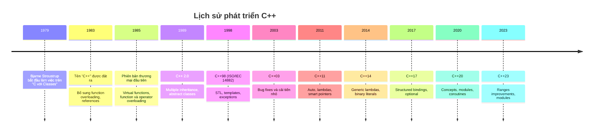
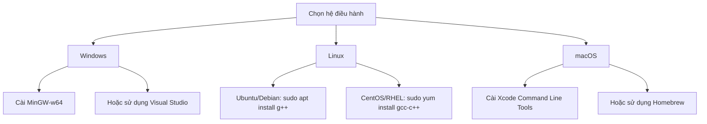
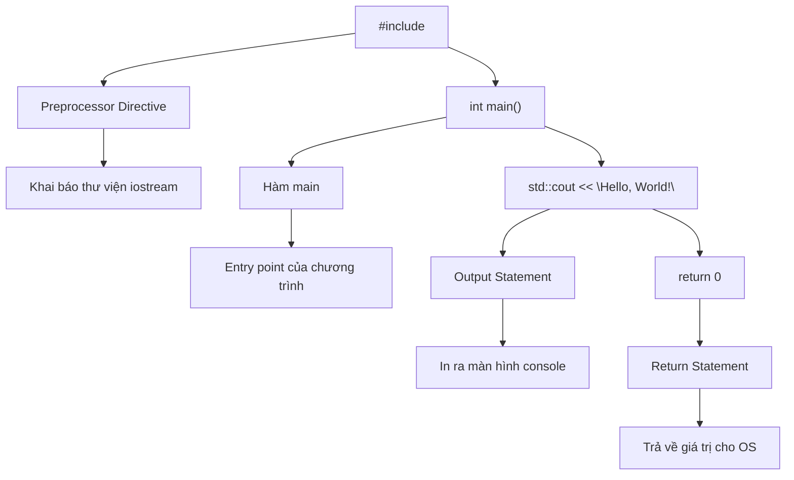
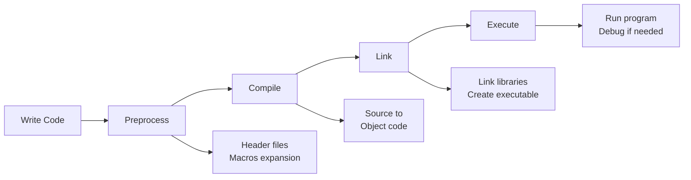

# Bài 1: Giới thiệu C++ và thiết lập môi trường

<div className="bg-gradient-to-r from-blue-500 to-purple-600 text-white p-6 rounded-lg mb-8 shadow-lg">
  <h2 className="text-2xl font-bold mb-2">🎯 Mục tiêu bài học</h2>
  <ul className="list-disc list-inside space-y-1">
    <li>Hiểu được C++ là gì và lịch sử phát triển</li>
    <li>Nắm được ưu nhược điểm của C++ so với các ngôn ngữ khác</li>
    <li>Thiết lập được môi trường lập trình C++</li>
    <li>Viết và chạy được chương trình C++ đầu tiên</li>
    <li>Hiểu cấu trúc cơ bản của chương trình C++</li>
  </ul>
</div>

## 📚 1. C++ là gì?

**C++** là một ngôn ngữ lập trình đa mục đích, được phát triển bởi Bjarne Stroustrup tại Bell Labs vào đầu những năm 1980. C++ là sự mở rộng của ngôn ngữ C, bổ sung thêm các tính năng lập trình hướng đối tượng (OOP).

### 🕒 Lịch sử phát triển



## 🔄 2. So sánh C++ với các ngôn ngữ khác

### C++ vs C

| Đặc điểm | C | C++ |
|----------|---|-----|
| **Paradigm** | Procedural | Multi-paradigm (OOP, Generic, Procedural) |
| **Cú pháp** | Đơn giản | Phức tạp hơn |
| **Memory Management** | Manual (malloc/free) | Manual + RAII, Smart Pointers |
| **Performance** | Rất cao | Rất cao |
| **Learning Curve** | Dễ học | Khó học hơn |
| **Library Support** | Hạn chế | Rất phong phú (STL) |

### C++ vs Java vs Python

| Đặc điểm | C++ | Java | Python |
|----------|-----|------|--------|
| **Compilation** | Compiled | Bytecode | Interpreted |
| **Speed** | ⭐⭐⭐⭐⭐ | ⭐⭐⭐ | ⭐⭐ |
| **Memory Control** | Manual | Automatic (GC) | Automatic (GC) |
| **Platform** | Platform-specific | Cross-platform | Cross-platform |
| **Learning Difficulty** | ⭐⭐⭐⭐⭐ | ⭐⭐⭐ | ⭐⭐ |
| **Use Cases** | System, Game, Embedded | Enterprise, Web | AI, Data Science, Web |

<div className="bg-green-100 border-l-4 border-green-500 p-4 my-6">
  <h3 className="text-green-800 font-bold">💡 Ưu điểm của C++</h3>
  <ul className="text-green-700 mt-2 space-y-1">
    <li><strong>Performance cao:</strong> Compiled trực tiếp ra machine code</li>
    <li><strong>Kiểm soát bộ nhớ:</strong> Quản lý memory một cách tối ưu</li>
    <li><strong>Multi-paradigm:</strong> Hỗ trợ nhiều mô hình lập trình</li>
    <li><strong>Rich library:</strong> STL và ecosystem phong phú</li>
    <li><strong>Portability:</strong> Chạy được trên nhiều platform</li>
  </ul>
</div>

<div className="bg-red-100 border-l-4 border-red-500 p-4 my-6">
  <h3 className="text-red-800 font-bold">⚠️ Nhược điểm của C++</h3>
  <ul className="text-red-700 mt-2 space-y-1">
    <li><strong>Complexity:</strong> Cú pháp phức tạp, nhiều tính năng</li>
    <li><strong>Memory management:</strong> Dễ gặp lỗi memory leaks</li>
    <li><strong>Compilation time:</strong> Thời gian build lâu</li>
    <li><strong>Learning curve:</strong> Khó học và master</li>
  </ul>
</div>

## 🛠️ 3. Thiết lập môi trường lập trình

### 3.1 Trình biên dịch (Compiler)

| Compiler | Platform | Đặc điểm |
|----------|----------|----------|
| **GCC** | Linux, Windows (MinGW) | Open source, chuẩn C++ tốt |
| **Clang** | Cross-platform | LLVM-based, error messages tốt |
| **MSVC** | Windows | Microsoft Visual Studio |
| **Intel C++** | Cross-platform | Tối ưu cho Intel processors |

#### Cài đặt GCC trên các hệ điều hành:



### 3.2 IDE và Code Editor

| Tool | Loại | Ưu điểm | Nhược điểm |
|------|------|---------|------------|
| **Visual Studio** | IDE | IntelliSense mạnh, debugger tốt | Chỉ Windows, nặng |
| **Code::Blocks** | IDE | Nhẹ, cross-platform | Giao diện cũ |
| **CLion** | IDE | Refactoring tốt, CMake support | Trả phí |
| **VS Code** | Editor | Extensions phong phú, nhẹ | Cần cấu hình |
| **Dev-C++** | IDE | Đơn giản, dễ dùng | Lâu cập nhật |

### 3.3 Thiết lập VS Code cho C++

<div className="bg-blue-50 border border-blue-200 rounded-lg p-4 my-4">
  <h4 className="text-blue-800 font-bold mb-2">🔧 Extensions cần thiết:</h4>
  <ul className="text-blue-700 space-y-1">
    <li>• <strong>C/C++</strong> (Microsoft): IntelliSense, debugging</li>
    <li>• <strong>C/C++ Compile Run</strong>: Compile và run nhanh</li>
    <li>• <strong>Code Runner</strong>: Chạy code với shortcut</li>
    <li>• <strong>Error Lens</strong>: Hiển thị lỗi inline</li>
  </ul>
</div>

## 🎯 4. Chương trình "Hello World" đầu tiên

### 4.1 Code cơ bản

```cpp
#include <iostream>

int main() {
    std::cout << "Hello, World!" << std::endl;
    return 0;
}
```

### 4.2 Cấu trúc chương trình C++



### 4.3 Giải thích chi tiết từng phần

| Thành phần | Ý nghĩa | Ghi chú |
|------------|---------|---------|
| `#include <iostream>` | Khai báo thư viện I/O | Cần thiết cho `cout`, `cin` |
| `int main()` | Hàm chính của chương trình | Điểm bắt đầu thực thi |
| `std::cout` | Output stream object | In dữ liệu ra console |
| `<<` | Stream insertion operator | Chèn dữ liệu vào stream |
| `std::endl` | End line manipulator | Xuống dòng + flush buffer |
| `return 0` | Trả về exit code | 0 = thành công |

### 4.4 Các cách biên dịch và chạy

#### Command Line (GCC):
```bash
# Biên dịch
g++ hello.cpp -o hello

# Chạy chương trình
./hello          # Linux/macOS
hello.exe        # Windows
```

#### VS Code:
```json
// tasks.json
{
    "version": "2.0.0",
    "tasks": [
        {
            "label": "build",
            "type": "shell",
            "command": "g++",
            "args": [
                "-g",
                "${file}",
                "-o",
                "${fileDirname}/${fileBasenameNoExtension}"
            ]
        }
    ]
}
```

## 💻 5. Thực hành với các chương trình đơn giản

### Chương trình 1: Xuất thông tin cá nhân

```cpp
#include <iostream>
#include <string>

int main() {
    std::string name = "Nguyen Van A";
    int age = 20;
    double height = 1.75;
    
    std::cout << "Ho ten: " << name << std::endl;
    std::cout << "Tuoi: " << age << std::endl;
    std::cout << "Chieu cao: " << height << "m" << std::endl;
    
    return 0;
}
```

### Chương trình 2: Tính toán cơ bản

```cpp
#include <iostream>

int main() {
    int a = 10, b = 5;
    
    std::cout << "a = " << a << ", b = " << b << std::endl;
    std::cout << "a + b = " << a + b << std::endl;
    std::cout << "a - b = " << a - b << std::endl;
    std::cout << "a * b = " << a * b << std::endl;
    std::cout << "a / b = " << a / b << std::endl;
    
    return 0;
}
```

### Chương trình 3: Nhập xuất dữ liệu

```cpp
#include <iostream>
#include <string>

int main() {
    std::string name;
    int age;
    
    std::cout << "Nhap ten cua ban: ";
    std::getline(std::cin, name);
    
    std::cout << "Nhap tuoi cua ban: ";
    std::cin >> age;
    
    std::cout << "Xin chao " << name 
              << ", ban " << age << " tuoi!" << std::endl;
    
    return 0;
}
```

## 📊 6. Quy trình phát triển phần mềm C++



### Các giai đoạn build:

| Giai đoạn | Input | Output | Công cụ |
|-----------|-------|--------|---------|
| **Preprocessing** | `.cpp`, `.h` | `.i` | cpp |
| **Compilation** | `.i` | `.o`, `.obj` | gcc, g++ |
| **Linking** | `.o`, libraries | executable | ld |
| **Execution** | executable | running program | OS loader |

## 🎯 7. Bài tập thực hành

<div className="bg-yellow-50 border border-yellow-200 rounded-lg p-4 my-4">
  <h3 className="text-yellow-800 font-bold mb-2">📝 Bài tập 1: Chương trình giới thiệu bản thân</h3>
  <p className="text-yellow-700">Viết chương trình in ra thông tin cá nhân bao gồm: họ tên, tuổi, sở thích, và một câu mô tả về bản thân.</p>
</div>

<div className="bg-yellow-50 border border-yellow-200 rounded-lg p-4 my-4">
  <h3 className="text-yellow-800 font-bold mb-2">📝 Bài tập 2: Máy tính đơn giản</h3>
  <p className="text-yellow-700">Tạo chương trình nhập vào 2 số và thực hiện 4 phép toán cơ bản (+, -, *, /), sau đó in kết quả ra màn hình.</p>
</div>

<div className="bg-yellow-50 border border-yellow-200 rounded-lg p-4 my-4">
  <h3 className="text-yellow-800 font-bold mb-2">📝 Bài tập 3: Chương trình chào hỏi</h3>
  <p className="text-yellow-700">Viết chương trình nhập tên người dùng và in ra lời chào phù hợp với thời gian trong ngày.</p>
</div>

## 📚 8. Tài liệu tham khảo và học thêm

### Sách hay về C++:

| Tên sách | Tác giả | Level | Ghi chú |
|----------|---------|-------|---------|
| **C++ Primer** | Stanley Lippman | Beginner | Toàn diện, dễ hiểu |
| **The C++ Programming Language** | Bjarne Stroustrup | Advanced | Từ tác giả của C++ |
| **Effective C++** | Scott Meyers | Intermediate | Best practices |
| **Modern C++ Design** | Andrei Alexandrescu | Advanced | Template metaprogramming |

### Trang web hữu ích:

- **cppreference.com**: Tài liệu reference chính thức
- **learncpp.com**: Tutorial từ cơ bản đến nâng cao
- **cplusplus.com**: Documentation và examples
- **stackoverflow.com**: Q&A community

## 🎓 Tóm tắt bài học

<div className="bg-gray-100 rounded-lg p-6 my-6">
  <h3 className="text-gray-800 font-bold mb-3">🔑 Những điểm chính cần nhớ:</h3>
  <ul className="text-gray-700 space-y-2">
    <li><strong>C++</strong> là ngôn ngữ đa mục đích với hiệu suất cao</li>
    <li><strong>Môi trường phát triển</strong> cần compiler và IDE/editor</li>
    <li><strong>Cấu trúc cơ bản</strong>: #include, main(), cout, return</li>
    <li><strong>Quy trình</strong>: viết code → compile → link → execute</li>
    <li><strong>Thực hành</strong> là chìa khóa để học tốt C++</li>
  </ul>
</div>

---

<div className="text-center bg-gradient-to-r from-green-400 to-blue-500 text-white p-4 rounded-lg">
  <h3 className="font-bold text-lg">🎉 Chúc mừng bạn đã hoàn thành Bài 1!</h3>
  <p>Tiếp theo, chúng ta sẽ học về <strong>Kiểu dữ liệu và biến</strong> trong Bài 2.</p>
</div>