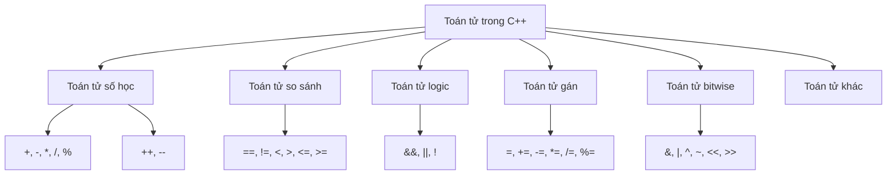
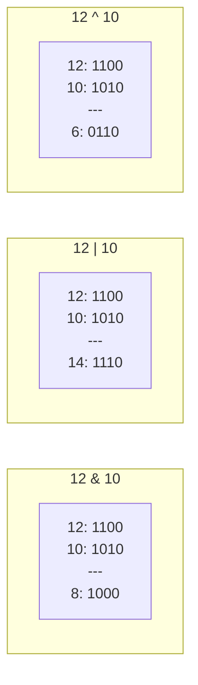

# Bài 3: Toán tử và Biểu thức

<div className="bg-gradient-to-r from-blue-50 to-indigo-100 p-6 rounded-lg border-l-4 border-blue-500 mb-8">
  <h2 className="text-2xl font-bold text-blue-800 mb-2">🎯 Mục tiêu bài học</h2>
  <ul className="text-blue-700 space-y-1">
    <li>✅ Nắm vững các loại toán tử trong C++</li>
    <li>✅ Hiểu thứ tự ưu tiên của toán tử</li>
    <li>✅ Xây dựng và tính toán biểu thức phức tạp</li>
    <li>✅ Ứng dụng thực tế: Tạo máy tính đơn giản</li>
  </ul>
</div>

## 📚 Giới thiệu về Toán tử

**Toán tử (Operator)** là các ký hiệu đặc biệt được sử dụng để thực hiện các phép toán trên dữ liệu. Trong C++, toán tử được phân loại thành nhiều nhóm khác nhau, mỗi nhóm có chức năng và mức độ ưu tiên riêng.



## 🔢 Toán tử Số học (Arithmetic Operators)

### Toán tử Cơ bản

| Toán tử | Tên | Mô tả | Ví dụ | Kết quả |
|---------|-----|-------|-------|---------|
| `+` | Cộng | Cộng hai số | `5 + 3` | `8` |
| `-` | Trừ | Trừ hai số | `5 - 3` | `2` |
| `*` | Nhân | Nhân hai số | `5 * 3` | `15` |
| `/` | Chia | Chia hai số | `15 / 3` | `5` |
| `%` | Chia lấy dư | Lấy số dư của phép chia | `17 % 5` | `2` |

<div className="bg-yellow-50 border-l-4 border-yellow-400 p-4 my-4">
  <div className="flex">
    <div className="flex-shrink-0">
      <span className="text-yellow-800 text-xl">⚠️</span>
    </div>
    <div className="ml-3">
      <p className="text-yellow-800 font-semibold">Lưu ý quan trọng:</p>
      <ul className="text-yellow-700 mt-2 space-y-1">
        <li>• Phép chia số nguyên sẽ loại bỏ phần thập phân: <code>7/2 = 3</code></li>
        <li>• Phép chia lấy dư chỉ áp dụng cho số nguyên</li>
        <li>• Chia cho 0 sẽ gây lỗi runtime</li>
      </ul>
    </div>
  </div>
</div>

### Ví dụ thực hành:

```cpp
#include <iostream>
using namespace std;

int main() {
    int a = 17, b = 5;
    
    cout << "a = " << a << ", b = " << b << endl;
    cout << "a + b = " << (a + b) << endl;    // 22
    cout << "a - b = " << (a - b) << endl;    // 12
    cout << "a * b = " << (a * b) << endl;    // 85
    cout << "a / b = " << (a / b) << endl;    // 3 (chia nguyên)
    cout << "a % b = " << (a % b) << endl;    // 2 (số dư)
    
    // Chia thực
    double x = 17.0, y = 5.0;
    cout << "x / y = " << (x / y) << endl;    // 3.4
    
    return 0;
}
```

### Toán tử Tăng/Giảm

| Toán tử | Tên | Mô tả | Ví dụ |
|---------|-----|-------|-------|
| `++var` | Tăng trước | Tăng giá trị trước khi sử dụng | `++a` |
| `var++` | Tăng sau | Tăng giá trị sau khi sử dụng | `a++` |
| `--var` | Giảm trước | Giảm giá trị trước khi sử dụng | `--a` |
| `var--` | Giảm sau | Giảm giá trị sau khi sử dụng | `a--` |

```cpp
#include <iostream>
using namespace std;

int main() {
    int a = 5, b = 5;
    
    cout << "Giá trị ban đầu: a = " << a << ", b = " << b << endl;
    
    // Tăng trước vs tăng sau
    cout << "++a = " << ++a << endl;  // a tăng thành 6, in ra 6
    cout << "b++ = " << b++ << endl;  // in ra 5, sau đó b tăng thành 6
    
    cout << "Sau đó: a = " << a << ", b = " << b << endl; // a = 6, b = 6
    
    return 0;
}
```

## 🔍 Toán tử So sánh (Comparison Operators)

Toán tử so sánh trả về giá trị `true` (1) hoặc `false` (0):

| Toán tử | Tên | Mô tả | Ví dụ |
|---------|-----|-------|-------|
| `==` | Bằng | Kiểm tra hai giá trị có bằng nhau | `a == b` |
| `!=` | Khác | Kiểm tra hai giá trị có khác nhau | `a != b` |
| `<` | Nhỏ hơn | Kiểm tra giá trị trái nhỏ hơn phải | `a < b` |
| `>` | Lớn hơn | Kiểm tra giá trị trái lớn hơn phải | `a > b` |
| `<=` | Nhỏ hơn hoặc bằng | Kiểm tra nhỏ hơn hoặc bằng | `a <= b` |
| `>=` | Lớn hơn hoặc bằng | Kiểm tra lớn hơn hoặc bằng | `a >= b` |

```cpp
#include <iostream>
using namespace std;

int main() {
    int x = 10, y = 20;
    
    cout << boolalpha; // In true/false thay vì 1/0
    
    cout << "x == y: " << (x == y) << endl;  // false
    cout << "x != y: " << (x != y) << endl;  // true
    cout << "x < y: " << (x < y) << endl;    // true
    cout << "x > y: " << (x > y) << endl;    // false
    cout << "x <= y: " << (x <= y) << endl;  // true
    cout << "x >= y: " << (x >= y) << endl;  // false
    
    return 0;
}
```

## 🧠 Toán tử Logic (Logical Operators)

| Toán tử | Tên | Mô tả | Bảng chân lý |
|---------|-----|-------|--------------|
| `&&` | AND | Trả về true nếu cả hai đều true | `true && true = true` |
| `\|\|` | OR | Trả về true nếu ít nhất một true | `true \|\| false = true` |
| `!` | NOT | Đảo ngược giá trị logic | `!true = false` |

### Bảng chân lý chi tiết:

<div className="overflow-x-auto">
  <table className="min-w-full bg-white border border-gray-300">
    <thead className="bg-gray-50">
      <tr>
        <th className="px-4 py-2 border">A</th>
        <th className="px-4 py-2 border">B</th>
        <th className="px-4 py-2 border">A && B</th>
        <th className="px-4 py-2 border">A || B</th>
        <th className="px-4 py-2 border">!A</th>
      </tr>
    </thead>
    <tbody>
      <tr><td className="px-4 py-2 border text-center">true</td><td className="px-4 py-2 border text-center">true</td><td className="px-4 py-2 border text-center bg-green-100">true</td><td className="px-4 py-2 border text-center bg-green-100">true</td><td className="px-4 py-2 border text-center bg-red-100">false</td></tr>
      <tr><td className="px-4 py-2 border text-center">true</td><td className="px-4 py-2 border text-center">false</td><td className="px-4 py-2 border text-center bg-red-100">false</td><td className="px-4 py-2 border text-center bg-green-100">true</td><td className="px-4 py-2 border text-center bg-red-100">false</td></tr>
      <tr><td className="px-4 py-2 border text-center">false</td><td className="px-4 py-2 border text-center">true</td><td className="px-4 py-2 border text-center bg-red-100">false</td><td className="px-4 py-2 border text-center bg-green-100">true</td><td className="px-4 py-2 border text-center bg-green-100">true</td></tr>
      <tr><td className="px-4 py-2 border text-center">false</td><td className="px-4 py-2 border text-center">false</td><td className="px-4 py-2 border text-center bg-red-100">false</td><td className="px-4 py-2 border text-center bg-red-100">false</td><td className="px-4 py-2 border text-center bg-green-100">true</td></tr>
    </tbody>
  </table>
</div>

### Tính chất Short-Circuit Evaluation:

```cpp
#include <iostream>
using namespace std;

int main() {
    int a = 5, b = 0;
    
    // AND: nếu điều kiện đầu false, không kiểm tra điều kiện sau
    if (b != 0 && a / b > 2) {  // b != 0 là false, không tính a/b
        cout << "Điều kiện true" << endl;
    } else {
        cout << "Điều kiện false - tránh được lỗi chia cho 0" << endl;
    }
    
    // OR: nếu điều kiện đầu true, không kiểm tra điều kiện sau
    if (a > 0 || a / b > 2) {   // a > 0 là true, không cần tính a/b
        cout << "Ít nhất một điều kiện true" << endl;
    }
    
    return 0;
}
```

## 📝 Toán tử Gán (Assignment Operators)

### Toán tử gán cơ bản và kết hợp:

| Toán tử | Tương đương | Ví dụ | Kết quả |
|---------|-------------|-------|---------|
| `=` | Gán | `a = 5` | `a` nhận giá trị 5 |
| `+=` | `a = a + b` | `a += 3` | `a = a + 3` |
| `-=` | `a = a - b` | `a -= 2` | `a = a - 2` |
| `*=` | `a = a * b` | `a *= 4` | `a = a * 4` |
| `/=` | `a = a / b` | `a /= 2` | `a = a / 2` |
| `%=` | `a = a % b` | `a %= 3` | `a = a % 3` |

```cpp
#include <iostream>
using namespace std;

int main() {
    int score = 100;
    
    cout << "Điểm ban đầu: " << score << endl;
    
    score += 50;    // score = score + 50 = 150
    cout << "Sau khi cộng 50: " << score << endl;
    
    score -= 30;    // score = score - 30 = 120
    cout << "Sau khi trừ 30: " << score << endl;
    
    score *= 2;     // score = score * 2 = 240
    cout << "Sau khi nhân 2: " << score << endl;
    
    score /= 4;     // score = score / 4 = 60
    cout << "Sau khi chia 4: " << score << endl;
    
    score %= 7;     // score = score % 7 = 4
    cout << "Sau khi lấy dư cho 7: " << score << endl;
    
    return 0;
}
```

## ⚡ Toán tử Bitwise (Bitwise Operators)

Toán tử bitwise làm việc trực tiếp với các bit của số:

| Toán tử | Tên | Mô tả | Ví dụ |
|---------|-----|-------|-------|
| `&` | AND | Thực hiện phép AND từng bit | `12 & 10 = 8` |
| `\|` | OR | Thực hiện phép OR từng bit | `12 \| 10 = 14` |
| `^` | XOR | Thực hiện phép XOR từng bit | `12 ^ 10 = 6` |
| `~` | NOT | Đảo ngược tất cả các bit | `~12` |
| `<<` | Left Shift | Dịch bit sang trái | `12 << 2 = 48` |
| `>>` | Right Shift | Dịch bit sang phải | `12 >> 2 = 3` |

### Minh họa bitwise operations:



```cpp
#include <iostream>
#include <bitset>
using namespace std;

int main() {
    int a = 12, b = 10;
    
    cout << "a = " << a << " (binary: " << bitset<8>(a) << ")" << endl;
    cout << "b = " << b << " (binary: " << bitset<8>(b) << ")" << endl;
    cout << endl;
    
    cout << "a & b = " << (a & b) << " (binary: " << bitset<8>(a & b) << ")" << endl;
    cout << "a | b = " << (a | b) << " (binary: " << bitset<8>(a | b) << ")" << endl;
    cout << "a ^ b = " << (a ^ b) << " (binary: " << bitset<8>(a ^ b) << ")" << endl;
    cout << "~a = " << (~a) << " (binary: " << bitset<8>(~a) << ")" << endl;
    cout << "a << 2 = " << (a << 2) << " (binary: " << bitset<8>(a << 2) << ")" << endl;
    cout << "a >> 2 = " << (a >> 2) << " (binary: " << bitset<8>(a >> 2) << ")" << endl;
    
    return 0;
}
```

## 🎯 Thứ tự Ưu tiên của Toán tử

Hiểu thứ tự ưu tiên giúp viết biểu thức chính xác:

```mermaid
graph TD
    A[Highest Priority] --> B[() - Parentheses]
    B --> C[++ -- - Unary operators]
    C --> D[* / % - Multiplicative]
    D --> E[+ - - Additive]
    E --> F[<< >> - Shift]
    F --> G[< <= > >= - Relational]
    G --> H[== != - Equality]
    H --> I[& - Bitwise AND]
    I --> J[^ - Bitwise XOR]
    J --> K[| - Bitwise OR]
    K --> L[&& - Logical AND]
    L --> M[|| - Logical OR]
    M --> N[= += -= etc - Assignment]
    N --> O[Lowest Priority]
```

### Bảng thứ tự ưu tiên chi tiết:

<div className="overflow-x-auto">
  <table className="min-w-full bg-white border border-gray-300">
    <thead className="bg-blue-50">
      <tr>
        <th className="px-4 py-2 border text-left">Mức độ</th>
        <th className="px-4 py-2 border text-left">Toán tử</th>
        <th className="px-4 py-2 border text-left">Mô tả</th>
        <th className="px-4 py-2 border text-left">Kết hợp</th>
      </tr>
    </thead>
    <tbody>
      <tr className="bg-red-50"><td className="px-4 py-2 border">1 (Cao nhất)</td><td className="px-4 py-2 border"><code>()</code></td><td className="px-4 py-2 border">Dấu ngoặc đơn</td><td className="px-4 py-2 border">Trái sang phải</td></tr>
      <tr><td className="px-4 py-2 border">2</td><td className="px-4 py-2 border"><code>++ --</code></td><td className="px-4 py-2 border">Tăng/giảm</td><td className="px-4 py-2 border">Phải sang trái</td></tr>
      <tr className="bg-gray-50"><td className="px-4 py-2 border">3</td><td className="px-4 py-2 border"><code>* / %</code></td><td className="px-4 py-2 border">Nhân, chia, chia dư</td><td className="px-4 py-2 border">Trái sang phải</td></tr>
      <tr><td className="px-4 py-2 border">4</td><td className="px-4 py-2 border"><code>+ -</code></td><td className="px-4 py-2 border">Cộng, trừ</td><td className="px-4 py-2 border">Trái sang phải</td></tr>
      <tr className="bg-gray-50"><td className="px-4 py-2 border">5</td><td className="px-4 py-2 border"><code>&lt; &lt;= &gt; &gt;=</code></td><td className="px-4 py-2 border">So sánh</td><td className="px-4 py-2 border">Trái sang phải</td></tr>
      <tr><td className="px-4 py-2 border">6</td><td className="px-4 py-2 border"><code>== !=</code></td><td className="px-4 py-2 border">Bằng, không bằng</td><td className="px-4 py-2 border">Trái sang phải</td></tr>
      <tr className="bg-gray-50"><td className="px-4 py-2 border">7</td><td className="px-4 py-2 border"><code>&&</code></td><td className="px-4 py-2 border">Logic AND</td><td className="px-4 py-2 border">Trái sang phải</td></tr>
      <tr><td className="px-4 py-2 border">8</td><td className="px-4 py-2 border"><code>||</code></td><td className="px-4 py-2 border">Logic OR</td><td className="px-4 py-2 border">Trái sang phải</td></tr>
      <tr className="bg-yellow-50"><td className="px-4 py-2 border">9 (Thấp nhất)</td><td className="px-4 py-2 border"><code>= += -= *=</code></td><td className="px-4 py-2 border">Gán</td><td className="px-4 py-2 border">Phải sang trái</td></tr>
    </tbody>
  </table>
</div>

### Ví dụ về thứ tự ưu tiên:

```cpp
#include <iostream>
using namespace std;

int main() {
    int a = 2, b = 3, c = 4, d = 5;
    
    // Ví dụ 1: Phép toán cơ bản
    int result1 = a + b * c;  // b * c trước, sau đó + a
    cout << "a + b * c = " << result1 << endl;  // 2 + 12 = 14
    
    // Tương đương với:
    int result2 = a + (b * c);
    cout << "a + (b * c) = " << result2 << endl;  // 14
    
    // Nếu muốn cộng trước:
    int result3 = (a + b) * c;
    cout << "(a + b) * c = " << result3 << endl;  // 5 * 4 = 20
    
    // Ví dụ 2: Kết hợp nhiều toán tử
    bool condition = a < b && c > d || a == 2;
    // Thứ tự: a < b → c > d → (a < b) && (c > d) → ... || a == 2
    cout << "Complex condition: " << boolalpha << condition << endl;
    
    return 0;
}
```

## 🛠️ Biểu thức Phức tạp và Best Practices

### Cách viết biểu thức rõ ràng:

<div className="bg-green-50 border-l-4 border-green-400 p-4 my-4">
  <div className="flex">
    <div className="flex-shrink-0">
      <span className="text-green-800 text-xl">✅</span>
    </div>
    <div className="ml-3">
      <p className="text-green-800 font-semibold">Best Practices:</p>
      <ul className="text-green-700 mt-2 space-y-1">
        <li>• Sử dụng dấu ngoặc đơn để làm rõ ý định</li>
        <li>• Chia biểu thức dài thành nhiều dòng</li>
        <li>• Sử dụng biến tạm để lưu kết quả trung gian</li>
        <li>• Tránh sử dụng quá nhiều toán tử trong một biểu thức</li>
      </ul>
    </div>
  </div>
</div>

```cpp
// ❌ Khó đọc
int result = a + b * c / d - e % f && g > h || i == j;

// ✅ Dễ đọc hơn
int arithmetic_part = a + (b * c / d) - (e % f);
bool comparison_part = (g > h) || (i == j);
bool final_result = arithmetic_part && comparison_part;
```

## 💻 Bài tập thực hành: Máy tính đơn giản

Hãy tạo một chương trình máy tính có thể thực hiện các phép toán cơ bản:

```cpp
#include <iostream>
#include <iomanip>
using namespace std;

int main() {
    double num1, num2, result;
    char operation;
    
    cout << "=== MÁY TÍNH ĐƠN GIẢN ===" << endl;
    cout << "Nhập số thứ nhất: ";
    cin >> num1;
    
    cout << "Nhập phép toán (+, -, *, /, %): ";
    cin >> operation;
    
    cout << "Nhập số thứ hai: ";
    cin >> num2;
    
    // Sử dụng switch-case để xử lý các phép toán
    switch (operation) {
        case '+':
            result = num1 + num2;
            cout << fixed << setprecision(2);
            cout << num1 << " + " << num2 << " = " << result << endl;
            break;
            
        case '-':
            result = num1 - num2;
            cout << fixed << setprecision(2);
            cout << num1 << " - " << num2 << " = " << result << endl;
            break;
            
        case '*':
            result = num1 * num2;
            cout << fixed << setprecision(2);
            cout << num1 << " * " << num2 << " = " << result << endl;
            break;
            
        case '/':
            if (num2 != 0) {
                result = num1 / num2;
                cout << fixed << setprecision(2);
                cout << num1 << " / " << num2 << " = " << result << endl;
            } else {
                cout << "Lỗi: Không thể chia cho 0!" << endl;
            }
            break;
            
        case '%':
            if (static_cast<int>(num2) != 0) {
                // Chuyển về số nguyên để thực hiện phép chia dư
                int int_result = static_cast<int>(num1) % static_cast<int>(num2);
                cout << static_cast<int>(num1) << " % " << static_cast<int>(num2) 
                     << " = " << int_result << endl;
            } else {
                cout << "Lỗi: Không thể chia cho 0!" << endl;
            }
            break;
            
        default:
            cout << "Lỗi: Phép toán không hợp lệ!" << endl;
            break;
    }
    
    return 0;
}
```

## 📋 Bài tập nâng cao

<div className="bg-purple-50 border border-purple-200 rounded-lg p-6 my-6">
  <h3 className="text-lg font-bold text-purple-800 mb-4">🚀 Thử thách:</h3>
  <div className="space-y-4">
    <div className="bg-white p-4 rounded border">
      <h4 className="font-semibold text-purple-700 mb-2">Bài 1: Tính toán nâng cao</h4>
      <p className="text-gray-700">Viết chương trình tính diện tích và chu vi hình tròn, sử dụng các toán tử phù hợp.</p>
    </div>
    <div className="bg-white p-4 rounded border">
      <h4 className="font-semibold text-purple-700 mb-2">Bài 2: Phép toán bitwise</h4>
      <p className="text-gray-700">Tạo chương trình hiển thị kết quả các phép toán bitwise của hai số nguyên.</p>
    </div>
    <div className="bg-white p-4 rounded border">
      <h4 className="font-semibold text-purple-700 mb-2">Bài 3: Logic phức tạp</h4>
      <p className="text-gray-700">Xây dựng hệ thống kiểm tra điều kiện vào trường đại học (điểm, tuổi, khu vực).</p>
    </div>
  </div>
</div>

## 📝 Tóm tắt

```mermaid
mindmap
  root((Toán tử C++))
    Số học
      Cơ bản: + - * / %
      Tăng giảm: ++ --
    So sánh
      == != < > <= >=
    Logic
      && || !
      Short-circuit
    Gán
      = += -= *= /= %=
    Bitwise
      & | ^ ~ << >>
    Ưu tiên
      () cao nhất
      = thấp nhất
```

### 🎯 Điểm quan trọng cần nhớ:

<div className="grid md:grid-cols-2 gap-4 my-6">
  <div className="bg-blue-50 p-4 rounded-lg border-l-4 border-blue-500">
    <h4 className="font-bold text-blue-800 mb-2">🔢 Toán tử Số học</h4>
    <ul className="text-blue-700 text-sm space-y-1">
      <li>• Phép chia số nguyên loại bỏ phần thập phân</li>
      <li>• % chỉ dùng cho số nguyên</li>
      <li>• ++a khác a++ về thời điểm tăng</li>
    </ul>
  </div>
  
  <div className="bg-green-50 p-4 rounded-lg border-l-4 border-green-500">
    <h4 className="font-bold text-green-800 mb-2">🧠 Toán tử Logic</h4>
    <ul className="text-green-700 text-sm space-y-1">
      <li>• && có short-circuit evaluation</li>
      <li>• || dừng khi gặp true đầu tiên</li>
      <li>• Sử dụng () để làm rõ logic</li>
    </ul>
  </div>
  
  <div className="bg-yellow-50 p-4 rounded-lg border-l-4 border-yellow-500">
    <h4 className="font-bold text-yellow-800 mb-2">⚡ Bitwise</h4>
    <ul className="text-yellow-700 text-sm space-y-1">
      <li>• Làm việc trực tiếp với bit</li>
      <li>• <code>&lt;&lt;</code> và <code>&gt;&gt;</code> để dịch bit</li>
      <li>• Hữu ích trong lập trình hệ thống</li>
    </ul>
  </div>
  
  <div className="bg-purple-50 p-4 rounded-lg border-l-4 border-purple-500">
    <h4 className="font-bold text-purple-800 mb-2">🎯 Ưu tiên</h4>
    <ul className="text-purple-700 text-sm space-y-1">
      <li>• () luôn có ưu tiên cao nhất</li>
      <li>• * / % trước + -</li>
      <li>• Gán có ưu tiên thấp nhất</li>
    </ul>
  </div>
</div>

## 🔍 Câu hỏi ôn tập

<div className="bg-gray-50 p-6 rounded-lg my-6">
  <h3 className="font-bold text-gray-800 mb-4">💭 Kiểm tra hiểu biết:</h3>
  
  <div className="space-y-4">
    <div className="bg-white p-4 rounded border-l-4 border-blue-400">
      <p className="font-semibold text-blue-800">Câu 1:</p>
      <p className="text-gray-700">Kết quả của biểu thức sau là gì? <code>int x = 5; cout &lt;&lt; ++x + x++;</code></p>
    </div>
    
    <div className="bg-white p-4 rounded border-l-4 border-green-400">
      <p className="font-semibold text-green-800">Câu 2:</p>
      <p className="text-gray-700">Tại sao <code>7 / 2</code> cho kết quả <code>3</code> chứ không phải <code>3.5</code>?</p>
    </div>
    
    <div className="bg-white p-4 rounded border-l-4 border-yellow-400">
      <p className="font-semibold text-yellow-800">Câu 3:</p>
      <p className="text-gray-700">Kết quả của <code>12 & 10</code> là gì? Giải thích từng bước.</p>
    </div>
    
    <div className="bg-white p-4 rounded border-l-4 border-purple-400">
      <p className="font-semibold text-purple-800">Câu 4:</p>
      <p className="text-gray-700">Biểu thức <code>false || true && false</code> cho kết quả gì? Tại sao?</p>
    </div>
  </div>
</div>

## 💡 Tips và Tricks

### 1. Sử dụng const để tránh lỗi:

```cpp
const double PI = 3.14159;
double radius = 5.0;
double area = PI * radius * radius;  // Không thể thay đổi PI nhầm
```

### 2. Kiểm tra chia cho 0:

```cpp
double divide(double a, double b) {
    if (b != 0) {
        return a / b;
    } else {
        cout << "Lỗi: Chia cho 0!" << endl;
        return 0;
    }
}
```

### 3. Sử dụng bitwise cho tối ưu:

```cpp
// Nhân/chia cho lũy thừa của 2
int multiply_by_8 = x << 3;  // Nhanh hơn x * 8
int divide_by_4 = x >> 2;    // Nhanh hơn x / 4

// Kiểm tra số chẵn/lẻ
bool is_even = (x & 1) == 0;  // Nhanh hơn x % 2 == 0
```

### 4. Compound assignments cho code sạch:

```cpp
// Thay vì:
score = score + bonus_points;
health = health - damage;

// Sử dụng:
score += bonus_points;
health -= damage;
```

## 🛠️ Dự án thực hành nâng cao: Máy tính khoa học

```cpp
#include <iostream>
#include <cmath>
#include <iomanip>
using namespace std;

class ScientificCalculator {
private:
    double memory = 0;
    
public:
    void showMenu() {
        cout << "\n=== MÁY TÍNH KHOA HỌC ===" << endl;
        cout << "1. Phép toán cơ bản (+, -, *, /, %)" << endl;
        cout << "2. Lũy thừa (x^y)" << endl;
        cout << "3. Căn bậc hai" << endl;
        cout << "4. Toán tử bitwise" << endl;
        cout << "5. Lưu vào bộ nhớ" << endl;
        cout << "6. Lấy từ bộ nhớ" << endl;
        cout << "0. Thoát" << endl;
        cout << "Chọn chức năng: ";
    }
    
    void basicOperations() {
        double a, b;
        char op;
        
        cout << "Nhập biểu thức (a operator b): ";
        cin >> a >> op >> b;
        
        switch(op) {
            case '+': 
                cout << "Kết quả: " << (a + b) << endl;
                break;
            case '-': 
                cout << "Kết quả: " << (a - b) << endl;
                break;
            case '*': 
                cout << "Kết quả: " << (a * b) << endl;
                break;
            case '/': 
                if (b != 0) {
                    cout << "Kết quả: " << (a / b) << endl;
                } else {
                    cout << "Lỗi: Chia cho 0!" << endl;
                }
                break;
            case '%':
                if (static_cast<int>(b) != 0) {
                    cout << "Kết quả: " << (static_cast<int>(a) % static_cast<int>(b)) << endl;
                } else {
                    cout << "Lỗi: Chia cho 0!" << endl;
                }
                break;
            default:
                cout << "Toán tử không hợp lệ!" << endl;
        }
    }
    
    void bitwiseOperations() {
        int a, b;
        cout << "Nhập hai số nguyên: ";
        cin >> a >> b;
        
        cout << "Kết quả các phép toán bitwise:" << endl;
        cout << a << " & " << b << " = " << (a & b) << endl;
        cout << a << " | " << b << " = " << (a | b) << endl;
        cout << a << " ^ " << b << " = " << (a ^ b) << endl;
        cout << "~" << a << " = " << (~a) << endl;
        cout << a << " << 1 = " << (a << 1) << endl;
        cout << a << " >> 1 = " << (a >> 1) << endl;
    }
    
    void saveToMemory(double value) {
        memory = value;
        cout << "Đã lưu " << value << " vào bộ nhớ." << endl;
    }
    
    double getFromMemory() {
        cout << "Giá trị trong bộ nhớ: " << memory << endl;
        return memory;
    }
};

int main() {
    ScientificCalculator calc;
    int choice;
    
    do {
        calc.showMenu();
        cin >> choice;
        
        switch(choice) {
            case 1:
                calc.basicOperations();
                break;
            case 2: {
                double base, exponent;
                cout << "Nhập cơ số và số mũ: ";
                cin >> base >> exponent;
                cout << "Kết quả: " << pow(base, exponent) << endl;
                break;
            }
            case 3: {
                double number;
                cout << "Nhập số cần tính căn: ";
                cin >> number;
                if (number >= 0) {
                    cout << "Kết quả: " << sqrt(number) << endl;
                } else {
                    cout << "Lỗi: Không thể tính căn của số âm!" << endl;
                }
                break;
            }
            case 4:
                calc.bitwiseOperations();
                break;
            case 5: {
                double value;
                cout << "Nhập giá trị cần lưu: ";
                cin >> value;
                calc.saveToMemory(value);
                break;
            }
            case 6:
                calc.getFromMemory();
                break;
            case 0:
                cout << "Cảm ơn bạn đã sử dụng máy tính!" << endl;
                break;
            default:
                cout << "Lựa chọn không hợp lệ!" << endl;
        }
    } while(choice != 0);
    
    return 0;
}
```

## 🚀 Chuẩn bị cho bài tiếp theo

<div className="bg-indigo-50 border border-indigo-200 rounded-lg p-6 my-6">
  <h3 className="text-lg font-bold text-indigo-800 mb-4">📚 Bài 4: Cấu trúc điều khiển và vòng lặp</h3>
  <p className="text-indigo-700 mb-4">Trong bài tiếp theo, chúng ta sẽ học cách sử dụng các toán tử vừa học để tạo ra các điều kiện phức tạp trong:</p>
  
  <div className="grid md:grid-cols-2 gap-4">
    <div className="bg-white p-4 rounded border">
      <h4 className="font-semibold text-indigo-800 mb-2">🔀 Cấu trúc điều kiện</h4>
      <ul className="text-indigo-600 text-sm space-y-1">
        <li>• if-else statements</li>
        <li>• switch-case</li>
        <li>• Nested conditions</li>
      </ul>
    </div>
    
    <div className="bg-white p-4 rounded border">
      <h4 className="font-semibold text-indigo-800 mb-2">🔄 Vòng lặp</h4>
      <ul className="text-indigo-600 text-sm space-y-1">
        <li>• for loops</li>
        <li>• while và do-while</li>
        <li>• break và continue</li>
      </ul>
    </div>
  </div>
  
  <div className="mt-4 p-4 bg-indigo-100 rounded">
    <p className="text-indigo-800 font-medium">💡 Tip: Hãy thực hành tốt các toán tử logic và so sánh, vì chúng sẽ là nền tảng cho việc viết điều kiện trong bài tiếp theo!</p>
  </div>
</div>

---

<div className="text-center text-gray-500 text-sm mt-8 pt-4 border-t">
  <p>📖 <strong>Khóa học C++ cho người mới bắt đầu</strong> | Bài 3: Toán tử và Biểu thức</p>
  <p>Được biên soạn với ❤️ để giúp bạn thành thạo C++</p>
</div>