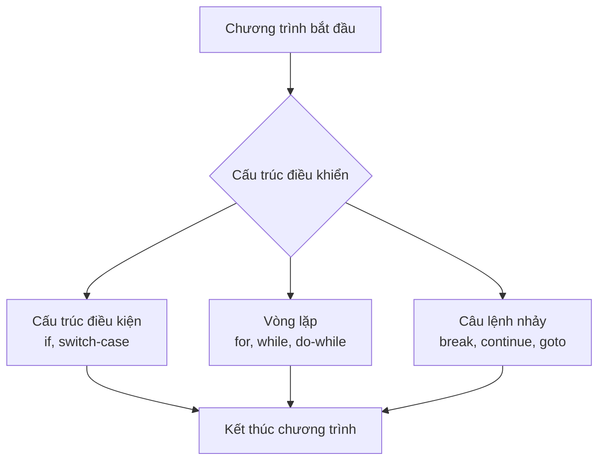
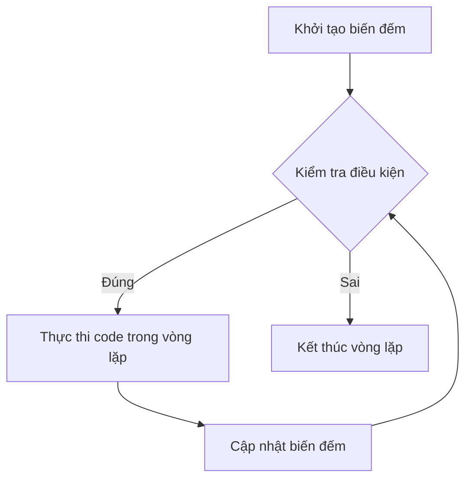
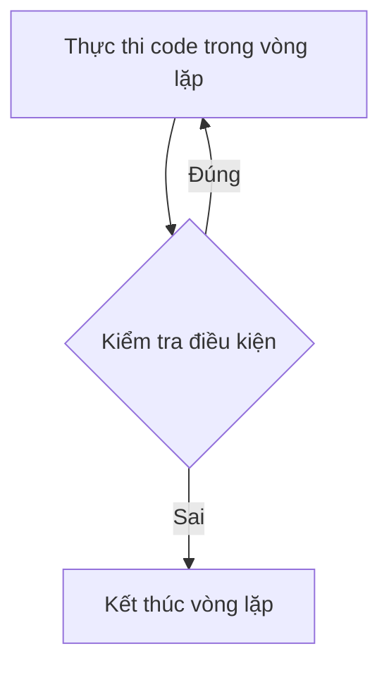
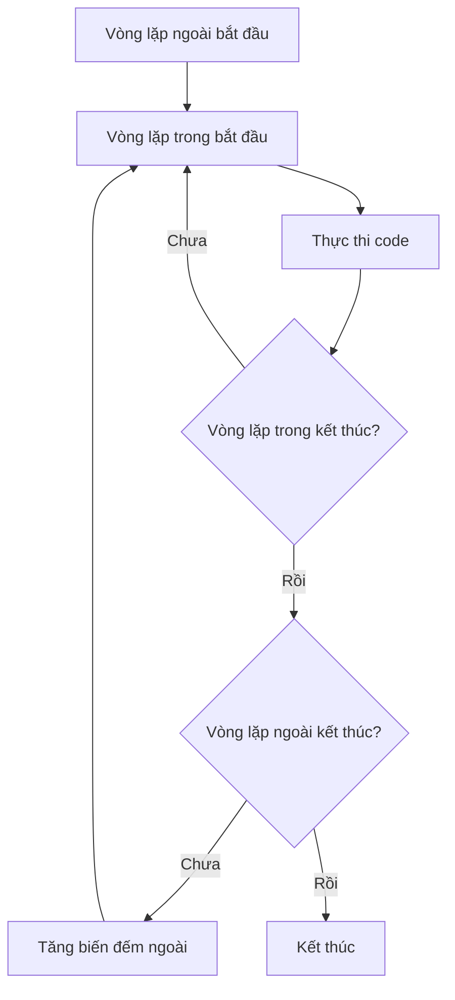

# Bài 4: Cấu trúc điều khiển và vòng lặp

<div className="bg-gradient-to-r from-blue-100 to-indigo-100 p-6 rounded-lg border-l-4 border-blue-500 mb-8">
  <h2 className="text-2xl font-bold text-blue-800 mb-3">🎯 Mục tiêu bài học</h2>
  <ul className="text-blue-700 space-y-2">
    <li>✅ Hiểu và sử dụng thành thạo các cấu trúc điều kiện</li>
    <li>✅ Nắm vững các loại vòng lặp và ứng dụng</li>
    <li>✅ Phân biệt khi nào sử dụng từng loại cấu trúc</li>
    <li>✅ Xây dựng chương trình có logic phức tạp</li>
  </ul>
</div>

## 📚 Tổng quan về cấu trúc điều khiển

Cấu trúc điều khiển (Control Structures) là những công cụ cho phép chúng ta **điều khiển luồng thực thi** của chương trình. Thay vì thực thi tuần tự từ trên xuống dưới, chúng ta có thể:

- **Rẽ nhánh**: Thực thi các đoạn code khác nhau dựa trên điều kiện
- **Lặp lại**: Thực thi một đoạn code nhiều lần
- **Nhảy**: Chuyển điều khiển đến vị trí khác trong chương trình



---

## 1️⃣ Cấu trúc điều kiện

### 🔍 Câu lệnh if

Câu lệnh `if` là cấu trúc điều kiện cơ bản nhất, cho phép thực thi code khi một điều kiện được thỏa mãn.

<div className="bg-gray-50 p-4 rounded-lg border-l-4 border-green-500 my-4">
  <h4 className="font-bold text-green-700">💡 Cú pháp cơ bản:</h4>
</div>

```cpp
if (điều_kiện) {
    // Code thực thi khi điều kiện đúng
}
```

**Ví dụ thực tế:**

```cpp
#include <iostream>
using namespace std;

int main() {
    int tuoi;
    cout << "Nhập tuổi của bạn: ";
    cin >> tuoi;
    
    if (tuoi >= 18) {
        cout << "Bạn đã đủ tuổi bầu cử!" << endl;
    }
    
    return 0;
}
```

### 🔍 Câu lệnh if-else

Cấu trúc `if-else` cho phép thực thi code khác nhau tùy thuộc vào điều kiện.

```cpp
if (điều_kiện) {
    // Code khi điều kiện đúng
} else {
    // Code khi điều kiện sai
}
```

**Ví dụ:**

```cpp
int diem;
cout << "Nhập điểm kiểm tra: ";
cin >> diem;

if (diem >= 5) {
    cout << "Bạn đã đậu!" << endl;
} else {
    cout << "Bạn cần học thêm!" << endl;
}
```

### 🔍 Câu lệnh if-else if-else

Để xử lý nhiều điều kiện, chúng ta sử dụng chuỗi `if-else if-else`.

```cpp
if (điều_kiện_1) {
    // Code cho điều kiện 1
} else if (điều_kiện_2) {
    // Code cho điều kiện 2
} else if (điều_kiện_3) {
    // Code cho điều kiện 3
} else {
    // Code mặc định
}
```

**Ví dụ phân loại điểm:**

```cpp
int diem;
cout << "Nhập điểm: ";
cin >> diem;

if (diem >= 9) {
    cout << "Xuất sắc" << endl;
} else if (diem >= 8) {
    cout << "Giỏi" << endl;
} else if (diem >= 6.5) {
    cout << "Khá" << endl;
} else if (diem >= 5) {
    cout << "Trung bình" << endl;
} else {
    cout << "Yếu" << endl;
}
```

### 📊 Bảng so sánh các loại điều kiện

| Loại điều kiện | Khi nào sử dụng | Ưu điểm | Nhược điểm |
|----------------|-----------------|---------|------------|
| `if` đơn | Kiểm tra 1 điều kiện | Đơn giản, rõ ràng | Không xử lý được trường hợp khác |
| `if-else` | 2 lựa chọn | Bao phủ tất cả trường hợp | Chỉ xử lý được 2 trường hợp |
| `if-else if-else` | Nhiều lựa chọn | Linh hoạt, dễ đọc | Có thể dài và phức tạp |
| `switch-case` | Nhiều giá trị cụ thể | Nhanh, gọn gàng | Chỉ so sánh bằng với hằng số |

---

## 2️⃣ Cấu trúc switch-case

### 🔍 Giới thiệu switch-case

`switch-case` là một cấu trúc điều kiện đặc biệt, hiệu quả khi cần so sánh một biến với nhiều giá trị cụ thể.

<div className="bg-yellow-50 p-4 rounded-lg border-l-4 border-yellow-500 my-4">
  <h4 className="font-bold text-yellow-700">⚠️ Lưu ý quan trọng:</h4>
  <p className="text-yellow-600">switch chỉ hoạt động với kiểu dữ liệu nguyên (int, char) và enum. Không thể sử dụng với float, double, hay string.</p>
</div>

**Cú pháp:**

```cpp
switch (biến_hoặc_biểu_thức) {
    case giá_trị_1:
        // Code cho trường hợp 1
        break;
    case giá_trị_2:
        // Code cho trường hợp 2
        break;
    default:
        // Code mặc định
        break;
}
```

**Ví dụ menu lựa chọn:**

```cpp
#include <iostream>
using namespace std;

int main() {
    int lua_chon;
    
    cout << "=== MENU TÍNH TOÁN ===" << endl;
    cout << "1. Cộng" << endl;
    cout << "2. Trừ" << endl;
    cout << "3. Nhân" << endl;
    cout << "4. Chia" << endl;
    cout << "Nhập lựa chọn: ";
    cin >> lua_chon;
    
    int a, b;
    cout << "Nhập hai số: ";
    cin >> a >> b;
    
    switch (lua_chon) {
        case 1:
            cout << "Kết quả: " << a + b << endl;
            break;
        case 2:
            cout << "Kết quả: " << a - b << endl;
            break;
        case 3:
            cout << "Kết quả: " << a * b << endl;
            break;
        case 4:
            if (b != 0) {
                cout << "Kết quả: " << (float)a / b << endl;
            } else {
                cout << "Lỗi: Không thể chia cho 0!" << endl;
            }
            break;
        default:
            cout << "Lựa chọn không hợp lệ!" << endl;
            break;
    }
    
    return 0;
}
```

### 🔍 Từ khóa break trong switch-case

<div className="bg-red-50 p-4 rounded-lg border-l-4 border-red-500 my-4">
  <h4 className="font-bold text-red-700">⚠️ Hiện tượng Fall-through:</h4>
  <p className="text-red-600">Nếu không có <code>break</code>, chương trình sẽ tiếp tục thực thi các case phía dưới!</p>
</div>

**Ví dụ fall-through có ích:**

```cpp
char grade;
cout << "Nhập xếp loại (A, B, C, D, F): ";
cin >> grade;

switch (grade) {
    case 'A':
    case 'a':
        cout << "Xuất sắc! Điểm từ 90-100" << endl;
        break;
    case 'B':
    case 'b':
        cout << "Giỏi! Điểm từ 80-89" << endl;
        break;
    case 'C':
    case 'c':
        cout << "Khá! Điểm từ 70-79" << endl;
        break;
    case 'D':
    case 'd':
        cout << "Trung bình! Điểm từ 60-69" << endl;
        break;
    case 'F':
    case 'f':
        cout << "Yếu! Điểm dưới 60" << endl;
        break;
    default:
        cout << "Xếp loại không hợp lệ!" << endl;
}
```

---

## 3️⃣ Vòng lặp (Loops)

### 🔄 Vòng lặp for

Vòng lặp `for` thường được sử dụng khi chúng ta biết trước số lần lặp.

**Cú pháp:**

```cpp
for (khởi_tạo; điều_kiện; cập_nhật) {
    // Code thực thi trong mỗi lần lặp
}
```



**Ví dụ cơ bản:**

```cpp
// In số từ 1 đến 10
for (int i = 1; i <= 10; i++) {
    cout << i << " ";
}
cout << endl;
```

**Ví dụ nâng cao - Tính giai thừa:**

```cpp
#include <iostream>
using namespace std;

int main() {
    int n;
    cout << "Nhập n để tính n!: ";
    cin >> n;
    
    long long giai_thua = 1;
    
    for (int i = 1; i <= n; i++) {
        giai_thua *= i;
    }
    
    cout << n << "! = " << giai_thua << endl;
    return 0;
}
```

### 🔄 Vòng lặp while

Vòng lặp `while` thực thi khi điều kiện còn đúng. Phù hợp khi không biết chính xác số lần lặp.

**Cú pháp:**

```cpp
while (điều_kiện) {
    // Code thực thi
    // Cần có cách để thay đổi điều kiện
}
```

**Ví dụ đoán số:**

```cpp
#include <iostream>
#include <cstdlib>
#include <ctime>
using namespace std;

int main() {
    srand(time(0)); // Khởi tạo random seed
    int so_bi_mat = rand() % 100 + 1; // Số từ 1-100
    int doan;
    int so_lan_doan = 0;
    
    cout << "Tôi đã nghĩ ra một số từ 1-100. Hãy đoán!" << endl;
    
    while (true) {
        cout << "Nhập số dự đoán: ";
        cin >> doan;
        so_lan_doan++;
        
        if (doan == so_bi_mat) {
            cout << "Chính xác! Bạn đã đoán đúng sau " 
                 << so_lan_doan << " lần." << endl;
            break;
        } else if (doan < so_bi_mat) {
            cout << "Số bạn đoán nhỏ hơn!" << endl;
        } else {
            cout << "Số bạn đoán lớn hơn!" << endl;
        }
    }
    
    return 0;
}
```

### 🔄 Vòng lặp do-while

Vòng lặp `do-while` đảm bảo code được thực thi **ít nhất một lần** trước khi kiểm tra điều kiện.

**Cú pháp:**

```cpp
do {
    // Code thực thi
} while (điều_kiện);
```



**Ví dụ menu chương trình:**

```cpp
#include <iostream>
using namespace std;

int main() {
    int lua_chon;
    
    do {
        cout << "\n=== MENU CHÍNH ===" << endl;
        cout << "1. Xem thông tin" << endl;
        cout << "2. Thêm dữ liệu" << endl;
        cout << "3. Xóa dữ liệu" << endl;
        cout << "0. Thoát" << endl;
        cout << "Lựa chọn của bạn: ";
        cin >> lua_chon;
        
        switch (lua_chon) {
            case 1:
                cout << "Hiển thị thông tin..." << endl;
                break;
            case 2:
                cout << "Thêm dữ liệu mới..." << endl;
                break;
            case 3:
                cout << "Xóa dữ liệu..." << endl;
                break;
            case 0:
                cout << "Tạm biệt!" << endl;
                break;
            default:
                cout << "Lựa chọn không hợp lệ!" << endl;
        }
    } while (lua_chon != 0);
    
    return 0;
}
```

### 📊 So sánh các loại vòng lặp

| Loại vòng lặp | Kiểm tra điều kiện | Khi nào sử dụng | Ví dụ điển hình |
|---------------|-------------------|-----------------|-----------------|
| `for` | Trước mỗi lần lặp | Biết chính xác số lần lặp | Duyệt mảng, đếm từ 1-n |
| `while` | Trước mỗi lần lặp | Không biết số lần lặp | Đọc dữ liệu đến khi hết |
| `do-while` | Sau mỗi lần lặp | Cần thực thi ít nhất 1 lần | Menu, nhập liệu có kiểm tra |

---

## 4️⃣ Câu lệnh điều khiển vòng lặp

### 🚫 Câu lệnh break

`break` được sử dụng để **thoát khỏi vòng lặp** ngay lập tức.

```cpp
for (int i = 1; i <= 10; i++) {
    if (i == 5) {
        break; // Thoát vòng lặp khi i = 5
    }
    cout << i << " ";
}
// Output: 1 2 3 4
```

**Ví dụ tìm kiếm trong mảng:**

```cpp
int mang[] = {10, 25, 30, 45, 50};
int tim_kiem = 30;
bool tim_thay = false;

for (int i = 0; i < 5; i++) {
    if (mang[i] == tim_kiem) {
        cout << "Tìm thấy " << tim_kiem 
             << " tại vị trí " << i << endl;
        tim_thay = true;
        break; // Thoát ngay khi tìm thấy
    }
}

if (!tim_thay) {
    cout << "Không tìm thấy " << tim_kiem << endl;
}
```

### ⏭️ Câu lệnh continue

`continue` **bỏ qua lần lặp hiện tại** và chuyển đến lần lặp tiếp theo.

```cpp
for (int i = 1; i <= 10; i++) {
    if (i % 2 == 0) {
        continue; // Bỏ qua số chẵn
    }
    cout << i << " ";
}
// Output: 1 3 5 7 9
```

**Ví dụ tính tổng số lẻ:**

```cpp
int tong = 0;
for (int i = 1; i <= 100; i++) {
    if (i % 2 == 0) {
        continue; // Bỏ qua số chẵn
    }
    tong += i;
}
cout << "Tổng các số lẻ từ 1-100: " << tong << endl;
```

### 🔄 Câu lệnh goto

<div className="bg-orange-50 p-4 rounded-lg border-l-4 border-orange-500 my-4">
  <h4 className="font-bold text-orange-700">⚠️ Lưu ý về goto:</h4>
  <p className="text-orange-600">goto thường được coi là không tốt cho cấu trúc code. Chỉ sử dụng trong trường hợp đặc biệt!</p>
</div>

```cpp
#include <iostream>
using namespace std;

int main() {
    int lua_chon;
    
menu:
    cout << "1. Tính toán" << endl;
    cout << "2. Thoát" << endl;
    cout << "Nhập lựa chọn: ";
    cin >> lua_chon;
    
    if (lua_chon == 1) {
        cout << "Thực hiện tính toán..." << endl;
        goto menu; // Quay lại menu
    } else if (lua_chon == 2) {
        cout << "Tạm biệt!" << endl;
    } else {
        cout << "Lựa chọn không hợp lệ!" << endl;
        goto menu; // Quay lại menu
    }
    
    return 0;
}
```

---

## 5️⃣ Vòng lặp lồng nhau

### 🔍 Khái niệm

Vòng lặp lồng nhau (Nested Loops) là khi một vòng lặp nằm bên trong vòng lặp khác.



**Ví dụ in bảng cửu chương:**

```cpp
#include <iostream>
using namespace std;

int main() {
    cout << "=== BẢNG CỬU CHƯƠNG ===" << endl;
    
    for (int i = 1; i <= 9; i++) {
        cout << "\nBảng nhân " << i << ":" << endl;
        for (int j = 1; j <= 10; j++) {
            cout << i << " x " << j << " = " << (i * j) << endl;
        }
    }
    
    return 0;
}
```

**Ví dụ vẽ hình tam giác:**

```cpp
#include <iostream>
using namespace std;

int main() {
    int hang = 5;
    
    // Tam giác sao
    for (int i = 1; i <= hang; i++) {
        for (int j = 1; j <= i; j++) {
            cout << "* ";
        }
        cout << endl;
    }
    
    return 0;
}
/* Output:
* 
* * 
* * * 
* * * * 
* * * * * 
*/
```

### 🎯 Ứng dụng thực tế - Ma trận

```cpp
#include <iostream>
using namespace std;

int main() {
    const int HANG = 3;
    const int COT = 3;
    int ma_tran[HANG][COT];
    
    // Nhập ma trận
    cout << "Nhập ma trận " << HANG << "x" << COT << ":" << endl;
    for (int i = 0; i < HANG; i++) {
        for (int j = 0; j < COT; j++) {
            cout << "Phần tử [" << i << "][" << j << "]: ";
            cin >> ma_tran[i][j];
        }
    }
    
    // In ma trận
    cout << "\nMa trận đã nhập:" << endl;
    for (int i = 0; i < HANG; i++) {
        for (int j = 0; j < COT; j++) {
            cout << ma_tran[i][j] << "\t";
        }
        cout << endl;
    }
    
    return 0;
}
```

---

## 6️⃣ Tối ưu hóa và Best Practices

<div className="bg-green-50 p-4 rounded-lg border-l-4 border-green-500 my-4">
  <h4 className="font-bold text-green-700">✨ Nguyên tắc tối ưu hóa:</h4>
  <ul className="text-green-600 space-y-1">
    <li>• Chọn vòng lặp phù hợp với bài toán</li>
    <li>• Tránh tính toán không cần thiết trong vòng lặp</li>
    <li>• Sử dụng break và continue một cách hợp lý</li>
    <li>• Hạn chế sử dụng goto</li>
  </ul>
</div>

### 📋 Bảng chọn lựa cấu trúc điều khiển

| Tình huống | Nên sử dụng | Lý do |
|------------|-------------|--------|
| Kiểm tra một điều kiện | `if` | Đơn giản, rõ ràng |
| Chọn 1 trong 2 | `if-else` | Bao phủ tất cả trường hợp |
| Chọn 1 trong nhiều điều kiện | `if-else if-else` | Linh hoạt với điều kiện phức tạp |
| So sánh với nhiều giá trị cố định | `switch-case` | Hiệu quả, dễ đọc |
| Biết số lần lặp | `for` | Kiểm soát tốt, code gọn |
| Không biết số lần lặp | `while` | Linh hoạt với điều kiện |
| Phải thực thi ít nhất 1 lần | `do-while` | Đảm bảo thực thi |

---

## 🏆 Bài tập thực hành

### Bài tập 1: Máy tính đơn giản (Dễ)

Viết chương trình máy tính với menu lựa chọn, cho phép người dùng thực hiện các phép toán cơ bản và quay lại menu sau mỗi phép tính.

<details>
<summary>💡 Gợi ý</summary>

- Sử dụng `do-while` cho menu chính
- Sử dụng `switch-case` cho lựa chọn phép toán
- Xử lý trường hợp chia cho 0

</details>

### Bài tập 2: In hình và đếm (Trung bình)

Viết chương trình in ra các hình sau và đếm số ký tự đã in:

1. Hình vuông rỗng (n x n)
2. Tam giác cân
3. Hình thoi

### Bài tập 3: Trò chơi đoán số nâng cao (Khó)

Mở rộng trò chơi đoán số với các tính năng:

- Cho phép chọn khoảng số (VD: 1-50, 1-100, 1-1000)
- Hiển thị thống kê (số lần chơi, điểm trung bình)
- Có gợi ý "nóng/lạnh" dựa trên khoảng cách
- Lưu điểm cao nhất

---

## 📝 Tóm tắt bài học

<div className="bg-blue-50 p-6 rounded-lg border border-blue-200">
  <h3 className="text-xl font-bold text-blue-800 mb-4">🎯 Kiến thức đã học:</h3>
  
  <div className="grid grid-cols-1 md:grid-cols-2 gap-4">
    <div className="bg-white p-4 rounded border">
      <h4 className="font-bold text-blue-700">Cấu trúc điều kiện</h4>
      <ul className="text-sm text-gray-600 mt-2">
        <li>• if, if-else, if-else if-else</li>
        <li>• switch-case và fall-through</li>
        <li>• Khi nào sử dụng từng loại</li>
      </ul>
    </div>
    
    <div className="bg-white p-4 rounded border">
      <h4 className="font-bold text-blue-700">Vòng lặp</h4>
      <ul className="text-sm text-gray-600 mt-2">
        <li>• for, while, do-while</li>
        <li>• Vòng lặp lồng nhau</li>
        <li>• break, continue, goto</li>
      </ul>
    </div>
  </div>
</div>

<div className="bg-purple-50 p-4 rounded-lg border-l-4 border-purple-500 mt-6">
  <h4 className="font-bold text-purple-700">🚀 Chuẩn bị cho bài tiếp theo:</h4>
  <p className="text-purple-600">Bài 5 sẽ học về <strong>Hàm và phạm vi biến</strong> - nơi chúng ta sẽ tìm hiểu cách tổ chức code thành các khối có thể tái sử dụng!</p>
</div>

---

<div className="text-center mt-8 p-4 bg-gradient-to-r from-indigo-500 to-purple-600 text-white rounded-lg">
  <h2 className="text-2xl font-bold">🎉 Chúc mừng!</h2>
  <p className="mt-2">Bạn đã hoàn thành Bài 4: Cấu trúc điều khiển và vòng lặp</p>
  <p className="text-sm opacity-90">Hãy thực hành các bài tập để củng cố kiến thức!</p>
</div>

---

## 🔧 Code mẫu hoàn chỉnh

### Chương trình Menu tổng hợp

```cpp
#include <iostream>
#include <iomanip>
#include <cstdlib>
#include <ctime>
using namespace std;

class MenuTinhToan {
private:
    double a, b;
    
public:
    void nhapSoLieu() {
        cout << "Nhập số thứ nhất: ";
        cin >> a;
        cout << "Nhập số thứ hai: ";
        cin >> b;
    }
    
    void hienThiMenuChinh() {
        cout << "\n╔══════════════════════════════╗" << endl;
        cout << "║       MENU TÍNH TOÁN         ║" << endl;
        cout << "╠══════════════════════════════╣" << endl;
        cout << "║ 1. Các phép toán cơ bản      ║" << endl;
        cout << "║ 2. Trò chơi đoán số          ║" << endl;
        cout << "║ 3. Vẽ hình                   ║" << endl;
        cout << "║ 4. Bảng cửu chương           ║" << endl;
        cout << "║ 0. Thoát chương trình        ║" << endl;
        cout << "╚══════════════════════════════╝" << endl;
        cout << "Lựa chọn của bạn: ";
    }
    
    void menuPhepToan() {
        nhapSoLieu();
        int phepToan;
        
        do {
            cout << "\n--- PHÉP TOÁN ---" << endl;
            cout << "1. Cộng (+)" << endl;
            cout << "2. Trừ (-)" << endl;
            cout << "3. Nhân (×)" << endl;
            cout << "4. Chia (÷)" << endl;
            cout << "5. Chia lấy dư (%)" << endl;
            cout << "0. Quay lại menu chính" << endl;
            cout << "Chọn phép toán: ";
            cin >> phepToan;
            
            switch (phepToan) {
                case 1:
                    cout << fixed << setprecision(2);
                    cout << a << " + " << b << " = " << (a + b) << endl;
                    break;
                case 2:
                    cout << fixed << setprecision(2);
                    cout << a << " - " << b << " = " << (a - b) << endl;
                    break;
                case 3:
                    cout << fixed << setprecision(2);
                    cout << a << " × " << b << " = " << (a * b) << endl;
                    break;
                case 4:
                    if (b != 0) {
                        cout << fixed << setprecision(2);
                        cout << a << " ÷ " << b << " = " << (a / b) << endl;
                    } else {
                        cout << "❌ Lỗi: Không thể chia cho 0!" << endl;
                    }
                    break;
                case 5:
                    if (b != 0 && (int)a == a && (int)b == b) {
                        cout << (int)a << " % " << (int)b << " = " 
                             << ((int)a % (int)b) << endl;
                    } else {
                        cout << "❌ Phép chia dư chỉ áp dụng cho số nguyên!" << endl;
                    }
                    break;
                case 0:
                    cout << "🔙 Quay lại menu chính..." << endl;
                    break;
                default:
                    cout << "❌ Lựa chọn không hợp lệ!" << endl;
            }
            
            if (phepToan != 0) {
                cout << "\nNhấn Enter để tiếp tục...";
                cin.ignore();
                cin.get();
            }
            
        } while (phepToan != 0);
    }
    
    void troChoiDoanSo() {
        srand(time(0));
        int soBiMat, doanSo, soLanDoan, khoang;
        
        cout << "\n🎮 TRÒ CHƠI ĐOÁN SỐ 🎮" << endl;
        cout << "Chọn độ khó:" << endl;
        cout << "1. Dễ (1-10)" << endl;
        cout << "2. Trung bình (1-50)" << endl;
        cout << "3. Khó (1-100)" << endl;
        cout << "Lựa chọn: ";
        cin >> khoang;
        
        int maxSo;
        switch (khoang) {
            case 1: maxSo = 10; break;
            case 2: maxSo = 50; break;
            case 3: maxSo = 100; break;
            default: maxSo = 10; break;
        }
        
        soBiMat = rand() % maxSo + 1;
        soLanDoan = 0;
        
        cout << "🤔 Tôi đã nghĩ ra một số từ 1 đến " << maxSo << endl;
        cout << "Hãy đoán xem đó là số nào!" << endl;
        
        while (true) {
            cout << "\nNhập số dự đoán: ";
            cin >> doanSo;
            soLanDoan++;
            
            if (doanSo == soBiMat) {
                cout << "🎉 CHÍNH XÁC! Bạn đã đoán đúng!" << endl;
                cout << "🏆 Số lần đoán: " << soLanDoan << endl;
                
                if (soLanDoan <= 3) {
                    cout << "⭐ Xuất sắc!" << endl;
                } else if (soLanDoan <= 5) {
                    cout << "👍 Tốt lắm!" << endl;
                } else {
                    cout << "💪 Cố gắng hơn lần sau!" << endl;
                }
                break;
            } else if (doanSo < soBiMat) {
                int khoangCach = soBiMat - doanSo;
                cout << "📈 Số bạn đoán NHỎ HỌN!";
                if (khoangCach <= 5) {
                    cout << " (Rất gần rồi! 🔥)" << endl;
                } else if (khoangCach <= 10) {
                    cout << " (Gần rồi! 🌡️)" << endl;
                } else {
                    cout << " (Còn xa! ❄️)" << endl;
                }
            } else {
                int khoangCach = doanSo - soBiMat;
                cout << "📉 Số bạn đoán LỚN HỌN!";
                if (khoangCach <= 5) {
                    cout << " (Rất gần rồi! 🔥)" << endl;
                } else if (khoangCach <= 10) {
                    cout << " (Gần rồi! 🌡️)" << endl;
                } else {
                    cout << " (Còn xa! ❄️)" << endl;
                }
            }
        }
        
        cout << "\nNhấn Enter để tiếp tục...";
        cin.ignore();
        cin.get();
    }
    
    void menuVeHinh() {
        int luaChon, kichThuoc;
        
        do {
            cout << "\n🎨 MENU VẼ HÌNH 🎨" << endl;
            cout << "1. Hình vuông rỗng" << endl;
            cout << "2. Tam giác vuông" << endl;
            cout << "3. Tam giác cân" << endl;
            cout << "4. Hình thoi" << endl;
            cout << "0. Quay lại menu chính" << endl;
            cout << "Lựa chọn: ";
            cin >> luaChon;
            
            if (luaChon >= 1 && luaChon <= 4) {
                cout << "Nhập kích thước: ";
                cin >> kichThuoc;
                cout << endl;
            }
            
            switch (luaChon) {
                case 1:
                    veHinhVuongRong(kichThuoc);
                    break;
                case 2:
                    veTamGiacVuong(kichThuoc);
                    break;
                case 3:
                    veTamGiacCan(kichThuoc);
                    break;
                case 4:
                    veHinhThoi(kichThuoc);
                    break;
                case 0:
                    cout << "🔙 Quay lại menu chính..." << endl;
                    break;
                default:
                    cout << "❌ Lựa chọn không hợp lệ!" << endl;
            }
            
            if (luaChon != 0) {
                cout << "\nNhấn Enter để tiếp tục...";
                cin.ignore();
                cin.get();
            }
            
        } while (luaChon != 0);
    }
    
    void veHinhVuongRong(int n) {
        cout << "▭ Hình vuông rỗng " << n << "×" << n << ":" << endl;
        for (int i = 0; i < n; i++) {
            for (int j = 0; j < n; j++) {
                if (i == 0 || i == n-1 || j == 0 || j == n-1) {
                    cout << "* ";
                } else {
                    cout << "  ";
                }
            }
            cout << endl;
        }
    }
    
    void veTamGiacVuong(int n) {
        cout << "▲ Tam giác vuông:" << endl;
        for (int i = 1; i <= n; i++) {
            for (int j = 1; j <= i; j++) {
                cout << "* ";
            }
            cout << endl;
        }
    }
    
    void veTamGiacCan(int n) {
        cout << "🔺 Tam giác cân:" << endl;
        for (int i = 1; i <= n; i++) {
            // In khoảng trắng
            for (int j = 1; j <= n - i; j++) {
                cout << " ";
            }
            // In dấu sao
            for (int j = 1; j <= 2 * i - 1; j++) {
                cout << "*";
            }
            cout << endl;
        }
    }
    
    void veHinhThoi(int n) {
        cout << "♦️ Hình thoi:" << endl;
        
        // Nửa trên
        for (int i = 1; i <= n; i++) {
            for (int j = 1; j <= n - i; j++) {
                cout << " ";
            }
            for (int j = 1; j <= 2 * i - 1; j++) {
                cout << "*";
            }
            cout << endl;
        }
        
        // Nửa dưới
        for (int i = n - 1; i >= 1; i--) {
            for (int j = 1; j <= n - i; j++) {
                cout << " ";
            }
            for (int j = 1; j <= 2 * i - 1; j++) {
                cout << "*";
            }
            cout << endl;
        }
    }
    
    void bangCuuChương() {
        cout << "\n📚 BẢNG CỬU CHƯƠNG 📚" << endl;
        cout << "Chọn cách hiển thị:" << endl;
        cout << "1. Tất cả bảng (1-9)" << endl;
        cout << "2. Một bảng cụ thể" << endl;
        cout << "3. Bảng ngang (compact)" << endl;
        cout << "Lựa chọn: ";
        
        int luaChon;
        cin >> luaChon;
        
        switch (luaChon) {
            case 1:
                hienThiTatCaBang();
                break;
            case 2: {
                int so;
                cout << "Nhập số (1-9): ";
                cin >> so;
                if (so >= 1 && so <= 9) {
                    hienThiMotBang(so);
                } else {
                    cout << "❌ Số không hợp lệ!" << endl;
                }
                break;
            }
            case 3:
                hienThiBangNgang();
                break;
            default:
                cout << "❌ Lựa chọn không hợp lệ!" << endl;
        }
        
        cout << "\nNhấn Enter để tiếp tục...";
        cin.ignore();
        cin.get();
    }
    
    void hienThiTatCaBang() {
        for (int i = 1; i <= 9; i++) {
            cout << "\n--- Bảng nhân " << i << " ---" << endl;
            for (int j = 1; j <= 10; j++) {
                cout << i << " × " << setw(2) << j << " = " 
                     << setw(2) << (i * j) << endl;
            }
        }
    }
    
    void hienThiMotBang(int so) {
        cout << "\n--- Bảng nhân " << so << " ---" << endl;
        for (int i = 1; i <= 10; i++) {
            cout << so << " × " << setw(2) << i << " = " 
                 << setw(2) << (so * i) << endl;
        }
    }
    
    void hienThiBangNgang() {
        cout << "\n📊 BẢNG CỬU CHƯƠNG TỔNG HỢP" << endl;
        cout << "     ";
        for (int j = 1; j <= 9; j++) {
            cout << setw(4) << j;
        }
        cout << endl;
        cout << "   ┌";
        for (int j = 1; j <= 9; j++) {
            cout << "────";
        }
        cout << endl;
        
        for (int i = 1; i <= 9; i++) {
            cout << setw(2) << i << " │";
            for (int j = 1; j <= 9; j++) {
                cout << setw(4) << (i * j);
            }
            cout << endl;
        }
    }
};

int main() {
    MenuTinhToan menu;
    int luaChon;
    
    cout << "🌟 Chào mừng bạn đến với chương trình C++! 🌟" << endl;
    
    do {
        menu.hienThiMenuChinh();
        cin >> luaChon;
        
        switch (luaChon) {
            case 1:
                menu.menuPhepToan();
                break;
            case 2:
                menu.troChoiDoanSo();
                break;
            case 3:
                menu.menuVeHinh();
                break;
            case 4:
                menu.bangCuuChương();
                break;
            case 0:
                cout << "\n🎉 Cảm ơn bạn đã sử dụng chương trình!" << endl;
                cout << "👋 Hẹn gặp lại! 👋" << endl;
                break;
            default:
                cout << "❌ Lựa chọn không hợp lệ! Vui lòng thử lại." << endl;
        }
        
    } while (luaChon != 0);
    
    return 0;
}
```

---

## 🧠 Câu hỏi ôn tập

<div className="bg-gray-50 p-4 rounded-lg border border-gray-200 my-4">

### Câu hỏi trắc nghiệm

**1. Điều gì xảy ra nếu quên `break` trong `switch-case`?**
- A) Chương trình báo lỗi
- B) Chỉ thực thi case đầu tiên
- C) Thực thi tất cả case phía dưới (fall-through)
- D) Chương trình dừng

**2. Vòng lặp nào đảm bảo thực thi ít nhất một lần?**
- A) for
- B) while  
- C) do-while
- D) Cả A và B

**3. Khi nào nên sử dụng `continue`?**
- A) Để thoát khỏi vòng lặp
- B) Để bỏ qua lần lặp hiện tại
- C) Để khởi động lại vòng lặp
- D) Để dừng chương trình

</div>

### Câu hỏi tự luận

<div className="bg-blue-50 p-4 rounded-lg border-l-4 border-blue-400 my-4">

**1. Giải thích sự khác biệt giữa `while` và `do-while` với ví dụ cụ thể.**

**2. Khi nào nên sử dụng `switch-case` thay vì `if-else if`? Đưa ra ví dụ minh họa.**

**3. Phân tích độ phức tạp thời gian của vòng lặp lồng nhau 3 tầng.**

</div>

---

## 🎯 Thử thách nâng cao

### 🔥 Challenge 1: Pattern Master
Viết chương trình vẽ pattern sau:
```
    1
   121
  12321
 1234321
123454321
```

### 🔥 Challenge 2: Prime Number Generator
Viết chương trình tìm và in ra tất cả số nguyên tố trong khoảng từ 1 đến n (sử dụng thuật toán Sieve of Eratosthenes).

### 🔥 Challenge 3: ASCII Art Generator
Tạo chương trình vẽ chữ ASCII art từ input của người dùng.

---

## 📚 Tài liệu tham khảo

<div className="bg-purple-50 p-4 rounded-lg border border-purple-200">

### 📖 Đọc thêm
- **C++ Primer** - Stanley Lippman: Chương 5 (Statements)
- **cppreference.com**: [Control flow statements](https://en.cppreference.com/w/cpp/language/statements)
- **GeeksforGeeks**: [C++ Control Statements](https://www.geeksforgeeks.org/decision-making-c-c-else-nested-else/)

### 🔗 Tools hữu ích
- **Online C++ Compiler**: [replit.com](https://replit.com)
- **Code Visualizer**: [pythontutor.com](http://pythontutor.com/cpp.html)
- **Practice Problems**: [hackerrank.com](https://www.hackerrank.com)

</div>

---

<div className="text-center mt-8 p-6 bg-gradient-to-r from-green-400 to-blue-500 text-white rounded-lg shadow-lg">
  <h2 className="text-3xl font-bold mb-2">🎊 Xuất sắc!</h2>
  <p className="text-lg mb-2">Bạn đã nắm vững cấu trúc điều khiển trong C++</p>
  <p className="text-sm opacity-90">Tiếp theo: Bài 5 - Hàm và phạm vi biến 🚀</p>
</div>