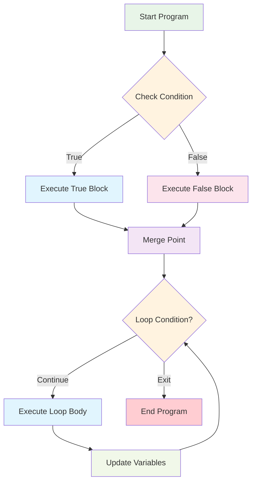
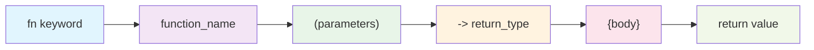
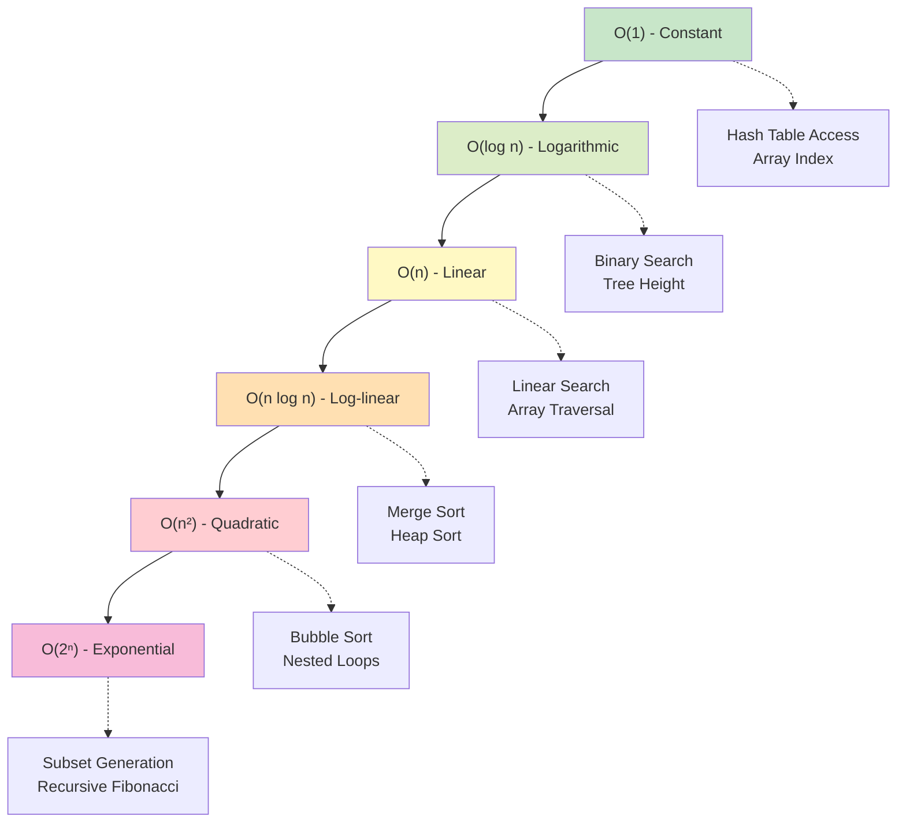

# Bài 1: Programming Fundamentals & Language Selection

<div className="bg-gradient-to-r from-blue-50 to-indigo-50 p-6 rounded-lg border-l-4 border-blue-500 mb-6">
  <h2 className="text-2xl font-bold text-blue-800 mb-2">🎯 Mục tiêu bài học</h2>
  <p className="text-gray-700">Nắm vững các khái niệm lập trình cơ bản và chọn ngôn ngữ phù hợp cho việc học Data Structures & Algorithms</p>
</div>

## 1. Tại sao cần chọn ngôn ngữ lập trình phù hợp?

Việc chọn ngôn ngữ lập trình đóng vai trò quan trọng trong hành trình học DSA. Mỗi ngôn ngữ có những ưu điểm riêng:

### So sánh các ngôn ngữ phổ biến

| Ngôn ngữ | Tốc độ thực thi | Dễ học | Cộng đồng | Phỏng vấn | Memory Safety | Khuyến nghị |
|----------|----------------|---------|-----------|-----------|---------------|-------------|
| **Rust** | ⭐⭐⭐⭐⭐ | ⭐⭐⭐ | ⭐⭐⭐⭐ | ⭐⭐⭐ | ⭐⭐⭐⭐⭐ | **Tốt nhất** |
| Python | ⭐⭐ | ⭐⭐⭐⭐⭐ | ⭐⭐⭐⭐⭐ | ⭐⭐⭐⭐⭐ | ⭐⭐⭐ | Rất tốt |
| Java | ⭐⭐⭐⭐ | ⭐⭐⭐ | ⭐⭐⭐⭐⭐ | ⭐⭐⭐⭐⭐ | ⭐⭐⭐⭐ | Rất tốt |
| C++ | ⭐⭐⭐⭐⭐ | ⭐⭐ | ⭐⭐⭐⭐ | ⭐⭐⭐⭐ | ⭐⭐ | Tốt |
| JavaScript | ⭐⭐⭐ | ⭐⭐⭐⭐ | ⭐⭐⭐⭐⭐ | ⭐⭐⭐ | ⭐⭐ | Tốt |

<div className="bg-green-50 p-4 rounded-lg border border-green-200 my-4">
  <h3 className="text-green-800 font-semibold mb-2">💡 Lý do chọn Rust:</h3>
  <ul className="text-green-700 space-y-1">
    <li>• Hiệu suất cao như C/C++ nhưng an toàn về bộ nhớ</li>
    <li>• Syntax rõ ràng, tránh được nhiều lỗi thường gặp</li>
    <li>• Công cụ phát triển mạnh mẽ (Cargo, rustfmt, clippy)</li>
    <li>• Ngôn ngữ của tương lai, được nhiều công ty lớn sử dụng</li>
  </ul>
</div>

## 2. Cú pháp cơ bản Rust cho DSA

### 2.1 Variables và Data Types

```rust
fn main() {
    // Immutable variables (mặc định)
    let x = 5;
    let name = "Rust DSA";
    
    // Mutable variables
    let mut count = 0;
    count += 1;
    
    // Explicit typing
    let number: i32 = 42;
    let float_num: f64 = 3.14;
    let is_learning: bool = true;
    
    println!("Learning {} with number {}", name, number);
}
```

### 2.2 Collections cơ bản

```rust
fn collections_example() {
    // Vector (dynamic array)
    let mut numbers = vec![1, 2, 3, 4, 5];
    numbers.push(6);
    
    // Array (fixed size)
    let fixed_array: [i32; 5] = [1, 2, 3, 4, 5];
    
    // String
    let mut text = String::from("Hello");
    text.push_str(" World");
    
    println!("Vector: {:?}", numbers);
    println!("Array: {:?}", fixed_array);
    println!("String: {}", text);
}
```

## 3. Cấu trúc điều khiển

### Sơ đồ luồng điều khiển



### 3.1 Conditional Statements

```rust
fn conditional_examples(score: i32) {
    // if-else if-else
    if score >= 90 {
        println!("Grade: A");
    } else if score >= 80 {
        println!("Grade: B");
    } else if score >= 70 {
        println!("Grade: C");
    } else {
        println!("Grade: F");
    }
    
    // match (như switch)
    match score {
        90..=100 => println!("Excellent!"),
        80..=89 => println!("Good!"),
        70..=79 => println!("Average"),
        _ => println!("Need improvement"),
    }
}
```

### 3.2 Loops

| Loop Type | Cú pháp | Khi nào sử dụng |
|-----------|---------|-----------------|
| `loop` | `loop { ... }` | Vòng lặp vô hạn |
| `while` | `while condition { ... }` | Lặp với điều kiện |
| `for` | `for item in collection { ... }` | Duyệt collection |

```rust
fn loop_examples() {
    // For loop với range
    for i in 0..5 {
        println!("Count: {}", i);
    }
    
    // For loop với vector
    let numbers = vec![1, 2, 3, 4, 5];
    for num in &numbers {
        println!("Number: {}", num);
    }
    
    // While loop
    let mut counter = 0;
    while counter < 3 {
        println!("Counter: {}", counter);
        counter += 1;
    }
    
    // Loop với break
    let mut x = 0;
    loop {
        if x >= 5 { break; }
        println!("x = {}", x);
        x += 1;
    }
}
```

## 4. Functions và Parameters

### Cấu trúc function trong Rust



```rust
// Function cơ bản
fn add_numbers(a: i32, b: i32) -> i32 {
    a + b  // implicit return (không có semicolon)
}

// Function với multiple return
fn analyze_number(num: i32) -> (bool, bool, String) {
    let is_positive = num > 0;
    let is_even = num % 2 == 0;
    let description = match (is_positive, is_even) {
        (true, true) => "Positive and even".to_string(),
        (true, false) => "Positive and odd".to_string(),
        (false, true) => "Negative and even".to_string(),
        (false, false) => "Negative and odd".to_string(),
    };
    (is_positive, is_even, description)
}

// Higher-order function
fn apply_operation<F>(numbers: &[i32], operation: F) -> Vec<i32>
where
    F: Fn(i32) -> i32,
{
    numbers.iter().map(|&x| operation(x)).collect()
}

fn main() {
    let result = add_numbers(5, 3);
    println!("5 + 3 = {}", result);
    
    let (pos, even, desc) = analyze_number(-4);
    println!("Number analysis: {} {} - {}", pos, even, desc);
    
    let numbers = vec![1, 2, 3, 4, 5];
    let doubled = apply_operation(&numbers, |x| x * 2);
    println!("Doubled: {:?}", doubled);
}
```

## 5. OOP Basics trong Rust

### 5.1 Structs và Implementation

```rust
// Struct definition
#[derive(Debug, Clone)]
struct Student {
    name: String,
    age: u8,
    grades: Vec<f32>,
}

impl Student {
    // Associated function (constructor)
    fn new(name: String, age: u8) -> Self {
        Student {
            name,
            age,
            grades: Vec::new(),
        }
    }
    
    // Method (takes &self)
    fn add_grade(&mut self, grade: f32) {
        if grade >= 0.0 && grade <= 100.0 {
            self.grades.push(grade);
        }
    }
    
    fn average_grade(&self) -> Option<f32> {
        if self.grades.is_empty() {
            None
        } else {
            let sum: f32 = self.grades.iter().sum();
            Some(sum / self.grades.len() as f32)
        }
    }
    
    fn display_info(&self) {
        println!("Student: {}, Age: {}", self.name, self.age);
        if let Some(avg) = self.average_grade() {
            println!("Average grade: {:.2}", avg);
        } else {
            println!("No grades available");
        }
    }
}
```

### 5.2 Traits (Interfaces)

```rust
// Trait definition
trait Drawable {
    fn draw(&self);
    fn area(&self) -> f64;
}

// Struct implementing trait
struct Circle {
    radius: f64,
}

impl Drawable for Circle {
    fn draw(&self) {
        println!("Drawing a circle with radius {}", self.radius);
    }
    
    fn area(&self) -> f64 {
        std::f64::consts::PI * self.radius * self.radius
    }
}

struct Rectangle {
    width: f64,
    height: f64,
}

impl Drawable for Rectangle {
    fn draw(&self) {
        println!("Drawing a rectangle {}x{}", self.width, self.height);
    }
    
    fn area(&self) -> f64 {
        self.width * self.height
    }
}
```

## 6. Pseudocode và Algorithm Design

<div className="bg-yellow-50 p-4 rounded-lg border border-yellow-200 my-4">
  <h3 className="text-yellow-800 font-semibold mb-2">📝 Tại sao Pseudocode quan trọng?</h3>
  <p className="text-yellow-700">Pseudocode giúp bạn tập trung vào logic thuật toán thay vì cú pháp ngôn ngữ</p>
</div>

### Template Pseudocode chuẩn

| Cấu trúc | Pseudocode | Rust Implementation |
|----------|------------|-------------------|
| **Sequence** | `Step 1`<br />`Step 2`<br />`Step 3` | `statement1;`<br />`statement2;`<br />`statement3;` |
| **Selection** | `IF condition THEN`<br />&nbsp;&nbsp;`action1`<br />`ELSE`<br />&nbsp;&nbsp;`action2`<br />`ENDIF` | `if condition {`<br />&nbsp;&nbsp;`action1;`<br />`} else {`<br />&nbsp;&nbsp;`action2;`<br />`}` |
| **Iteration** | `FOR i = 1 TO n DO`<br />&nbsp;&nbsp;`process(i)`<br />`ENDFOR` | `for i in 1..=n {`<br />&nbsp;&nbsp;`process(i);`<br />`}` |

### Ví dụ: Find Maximum Algorithm

```
ALGORITHM FindMaximum
INPUT: array A of size n
OUTPUT: maximum value in A

BEGIN
    max ← A[0]
    FOR i = 1 TO n-1 DO
        IF A[i] > max THEN
            max ← A[i]
        ENDIF
    ENDFOR
    RETURN max
END
```

**Rust Implementation:**

```rust
fn find_maximum(arr: &[i32]) -> Option<i32> {
    if arr.is_empty() {
        return None;
    }
    
    let mut max = arr[0];
    for &num in &arr[1..] {
        if num > max {
            max = num;
        }
    }
    Some(max)
}

// Test function
fn test_find_maximum() {
    let numbers = vec![3, 7, 2, 9, 1, 5];
    match find_maximum(&numbers) {
        Some(max) => println!("Maximum value: {}", max),
        None => println!("Array is empty"),
    }
}
```

## 7. Complexity Analysis Preview

### Time Complexity Comparison



| Complexity | Tên gọi | Ví dụ thuật toán | Performance (n=1000) |
|------------|---------|------------------|---------------------|
| O(1) | Constant | Array access | 1 step |
| O(log n) | Logarithmic | Binary search | ~10 steps |
| O(n) | Linear | Linear search | 1,000 steps |
| O(n log n) | Log-linear | Merge sort | ~10,000 steps |
| O(n²) | Quadratic | Bubble sort | 1,000,000 steps |

## 8. Bài tập thực hành

<div className="bg-blue-50 p-4 rounded-lg border border-blue-200 my-4">
  <h3 className="text-blue-800 font-semibold mb-3">🏋️ Bài tập cơ bản</h3>
  
  <div className="space-y-3">
    <div className="bg-white p-3 rounded border-l-4 border-blue-400">
      <h4 className="font-medium text-gray-800">Bài 1: Temperature Converter</h4>
      <p className="text-sm text-gray-600">Viết chương trình chuyển đổi nhiệt độ giữa Celsius, Fahrenheit và Kelvin</p>
    </div>
    
    <div className="bg-white p-3 rounded border-l-4 border-green-400">
      <h4 className="font-medium text-gray-800">Bài 2: Grade Calculator</h4>
      <p className="text-sm text-gray-600">Tính điểm trung bình và xếp loại học lực từ một danh sách điểm số</p>
    </div>
    
    <div className="bg-white p-3 rounded border-l-4 border-purple-400">
      <h4 className="font-medium text-gray-800">Bài 3: Number Pattern</h4>
      <p className="text-sm text-gray-600">In ra các pattern số như tam giác Pascal, Fibonacci sequence</p>
    </div>
  </div>
</div>

### Bài tập mẫu: Simple Calculator

```rust
use std::io;

struct Calculator;

impl Calculator {
    fn add(a: f64, b: f64) -> f64 { a + b }
    fn subtract(a: f64, b: f64) -> f64 { a - b }
    fn multiply(a: f64, b: f64) -> f64 { a * b }
    fn divide(a: f64, b: f64) -> Result<f64, String> {
        if b == 0.0 {
            Err("Division by zero!".to_string())
        } else {
            Ok(a / b)
        }
    }
    
    fn calculate(operation: &str, a: f64, b: f64) -> Result<f64, String> {
        match operation {
            "+" => Ok(Self::add(a, b)),
            "-" => Ok(Self::subtract(a, b)),
            "*" => Ok(Self::multiply(a, b)),
            "/" => Self::divide(a, b),
            _ => Err("Invalid operation".to_string()),
        }
    }
}

fn main() {
    println!("Simple Calculator");
    println!("Enter: number1 operator number2");
    
    let mut input = String::new();
    io::stdin().read_line(&mut input).expect("Failed to read input");
    
    let parts: Vec<&str> = input.trim().split_whitespace().collect();
    
    if parts.len() != 3 {
        println!("Invalid input format!");
        return;
    }
    
    let a: f64 = match parts[0].parse() {
        Ok(num) => num,
        Err(_) => {
            println!("Invalid first number!");
            return;
        }
    };
    
    let operator = parts[1];
    
    let b: f64 = match parts[2].parse() {
        Ok(num) => num,
        Err(_) => {
            println!("Invalid second number!");
            return;
        }
    };
    
    match Calculator::calculate(operator, a, b) {
        Ok(result) => println!("Result: {}", result),
        Err(error) => println!("Error: {}", error),
    }
}
```

## 9. LeetCode Problems cho Bài 1

<div className="bg-gradient-to-r from-green-50 to-blue-50 p-4 rounded-lg border border-gray-200">
  <h3 className="text-lg font-semibold text-gray-800 mb-3">🎯 Danh sách bài tập LeetCode</h3>
  
  <div className="grid md:grid-cols-2 gap-4">
    <div>
      <h4 className="font-medium text-green-700 mb-2">Easy Level (Nền tảng):</h4>
      <ul className="text-sm space-y-1 text-gray-700">
        <li>• <strong>1. Two Sum</strong> - Basic array operations</li>
        <li>• <strong>9. Palindrome Number</strong> - Number manipulation</li>
        <li>• <strong>13. Roman to Integer</strong> - String processing</li>
        <li>• <strong>26. Remove Duplicates</strong> - Array modification</li>
        <li>• <strong>27. Remove Element</strong> - In-place operations</li>
        <li>• <strong>35. Search Insert Position</strong> - Binary search basics</li>
      </ul>
    </div>
    
    <div>
      <h4 className="font-medium text-blue-700 mb-2">Medium Level (Nâng cao):</h4>
      <ul className="text-sm space-y-1 text-gray-700">
        <li>• <strong>7. Reverse Integer</strong> - Number processing</li>
        <li>• <strong>8. String to Integer (atoi)</strong> - String parsing</li>
        <li>• <strong>12. Integer to Roman</strong> - Algorithm design</li>
      </ul>
    </div>
  </div>
  
  <div className="mt-4 p-3 bg-white rounded border-l-4 border-orange-400">
    <p className="text-sm text-gray-700"><strong>Gợi ý:</strong> Bắt đầu với Easy level để nắm vững cú pháp và tư duy. Mỗi bài nên code bằng Rust và viết pseudocode trước khi implement.</p>
  </div>
</div>

---

<div className="bg-gray-50 p-6 rounded-lg mt-8">
  <h2 className="text-xl font-bold text-gray-800 mb-4">📚 Tổng kết bài học</h2>
  
  <div className="grid md:grid-cols-2 gap-6">
    <div>
      <h3 className="font-semibold text-gray-700 mb-2">✅ Đã học được:</h3>
      <ul className="text-sm space-y-1 text-gray-600">
        <li>• Chọn ngôn ngữ lập trình phù hợp</li>
        <li>• Cú pháp cơ bản của Rust</li>
        <li>• Cấu trúc điều khiển và functions</li>
        <li>• OOP concepts trong Rust</li>
        <li>• Viết pseudocode hiệu quả</li>
      </ul>
    </div>
    
    <div>
      <h3 className="font-semibold text-gray-700 mb-2">➡️ Bài học tiếp theo:</h3>
      <ul className="text-sm space-y-1 text-gray-600">
        <li>• Giới thiệu Data Structures</li>
        <li>• Phân loại các loại cấu trúc dữ liệu</li>
        <li>• Arrays và basic operations</li>
        <li>• Time & Space complexity analysis</li>
      </ul>
    </div>
  </div>
</div>