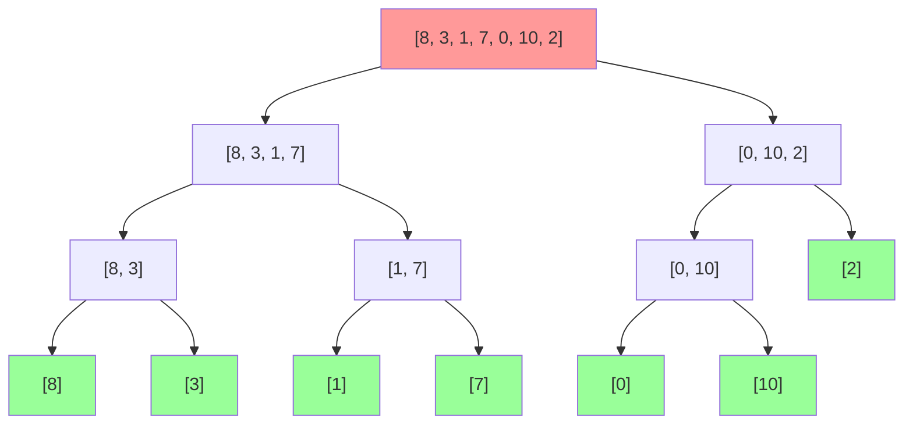
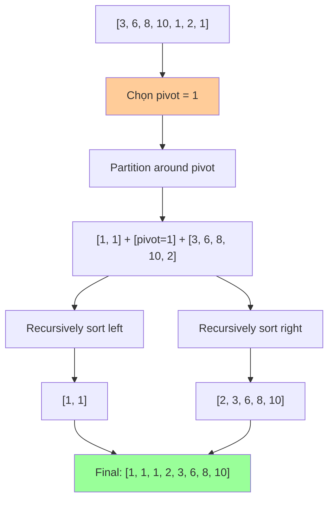
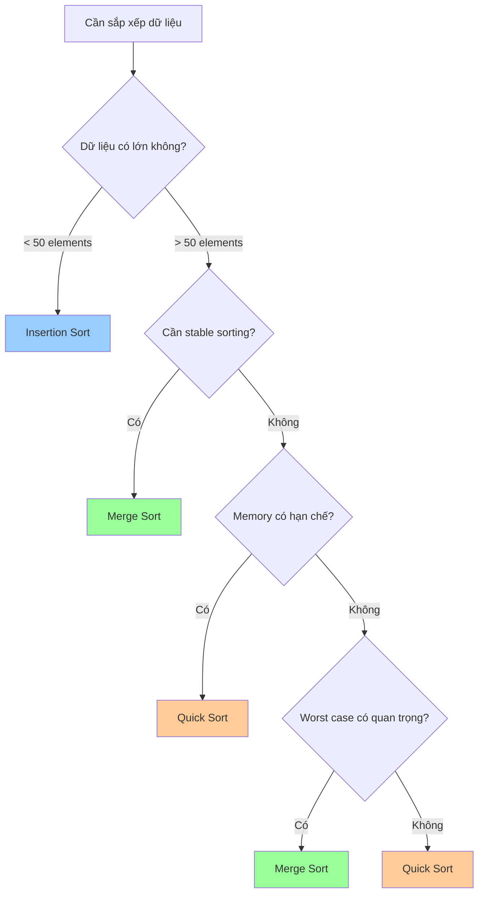

# Bài 10: Advanced Sorting Algorithms
*Khóa học Data Structures & Algorithms cho người mới bắt đầu*

---

## 📚 Mục tiêu học tập

<div className="bg-blue-50 border-l-4 border-blue-400 p-4 mb-6">
  <h3 className="text-lg font-semibold text-blue-800 mb-2">Sau bài học này, bạn sẽ:</h3>
  <ul className="text-blue-700 space-y-1">
    <li>✓ Hiểu và cài đặt thuật toán Merge Sort</li>
    <li>✓ Nắm vững chiến lược Divide & Conquer</li>
    <li>✓ Cài đặt và tối ưu thuật toán Quick Sort</li>
    <li>✓ Phân tích complexity và so sánh hiệu suất</li>
  </ul>
</div>

---

## 1. Tổng quan về Advanced Sorting

### So sánh với Simple Sorting

| Thuộc tính | Simple Sorting | Advanced Sorting |
|------------|---------------|------------------|
| **Time Complexity** | O(n²) | O(n log n) |
| **Độ phức tạp code** | Thấp | Trung bình - Cao |
| **Hiệu suất với big data** | Kém | Tốt |
| **Memory usage** | O(1) | O(log n) - O(n) |
| **Stability** | Có thể | Tùy thuộc thuật toán |

<div className="bg-yellow-50 border border-yellow-200 rounded-lg p-4 mt-4">
  <p className="text-yellow-800"><strong>💡 Tại sao cần Advanced Sorting?</strong></p>
  <p className="text-yellow-700 mt-2">Khi dữ liệu lớn (n > 10,000), sự khác biệt giữa O(n²) và O(n log n) là rất lớn. Ví dụ: với n = 100,000, simple sorting cần ~10 tỷ phép toán, advanced sorting chỉ cần ~1.7 triệu phép toán.</p>
</div>

---

## 2. Merge Sort - Thuật toán "Chia để trị"

### Nguyên lý hoạt động



### Cài đặt Merge Sort bằng Rust

```rust
fn merge_sort(arr: &mut [i32]) {
    let len = arr.len();
    if len <= 1 {
        return;
    }
    
    let mid = len / 2;
    merge_sort(&mut arr[0..mid]);
    merge_sort(&mut arr[mid..len]);
    
    // Tạo temporary arrays cho merge
    let left: Vec<i32> = arr[0..mid].to_vec();
    let right: Vec<i32> = arr[mid..len].to_vec();
    
    merge(arr, &left, &right);
}

fn merge(arr: &mut [i32], left: &[i32], right: &[i32]) {
    let mut i = 0; // Index cho left array
    let mut j = 0; // Index cho right array  
    let mut k = 0; // Index cho merged array
    
    // Merge hai mảng đã sắp xếp
    while i < left.len() && j < right.len() {
        if left[i] <= right[j] {
            arr[k] = left[i];
            i += 1;
        } else {
            arr[k] = right[j];
            j += 1;
        }
        k += 1;
    }
    
    // Copy remaining elements
    while i < left.len() {
        arr[k] = left[i];
        i += 1;
        k += 1;
    }
    
    while j < right.len() {
        arr[k] = right[j];
        j += 1;
        k += 1;
    }
}

// Test function
fn main() {
    let mut arr = vec![8, 3, 1, 7, 0, 10, 2];
    println!("Before: {:?}", arr);
    merge_sort(&mut arr);
    println!("After:  {:?}", arr);
}
```

### Phân tích Complexity của Merge Sort

<div className="overflow-x-auto">

| Trường hợp | Time Complexity | Space Complexity | Giải thích |
|------------|----------------|------------------|------------|
| **Best Case** | O(n log n) | O(n) | Luôn chia đôi và merge |
| **Average Case** | O(n log n) | O(n) | Không phụ thuộc input |
| **Worst Case** | O(n log n) | O(n) | Stable performance |

</div>

<div className="bg-green-50 border border-green-200 rounded-lg p-4 mt-4">
  <h4 className="text-green-800 font-semibold">🔍 Recurrence Relation</h4>
  <p className="text-green-700 mt-2"><code>T(n) = 2T(n/2) + O(n)</code></p>
  <p className="text-green-600 text-sm mt-1">Sử dụng Master Theorem: T(n) = O(n log n)</p>
</div>

---

## 3. Quick Sort - Thuật toán "Phân hoạch"

### Nguyên lý hoạt động



### Cài đặt Quick Sort bằng Rust

```rust
fn quick_sort(arr: &mut [i32]) {
    if arr.len() <= 1 {
        return;
    }
    quick_sort_helper(arr, 0, arr.len() - 1);
}

fn quick_sort_helper(arr: &mut [i32], low: usize, high: usize) {
    if low < high {
        let pivot_index = partition(arr, low, high);
        
        // Sort left partition
        if pivot_index > 0 {
            quick_sort_helper(arr, low, pivot_index - 1);
        }
        
        // Sort right partition
        quick_sort_helper(arr, pivot_index + 1, high);
    }
}

fn partition(arr: &mut [i32], low: usize, high: usize) -> usize {
    // Chọn element cuối làm pivot
    let pivot = arr[high];
    let mut i = low; // Index của element nhỏ hơn
    
    for j in low..high {
        if arr[j] <= pivot {
            arr.swap(i, j);
            i += 1;
        }
    }
    
    arr.swap(i, high); // Đặt pivot vào vị trí đúng
    i
}

// Optimized version với random pivot
use rand::Rng;

fn randomized_partition(arr: &mut [i32], low: usize, high: usize) -> usize {
    let mut rng = rand::thread_rng();
    let random_index = rng.gen_range(low..=high);
    arr.swap(random_index, high);
    partition(arr, low, high)
}
```

### Các chiến lược chọn Pivot

| Chiến lược | Ưu điểm | Nhược điểm | Khi nào sử dụng |
|------------|---------|------------|------------------|
| **First Element** | Đơn giản, nhanh | Worst case với sorted array | Dữ liệu random |
| **Last Element** | Đơn giản | Worst case với reverse sorted | Dữ liệu random |
| **Random Element** | Tránh worst case | Overhead của random | Dữ liệu không biết trước |
| **Median-of-3** | Balanced partition | Phức tạp hơn | Production code |

### Phân tích Complexity của Quick Sort

<div className="overflow-x-auto">

| Trường hợp | Time Complexity | Space Complexity | Điều kiện |
|------------|----------------|------------------|-----------|
| **Best Case** | O(n log n) | O(log n) | Pivot luôn ở giữa |
| **Average Case** | O(n log n) | O(log n) | Random pivot |
| **Worst Case** | O(n²) | O(n) | Pivot luôn min/max |

</div>

---

## 4. So sánh Merge Sort vs Quick Sort

<div className="grid grid-cols-1 md:grid-cols-2 gap-6 mt-6">
  <div className="bg-blue-50 border border-blue-200 rounded-lg p-4">
    <h4 className="text-blue-800 font-semibold mb-3">🔄 Merge Sort</h4>
    <div className="text-blue-700 space-y-2">
      <p><strong>✅ Ưu điểm:</strong></p>
      <ul className="list-disc list-inside text-sm space-y-1">
        <li>Stable sorting</li>
        <li>Guaranteed O(n log n)</li>
        <li>Predictable performance</li>
      </ul>
      <p><strong>❌ Nhược điểm:</strong></p>
      <ul className="list-disc list-inside text-sm space-y-1">
        <li>Cần O(n) extra memory</li>
        <li>Slower cho small arrays</li>
      </ul>
    </div>
  </div>
  
  <div className="bg-orange-50 border border-orange-200 rounded-lg p-4">
    <h4 className="text-orange-800 font-semibold mb-3">⚡ Quick Sort</h4>
    <div className="text-orange-700 space-y-2">
      <p><strong>✅ Ưu điểm:</strong></p>
      <ul className="list-disc list-inside text-sm space-y-1">
        <li>In-place sorting</li>
        <li>Faster trong thực tế</li>
        <li>Cache-friendly</li>
      </ul>
      <p><strong>❌ Nhược điểm:</strong></p>
      <ul className="list-disc list-inside text-sm space-y-1">
        <li>Worst case O(n²)</li>
        <li>Not stable</li>
        <li>Performance phụ thuộc pivot</li>
      </ul>
    </div>
  </div>
</div>

---

## 5. Benchmark và Testing

### Test với different input sizes

```rust
use std::time::Instant;

fn benchmark_sorting() {
    let sizes = vec![1000, 10000, 100000];
    
    for &size in &sizes {
        println!("\n=== Testing với {} elements ===", size);
        
        // Generate random data
        let mut data: Vec<i32> = (0..size).map(|_| rand::random()).collect();
        
        // Test Merge Sort
        let mut merge_data = data.clone();
        let start = Instant::now();
        merge_sort(&mut merge_data);
        let merge_time = start.elapsed();
        
        // Test Quick Sort  
        let mut quick_data = data.clone();
        let start = Instant::now();
        quick_sort(&mut quick_data);
        let quick_time = start.elapsed();
        
        println!("Merge Sort: {:?}", merge_time);
        println!("Quick Sort: {:?}", quick_time);
        
        // Verify correctness
        assert!(is_sorted(&merge_data));
        assert!(is_sorted(&quick_data));
    }
}

fn is_sorted(arr: &[i32]) -> bool {
    arr.windows(2).all(|w| w[0] <= w[1])
}
```

---

## 6. Khi nào sử dụng thuật toán nào?

### Decision Tree cho Sorting Algorithm



### Recommendations Table

| Tình huống | Thuật toán đề xuất | Lý do |
|------------|-------------------|-------|
| **Small arrays (n < 50)** | Insertion Sort | Overhead thấp, simple |
| **Need stable sorting** | Merge Sort | Duy trì thứ tự relative |
| **Memory constrained** | Quick Sort | In-place sorting |
| **Guaranteed performance** | Merge Sort | Always O(n log n) |
| **General purpose** | Quick Sort | Average case tốt nhất |

---

## 7. Bài tập thực hành

### Bài tập LeetCode liên quan:

<div className="bg-gray-50 border border-gray-200 rounded-lg p-4">
  <h4 className="font-semibold mb-3">🎯 Danh sách bài tập trên LeetCode:</h4>
  <div className="grid grid-cols-1 md:grid-cols-2 gap-4">
    <div>
      <p className="font-medium text-green-700">Easy Level:</p>
      <ul className="text-sm space-y-1 mt-1">
        <li>• <strong>88.</strong> Merge Sorted Array</li>
        <li>• <strong>283.</strong> Move Zeroes</li>
        <li>• <strong>922.</strong> Sort Array By Parity II</li>
      </ul>
    </div>
    <div>
      <p className="font-medium text-orange-700">Medium Level:</p>
      <ul className="text-sm space-y-1 mt-1">
        <li>• <strong>75.</strong> Sort Colors (Dutch Flag)</li>
        <li>• <strong>148.</strong> Sort List</li>
        <li>• <strong>215.</strong> Kth Largest Element</li>
        <li>• <strong>912.</strong> Sort an Array</li>
      </ul>
    </div>
  </div>
</div>

### Câu hỏi tự kiểm tra:

1. **Merge Sort có thể được implement iteratively không? Tại sao?**
2. **Làm thế nào để Quick Sort trở thành stable?**
3. **Tại sao Quick Sort lại cache-friendly hơn Merge Sort?**
4. **Hybrid sorting algorithm là gì? Ví dụ về Timsort.**

---

## 8. Tóm tắt

<div className="bg-indigo-50 border border-indigo-200 rounded-lg p-6 mt-6">
  <h4 className="text-indigo-800 font-semibold mb-4">📝 Key Takeaways</h4>
  <div className="text-indigo-700 space-y-3">
    <p><strong>1. Merge Sort:</strong> Stable, predictable O(n log n), cần extra memory</p>
    <p><strong>2. Quick Sort:</strong> In-place, average O(n log n), worst O(n²)</p>
    <p><strong>3. Divide & Conquer:</strong> Powerful paradigm cho optimization problems</p>
    <p><strong>4. Algorithm Selection:</strong> Phụ thuộc requirements và constraints</p>
  </div>
</div>

---

**Bài tiếp theo:** [Bài 11: Heap Sort & Priority Queue](./lesson-11.md)

*💡 Tip: Thực hành implement cả hai thuật toán và benchmark với different data sizes để hiểu sâu hơn về performance characteristics!*