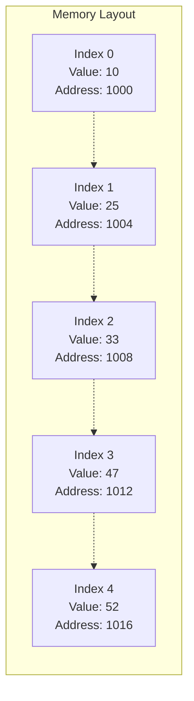
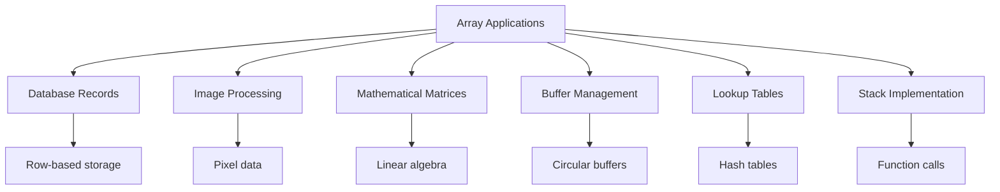

# Bài 3: Arrays - Cấu trúc dữ liệu đầu tiên

<div className="bg-blue-50 p-6 rounded-lg border-l-4 border-blue-400 mb-6">
  <h2 className="text-2xl font-bold text-blue-800 mb-2">🎯 Mục tiêu bài học</h2>
  <ul className="text-blue-700 space-y-1">
    <li>• Hiểu rõ khái niệm và cách hoạt động của Array</li>
    <li>• Nắm vững các thao tác cơ bản trên Array</li>
    <li>• Thực hành cài đặt các thuật toán với Rust</li>
    <li>• Phân tích độ phức tạp thời gian và không gian</li>
  </ul>
</div>

## 1. Giới thiệu về Array

**Array** (mảng) là cấu trúc dữ liệu tuyến tính lưu trữ các phần tử cùng kiểu dữ liệu trong các vị trí bộ nhớ liền kề nhau. Đây là cấu trúc dữ liệu cơ bản và quan trọng nhất trong lập trình.

<div className="bg-green-50 p-4 rounded-lg border border-green-200 my-4">
  <h3 className="text-green-800 font-semibold">✨ Đặc điểm chính của Array:</h3>
  <div className="grid grid-cols-2 gap-4 mt-2 text-green-700">
    <div>
      <strong>📍 Truy cập nhanh:</strong> O(1) theo index
    </div>
    <div>
      <strong>🔢 Kích thước cố định:</strong> Được xác định khi khởi tạo
    </div>
    <div>
      <strong>📊 Bộ nhớ liền kề:</strong> Tối ưu cache performance  
    </div>
    <div>
      <strong>🏷️ Chỉ số bắt đầu từ 0:</strong> Zero-indexed
    </div>
  </div>
</div>

### Cách Array lưu trữ trong bộ nhớ



## 2. So sánh Array với các cấu trúc khác

| Đặc điểm | Array | Linked List | Dynamic Array |
|----------|-------|-------------|---------------|
| **Truy cập ngẫu nhiên** | O(1) | O(n) | O(1) |
| **Chèn đầu/cuối** | O(n)/O(1) | O(1)/O(n) | O(1) amortized |
| **Xóa đầu/cuối** | O(n)/O(1) | O(1)/O(n) | O(1) |
| **Bộ nhớ** | Liền kề | Phân tán | Liền kề |
| **Cache locality** | Tốt | Kém | Tốt |

## 3. Cài đặt Array cơ bản trong Rust

```rust
// Khai báo array tĩnh
fn array_basics() {
    // Array với kích thước cố định
    let numbers: [i32; 5] = [10, 25, 33, 47, 52];
    
    // Array được khởi tạo với giá trị mặc định
    let zeros = [0; 10]; // [0, 0, 0, 0, 0, 0, 0, 0, 0, 0]
    
    // Truy cập phần tử
    println!("First element: {}", numbers[0]);
    println!("Array length: {}", numbers.len());
    
    // Duyệt array
    for (index, &value) in numbers.iter().enumerate() {
        println!("Index {}: {}", index, value);
    }
}
```

## 4. Các thao tác cơ bản trên Array

### 4.1 Truy cập phần tử (Access)

<div className="bg-yellow-50 p-4 rounded-lg border border-yellow-200 my-4">
  <h4 className="text-yellow-800 font-semibold">🔍 Độ phức tạp: O(1)</h4>
  <p className="text-yellow-700">Truy cập trực tiếp qua index nhờ địa chỉ bộ nhớ liền kề</p>
</div>

```rust
fn array_access() {
    let data = [1, 2, 3, 4, 5];
    
    // Truy cập an toàn
    match data.get(2) {
        Some(value) => println!("Element at index 2: {}", value),
        None => println!("Index out of bounds"),
    }
    
    // Truy cập trực tiếp (có thể panic)
    println!("Third element: {}", data[2]);
}
```

### 4.2 Tìm kiếm (Search)

```rust
// Tìm kiếm tuyến tính
fn linear_search<T: PartialEq>(arr: &[T], target: &T) -> Option<usize> {
    for (index, element) in arr.iter().enumerate() {
        if element == target {
            return Some(index);
        }
    }
    None
}

// Tìm kiếm nhị phân (array đã sắp xếp)
fn binary_search<T: Ord>(arr: &[T], target: &T) -> Option<usize> {
    let mut left = 0;
    let mut right = arr.len();
    
    while left < right {
        let mid = left + (right - left) / 2;
        match arr[mid].cmp(target) {
            std::cmp::Ordering::Equal => return Some(mid),
            std::cmp::Ordering::Less => left = mid + 1,
            std::cmp::Ordering::Greater => right = mid,
        }
    }
    None
}
```

### 4.3 Chèn và xóa phần tử

```rust
// Cấu trúc Dynamic Array đơn giản
struct DynamicArray<T> {
    data: Vec<T>,
}

impl<T> DynamicArray<T> {
    fn new() -> Self {
        Self { data: Vec::new() }
    }
    
    // Chèn vào cuối - O(1) amortized
    fn push(&mut self, value: T) {
        self.data.push(value);
    }
    
    // Chèn vào vị trí bất kỳ - O(n)
    fn insert(&mut self, index: usize, value: T) {
        if index <= self.data.len() {
            self.data.insert(index, value);
        }
    }
    
    // Xóa phần tử cuối - O(1)
    fn pop(&mut self) -> Option<T> {
        self.data.pop()
    }
    
    // Xóa tại vị trí - O(n)
    fn remove(&mut self, index: usize) -> Option<T> {
        if index < self.data.len() {
            Some(self.data.remove(index))
        } else {
            None
        }
    }
    
    // Lấy phần tử - O(1)
    fn get(&self, index: usize) -> Option<&T> {
        self.data.get(index)
    }
    
    fn len(&self) -> usize {
        self.data.len()
    }
}
```

## 5. Độ phức tạp các thao tác

<div className="bg-gray-50 p-6 rounded-lg my-6">

| Thao tác | Độ phức tạp thời gian | Độ phức tạp không gian | Ghi chú |
|----------|----------------------|------------------------|---------|
| **Truy cập** | O(1) | O(1) | Random access |
| **Tìm kiếm** | O(n) | O(1) | Linear search |
| **Tìm kiếm nhị phân** | O(log n) | O(1) | Array đã sắp xếp |
| **Chèn đầu** | O(n) | O(1) | Cần shift elements |
| **Chèn cuối** | O(1)* | O(1) | *Amortized for dynamic |
| **Xóa đầu** | O(n) | O(1) | Cần shift elements |
| **Xóa cuối** | O(1) | O(1) | Direct removal |

</div>

## 6. Array đa chiều (Multi-dimensional Arrays)

```rust
fn multidimensional_arrays() {
    // Array 2D
    let matrix: [[i32; 3]; 2] = [
        [1, 2, 3],
        [4, 5, 6]
    ];
    
    // Truy cập phần tử 2D
    println!("Element at [1][2]: {}", matrix[1][2]); // Output: 6
    
    // Duyệt matrix 2D
    for (i, row) in matrix.iter().enumerate() {
        for (j, &value) in row.iter().enumerate() {
            println!("matrix[{}][{}] = {}", i, j, value);
        }
    }
}

// Làm việc với dynamic 2D array
fn dynamic_2d_array() {
    let mut matrix: Vec<Vec<i32>> = Vec::new();
    
    // Khởi tạo ma trận 3x4
    for i in 0..3 {
        let mut row = Vec::new();
        for j in 0..4 {
            row.push(i * 4 + j);
        }
        matrix.push(row);
    }
    
    // In ma trận
    for row in &matrix {
        println!("{:?}", row);
    }
}
```

## 7. Các thuật toán cơ bản trên Array

### 7.1 Đảo ngược mảng

```rust
fn reverse_array<T>(arr: &mut [T]) {
    let mut left = 0;
    let mut right = arr.len() - 1;
    
    while left < right {
        arr.swap(left, right);
        left += 1;
        right -= 1;
    }
}
```

### 7.2 Xoay mảng

```rust
// Xoay mảng sang trái k vị trí
fn rotate_left<T>(arr: &mut [T], k: usize) {
    if arr.is_empty() {
        return;
    }
    
    let n = arr.len();
    let k = k % n; // Handle k > n
    
    // Sử dụng thuật toán reverse
    reverse_array(&mut arr[0..k]);
    reverse_array(&mut arr[k..]);
    reverse_array(arr);
}
```

### 7.3 Tìm phần tử lớn nhất/nhỏ nhất

```rust
fn find_min_max(arr: &[i32]) -> Option<(i32, i32)> {
    if arr.is_empty() {
        return None;
    }
    
    let mut min = arr[0];
    let mut max = arr[0];
    
    for &num in arr.iter().skip(1) {
        if num < min {
            min = num;
        }
        if num > max {
            max = num;
        }
    }
    
    Some((min, max))
}
```

## 8. Ứng dụng thực tế của Array



## 9. Bài tập thực hành

### Bài tập cơ bản
1. **Two Sum**: Tìm hai số trong mảng có tổng bằng target
2. **Remove Duplicates**: Xóa phần tử trùng lặp từ mảng đã sắp xếp
3. **Rotate Array**: Xoay mảng sang phải k vị trí
4. **Max Subarray**: Tìm dãy con liên tiếp có tổng lớn nhất
5. **Merge Sorted Arrays**: Trộn hai mảng đã sắp xếp

### Bài tập nâng cao
6. **3Sum**: Tìm ba số có tổng bằng 0
7. **Container With Most Water**: Tìm hai đường thẳng tạo ra container chứa nhiều nước nhất

## 10. Các bài tập LeetCode liên quan

<div className="bg-indigo-50 p-6 rounded-lg border border-indigo-200">
  <h3 className="text-indigo-800 font-bold text-lg mb-4">📝 Danh sách bài tập LeetCode</h3>
  
  <div className="grid grid-cols-1 md:grid-cols-2 gap-4">
    <div>
      <h4 className="font-semibold text-indigo-700 mb-2">🟢 Easy Level:</h4>
      <ul className="space-y-1 text-indigo-600">
        <li>• <strong>1. Two Sum</strong></li>
        <li>• <strong>26. Remove Duplicates</strong></li>
        <li>• <strong>27. Remove Element</strong></li>
        <li>• <strong>35. Search Insert Position</strong></li>
        <li>• <strong>88. Merge Sorted Array</strong></li>
        <li>• <strong>121. Best Time to Buy Stock</strong></li>
      </ul>
    </div>
    
    <div>
      <h4 className="font-semibold text-orange-700 mb-2">🟡 Medium Level:</h4>
      <ul className="space-y-1 text-orange-600">
        <li>• <strong>15. 3Sum</strong></li>
        <li>• <strong>33. Search in Rotated Array</strong></li>
        <li>• <strong>53. Maximum Subarray</strong></li>
        <li>• <strong>189. Rotate Array</strong></li>
        <li>• <strong>238. Product of Array Except Self</strong></li>
        <li>• <strong>11. Container With Most Water</strong></li>
      </ul>
    </div>
  </div>
</div>

## 11. Tổng kết

<div className="bg-red-50 p-6 rounded-lg border-l-4 border-red-400 mt-6">
  <h3 className="text-red-800 font-bold text-lg mb-3">🎯 Điểm quan trọng cần nhớ:</h3>
  <ul className="text-red-700 space-y-2">
    <li><strong>1. Truy cập O(1):</strong> Array cung cấp truy cập ngẫu nhiên nhanh nhất</li>
    <li><strong>2. Bộ nhớ liền kề:</strong> Tối ưu cho cache performance</li>
    <li><strong>3. Kích thước cố định:</strong> Static array không thể thay đổi size</li>
    <li><strong>4. Insertion/Deletion O(n):</strong> Cần shift elements</li>
    <li><strong>5. Suitable for:</strong> Lookup tables, mathematical operations, buffers</li>
  </ul>
</div>

---

**Bài tiếp theo:** Bài 4 - Linked Lists - Danh sách liên kết

*Hãy thực hành các bài tập để củng cố kiến thức về Array trước khi chuyển sang cấu trúc dữ liệu tiếp theo!*