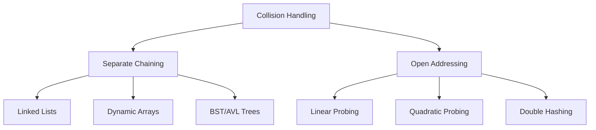
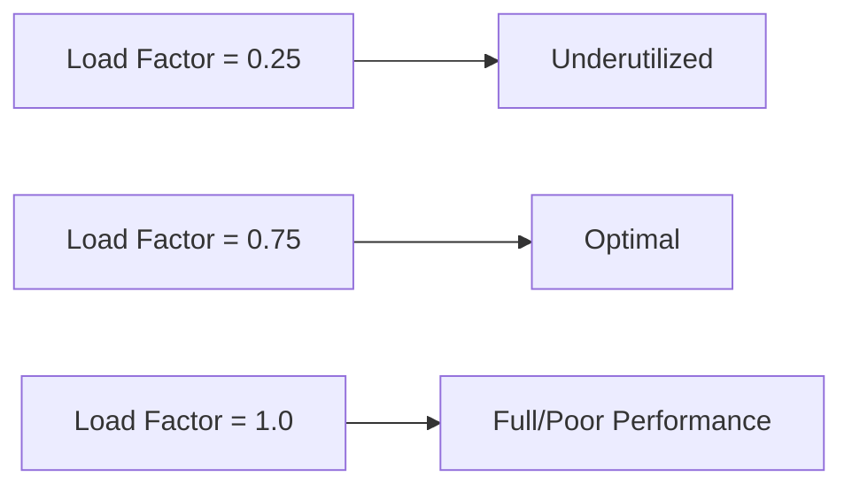

# Bài 6: Hash Tables - Bảng băm

<div className="bg-gradient-to-r from-blue-50 to-indigo-50 p-6 rounded-lg border-l-4 border-blue-500 mb-8">
  <h2 className="text-2xl font-bold text-blue-800 mb-2">🎯 Mục tiêu bài học</h2>
  <ul className="text-blue-700 space-y-2">
    <li>✅ Hiểu khái niệm Hash Function và Collision Handling</li>
    <li>✅ Cài đặt Hash Table với Separate Chaining</li>
    <li>✅ Cài đặt Hash Table với Open Addressing</li>
    <li>✅ Phân tích Load Factor và Rehashing</li>
    <li>✅ Thực hành các thao tác Insert, Search, Delete</li>
  </ul>
</div>

## 1. Khái niệm cơ bản

**Hash Table** (Bảng băm) là một cấu trúc dữ liệu cho phép lưu trữ và truy xuất dữ liệu với thời gian trung bình **O(1)**. Điều này được thực hiện thông qua **hash function** - một hàm chuyển đổi khóa (key) thành chỉ số (index) trong bảng.

### Thành phần chính của Hash Table

```mermaid
graph TD
    A[Key: "apple"] -->|Hash Function| B[Index: 5]
    B --> C[Array Position 5]
    C --> D[Value: "red fruit"]
    
    E[Key: "banana"] -->|Hash Function| F[Index: 2] 
    F --> G[Array Position 2]
    G --> H[Value: "yellow fruit"]
```

| Thành phần | Mô tả | Ví dụ |
|-----------|--------|-------|
| **Key** | Khóa để tìm kiếm | "apple", "banana", 123 |
| **Hash Function** | Hàm chuyển key thành index | `hash("apple") = 5` |
| **Bucket/Slot** | Vị trí lưu trữ trong mảng | `array[5]` |
| **Value** | Giá trị được lưu trữ | "red fruit" |

## 2. Hash Function (Hàm băm)

Hash function là trái tim của Hash Table. Một hash function tốt cần có các đặc điểm:

<div className="bg-yellow-50 p-4 rounded-lg border border-yellow-200 mb-6">
  <h3 className="text-yellow-800 font-semibold mb-2">🔑 Đặc điểm của Hash Function tốt:</h3>
  <ul className="text-yellow-700 space-y-1">
    <li>• Phân phối đều các keys trong bảng</li>
    <li>• Tính toán nhanh (O(1))</li>
    <li>• Deterministic (cùng input → cùng output)</li>
    <li>• Giảm thiểu collision</li>
  </ul>
</div>

### Các Hash Function phổ biến

| Phương pháp | Công thức | Ưu điểm | Nhược điểm |
|-------------|-----------|---------|------------|
| **Division** | `h(k) = k mod m` | Đơn giản, nhanh | Clustering nếu m không tốt |
| **Multiplication** | `h(k) = ⌊m(kA mod 1)⌋` | Ít nhạy cảm với m | Phức tạp hơn |
| **Universal Hashing** | `h(k) = ((ak + b) mod p) mod m` | Tránh worst-case | Chi phí tính toán cao |

### Cài đặt Hash Function trong Rust

```rust
struct HashTable<K, V> {
    buckets: Vec<Vec<(K, V)>>,
    size: usize,
    capacity: usize,
}

impl<K, V> HashTable<K, V> 
where 
    K: Clone + PartialEq + std::hash::Hash,
    V: Clone,
{
    fn hash(&self, key: &K) -> usize {
        use std::collections::hash_map::DefaultHasher;
        use std::hash::{Hash, Hasher};
        
        let mut hasher = DefaultHasher::new();
        key.hash(&mut hasher);
        (hasher.finish() as usize) % self.capacity
    }
    
    fn new(capacity: usize) -> Self {
        HashTable {
            buckets: vec![Vec::new(); capacity],
            size: 0,
            capacity,
        }
    }
}
```

## 3. Collision Handling (Xử lý xung đột)

Khi hai keys khác nhau có cùng hash value, ta gọi đó là **collision**. Có hai phương pháp chính để xử lý:



### 3.1 Separate Chaining

Mỗi bucket chứa một danh sách các phần tử có cùng hash value.

| Ưu điểm | Nhược điểm |
|---------|------------|
| ✅ Dễ cài đặt | ❌ Overhead bộ nhớ cho pointers |
| ✅ Không bị giới hạn số phần tử | ❌ Cache performance kém |
| ✅ Deletion đơn giản | ❌ Thời gian không ổn định |

```rust
impl<K, V> HashTable<K, V> 
where 
    K: Clone + PartialEq + std::hash::Hash,
    V: Clone,
{
    fn insert(&mut self, key: K, value: V) {
        let index = self.hash(&key);
        
        // Tìm xem key đã tồn tại chưa
        for (existing_key, existing_value) in &mut self.buckets[index] {
            if *existing_key == key {
                *existing_value = value; // Update
                return;
            }
        }
        
        // Thêm mới
        self.buckets[index].push((key, value));
        self.size += 1;
        
        // Kiểm tra load factor
        if self.load_factor() > 0.75 {
            self.resize();
        }
    }
    
    fn get(&self, key: &K) -> Option<&V> {
        let index = self.hash(key);
        
        for (existing_key, value) in &self.buckets[index] {
            if existing_key == key {
                return Some(value);
            }
        }
        None
    }
    
    fn remove(&mut self, key: &K) -> Option<V> {
        let index = self.hash(key);
        
        if let Some(pos) = self.buckets[index]
            .iter()
            .position(|(k, _)| k == key) 
        {
            let (_, value) = self.buckets[index].remove(pos);
            self.size -= 1;
            Some(value)
        } else {
            None
        }
    }
}
```

### 3.2 Open Addressing (Linear Probing)

Khi gặp collision, tìm slot tiếp theo còn trống trong bảng.

```rust
struct OpenAddressingHashTable<K, V> {
    entries: Vec<Option<(K, V)>>,
    size: usize,
    capacity: usize,
}

impl<K, V> OpenAddressingHashTable<K, V>
where
    K: Clone + PartialEq + std::hash::Hash,
    V: Clone,
{
    fn new(capacity: usize) -> Self {
        OpenAddressingHashTable {
            entries: vec![None; capacity],
            size: 0,
            capacity,
        }
    }
    
    fn hash(&self, key: &K) -> usize {
        use std::collections::hash_map::DefaultHasher;
        use std::hash::{Hash, Hasher};
        
        let mut hasher = DefaultHasher::new();
        key.hash(&mut hasher);
        (hasher.finish() as usize) % self.capacity
    }
    
    fn insert(&mut self, key: K, value: V) -> bool {
        if self.size >= self.capacity * 3 / 4 {
            self.resize();
        }
        
        let mut index = self.hash(&key);
        
        loop {
            match &self.entries[index] {
                None => {
                    self.entries[index] = Some((key, value));
                    self.size += 1;
                    return true;
                }
                Some((existing_key, _)) if existing_key == &key => {
                    self.entries[index] = Some((key, value)); // Update
                    return true;
                }
                Some(_) => {
                    index = (index + 1) % self.capacity; // Linear probing
                }
            }
        }
    }
    
    fn get(&self, key: &K) -> Option<&V> {
        let mut index = self.hash(key);
        
        loop {
            match &self.entries[index] {
                None => return None,
                Some((existing_key, value)) if existing_key == key => {
                    return Some(value);
                }
                Some(_) => {
                    index = (index + 1) % self.capacity;
                }
            }
        }
    }
}
```

## 4. Load Factor và Rehashing

**Load Factor** = Số phần tử / Dung lượng bảng



| Load Factor | Separate Chaining | Open Addressing |
|-------------|-------------------|-----------------|
| **< 0.5** | Lãng phí bộ nhớ | Tốt, ít collision |
| **0.5 - 0.75** | Optimal | Acceptable |
| **> 0.75** | Acceptable | Poor performance |
| **> 1.0** | Still works | Không thể hoạt động |

### Cài đặt Rehashing

```rust
impl<K, V> HashTable<K, V> 
where 
    K: Clone + PartialEq + std::hash::Hash,
    V: Clone,
{
    fn load_factor(&self) -> f64 {
        self.size as f64 / self.capacity as f64
    }
    
    fn resize(&mut self) {
        let old_buckets = std::mem::replace(
            &mut self.buckets, 
            vec![Vec::new(); self.capacity * 2]
        );
        
        let old_capacity = self.capacity;
        self.capacity *= 2;
        self.size = 0;
        
        // Rehash tất cả các phần tử
        for bucket in old_buckets {
            for (key, value) in bucket {
                self.insert(key, value);
            }
        }
        
        println!("Resized from {} to {}", old_capacity, self.capacity);
    }
}
```

## 5. So sánh hiệu suất

<div className="overflow-x-auto mb-6">

| Thao tác | Separate Chaining | Open Addressing | Array | Linked List |
|----------|-------------------|------------------|-------|-------------|
| **Insert** | O(1) avg, O(n) worst | O(1) avg, O(n) worst | O(1) | O(1) at head |
| **Search** | O(1) avg, O(n) worst | O(1) avg, O(n) worst | O(n) | O(n) |
| **Delete** | O(1) avg, O(n) worst | O(1) avg, O(n) worst | O(n) | O(1) if node known |
| **Space** | O(n + m) | O(m) | O(n) | O(n) |

</div>

<div className="bg-green-50 p-4 rounded-lg border border-green-200 mb-6">
  <h3 className="text-green-800 font-semibold mb-2">📊 Khi nào sử dụng Hash Table?</h3>
  <ul className="text-green-700 space-y-1">
    <li>• Cần truy xuất nhanh theo key</li>
    <li>• Implement database indexing</li>
    <li>• Cache/memoization</li>
    <li>• Counting/frequency analysis</li>
    <li>• Set operations (union, intersection)</li>
  </ul>
</div>

## 6. Ứng dụng thực tế

### 6.1 Word Frequency Counter

```rust
use std::collections::HashMap;

fn count_words(text: &str) -> HashMap<String, usize> {
    let mut word_count = HashMap::new();
    
    for word in text
        .split_whitespace()
        .map(|w| w.to_lowercase().trim_matches(|c: char| !c.is_alphabetic()))
        .filter(|w| !w.is_empty())
    {
        *word_count.entry(word.to_string()).or_insert(0) += 1;
    }
    
    word_count
}

fn main() {
    let text = "The quick brown fox jumps over the lazy dog. The fox is quick.";
    let counts = count_words(text);
    
    println!("Word frequencies:");
    for (word, count) in &counts {
        println!("{}: {}", word, count);
    }
}
```

### 6.2 LRU Cache Implementation

```rust
use std::collections::HashMap;
use std::ptr::NonNull;

struct Node<K, V> {
    key: K,
    value: V,
    prev: Option<NonNull<Node<K, V>>>,
    next: Option<NonNull<Node<K, V>>>,
}

struct LRUCache<K, V> {
    capacity: usize,
    map: HashMap<K, NonNull<Node<K, V>>>,
    head: Option<NonNull<Node<K, V>>>,
    tail: Option<NonNull<Node<K, V>>>,
}

impl<K, V> LRUCache<K, V> 
where
    K: Clone + std::hash::Hash + Eq,
    V: Clone,
{
    fn new(capacity: usize) -> Self {
        LRUCache {
            capacity,
            map: HashMap::new(),
            head: None,
            tail: None,
        }
    }
    
    fn get(&mut self, key: &K) -> Option<&V> {
        if let Some(&node_ptr) = self.map.get(key) {
            // Move to front (most recently used)
            self.move_to_front(node_ptr);
            unsafe { Some(&(*node_ptr.as_ptr()).value) }
        } else {
            None
        }
    }
    
    fn put(&mut self, key: K, value: V) {
        if let Some(&node_ptr) = self.map.get(&key) {
            // Update existing
            unsafe {
                (*node_ptr.as_ptr()).value = value;
            }
            self.move_to_front(node_ptr);
        } else {
            // Add new
            if self.map.len() >= self.capacity {
                self.remove_lru();
            }
            self.add_to_front(key, value);
        }
    }
    
    // Implementation details for move_to_front, remove_lru, add_to_front...
    // (Simplified for brevity)
}
```

## 7. Tóm tắt

<div className="bg-blue-50 p-6 rounded-lg border border-blue-200">
  <h3 className="text-blue-800 font-bold mb-4">🎯 Kiến thức trọng tâm</h3>
  <div className="grid grid-cols-1 md:grid-cols-2 gap-4 text-blue-700">
    <div>
      <h4 className="font-semibold mb-2">Hash Function:</h4>
      <ul className="space-y-1 text-sm">
        <li>• Chuyển key thành index</li>
        <li>• Phân phối đều, tính nhanh</li>
        <li>• Division, Multiplication methods</li>
      </ul>
    </div>
    <div>
      <h4 className="font-semibold mb-2">Collision Handling:</h4>
      <ul className="space-y-1 text-sm">
        <li>• Separate Chaining: linked lists</li>
        <li>• Open Addressing: linear probing</li>
        <li>• Trade-offs giữa memory và performance</li>
      </ul>
    </div>
  </div>
</div>

**Performance:** O(1) average case cho Insert/Search/Delete

**Applications:** Database indexing, Caching, Symbol tables, Set operations

---

## 🚀 Bài tập LeetCode liên quan

| Bài | Độ khó | Mô tả |
|-----|---------|-------|
| [1. Two Sum](https://leetcode.com/problems/two-sum/) | Easy | Sử dụng HashMap để tìm cặp số |
| [49. Group Anagrams](https://leetcode.com/problems/group-anagrams/) | Medium | Group strings bằng sorted string làm key |
| [128. Longest Consecutive Sequence](https://leetcode.com/problems/longest-consecutive-sequence/) | Medium | Dùng HashSet để tìm sequence |
| [146. LRU Cache](https://leetcode.com/problems/lru-cache/) | Medium | Kết hợp HashMap + Doubly Linked List |
| [387. First Unique Character](https://leetcode.com/problems/first-unique-character-in-a-string/) | Easy | Character frequency counting |
| [454. 4Sum II](https://leetcode.com/problems/4sum-ii/) | Medium | Tối ưu từ O(n⁴) xuống O(n²) |

---

<div className="text-center mt-8 p-4 bg-gray-50 rounded-lg">
  <div className="text-gray-600 font-medium">
    📚 <strong>Bài tiếp theo:</strong> Bài 7 - Algorithmic Complexity Analysis
  </div>
</div>