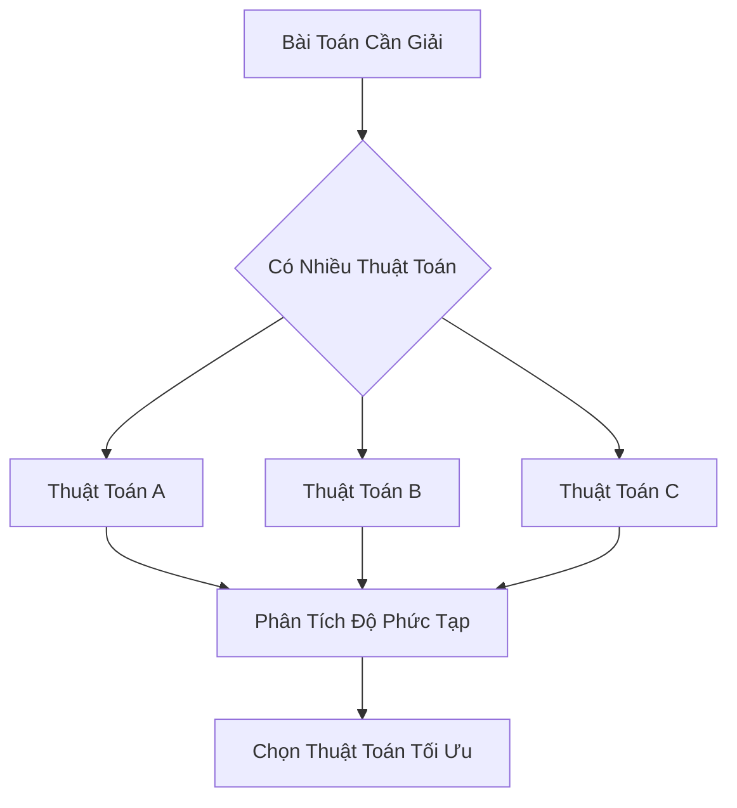
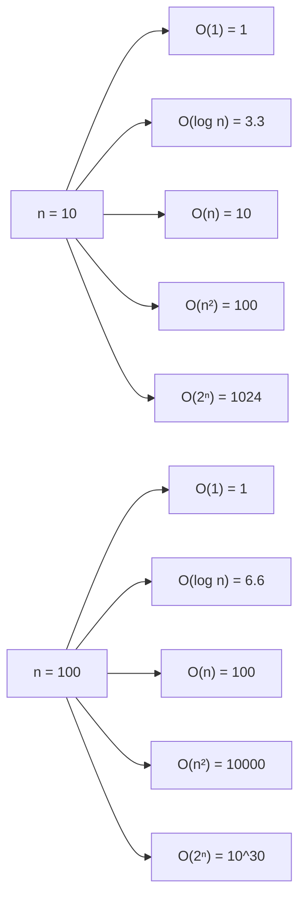
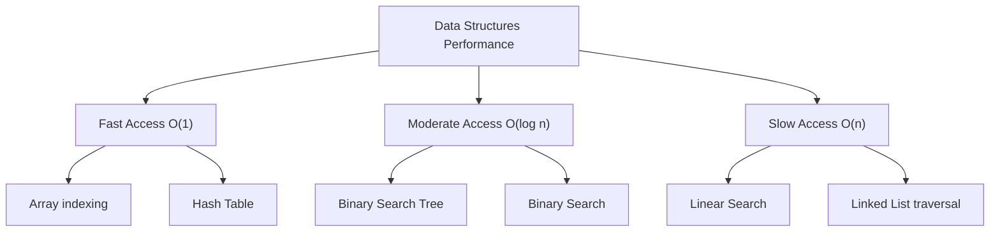

# Bài 7: Phân Tích Độ Phức Tạp Thuật Toán
## (Algorithmic Complexity Analysis)

---

<div className="bg-gradient-to-r from-blue-50 to-indigo-50 p-6 rounded-lg border-l-4 border-blue-500 mb-6">
  <h3 className="text-xl font-bold text-blue-800 mb-2">🎯 Mục tiêu bài học</h3>
  <ul className="text-blue-700 space-y-1">
    <li>• Hiểu rõ khái niệm Time Complexity và Space Complexity</li>
    <li>• Nắm vững cách tính toán và phân tích độ phức tạp</li>
    <li>• Làm quen với các runtime phổ biến: O(1), O(log n), O(n), O(n²), O(2ⁿ)</li>
    <li>• Thực hành phân tích complexity cho các thuật toán thực tế</li>
  </ul>
</div>

## 1. Giới Thiệu Về Độ Phức Tạp Thuật Toán

### 1.1 Tại Sao Cần Phân Tích Độ Phức Tạp?

<div className="bg-yellow-50 p-4 rounded-lg border-l-4 border-yellow-400 mb-4">
  <p className="text-yellow-800"><strong>💡 Tầm quan trọng:</strong> Trong thực tế, chúng ta cần so sánh các thuật toán để chọn ra giải pháp tối ưu nhất cho từng bài toán cụ thể.</p>
</div>



### 1.2 Hai Loại Độ Phức Tạp Chính

| Loại Độ Phức Tạp | Ký Hiệu | Mô Tả | Ví Dụ |
|------------------|---------|-------|-------|
| **Time Complexity** | T(n) | Thời gian thực thi thuật toán | Số phép so sánh, số vòng lặp |
| **Space Complexity** | S(n) | Bộ nhớ cần thiết để thực thi | Biến phụ, mảng tạm, stack recursion |

## 2. Time Complexity - Độ Phức Tạp Thời Gian

### 2.1 Các Mức Độ Time Complexity Phổ Biến

<div className="bg-green-50 p-4 rounded-lg mb-4">
  <h4 className="text-green-800 font-semibold mb-2">📊 Bảng So Sánh Các Runtime</h4>
</div>

| Runtime | Tên Gọi | Mô Tả | Ví Dụ Thuật Toán |
|---------|----------|-------|------------------|
| **O(1)** | Constant | Thời gian không đổi | Array access, Hash lookup |
| **O(log n)** | Logarithmic | Chia đôi mỗi bước | Binary Search, Tree operations |
| **O(n)** | Linear | Tỷ lệ thuận với n | Linear Search, Array traversal |
| **O(n log n)** | Linearithmic | n nhân log n | Merge Sort, Heap Sort |
| **O(n²)** | Quadratic | Bình phương của n | Bubble Sort, Nested loops |
| **O(2ⁿ)** | Exponential | Tăng theo cấp số nhân | Fibonacci recursive |

### 2.2 Minh Họa Tăng Trưởng Complexity



### 2.3 Ví Dụ Phân Tích Time Complexity Với Rust

#### Ví Dụ 1: O(1) - Constant Time
```rust
fn get_array_element(arr: &[i32], index: usize) -> Option<i32> {
    // Chỉ một phép truy xuất -> O(1)
    arr.get(index).copied()
}
```

#### Ví Dụ 2: O(n) - Linear Time
```rust
fn linear_search(arr: &[i32], target: i32) -> Option<usize> {
    // Trong trường hợp xấu nhất, duyệt hết mảng -> O(n)
    for (index, &value) in arr.iter().enumerate() {
        if value == target {
            return Some(index);
        }
    }
    None
}
```

#### Ví Dụ 3: O(log n) - Logarithmic Time
```rust
fn binary_search(arr: &[i32], target: i32) -> Option<usize> {
    let mut left = 0;
    let mut right = arr.len();
    
    // Mỗi lần lặp chia đôi không gian tìm kiếm -> O(log n)
    while left < right {
        let mid = left + (right - left) / 2;
        
        match arr[mid].cmp(&target) {
            std::cmp::Ordering::Equal => return Some(mid),
            std::cmp::Ordering::Less => left = mid + 1,
            std::cmp::Ordering::Greater => right = mid,
        }
    }
    None
}
```

#### Ví Dụ 4: O(n²) - Quadratic Time
```rust
fn bubble_sort(arr: &mut [i32]) {
    let n = arr.len();
    // Vòng lặp ngoài: n lần
    for i in 0..n {
        let mut swapped = false;
        // Vòng lặp trong: (n-i-1) lần
        // Tổng cộng: n * n = O(n²)
        for j in 0..n-i-1 {
            if arr[j] > arr[j + 1] {
                arr.swap(j, j + 1);
                swapped = true;
            }
        }
        // Optimization: nếu không có swap nào thì mảng đã sắp xếp
        if !swapped {
            break;
        }
    }
}
```

## 3. Space Complexity - Độ Phức Tạp Không Gian

### 3.1 Các Loại Space Complexity

| Loại | Mô Tả | Ví Dụ |
|------|-------|-------|
| **Auxiliary Space** | Bộ nhớ phụ bổ sung | Mảng tạm, biến đệm |
| **Input Space** | Bộ nhớ lưu input | Dữ liệu đầu vào |
| **Total Space** | Tổng bộ nhớ cần dùng | Auxiliary + Input |

### 3.2 Ví Dụ Phân Tích Space Complexity

#### Space O(1) - Constant Space
```rust
fn reverse_array_in_place(arr: &mut [i32]) {
    let mut left = 0;
    let mut right = arr.len() - 1;
    
    // Chỉ sử dụng 2 biến left, right -> O(1) space
    while left < right {
        arr.swap(left, right);
        left += 1;
        right -= 1;
    }
}
```

#### Space O(n) - Linear Space
```rust
fn merge_sort(arr: &mut [i32]) {
    if arr.len() <= 1 {
        return;
    }
    
    let mid = arr.len() / 2;
    
    // Tạo mảng tạm có kích thước n -> O(n) space
    let mut temp = vec![0; arr.len()];
    
    merge_sort(&mut arr[0..mid]);
    merge_sort(&mut arr[mid..]);
    merge(&arr[0..mid], &arr[mid..], &mut temp, arr);
}

fn merge(left: &[i32], right: &[i32], temp: &mut [i32], result: &mut [i32]) {
    let mut i = 0; // Index cho left
    let mut j = 0; // Index cho right
    let mut k = 0; // Index cho temp
    
    // Merge hai mảng đã sắp xếp
    while i < left.len() && j < right.len() {
        if left[i] <= right[j] {
            temp[k] = left[i];
            i += 1;
        } else {
            temp[k] = right[j];
            j += 1;
        }
        k += 1;
    }
    
    // Copy các phần tử còn lại
    while i < left.len() {
        temp[k] = left[i];
        i += 1;
        k += 1;
    }
    
    while j < right.len() {
        temp[k] = right[j];
        j += 1;
        k += 1;
    }
    
    // Copy từ temp về result
    result.copy_from_slice(&temp[0..left.len() + right.len()]);
}
```

## 4. Phương Pháp Phân Tích Complexity

### 4.1 Quy Tắc Phân Tích

<div className="bg-blue-50 p-4 rounded-lg border-l-4 border-blue-400 mb-4">
  <h4 className="text-blue-800 font-semibold mb-2">📋 Các Quy Tắc Cơ Bản</h4>
  <ol className="text-blue-700 space-y-2">
    <li><strong>1. Drop Constants:</strong> O(3n) → O(n)</li>
    <li><strong>2. Drop Lower Order Terms:</strong> O(n² + n) → O(n²)</li>
    <li><strong>3. Worst Case Analysis:</strong> Xét trường hợp xấu nhất</li>
    <li><strong>4. Add Complexities:</strong> Sequential → O(a) + O(b) = O(a+b)</li>
    <li><strong>5. Multiply Complexities:</strong> Nested → O(a) * O(b) = O(a*b)</li>
  </ol>
</div>

### 4.2 Bảng Phân Tích Các Cấu Trúc Lặp

| Cấu Trúc | Time Complexity | Ghi Chú |
|----------|----------------|---------|
| `for i in 0..n` | O(n) | Vòng lặp đơn |
| `for i in 0..n { for j in 0..n }` | O(n²) | Vòng lặp lồng nhau |
| `while n > 1 { n /= 2 }` | O(log n) | Chia đôi mỗi lần |
| Recursive với 2 nhánh | O(2ⁿ) | Cây nhị phân đầy |

## 5. Thực Hành Phân Tích Complexity

### 5.1 Bài Tập Phân Tích

```rust
// Bài tập 1: Phân tích complexity của hàm này
fn mystery_function_1(arr: &[i32]) -> i32 {
    let mut sum = 0;
    for i in 0..arr.len() {           // O(n)
        for j in 0..arr.len() {       // O(n)
            sum += arr[i] * arr[j];   // O(1)
        }
    }
    sum
}
// Time Complexity: O(n²)
// Space Complexity: O(1)
```

```rust
// Bài tập 2: Phân tích complexity của hàm này
fn mystery_function_2(n: usize) -> Vec<i32> {
    let mut result = Vec::new();
    let mut i = 1;
    
    while i <= n {              // Chạy log n lần
        let mut j = 1;
        while j <= i {          // Chạy i lần (1, 2, 4, 8, ...)
            result.push(i * j); // O(1)
            j += 1;
        }
        i *= 2;                 // Tăng gấp đôi
    }
    result
}
// Phân tích chi tiết:
// - Vòng ngoài chạy: log₂(n) lần (i = 1, 2, 4, 8, ..., 2^k ≤ n)
// - Vòng trong chạy: 1 + 2 + 4 + ... + 2^k = 2^(k+1) - 1 ≈ 2n
// Time Complexity: O(n)
// Space Complexity: O(n) - do lưu trữ result vector
```

### 5.2 So Sánh Thực Tế Các Thuật Toán

```rust
use std::time::Instant;

fn benchmark_algorithms() {
    let sizes = vec![100, 1000, 10000, 100000];
    
    println!("Benchmark Results:");
    println!("{:<10} {:<15} {:<15} {:<10}", "Size", "Linear (μs)", "Binary (μs)", "Ratio");
    println!("{}", "-".repeat(55));
    
    for &n in &sizes {
        let data: Vec<i32> = (0..n).collect();
        let target = n - 1; // Worst case: tìm phần tử cuối
        
        // Test O(n) - Linear Search (repeated for better measurement)
        let start = Instant::now();
        for _ in 0..1000 {
            let _ = linear_search(&data, target);
        }
        let linear_time = start.elapsed().as_micros() / 1000;
        
        // Test O(log n) - Binary Search (repeated for better measurement)  
        let start = Instant::now();
        for _ in 0..1000 {
            let _ = binary_search(&data, target);
        }
        let binary_time = start.elapsed().as_micros() / 1000;
        
        let ratio = if binary_time > 0 { 
            linear_time as f64 / binary_time as f64 
        } else { 
            0.0 
        };
        
        println!("{:<10} {:<15} {:<15} {:<10.1}x", 
                 n, linear_time, binary_time, ratio);
    }
}
```

## 6. Complexity của Các Cấu Trúc Dữ Liệu Phổ Biến

### 6.1 Bảng Tổng Hợp

| Cấu Trúc Dữ Liệu | Access | Search | Insert | Delete | Space |
|------------------|---------|---------|---------|---------|-------|
| **Array** | O(1) | O(n) | O(n) | O(n) | O(n) |
| **Linked List** | O(n) | O(n) | O(1) | O(1) | O(n) |
| **Hash Table** | N/A | O(1)* | O(1)* | O(1)* | O(n) |
| **Binary Search Tree** | O(log n)* | O(log n)* | O(log n)* | O(log n)* | O(n) |
| **Stack/Queue** | N/A | N/A | O(1) | O(1) | O(n) |

<small>*Average case, worst case có thể khác</small>

### 6.2 Biểu Đồ So Sánh Performance



## 7. Best Practices và Lưu Ý

<div className="bg-red-50 p-4 rounded-lg border-l-4 border-red-400 mb-4">
  <h4 className="text-red-800 font-semibold mb-2">⚠️ Những Lưu Ý Quan Trọng</h4>
  <ul className="text-red-700 space-y-1">
    <li>• Complexity không phải là tất cả - constant factors cũng quan trọng</li>
    <li>• Với dữ liệu nhỏ, thuật toán O(n²) có thể nhanh hơn O(n log n)</li>
    <li>• Cần cân nhắc giữa time và space complexity</li>
    <li>• Luôn xem xét average case và worst case</li>
  </ul>
</div>

### 7.1 Khi Nào Chọn Thuật Toán Nào?

| Kích Thước Dữ Liệu | Ưu Tiên | Thuật Toán Gợi Ý |
|-------------------|---------|------------------|
| **n < 100** | Simple implementation | Bubble sort, Linear search |
| **100 ≤ n ≤ 10,000** | Balanced approach | Quick sort, Hash table |
| **n > 10,000** | Optimal complexity | Merge sort, Binary search |

## 9. Recursive Complexity Analysis

### 9.1 Master Theorem - Công Thức Tính Complexity Đệ Quy

<div className="bg-indigo-50 p-4 rounded-lg border-l-4 border-indigo-400 mb-4">
  <h4 className="text-indigo-800 font-semibold mb-2">📐 Master Theorem</h4>
  <p className="text-indigo-700">Cho recurrence relation: <strong>T(n) = aT(n/b) + f(n)</strong></p>
  <ul className="text-indigo-700 mt-2 space-y-1">
    <li>• <strong>a:</strong> số lượng subproblems</li>
    <li>• <strong>b:</strong> factor chia nhỏ input</li>
    <li>• <strong>f(n):</strong> cost của việc divide và combine</li>
  </ul>
</div>

| Case | Điều Kiện | Kết Quả | Ví Dụ |
|------|-----------|---------|-------|
| **Case 1** | f(n) = O(n^c), c < log_b(a) | T(n) = Θ(n^log_b(a)) | T(n) = 2T(n/2) + O(1) |
| **Case 2** | f(n) = Θ(n^c), c = log_b(a) | T(n) = Θ(n^c log n) | T(n) = 2T(n/2) + O(n) |
| **Case 3** | f(n) = Ω(n^c), c > log_b(a) | T(n) = Θ(f(n)) | T(n) = 2T(n/2) + O(n²) |

### 9.2 Ví Dụ Phân Tích Đệ Quy

```rust
// Fibonacci - O(2ⁿ) exponential
fn fibonacci_naive(n: u32) -> u64 {
    match n {
        0 => 0,
        1 => 1,
        _ => fibonacci_naive(n - 1) + fibonacci_naive(n - 2)
    }
}
// T(n) = T(n-1) + T(n-2) + O(1) → O(2ⁿ)

// Fibonacci optimized - O(n) với memoization
fn fibonacci_memo(n: u32, memo: &mut std::collections::HashMap<u32, u64>) -> u64 {
    if let Some(&result) = memo.get(&n) {
        return result;
    }
    
    let result = match n {
        0 => 0,
        1 => 1,
        _ => fibonacci_memo(n - 1, memo) + fibonacci_memo(n - 2, memo)
    };
    
    memo.insert(n, result);
    result
}
// Space: O(n) cho memo table, Time: O(n)
```

## 10. Amortized Analysis - Phân Tích Khấu Hao

### 10.1 Khái Niệm Amortized Complexity

<div className="bg-orange-50 p-4 rounded-lg border-l-4 border-orange-400 mb-4">
  <p className="text-orange-800"><strong>💡 Amortized Analysis:</strong> Phân tích cost trung bình của một sequence operations, không phải từng operation riêng lẻ.</p>
</div>

```rust
// Dynamic Array - Vector trong Rust
// Insert operation có amortized O(1) complexity
struct DynamicArray<T> {
    data: Vec<T>,
    capacity: usize,
}

impl<T> DynamicArray<T> {
    fn new() -> Self {
        Self {
            data: Vec::with_capacity(1),
            capacity: 1,
        }
    }
    
    fn push(&mut self, item: T) {
        if self.data.len() == self.capacity {
            // Resize: O(n) - nhưng xảy ra ít
            self.capacity *= 2;
            self.data.reserve(self.capacity - self.data.len());
        }
        // Normal push: O(1) - xảy ra nhiều
        self.data.push(item);
    }
}

// Amortized Analysis:
// - Resize cost: n + n/2 + n/4 + ... = 2n = O(n)
// - Total operations: n  
// - Amortized cost per operation: O(n)/n = O(1)
```

## 11. Bài Tập LeetCode Liên Quan

### 11.1 Danh Sách Bài Tập Thực Hành
<div className="bg-purple-50 p-4 rounded-lg border-l-4 border-purple-400">
  <h4 className="text-purple-800 font-semibold mb-2">🎯 LeetCode Problems</h4>
  <ul className="text-purple-700 space-y-2">
    <li>
      <strong>Easy:</strong>
      <ul className="ml-4 mt-1 space-y-1">
        <li>• <strong>Problem 1:</strong> Two Sum - Phân tích O(n²) vs O(n)</li>
        <li>• <strong>Problem 704:</strong> Binary Search - Thực hành O(log n)</li>
        <li>• <strong>Problem 283:</strong> Move Zeroes - So sánh các approach</li>
        <li>• <strong>Problem 217:</strong> Contains Duplicate - Hash vs Sort approach</li>
      </ul>
    </li>
    <li>
      <strong>Medium:</strong>
      <ul className="ml-4 mt-1 space-y-1">
        <li>• <strong>Problem 15:</strong> 3Sum - Phân tích từ O(n³) xuống O(n²)</li>
        <li>• <strong>Problem 53:</strong> Maximum Subarray - DP approach O(n)</li>
        <li>• <strong>Problem 238:</strong> Product of Array Except Self - O(n) time, O(1) space</li>
        <li>• <strong>Problem 240:</strong> Search 2D Matrix II - O(m+n) complexity</li>
      </ul>
    </li>
    <li>
      <strong>Hard:</strong>
      <ul className="ml-4 mt-1 space-y-1">
        <li>• <strong>Problem 4:</strong> Median of Two Sorted Arrays - O(log(min(m,n)))</li>
        <li>• <strong>Problem 25:</strong> Reverse Nodes in k-Group - Space complexity analysis</li>
        <li>• <strong>Problem 84:</strong> Largest Rectangle in Histogram - Stack O(n) approach</li>
      </ul>
    </li>
  </ul>
</div>

### 11.2 Phân Tích Chi Tiết Một Số Bài

```rust
// LeetCode 1: Two Sum
// Approach 1: Brute Force - O(n²)
fn two_sum_bruteforce(nums: Vec<i32>, target: i32) -> Vec<i32> {
    for i in 0..nums.len() {
        for j in (i+1)..nums.len() {
            if nums[i] + nums[j] == target {
                return vec![i as i32, j as i32];
            }
        }
    }
    vec![]
}

// Approach 2: Hash Map - O(n)
use std::collections::HashMap;
fn two_sum_optimized(nums: Vec<i32>, target: i32) -> Vec<i32> {
    let mut map = HashMap::new();
    
    for (i, &num) in nums.iter().enumerate() {
        let complement = target - num;
        if let Some(&j) = map.get(&complement) {
            return vec![j, i as i32];
        }
        map.insert(num, i as i32);
    }
    vec![]
}
```

---

## Tóm Tắt Bài Học

<div className="bg-gray-50 p-6 rounded-lg border border-gray-200">
  <h3 className="text-lg font-bold text-gray-800 mb-3">🎯 Key Takeaways</h3>
  <ul className="text-gray-700 space-y-2">
    <li><strong>1.</strong> Complexity analysis giúp so sánh và lựa chọn thuật toán phù hợp</li>
    <li><strong>2.</strong> Time complexity quan tâm đến thời gian, space complexity quan tâm đến bộ nhớ</li>
    <li><strong>3.</strong> Các runtime phổ biến: O(1) < O(log n) < O(n) < O(n log n) < O(n²) < O(2ⁿ)</li>
    <li><strong>4.</strong> Luôn phân tích worst case và xem xét trade-off giữa time và space</li>
    <li><strong>5.</strong> Thực hành với các bài tập trên LeetCode để nắm vững kiến thức</li>
  </ul>
</div>

---

**Bài tiếp theo:** Bài 8 - Big-O, Big-θ, Big-Ω Notation (Ký hiệu tiệm cận)