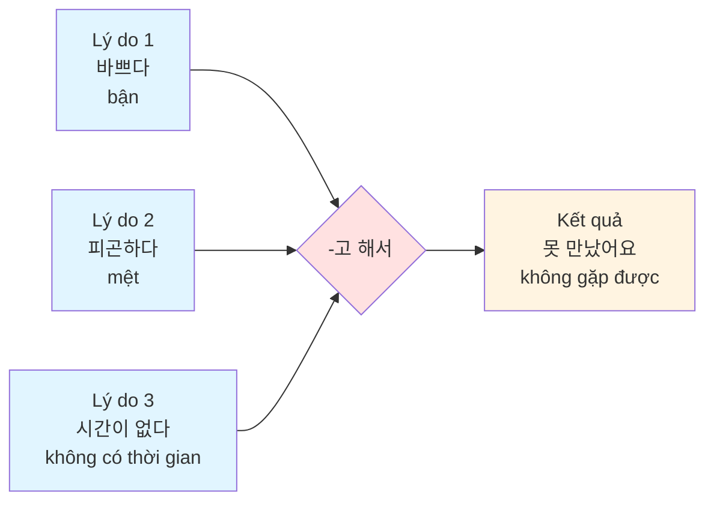
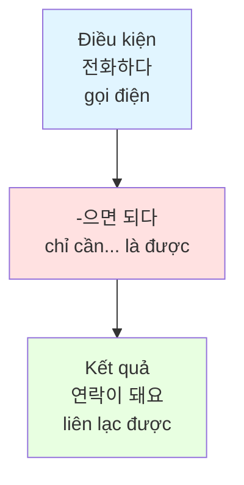
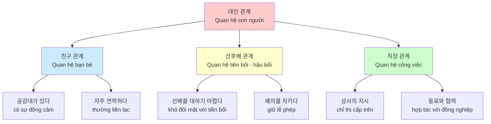
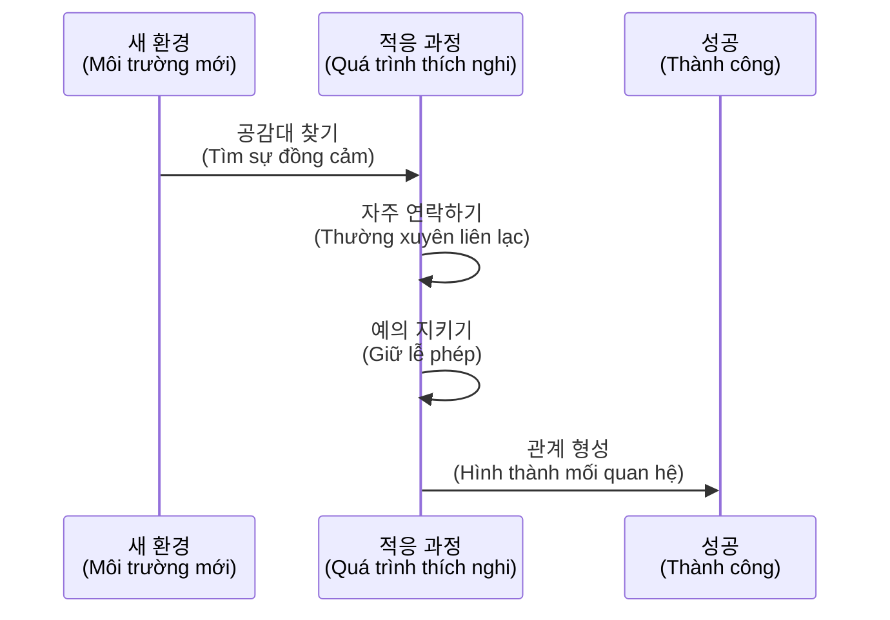

# Bài 1: 대인 관계 (Quan Hệ Con Người)

## 📚 Giới thiệu bài học

**Chủ đề:** Quan hệ con người
**Nội dung chính:**
- Học từ vựng về quan hệ con người
- Học ngữ pháp: -고 해서, -으면 되다
- Thực hành giao tiếp và xưng hô trong tiếng Hàn

---

## 📖 I. TỪ VỰNG

### 1. Từ vựng về quan hệ con người theo nhóm

#### **Nhóm 1: Quan hệ bạn bè và đồng nghiệp**

| Tiếng Hàn | Nghĩa tiếng Việt | Ví dụ |
|-----------|------------------|-------|
| 친구 | Bạn bè | 새로 사귄 친구하고 친해졌어요? (Bạn đã thân với người bạn mới quen chưa?) |
| 동창 | Bạn cùng trường | 초등학교 동창들하고 자주 연락을 주고받고 해서 아직도 만나요. (Tôi thường xuyên liên lạc với bạn tiểu học nên vẫn gặp nhau.) |
| 공감대가 있다 | Có sự đồng cảm | 공감대도 없고 바쁘고 해서 친해지기가 어려워요. (Không có sự đồng cảm và bận rộn nên khó thân thiết.) |
| 사이가 멀어지다 | Xa cách nhau | 고향 친구와 자주 못 만나고 연락도 자주 못하고 해서 사이가 멀어졌어요. (Không gặp thường xuyên và cũng không liên lạc nhiều với bạn ở quê nên xa cách nhau.) |
| 연락이 끊기다 | Mất liên lạc | 자주 연락을 주고받고 해서 연락이 끊기지 않았어요. (Thường xuyên liên lạc qua lại nên không bị mất liên lạc.) |

#### **Nhóm 2: Quan hệ tiền bối - hậu bối**

| Tiếng Hàn | Nghĩa tiếng Việt | Ví dụ |
|-----------|------------------|-------|
| 선배 | Tiền bối, đàn anh/chị | 학교에서 선배를 대하기 어렵다. (Khó đối mặt với tiền bối ở trường.) |
| 후배 | Hậu bối, đàn em | 후배가 나를 어려워하다. (Hậu bối ngại ngùng với tôi.) |
| 선배를 대하기 어렵다 | Khó xử khi đối mặt với tiền bối | 학교에서 선배를 대하기 어렵다. (Khó đối mặt với tiền bối ở trường.) |
| 후배가 나를 어려워하다 | Hậu bối ngại ngùng với tôi | 후배가 나를 어려워하다. (Hậu bối ngại ngùng với tôi.) |

#### **Nhóm 3: Quan hệ công việc và xã hội**

| Tiếng Hàn | Nghĩa tiếng Việt | Ví dụ |
|-----------|------------------|-------|
| 상사 | Cấp trên | 상사 지시를 거절하기도 힘들고 일하는 방법도 잘 모르고 해서 참 힘들어요. (Khó từ chối chỉ thị cấp trên và cũng không rõ phương pháp làm việc nên rất khó khăn.) |
| 동료 | Đồng nghiệp | 동료들하고 함께 시간을 보내면 될 거예요. (Dành thời gian với đồng nghiệp thì sẽ ổn thôi.) |
| 부하 직원 | Nhân viên cấp dưới | 부하 직원과 일하는 방법을 알려주다. (Chỉ dẫn phương pháp làm việc cho nhân viên cấp dưới.) |
| 상사의 지시를 거절하기 힘들다 | Khó từ chối chỉ thị của cấp trên | 상사의 지시를 거절하기 힘들다. (Khó từ chối chỉ thị của cấp trên.) |
| 동료에게 도움을 요청하기 어렵다 | Khó yêu cầu giúp đỡ từ đồng nghiệp | 동료에게 도움을 요청하기 어렵다. (Khó yêu cầu giúp đỡ từ đồng nghiệp.) |
| 일하는 방법을 잘 모르다 | Không rõ phương pháp làm việc | 아직 사람들을 대하기가 어렵고 일하는 방법도 잘 모르고 해서 좀 힘듭니다. (Vẫn còn khó đối mặt với mọi người và cũng không rõ phương pháp làm việc nên hơi vất vả.) |

### 2. Từ vựng về thái độ giao tiếp

| Tiếng Hàn | Nghĩa tiếng Việt | Ví dụ |
|-----------|------------------|-------|
| 자주 연락을 주고받다 | Thường xuyên liên lạc qua lại | 초등학교 동창들하고 자주 연락을 주고받고 해서 아직도 만나요. (Tôi thường xuyên liên lạc với bạn tiểu học nên vẫn gặp nhau.) |
| 이야기를 잘 들어 주다 | Lắng nghe câu chuyện tốt | 친구들 이야기를 잘 들어 주면 된다. (Chỉ cần lắng nghe câu chuyện của bạn bè là được.) |
| 의견을 솔직하게 말하다 | Nói ý kiến một cách thẳng thắn | 의견을 솔직하게 말하고 조금씩 양보하다. (Nói ý kiến thẳng thắn và từng chút một nhượng bộ.) |
| 예의를 지키다 | Giữ lễ phép | 인사를 잘하고 예의를 지키면서 말하다. (Chào hỏi tốt và nói chuyện trong khi giữ lễ phép.) |
| 공감을 잘해 주다 | Đồng cảm tốt | 공감해 주고 같이 고민해 주다. (Đồng cảm và cùng nhau suy nghĩ.) |
| 함께 시간을 보내다 | Dành thời gian cùng nhau | 동료들하고 함께 시간을 보내면 될 거예요. (Dành thời gian với đồng nghiệp thì sẽ ổn thôi.) |

### 3. Các từ vựng quan trọng khác

| Tiếng Hàn | Nghĩa tiếng Việt | Ví dụ |
|-----------|------------------|-------|
| 적응하다 | Thích nghi | 좀 힘들지만 적응하려고 노력 중입니다. (Tuy hơi khó khăn nhưng tôi đang cố gắng thích nghi.) |
| 노력 중이다 | Đang cố gắng | 적응하려고 노력 중입니다. (Đang cố gắng thích nghi.) |
| 관심을 갖다 | Quan tâm | 서로에게 관심을 갖고 이야기를 잘 들어 주다. (Quan tâm lẫn nhau và lắng nghe tốt.) |
| 사귀다 | Kết bạn | 새로 사귄 친구하고 친해졌어요? (Bạn đã thân với người bạn mới quen chưa?) |
| 부족하다 | Thiếu, không đủ | 한국어가 부족하다. (Tiếng Hàn còn thiếu.) |
| 내성적이다 | Hướng nội | 성격도 내성적이고 혼자 있는 걸 좋아하고 해서 사람을 사귀기가 힘들어요. (Tính cách hướng nội và thích ở một mình nên khó kết bạn.) |
| 속도 | Tốc độ | 기능이 다양하고 속도가 빠르면 돼요. (Chỉ cần tính năng đa dạng và tốc độ nhanh là được.) |
| 외우다 | Học thuộc lòng | 단어를 외우다. (Học thuộc từ vựng.) |
| 안부 | Sự bình an (hỏi thăm) | 안부를 묻다. (Hỏi thăm.) |
| 문제를 풀다 | Giải quyết vấn đề | 문제를 풀다. (Giải quyết vấn đề.) |
| 이직 | Chuyển việc | 얼마 전에 회사를 옮겼다. (Cách đây không lâu đã chuyển công ty.) |
| 대부분 | Phần lớn | 새로 간 직장에는 한국 사람이 대부분이다. (Ở nơi làm mới phần lớn là người Hàn.) |
| 피하다 | Tránh né | 선배들과 대화를 피하다. (Tránh trò chuyện với tiền bối.) |
| 사이좋다 | Thân thiết | 부부가 사이좋게 지내다. (Vợ chồng sống hòa thuận với nhau.) |
| 대하다 | Đối xử, đối mặt | 아직 사람들을 대하기가 어렵다. (Vẫn còn khó đối mặt với mọi người.) |
| 지시 | Chỉ thị | 상사 지시를 거절하기도 힘들다. (Khó từ chối chỉ thị cấp trên.) |
| 거절하다 | Từ chối | 상사 지시를 거절하기도 힘들다. (Khó từ chối chỉ thị cấp trên.) |
| 요청 | Yêu cầu | 동료에게 도움을 요청하기 어렵다. (Khó yêu cầu giúp đỡ từ đồng nghiệp.) |
| 방법 | Phương pháp | 일하는 방법을 잘 모르다. (Không rõ phương pháp làm việc.) |
| 이야기를 나누다 | Trò chuyện | 룸메이트하고 솔직한 대화를 나눠 보다. (Trò chuyện thẳng thắn với bạn cùng phòng.) |
| 솔직하다 | Thẳng thắn | 룸메이트하고 솔직한 대화를 나눠 보다. (Trò chuyện thẳng thắn với bạn cùng phòng.) |
| 공감 | Đồng cảm | 공감해 주고 같이 고민해 주다. (Đồng cảm và cùng nhau suy nghĩ.) |
| 말다툼 | Cãi vã | 룸메이트가 한국 사람인데 생활 방식이 달라서 자주 말다툼을 해요. (Bạn cùng phòng là người Hàn mà lối sống khác nhau nên hay cãi vã.) |
| 동호회 | Hội cùng sở thích | 동호회에서 강릉에 가기로 했어요. (Hội cùng sở thích đã quyết định đi Gangneung.) |
| 송년회 | Họp mặt cuối năm | 송년회에 참석하다. (Tham dự họp mặt cuối năm.) |

---

## 📝 II. NGỮ PHÁP

### **1. Cấu trúc: -고 해서**

#### **Ý nghĩa:**
- Diễn tả việc làm gì đó **vì lý do nào đó** (kết hợp nhiều nguyên nhân)
- Tương đương: "vì... và...", "do... nên..."

#### **Cấu trúc:**

```
Động từ/Tính từ + -고 해서
```

#### **Quy tắc biến đổi:**

| Dạng gốc | Cách thêm | Ví dụ |
|----------|-----------|-------|
| Động từ có 받침 | + 고 해서 | 먹다 → 먹고 해서 |
| Động từ không 받침 | + 고 해서 | 바쁘다 → 바쁘고 해서 |

#### **Ví dụ minh họa:**

| Câu tiếng Hàn | Nghĩa tiếng Việt |
|---------------|------------------|
| 조금 전에 샌드위치도 먹고 해서 그냥 사무실에 있으려고요. | Vừa rồi tôi ăn sandwich rồi nên định ở lại văn phòng. |
| 초등학교 동창들하고 자주 연락을 주고받고 해서 아직도 만나요. | Tôi thường xuyên liên lạc với bạn tiểu học nên vẫn gặp nhau. |
| 상사 지시를 거절하기도 힘들고 일하는 방법도 잘 모르고 해서 참 힘들어요. | Khó từ chối chỉ thị cấp trên và cũng không rõ phương pháp làm việc nên rất khó khăn. |

#### **💡 Lưu ý:**
- **'말이다'** sử dụng dạng **'말이고 해서'**

### **2. Cấu trúc: -으면 되다**

#### **Ý nghĩa:**
- Diễn tả việc **chỉ cần làm gì đó là đủ**
- Dùng khi đưa ra điều kiện hoặc phương pháp đơn giản
- Tương đương: "chỉ cần...", "...là được"

#### **Cấu trúc:**

```
Động từ + -으면 되다 / -면 되다
```

#### **Quy tắc biến đổi:**

| Dạng gốc | Cách thêm | Ví dụ |
|----------|-----------|-------|
| Có 받침 | -으면 되다 | 읽다 → 읽으면 되다 |
| Không có 받침 | -면 되다 | 가다 → 가면 되다 |
| 받침 ㄹ | -면 되다 (bỏ ㄹ) | 알다 → 알면 되다 |

#### **Ví dụ minh họa:**

| Câu tiếng Hàn | Nghĩa tiếng Việt |
|---------------|------------------|
| 기능이 다양하고 속도가 빠르면 돼요. | Chỉ cần tính năng đa dạng và tốc độ nhanh là được. |
| 이 약은 식사 후에 드시면 됩니다. | Thuốc này chỉ cần uống sau bữa ăn là được. |
| 수업 신청은 홈페이지에서 하면 돼요. | Đăng ký lớp học chỉ cần làm trên trang chủ là được. |

#### **💡 Lưu ý:**
- **'말이다'** sử dụng dạng **'말이면 되다'**

### **3. So sánh -고 해서 và -으면 되다**

| Ngữ pháp | Chức năng | Ví dụ |
|----------|-----------|-------|
| -고 해서 | Nêu nhiều lý do (nguyên nhân) | 바쁘고 피곤하고 해서 못 갔어요. (Bận và mệt nên không đi được.) |
| -으면 되다 | Đưa ra điều kiện đơn giản | 전화하면 돼요. (Chỉ cần gọi điện là được.) |

---

## 🗣️ III. HỘI THOẠI THỰC HÀNH

### **Tình huống 1: Nói về quan hệ với bạn cùng trường**

```
민수: 여보세요, 새로 사귄 친구하고 친해졌어요?
후엔: 공감대도 없고 바쁘고 해서 친해지기가 어려워요.
```

**Dịch:**
```
Minsu: Xin chào, bạn đã thân với người bạn mới quen chưa?
Huyền: Không có sự đồng cảm và bận rộn nên khó thân thiết.
```

### **Tình huống 2: Sử dụng -고 해서 trong văn phòng**

```
• 사람 사귀기가 힘든 이유: Lý do khó kết bạn
• 한국어를 배우는 이유: Lý do học tiếng Hàn
```

**Ví dụ hội thoại:**
```
성격도 내성적이고 혼자 있는 걸 좋아하고 해서 사람을 사귀기가 힘들어요.
```

**Dịch:**
```
Tính cách hướng nội và thích ở một mình nên khó kết bạn.
```

### **Tình huống 3: Hội thoại về khó khăn tại nơi làm việc**

```
반장님: 참시드 씨가 고민을 이야기합니다. 다음 대화처럼 이야기해 보세요.

Chanshid: 좀 힘들지만 적응하려고 노력 중입니다.

반장님: 힘든 게 있어요? 힘든 게 있으면 말해 봐요.

Chanshid: 아직 사람들을 대하기가 어렵고 일하는 방법도
         잘 모르고 해서 좀 힘듭니다.

반장님: 여기 온 지 얼마 안 돼서 그래요. 좀 익숙해지고
         동료들하고 함께 시간을 보내면 될 거예요.

Chanshid: 네, 반장님. 시간이 지나면 괜찮아지겠지요.
         신경 써 주셔서 감사합니다.
```

**Dịch:**
```
Trưởng nhóm: Chanshid kể về những khó khăn. Hãy nói chuyện như đoạn hội thoại sau.

Chanshid: Tuy hơi khó khăn nhưng tôi đang cố gắng thích nghi.

Trưởng nhóm: Có gì khó khăn không? Nếu có điều gì khó khăn thì cứ nói.

Chanshid: Vẫn còn khó đối mặt với mọi người và cũng không rõ
          phương pháp làm việc nên hơi vất vả.

Trưởng nhóm: Vì anh mới đến đây nên vậy. Quen dần rồi và
              dành thời gian với đồng nghiệp thì sẽ ổn thôi.

Chanshid: Vâng, trưởng nhóm. Chắc qua thời gian sẽ tốt hơn.
          Cảm ơn đã quan tâm.
```

### **Bài tập thực hành 말하기:**

**1) 일하는 방법을 잘 모르다 | 동료들하고 함께 시간을 보내다**
   - Không rõ phương pháp làm việc | Dành thời gian với đồng nghiệp

**2) 공감대가 없다 | 서로에게 관심을 갖고 이야기를 잘 들어 주다**
   - Không có sự đồng cảm | Quan tâm lẫn nhau và lắng nghe tốt

---

## 💡 IV. BÀI TẬP THỰC HÀNH

### **Bài tập 1: Hoàn thành câu với -고 해서**

Điền vào chỗ trống theo mẫu:

**Mẫu:**
고향 친구와 자주 못 만나고 연락도 자주 못하고 해서 사이가 멀어졌어요.

1) 새로 사귄 친구와 _________________ 공감대가 없다
2) 학교에서 선배를 _________________ 한국어가 부족하다
3) 외국 친구와 _________________ 문화가 다르다
4) 한국 사람과 _________________ 말하는 방법을 잘 모르다

### **Bài tập 2: Chọn đáp án đúng với -으면 되다**

Chọn câu trả lời phù hợp:

1) 부부가 사이좋게 지내려면 어떻게 하면 좋을까요?
   - a) 친구를 위로하는 방법
   - b) 서로 관심을 갖고 상대방의 이야기를 잘 들어 주다

2) 선배와 친하게 지내는 방법
   - a) 공감해 주고 같이 고민해 주다
   - b) 인사를 잘하고 예의를 지키면서 말하다

3) 직장 동료와 의견 차이를 좁이는 방법
   - a) 의견을 솔직하게 말하고 조금씩 양보하다
   - b) 자주 연락을 하고 연락을 주고받다

---

## 🎧 V. BÀI TẬP NGHE (듣기)

### **Bài nghe 1: 여러분은 주변 사람들과의 관계가 어떻습니까?**

Nghe và chọn đúng (○) hoặc sai (X):

**친해지기 전에는 사람을 좀 어려워하는 편이에요.**
(Trước khi thân thiết, tôi hơi ngại người khác.)

❶ 성민은 새 학교에서 친구들을 많이 사귀었다.
   - (    )

❷ 성민은 주변에 없는 친구들과 내일 약속이 있다.
   - (    )

❸ 성민의 친구들은 중국에 관심이 많아서 질문이 많다.
   - (    )

---

### **Bài nghe 2: 성민이 엄마에게 들은 이야기**

Chọn câu đúng sau khi nghe:

❶ "친구들 이야기를 잘 들어 주면 된다."

❷ "친구들하고 함께 시간을 보내면 된다."

❸ "친구들하고 싸우지 말고 사이좋게 지내야 한다."

❹ "중국에 대해서 친구들에게 많이 이야기해 주면 좋다."

---

### **Bài nghe 3: 성민이 친구들이 성민에게 중국에 대해 질문을 많이 하는 이유가 무엇입니까?**

**Gợi ý từ vựng:**
- 이야기를 나누다 (trò chuyện)
- 동호회 (hội cùng sở thích)
- 대통령 (tổng thống)

---

### **📝 Phát âm (발음)**

Luyện phát âm các từ sau:

```
     ㅗ    +  [ㄹ]   →   ㅗ    +   [ㄴ]

동료 [동뇨]
강릉 [강늉]
대통령 [대통령]
```

**Quy tắc:**

1) 직장 **동료**와 사이가 멀어졌어요.
   → [동뇨]

2) 동호회에서 강릉에 가기로 했어요.
   → [강늉]

3) 대통령의 말씀이 있겠습니다.
   → [대통령]

---

## 📊 VI. BIỂU ĐỒ MINH HỌA

### **1. Cấu trúc ngữ pháp -고 해서**



### **2. Cấu trúc ngữ pháp -으면 되다**



### **3. Mối quan hệ trong giao tiếp**



### **4. Quy trình thích nghi với môi trường mới**



---

## 📖 VI. BÀI TẬP ĐỌC (읽기)

### **Phần 1: Checklist - 여러분은 한국 사람과의 관계에서 어떤 어려움이 있습니까?**

Đánh dấu vào những khó khăn bạn gặp phải:

- ☐ 문화가 다르다. (Văn hóa khác nhau)
- ☐ (서로에게) 편견을 갖고 있다. (Có định kiến với nhau)
- ☐ 생활 방식이 다르다. (Lối sống khác nhau)
- ☐ 비언어적 표현 사용이 어렵다. (Khó sử dụng ngôn ngữ phi ngôn từ)
- ☐ 무슨 말을 어떻게 해야 하는지 잘 모르겠다. (Không biết nên nói gì và nói như thế nào)
- ☐ 내 의도를 정확하게 표현하기 어렵다. (Khó diễn đạt chính xác ý định của mình)
- ☐ 대화를 이어 나가기 힘들다. (Khó tiếp tục cuộc trò chuyện)
- ☐ 한국 사람은 사전과 다른 의미의 말을 많이 한다. (Người Hàn nói nhiều từ có nghĩa khác với từ điển)

---

### **Phần 2: Đọc bài viết trên diễn đàn**

**인터넷 상담 게시판에 올라온 외국인들의 대인 관계에 대한 고민과 댓글입니다.**

#### **Bài viết 1:**

**제목:** 기숙사 룸메이트가 한국 사람인데 생활 방식이 달라서 자주 말다툼을 해요.

**Dịch:** Bạn cùng phòng ở ký túc xá là người Hàn mà lối sống khác nhau nên hay cãi vã.

**댓글:** 문화가 다르니까 당연히 생활 방식이나 의견에 차이가 있죠. 룸메이트하고 솔직한 대화를 나눠 보는 건 어떨까요?

**Dịch:** Vì văn hóa khác nhau nên đương nhiên sẽ có sự khác biệt về lối sống và ý kiến. Thử trò chuyện thẳng thắn với bạn cùng phòng xem sao?

---

#### **Bài viết 2:**

**제목:** 한국에서는 비언어적 표현 사용이 중요한데 저는 비언어적 표현이 너무 어려워요.

**Dịch:** Ở Hàn Quốc việc sử dụng ngôn ngữ phi ngôn từ rất quan trọng nhưng ngôn ngữ phi ngôn từ quá khó đối với tôi.

**댓글 1:** 맞아요. 비언어적 표현을 배웠지만 그것만으로는 부족해요.

**Dịch:** Đúng vậy. Tôi đã học ngôn ngữ phi ngôn từ nhưng chỉ vậy thôi thì chưa đủ.

**댓글 2:** 저도 한국에서 오래 살았지만 아직도 어려워요. 그래서 평소에 한국 사람들이 이야기하는 것을 신경 써서 듣고 많이 연습해요.

**Dịch:** Tôi cũng sống ở Hàn Quốc lâu rồi nhưng vẫn còn khó. Vì vậy tôi thường chú ý lắng nghe người Hàn nói chuyện và luyện tập nhiều.

---

#### **Bài viết 3:**

**제목:** 한국 친구들하고 이야기할 때 무슨 말을 어떻게 해야 할지 모를 때가 많아요.

**Dịch:** Khi nói chuyện với bạn Hàn Quốc, tôi thường không biết nên nói gì và nói như thế nào.

**댓글 1:** 저도요. 대화를 시작할 수는 있어도 길게 이어 나가기가 힘들어요.

**Dịch:** Tôi cũng vậy. Tôi có thể bắt đầu cuộc trò chuyện nhưng khó kéo dài được.

**댓글 2:** 한국에 처음 왔을 때 저도 그랬어요. 다른 사람 이야기를 듣는 것도 연습이라고 생각하고 너무 스트레스 받지 마세요.

**Dịch:** Khi mới đến Hàn Quốc, tôi cũng vậy. Hãy nghĩ rằng việc nghe người khác nói cũng là luyện tập và đừng quá căng thẳng.

---

#### **Bài viết 4:**

**제목:** 한국 사람들하고 같은 대화를 못 하니까 친구 되기가 힘든 것 같아요.

**Dịch:** Vì không thể nói chuyện như người Hàn nên có vẻ khó kết bạn.

**댓글 1:** 맞아요. 의도를 정확하게 표현하기 어려워서 간단한 말만 하니까 답답할 때가 많아요.

**Dịch:** Đúng vậy. Vì khó diễn đạt chính xác ý định nên chỉ nói những lời đơn giản, thường cảm thấy bí bách.

**댓글 2:** 같은 대화는 못 하지만 항상 진심으로 대하면 한국 사람들도 그 마음을 알아줄 거예요.

**Dịch:** Tuy không thể nói chuyện giống nhau nhưng nếu luôn đối xử chân thành thì người Hàn cũng sẽ hiểu được tấm lòng đó.

---

### **Phần 3: Đọc bài viết Q&A**

**제목:** 직장 선배들과 잘 지내고 싶어요.

안녕하세요. 저는 한국에 온 지 1년 정도 된 베트남 사람입니다.

그동안 베트남 사람들이 많은 직장에 다녔는데 얼마 전에 이직을 했습니다. 새 직장에는 한국 사람들이 많고 대부분 저보다 연세가 많으신 분들입니다. 그분들과 매일 같이 일하고 식사도 하면서 함께 시간을 보내는 일이 많습니다. 그런데 대화를 하면 "윗사람한테 그렇게 말하면 안 되지"라고 말씀하실 때가 많습니다. 그럴 때마다 선배를 기분이 나쁘게 한 것 같아서 마음이 불편합니다. 이런 일이 자주 생겨서 요즘은 선배들하고 같이 있는 자리를 피하고 싶다.

한국에서는 높임말 사용이 중요한데 저는 높임말이 아직도 너무 어렵습니다. 한국어를 배울 때 높임말을 배우기는 했지만 그것만으로는 부족한 것 같습니다. 제 의도를 정확하게 표현하기도 힘들고 무슨 말을 어떻게 할지 잘 모르겠습니다.

이 직장에서 선배들과 잘 지내고 싶은데 어떻게 하면 좋을까요?

**Dịch:**

**Tiêu đề:** Tôi muốn hòa thuận với tiền bối ở công ty.

Xin chào. Tôi là người Việt Nam đã đến Hàn Quốc được khoảng 1 năm.

Trong thời gian qua tôi làm việc ở công ty có nhiều người Việt Nam, nhưng cách đây không lâu tôi đã chuyển việc. Ở công ty mới có nhiều người Hàn Quốc và phần lớn là những người lớn tuổi hơn tôi. Tôi thường xuyên dành thời gian cùng họ, mỗi ngày cùng làm việc và ăn uống. Nhưng khi trò chuyện, họ thường nói "Không nên nói như vậy với người lớn tuổi". Mỗi lần như vậy, tôi cảm thấy khó chịu vì có vẻ đã làm tiền bối khó chịu. Vì việc này xảy ra thường xuyên nên dạo này tôi muốn tránh những lúc ở cùng với các tiền bối.

Ở Hàn Quốc, việc sử dụng kính ngữ rất quan trọng nhưng kính ngữ vẫn còn quá khó đối với tôi. Khi học tiếng Hàn, tôi có học kính ngữ nhưng có vẻ như chỉ vậy là chưa đủ. Tôi cũng khó diễn đạt chính xác ý định của mình và không biết nên nói gì và nói như thế nào.

Tôi muốn hòa thuận với các tiền bối ở công ty này, vậy tôi nên làm thế nào?

---

### **Câu hỏi đọc hiểu:**

**1) 이 사람이 어려워하는 것이 무엇입니까?**

**2) 윗글의 내용과 같으면 ○, 다르면 X 하세요.**

❶ 이 사람은 얼마 전에 회사를 옮겼다. (    )

❷ 새 직장 선배들의 나이가 많아서 기분이 나쁘다. (    )

❸ 한국어를 배울 때 비언어적 표현을 배우지 못했다. (    )

**3) 윗글의 내용과 다른 것을 고르세요.**

❶ 이 사람은 1년 전에 한국에 왔다.

❷ 새로 간 직장에는 한국 사람이 많다.

❸ 이 사람은 요즘 선배들과 대화를 많이 하려고 한다.

❹ 이 사람은 대화할 때 의도를 정확하게 표현하기 힘들어한다.

**Gợi ý từ vựng:**
- 이직 (chuyển việc)
- 웃기다 (hài hước, buồn cười)
- 대부분 (phần lớn)
- 피하다 (tránh né)

---

## 🎯 VII. CÁC TÌNH HUỐNG GIAO TIẾP THỰC TẾ

### **Tình huống 1: Khi gặp khó khăn trong quan hệ công việc**

**Vấn đề:**
여러분은 주변 사람들과의 관계에서 어떤 고민이 있어요?

**Cách giải quyết:**

| Quan hệ | Vấn đề | Giải pháp |
|---------|--------|-----------|
| Với bạn bè | 공감대가 없다 | 자주 연락을 주고받다 + 이야기를 잘 들어 주다 |
| Với tiền bối | 선배를 대하기 어렵다 | 항상 예의를 지키다 + 인사를 잘하다 |
| Với cấp trên | 지시를 거절하기 힘들다 | 의견을 솔직하게 말하고 조언을 구하다 |

### **Tình huống 2: Khi muốn cải thiện mối quan hệ**

**Hội thoại mẫu:**

```
A: 친구들과 어떻게 지내고 있어요?
B: 저는 친구들과 연락도 자주 못하고 이야기도 많이 못 나눠요.
```

---

## 📚 VIII. VĂN HÓA HÀN QUỐC - 친목 활동

### **Hoạt động thân mật của người Hàn Quốc**

Người Hàn Quốc coi trọng việc xây dựng mối quan hệ thân thiết trong xã hội, được gọi là **"동창회"** (hội bạn cùng trường) hoặc **"동호회"** (hội cùng sở thích).

**Các đặc điểm:**

- 🎓 **송년회, 체육 대회**: Các buổi họp mặt cuối năm, hội thao
- 🍽️ **함께 식사**: Ăn uống cùng nhau để gắn kết
- ⚽ **동호회 활동**: Hoạt động câu lạc bộ cùng sở thích
- 🏫 **학교, 지역, 직장 커뮤니티**: Cộng đồng trường học, địa phương, nơi làm việc

**Các hình thức giao tiếp phổ biến:**

1. **동창회** - Hội đồng môn
2. **동호회** - Hội cùng sở thích
3. **여러분 고향에는 어떤 모임이 있나요?** - Ở quê bạn có những hội nào?

---

## ✏️ IX. BÀI TẬP VIẾT (쓰기)

### **Bài viết 1: 여러분은 한국인과의 관계에서 어려운 점이 있었습니까?**

Viết về những khó khăn bạn gặp phải khi giao tiếp với người Hàn Quốc.

**Template hướng dẫn:**

```
한국인과의 관계에서 어려운 점                    극복 방법

┌─────────────────────────┐        ┌─────────────────────────┐
│                         │   →    │                         │
│  (Khó khăn 1)           │        │  (Cách giải quyết 1)    │
│                         │        │                         │
└─────────────────────────┘        └─────────────────────────┘

┌─────────────────────────┐        ┌─────────────────────────┐
│                         │   →    │                         │
│  (Khó khăn 2)           │        │  (Cách giải quyết 2)    │
│                         │        │                         │
└─────────────────────────┘        └─────────────────────────┘

┌─────────────────────────┐        ┌─────────────────────────┐
│                         │   →    │                         │
│  (Khó khăn 3)           │        │  (Cách giải quyết 3)    │
│                         │        │                         │
└─────────────────────────┘        └─────────────────────────┘
```

---

### **Bài viết 2: 한국에 온 지 얼마 안 된 외국인 친구에게 한국인 친구를 잘 사귀는 방법에 대해서 조언하는 글을 쓰세요.**

Viết bài tư vấn về cách kết bạn với người Hàn cho người nước ngoài mới đến Hàn Quốc.

**Gợi ý cấu trúc bài viết:**

1. **Mở bài:** Giới thiệu tình huống
2. **Thân bài:**
   - Khó khăn khi kết bạn với người Hàn
   - Các phương pháp cụ thể để kết bạn
   - Ví dụ thực tế
3. **Kết bài:** Lời khuyên và động viên

**Các cụm từ hữu ích:**

- 자주 연락을 주고받다 (thường xuyên liên lạc)
- 이야기를 잘 들어 주다 (lắng nghe tốt)
- 의견을 솔직하게 말하다 (nói ý kiến thẳng thắn)
- 예의를 지키다 (giữ lễ phép)
- 공감을 잘해 주다 (đồng cảm tốt)
- 함께 시간을 보내다 (dành thời gian cùng nhau)
- 적응하다 (thích nghi)
- 노력하다 (cố gắng)

---

## ✍️ X. BÀI TẬP MỞ RỘNG

### **Câu hỏi tư duy:**

1. **여러분은 한국인과의 관계에서 어려운 점이 있었습니까?**
   Bạn có gặp khó khăn gì trong quan hệ với người Hàn không?

2. **한국에 온 지 얼마 안 된 외국인 친구에게 한국인 친구를 잘 사귀는 방법에 대해서 조언하는 글을 쓰세요.**
   Hãy viết bài tư vấn về cách kết bạn với người Hàn cho người nước ngoài mới đến Hàn Quốc.

### **Bảng từ vựng về hoạt động thân mật**

| Tiếng Hàn | Nghĩa tiếng Việt |
|-----------|------------------|
| 공감대가 있다 | Có sự đồng cảm |
| 사이가 멀어지다 | Xa cách |
| 사이좋다 | Thân thiết |
| 위로 | An ủi |
| 선배 | Tiền bối |
| 후배 | Hậu bối |
| 상사 | Cấp trên |
| 지시 | Chỉ thị |
| 거절하다 | Từ chối |
| 요청 | Yêu cầu |
| 속도 | Tốc độ |
| 관심을 갖다 | Quan tâm |
| 사귀다 | Kết bạn |
| 안부 | Hỏi thăm |
| 문제를 풀다 | Giải quyết vấn đề |
| 외우다 | Học thuộc |
| 적응하다 | Thích nghi |
| 노력 중이다 | Đang cố gắng |
| 이직 | Chuyển công việc |
| 대부분 | Phần lớn |
| 피하다 | Tránh né |
| 내성적이다 | Hướng nội |

---

## 🎓 XI. TÓM TẮT BÀI HỌC

### **Điểm chính cần ghi nhớ:**

1. ✅ **Từ vựng:** Các từ về quan hệ con người (bạn bè, tiền bối - hậu bối, cấp trên - cấp dưới)
2. ✅ **Ngữ pháp 1:** -고 해서 (nêu nhiều lý do)
3. ✅ **Ngữ pháp 2:** -으면 되다 (chỉ cần... là được)
4. ✅ **Văn hóa:** Hoạt động thân mật trong xã hội Hàn Quốc

### **Công thức ghi nhớ nhanh:**

```
🔹 -고 해서 = Lý do 1 + 고 해서 + Lý do 2 + 결과
🔹 -으면 되다 = Điều kiện + (으)면 되다
```

---

## 📖 XII. PHU LỤC

### **Danh sách từ vựng đầy đủ theo bảng chữ cái**

| STT | Tiếng Hàn | Nghĩa tiếng Việt |
|-----|-----------|------------------|
| 1 | 거절하다 | Từ chối |
| 2 | 공감 | Đồng cảm |
| 3 | 공감대가 있다 | Có sự đồng cảm |
| 4 | 공감을 잘해 주다 | Đồng cảm tốt |
| 5 | 관심을 갖다 | Quan tâm |
| 6 | 노력 중이다 | Đang cố gắng |
| 7 | 내성적이다 | Hướng nội |
| 8 | 대부분 | Phần lớn |
| 9 | 대하다 | Đối xử, đối mặt |
| 10 | 동료 | Đồng nghiệp |
| 11 | 동창 | Bạn cùng trường |
| 12 | 동호회 | Hội cùng sở thích |
| 13 | 말다툼 | Cãi vã |
| 14 | 방법 | Phương pháp |
| 15 | 부족하다 | Thiếu |
| 16 | 부하 직원 | Nhân viên cấp dưới |
| 17 | 사귀다 | Kết bạn |
| 18 | 사이가 멀어지다 | Xa cách |
| 19 | 사이좋다 | Thân thiết |
| 20 | 상사 | Cấp trên |
| 21 | 선배 | Tiền bối |
| 22 | 솔직하다 | Thẳng thắn |
| 23 | 송년회 | Họp mặt cuối năm |
| 24 | 속도 | Tốc độ |
| 25 | 안부 | Hỏi thăm |
| 26 | 연락이 끊기다 | Mất liên lạc |
| 27 | 외우다 | Học thuộc |
| 28 | 요청 | Yêu cầu |
| 29 | 위로 | An ủi |
| 30 | 이야기를 나누다 | Trò chuyện |
| 31 | 이직 | Chuyển việc |
| 32 | 적응하다 | Thích nghi |
| 33 | 지시 | Chỉ thị |
| 34 | 친구 | Bạn bè |
| 35 | 피하다 | Tránh né |
| 36 | 후배 | Hậu bối |
| 37 | 문제를 풀다 | Giải quyết vấn đề |

---

**Chúc bạn học tốt!** 📚✨
