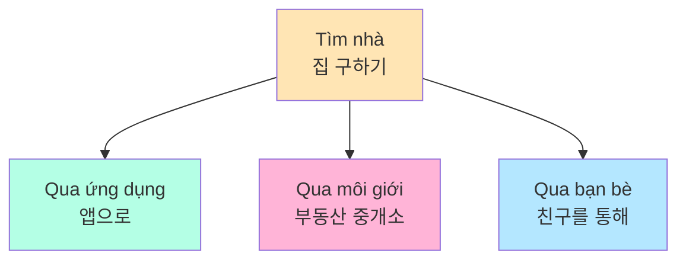
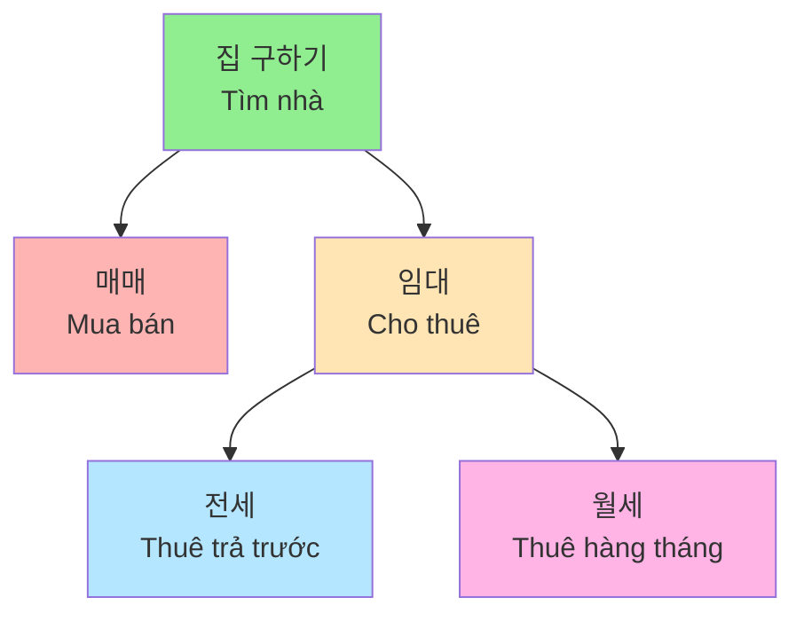
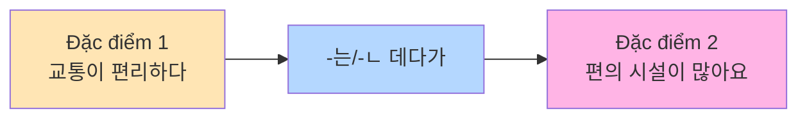
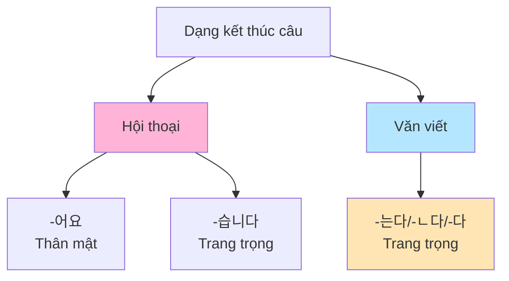
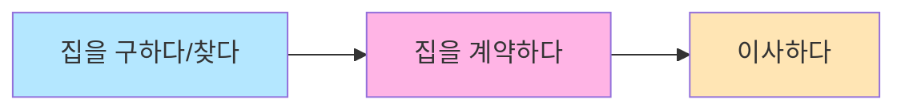
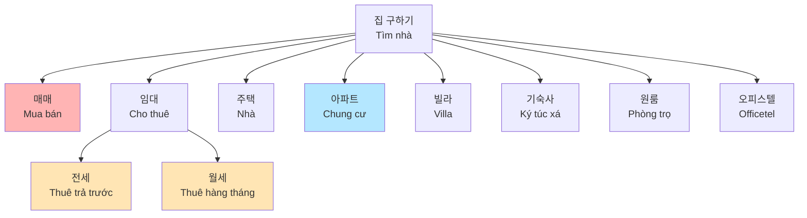
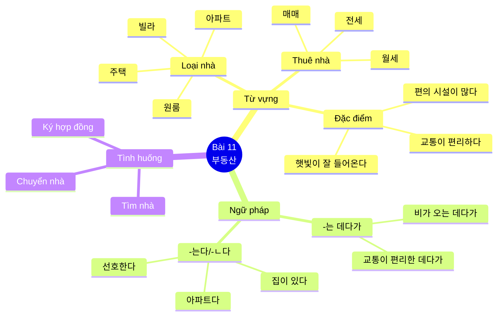

# Bài 11: 부동산 (Bất động sản)

## 📋 Mục tiêu bài học

- **Từ vựng**: Học các từ vựng liên quan đến bất động sản, loại nhà, thuê nhà
- **Ngữ pháp**:
  - **-는 데다가** (Không những... mà còn...)
  - **-는다/-ㄴ다** (Dạng kết thúc câu dùng trong văn viết trang trọng)

---

## 🎯 KHỞI ĐỘNG

### Câu hỏi mở đầu

Hãy quan sát các hình ảnh và trả lời câu hỏi:

**이 사람들은 무엇을 하고 있어요?**
(Những người này đang làm gì?)

**여러분은 집을 어떻게 구했어요?**
(Các bạn đã tìm nhà như thế nào?)



---

## 📚 I. TỪ VỰNG

### 1. Các loại nhà ở

| STT | Từ vựng tiếng Hàn | Nghĩa tiếng Việt | Ví dụ |
|-----|------------------|------------------|-------|
| 1 | 주택 | Nhà ở | 가장 많이 볼 수 있는 집은 아파트다 (Loại nhà thấy nhiều nhất là chung cư) |
| 2 | 아파트 | Chung cư | 아파트는 사람이 많이 살 수 있는 데다가 편리하고 다양한 편의 시설이 있다 (Chung cư vừa có thể ở được nhiều người vừa tiện lợi và có nhiều tiện ích) |
| 3 | 오피스텔 | Officetel (nhà ở kết hợp văn phòng) | 오피스텔 (Officetel) |
| 4 | 빌라 | Villa | 방 두 개인 월세 빌라를 찾고 있어요 (Tôi đang tìm villa thuê hàng tháng có 2 phòng) |
| 5 | 원룸 | Phòng trọ một phòng | 원룸 (Phòng trọ một phòng) |
| 6 | 기숙사 | Ký túc xá | 기숙사 (Ký túc xá) |
| 7 | 매매 | Mua bán | 집 구하기: 매매 (Tìm nhà: Mua bán) |
| 8 | 임대 | Cho thuê | 집 구하기: 임대 (Tìm nhà: Cho thuê) |
| 9 | 전세 | Thuê trả trước toàn bộ tiền cọc | 월세/전세 (Thuê hàng tháng/Thuê trả trước) |
| 10 | 월세 | Thuê trả hàng tháng | 방 두 개인 월세 빌라를 찾고 있어요 (Tôi đang tìm villa thuê hàng tháng có 2 phòng) |

### 2. Từ vựng về đặc điểm nhà

| STT | Từ vựng tiếng Hàn | Nghĩa tiếng Việt | Ví dụ |
|-----|------------------|------------------|-------|
| 1 | 교통 | Giao thông | 이 집은 교통도 편리한 데다가 주변에 편의 시설도 많아요 (Ngôi nhà này giao thông thuận tiện mà còn xung quanh có nhiều tiện ích) |
| 2 | 편리하다 | Thuận tiện | 교통이 편리한 데다가 지하철역도 가까워요 (Giao thông thuận tiện mà ga tàu điện cũng gần) |
| 3 | 불편하다 | Bất tiện | 교통이 불편하다 (Giao thông bất tiện) |
| 4 | 지하철역/버스 정류장이 가깝다/멀다 | Ga tàu điện ngầm/Trạm xe buýt gần/xa | 근처에 지하철역이 있으면 좋겠어요 (Gần đó có ga tàu điện thì tốt) |
| 5 | 주차할 곳이 있다/없다 | Có/Không có chỗ đỗ xe | 주차할 곳이 있다/없다 (Có/Không có chỗ đỗ xe) |
| 6 | 집 근처에 교육 시설이 있다 | Gần nhà có cơ sở giáo dục | 집 근처에 교육 시설이 있다 (Gần nhà có cơ sở giáo dục) |
| 7 | 주변 환경 | Môi trường xung quanh | 주변 환경이 깨끗하고 안전하다 (Môi trường xung quanh sạch sẽ và an toàn) |
| 8 | 다양한 편의 시설이 많다/적다 | Có nhiều/ít tiện ích đa dạng | 이 집은 교통도 편리한 데다가 주변에 편의 시설도 많아요 (Ngôi nhà này giao thông thuận tiện mà còn xung quanh có nhiều tiện ích) |
| 9 | 시장, 마트, 편의점, 쇼핑몰이 있다/없다 | Có/Không có chợ, siêu thị, cửa hàng tiện lợi, trung tâm mua sắm | 시장, 마트, 편의점, 쇼핑몰이 있다 (Có chợ, siêu thị, cửa hàng tiện lợi, trung tâm mua sắm) |
| 10 | 공원, 산책로가 있다/없다 | Có/Không có công viên, đường dạo | 공원, 산책로가 있다/없다 (Có/Không có công viên, đường dạo) |
| 11 | 학교가 가까워서 교육 환경이 좋다/나쁘다 | Trường học gần nên môi trường giáo dục tốt/xấu | 학교, 학원 등 교육 환경이 좋다 (Trường học, trung tâm v.v. môi trường giáo dục tốt) |
| 12 | 집 내부 환경 | Môi trường bên trong nhà | 집 내부 환경 (Môi trường bên trong nhà) |
| 13 | 전망이 좋다/나쁘다 | Tầm nhìn tốt/xấu | 전망이 좋다/나쁘다 (Tầm nhìn tốt/xấu) |
| 14 | 햇빛이 잘 들어오다 | Ánh sáng tự nhiên tốt | 햇빛이 잘 들어오다 (Ánh sáng tự nhiên tốt) |
| 15 | 방/거실/화장실/부엌이 넓다 | Phòng ngủ/Phòng khách/Nhà vệ sinh/Bếp rộng | 방/거실/화장실/부엌이 넓다 (Phòng ngủ/Phòng khách/Nhà vệ sinh/Bếp rộng) |
| 16 | 침대/책상/세탁기/냉장고 옵션이 있다/없다 | Có/Không có giường/bàn/máy giặt/tủ lạnh đi kèm | 침대/책상/세탁기/냉장고 옵션이 있다 (Có giường/bàn/máy giặt/tủ lạnh đi kèm) |

### 3. Từ vựng về thuê nhà

| STT | Từ vựng tiếng Hàn | Nghĩa tiếng Việt | Ví dụ |
|-----|------------------|------------------|-------|
| 1 | 집 구하기 | Tìm nhà | 집 구하기: 매매 임대 (Tìm nhà: Mua bán hoặc Cho thuê) |
| 2 | 집을 구하다/찾다 | Tìm nhà | 방 두 개인 월세 빌라를 찾고 있어요 (Tôi đang tìm villa thuê hàng tháng có 2 phòng) |
| 3 | 계약하다 | Ký hợp đồng | 계약하기 전에 등기부 등본을 확인해야 한다 (Trước khi ký hợp đồng cần xác nhận bản sao đăng ký) |
| 4 | 이사하다 | Chuyển nhà | 저는 방이 너무 좁아서 이사하려고 합니다 (Tôi định chuyển nhà vì phòng quá chật) |
| 5 | 도보 | Đi bộ | 걸어서 5분 거리에 지하철역이 있어요 (Đi bộ 5 phút có ga tàu điện) |
| 6 | 등기부 등본 | Bản sao đăng ký bất động sản | 계약하기 전에 등기부 등본을 확인해야 한다 (Trước khi ký hợp đồng cần xác nhận bản sao đăng ký) |
| 7 | 부동산 중개소 | Văn phòng môi giới bất động sản | 안녕하세요? 집 좀 보려고 하는데요 (Xin chào, tôi muốn xem nhà) |
| 8 | 신축 | Mới xây | 마침 새로 나온 집이 있어요 (Vừa có nhà mới ra) |
| 9 | 역세권 | Khu vực gần ga tàu điện | 근처에 지하철역이 있으면 좋겠어요 (Gần đó có ga tàu điện thì tốt) |
| 10 | 특약 사항 | Điều khoản đặc biệt | 계약서의 특약 사항을 확인해야 한다 (Cần xác nhận điều khoản đặc biệt trong hợp đồng) |
| 11 | 엄선 | Lựa chọn kỹ | 집을 구할 때는 집의 상태를 꼼꼼하게 살펴보는 것이 좋다 (Khi tìm nhà nên xem xét kỹ tình trạng của nhà) |
| 12 | 층간 소음 | Tiếng ồn giữa các tầng | 저는 방이 너무 좁은 데다가 시끄럽기까지 해요 (Phòng quá chật mà còn ồn ào nữa) |
| 13 | 벌레 | Côn trùng, sâu bọ | 집의 상태를 꼼꼼하게 살펴보는 것이 좋다 (Nên xem xét kỹ tình trạng của nhà) |
| 14 | 난방 | Sưởi ấm, hệ thống sưởi | 남향인 데다가 새로 수리해서 깨끗하고요 (Hướng Nam mà còn vừa sửa nên sạch sẽ) |
| 15 | 대중교통 | Phương tiện công cộng | 교통이 편리한 데다가 지하철역도 가까워요 (Giao thông thuận tiện mà ga tàu điện cũng gần) |
| 16 | 은행 | Ngân hàng | 주변에 편의 시설도 많아요 (Xung quanh có nhiều tiện ích) |
| 17 | 병원 | Bệnh viện | 주변에 편의 시설도 많아요 (Xung quanh có nhiều tiện ích) |
| 18 | 문 | Cửa | 문, 창문, 싱크대, 세면대, 변기 등 고장 난 곳은 없는지 살펴봐야 한다 (Cần xem cửa, cửa sổ, bồn rửa, lavabo, bồn cầu v.v. có chỗ nào hỏng không) |
| 19 | 창문 | Cửa sổ | 문, 창문, 싱크대, 세면대, 변기 등 고장 난 곳은 없는지 살펴봐야 한다 (Cần xem cửa, cửa sổ, bồn rửa, lavabo, bồn cầu v.v. có chỗ nào hỏng không) |
| 20 | 싱크대 | Bồn rửa | 문, 창문, 싱크대, 세면대, 변기 등 고장 난 곳은 없는지 살펴봐야 한다 (Cần xem cửa, cửa sổ, bồn rửa, lavabo, bồn cầu v.v. có chỗ nào hỏng không) |
| 21 | 세면대 | Lavabo | 문, 창문, 싱크대, 세면대, 변기 등 고장 난 곳은 없는지 살펴봐야 한다 (Cần xem cửa, cửa sổ, bồn rửa, lavabo, bồn cầu v.v. có chỗ nào hỏng không) |
| 22 | 변기 | Bồn cầu | 문, 창문, 싱크대, 세면대, 변기 등 고장 난 곳은 없는지 살펴봐야 한다 (Cần xem cửa, cửa sổ, bồn rửa, lavabo, bồn cầu v.v. có chỗ nào hỏng không) |
| 23 | 집주인 | Chủ nhà | 집주인과 계약서를 쓸 때 특약 사항을 확인해야 한다 (Khi viết hợp đồng với chủ nhà cần xác nhận điều khoản đặc biệt) |
| 24 | 계약서 | Hợp đồng | 집주인과 계약서를 쓸 때 특약 사항을 확인해야 한다 (Khi viết hợp đồng với chủ nhà cần xác nhận điều khoản đặc biệt) |

### 4. Các động từ và tính từ quan trọng

| STT | Từ vựng tiếng Hàn | Nghĩa tiếng Việt | Ví dụ |
|-----|------------------|------------------|-------|
| 1 | 가깝다 | Gần (về khoảng cách) | 교통이 편리한 데다가 지하철역도 가까워요 (Giao thông thuận tiện mà ga tàu điện cũng gần) |
| 2 | 멀다 | Xa (về khoảng cách) | 지하철역/버스 정류장이 가깝다/멀다 (Ga tàu điện ngầm/Trạm xe buýt gần/xa) |
| 3 | 있다 | Có | 마침 새로 나온 집이 있어요 (Vừa có nhà mới ra) |
| 4 | 없다 | Không có | 주차할 곳이 있다/없다 (Có/Không có chỗ đỗ xe) |
| 5 | 넓다 | Rộng | 방/거실/화장실/부엌이 넓다 (Phòng ngủ/Phòng khách/Nhà vệ sinh/Bếp rộng) |
| 6 | 좁다 | Hẹp | 저는 방이 너무 좁아서 이사하려고 합니다 (Tôi định chuyển nhà vì phòng quá chật) |
| 7 | 밝다 | Sáng | 햇빛이 잘 들어오면 방이 밝다 (Nếu ánh sáng tự nhiên tốt thì phòng sáng) |
| 8 | 어둡다 | Tối | 햇빛이 안 들어오면 방이 어둡다 (Nếu không có ánh sáng tự nhiên thì phòng tối) |
| 9 | 조용하다 | Yên tĩnh | 주변 환경이 깨끗하고 안전하다 (Môi trường xung quanh sạch sẽ và an toàn) |
| 10 | 시끄럽다 | Ồn ào | 저는 방이 너무 좁은 데다가 시끄럽기까지 해요 (Phòng quá chật mà còn ồn ào nữa) |
| 11 | 깨끗하다 | Sạch sẽ | 남향인 데다가 새로 수리해서 깨끗하고요 (Hướng Nam mà còn vừa sửa nên sạch sẽ) |
| 12 | 지저분하다 | Bẩn, lộn xộn | 주변 환경이 깨끗하다/지저분하다 (Môi trường xung quanh sạch sẽ/bẩn) |
| 13 | 안전하다 | An toàn | 주변 환경이 깨끗하고 안전하다 (Môi trường xung quanh sạch sẽ và an toàn) |
| 14 | 고장 나다 | Hỏng | 문, 창문, 싱크대, 세면대, 변기 등 고장 난 곳은 없는지 살펴봐야 한다 (Cần xem cửa, cửa sổ, bồn rửa, lavabo, bồn cầu v.v. có chỗ nào hỏng không) |
| 15 | 살펴보다 | Xem xét, kiểm tra | 집을 구할 때는 집의 상태를 꼼꼼하게 살펴보는 것이 좋다 (Khi tìm nhà nên xem xét kỹ tình trạng của nhà) |
| 16 | 선호하다 | Ưa thích | 사람들은 시설이 좋고 교통이 편리한 집을 선호한다 (Mọi người ưa thích nhà có tiện ích tốt và giao thông thuận tiện) |
| 17 | 확인하다 | Xác nhận | 계약하기 전에 등기부 등본을 확인해야 한다 (Trước khi ký hợp đồng cần xác nhận bản sao đăng ký) |
| 18 | 들어오다 | Vào, đi vào | 햇빛이 잘 들어오다 (Ánh sáng tự nhiên tốt) |
| 19 | 나다 | Sinh ra, xuất hiện | 마침 새로 나온 집이 있어요 (Vừa có nhà mới ra) |
| 20 | 꼼꼼하게 | Kỹ càng, tỉ mỉ | 집을 구할 때는 집의 상태를 꼼꼼하게 살펴보는 것이 좋다 (Khi tìm nhà nên xem xét kỹ tình trạng của nhà) |

### 5. Từ vựng trong hợp đồng thuê nhà

| STT | Từ vựng tiếng Hàn | Nghĩa tiếng Việt | Ví dụ |
|-----|------------------|------------------|-------|
| 1 | 집의 위치 | Vị trí nhà | 걸어서 5분 거리에 지하철역이 있어요 (Đi bộ 5 phút có ga tàu điện) |
| 2 | 집의 형태 | Loại nhà | 원룸, 주택, 빌라, 아파트 (Phòng trọ, nhà, villa, chung cư) |
| 3 | 원룸, 주택, 빌라, 아파트 | Phòng trọ, nhà, villa, chung cư | 방 두 개인 월세 빌라를 찾고 있어요 (Tôi đang tìm villa thuê hàng tháng có 2 phòng) |
| 4 | 집의 구조 | Cấu trúc nhà | 방, 거실, 부엌, 마당 등 (Phòng ngủ, phòng khách, bếp, sân, v.v.) |
| 5 | 방, 거실, 부엌, 마당 등 | Phòng ngủ, phòng khách, bếp, sân, v.v. | 방/거실/화장실/부엌이 넓다 (Phòng ngủ/Phòng khách/Nhà vệ sinh/Bếp rộng) |
| 6 | 집 주변 환경 | Môi trường xung quanh nhà | 주변 환경이 깨끗하고 안전하다 (Môi trường xung quanh sạch sẽ và an toàn) |

### 6. Bài tập phân loại đặc điểm nhà

#### 1. 집의 종류에는 어떤 것이 있어요? 집을 어떻게 구했어요?

**Sơ đồ phân loại nhà và cách thuê:**



**Các loại nhà:**
- 주택 (Nhà)
- 빌라 (Villa)
- 기숙사 (Ký túc xá)
- 아파트 (Chung cư)
- 오피스텔 (Officetel)
- 원룸 (Phòng trọ)

#### 2. 여러분은 집을 구할 때 무엇을 중요하게 생각해요?

**Hãy xem và nói về 3 nhóm tiêu chí quan trọng khi tìm nhà:**

**A. 교통 (Giao thông)**

| Tiêu chí | Tích cực / Tiêu cực |
|----------|---------------------|
| 교통이 편리하다/불편하다 | Giao thông thuận tiện / bất tiện |
| 지하철역/버스 정류장이 가깝다/멀다 | Ga tàu điện/Trạm xe buýt gần / xa |
| 주차할 곳이 있다/없다 | Có / Không có chỗ đậu xe |
| 집 근처에 교육 시설이 있다 | Gần nhà có cơ sở giáo dục |

**B. 주변 환경 (Môi trường xung quanh)**

| Tiêu chí | Tích cực / Tiêu cực |
|----------|---------------------|
| 다양한 편의 시설이 많다/적다 | Có nhiều / ít tiện ích đa dạng |
| 시장, 마트, 편의점, 쇼핑몰이 있다/없다 | Có / Không có chợ, siêu thị, cửa hàng tiện lợi, trung tâm mua sắm |
| 공원, 산책로가 있다/없다 | Có / Không có công viên, đường dạo |
| 학교가 가까워서 교육 환경이 좋다/나쁘다 | Trường học gần nên môi trường giáo dục tốt / xấu |

**C. 집 내부 환경 (Môi trường bên trong nhà)**

| Tiêu chí | Tích cực / Tiêu cực |
|----------|---------------------|
| 전망이 좋다/나쁘다 | Tầm nhìn tốt / xấu |
| 햇빛이 잘 들어오다 | Ánh sáng tự nhiên tốt |
| 방/거실/화장실/부엌이 넓다 | Phòng ngủ/Phòng khách/Nhà vệ sinh/Bếp rộng |
| 침대/책상/세탁기/냉장고 옵션이 있다/없다 | Có / Không có giường/bàn/máy giặt/tủ lạnh đi kèm |

---

## 📝 II. NGỮ PHÁP

### 1. **-는 데다가** (Không những... mà còn...)

#### Ý nghĩa
Cấu trúc này dùng để thêm thông tin hoặc đặc điểm khác vào tình huống hoặc đối tượng đã được nói đến, thường với ý nghĩa tích cực hoặc tiêu cực tương tự nhau. Có thể hiểu là "không những... mà còn...", "vừa... vừa...".

#### Cấu trúc

```
Động từ/Tính từ + -는/-ㄴ 데다가
```

#### Quy tắc sử dụng

| Loại từ | Cách chia | Ví dụ |
|---------|----------|-------|
| **Động từ gốc có nguyên âm cuối** | + **는 데다가** | 먹다 → 먹**는 데다가** |
| **Động từ gốc có phụ âm cuối** | + **는 데다가** | 있다 → 있**는 데다가** |
| **Tính từ gốc có nguyên âm cuối** | + **ㄴ 데다가** | 크다 → 크**ㄴ 데다가** |
| **Tính từ gốc có phụ âm cuối** | + **은 데다가** | 좋다 → 좋**은 데다가** |

#### Ví dụ minh họa

| Câu tiếng Hàn | Nghĩa tiếng Việt |
|--------------|------------------|
| 집 좀 보러 왔는데요. | Tôi đến xem nhà. |
| 이 집은 어떠세요? 교통**도 편리한 데다가** 주변에 편의 시설**도 많아요**. | Ngôi nhà này thế nào? Giao thông thuận tiện mà còn xung quanh có nhiều tiện ích. |
| 오늘 밥을 많이 먹**는 데다가** 운동을 안 하니까 자꾸 살이 쪄요. | Hôm nay ăn nhiều mà lại không vận động nên cứ tăng cân mãi. |
| 아파트**는 사람이 많이 살 수 있는 데다가** 편리하고 다양한 편의 시설이 있다. | Chung cư vừa có thể ở được nhiều người vừa tiện lợi và có nhiều tiện ích đa dạng. |

#### Bảng so sánh câu ví dụ

| Tình huống | Vế 1 (đặc điểm thứ 1) | Vế 2 (đặc điểm thứ 2) |
|-----------|------------------------|------------------------|
| Ngôi nhà | 교통이 편리**한 데다가** | 주변에 편의 시설이 많아요 |
| Chung cư | 사람이 많이 살 수 있**는 데다가** | 편리하고 다양한 편의 시설이 있다 |
| Ăn uống | 밥을 많이 먹**는 데다가** | 운동을 안 해요 |

#### Biểu đồ cấu trúc câu



---

### 2. **-는다/-ㄴ다** (Dạng kết thúc câu trang trọng trong văn viết)

#### Ý nghĩa
Đây là dạng kết thúc câu dùng trong văn viết trang trọng, thường xuất hiện trong sách báo, báo cáo, luận văn, v.v. Không dùng trong hội thoại thông thường. Có thể hiểu là dạng văn viết trang trọng tương ứng với **-어요/-습니다**.

#### Cấu trúc

```
Động từ/Tính từ + -는다/-ㄴ다/-다
```

#### Quy tắc sử dụng

| Loại từ | Cách chia | Ví dụ |
|---------|----------|-------|
| **Động từ gốc có nguyên âm cuối** | + **ㄴ다** | 가다 → 가**ㄴ다** |
| **Động từ gốc có phụ âm cuối** | + **는다** | 먹다 → 먹**는다** |
| **Tính từ gốc có nguyên âm cuối** | + **다** | 크다 → 크**다** |
| **Tính từ gốc có phụ âm cuối** | + **다** | 좋다 → 좋**다** |
| **Danh từ + 이다** | + **다** | 학생이다 → 학생이**다** |

#### Các dạng của **-는다/-ㄴ다**

| Thì | Động từ | Tính từ | Danh từ + 이다 |
|-----|---------|---------|----------------|
| **Hiện tại** | -는다/-ㄴ다 | -다 | -이다 |
| **Quá khứ** | -었다/-았다 | -었다/-았다 | -이었다/-였다 |
| **Tương lai** | -(으)ㄹ 것이다 | -(으)ㄹ 것이다 | -(으)ㄹ 것이다 |

#### Ví dụ minh họa

| Câu tiếng Hàn | Nghĩa tiếng Việt |
|--------------|------------------|
| 한국**은 다양한 형태의 집이 있다**. | Hàn Quốc có nhiều loại nhà đa dạng. |
| 가장 많이 볼 수 있는 집**은 아파트다**. | Loại nhà thấy nhiều nhất là chung cư. |
| 사람들**은 시설이 좋고 교통이 편리한 집을 선호한다**. | Mọi người ưa thích nhà có tiện ích tốt và giao thông thuận tiện. |
| 집을 구할 때**는 집의 상태를 꼼꼼하게 살펴보는 것이 좋다**. | Khi tìm nhà nên xem xét kỹ tình trạng của nhà. |

#### So sánh các dạng kết thúc câu

| Dạng | Ngữ cảnh | Ví dụ |
|------|----------|-------|
| **-어요** | Hội thoại thân mật | 한국에는 다양한 형태의 집이 있**어요**. |
| **-습니다** | Hội thoại trang trọng | 한국에는 다양한 형태의 집이 있**습니다**. |
| **-ㄴ다/-는다** | Văn viết trang trọng | 한국**은** 다양한 형태의 집이 있**다**. |

#### Biểu đồ phân loại



---

## 💬 III. MẪU CÂU VÀ HỘI THOẠI

### 1. Mẫu câu với **-는 데다가**

| Tình huống | Mẫu câu tiếng Hàn | Nghĩa tiếng Việt |
|-----------|------------------|------------------|
| Mô tả nhà | 이 집은 교통**이 편리한 데다가** 주변에 편의 시설**도 많아요**. | Ngôi nhà này giao thông thuận tiện mà còn xung quanh có nhiều tiện ích. |
| Mô tả thời tiết | 비가 오**는 데다가** 바람까지 불어요. | Vừa mưa vừa có gió thổi. |
| Mô tả chung cư | 교통**이 편리한 데다가** 지하철역**도 가까워요**. | Giao thông thuận tiện mà ga tàu điện cũng gần. |

### 2. Mẫu câu với **-는다/-ㄴ다**

| Tình huống | Mẫu câu tiếng Hàn | Nghĩa tiếng Việt |
|-----------|------------------|------------------|
| Mô tả bất động sản Hàn Quốc | 한국**은 다양한 형태의 집이 있다**. | Hàn Quốc có nhiều loại nhà đa dạng. |
| Loại nhà phổ biến | 가장 많이 볼 수 있는 집**은 아파트다**. | Loại nhà thấy nhiều nhất là chung cư. |
| Lời khuyên tìm nhà | 집을 구할 때**는 집의 상태를 꼼꼼하게 살펴본**다. | Khi tìm nhà nên xem xét kỹ tình trạng của nhà. |

### 3. Hội thoại mẫu: Tư vấn thuê nhà

```
👤 라 민: 안녕하세요? 집 좀 보려고 하는데요.
       (Xin chào. Tôi muốn xem nhà.)

👤 부동산 중개인: 어서 오세요. 어떤 집을 구하세요?
               (Mời vào. Bạn tìm nhà như thế nào?)

👤 라 민: 방 두 개인 월세 빌라를 찾고 있어요.
       (Tôi đang tìm villa thuê hàng tháng có 2 phòng ngủ.)

👤 부동산 중개인: 잠깐만요. 마침 새로 나온 집이 있어요.
               남향인 데다가 새로 수리해서 깨끗하고요.
               (Chờ một chút. Vừa có nhà mới ra.
               Hướng Nam mà còn vừa sửa nên sạch sẽ.)

👤 라 민: 아, 그래요? 근처에 지하철역이 있으면 좋겠어요.
       (À, vậy à? Gần đó có ga tàu điện thì tốt.)

👤 부동산 중개인: 네, 있어요. 걸어서 5분 거리에 지하철역이 있어요. 한번 보시겠어요?
               (Vâng, có. Đi bộ 5 phút có ga tàu điện. Bạn có muốn xem không?)

👤 라 민: 네, 지금 바로 보여 주세요.
       (Vâng, cho tôi xem ngay bây giờ.)
```

### 4. Hội thoại mẫu: So sánh loại nhà

```
👤 A: 후엔 씨는 어떤 집을 찾고 있습니까?
     (Huyền đang tìm loại nhà nào?)

👤 후엔: 저는 교통이 편리**한 데다가** 새 건물이 좋아요.
       (Tôi thích giao thông thuận tiện mà còn là tòa nhà mới.)

👤 A: 부동산 중개인**은 어떤 집을 소개했습니까**?
     (Nhân viên môi giới đã giới thiệu loại nhà nào?)

👤 후엔: 집 1은 원룸, 주택, 빌라, 아파트고, 집 2는 주택, 전세, 매매예요.
       (Nhà 1 là phòng trọ, nhà, villa, chung cư, nhà 2 là nhà, thuê trả trước, mua bán.)
```

### 5. Bài tập thực hành 말하기

**1. 라민 씨와 부동산 중개인이 부동산 중개소에서 이야기합니다. 다음 대화처럼 이야기해 보세요.**

Hãy thực hành hội thoại theo mẫu dưới đây:

```
라민: 안녕하세요? 집 좀 보려고 하는데요.

부동산 중개인: 어서 오세요. 어떤 집을 구하세요?

라민: 방 두 개인 월세 빌라를 찾고 있어요.

부동산 중개인: 잠깐만요. 마침 새로 나온 집이 있어요.
            남향인 데다가 새로 수리해서 깨끗하고요.

라민: 아, 그래요? 근처에 지하철역이 있으면 좋겠어요.

부동산 중개인: 네, 있어요. 걸어서 5분 거리에 지하철역이 있어요. 한번 보시겠어요?

라민: 네, 지금 바로 보여 주세요.
```

**Điểm ngữ pháp sử dụng:**
1) 방 두 개인 월세 빌라를 찾다 | 남향인 데다가 새로 수리해서 깨끗하다 | 근처에 지하철역이 있다 | 걸어서 5분 거리에 지하철역이 있다

2) 방이 큰 원룸을 구하다 | 근처에 편의 시설이 있는 데다가 주차장도 있다 | 방에 가구와 전자 제품이 있다 | 침대와 책상, 세탁기와 냉장고 옵션이 있다

**2. 여러분은 어떤 집이 더 마음에 들어요? 다음 집의 조건을 보고 이야기해 보세요.**

| | 행복빌라 | 사랑빌라 |
|--|---------|----------|
| **조건** | • 전망이 좋다<br/>• 근처에 편의 시설이 많다<br/>• 주차장과 테라스가 있다 | • 교통이 편리하다<br/>• 학교, 학원 등 교육 환경이 좋다<br/>• 주변 환경이 깨끗하고 안전하다 |

**단어장: 테라스** (Sân thượng)

---

## 👂 III-B. NGHE (듣기)

### 1. 여러분은 집을 구할 때 어떤 조건을 중요하게 생각합니까?

Hãy đánh giá mức độ quan trọng của các tiêu chí sau:

| 조건 | 중요도 |
|-----|--------|
| 교통 | ☆☆☆☆☆ |
| 집 구조 | ☆☆☆☆☆ |
| 편의 시설 | ☆☆☆☆☆ |
| 교육 환경 | ☆☆☆☆☆ |

### 2. 후엔 씨와 부동산 중개인의 대화입니다. 잘 듣고 질문에 답해 보세요.

**1) 후엔 씨는 어떤 집을 찾고 있습니까?**

_Đáp án:_ ___________________________________

**2) 부동산 중개인은 어떤 집을 소개했습니까?**

| | 집 1 | 집 2 |
|--|------|------|
| 원룸 ☐ | 빌라 ☐ | 주택 ☐ | 아파트 ☐ | 원룸 ☐ | 빌라 ☐ | 주택 ☐ | 아파트 ☐ |
| 월세 ☐ | 전세 ☐ | 매매 ☐ | | 월세 ☐ | 전세 ☐ | 매매 ☐ | |
| | 원 | | | | 원 | | |

**3) 두 집의 조건은 어떻게 다릅니까?**

| 집 1 | 집 2 |
|------|------|
| • | • |
| • | • |

### 3. Quy tắc phát âm: ㄴ, ㄷ, ㅁ

**다음을 듣고 따라 읽으세요.**

```mermaid
graph LR
    A[받침<br/>[ㄴ, ㄷ, ㄱ]] --> B[+ ㄴ, ㅁ] --> C[[ㄷ, ㄴ, ㅁ] + [ㄹ, ㄴ, ㅁ]]

    style A fill:#FFE5B4
    style B fill:#B4FFE5
    style C fill:#FFB4D7
```

**Quy tắc:**
1) 건강을 위해서 야채에도 밥을 꼭 **먹는** 편이다.
2) 나는 비가 올 때 혼자 음악 **듣는** 것을 좋아한다.
3) 에나 씨는 옷을 잘 **입는** 데다가 성격도 좋아서 인기가 많다.

---

## 📖 IV. ĐỌC (읽기)

### 1. 여러분은 집을 보러 갈 때 무엇을 확인합니까? 중요하게 생각하는 것에 ✓ 표시해 보세요.

**집 볼 때 확인 사항**

- ☐ 햇빛이 잘 들어온다.
- ☐ 층간 소음이 없다.
- ☐ 집 안에서 벌레가 안 난다.
- ☐ 물, 전기, 난방이 잘 나온다.
- ☐ 주변 환경(공원, CCTV)이 안전하고 깨끗하다.
- ☐ 대중교통(버스, 지하철)을 이용하기 편리하다.
- ☐ 집 근처에 편의 시설(시장, 마트, 은행, 병원)이 있다.
- ☐ 집 안의 시설(문, 창문, 싱크대, 세면대, 변기 등)에 고장 난 곳이 없다.

### 2. 여러분은 지금 살고 있는 집을 어떻게 구했습니까? 보기에서 관련 있는 것을 써 보세요.

**보기:**
| 도보 | 등기부 등본 | 부동산 중개소 | 신축 | 역세권 |
|------|-------------|---------------|------|--------|
| 잔금 | 전입 신고 | 특약 사항 | 풀 옵션 | |

**3단계 quy trình:**



---

## 📖 V. ĐỌC BÀI DÀI (읽기)

### 집을 구할 때의 확인 사항

집을 구할 때는 꼼꼼하게 확인해야 하는 것들이 있다. 집을 보러 다닐 때 가장 중요한 사항은 이사 갈 집의 안과 주변 상태를 살펴보는 것이다. 예를 들어, 집 안에 해가 잘 들어오는지, 소음이 없는지, 물, 전기, 난방이 잘 나오는지, 시설(문, 창문, 싱크대, 세면대, 변기 등)에 고장 난 곳이 없는지 확인한다. 또한 집 주변에는 편의 시설이 있는지, 안전한지, 교통이 편리한지도 살펴봐야 한다.

집이 마음에 들어 계약하고 싶다면 집주인과 직접 계약하는 것이 안전하다. 부동산 중개업자가 대신 계약하는 경우 사고가 발생할 수 있다. 그리고 계약서를 꼼꼼하게 읽어 보고 임금 계좌가 집주인의 것인지 확인하고, 집수리 등 특약 사항을 자세하게 쓴다. 반드시 이야기하며 집에 문제가 생겼을 때 집주인이 약속을 안 지키는 경우가 있다. 특히 등기부 등본을 꼭 확인해야 한다. 집을 계약하는 사람이 집주인인 척하면서 다른 사람의 집을 팔거나 세를 주에 도망가는 경우가 있기 때문이다.

집을 계약한 후 이사하는 날 잔금을 지불하고 집 열쇠(또는 비밀번호)를 받는다. 그 후, 계약한 집에 이사짐을 옮긴다. 전세나 월세로 집을 구하는 경우에는 주민 센터에 꼭 방문하여 전입 신고를 하고 확정 일자를 받아야 한다. 이렇게 하면 보증금을 안전하게 돌려받을 수 있다.

**1) 집 보러 다닐 때 무엇을 확인해야 합니까?**

집 안:
_____________________________________________________________

집 주변:
_____________________________________________________________

**2) 계약할 때 무엇을 주의해야 합니까? 알맞은 말을 넣으십시오.**

① 계약은 (         )와/과 직접 하는 것이 안전하다.

② 계약서의 임금 계좌가 집주인의 것인지 확인하고, (         )은/는 자세하게 쓴다.

**3) 이사할 때 무엇을 해야 합니까? 순서대로 쓰십시오.**

☐ → ☐ → ☐ → ☐

- (가) 잔금을 지불한다.
- (나) 집 열쇠(또는 비밀번호)를 받는다.
- (다) 새집에 이사짐을 옮긴다.
- (라) 주민 센터에서 전입 신고를 한다.

**Đáp án:** _____, _____, _____, _____

---

## ✍️ VI. VIẾT (쓰기)

### 1. 여러분은 어떤 집에서 살고 싶어요?

**살고 싶은 집**

**① 집의 위치**
_____________________________________________________________

**② 집의 형태**
(원룸, 주택, 빌라, 아파트)
_____________________________________________________________

**③ 집의 구조**
(방, 거실, 부엌, 마당 등)
_____________________________________________________________

**④ 집 주변 환경**
_____________________________________________________________

### 2. '-는다/다'를 사용하여 여러분이 살고 싶은 집에 대해 써 보세요.

**내가 살고 싶은 집**

_________________________________________________________________

_________________________________________________________________

_________________________________________________________________

_________________________________________________________________

_________________________________________________________________

_________________________________________________________________

_________________________________________________________________

_________________________________________________________________

_________________________________________________________________

_________________________________________________________________

---

## 🏘️ IV. CẤU TRÚC HỆ THỐNG NHÀ Ở

### Sơ đồ phân loại nhà ở



### Bảng phân loại đặc điểm nhà

| Tiêu chí | Đặc điểm tích cực | Đặc điểm tiêu cực |
|----------|-------------------|-------------------|
| **교통** (Giao thông) | • 교통이 편리하다/불편하다<br/>• 지하철역/버스 정류장이 가깝다/멀다<br/>• 주차할 곳이 있다/없다<br/>• 집 근처에 교육 시설이 있다 | • 교통이 불편하다<br/>• 지하철역이 멀다<br/>• 주차할 곳이 없다 |
| **주변 환경** (Môi trường xung quanh) | • 다양한 편의 시설이 많다/적다<br/>• 시장, 마트, 편의점, 쇼핑몰이 있다/없다<br/>• 공원, 산책로가 있다/없다<br/>• 학교가 가까워서 교육 환경이 좋다/나쁘다 | • 편의 시설이 적다<br/>• 학교가 멀다<br/>• 교육 환경이 좋지 않다 |
| **집 내부 환경** (Môi trường bên trong) | • 전망이 좋다/나쁘다<br/>• 햇빛이 잘 들어오다<br/>• 방/거실/화장실/부엌이 넓다<br/>• 침대/책상/세탁기/냉장고 옵션이 있다/없다 | • 전망이 좋지 않다<br/>• 햇빛이 안 들어온다<br/>• 방이 좁다<br/>• 옵션이 없다 |

---

## 📖 V. BÀI TẬP THỰC HÀNH

### Bài tập 1: Điền **-는 데다가**

1. 저는 방이 너무 좁아서 이사하려고 합니다.
   → 저는 방이 너무 좁____ 시끄럽기까지 해요.

2. 이 집은 교통이 편리해요.
   → 이 집은 교통이 편리____ 주변에 편의 시설도 많아요.

**Đáp án**: 1. 은 데다가, 2. 한 데다가

### Bài tập 2: Chuyển sang dạng **-는다/-ㄴ다**

Chuyển các câu sau sang dạng văn viết trang trọng:

1. 한국**은 다양한 형태의 집이 있어요**.
   → 한국**은 다양한 형태의 집이 있다**.

2. 가장 많이 볼 수 있는 집**은 아파트예요**.
   → 가장 많이 볼 수 있는 집**은 아파트다**.

3. 사람들**은 시설이 좋고 교통이 편리한 집을 선호해요**.
   → 사람들**은 시설이 좋고 교통이 편리한 집을 선호한다**.

### Bài tập 3: Viết về nhà của bạn

Hãy viết về nhà bạn đang ở theo các tiêu chí sau:

1. **집의 위치** (Vị trí nhà)
2. **집의 형태** (원룸, 주택, 빌라, 아파트) - Loại nhà
3. **집의 구조** (방, 거실, 부엌, 마당 등) - Cấu trúc nhà
4. **집 주변 환경** - Môi trường xung quanh

---

## 📌 VI. TỔNG KẾT

### Điểm ngữ pháp chính

1. **-는 데다가**: Diễn tả thêm đặc điểm (Không những... mà còn...)
2. **-는다/-ㄴ다**: Dạng kết thúc câu trang trọng trong văn viết

### Sơ đồ tư duy tổng hợp



---

## ✅ VII. DANH SÁCH TỪ VỰNG ĐÃ HỌC (배운 어휘 확인)

Hãy đánh dấu ✓ vào những từ vựng bạn đã nắm vững:

### Nhóm 1: Loại nhà và cách thuê

| ☐ | 주택<br/>(Nhà) | ☐ | 테라스<br/>(Sân thượng) |
|---|----------------|---|------------------------|
| ☐ | 아파트<br/>(Chung cư) | ☐ | 층간 소음<br/>(Tiếng ồn giữa tầng) |
| ☐ | 오피스텔<br/>(Officetel) | ☐ | 도보<br/>(Đi bộ) |
| ☐ | 빌라<br/>(Villa) | ☐ | 등기부 등본<br/>(Bản sao đăng ký) |
| ☐ | 원룸<br/>(Phòng trọ) | ☐ | 부동산 중개소<br/>(Văn phòng môi giới) |
| ☐ | 기숙사<br/>(Ký túc xá) | ☐ | 신축<br/>(Mới xây) |
| ☐ | 매매<br/>(Mua bán) | ☐ | 역세권<br/>(Khu vực gần ga) |
| ☐ | 임대<br/>(Cho thuê) | ☐ | 잔금<br/>(Tiền còn lại) |
| ☐ | 전세<br/>(Thuê trả trước) | ☐ | 전입 신고<br/>(Đăng ký chuyển đến) |
| ☐ | 월세<br/>(Thuê hàng tháng) | ☐ | 특약 사항<br/>(Điều khoản đặc biệt) |
| ☐ | 편의 시설<br/>(Tiện ích) | ☐ | 풀 옵션<br/>(Đầy đủ nội thất) |
| ☐ | 산책로<br/>(Đường dạo) | ☐ | 환경<br/>(Môi trường) |

### Nhóm 2: Đặc điểm và tiện ích

| ☐ | 전망<br/>(Tầm nhìn) | ☐ | 햇빛<br/>(Ánh nắng) |
|---|---------------------|---|---------------------|
| ☐ | 난방<br/>(Sưởi ấm) | ☐ | 내부<br/>(Bên trong) |
| ☐ | 선호하다<br/>(Ưa thích) | ☐ | 환경<br/>(Môi trường) |

**Ghi chú:**
- Hãy ôn tập những từ chưa đánh dấu
- Thực hành sử dụng các từ này trong câu
- Kết hợp với ngữ pháp -는 데다가 và -는다/-ㄴ다

---

## 🎯 VIII. LƯU Ý VĂN HÓA

### Hệ thống công ước thuê nhà (셰어 하우스) tại Hàn Quốc

Ở Hàn Quốc, có một hệ thống đặc biệt gọi là **공유 주택 (셰어 하우스, Share House)** - nhà ở chia sẻ dành cho người nước ngoài và sinh viên. Đây là loại hình nhà ở 2 người trở lên ở chung, chia sẻ chi phí như:

- **월세** (Tiền thuê hàng tháng)
- **관리비** (Phí quản lý)
- **공과금** (Tiền điện, nước, gas)

Ưu điểm:
- Chi phí thấp hơn thuê phòng riêng
- Có cơ hội giao lưu với nhiều người
- Thường có đầy đủ tiện nghi cơ bản

Nhược điểm:
- Ít không gian riêng tư
- Cần điều chỉnh theo lối sống của người khác

### Các loại hình thuê nhà phổ biến

1. **전세** (Jeonse): Thuê trả trước toàn bộ tiền cọc (thường bằng 50-80% giá nhà), không phải trả tiền thuê hàng tháng, khi hết hợp đồng được hoàn lại toàn bộ tiền cọc.

2. **월세** (Wolse): Thuê trả hàng tháng, có tiền cọc ban đầu nhưng thấp hơn jeonse.

3. **반전세** (Ban-jeonse): Hình thức kết hợp giữa jeonse và wolse, trả tiền cọc cao hơn wolse nhưng thấp hơn jeonse, và vẫn phải trả tiền thuê hàng tháng nhưng thấp hơn wolse thuần túy.

---

**Chúc các bạn tìm được nhà ưng ý!** 화이팅! 🏠
