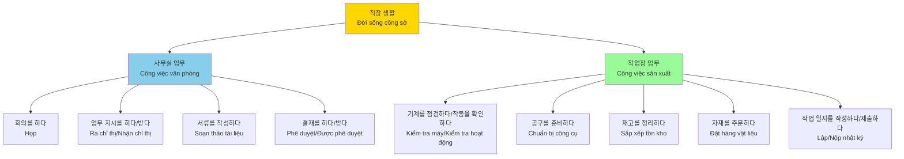
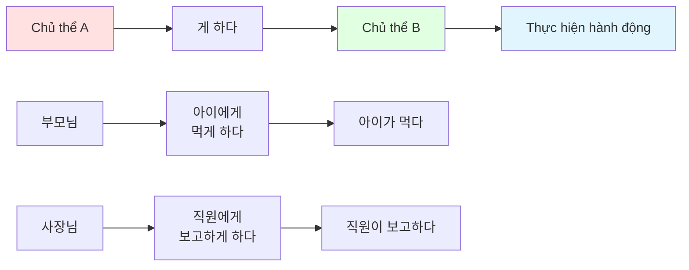
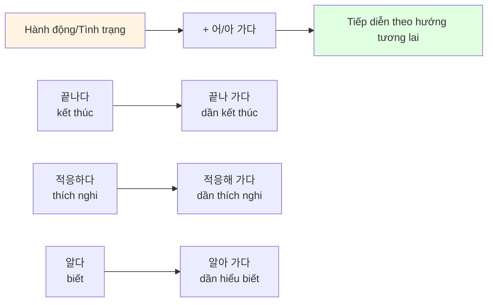
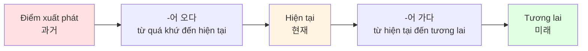
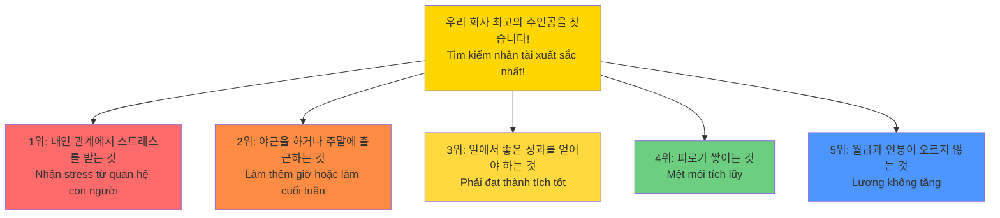
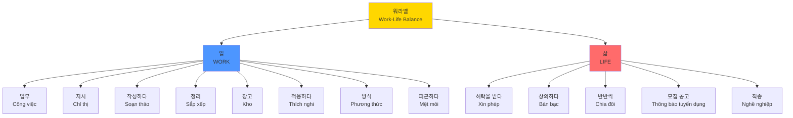

# Bài 13: 직장 생활 (Đời Sống Công Sở)

## 📚 Mục tiêu học tập

Sau khi hoàn thành bài học này, học viên sẽ có khả năng:
- Hiểu và sử dụng từ vựng liên quan đến công việc văn phòng và nhà máy
- Nắm vững cấu trúc ngữ pháp **-게 하다** (làm cho, khiến)
- Sử dụng thành thạo **-어 가다** (tiếp diễn theo hướng đi)
- Giao tiếp về đời sống công sở và môi trường làm việc

---

## 🎯 KHỞI ĐỘNG

### Câu hỏi mở đầu

**이 사람들은 직장에서 어떤 일을 하고 있는 것 같아요?**
_(Những người này có vẻ đang làm gì ở nơi làm việc?)_

**여러분은 직장 생활을 할 때 어떤 점이 어려웠요?**
_(Các bạn thấy điểm nào khó khăn khi làm việc ở công sở?)_

---

## 📖 I. TỪ VỰNG (어휘)

### 1. Từ vựng về công việc văn phòng

| **Tiếng Hàn** | **Nghĩa tiếng Việt** | **Ví dụ** |
|---------------|---------------------|-----------|
| 직장 | nơi làm việc, công sở | 직장인들은 대인 관계 때문에 스트레스를 받아서 힘들다는 것이었다.<br/>*Nhân viên văn phòng thấy vất vả vì áp lực trong quan hệ con người.* |
| 생활 | đời sống, cuộc sống | 회사 생활은 잘 만하십니까?<br/>*Cuộc sống công sở có ổn không?* |
| 회의 | cuộc họp, hội nghị | 회의를 하다.<br/>*Họp, tổ chức cuộc họp.* |
| 업무 | công việc, nghiệp vụ | 업무 내용을 정확하게 파악해야 한다.<br/>*Phải nắm bắt nội dung công việc một cách chính xác.* |
| 서류 | tài liệu, giấy tờ | 서류 번역 아직 멀었어요?<br/>*Việc dịch tài liệu còn lâu không?* |
| 결재 | phê duyệt | 결재를 하다 / 받다.<br/>*Phê duyệt / Được phê duyệt.* |
| 작성하다 | soạn thảo, lập | 서류를 작성하다.<br/>*Soạn thảo tài liệu.* |
| 정리하다 | sắp xếp, chỉnh lý | 재고를 정리하다.<br/>*Sắp xếp hàng tồn kho.* |
| 보고하다 | báo cáo | 업무를 보고하다.<br/>*Báo cáo công việc.* |
| 지시하다 | chỉ thị, ra lệnh | 업무 지시를 하다 / 받다.<br/>*Ra chỉ thị công việc / Nhận chỉ thị.* |

### 2. Từ vựng về công việc sản xuất

| **Tiếng Hàn** | **Nghĩa tiếng Việt** | **Ví dụ** |
|---------------|---------------------|-----------|
| 기계 | máy móc | 기계를 점검하다 / 작동을 확인하다.<br/>*Kiểm tra máy móc / Xác nhận hoạt động.* |
| 공구 | công cụ, dụng cụ | 공구를 준비하다.<br/>*Chuẩn bị công cụ.* |
| 작동하다 | vận hành, hoạt động | 기계 작동을 확인하다.<br/>*Xác nhận hoạt động của máy.* |
| 작동 | sự vận hành | 작동을 확인하다.<br/>*Xác nhận sự vận hành.* |
| 점검하다 | kiểm tra, chuẩn bị | 기계를 점검하다.<br/>*Kiểm tra máy móc.* |
| 재고 | hàng tồn kho | 재고를 정리하다.<br/>*Sắp xếp hàng tồn kho.* |
| 자재 | vật liệu | 자재를 주문하다.<br/>*Đặt hàng vật liệu.* |
| 제품 | sản phẩm | 제품을 제조하다.<br/>*Sản xuất sản phẩm.* |
| 제조하다 | sản xuất, chế tạo | 제품을 제조하다.<br/>*Sản xuất sản phẩm.* |
| 작업 | công việc, tác nghiệp | 작업 일지를 작성하다.<br/>*Lập nhật ký công việc.* |
| 작업 일지 | nhật ký công việc | 작업 일지를 작성하다 / 제출하다.<br/>*Lập / Nộp nhật ký công việc.* |

### 3. Từ vựng về chức danh và bộ phận

| **Tiếng Hàn** | **Nghĩa tiếng Việt** | **Ví dụ** |
|---------------|---------------------|-----------|
| 직종 | loại nghề, ngành nghề | 다양한 직종의 사람들이 일한다.<br/>*Mọi người từ nhiều ngành nghề khác nhau làm việc.* |
| 사무직 | nhân viên văn phòng | 사무직은 서류를 작성한다.<br/>*Nhân viên văn phòng soạn thảo tài liệu.* |
| 생산직 | công nhân sản xuất | 생산직은 제품을 제조한다.<br/>*Công nhân sản xuất chế tạo sản phẩm.* |
| 관리직 | nhân viên quản lý | 관리직은 업무 지시를 한다.<br/>*Nhân viên quản lý ra chỉ thị công việc.* |
| 영업직 | nhân viên kinh doanh | 영업직은 고객을 만난다.<br/>*Nhân viên kinh doanh gặp khách hàng.* |
| 판매직 | nhân viên bán hàng | 판매직은 제품을 판매한다.<br/>*Nhân viên bán hàng bán sản phẩm.* |
| 일용직 | công nhân công nhật | 일용직으로 일하다.<br/>*Làm công nhật.* |
| 급여 | lương, tiền công | 급여를 받다.<br/>*Nhận lương.* |
| 연봉 | lương năm | 월급과 연봉이 오르지 않는 것.<br/>*Lương tháng và lương năm không tăng.* |
| 월급 | lương tháng | 월급과 연봉이 오르지 않는 것.<br/>*Lương tháng và lương năm không tăng.* |

### 4. Từ vựng về hoạt động công sở

| **Tiếng Hàn** | **Nghĩa tiếng Việt** |
|---------------|---------------------|
| 회의를 하다 | họp, tổ chức cuộc họp |
| 업무 지시를 하다 / 받다 | ra chỉ thị công việc / nhận chỉ thị |
| 업무를 보고하다 | báo cáo công việc |
| 서류를 작성하다 | soạn thảo tài liệu |
| 결재를 하다 / 받다 | phê duyệt / được phê duyệt |
| 기계를 점검하다 / 작동을 확인하다 | kiểm tra máy móc / kiểm tra hoạt động |
| 공구를 준비하다 | chuẩn bị công cụ |
| 재고를 정리하다 | sắp xếp hàng tồn kho |
| 자재를 주문하다 | đặt hàng vật liệu |
| 작업 일지를 작성하다 / 제출하다 | lập / nộp nhật ký công việc |

### 5. Từ vựng mở rộng

| **Tiếng Hàn** | **Nghĩa tiếng Việt** | **Ví dụ** |
|---------------|---------------------|-----------|
| 모집 | tuyển dụng | 우리회사 최고의 주인공을 찾습니다!<br/>*Tìm kiếm nhân tài xuất sắc nhất của công ty chúng tôi!* |
| 모집 분야 | lĩnh vực tuyển dụng | 모집 분야: 사무직, 생산직.<br/>*Lĩnh vực tuyển dụng: Nhân viên văn phòng, công nhân sản xuất.* |
| 모집 인원 | số lượng tuyển dụng | 모집 인원: ○○명.<br/>*Số lượng tuyển dụng: ○○ người.* |
| 모집 공고 | thông báo tuyển dụng | 모집 공고를 보다.<br/>*Xem thông báo tuyển dụng.* |
| 계약서 | hợp đồng | 얼마 전에 부장님이 저한테 중요한 계약서를 번역하게 하셨거든요.<br/>*Cách đây không lâu sếp yêu cầu tôi dịch một hợp đồng quan trọng.* |
| 번역하다 | dịch, phiên dịch | 서류 번역 아직 멀었어요?<br/>*Việc dịch tài liệu còn lâu không?* |
| 스트레스 | stress, căng thẳng | 직장인들은 대인 관계 때문에 스트레스를 받아서 힘들다는 것이었다.<br/>*Nhân viên văn phòng bị stress vì quan hệ con người nên vất vả.* |
| 피로가 쌓이다 | mệt mỏi tích lũy | 쉬지 못해 피로가 쌓이기 때문에 힘들다고 한다.<br/>*Vì không được nghỉ nên mệt mỏi tích lũy nên vất vả.* |
| 피로 | mệt mỏi | 피로가 쌓이는 것.<br/>*Sự tích lũy mệt mỏi.* |
| 워라벨 | work-life balance, cân bằng công việc - cuộc sống | 일과 개인 생활의 균형을 의미하는 '워라벨(work-life balance)'이라는 말이 생겼다.<br/>*Thuật ngữ 'work-life balance' có nghĩa là sự cân bằng giữa công việc và cuộc sống cá nhân đã ra đời.* |
| 휴식 | nghỉ ngơi | 시간이 있으면 아무것도 하지 않고 휴식을 하면서 스트레스를 푸는 것이 최고의 방법이라고 했다.<br/>*Nếu có thời gian thì không làm gì cả mà nghỉ ngơi để giảm stress là phương pháp tốt nhất.* |
| 여가 | giải trí, thời gian rảnh | 여가 시간을 보내다.<br/>*Trải qua thời gian rảnh rỗi.* |
| 주급 | lương tuần | 주급을 받다.<br/>*Nhận lương tuần.* |
| 수당 | phụ cấp | 야근이나 주말 근무를 하면 수당을 받기는 하지만.<br/>*Khi làm thêm giờ hoặc làm việc cuối tuần thì được nhận phụ cấp nhưng...* |
| 글어 | văn tự | 문어와 글어.<br/>*Văn viết và văn tự.* |
| 문어 | văn viết | 문어로 쓰다.<br/>*Viết bằng văn viết.* |

### 6. Từ vựng về hoạt động và công việc cụ thể

| **Tiếng Hàn** | **Nghĩa tiếng Việt** | **Ví dụ** |
|---------------|---------------------|-----------|
| 마무리하다 | hoàn thành, kết thúc | 일을 마무리하다.<br/>*Hoàn thành công việc.* |
| 스스로 | tự mình, tự | 아이에게 지기 방을 스스로 정리하게 하세요.<br/>*Hãy để trẻ tự dọn phòng của mình.* |
| 거주하다 | cư trú, sống | 출입국·외국인청에서 6개월 이상 거주하는 외국인에게 외국인 등록을 하게 합니다.<br/>*Cục Xuất nhập cảnh yêu cầu người nước ngoài cư trú từ 6 tháng trở lên đăng ký thường trú.* |
| 창고 | kho, kho hàng | 창고에 자재를 보관하다.<br/>*Bảo quản vật liệu trong kho.* |
| 적응하다 | thích nghi, thích ứng | 선배님들이 잘 가르쳐 주셔서 잘 적응해 가고 있어요.<br/>*Các tiền bối dạy tốt nên tôi đang dần thích nghi.* |
| 방식 | phương thức, cách thức | 지금은 한국 사람들의 일하는 방식을 알아 가는 중이에요.<br/>*Bây giờ tôi đang dần hiểu cách làm việc của người Hàn.* |
| 파악하다 | nắm bắt, hiểu rõ | 업무 내용을 정확하게 파악하다.<br/>*Nắm bắt nội dung công việc một cách chính xác.* |
| 허락을 받다 | xin phép, được cho phép | 휴가를 가기 전에 허락을 받다.<br/>*Xin phép trước khi nghỉ phép.* |
| 상의하다 | bàn bạc, thảo luận | 휴가를 가고 싶으면 동료와 먼저 상의해야 한다.<br/>*Nếu muốn nghỉ phép thì phải bàn bạc với đồng nghiệp trước.* |
| 반반씩 | chia đôi, mỗi người một nửa | 일을 반반씩 나누다.<br/>*Chia công việc mỗi người một nửa.* |
| 점검하다 | kiểm tra, thanh tra | 기계를 점검하다.<br/>*Kiểm tra máy móc.* |
| 확인하다 | xác nhận, kiểm tra | 작동을 확인하다.<br/>*Xác nhận hoạt động.* |
| 제출하다 | nộp, trình | 작업 일지를 제출하다.<br/>*Nộp nhật ký công việc.* |
| 주문하다 | đặt hàng | 자재를 주문하다.<br/>*Đặt hàng vật liệu.* |

### 7. Từ vựng về quan hệ và môi trường làm việc

| **Tiếng Hàn** | **Nghĩa tiếng Việt** | **Ví dụ** |
|---------------|---------------------|-----------|
| 대인 관계 | quan hệ con người, quan hệ cá nhân | 직장인들은 대인 관계 때문에 스트레스를 받아서 힘들다는 것이었다.<br/>*Nhân viên văn phòng thấy vất vả vì áp lực trong quan hệ con người.* |
| 상사 | cấp trên | 부장님, 차장님, 대리님 등의 상사와의 상하 관계도 어렵다고 한다.<br/>*Quan hệ cấp trên - cấp dưới với các sếp như trưởng phòng, phó phòng, đại lý cũng khó khăn.* |
| 상하 관계 | quan hệ cấp trên - cấp dưới | 상사와의 상하 관계도 어렵다고 한다.<br/>*Quan hệ cấp trên - cấp dưới với sếp cũng khó khăn.* |
| 부장님 | trưởng phòng (kính ngữ) | 얼마 전에 부장님이 저한테 중요한 계약서를 번역하게 하셨거든요.<br/>*Cách đây không lâu trưởng phòng đã yêu cầu tôi dịch một bản hợp đồng quan trọng.* |
| 차장님 | phó phòng (kính ngữ) | 부장님, 차장님, 대리님 등의 상사.<br/>*Các cấp trên như trưởng phòng, phó phòng, đại lý.* |
| 대리님 | đại lý, trợ lý (kính ngữ) | 부장님, 차장님, 대리님 등의 상사.<br/>*Các cấp trên như trưởng phòng, phó phòng, đại lý.* |
| 선배 | tiền bối, người đi trước | 선배님들이 잘 가르쳐 주셔서 잘 적응해 가고 있어요.<br/>*Các tiền bối dạy tốt nên tôi đang dần thích nghi.* |
| 동료 | đồng nghiệp | 휴가를 가고 싶으면 동료와 먼저 상의해야 한다.<br/>*Nếu muốn đi nghỉ phép thì phải bàn bạc với đồng nghiệp trước.* |
| 상사 | sếp, cấp trên | 상사와의 관계가 중요하다.<br/>*Quan hệ với cấp trên rất quan trọng.* |
| 책임감 | tinh thần trách nhiệm | 책임감을 가지고 일하다.<br/>*Làm việc với tinh thần trách nhiệm.* |
| 원만하다 | hoà thuận, suôn sẻ | 대인 관계가 원만하다.<br/>*Quan hệ con người hoà thuận.* |

### 8. Từ vựng về áp lực và thành tích

| **Tiếng Hàn** | **Nghĩa tiếng Việt** | **Ví dụ** |
|---------------|---------------------|-----------|
| 설문 조사 | điều tra, khảo sát | 잡코리아가 직장인 1,049명을 대상으로 직장에서 가장 힘든 일과 힘든 일을 어떻게 이겨 내는지 설문 조사를 실시했다.<br/>*Jobkorea đã thực hiện khảo sát 1.049 nhân viên văn phòng về việc khó khăn nhất ở công sở và cách vượt qua.* |
| 대상 | đối tượng | 직장인 1,049명을 대상으로.<br/>*Với 1.049 nhân viên văn phòng làm đối tượng.* |
| 실시하다 | thực hiện, tiến hành | 설문 조사를 실시했다.<br/>*Đã thực hiện khảo sát.* |
| 성격 | tính cách | 직장에서는 성격이 다른 다양한 사람과 같이 일해야 하고.<br/>*Ở công sở phải làm việc cùng nhiều người có tính cách khác nhau.* |
| 부담감 | áp lực, gánh nặng | 자기가 하는 일에서 좋은 성과를 얻어야 하는 부담감도 직장인들을 힘들게 하는 이유 중의 하나라고 한다.<br/>*Áp lực phải đạt được thành tích tốt trong công việc cũng là một trong những lý do khiến nhân viên vất vả.* |
| 극복하다 | vượt qua, khắc phục | 직장 생활을 하면서 어려움을 극복해 가기 위해 무엇을 하는지 물어봤다.<br/>*Đã hỏi họ làm gì để vượt qua khó khăn trong cuộc sống công sở.* |
| 성과 | thành tích, kết quả | 자기가 하는 일에서 좋은 성과를 얻어야 하는 부담감.<br/>*Áp lực phải đạt thành tích tốt trong công việc của mình.* |
| 야근 | làm thêm giờ | 야근을 하거나 주말에 출근을 해야 할 때 힘들다고 한다.<br/>*Khi phải làm thêm giờ hoặc đi làm vào cuối tuần thì thấy vất vả.* |
| 주말 | cuối tuần | 야근을 하거나 주말에 출근을 해야 할 때 힘들다고 한다.<br/>*Khi phải làm thêm giờ hoặc đi làm vào cuối tuần thì thấy vất vả.* |
| 출근하다 | đi làm | 주말에 출근을 해야 할 때 힘들다고 한다.<br/>*Khi phải đi làm vào cuối tuần thì thấy vất vả.* |
| 근무 | làm việc, công việc | 야근이나 주말 근무를 하면 수당을 받기는 하지만.<br/>*Tuy làm thêm giờ hoặc làm việc cuối tuần có nhận phụ cấp nhưng...* |
| 이겨 내다 | vượt qua, chiến thắng | 힘든 일을 어떻게 이겨 내는지.<br/>*Vượt qua công việc vất vả như thế nào.* |
| 재충전하다 | nạp lại năng lượng | 취미 생활을 하면서 재충전을 한다고 했다.<br/>*Họ nói là nạp lại năng lượng bằng các hoạt động sở thích.* |
| 재충전 | sạc lại pin, nạp năng lượng | 재충전을 한다고 했다.<br/>*Họ nói là nạp lại năng lượng.* |

### 9. Từ vựng về thành công và hạnh phúc

| **Tiếng Hàn** | **Nghĩa tiếng Việt** | **Ví dụ** |
|---------------|---------------------|-----------|
| 인정 | sự công nhận | 얼마 전까지만 해도 한국 사람들은 사회에서 인정을 받고 직장에서 승진하고 높은 연봉을 받는 것이 성공이라고 생각했다.<br/>*Cho đến gần đây, người Hàn Quốc vẫn nghĩ thành công là được xã hội công nhận, thăng tiến ở công sở và nhận lương cao.* |
| 승진 | thăng tiến, thăng chức | 직장에서 승진하고 높은 연봉을 받는 것이 성공이라고 생각했다.<br/>*Đã nghĩ rằng thăng tiến ở công sở và nhận lương cao là thành công.* |
| 성공 | thành công | 최근에는 그런 사회적 성공보다 개인의 행복이 더 중요하다는 생각을 하는 사람이 많아지고 있다.<br/>*Gần đây có nhiều người nghĩ hạnh phúc cá nhân quan trọng hơn thành công xã hội như vậy.* |
| 행복 | hạnh phúc | 최근에는 그런 사회적 성공보다 개인의 행복이 더 중요하다는 생각을 하는 사람이 많아지고 있다.<br/>*Gần đây có nhiều người nghĩ hạnh phúc cá nhân quan trọng hơn thành công xã hội.* |
| 균형 | cân bằng | 일과 개인 생활의 균형을 의미하는 '워라벨(work-life balance)'이라는 말이 생겼다.<br/>*Đã xuất hiện từ 'work-life balance' có nghĩa là sự cân bằng giữa công việc và cuộc sống cá nhân.* |
| 정시 | giờ chính quy | 직장인들이 야근보다는 정시에 퇴근해서 '자기만의 있는 삶'을 살기를 원하면서.<br/>*Nhân viên văn phòng muốn tan làm đúng giờ thay vì làm thêm để sống 'cuộc sống của riêng mình'.* |
| 퇴근하다 | tan làm, về nhà | 정시에 퇴근해서 '자기만의 있는 삶'을 살기를 원하면서.<br/>*Muốn tan làm đúng giờ để sống 'cuộc sống của riêng mình'.* |
| 근로자 | người lao động | 정부도 근로자의 주당 근로 시간을 최대 52시간으로 줄이게 되었다.<br/>*Chính phủ cũng đã giảm thời gian làm việc của người lao động xuống tối đa 52 giờ mỗi tuần.* |
| 주당 | mỗi tuần, hàng tuần | 근로자의 주당 근로 시간을 최대 52시간으로 줄이게 되었다.<br/>*Đã giảm thời gian làm việc hàng tuần của người lao động xuống tối đa 52 giờ.* |
| 최대 | tối đa | 주당 근로 시간을 최대 52시간으로 줄이게 되었다.<br/>*Đã giảm thời gian làm việc hàng tuần xuống tối đa 52 giờ.* |
| 중시하다 | coi trọng, xem trọng | 이런 워라벨을 중시하는 문화는 젊은 대학생과 직장인들 사이에서 먼저 시작되었다.<br/>*Văn hoá coi trọng work-life balance này đã bắt đầu từ giới sinh viên và nhân viên trẻ.* |
| 소확행 | hạnh phúc nhỏ nhưng chắc chắn | 큰 성공보다는 작지만 확실한 행복이 인생에서 더 중요하다는 뜻의 '소확행'이라는 말도 만들어 냈다.<br/>*Cũng tạo ra từ 'hạnh phúc nhỏ nhưng chắc chắn' có nghĩa là hạnh phúc nhỏ nhưng chắc chắn quan trọng hơn thành công lớn trong cuộc đời.* |
| 개념 | khái niệm, quan niệm | 그들이 생각하는 행복은 가족의 행복 개념과는 다른 것이다.<br/>*Hạnh phúc mà họ nghĩ khác với khái niệm hạnh phúc của gia đình.* |

### 10. Từ vựng khác từ bài đọc và hội thoại

| **Tiếng Hàn** | **Nghĩa tiếng Việt** | **Ví dụ** |
|---------------|---------------------|-----------|
| 얼마 전에 | cách đây không lâu | 얼마 전에 부장님이 저한테 중요한 계약서를 번역하게 하셨거든요.<br/>*Cách đây không lâu trưởng phòng đã yêu cầu tôi dịch một bản hợp đồng quan trọng.* |
| 중요한 | quan trọng | 얼마 전에 부장님이 저한테 중요한 계약서를 번역하게 하셨거든요.<br/>*Cách đây không lâu trưởng phòng đã yêu cầu tôi dịch một bản hợp đồng quan trọng.* |
| 제대로 | đúng cách, đàng hoàng | 그런데 어려운 말이 많아서 제대로 하지 못했어요.<br/>*Nhưng có nhiều từ khó nên không làm được đúng cách.* |
| 미리 | trước, sớm | 그럼 미리 선배나 동료들한테 물어보지 그랬어요?<br/>*Vậy sao không hỏi trước các tiền bối hoặc đồng nghiệp?* |
| 창피하다 | xấu hổ, kỳ cục | 사람들은 제가 잘 적응해 가는 줄 아는데 물어보기가 창피하더라고요.<br/>*Mọi người tưởng tôi đang thích nghi tốt nên hỏi thì thấy xấu hổ.* |
| 주변 | xung quanh | 내가 한 게 맞는지 주변 사람들에게 계속 물어보는 게 제일 좋아요.<br/>*Hỏi liên tục những người xung quanh xem mình làm có đúng không là tốt nhất.* |
| 맞다 | đúng | 내가 한 게 맞는지 주변 사람들에게 계속 물어보는 게 제일 좋아요.<br/>*Hỏi những người xung quanh xem mình làm có đúng không là tốt nhất.* |
| 계속 | liên tục, tiếp tục | 주변 사람들에게 계속 물어보는 게 제일 좋아요.<br/>*Hỏi liên tục những người xung quanh là tốt nhất.* |
| 달라지다 | thay đổi, khác đi | 한국에 와서 달라진 것에 대해 친구들과 이야기하다.<br/>*Nói chuyện với bạn bè về những điều đã thay đổi kể từ khi đến Hàn Quốc.* |
| 익숙해지다 | quen thuộc, thành thạo | 안젤라 씨는 직장 생활에 익숙해져서 실수를 하지 않습니다.<br/>*Angela đã quen với cuộc sống công sở nên không mắc lỗi.* |
| 안 좋은 일 | việc không tốt, chuyện xấu | 무슨 안 좋은 일 있었어요?<br/>*Có chuyện gì không tốt à?* |
| 급한 일 | việc gấp | 저는 급한 일이 없어서 먼저 가야 할 것 같아요.<br/>*Tôi không có việc gấp nên có lẽ phải đi trước.* |
| 먼저 | trước tiên | 휴가를 가고 싶으면 동료와 먼저 상의해야 한다.<br/>*Nếu muốn đi nghỉ phép thì phải bàn bạc với đồng nghiệp trước.* |
| 실수 | sai lầm, nhầm lẫn | 안젤라 씨는 직장 생활에 익숙해져서 실수를 하지 않습니다.<br/>*Angela đã quen với cuộc sống công sở nên không mắc lỗi.* |
| 신청서 | đơn xin, giấy đăng ký | 안젤라 씨는 선배에게 휴가 신청서를 냈다.<br/>*Angela đã nộp đơn xin nghỉ phép cho tiền bối.* |
| 휴가 | nghỉ phép | 휴가를 가고 싶으면 동료와 먼저 상의해야 한다.<br/>*Nếu muốn đi nghỉ phép thì phải bàn bạc với đồng nghiệp trước.* |
| 휴가 신청서 | đơn xin nghỉ phép | 안젤라 씨는 선배에게 휴가 신청서를 냈다.<br/>*Angela đã nộp đơn xin nghỉ phép cho tiền bối.* |
| 정확하다 | chính xác | 업무 내용을 정확하게 파악하다.<br/>*Nắm bắt chính xác nội dung công việc.* |
| 피곤하다 | mệt mỏi | 일을 해서 피곤하다.<br/>*Làm việc nên mệt mỏi.* |
| 찾코리아 | Jobkorea | 잡코리아가 직장인 1,049명을 대상으로 설문 조사를 실시했다.<br/>*Jobkorea đã thực hiện khảo sát 1.049 nhân viên văn phòng.* |
| 직장인 | nhân viên văn phòng, người đi làm | 잡코리아가 직장인 1,049명을 대상으로 직장에서 가장 힘든 일과 힘든 일을 어떻게 이겨 내는지 설문 조사를 실시했다.<br/>*Jobkorea đã khảo sát 1.049 nhân viên văn phòng về việc khó khăn nhất ở công sở và cách vượt qua.* |
| 대상으로 | với đối tượng | 직장인 1,049명을 대상으로 설문 조사를 실시했다.<br/>*Đã thực hiện khảo sát với 1.049 nhân viên văn phòng.* |
| 힘든 일 | công việc vất vả | 직장에서 가장 힘든 일과 힘든 일을 어떻게 이겨 내는지.<br/>*Việc khó khăn nhất ở công sở và cách vượt qua việc khó khăn.* |
| 다양한 | đa dạng | 직장에서는 성격이 다른 다양한 사람과 같이 일해야 하고.<br/>*Ở công sở phải làm việc cùng nhiều người có tính cách khác nhau.* |
| 상급 | cấp trên, cao cấp | 부장님, 차장님, 대리님 등의 상급자.<br/>*Các cấp trên như trưởng phòng, phó phòng, đại lý.* |
| 수당 | phụ cấp | 야근이나 주말 근무를 하면 수당을 받기는 하지만.<br/>*Tuy làm thêm giờ hoặc làm việc cuối tuần có nhận phụ cấp nhưng...* |
| 쉬다 | nghỉ ngơi | 쉬지 못해 피로가 쌓이기 때문에 힘들다고 한다.<br/>*Không thể nghỉ nên mệt mỏi tích lũy nên vất vả.* |
| 쌓이다 | tích lũy | 피로가 쌓이는 것.<br/>*Sự mệt mỏi tích lũy.* |
| 시간이 있으면 | nếu có thời gian | 시간이 있으면 아무것도 하지 않고 휴식을 하면서 스트레스를 푸는 것이 최고의 방법이라고 했다.<br/>*Nếu có thời gian thì không làm gì cả mà nghỉ ngơi để xả stress là phương pháp tốt nhất.* |
| 아무것도 | không gì cả | 시간이 있으면 아무것도 하지 않고 휴식을 하면서 스트레스를 푸는 것이 최고의 방법이라고 했다.<br/>*Nếu có thời gian thì không làm gì cả mà nghỉ ngơi để xả stress là phương pháp tốt nhất.* |
| 취미 생활 | sở thích, sinh hoạt sở thích | 자신이 좋아하는 일을 하거나 취미 생활을 하면서 재충전을 한다고 했다.<br/>*Họ nói là làm việc mình thích hoặc hoạt động sở thích để nạp lại năng lượng.* |
| 번 돈 | tiền kiếm được | 힘들게 일을 해서 번 돈으로 자신이 좋아하는 것을 사는 것도 기분이 좋아지는 일이라고 했다.<br/>*Dùng tiền kiếm được từ làm việc vất vả để mua thứ mình thích cũng là việc làm tâm trạng tốt lên.* |
| 기분이 좋아지다 | tâm trạng tốt lên | 자신이 좋아하는 것을 사는 것도 기분이 좋아지는 일이라고 했다.<br/>*Mua thứ mình thích cũng là việc làm tâm trạng tốt lên.* |
| 얼마 전까지만 해도 | cho đến gần đây | 얼마 전까지만 해도 한국 사람들은 사회에서 인정을 받고 직장에서 승진하고 높은 연봉을 받는 것이 성공이라고 생각했다.<br/>*Cho đến gần đây người Hàn Quốc vẫn nghĩ thành công là được xã hội công nhận, thăng tiến ở công sở và nhận lương cao.* |
| 사회 | xã hội | 얼마 전까지만 해도 한국 사람들은 사회에서 인정을 받고 직장에서 승진하고 높은 연봉을 받는 것이 성공이라고 생각했다.<br/>*Cho đến gần đây người Hàn Quốc vẫn nghĩ được xã hội công nhận, thăng tiến ở công sở và nhận lương cao là thành công.* |
| 사회적 | xã hội, thuộc về xã hội | 최근에는 그런 사회적 성공보다 개인의 행복이 더 중요하다는 생각을 하는 사람이 많아지고 있다.<br/>*Gần đây có nhiều người nghĩ hạnh phúc cá nhân quan trọng hơn thành công xã hội như vậy.* |
| 개인 | cá nhân | 최근에는 그런 사회적 성공보다 개인의 행복이 더 중요하다는 생각을 하는 사람이 많아지고 있다.<br/>*Gần đây có nhiều người nghĩ hạnh phúc cá nhân quan trọng hơn thành công xã hội.* |
| 개인의 | của cá nhân | 개인의 행복이 더 중요하다.<br/>*Hạnh phúc của cá nhân quan trọng hơn.* |
| 생각하다 | nghĩ, suy nghĩ | 사람들이 생각하는 행복.<br/>*Hạnh phúc mà mọi người nghĩ.* |
| 생각 | suy nghĩ, ý nghĩ | 행복에 대한 생각.<br/>*Suy nghĩ về hạnh phúc.* |
| 생활 | cuộc sống | 일과 개인 생활의 균형.<br/>*Sự cân bằng giữa công việc và cuộc sống cá nhân.* |
| 정부 | chính phủ | 정부도 근로자의 주당 근로 시간을 최대 52시간으로 줄이게 되었다.<br/>*Chính phủ cũng đã giảm thời gian làm việc của người lao động xuống tối đa 52 giờ mỗi tuần.* |
| 시간 | thời gian | 근로 시간을 줄이다.<br/>*Giảm thời gian làm việc.* |
| 줄이다 | giảm, cắt giảm | 정부도 근로자의 주당 근로 시간을 최대 52시간으로 줄이게 되었다.<br/>*Chính phủ cũng đã giảm thời gian làm việc của người lao động xuống tối đa 52 giờ mỗi tuần.* |
| 최근 | gần đây | 최근에는 그런 사회적 성공보다 개인의 행복이 더 중요하다는 생각을 하는 사람이 많아지고 있다.<br/>*Gần đây có nhiều người nghĩ hạnh phúc cá nhân quan trọng hơn thành công xã hội như vậy.* |
| 젊은 | trẻ | 이런 워라벨을 중시하는 문화는 젊은 대학생과 직장인들 사이에서 먼저 시작되었다.<br/>*Văn hoá coi trọng work-life balance này đã bắt đầu từ giới sinh viên và nhân viên trẻ.* |
| 대학생 | sinh viên đại học | 이런 워라벨을 중시하는 문화는 젊은 대학생과 직장인들 사이에서 먼저 시작되었다.<br/>*Văn hoá coi trọng work-life balance này đã bắt đầu từ giới sinh viên đại học và nhân viên trẻ.* |
| 사이에서 | giữa, trong số | 젊은 대학생과 직장인들 사이에서 먼저 시작되었다.<br/>*Đã bắt đầu từ giữa sinh viên đại học và nhân viên trẻ.* |
| 가족 | gia đình | 그들이 생각하는 행복은 가족의 행복 개념과는 다른 것이다.<br/>*Hạnh phúc mà họ nghĩ khác với khái niệm hạnh phúc của gia đình.* |
| 따라서 | do đó, vì vậy | 따라서 그들은 큰 성공보다는 작지만 확실한 행복이 인생에서 더 중요하다는 뜻의 '소확행'이라는 말도 만들어 냈다.<br/>*Do đó họ cũng tạo ra từ 'hạnh phúc nhỏ nhưng chắc chắn' có nghĩa là hạnh phúc nhỏ nhưng chắc chắn quan trọng hơn thành công lớn trong cuộc đời.* |
| 큰 | lớn | 큰 성공보다는 작지만 확실한 행복.<br/>*Hạnh phúc nhỏ nhưng chắc chắn thay vì thành công lớn.* |
| 작다 | nhỏ | 작지만 확실한 행복.<br/>*Hạnh phúc nhỏ nhưng chắc chắn.* |
| 확실한 | chắc chắn | 작지만 확실한 행복이 인생에서 더 중요하다.<br/>*Hạnh phúc nhỏ nhưng chắc chắn quan trọng hơn trong cuộc đời.* |
| 인생 | cuộc đời, nhân sinh | 확실한 행복이 인생에서 더 중요하다.<br/>*Hạnh phúc chắc chắn quan trọng hơn trong cuộc đời.* |
| 뜻 | ý nghĩa | 큰 성공보다는 작지만 확실한 행복이 인생에서 더 중요하다는 뜻의 '소확행'이라는 말도 만들어 냈다.<br/>*Cũng tạo ra từ 'hạnh phúc nhỏ nhưng chắc chắn' có ý nghĩa là hạnh phúc nhỏ nhưng chắc chắn quan trọng hơn thành công lớn trong cuộc đời.* |
| 만들어 내다 | tạo ra | '소확행'이라는 말도 만들어 냈다.<br/>*Cũng tạo ra từ 'hạnh phúc nhỏ nhưng chắc chắn'.* |
| 첫 번째 | thứ nhất | 첫 번째는 직장 생활을 하면서 언제 힘든지 물어봤다.<br/>*Thứ nhất là đã hỏi khi nào thấy vất vả trong cuộc sống công sở.* |
| 하면서 | trong khi, đồng thời | 직장 생활을 하면서 언제 힘든지 물어봤다.<br/>*Đã hỏi khi nào thấy vất vả trong khi làm việc ở công sở.* |
| 언제 | khi nào | 직장 생활을 하면서 언제 힘든지 물어봤다.<br/>*Đã hỏi khi nào thấy vất vả trong cuộc sống công sở.* |
| 물어보다 | hỏi | 언제 힘든지 물어봤다.<br/>*Đã hỏi khi nào thấy vất vả.* |
| 많은 | nhiều | 가장 많은 대답은.<br/>*Câu trả lời nhiều nhất là.* |
| 대답 | câu trả lời | 가장 많은 대답은 직장인들은 대인 관계 때문에 스트레스를 받아서 힘들다는 것이었다.<br/>*Câu trả lời nhiều nhất là nhân viên văn phòng thấy vất vả vì áp lực trong quan hệ con người.* |
| 받다 | nhận | 스트레스를 받아서 힘들다.<br/>*Nhận áp lực nên vất vả.* |
| 때문에 | vì, do | 대인 관계 때문에 스트레스를 받아서 힘들다.<br/>*Vì quan hệ con người nên nhận áp lực và vất vả.* |
| 같이 | cùng, giống | 직장에서는 성격이 다른 다양한 사람과 같이 일해야 하고.<br/>*Ở công sở phải làm việc cùng nhiều người có tính cách khác nhau.* |
| 일해야 하다 | phải làm việc | 성격이 다른 다양한 사람과 같이 일해야 하고.<br/>*Phải làm việc cùng nhiều người có tính cách khác nhau.* |
| 어렵다 | khó khăn | 상사와의 상하 관계도 어렵다고 한다.<br/>*Quan hệ cấp trên - cấp dưới với sếp cũng khó khăn.* |
| 다음으로 | tiếp theo | 다음으로 야근을 하거나 주말에 출근을 해야 할 때 힘들다고 한다.<br/>*Tiếp theo là khi phải làm thêm giờ hoặc đi làm cuối tuần thì vất vả.* |
| 해야 할 때 | khi phải làm | 야근을 하거나 주말에 출근을 해야 할 때 힘들다고 한다.<br/>*Khi phải làm thêm giờ hoặc đi làm cuối tuần thì vất vả.* |
| 하지만 | nhưng | 야근이나 주말 근무를 하면 수당을 받기는 하지만.<br/>*Tuy làm thêm giờ hoặc làm việc cuối tuần có nhận phụ cấp nhưng...* |
| 못하다 | không thể | 쉬지 못해 피로가 쌓이기 때문에.<br/>*Vì không thể nghỉ nên mệt mỏi tích lũy.* |
| 그리고 | và | 그리고 자기가 하는 일에서 좋은 성과를 얻어야 하는 부담감도.<br/>*Và áp lực phải đạt thành tích tốt trong công việc của mình.* |
| 자기 | bản thân | 자기가 하는 일에서 좋은 성과를 얻어야 하는 부담감.<br/>*Áp lực phải đạt thành tích tốt trong công việc của bản thân.* |
| 얻다 | đạt được, có được | 좋은 성과를 얻어야 하는 부담감.<br/>*Áp lực phải đạt được thành tích tốt.* |
| 하나 | một | 직장인들을 힘들게 하는 이유 중의 하나라고 한다.<br/>*Là một trong những lý do khiến nhân viên văn phòng vất vả.* |
| 무엇 | cái gì | 어려움을 극복해 가기 위해 무엇을 하는지 물어봤다.<br/>*Đã hỏi làm gì để vượt qua khó khăn.* |
| 최고 | tốt nhất, cao nhất | 휴식을 하면서 스트레스를 푸는 것이 최고의 방법이라고 했다.<br/>*Nghỉ ngơi để xả stress là phương pháp tốt nhất.* |
| 방법 | phương pháp | 스트레스를 푸는 것이 최고의 방법이라고 했다.<br/>*Xả stress là phương pháp tốt nhất.* |
| 좋아하다 | thích | 자신이 좋아하는 일을 하거나 취미 생활을 하면서 재충전을 한다고 했다.<br/>*Làm việc mình thích hoặc hoạt động sở thích để nạp lại năng lượng.* |
| 좋아하는 | mà mình thích | 자신이 좋아하는 것을 사는 것도 기분이 좋아지는 일이라고 했다.<br/>*Mua thứ mà mình thích cũng là việc làm tâm trạng tốt lên.* |
| 사다 | mua | 자신이 좋아하는 것을 사는 것도 기분이 좋아지는 일이라고 했다.<br/>*Mua thứ mình thích cũng là việc làm tâm trạng tốt lên.* |
| 또한 | hơn nữa, ngoài ra | 또한 힘들게 일을 해서 번 돈으로 자신이 좋아하는 것을 사는 것도 기분이 좋아지는 일이라고 했다.<br/>*Hơn nữa, dùng tiền kiếm được từ làm việc vất vả để mua thứ mình thích cũng là việc làm tâm trạng tốt lên.* |

### 11. Bài tập từ vựng

#### 1. 이 사람은 사무실에서 어떤 일을 해요? 이야기해 보세요.

**Người này làm gì ở văn phòng? Hãy nói về họ.**

| **Hình ảnh** | **Hoạt động** |
|--------------|---------------|
| 회의실 (Phòng họp) | **회의를 하다**<br/>_(Họp, tổ chức cuộc họp)_ |
| 업무 지시 (Chỉ thị công việc) | **업무 지시를 하다 / 받다**<br/>**업무를 보고하다**<br/>_(Ra chỉ thị / Nhận chỉ thị công việc<br/>Báo cáo công việc)_ |
| 컴퓨터 작업 (Làm việc với máy tính) | **서류를 작성하다**<br/>_(Soạn thảo tài liệu)_ |
| 결재 (Phê duyệt) | **결재를 하다 / 받다**<br/>_(Phê duyệt / Được phê duyệt)_ |

#### 2. 이 사람은 작업장에서는 어떤 일을 해요? 이야기해 보세요.

**Người này làm gì ở xưởng sản xuất? Hãy nói về họ.**

| **Hình ảnh** | **Hoạt động** |
|--------------|---------------|
| 기계 점검 (Kiểm tra máy) | **기계를 점검하다 / 작동을 확인하다**<br/>_(Kiểm tra máy móc / Xác nhận hoạt động)_ |
| 공구 (Công cụ) | **공구를 준비하다**<br/>_(Chuẩn bị công cụ)_ |
| 창고 (Kho) | **재고를 정리하다**<br/>_(Sắp xếp hàng tồn kho)_ |
| 주문 (Đặt hàng) | **자재를 주문하다**<br/>_(Đặt hàng vật liệu)_ |
| 작업 일지 (Nhật ký công việc) | **작업 일지를 작성하다 / 제출하다**<br/>_(Lập / Nộp nhật ký công việc)_ |

---

## 📘 II. NGỮ PHÁP (문법)

### 1. **-게 하다** (Làm cho, khiến)

#### 📌 Định nghĩa
Cấu trúc **-게 하다** được sử dụng để diễn tả việc một người làm cho hoặc khiến người khác thực hiện một hành động nào đó.

#### 📌 Cấu trúc

```
Động từ/Tính từ + -게 하다
```

**Quy tắc biến đổi:**

| **Từ loại** | **Cấu trúc** | **Ví dụ** |
|------------|-------------|-----------|
| Động từ: 먹다 | 먹게 하다 | làm cho ăn |
| Động từ: 작성하다 | 작성하게 하다 | làm cho soạn thảo |
| Tính từ: 편하다 | 편하게 하다 | làm cho thoải mái |

**Lưu ý:** **하다** trong cấu trúc này là một động từ riêng biệt, mang ý nghĩa "làm".

#### 📌 Ví dụ minh họa

| **Tiếng Hàn** | **Tiếng Việt** |
|---------------|----------------|
| 가: 이 약을 식후에 아이에게 **먹게 하세요**. | A: Hãy **cho** trẻ **uống** thuốc này sau bữa ăn. |
| 나: 네, 선생님. 식후 30분에 먹이면 되죠? | B: Vâng, thầy. Cho uống sau 30 phút bữa ăn đúng không? |
| 아이에게 지기 방을 스스로 **정리하게 하세요**. | Hãy **để** trẻ **tự dọn** phòng của mình. |
| 출입국·외국인청에서 6개월 이상 거주하는 외국인에게 외국인 등록을 **하게 합니다**. | Cục Xuất nhập cảnh **yêu cầu** người nước ngoài cư trú từ 6 tháng trở lên **đăng ký** thường trú. |

#### 📌 Bảng so sánh các tình huống

| **Tình huống** | **Ví dụ** | **Nghĩa** |
|---------------|-----------|-----------|
| Cha mẹ với con cái | 어릴을 때 부모님이 나에게 시켰던 일 | Việc mà cha mẹ đã bắt tôi làm khi nhỏ |
| Sếp với nhân viên | 의사나 약사가 환자 보호자에게 하는 일 | Việc mà bác sĩ/dược sĩ yêu cầu người chăm sóc bệnh nhân làm |
| Chính phủ với công dân | 재채기를 많이 하는 아이의 보호자에게 하는 일 | Việc mà người chăm sóc trẻ hay hắt hơi phải làm |

#### 📌 Cấu trúc tương đương

**-게 하다** có thể thay thế bằng **시키다** trong nhiều trường hợp:

| **-게 하다** | **시키다** |
|-------------|-----------|
| 먹게 하다 | 먹이다 (cho ăn) |
| 작성하게 하다 | 작성시키다 (bắt soạn thảo) |

#### 📌 Bài tập thực hành -게 하다

**1. 보기와 같이 친구와 이야기해 보세요.**
**Hãy nói với bạn như mẫu.**

**보기 (Mẫu):**

| **업무 지시 사항** |
|-------------------|
| **보기** | **이랑 씨, 3시 회의 / 준비** |
| **1)** | **안젤라 씨, 13일까지 계약서 / 번역** |
| **2)** | **찰스 씨, 창고의 재고 / 체크** |
| **3)** | **라흐만 씨, 택배 박스 / 창고로 옮기기** |
| **4)** | **김영철 씨, 직원들 작업 일지 / 정리** |

**대화 예:**

```
과장님: 과장님이 무슨 일을 시켰어요?
→ 과장님이 이랑 씨에게 회의를 준비하게 하셨어요.
```

**연습:**
1. 과장님이 안젤라 씨에게 _______________
2. 과장님이 찰스 씨에게 _______________
3. 과장님이 라흐만 씨에게 _______________
4. 과장님이 김영철 씨에게 _______________

---

**2. 다음에 대해 '-게 하다'를 사용해서 이야기해 보세요.**
**Hãy nói về các việc sau sử dụng '-게 하다'.**

**단어장 (Từ vựng gợi ý):**
- 직업 (nghề nghiệp)
- 마무리하다 (hoàn thành)
- 스스로 (tự mình)
- 거주하다 (cư trú)
- 창고 (kho)

**주제 (Chủ đề):**

| **Tình huống** | **Gợi ý** |
|---------------|-----------|
| • 어렸을 때 부모님이 나에게 시켰던 일<br/>_(Việc cha mẹ đã bắt tôi làm khi nhỏ)_ | 방을 청소하게 하다<br/>숙제를 하게 하다<br/>일찍 자게 하다 |
| • 의사나 약사가 환자 보호자에게 하는 일<br/>_(Việc bác sĩ/dược sĩ yêu cầu người chăm sóc bệnh nhân)_ | 약을 먹게 하다<br/>물을 많이 마시게 하다<br/>휴식하게 하다 |
| • 재채기를 많이 하는 아이의 보호자에게 하는 일<br/>_(Việc người chăm sóc trẻ hay hắt hơi phải làm)_ | 마스크를 쓰게 하다<br/>병원에 가게 하다<br/>약을 먹게 하다 |

**Ví dụ câu trả lời:**

1. **어렸을 때 부모님이 나에게 시켰던 일:**
   - 어렸을 때 부모님은 저에게 매일 방을 청소하게 하셨어요.
   - _(Khi nhỏ cha mẹ đã bắt tôi dọn phòng mỗi ngày.)_
   - 부모님은 저에게 숙제를 먼저 하게 하셨어요.
   - _(Cha mẹ đã bắt tôi làm bài tập trước.)_

2. **의사나 약사가 환자 보호자에게 하는 일:**
   - 의사는 보호자에게 환자가 약을 식후에 먹게 하라고 했어요.
   - _(Bác sĩ yêu cầu người chăm sóc cho bệnh nhân uống thuốc sau bữa ăn.)_
   - 약사는 보호자에게 아이가 물을 많이 마시게 하라고 했어요.
   - _(Dược sĩ yêu cầu người chăm sóc cho trẻ uống nhiều nước.)_

3. **재채기를 많이 하는 아이의 보호자에게 하는 일:**
   - 선생님은 보호자에게 아이에게 마스크를 쓰게 하라고 했어요.
   - _(Cô giáo yêu cầu người chăm sóc cho trẻ đeo khẩu trang.)_
   - 의사는 보호자에게 아이를 병원에 데려가게 했어요.
   - _(Bác sĩ yêu cầu người chăm sóc đưa trẻ đến bệnh viện.)_

---

### 2. **-어 가다** (Tiếp diễn theo hướng đi)

#### 📌 Định nghĩa
Cấu trúc **-어 가다** biểu thị một hành động hoặc tình trạng đang tiếp diễn và phát triển theo hướng tương lai hoặc xa dần đi.

#### 📌 Cấu trúc

```
Động từ/Tính từ + -어 가다/-아 가다
```

**Quy tắc biến đổi:**

| **Dạng gốc** | **Thêm** | **Kết quả** | **Nghĩa** |
|--------------|----------|-------------|-----------|
| 와 (오다) | → | 와 가다 | đi về phía đó |
| 끝나 (끝나다) | → | 끝나 가다 | dần kết thúc |
| 먹어 (먹다) | → | 먹어 가다 | tiếp tục ăn đi |
| 적응하다 | → | 적응해 가다 | dần dần thích nghi |
| 만들다 | → | 만들어 가다 | tiếp tục làm đi |

#### 📌 Ví dụ minh họa

| **Tiếng Hàn** | **Tiếng Việt** |
|---------------|----------------|
| 가: 안젤라 씨, 서류 번역 아직 멀었어요? | A: Angela, việc dịch tài liệu còn lâu không? |
| 나: 이제 거의 다 **끝나 가요**. | B: Bây giờ gần như **đã hoàn thành** rồi. |
| 한국에 온 지 거의 3년이 **되어 가요**. | Sắp **được** 3 năm ở Hàn Quốc rồi. |
| 지금은 한국 사람들의 일하는 방식을 **알아 가는** 중이에요. | Bây giờ tôi đang **dần hiểu** cách làm việc của người Hàn. |

#### 📌 So sánh -어 가다 / -어 오다 / -해 가다

| **Cấu trúc** | **Ý nghĩa** | **Ví dụ** |
|--------------|-------------|-----------|
| -어 가다 | tiếp diễn hướng đi xa | 와 가다 (đi về phía đó) |
| -어 오다 | tiếp diễn hướng đến gần | 와 오다 (đến về phía đây) |
| -해 가다 | dùng với động từ có 하다 | 적응해 가다 (dần thích nghi) |

#### 📌 Bảng tổng hợp các biến thể

| **Gốc** | **-아 가다** | **-어 가다** | **-해 가다** |
|---------|------------|------------|------------|
| 오다 | | 와 가다 | |
| 끝나다 | | 끝나 가다 | |
| 먹다 | | 먹어 가다 | |
| 적응하다 | | | 적응해 가다 |
| 완성하다 | | | 완성해 가다 |

#### 📌 Bài tập thực hành -어 가다

**1. 그림을 보고 보기와 같이 신입 사원의 직장 생활에 대해 이야기해 보세요.**
**Xem tranh và nói về cuộc sống công sở của nhân viên mới như mẫu.**

**보기 (Mẫu):**

**직원들의 이름과 얼굴을 외우다**
_(Nhớ tên và khuôn mặt của nhân viên)_

→ 입사한 지 얼마 안 되어서 이제 조금씩 직원들의 이름과 얼굴을 **외워 가고** 있습니다.
_(Mới vào công ty chưa lâu nên bây giờ đang dần nhớ tên và khuôn mặt của các nhân viên.)_

**연습 (Luyện tập):**

| **Hình ảnh** | **Hoạt động** | **Câu với -어 가다** |
|-------------|--------------|---------------------|
| **1)** 선배에게서 일을 배우다<br/>_(Học việc từ tiền bối)_ | 입사한 지 얼마 안 되어서 이제 조금씩 선배에게서 일을 **배워 가고** 있습니다.<br/>_(Mới vào công ty chưa lâu nên đang dần học việc từ tiền bối.)_ |
| **2)** 회사 규칙에 적응하다<br/>_(Thích nghi với quy tắc công ty)_ | 입사한 지 얼마 안 되어서 이제 조금씩 회사 규칙에 **적응해 가고** 있습니다.<br/>_(Mới vào công ty chưa lâu nên đang dần thích nghi với quy tắc công ty.)_ |
| **3)** 업무를 파악하다<br/>_(Nắm bắt công việc)_ | 입사한 지 얼마 안 되어서 이제 조금씩 업무를 **파악해 가고** 있습니다.<br/>_(Mới vào công ty chưa lâu nên đang dần nắm bắt công việc.)_ |

---

**2. 여러분의 직장 생활이나 한국 생활에 대해 친구들과 이야기해 보세요.**
**Hãy nói với bạn bè về cuộc sống công sở hoặc cuộc sống ở Hàn Quốc của các bạn.**

**단어장 (Từ vựng gợi ý):**
- 적응하다 (thích nghi)
- 방식 (phương thức)
- 파악하다 (nắm bắt)

**주제 1: 직장 생활하기 (Cuộc sống công sở)**

**Ví dụ câu trả lời:**

- **처음에는:** 처음에는 한국 회사 문화가 낯설었어요.
  - _(Lúc đầu văn hóa công ty Hàn Quốc thật xa lạ.)_

- **지금은:** 지금은 익숙해져 가고 있어요.
  - _(Bây giờ đang dần quen.)_

**Mẫu câu khác:**

1. **업무 방식 (Phương thức làm việc):**
   - 처음에는 한국 사람들의 업무 방식을 잘 몰랐어요.
   - 지금은 한국 사람들의 일하는 방식을 **알아 가는** 중이에요.
   - _(Lúc đầu không hiểu rõ phương thức làm việc của người Hàn. Bây giờ đang dần hiểu cách làm việc của họ.)_

2. **회사 규칙 (Quy tắc công ty):**
   - 처음에는 회사 규칙이 어려웠어요.
   - 지금은 회사 규칙에 **적응해 가고** 있어요.
   - _(Lúc đầu quy tắc công ty khó. Bây giờ đang dần thích nghi với quy tắc công ty.)_

3. **업무 내용 (Nội dung công việc):**
   - 처음에는 업무 내용을 잘 몰랐어요.
   - 지금은 업무 내용을 **파악해 가고** 있어요.
   - _(Lúc đầu không hiểu nội dung công việc. Bây giờ đang dần nắm bắt nội dung công việc.)_

**주제 2: 한국 생활하기 (Cuộc sống ở Hàn Quốc)**

**Ví dụ câu trả lời:**

1. **한국어 (Tiếng Hàn):**
   - 처음에는 한국어가 정말 어려웠어요.
   - 지금은 한국어를 **배워 가고** 있어서 조금씩 나아지고 있어요.
   - _(Lúc đầu tiếng Hàn rất khó. Bây giờ đang học dần nên từng chút một tiến bộ.)_

2. **한국 음식 (Ẩm thực Hàn Quốc):**
   - 처음에는 매운 음식이 힘들었어요.
   - 지금은 매운 맛에 **익숙해져 가고** 있어요.
   - _(Lúc đầu đồ ăn cay thật khó. Bây giờ đang dần quen với vị cay.)_

3. **한국 문화 (Văn hóa Hàn Quốc):**
   - 처음에는 한국 문화가 낯설었어요.
   - 지금은 한국 문화를 **이해해 가고** 있어요.
   - _(Lúc đầu văn hóa Hàn Quốc xa lạ. Bây giờ đang dần hiểu văn hóa Hàn Quốc.)_

---

## 🗣️ III. HỘI THOẠI (말하기)

### Hội thoại 1: Về công việc văn phòng

**드미트리:** 안젤라 씨, 무슨 안 좋은 일 있었어요?

**안 젤 라:** 얼마 전에 부장님이 저한테 중요한 계약서를 변역하게 하셨거든요. 그런데 어려운 말이 많아서 제대로 하지 못했어요.

**드미트리:** 그럼 미리 선배나 동료들한테 물어보지 그랬어요?

**안 젤 라:** 사람들은 제가 잘 적응해 가는 줄 아는데 물어보기가 창피하더라고요. 이럴 때는 어떻게 하는 게 좋을까요?

**드미트리:** 그럼 때는 내가 한 게 맞는지 주변 사람들에게 계속 물어보는 게 제일 좋아요.

#### 💡 Điểm ngữ pháp trong hội thoại:

1. **계약서를 번역하게 하셨거든요** - Sếp đã yêu cầu tôi dịch hợp đồng
2. **어려운 말이 많아서 제대로 하지 못했어요** - Vì có nhiều từ khó nên không làm được tốt
3. **내가 한 게 맞는지 주변 사람들에게 계속 물어보다** - Tiếp tục hỏi người xung quanh xem mình làm có đúng không

---

### Hội thoại 2: Về công việc sản xuất

**과장님:** 회사 생활은 잘 만하십니까?

**잡시드:** 네, 선배님들이 잘 가르쳐 주셔서 잘 적응해 가고 있어요.

**과장님:** 두 분은 처음에 어떻게 만나셨어요?

**잡시드:** 처음에는 한국에 와서 달라진 것에 대해 친구들과 이야기하면서 스트레스를 풀었던 것 같아요.

#### 💡 Điểm ngữ pháp:

1. **잘 적응해 가고 있어요** - Đang dần thích nghi tốt
2. **처음에는... 지금은 익숙해져 가고 있어요** - Lúc đầu... bây giờ đang dần quen

---

### Bài tập nói

**1. 안젤라 씨와 드미트리 씨가 직장 생활에 대해 이야기합니다. 다음 대화처럼 이야기해 보세요.**
**Angela và Dmitry nói về cuộc sống công sở. Hãy nói chuyện như đoạn hội thoại sau.**

**Điểm cần nhớ:**

**1)** 계약서를 번역하다, 어려운 말이 많아서 제대로 하지 못하다
내가 한 게 맞는지 주변 사람들에게 계속 물어보다

**2)** 자재를 주문하다, 잘못 알아듣어서 틀리게 주문하다
일을 시작하기 전에 그 일을 시킨 분에게 다시 한번 확인하다

**Ví dụ:**
- **Tình huống 1:** Bạn được giao dịch hợp đồng nhưng có nhiều từ khó nên không làm tốt → Hãy liên tục hỏi người xung quanh xem mình làm có đúng không.
- **Tình huống 2:** Đặt hàng vật liệu nhưng nghe nhầm nên đặt sai → Hãy xác nhận lại một lần nữa với người giao việc trước khi bắt đầu làm.

---

**2. 다음과 같은 상황에서 직장 생활에 힘든 일이 있는 사람과 조언하는 사람이 되어 대화해 보세요.**
**Trong các tình huống sau, hãy đóng vai người gặp khó khăn trong công việc và người cho lời khuyên để đối thoại.**

| **직장 생활이 힘든 사람**<br/>_(Người gặp khó khăn trong công việc)_ | **직장 생활에 대해 조언하는 사람**<br/>_(Người cho lời khuyên về công việc)_ |
|-----|-----|
| **•** 상사가 여러 명이라서 업무 보고를<br/>누구에게 해야 하는지 모르겠다.<br/>_(Có nhiều cấp trên nên không biết phải<br/>báo cáo công việc cho ai.)_ | • 업무 내용에 따라 담당 상사가 다를 수 있으니<br/>먼저 확인해 보세요.<br/>_(Tùy theo nội dung công việc mà cấp trên phụ trách<br/>có thể khác nhau nên hãy xác nhận trước.)_ |
| **•** 일을 끝내려는 날짜가 너무 빠르다.<br/>_(Hạn chót hoàn thành công việc quá gấp.)_ | • 상사에게 사정을 말하고 마감일을 조금<br/>늦춰 달라고 요청해 보세요.<br/>_(Hãy nói hoàn cảnh với cấp trên và yêu cầu<br/>gia hạn deadline một chút.)_ |
| **•** 일을 더 잘하는 게 좋은지 빨리 하는게<br/>좋은지 모르겠다.<br/>_(Không biết nên làm việc tốt hơn hay<br/>làm nhanh hơn.)_ | • 처음에는 속도보다 정확성이 더 중요하니까<br/>천천히 하더라도 제대로 하는 게 좋아요.<br/>_(Lúc đầu độ chính xác quan trọng hơn tốc độ nên<br/>dù chậm nhưng làm đúng sẽ tốt hơn.)_ |

**Ví dụ hội thoại:**

```
A: 저는 상사가 여러 명이라서 업무 보고를 누구에게 해야 하는지 모르겠어요.
B: 업무 내용에 따라 담당 상사가 다를 수 있으니 먼저 확인해 보세요.
A: 네, 그렇게 하겠습니다. 감사합니다.
```

**Luyện tập thêm - Các tình huống khác:**

| **Khó khăn** | **Lời khuyên** |
|-------------|---------------|
| 동료들과 관계가 어렵다.<br/>_(Quan hệ với đồng nghiệp khó khăn.)_ | 먼저 인사하고 친절하게 대하면<br/>좋아질 거예요.<br/>_(Chào hỏi trước và đối xử thân thiện<br/>thì sẽ tốt hơn.)_ |
| 한국어가 서툴러서 회의 내용을<br/>잘 이해하지 못한다.<br/>_(Tiếng Hàn còn vụng nên không<br/>hiểu rõ nội dung cuộc họp.)_ | 회의 후에 동료에게 다시 한 번<br/>설명해 달라고 부탁하세요.<br/>_(Sau cuộc họp hãy nhờ đồng nghiệp<br/>giải thích lại một lần nữa.)_ |
| 업무량이 너무 많아서 힘들다.<br/>_(Khối lượng công việc quá nhiều<br/>nên vất vả.)_ | 우선순위를 정해서 중요한 일부터<br/>처리하세요.<br/>_(Hãy xác định thứ tự ưu tiên và<br/>xử lý việc quan trọng trước.)_ |

---

## 🎧 IV. LUYỆN NGHE (듣기)

### 1. 여러분은 직장에서 어떤 상황에서 어려움을 느낍니까?

**Bạn cảm thấy khó khăn trong tình huống nào ở nơi làm việc?**

**Câu hỏi thảo luận:**

| **Tình huống** | **Câu hỏi** |
|---------------|------------|
| 🖼️ **Tình huống 1:**<br/>Làm việc với máy tính/Văn phòng | **일이 많은데 휴가를 신청해야 할 때<br/>어떻게 해야 해요?**<br/>_(Khi có nhiều việc mà phải xin nghỉ phép<br/>thì phải làm sao?)_ |
| 🖼️ **Tình huống 2:**<br/>Gặp gỡ và thảo luận công việc | **갑자기 몸이 아파서 출근을 할 수<br/>없을 때는 어떻게 해야 해요?**<br/>_(Khi đột ngột bị ốm không thể đi làm<br/>thì phải làm sao?)_ |

**Gợi ý trả lời:**

- **Tình huống 1 - Xin nghỉ phép khi nhiều việc:**
  - 상사에게 미리 말씀드리고 업무를 동료와 나눠서 처리해야 해요.
  - _(Phải báo trước với cấp trên và chia sẻ công việc với đồng nghiệp để xử lý.)_

- **Tình huống 2 - Đột ngột bị ốm:**
  - 빨리 상사나 동료에게 연락해서 상황을 설명해야 해요.
  - _(Phải liên lạc nhanh với cấp trên hoặc đồng nghiệp để giải thích tình hình.)_

---

### 2. 안젤라 씨와 선배가 이야기합니다. 잘 듣고 질문에 답해 보세요.

**Angela và tiền bối đang nói chuyện. Hãy nghe kỹ và trả lời câu hỏi.**

🎧 **[Audio 13_L.mp3]**

#### **Câu hỏi:**

**1) 안젤라 씨는 부장님께 어떤 서류를 냈습니까?**
**Angela đã nộp loại giấy tờ nào cho trưởng phòng?**

Đáp án: ____________________________________________

**2) 선배는 휴가를 신청하기 전에 어떻게 하면 좋다고 했습니까?**
**Tiền bối nói trước khi xin nghỉ phép nên làm gì?**

Đáp án: ____________________________________________

**3) 들은 내용과 같으면 O, 다르면 X 하세요.**
**Nếu nội dung nghe giống thì đánh O, khác thì đánh X.**

| **Nội dung** | **O/X** |
|-------------|---------|
| **①** 안젤라 씨는 선배에게 휴가 신청서를 냈다.<br/>_(Angela đã nộp đơn xin nghỉ phép cho tiền bối.)_ | ( ) |
| **②** 휴가를 가고 싶으면 동료와 먼저 상의해야 한다.<br/>_(Nếu muốn đi nghỉ phép thì phải bàn bạc với đồng nghiệp trước.)_ | ( ) |
| **③** 안젤라 씨는 직장 생활에 익숙해져서 실수를 하지 않습니다.<br/>_(Angela đã quen với cuộc sống công sở nên không mắc lỗi.)_ | ( ) |

**Từ vựng hỗ trợ:**
- **허락을 받다** - xin phép, được cho phép
- **상의하다** - bàn bạc, thảo luận
- **반반씩** - chia đôi, mỗi người một nửa

---

### 📢 발음 (Phát âm)

**ㄴ 첨가 (Thêm âm ㄴ)**

Khi một từ kết thúc bằng âm **ㄹ** và từ tiếp theo bắt đầu bằng **ㅇ, ㅁ**, thì âm **ㄴ** được thêm vào giữa hai từ.

**Quy tắc:**
- **안 좋은 일** → **[안 조은 닐]**
- **금한 일** → **[그판 닐]** _(sai)_ → **[급한 닐]** _(đúng)_
- **천안일** → **[처난닐]** _(sai)_ → **[천안닐]** _(đúng - nếu là 천안일)_

**다음을 듣고 따라 읽으세요.**

| **Chữ viết** | **Phát âm** | **Nghĩa** |
|-------------|------------|-----------|
| **안 좋은 일** | [안 조은 닐] | Việc không tốt |
| **급한 일** | [그판 닐] | Việc gấp |
| **천안일** | [처난닐] | Nhật ký công việc (작업 일지) |

**Luyện tập câu:**

1) 무슨 **안 좋은 일** 있었어요?
   - [무슨 안 조은 닐 이써써요?]
   - _(Có chuyện gì không tốt à?)_

2) 저는 **급한 일**이 없어서 먼저 가야 할 것 같아요.
   - [저는 그판 닐이 업써서 먼저 가야 할 걷 가타요]
   - _(Tôi không có việc gấp nên có lẽ phải đi trước.)_

3) **천안일**은 반반씩 나누어서 하고 있습니다.
   - [처난니른 반반씩 나누어서 하고 읻씀니다]
   - _(Nhật ký công việc đang chia đôi mà làm.)_

---

## 📊 V. BIỂU ĐỒ MINH HỌA

### 1. Sơ đồ phân loại công việc



### 2. Cấu trúc ngữ pháp -게 하다



### 3. Cấu trúc ngữ pháp -어 가다



### 4. So sánh -어 가다 và -어 오다



### 5. Quy trình tuyển dụng



### 6. Work-Life Balance (워라벨)



---

## 📝 V. BÀI TẬP THỰC HÀNH

### Bài tập 1: Hoàn thành câu với -게 하다

Hãy viết lại các câu sau sử dụng cấu trúc **-게 하다**:

1. 어릴을 때 부모님이 나에게 시켰던 일
   - _______________________________

2. 의사나 약사가 환자 보호자에게 하는 일
   - _______________________________

3. 재채기를 많이 하는 아이의 보호자에게 하는 일
   - _______________________________

**Gợi ý từ vựng:** 직업, 마무리하다, 스스로, 거주하다, 창고

---

### Bài tập 2: Điền -어 가다 vào chỗ trống

1. 무슨 안 좋은 일 있었어요? → 무슨 안 좋은 일 ________?

2. 저는 급한 일이 없었서 먼저 가야 할 것 같아요 → 저는 급한 일이 ________

3. 안젤라 씨는 직장 생활에 익숙해져서 실수를 하지 않습니다 → 안젤라 씨는 직장 생활에 ________

**Đáp án:**
1. 있어 가요
2. 없어 가요
3. 익숙해져 가요 (또는: 적응해 가요)

---

### Bài tập 3: Trả lời câu hỏi

**안젤라 씨와 선배가 이야기합니다. 잘 듣고 질문에 답해 보세요.**

1. 안젤라 씨는 부장님께 어떤 서류를 냈습니까?
   - _______________________________

2. 선배는 휴가를 신청하기 전에 어떻게 하면 좋다고 했습니까?
   - _______________________________

3. 들은 내용과 같으면 O, 다르면 X 하세요.
   - ① 안젤라 씨는 선배에게 휴가 신청서를 냈다. ( )
   - ② 휴가를 가고 싶으면 동료와 먼저 상의해야 한다. ( )
   - ③ 안젤라 씨는 직장 생활에 익숙해져서 실수를 하지 않습니다. ( )

**Gợi ý:** 허락을 받다, 상의하다, 반반씩

---

## 📖 VI. ĐỌC HIỂU (읽기)

### 1. 다음 모집 공고는 어떤 직종과 관련이 있는 것 같습니까?

**Thông báo tuyển dụng sau liên quan đến loại nghề nào?**

#### 🎯 우리 회사 최고의 주인공을 찾습니다!
**Tìm kiếm nhân tài xuất sắc nhất của công ty chúng tôi!**

| **Thông báo** | **모집 분야**<br/>_(Lĩnh vực tuyển dụng)_ | **모집 인원**<br/>_(Số lượng tuyển dụng)_ |
|--------------|----------------------------------|--------------------------------|
| **20XX 상반기**<br/>(주)○○전자 모집 공고 | **사무직**<br/>_(Nhân viên văn phòng)_ | **○○명** |
| **20XX 상반기**<br/>(주)○○자동차 모집 공고 | **생산직**<br/>_(Công nhân sản xuất)_ | **○○명** |
| **20XX 상반기**<br/>(주)○○사사 모집 공고 | **영업직**<br/>_(Nhân viên kinh doanh)_ | **○○명** |

**Phân loại nghề nghiệp và mức lương:**

| **직종 (Loại nghề)** | **급여 (Lương)** |
|---------------------|------------------|
| • 사무직 (Nhân viên văn phòng) | • 연봉 (Lương năm) |
| • 생산직 (Công nhân sản xuất) | • 월급 (Lương tháng) |
| • 관리직 (Nhân viên quản lý) | • 주급 (Lương tuần) |
| • 영업직 (Nhân viên kinh doanh) | • 일당 (Tiền công nhật) |
| • 판매직 (Nhân viên bán hàng) | • 시급 (Tiền công giờ) |
| • 일용직 (Công nhân công nhật) | • 수당(보너스) (Phụ cấp/thưởng) |

**Câu hỏi thảo luận:**
1. 여러분은 어떤 직종에 관심이 있습니까?
   _(Các bạn quan tâm đến loại nghề nào?)_
2. 급여를 받을 때 어떤 방식이 좋습니까?
   _(Các bạn thích nhận lương theo cách nào?)_

---

### 2. 직장인들은 언제 가장 힘들다고 느낍니까? 그리고 힘들 때 어떤 방법으로 스트레스를 해소합니까?

**Nhân viên văn phòng cảm thấy vất vả nhất khi nào? Và khi vất vả họ giải tỏa stress bằng cách nào?**

#### Q. 가장 버티기 힘들다고 느끼는 부분은?
**Điều gì khiến bạn cảm thấy khó chịu nhất?**

| **Thứ hạng** | **Nội dung** |
|-------------|--------------|
| **1위** | **대인 관계에서 스트레스를 받는 것**<br/>_(Nhận stress từ quan hệ con người)_ |
| **2위** | **야근을 하거나 주말에 출근하는 것**<br/>_(Làm thêm giờ hoặc đi làm cuối tuần)_ |
| **3위** | **일에서 좋은 성과를 얻어야 하는 것**<br/>_(Phải đạt được thành tích tốt trong công việc)_ |
| **4위** | **피로가 쌓이는 것**<br/>_(Sự tích lũy mệt mỏi)_ |
| **5위** | **월급과 연봉이 오르지 않는 것**<br/>_(Lương tháng và lương năm không tăng)_ |

#### Q. 직장 생활 지치지 않기 위한 나만의 노하우?
**Bí quyết của bạn để không kiệt sức trong công việc?**

| **Thứ hạng** | **Phương pháp** |
|-------------|-----------------|
| **1위** | **아무것도 하지 않고 쉬어서 휴식하기**<br/>_(Nghỉ ngơi không làm gì cả)_ |
| **2위** | **취미 생활하기**<br/>_(Hoạt động sở thích)_ |
| **3위** | **소비(쇼핑)로 도 쓰고**<br/>_(Chi tiêu (mua sắm))_ |
| **4위** | **퇴근 시간에 정확하게 퇴근하기**<br/>_(Tan làm đúng giờ)_ |
| **5위** | **혼밥, 혼술, 혼영 등 자기 시간 갖기**<br/>_(Có thời gian cho bản thân như ăn một mình, uống một mình, xem phim một mình)_ |
| **6위** | **동호회에서 사람들과 어울리기**<br/>_(Hòa mình với mọi người trong câu lạc bộ)_ |

**Câu hỏi thảo luận:**
1. 여러분은 직장 생활에서 언제 가장 힘들다고 느낍니까?
   _(Các bạn cảm thấy vất vả nhất khi nào trong công việc?)_
2. 스트레스를 받을 때 어떻게 해소합니까?
   _(Khi bị stress các bạn giải tỏa như thế nào?)_

---

### 3. Đoạn văn: 샐러리맨, 직장 생활의 어려움 이렇게 이겨 낸다

참코리아가 직장인 1,049명을 대상으로 직장에서 가장 힘든 일과 힘든 일을 어떻게 이겨 내는지 설문 조사를 실시했다. 첫 번째는 직장 생활을 하면서 언제 힘든지 물어봤다. 가장 많은 대답은 직장인들은 대인 관계 때문에 스트레스를 받아서 힘들다는 것이었다. 직장에서는 성격이 다른 다양한 사람과 같이 일해야 하고 상급, 부장님, 차장님, 대리님 등의 상사와의 상하 관계도 어렵다고 한다. 다음으로 야근을 하거나 주말에 출근을 해야 할 때 힘들다고 한다. 야근이나 주말 근무를 하면 수당을 받기는 하지만 쉬지 못해 피로가 쌓이기 때문에 힘들다고 한다. 그리고 자기가 하는 일에서 좋은 성과를 얻어야 하는 부담감도 직장인들을 힘들게 하는 이유 중의 하나라고 한다.

다음으로 직장 생활을 하면서 어려움을 극복해 가기 위해 무엇을 하는지 물어봤다. 많은 사람들이 시간이 있으면 아무것도 하지 않고 휴식을 하면서 스트레스를 푸는 것이 최고의 방법이라고 했다. 그리고 자신이 좋아하는 일을 하거나 취미 생활을 하면서 재충전을 한다고 했다. 또한 힘들게 일을 해서 번 돈으로 자신이 좋아하는 것을 사는 것도 기분이 좋아지는 일이라고 했다.

#### Câu hỏi đọc hiểu:

1. **이 설문 조사의 질문으로 맞는 것은 무엇입니까?**
   - ① 직장 생활 중에 언제 피로가 쌓입니까?
   - ② 직장 생활이 힘들 때 이것을 상각한 적이 있습니까?
   - ③ 직장 생활이 힘들 때 이거 내기 위해 무엇을 합니까?
   - ④ 직장 생활이 힘들 때 가장 힘이 되는 사람은 누구입니까?

2. **직장인들이 직장 생활에서 가장 힘든 것은 무엇입니까?**
   - _______________________________

3. **윗글의 내용과 같으면 O, 다르면 X 하세요.**
   - ① 직장인들은 대인 관계보다 업무 성과 때문에 더 힘들어한다. ( )
   - ② 돈을 받지 못하기 때문에 야근을 하는 것이 힘들다고 한다. ( )
   - ③ 취미 생활을 하면서 직장에서 받은 스트레스를 푸는 사람도 있다. ( )

**Từ vựng hỗ trợ:**
- 이겨 내다: vượt qua, chiến thắng
- 상사: cấp trên
- 상하 관계: quan hệ cấp trên - cấp dưới
- 재충전하다: nạp lại năng lượng

---

## ✍️ VII. LUYỆN VIẾT (쓰기)

### 1. 여러분은 직장 생활을 잘 하려면 어떻게 하는 것이 좋다고 생각합니까? 1~4위까지 순위를 정하고 이유를 메모해 보세요.

**Các bạn nghĩ để làm tốt công việc ở công sở thì nên làm gì? Hãy xếp hạng từ 1 đến 4 và ghi chú lý do.**

**단어장 (Từ vựng gợi ý):**
- **책임감** (tinh thần trách nhiệm)
- **원만하다** (hòa thuận, suôn sẻ)

| **순위**<br/>_(Hạng)_ | **이유**<br/>_(Lý do)_ | **내용**<br/>_(Nội dung)_ |
|-------|--------|----------|
| _____ | _______________________ | **출근 시간 같은 작은 규칙을 잘 지켜야 한다.**<br/>_(Phải tuân thủ tốt các quy tắc nhỏ như thời gian đi làm.)_ |
| _____ | _______________________ | **업무 내용을 정확하게 파악해야 한다.**<br/>_(Phải nắm bắt nội dung công việc một cách chính xác.)_ |
| _____ | _______________________ | **하는 일에 책임감이 있어야 한다.**<br/>_(Phải có tinh thần trách nhiệm với công việc.)_ |
| _____ | _______________________ | **대인 관계가 원만해야 한다.**<br/>_(Quan hệ con người phải hòa thuận.)_ |

**Ví dụ lý do:**
- **1위:** 업무 내용을 정확하게 파악하는 것이 가장 중요합니다. 왜냐하면 업무를 잘못 이해하면 실수를 하기 쉽기 때문입니다.
  - _(Việc nắm bắt chính xác nội dung công việc là quan trọng nhất. Vì nếu hiểu sai công việc thì dễ mắc lỗi.)_

- **2위:** 대인 관계가 원만한 것도 중요합니다. 직장에서는 혼자 일하는 것이 아니라 다른 사람과 협력해야 하기 때문입니다.
  - _(Quan hệ con người hòa thuận cũng quan trọng. Vì ở công sở không phải làm việc một mình mà phải hợp tác với người khác.)_

- **3위:** 책임감을 가지고 일하는 것이 필요합니다. 자기가 맡은 일을 끝까지 잘 마무리해야 하기 때문입니다.
  - _(Cần làm việc có tinh thần trách nhiệm. Vì phải hoàn thành tốt công việc được giao đến cùng.)_

- **4위:** 작은 규칙을 지키는 것도 중요합니다. 시간 약속을 잘 지키면 신뢰를 얻을 수 있기 때문입니다.
  - _(Tuân thủ các quy tắc nhỏ cũng quan trọng. Vì giữ đúng giờ giấc sẽ có được sự tin tưởng.)_

---

### 2. 위의 메모 내용으로 직장 생활을 잘 하는 방법을 써 보세요.

**Dựa vào nội dung ghi chú ở trên, hãy viết về cách làm tốt công việc ở công sở.**

**Hướng dẫn viết:**

**Mở bài:**
- 직장 생활을 잘 하려면 여러 가지를 주의해야 합니다.
  - _(Để làm tốt công việc ở công sở phải chú ý nhiều điều.)_

**Thân bài:** _(Viết theo thứ tự xếp hạng)_
- 첫째, [내용 1위] + [이유]
- 둘째, [내용 2위] + [이유]
- 셋째, [내용 3위] + [이유]
- 넷째, [내용 4위] + [이유]

**Kết bài:**
- 이런 것들을 잘 지키면 직장 생활을 성공적으로 할 수 있을 것입니다.
  - _(Nếu tuân thủ tốt những điều này thì có thể làm việc thành công ở công sở.)_

**Mẫu bài viết:**

```
직장 생활을 잘 하는 방법

직장 생활을 잘 하려면 여러 가지를 주의해야 합니다.

첫째, 업무 내용을 정확하게 파악해야 합니다. 업무를 잘못 이해하면
실수를 하기 쉽기 때문입니다. 상사나 동료에게 잘 모르는 것이 있으면
반드시 물어보고 확인하는 것이 좋습니다.

둘째, 대인 관계가 원만해야 합니다. 직장에서는 혼자 일하는 것이
아니라 다른 사람과 협력해야 하기 때문입니다. 동료들과 좋은 관계를
유지하면 일이 더 수월해집니다.

셋째, 하는 일에 책임감이 있어야 합니다. 자기가 맡은 일을 끝까지
잘 마무리해야 하기 때문입니다. 책임감을 가지고 일하면 주변 사람들의
신뢰를 얻을 수 있습니다.

넷째, 작은 규칙을 잘 지켜야 합니다. 시간 약속을 잘 지키면 신뢰를
얻을 수 있기 때문입니다. 출근 시간, 회의 시간 등을 잘 지키는 것이
기본입니다.

이런 것들을 잘 지키면 직장 생활을 성공적으로 할 수 있을 것입니다.
```

**_Dịch nghĩa:_**

_Cách làm tốt công việc ở công sở_

_Để làm tốt công việc ở công sở phải chú ý nhiều điều._

_Thứ nhất, phải nắm bắt nội dung công việc một cách chính xác. Vì nếu hiểu sai công việc thì dễ mắc lỗi. Nếu có điều gì không rõ thì nên hỏi và xác nhận với cấp trên hoặc đồng nghiệp._

_Thứ hai, quan hệ con người phải hòa thuận. Vì ở công sở không phải làm việc một mình mà phải hợp tác với người khác. Nếu duy trì mối quan hệ tốt với đồng nghiệp thì công việc sẽ thuận lợi hơn._

_Thứ ba, phải có tinh thần trách nhiệm với công việc. Vì phải hoàn thành tốt công việc được giao đến cùng. Nếu làm việc có trách nhiệm thì sẽ nhận được sự tin tưởng của mọi người xung quanh._

_Thứ tư, phải tuân thủ tốt các quy tắc nhỏ. Vì giữ đúng giờ giấc sẽ có được sự tin tưởng. Tuân thủ thời gian đi làm, thời gian họp v.v. là điều cơ bản._

_Nếu tuân thủ tốt những điều này thì sẽ có thể làm việc thành công ở công sở._

---

## 🌏 VIII. VĂN HÓA VÀ THÔNG TIN (문화와 정보)

### 워라벨 (Work-Life Balance)

얼마 전까지만 해도 한국 사람들은 사회에서 인정을 받고 직장에서 승진하고 높은 연봉을 받는 것이 성공이라고 생각했다. 그러나 최근에는 그런 사회적 성공보다 개인의 행복이 더 중요하다는 생각을 하는 사람이 많아지고 있다.

이에 따라 일과 개인 생활의 균형을 의미하는 **'워라벨(work-life balance)'**이라는 말이 생겼다. 그리고 직장인들이 야근보다는 정시에 퇴근해서 '자기만의 있는 삶'을 살기를 원하면서 정부도 근로자의 주당 근로 시간을 최대 52시간으로 줄이게 되었다. 이런 워라벨을 중시하는 문화는 젊은 대학생과 직장인들 사이에서 먼저 시작되었는데 그들이 생각하는 행복은 가족의 행복 개념과는 다른 것이다. 따라서 그들은 큰 성공보다는 작지만 확실한 행복이 인생에서 더 중요하다는 뜻의 '소확행'이라는 말도 만들어 냈다.

#### 💡 Câu hỏi tìm hiểu:

1. 최근 사람들은 무엇을 더 중요하게 생각합니까?
2. '워라벨'과 '소확행'이라는 말의 의미가 무엇입니까?
3. 여러분은 인생에서 '성공'과 '행복' 중에서 무엇이 더 중요하다고 생각하는지 이야기해 보세요.

---

## 📋 VIII. BẢNG TÓM TẮT

### Bảng so sánh nghề nghiệp

| **직종 (Loại nghề)** | **업무 내용 (Nội dung công việc)** | **근무지 (Nơi làm việc)** |
|---------------------|----------------------------------|-------------------------|
| 사무직 (Nhân viên văn phòng) | 회의, 서류 작성, 결재 | 사무실 (Văn phòng) |
| 생산직 (Công nhân sản xuất) | 기계 작동, 재고 정리, 자재 관리 | 작업장 (Nhà máy) |
| 관리직 (Quản lý) | 업무 지시, 보고 받기 | 사무실 |
| 영업직 (Kinh doanh) | 고객 응대, 제품 판매 | 현장 (Hiện trường) |
| 판매직 (Bán hàng) | 상품 진열, 계산 | 매장 (Cửa hàng) |

### Bảng tóm tắt ngữ pháp

| **Ngữ pháp** | **Cấu trúc** | **Ý nghĩa** | **Ví dụ** |
|-------------|-------------|-------------|-----------|
| -게 하다 | Động từ/Tính từ + 게 하다 | làm cho, khiến | 먹게 하다 (làm cho ăn) |
| -어 가다 | Động từ/Tính từ + 어/아 가다 | tiếp diễn theo hướng đi | 끝나 가다 (dần kết thúc) |

### Bảng stress công việc (theo thứ tự)

| **Thứ hạng** | **Nguyên nhân** | **설명** |
|-------------|----------------|---------|
| 1위 | 대인 관계에서 스트레스를 받는 것 | Nhận stress từ quan hệ con người |
| 2위 | 야근을 하거나 주말에 출근하는 것 | Làm thêm giờ hoặc làm cuối tuần |
| 3위 | 일에서 좋은 성과를 얻어야 하는 것 | Phải đạt thành tích tốt |
| 4위 | 피로가 쌓이는 것 | Mệt mỏi tích lũy |
| 5위 | 월급과 연봉이 오르지 않는 것 | Lương không tăng |

---

## ✅ IX. 배운 어휘 확인 (CHECKLIST TỪ VỰNG)

**Hãy đánh dấu ✓ vào những từ vựng bạn đã học được:**

| **배운 어휘** | **✓** | **배운 어휘** | **✓** |
|-------------|-------|-------------|-------|
| □ 업무 | | □ 사무직 | |
| □ 지시 | | □ 생산직 | |
| □ 작성하다 | | □ 관리직 | |
| □ 결재 | | □ 영업직 | |
| □ 정비하다 | | □ 판매직 | |
| □ 작동 | | □ 일용직 | |
| □ 공구 | | □ 급여 | |
| □ 재고 | | □ 연봉 | |
| □ 자재 | | □ 월급 | |
| □ 제출하다 | | □ 주급 | |
| □ 작업 | | □ 수당(보너스) | |
| □ 마무리하다 | | □ 허락을 받다 | |
| □ 스스로 | | □ 상의하다 | |
| □ 거주하다 | | □ 반반씩 | |
| □ 창고 | | □ 책임감 | |
| □ 적응하다 | | □ 원만하다 | |
| □ 방식 | | □ 이겨 내다 | |
| □ 피곤하다 | | □ 상사 | |
| □ 모집 공고 | | □ 상하 관계 | |
| □ 직종 | | □ 재충전하다 | |

**Từ vựng quan trọng cần ghi nhớ:**

| **Chủ đề** | **Từ vựng** |
|-----------|-------------|
| **Công việc văn phòng** | 회의, 업무, 서류, 작성하다, 결재, 보고하다, 지시하다 |
| **Công việc sản xuất** | 기계, 작동하다, 점검하다, 공구, 재고, 자재, 작업 일지 |
| **Loại nghề** | 사무직, 생산직, 관리직, 영업직, 판매직, 일용직 |
| **Lương bổng** | 급여, 연봉, 월급, 주급, 일당, 시급, 수당 |
| **Quan hệ công sở** | 상사, 동료, 선배, 대인 관계, 상하 관계, 상의하다 |
| **Ngữ pháp** | -게 하다 (làm cho), -어 가다 (tiếp diễn phát triển) |

---

## ✅ X. TỔNG KẾT

Trong bài học này, chúng ta đã:

✓ Học từ vựng về đời sống công sở (văn phòng và sản xuất)
✓ Nắm vững cấu trúc **-게 하다** để diễn đạt việc làm cho ai làm gì
✓ Hiểu và sử dụng **-어 가다** để biểu thị sự tiếp diễn phát triển
✓ Tìm hiểu về văn hóa làm việc và Work-Life Balance tại Hàn Quốc
✓ Thực hành giao tiếp về công việc qua hội thoại và bài tập

---

**📌 Ghi chú học tập:**
- Luyện tập phân biệt **-게 하다** (làm cho) và **시키다** (bắt làm)
- Thực hành sử dụng **-어 가다** trong ngữ cảnh mô tả quá trình phát triển
- Tìm hiểu thêm về văn hóa công sở Hàn Quốc để giao tiếp hiệu quả hơn
- Chú ý đến các từ vựng chuyên ngành theo lĩnh vực công việc
