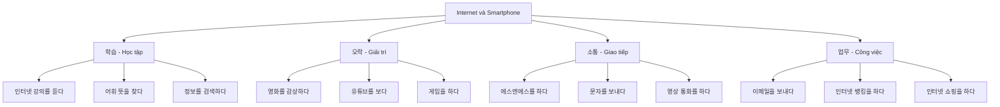
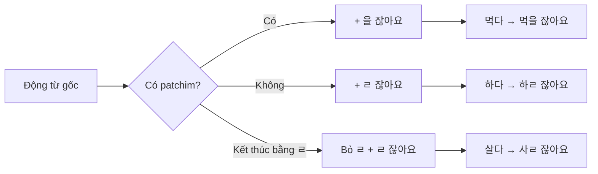
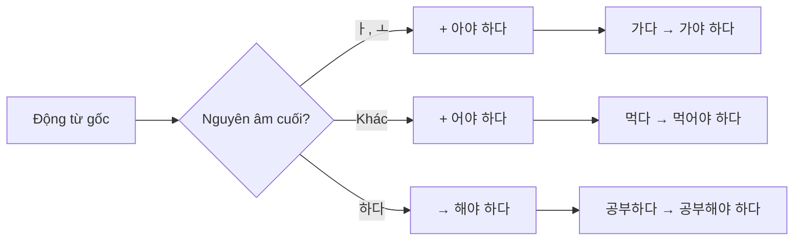

# Bài 14: 인터넷과 스마트폰 (Internet và Smartphone)

## 📚 Mục tiêu bài học

Sau khi hoàn thành bài học này, người học sẽ có khả năng:

- Sử dụng từ vựng liên quan đến Internet và Smartphone
- Sử dụng ngữ pháp **-(으)ㄹ 잖아요** và **-아/어야 하다**
- Nói về các hoạt động sử dụng Internet và Smartphone
- Miêu tả cách sử dụng thiết bị điện tử

---

## 🗂️ Phần 1: Từ vựng

### 1.1. Từ vựng về Internet và Smartphone

| Tiếng Hàn | Nghĩa tiếng Việt | Ví dụ |
|-----------|-----------------|-------|
| 인터넷 | Internet | 저는 보통 인터넷으로 정보를 검색해요. (Tôi thường tìm kiếm thông tin qua internet.) |
| 스마트폰 | Smartphone | 요즘은 누구나 스마트폰을 가지고 있잖아요. (Dạo này ai cũng có smartphone mà.) |
| 정보 | Thông tin | 인터넷으로 정보를 검색할 수 있잖아요. (Có thể tìm kiếm thông tin qua internet mà.) |
| 검색하다 | Tìm kiếm | 정보를 검색하다 (Tìm kiếm thông tin) |
| 뱅킹 | Ngân hàng (banking) | 인터넷 뱅킹을 하다 (Làm ngân hàng trực tuyến) |
| 쇼핑 | Mua sắm | 인터넷 쇼핑을 하다 (Mua sắm trực tuyến) |
| 이메일 | Email | 이메일을 보내다 (Gửi email) |
| 강의 | Bài giảng | 인터넷 강의를 듣다 (Nghe bài giảng trực tuyến) |
| 영화 | Phim | 영화를 감상하다 (Xem phim) |
| 에스엔에스(SNS) | Mạng xã hội | 에스엔에스(SNS)를 하다 (Sử dụng mạng xã hội) |
| 댓글 | Bình luận | 댓글을 남기다 (Để lại bình luận) |
| 유튜브(Youtube) | Youtube | 유튜브를 보다 (Xem Youtube) |
| 사진 | Ảnh | 저는 스마트폰으로 사진을 촬영하거나 게임을 해요. (Tôi chụp ảnh hoặc chơi game bằng smartphone.) |
| 동영상 | Video | 사진/동영상을 촬영하다 (Chụp ảnh/quay video) |
| 통화 | Cuộc gọi | 영상 통화를 하다 (Gọi video) |
| 문자 | Tin nhắn | 문자를 보내다 (Gửi tin nhắn) |
| 어휘 | Từ vựng | 저는 한국어 어휘 앱을 설치해 놓고 심심할 때마다 공부해요. (Tôi cài ứng dụng từ vựng tiếng Hàn và học mỗi khi rảnh rỗi.) |
| 게임 | Game | 게임을 하다 (Chơi game) |
| 앱(App) | Ứng dụng | 앱을 설치하다 (Cài đặt ứng dụng) |
| 설치하다 | Cài đặt | 한국어 어휘 앱을 설치해 놓고 공부해요. (Cài ứng dụng từ vựng tiếng Hàn và học.) |

### 1.2. Các hoạt động trên Internet

| Tiếng Hàn | Nghĩa tiếng Việt | Ví dụ |
|-----------|-----------------|-------|
| 정보를 검색하다 | Tìm kiếm thông tin | 저는 보통 인터넷으로 정보를 검색해요. (Tôi thường tìm kiếm thông tin qua internet.) |
| 인터넷 뱅킹을 하다 | Làm ngân hàng trực tuyến | 인터넷 뱅킹을 하다 (Làm ngân hàng trực tuyến) |
| 인터넷 쇼핑을 하다 | Mua sắm trực tuyến | 인터넷 쇼핑을 하다 (Mua sắm trực tuyến) |
| 이메일을 보내다 | Gửi email | 이메일을 보내다 (Gửi email) |
| 인터넷 강의를 듣다 | Nghe bài giảng trực tuyến | 인터넷 강의를 듣다 (Nghe bài giảng trực tuyến) |
| 영화를 감상하다 | Xem phim | 영화를 감상하다 (Xem phim) |
| 에스엔에스를 하다 | Sử dụng mạng xã hội | 에스엔에스(SNS)를 하다 (Sử dụng mạng xã hội) |
| 댓글을 남기다 | Để lại bình luận | 댓글을 남기다 (Để lại bình luận) |
| 유튜브를 보다 | Xem Youtube | 유튜브를 뭐든지 쉽게 배울 수 있잖아요. (Có thể học bất cứ gì dễ dàng qua Youtube mà.) |
| 사진/동영상을 촬영하다 | Chụp ảnh/quay video | 사진/동영상을 촬영하다 (Chụp ảnh/quay video) |
| 영상 통화를 하다 | Gọi video | 영상 통화가 있잖아요. 영상 통화로 부모님께 자주 연락드리세요. (Có cuộc gọi video mà. Hãy liên lạc với bố mẹ thường xuyên qua video call nhé.) |
| 문자를 보내다 | Gửi tin nhắn | 문자를 보내다 (Gửi tin nhắn) |
| 어휘 뜻을 찾다 | Tra nghĩa từ vựng | 어휘 뜻을 찾다 (Tra nghĩa từ vựng) |
| 게임을 하다 | Chơi game | 저는 스마트폰으로 사진을 촬영하거나 게임을 해요. (Tôi chụp ảnh hoặc chơi game bằng smartphone.) |
| 앱을 설치하다 | Cài đặt ứng dụng | 한국어 어휘 앱을 설치해 놓고 공부해요. (Cài ứng dụng từ vựng tiếng Hàn và học.) |

### 1.3. Tính từ mô tả

| Tiếng Hàn | Nghĩa tiếng Việt | Ví dụ |
|-----------|-----------------|-------|
| 편리하다 | Tiện lợi | 스마트폰은 편리합니다. (Smartphone rất tiện lợi.) |
| 빠르다 | Nhanh | 인터넷으로 빠르게 검색할 수 있어요. (Có thể tìm kiếm nhanh qua internet.) |
| 느끼다 | Cảm nhận | 편리함을 느끼다 (Cảm nhận sự tiện lợi) |
| 최신 | Mới nhất | 최신 스마트폰으로 찍었잖아요. (Chụp bằng smartphone mới nhất mà.) |
| 간편하다 | Đơn giản, tiện lợi | 간편하게 먹을 수 있잖아요. (Có thể ăn một cách đơn giản mà.) |
| 세계적 | Toàn cầu | 세계적으로 인기가 있어요. (Nổi tiếng toàn cầu.) |
| 출장 | Công tác | 드미트리는 출장을 갔잖아요. (Dmitri đi công tác mà.) |
| 홈페이지 | Trang chủ | 홈페이지에 접속하세요. (Hãy truy cập trang chủ.) |
| 회원 | Thành viên | 회원 가입을 해야 해요. (Phải đăng ký thành viên.) |
| 가입하다 | Đăng ký | 회원 가입을 해야 해요. (Phải đăng ký thành viên.) |
| 본인 | Bản thân | 본인 확인이 필요해요. (Cần xác nhận bản thân.) |
| 개통하다 | Kích hoạt | 휴대폰을 개통하다 (Kích hoạt điện thoại) |
| 접속하다 | Truy cập | 인터넷에 접속하고 싶다 (Muốn truy cập internet) |

### 1.4. Từ vựng bổ sung

| Tiếng Hàn | Nghĩa tiếng Việt | Ví dụ |
|-----------|-----------------|-------|
| 촬영하다 | Chụp ảnh, quay video | 사진/동영상을 촬영하다 (Chụp ảnh/quay video) |
| 영상 | Video, hình ảnh | 영상 통화를 하다 (Gọi video) |
| 추천하다 | Giới thiệu, đề xuất | 이 앱을 추천해요. (Tôi giới thiệu ứng dụng này.) |
| 공부하다 | Học | 스마트폰으로 한번 공부해 보세요. (Hãy thử học qua smartphone xem.) |
| 공부 | Việc học | 한국어를 재미있게 공부하는 방법이 있어요? (Có phương pháp học tiếng Hàn thú vị không?) |
| 공부해요 | Học (tôn trọng) | 심심할 때마다 공부해요. (Học mỗi khi rảnh rỗi.) |
| 항상 | Luôn luôn | 항상 열심히 공부해요. (Luôn học chăm chỉ.) |
| 열심히 | Chăm chỉ | 열심히 공부해야 해요. (Phải học chăm chỉ.) |
| 너무 | Quá | 고향에 계신 부모님이 너무 보고 싶어요. (Tôi rất nhớ bố mẹ ở quê.) |
| 보고 싶다 | Nhớ | 부모님이 너무 보고 싶어요. (Tôi rất nhớ bố mẹ.) |
| 전화로 | Qua điện thoại | 전화로 연락해요. (Liên lạc qua điện thoại.) |
| 휴대폰 | Điện thoại di động | 휴대폰을 개통하다 (Kích hoạt điện thoại di động) |
| 개통 방법 | Phương pháp kích hoạt | 휴대폰 개통 방법 (Phương pháp kích hoạt điện thoại) |
| 보호자 | Người bảo hộ | 보호자가 있잖아요. (Có người bảo hộ mà.) |
| 케이팝 (K-pop) | K-pop | 케이팝(K-pop)이 세계적으로 인기 있는 이유 (Lý do K-pop nổi tiếng toàn cầu) |

### 1.5. Từ vựng về các vấn đề liên quan

| Tiếng Hàn | Nghĩa tiếng Việt | Ví dụ |
|-----------|-----------------|-------|
| 대중화 | Đại chúng hóa | 스마트폰의 대중화 (Đại chúng hóa smartphone) |
| 부정적 | Tiêu cực | 부정적인 영향 (Ảnh hưởng tiêu cực) |
| 중독 | Nghiện | 스마트폰 중독 (Nghiện smartphone) |
| 불면증 | Mất ngủ | 불면증이 생기다 (Bị mất ngủ) |
| 시력 악화 | Thị lực suy giảm | 시력 악화 (Thị lực suy giảm) |
| 음주 운전 | Lái xe khi say rượu | 음주 운전과 같다 (Giống như lái xe khi say rượu) |
| 어색하다 | Khó xử, lúng túng | 사람과 사람이 직접 만나기보다는 에스엔에스(SNS)로 연락을 주고받는 일이 많아졌다. (Việc liên lạc qua SNS nhiều hơn là gặp mặt trực tiếp đã tăng lên.) |
| 소통하다 | Giao tiếp | 에스엔에스(SNS)로 소통하다 (Giao tiếp qua SNS) |
| 신속하다 | Nhanh chóng | 신속하게 해결하다 (Giải quyết nhanh chóng) |
| 해결하다 | Giải quyết | 문제를 해결하다 (Giải quyết vấn đề) |
| 의존도 | Mức độ phụ thuộc | 스마트폰 의존도 (Mức độ phụ thuộc vào smartphone) |
| 수시로 | Thường xuyên | 수시로 확인하다 (Kiểm tra thường xuyên) |
| 데이터 | Dữ liệu | 데이터 사용량 (Lượng dữ liệu sử dụng) |
| 보편화 | Phổ biến hóa | 스마트폰의 보편화 (Phổ biến hóa smartphone) |
| 소통이 단절되다 | Giao tiếp bị đứt đoạn | 사람과 사람의 소통이 단절되다 (Giao tiếp giữa người với người bị đứt đoạn) |
| 개인 정보 유출 | Rò rỉ thông tin cá nhân | 개인 정보 유출 (Rò rỉ thông tin cá nhân) |
| 사생활 노출 | Lộ đời tư | 사생활 노출 (Lộ đời tư) |
| 과유불급 | Quá đáng không tốt | 과유불급(過猶不及)이라는 말이 있다. (Có câu "Quá đáng không tốt".) |
| 지혜 | Trí tuệ | 지혜롭게 사용하다 (Sử dụng một cách khôn ngoan) |
| 활용하다 | Sử dụng, khai thác | 스마트폰을 잘 활용하다 (Sử dụng smartphone tốt) |
| 점검하다 | Kiểm tra | 스스로 점검하다 (Tự kiểm tra) |

### 1.6. Từ vựng về kích hoạt điện thoại

| Tiếng Hàn | Nghĩa tiếng Việt | Ví dụ |
|-----------|-----------------|-------|
| 통신사 | Nhà mạng | 한국의 대표적인 통신사 (Nhà mạng tiêu biểu của Hàn Quốc) |
| 대표적 | Đại diện, tiêu biểu | 대표적인 통신사가 있다 (Có nhà mạng tiêu biểu) |
| 이들 | Họ, những người này | 이들 중 하나 (Một trong số họ) |
| 거역하다 | Chống lại | 거역할 수 없다 (Không thể chống lại) |
| 현지 | Địa phương | 현지 대리점 (Đại lý địa phương) |
| 여권 | Hộ chiếu | 여권이 있어야 해요. (Phải có hộ chiếu.) |
| 외국인 등록증 | Thẻ đăng ký ngoại kiều | 외국인 등록증이 필요해요. (Cần thẻ đăng ký ngoại kiều.) |
| 유심 (USIM) 카드 | Thẻ USIM | 유심(USIM) 카드가 있다면 (Nếu có thẻ USIM) |
| 요금제 | Gói cước | 요금제를 선택하는 것이 중요하다 (Lựa chọn gói cước là quan trọng) |
| 선택하다 | Lựa chọn | 요금제를 선택하다 (Lựa chọn gói cước) |
| 만약 | Nếu | 만약 데이터 사용량이 많다면 (Nếu lượng dữ liệu sử dụng nhiều) |
| 데이터 사용량 | Lượng dữ liệu sử dụng | 데이터 사용량이 많다 (Lượng dữ liệu sử dụng nhiều) |
| 음성 통화 | Cuộc gọi thoại | 음성 통화와 관계없이 (Không liên quan đến cuộc gọi thoại) |
| 관계없이 | Không liên quan | 데이터 사용량이나 음성 통화와 관계없이 (Không liên quan đến lượng dữ liệu hay cuộc gọi thoại) |
| 무제한 | Không giới hạn | 무제한으로 사용하다 (Sử dụng không giới hạn) |
| 무제한 요금제 | Gói cước không giới hạn | 무제한 요금제가 유리하다 (Gói cước không giới hạn có lợi) |
| 유리하다 | Có lợi | 무제한 요금제가 유리하다 (Gói cước không giới hạn có lợi) |
| 필요하다 | Cần thiết | 여권이 필요하다 (Cần hộ chiếu) |

### 1.7. Từ vựng khác từ bài học

| Tiếng Hàn | Nghĩa tiếng Việt | Ví dụ |
|-----------|-----------------|-------|
| 띄우다 | Làm nổi lên | 앱을 띄우다 (Mở ứng dụng) |
| 놓다 | Đặt, để | 설치해 놓고 공부해요 (Cài đặt sẵn và học) |
| 심심하다 | Chán | 심심할 때마다 (Mỗi khi chán) |
| 심심할 때마다 | Mỗi khi rảnh rỗi | 심심할 때마다 공부해요. (Học mỗi khi rảnh rỗi.) |
| 해 보다 | Thử làm | 스마트폰으로 한번 공부해 보세요. (Hãy thử học qua smartphone xem.) |
| 좋은 방법 | Phương pháp hay | 좋은 방법이에요. (Đó là phương pháp hay đấy.) |
| 꼭 | Nhất định | 꼭 책을 봐야 공부할 수 있는 게 아니네요. (Không nhất thiết phải xem sách mới có thể học được nhỉ.) |
| 알려 주다 | Cho biết | 앱 이름 좀 알려 주세요. (Hãy cho tôi biết tên ứng dụng.) |
| 바로 | Ngay lập tức | 저도 바로 해 볼게요. (Tôi cũng sẽ thử ngay.) |
| 한번 | Một lần, thử | 한번 공부해 보세요. (Hãy thử học một lần xem.) |
| 설치해 놓다 | Cài đặt sẵn | 한국어 어휘 앱을 설치해 놓고 공부해요. (Cài đặt sẵn ứng dụng từ vựng tiếng Hàn và học.) |
| 그걸로 | Bằng cái đó | 그걸로 해 보니까 아주 재미있어요. (Học như vậy rất thú vị đấy.) |
| 해 보니까 | Thử làm thì | 그걸로 해 보니까 아주 재미있어요. (Học như vậy rất thú vị đấy.) |
| 재미있다 | Thú vị | 한국어를 재미있게 공부하는 방법 (Phương pháp học tiếng Hàn thú vị) |
| 제대로 | Đúng cách | 제대로 공부하다 (Học đúng cách) |
| 부모님이 계시다 | Bố mẹ ở | 고향에 계신 부모님 (Bố mẹ ở quê) |
| 자주 | Thường xuyên | 부모님께 자주 연락드리세요. (Hãy liên lạc với bố mẹ thường xuyên.) |
| 연락드리다 | Liên lạc (kính ngữ) | 영상 통화로 부모님께 자주 연락드리세요. (Hãy liên lạc với bố mẹ thường xuyên qua video call.) |

---

## 📘 Phần 2: Ngữ pháp

### 2.1. Ngữ pháp **-(으)ㄹ 잖아요**

#### 📌 Cấu trúc

```
Động từ/Tính từ + -(으)ㄹ 잖아요
```

#### 📌 Ý nghĩa

Diễn tả người nói **nhắc nhở người nghe về điều hiển nhiên** hoặc điều mà cả hai đều đã biết. Có nghĩa là "...mà", "...đấy", "...chứ" trong tiếng Việt.

Dùng khi:
- Nhắc nhở điều ai cũng biết
- Nhấn mạnh thông tin rõ ràng
- Giải thích lý do

#### 📌 Cách sử dụng

| Dạng động từ | Quy tắc | Ví dụ |
|--------------|---------|-------|
| Có patchim | + **을 잖아요** | 먹다 → 먹**을 잖아요** |
| Không patchim | + **ㄹ 잖아요** | 하다 → 하**ㄹ 잖아요** |
| Kết thúc bằng ㄹ | Bỏ ㄹ + **ㄹ 잖아요** | 살다 → 사**ㄹ 잖아요** |

#### 📌 Bảng biến đổi từ thường gặp

| Động từ gốc | Nghĩa | Dạng -(으)ㄹ 잖아요 |
|-------------|-------|-------------------|
| 보다 | Nhìn, xem | 보**ㄹ 잖아요** |
| 입다 | Mặc | 입**을 잖아요** |
| 먹다 | Ăn | 먹**을 잖아요** |
| 하다 | Làm | 하**ㄹ 잖아요** |
| 가다 | Đi | 가**ㄹ 잖아요** |
| 오다 | Đến | 오**ㄹ 잖아요** |
| 듣다 | Nghe | 들**을 잖아요** |
| 있다 | Có | 있**잖아요** |

#### 📌 Ví dụ minh họa

| Câu hỏi | Câu trả lời |
|---------|-------------|
| 가: 와, 사진이 정말 잘 나왔네요. | (Wow, ảnh đẹp quá!) |
| 나: 최신 스마트폰으로 **찍었잖아요**. | (Chụp bằng smartphone mới nhất mà.) |
| 가: 고향에 계신 부모님이 너무 보고 싶어요. | (Tôi rất nhớ bố mẹ ở quê.) |
| 나: 영상 통화가 **있잖아요**. 영상 통화로 부모님께 자주 연락드리세요. | (Có cuộc gọi video mà. Hãy liên lạc với bố mẹ thường xuyên qua video call nhé.) |

#### 📌 Sự khác biệt với các dạng tương tự

| Ngữ pháp | Nghĩa | Ví dụ |
|----------|-------|-------|
| -(으)ㄹ **잖아요** | ...mà (nhắc nhở điều hiển nhiên) | 보호자가 **있잖아요** (Có người bảo hộ mà) |
| -(으)ㄹ **거예요** | Sẽ (dự định/dự đoán) | 내일 **갈 거예요** (Ngày mai sẽ đi) |
| -**지요?** | ...đúng không? (xác nhận) | 좋**지요**? (Tốt đúng không?) |

---

### 2.2. Ngữ pháp **-아/어야 하다/되다**

#### 📌 Cấu trúc

```
Động từ (gốc nguyên) + -아/어야 하다/되다
```

#### 📌 Ý nghĩa

Diễn tả **sự cần thiết**, **bắt buộc** hoặc **nghĩa vụ** phải làm việc gì đó. Có nghĩa là "phải", "cần phải" trong tiếng Việt.

Dùng khi:
- Thể hiện sự bắt buộc
- Nói về quy định, luật lệ
- Đưa ra lời khuyên mạnh mẽ

#### 📌 Cách sử dụng

| Nguyên âm cuối | Quy tắc | Ví dụ |
|--------------|---------|-------|
| ㅏ, ㅗ | + **아야 하다/되다** | 가다 → 가**아야** → **가야 하다** |
| Các nguyên âm khác | + **어야 하다/되다** | 먹다 → 먹**어야 하다** |
| 하다 | → **해야 하다** | 공부하다 → 공부**해야 하다** |

#### 📌 Bảng biến đổi từ thường gặp

| Động từ gốc | Nghĩa | Dạng -아/어야 하다 |
|-------------|-------|------------------|
| 가다 | Đi | 가**야 하다** |
| 먹다 | Ăn | 먹**어야 하다** |
| 공부하다 | Học | 공부**해야 하다** |
| 만들다 | Làm | 만들**어야 하다** |
| 자다 | Ngủ | 자**야 하다** |
| 입다 | Mặc | 입**어야 하다** |
| 보다 | Xem | 봐**야 하다** |

#### 📌 Ví dụ minh họa

| Tình huống | Câu nói |
|-----------|---------|
| Bắt buộc | 지금 출발**해야 해요**. (Bây giờ phải xuất phát.) |
| Lời khuyên | 열심히 공부**해야 해요**. (Phải học chăm chỉ.) |
| Quy định | 회원 가입을 **해야 해요**. (Phải đăng ký thành viên.) |
| Điều kiện | 휴대폰을 개통**하려면** 여권이 **있어야 해요**. (Để kích hoạt điện thoại phải có hộ chiếu.) |

#### 📌 So sánh với các ngữ pháp tương tự

| Ngữ pháp | Ý nghĩa | Tình huống sử dụng |
|----------|---------|-------------------|
| -아/어야 **하다** | Phải làm (bắt buộc mạnh) | Quy định, nghĩa vụ |
| -아/어야 **되다** | Phải làm (bắt buộc nhẹ hơn) | Điều kiện cần thiết |
| -(으)**ㄹ까요?** | Có nên...không? (đề xuất) | Hỏi ý kiến |
| -(으)**면 좋겠어요** | Hy vọng, mong muốn | Mong ước |

---

## 🗣️ Phần 3: Mẫu câu và hội thoại

### 3.1. Hội thoại mẫu 1: Học tiếng Hàn qua Smartphone

**아나이스**: 라민 씨, 한국어를 재미있게 공부하는 방법이 있어요?

**라민**: 요즘은 누구나 **스마트폰을** 가지고 **있잖아요**. 스마트폰으로 한번 공부해 보세요.

**아나이스**: 그래요? 어떻게요?

**라민**: 저는 한국어 어휘 앱을 설치해 놓고 심심할 때마다 공부해요. 그걸로 해 보니까 아주 재미있어요.

**아나이스**: 와! 좋은 방법이에요. 꼭 책을 **봐야** 공부할 수 있는 게 아니네요.

**라민**: 네. 앱 이름 좀 알려 주세요. 저도 바로 해 볼게요.

#### Dịch nghĩa:

**Anaïs**: Ramin à, có phương pháp học tiếng Hàn thú vị không?

**Ramin**: Dạo này ai cũng **có smartphone mà**. Hãy thử học qua smartphone xem.

**Anaïs**: Thật à? Làm thế nào?

**Ramin**: Tôi cài ứng dụng từ vựng tiếng Hàn và học mỗi khi rảnh rỗi. Học như vậy rất thú vị đấy.

**Anaïs**: Wow! Đó là phương pháp hay đấy. Không nhất thiết **phải** xem sách mới có thể học được nhỉ.

**Ramin**: Đúng vậy. Hãy cho tôi biết tên ứng dụng. Tôi cũng sẽ thử ngay.

---

### 3.2. Bảng so sánh cách sử dụng ngữ pháp

| Ngữ cảnh | Câu sử dụng -(으)ㄹ 잖아요 | Câu sử dụng -아/어야 하다 |
|----------|------------------------|----------------------|
| Tìm kiếm thông tin | **인터넷으로 정보를 검색할 수 있잖아요.** (Có thể tìm kiếm thông tin qua internet mà.) | **인터넷으로 정보를 검색해야 해요.** (Phải tìm kiếm thông tin qua internet.) |
| Xác nhận kênh YouTube | **후옌은 유튜브 개인 채널을 가지고 있잖아요.** (Huyền có kênh YouTube cá nhân mà.) | **유튜브 채널을 만들어야 해요.** (Phải tạo kênh YouTube.) |
| Cuộc gọi video | **영상 통화가 있잖아요.** (Có cuộc gọi video mà.) | **영상 통화를 해야 해요.** (Phải gọi video.) |

---

### 3.3. Luyện tập với từ vựng

#### Bài tập 1: Hoàn thành câu với **-(으)ㄹ 잖아요**

1. 김밥 → 바쁠 때 간편하게 먹을 수 있다 → 김밥은 **바쁠 때 간편하게 먹을 수 있잖아요.**
   - (Kimbap có thể ăn tiện lợi khi bận rộn mà.)

2. 걸어서 가다 → 건강에 좋다 → 걸어서 가는 것은 **건강에 좋잖아요.**
   - (Đi bộ thì tốt cho sức khỏe mà.)

3. 드미트리 → 출장을 갔다 → 드미트리는 **출장을 갔잖아요.**
   - (Dmitri đi công tác rồi mà.)

#### Bài tập 2: Hoàn thành câu với **-아/어야 하다**

1. 휴대폰이 있다 → 휴대폰이 **있어야 해요**
   - (Phải có điện thoại di động)

2. 한국어 사전 → 한국어 사전을 **사야 해요**
   - (Phải mua từ điển tiếng Hàn)

3. 한국에서 취직하고 싶다 → 한국어를 **공부해야 해요**
   - (Muốn xin việc ở Hàn Quốc thì phải học tiếng Hàn)

4. 인터넷에 접속하고 싶다 → 회원 가입을 **해야 해요**
   - (Muốn truy cập internet thì phải đăng ký thành viên)

---

## 🎧 Phần 4: Nghe (듣기)

### 4.1. Câu hỏi khởi động

**여러분은 유튜브를 자주 봅니까? 어떤 내용을 봅니까?**
(Các bạn có thường xuyên xem YouTube không? Xem nội dung gì?)

#### Ba câu hỏi gợi ý:

1. **어떤 영상을 좋아해요?**
   - (Bạn thích video nào?)

2. **그 영상은 어떤 내용이에요?**
   - (Video đó có nội dung gì?)

3. **추천하고 싶은 영상이 있어요?**
   - (Có video nào bạn muốn giới thiệu không?)

---

### 4.2. Bài nghe: 후엔과 라흐만 씨가 이야기합니다

**1) 후엔과 라흐만은 무엇에 대한 이야기를 합니까?**
(Huyền và Rahman đang nói chuyện về điều gì?)

① 라흐만은 유튜브를 보면서 운동을 배운다.
② 후엔은 유튜브 개인 채널을 가지고 있다.
③ 후엔은 한국 요리에 대한 영상을 자주 본다.

**2) 들은 내용과 같으면 ○, 다르면 X 하세요.**
(Nếu giống nội dung đã nghe thì đánh ○, khác thì đánh X)

① 라흐만은 유튜브를 보면서 운동을 배운다. (    )
   - *Đáp án:* 영상 추천하다

② 후엔은 유튜브 개인 채널을 가지고 있다. (    )

③ 후엔은 한국 요리에 대한 영상을 자주 본다. (    )

---

### 4.3. Luyện tập phát âm

**발음 연습:**

| Từ gốc | Cách phát âm | Quy tắc |
|--------|-------------|---------|
| 어떻잖아요 | [어떠자나요] | Liên kết âm |
| 괜찮아요 | [괜차나요] | Liên kết âm |
| 좋아하는 | [조아하는] | Rút gọn |

#### Các câu luyện tập:

**답을 듣고 따라 읽으세요.**

1) 혼자 배우기 **어떻잖아요.**
2) 한국어 어휘 공부 앱이 아주 **괜찮아요.**
3) 이것은 제가 **좋아하는** 인터넷 게임이에요.

---

## 📖 Phần 5: Đọc (읽기)

### 5.1. Bài đọc: 뉴스에서 인터넷과 스마트폰의 긍정적인 영향에 대해 이야기하고 있습니다

**Tin tức đang nói về tác động tích cực của Internet và Smartphone. Hãy đọc và nói về từng nội dung.**

#### 📰 Nội dung tin tức

**1) 적절한 스마트폰 사용, 사회적 고립감 해소에 도움**
   - (Sử dụng smartphone hợp lý giúp giảm cảm giác cô lập trong xã hội)

**2) 스마트폰의 대중화가 만들어 낸 1인 미디어 시대**
   - (Kỷ nguyên truyền thông cá nhân được tạo ra bởi sự đại chúng hóa smartphone)

**3) 지갑 대신 스마트폰에 앱카드**
   - (Thẻ ứng dụng trong smartphone thay cho ví)

**4) 응급 상황 의료 기관, 약국 찾기, 스마트폰·인터넷으로**
   - (Tìm kiếm cơ quan y tế, nhà thuốc trong tình huống khẩn cấp qua smartphone và internet)

---

### 5.2. Bài đọc: 스마트폰과 인터넷을 너무 많이 사용해서 발생하는 부정적인 영향

**Smartphone và Internet được sử dụng quá nhiều sẽ gây ra những tác động tiêu cực gì? Hãy kết nối để nhìn thấy.**

**1) 인터넷과 스마트폰 중독**
   - Nghiện Internet và Smartphone
   - ➜ **잠자리에서 스마트폰 사용, 불면증과 시력 악화의 원인으로 꼽혀**
   - (Sử dụng smartphone trên giường được coi là nguyên nhân gây mất ngủ và suy giảm thị lực)

**2) 건강 문제**
   - Vấn đề sức khỏe
   - ➜ **지난 음주 운전은 감소, 운전 중 스마트폰 사용은 증가**
   - (Lái xe sau khi uống rượu giảm, nhưng sử dụng smartphone khi lái xe tăng)

**3) 교통사고와 안전 문제**
   - Tai nạn giao thông và vấn đề an toàn
   - ➜ **잠시라도 안 보면 불안하다? 전문가의 진단을 받아 보세요.**
   - (Cảm thấy bất an nếu không nhìn điện thoại dù chỉ một lát? Hãy được chuyên gia chẩn đoán.)

**4) 대인 관계 문제**
   - Vấn đề quan hệ giữa người với người
   - ➜ **만나면 어색, 에스엔에스(SNS)로만 소통하는 '나, 너, 우리' 이대로 괜찮을까?**
   - (Gặp nhau thì lúng túng, chỉ giao tiếp qua SNS - 'Tôi, bạn, chúng ta' như thế này có ổn không?)

---

### 5.3. Bài đọc dài: 다음은 스마트폰 사용에 대한 글입니다

**Đây là bài viết về việc sử dụng smartphone. Hãy đọc và trả lời câu hỏi bên dưới.**

스마트폰이 없는 일상을 상상하기 어려운 시대가 되었다. 과거와 달리 우리는 스마트폰 덕분에 많은 일을 쉽고 신속하게 해결할 수 있게 되었다. 반면, 스마트폰 의존도가 높아지면서 인간관계나 우리의 삶에도 많은 변화를 가져왔다.

먼저, 스마트폰 사용이 주는 편리함부터 살펴보자. 스마트폰이라는 작은 기기 하나만 있으면 시간 활용, 녹음, 동영상 촬영에서 온라인 강의까지 모든 것이 가능하다. 또 스마트폰으로 우리는 전 세계 어디에 있는 사람과도 수시로 이메일을 주고받거나 영상 통화를 한다. 무엇보다도 스마트폰으로 우리는 필요한 정보와 최신의 데이터를 쉽게 발견하고 활용한다. 쇼핑, 게임, 인터넷 뱅킹도 보편화되었다.

한편, 스마트폰의 편리함이 인간관계나 우리의 삶에 미친 영향도 크다. 사람과 사람이 직접 만나기보다는 에스엔에스(SNS)로 연락을 주고받는 일이 많아졌다. 대화가 줄어들고 소통이 단절되는 일도 생겼다. 또 스마트폰에 대한 의존도가 높아지면서 개인 정보 유출, 사생활 노출, 스마트폰 중독 등의 사회 문제가 심각해졌다.

과유불급(過猶不及)이라는 말이 있다. 어떤 일의 정도가 지나친 것은 모자란 것보다 좋지 않다는 뜻이다. 스마트폰에 의존하지 않고 스마트폰을 잘 사용하는 지혜가 필요하다.

---

#### 📝 Câu hỏi:

**1) 이 글은 무엇에 대한 글입니까?**

① 스마트폰 의존도
② 스마트폰의 장점과 단점
③ 스마트폰의 편리함

*Đáp án:*
- 신속하다
- 해결하다
- 의존도
- 수시로
- 데이터
- 보편화
- 소통이 단절되다
- 개인 정보 유출
- 사생활 노출
- 과유불급
- 지혜
- 활용하다

**2) 윗글의 내용과 같으면 ○, 다르면 X 하세요.**

① 스마트폰 사용과 사회 문제는 별로 관계가 없다. (    )

② 스마트폰이 있어도 많은 사람들은 직접 만나서 일을 해결한다. (    )

③ '과유불급'은 어떤 일의 정도가 적당하다는 뜻이다. (    )

---

## 📊 Phần 6: Biểu đồ minh họa

### 6.1. Sơ đồ hoạt động trên Internet và Smartphone



### 4.2. Cấu trúc ngữ pháp -(으)ㄹ 잖아요



### 4.3. Cấu trúc ngữ pháp -아/어야 하다



### 6.4. So sánh hai ngữ pháp

```mermaid
graph TB
    A[Ngữ pháp so sánh] --> B[-(으)ㄹ 잖아요]
    A --> C[-아/어야 하다]

    B --> B1[Ý nghĩa: Nhắc nhở điều hiển nhiên]
    B --> B2[Tình huống: Khi ai cũng biết]
    B --> B3[Ví dụ: 보호자가 있잖아요]

    C --> C1[Ý nghĩa: Phải làm, bắt buộc]
    C --> C2[Tình huống: Nghĩa vụ, quy định]
    C --> C3[Ví dụ: 공부해야 해요]
```

---

## ✍️ Phần 7: Viết (쓰기)

### 7.1. Câu hỏi khởi động

**여러분은 인터넷과 스마트폰으로 무엇을 합니까? 인터넷과 스마트폰을 잘못 활용할 때의 문제점은 무엇입니까? 인터넷과 스마트폰을 잘 활용하기 위한 방법은 무엇입니까? 간단히 메모해 보세요.**

(Các bạn làm gì với Internet và Smartphone? Vấn đề khi sử dụng Internet và Smartphone sai là gì? Phương pháp để sử dụng Internet và Smartphone tốt là gì? Hãy ghi chú ngắn gọn.)

---

### 7.2. Bài tập viết có cấu trúc

#### 📋 Gợi ý 1: 인터넷/스마트폰으로 하는 일

**Những việc làm với Internet/Smartphone:**

| Hoạt động | Ghi chú |
|-----------|---------|
| 정보를 검색하다 | Tìm kiếm thông tin |
| 인터넷 뱅킹을 하다 | Làm ngân hàng trực tuyến |
| 인터넷 쇼핑을 하다 | Mua sắm trực tuyến |
| 이메일을 보내다 | Gửi email |
| 인터넷 강의를 듣다 | Nghe bài giảng trực tuyến |
| 영화를 감상하다 | Xem phim |
| 에스엔에스(SNS)를 하다 | Sử dụng mạng xã hội |
| 댓글을 남기다 | Để lại bình luận |
| 유튜브(Youtube)를 보다 | Xem Youtube |
| 사진/동영상을 촬영하다 | Chụp ảnh/quay video |
| 영상 통화를 하다 | Gọi video |
| 문자를 보내다 | Gửi tin nhắn |
| 어휘 뜻을 찾다 | Tra nghĩa từ vựng |
| 게임을 하다 | Chơi game |
| 앱(App)을 설치하다 | Cài đặt ứng dụng |

---

#### 📋 Gợi ý 2: 인터넷/스마트폰을 잘못 활용했을 때의 문제점

**Vấn đề khi sử dụng Internet/Smartphone không đúng cách:**

| Vấn đề | Ghi chú |
|--------|---------|
| 스마트폰 중독 | Nghiện smartphone |
| 불면증 | Mất ngủ |
| 시력 악화 | Suy giảm thị lực |
| 교통사고 | Tai nạn giao thông |
| 대인 관계 문제 | Vấn đề quan hệ con người |
| 개인 정보 유출 | Rò rỉ thông tin cá nhân |
| 사생활 노출 | Lộ đời tư |
| 소통이 단절되다 | Giao tiếp bị đứt đoạn |

---

#### 📋 Gợi ý 3: 인터넷/스마트폰을 적절하게 활용하는 방법

**Phương pháp sử dụng Internet/Smartphone hợp lý:**

| Phương pháp | Ghi chú |
|-------------|---------|
| 사용 시간을 정하다 | Quy định thời gian sử dụng |
| 필요한 앱만 설치하다 | Chỉ cài đặt ứng dụng cần thiết |
| 개인 정보를 보호하다 | Bảo vệ thông tin cá nhân |
| 운전 중 사용하지 않다 | Không sử dụng khi lái xe |
| 직접 만나서 대화하다 | Gặp trực tiếp để trò chuyện |
| 스스로 점검하다 | Tự kiểm tra |
| 지혜롭게 활용하다 | Sử dụng một cách khôn ngoan |

---

### 7.3. Viết bài hoàn chỉnh

**위 메모를 바탕으로 '인터넷과 스마트폰의 현명한 활용 방법'에 대해 글을 써 보세요.**

(Dựa trên ghi chú trên, hãy viết bài về "Phương pháp sử dụng khôn ngoan Internet và Smartphone".)

*Gợi ý cấu trúc:*
- **Đoạn 1:** Giới thiệu - Những việc bạn làm với Internet/Smartphone
- **Đoạn 2:** Vấn đề khi sử dụng sai
- **Đoạn 3:** Phương pháp sử dụng hợp lý
- **Kết luận:** Tổng kết

---

## 💡 Phần 8: Văn hóa và Thông tin

### 휴대폰 개통 방법 (Cách kích hoạt điện thoại di động)

Để kích hoạt điện thoại di động ở Hàn Quốc, bạn cần lưu ý những điều sau:

1. **Chọn nhà mạng**: Ở Hàn Quốc có 3 nhà mạng lớn là **SKT, KT, LG U+**. Vì vậy, nếu muốn kích hoạt điện thoại, bạn cần đến đại lý của một trong 3 nhà mạng này.

2. **Chuẩn bị giấy tờ**:
   - Hộ chiếu (여권)
   - Thẻ ngoại kiều (외국인 등록증) nếu có
   - USIM card (유심 카드)

3. **Lựa chọn loại gói cước**:
   - Dữ liệu (데이터): Gói data, tin nhắn, thông thoại
   - Gói cước định mức (무제한 요금제): Gói không giới hạn

4. **Đăng ký thông tin cá nhân**: Cần đăng ký thông tin chính xác và trung thực.

#### Các câu hỏi thường gặp:

1. **휴대폰을 개통할 때 무엇이 필요합니까?**
   (Khi kích hoạt điện thoại cần gì?)

2. **'무제한 요금제'란 무엇입니까?**
   (Gói cước không giới hạn là gì?)

3. **여러분은 한국에서 휴대폰을 개통할 때 어떤 어려움을 느꼈습니까?**
   (Bạn đã gặp khó khăn gì khi kích hoạt điện thoại ở Hàn Quốc?)

---

## 📋 Phần 9: Bảng từ vựng tổng hợp (배운 어휘 확인)

### Danh sách từ vựng đã học trong Bài 14

| Cột 1 | Cột 2 |
|-------|-------|
| ☐ 정보를 검색하다 (Tìm kiếm thông tin) | ☐ 영상 (Video, hình ảnh) |
| ☐ 인터넷 뱅킹을 하다 (Làm ngân hàng trực tuyến) | ☐ 추천하다 (Giới thiệu) |
| ☐ 인터넷 쇼핑을 하다 (Mua sắm trực tuyến) | ☐ 긍정적 (Tích cực) |
| ☐ 이메일을 보내다 (Gửi email) | ☐ 고립감 (Cảm giác cô lập) |
| ☐ 인터넷 강의를 듣다 (Nghe bài giảng trực tuyến) | ☐ 대중화 (Đại chúng hóa) |
| ☐ 영화를 감상하다 (Xem phim) | ☐ 부정적 (Tiêu cực) |
| ☐ 에스엔에스(SNS)를 하다 (Sử dụng mạng xã hội) | ☐ 인터넷 중독 (Nghiện internet) |
| ☐ 댓글을 남기다 (Để lại bình luận) | ☐ 불면증 (Mất ngủ) |
| ☐ 유튜브(Youtube)를 보다 (Xem Youtube) | ☐ 시력 악화 (Suy giảm thị lực) |
| ☐ 사진/동영상을 촬영하다 (Chụp ảnh/quay video) | ☐ 음주 운전 (Lái xe sau khi uống rượu) |
| ☐ 영상 통화를 하다 (Gọi video) | ☐ 어색하다 (Khó xử, lúng túng) |
| ☐ 문자를 보내다 (Gửi tin nhắn) | ☐ 소통하다 (Giao tiếp) |
| ☐ 어휘 뜻을 찾다 (Tra nghĩa từ vựng) | ☐ 신속하다 (Nhanh chóng) |
| ☐ 게임을 하다 (Chơi game) | ☐ 해결하다 (Giải quyết) |
| ☐ 앱(App)을 설치하다 (Cài đặt ứng dụng) | ☐ 의존도 (Mức độ phụ thuộc) |
| ☐ 최신 (Mới nhất) | ☐ 수시로 (Thường xuyên) |
| ☐ 간편하다 (Đơn giản, tiện lợi) | ☐ 데이터 (Dữ liệu) |
| ☐ 세계적 (Toàn cầu) | ☐ 보편화 (Phổ biến hóa) |
| ☐ 출장을 가다 (Đi công tác) | ☐ 소통이 단절되다 (Giao tiếp bị đứt đoạn) |
| ☐ 홈페이지 (Trang chủ) | ☐ 개인 정보 유출 (Rò rỉ thông tin cá nhân) |
| ☐ 회원 (Thành viên) | ☐ 사생활 노출 (Lộ đời tư) |
| ☐ 가입하다 (Đăng ký) | ☐ 과유불급 (Quá đáng không tốt) |
| ☐ 본인 (Bản thân) | ☐ 지혜 (Trí tuệ) |
| ☐ 개통하다 (Kích hoạt) | ☐ 활용하다 (Sử dụng, khai thác) |
| ☐ 접속하다 (Truy cập) | ☐ 점검하다 (Kiểm tra) |

---

## ✍️ Phần 10: Bài tập thực hành

### Bài tập 1: Nối từ vựng với nghĩa

| Tiếng Hàn | Nghĩa tiếng Việt |
|-----------|-----------------|
| 정보를 검색하다 | Tìm kiếm thông tin |
| 인터넷 뱅킹을 하다 | Làm ngân hàng trực tuyến |
| 에스엔에스를 하다 | Sử dụng mạng xã hội |
| 댓글을 남기다 | Để lại bình luận |
| 앱을 설치하다 | Cài đặt ứng dụng |

### Bài tập 2: Chọn đáp án đúng

**1. 네, 지금 출발해야 ___________.**

a) **늦지 않아요**
b) 늦지 않잖아요
c) 늦지 않을 거예요
d) 늦지 않았어요

**2. 보호자가 ___________.**

a) 있어요
b) **있잖아요**
c) 있을 거예요
d) 있었어요

### Bài tập 3: Điền vào chỗ trống

1. 최신 스마트폰으로 __________ (찍다 - chụp) → **찍었잖아요**
2. 스마트폰을 __________ (가지다 - có) → **가지고 있잖아요**
3. 지금 출발__________ (하다 - làm) → **해야 해요** (늦지 않게)

---

## 📝 Phần 11: Tổng kết

### Những điểm chính cần nhớ:

✅ **Từ vựng**: Học các từ vựng liên quan đến Internet và Smartphone
✅ **Ngữ pháp -(으)ㄹ 잖아요**: Nhắc nhở điều hiển nhiên (...mà, ...đấy)
✅ **Ngữ pháp -아/어야 하다**: Diễn tả sự bắt buộc, cần thiết (phải)
✅ **Văn hóa**: Tìm hiểu cách kích hoạt điện thoại di động ở Hàn Quốc

### Bảng tổng hợp ngữ pháp

| Ngữ pháp | Cấu trúc | Ý nghĩa | Ví dụ |
|----------|----------|---------|-------|
| -(으)ㄹ 잖아요 | Động từ + (으)ㄹ 잖아요 | Nhắc nhở điều hiển nhiên | 스마트폰이 **있잖아요** (Có smartphone mà) |
| -아/어야 하다 | Động từ + 아/어야 하다 | Phải, bắt buộc | 공부**해야 해요** (Phải học) |

---

**Chúc các bạn học tốt! 화이팅!** 🎉
