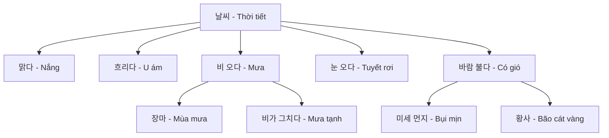
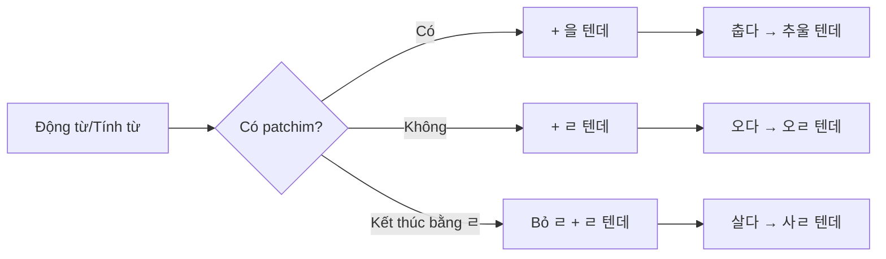
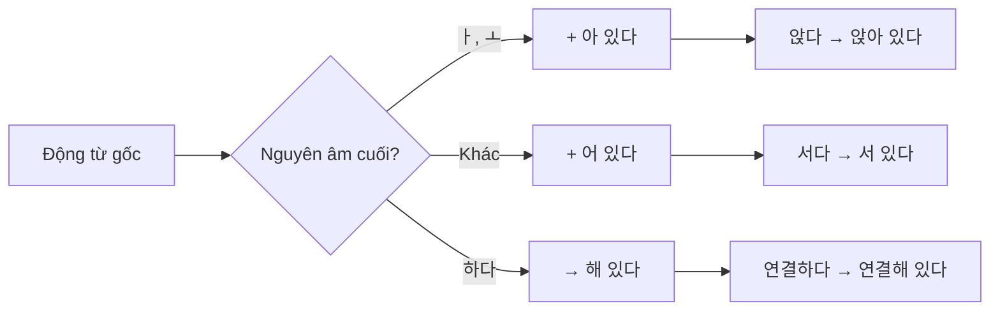
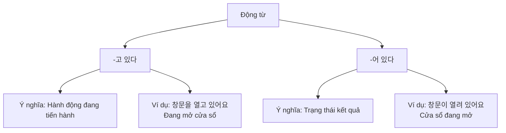
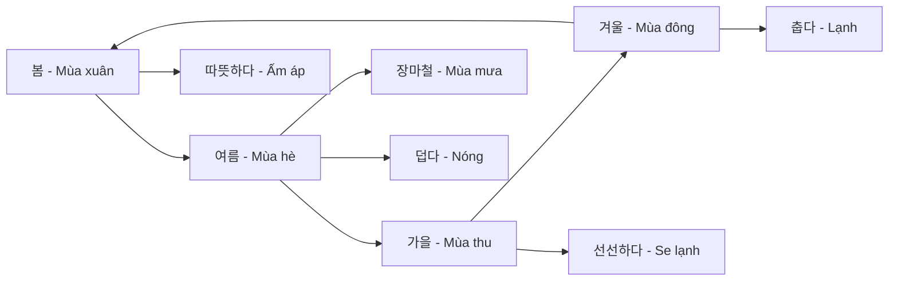

# Bài 16: 기후와 날씨 (Khí hậu và Thời tiết)

## 📚 Mục tiêu bài học

Sau khi hoàn thành bài học này, người học sẽ có khả năng:

- Sử dụng từ vựng liên quan đến thời tiết, khí hậu và mùa
- Sử dụng ngữ pháp **-(으)ㄹ 텐데** và **-어 있다**
- Nói về dự báo thời tiết và mùa trong năm
- Miêu tả khí hậu và đưa ra lời khuyên về trang phục phù hợp

---

## 🗂️ Phần 1: Từ vựng

### 1.1. Từ vựng về thời tiết

| Tiếng Hàn | Nghĩa tiếng Việt | Ví dụ |
|-----------|-----------------|-------|
| 날씨 | Thời tiết | 내일 날씨가 어때요? (Ngày mai thời tiết thế nào?) |
| 기후 | Khí hậu | 한국의 기후 (Khí hậu Hàn Quốc) |
| 온도 | Nhiệt độ | 체감 온도 5℃ (Nhiệt độ cảm nhận 5 độ C) |
| 기온 | Khí nhiệt | 기온도 많이 떨어지고요. (Nhiệt độ cũng giảm nhiều.) |
| 체감 온도 | Nhiệt độ cảm nhận | 체감 온도 5℃ (Nhiệt độ cảm nhận 5 độ C) |
| 최저 기온 | Nhiệt độ thấp nhất | 최저 기온이 33도까지 올라갈 거예요. (Nhiệt độ thấp nhất sẽ tăng đến 33 độ.) |
| 최고 기온 | Nhiệt độ cao nhất | 최고 기온이 영하로 떨어질 거예요. (Nhiệt độ cao nhất sẽ giảm xuống dưới 0.) |
| 습도 | Độ ẩm | 습도는 80%이다. (Độ ẩm là 80%.) |
| 비 올 확률 | Xác suất có mưa | 비 올 확률 30% (Xác suất có mưa 30%) |

### 1.2. Hiện tượng thời tiết

| Tiếng Hàn | Nghĩa tiếng Việt | Ví dụ |
|-----------|-----------------|-------|
| 맑다 | Nắng, quang đãng | 8℃ 체감 온도 5℃ 맑음 (8 độ, nhiệt độ cảm nhận 5 độ, quang đãng) |
| 흐리다 | U ám, mây mù | 날씨가 흐려요. (Thời tiết u ám.) |
| 비 | Mưa | 오후에 비가 올 텐데 우산을 가지고 가세요. (Chiều sẽ mưa, hãy mang ô.) |
| 비가 오다 | Mưa | 오후에 비가 올 텐데 우산을 가지고 가세요. (Chiều sẽ mưa, hãy mang ô.) |
| 비가 그치다 | Mưa tạnh | 곧 그칠 텐데 잠시 후에 가요. (Sắp tạnh rồi, chút nữa mình đi.) |
| 눈 | Tuyết | 눈이 오는 영하로 내리가요. (Tuyết rơi, nhiệt độ giảm xuống dưới 0.) |
| 눈이 오다 | Có tuyết rơi | 눈이 오는 영하로 내리가요. (Tuyết rơi, nhiệt độ giảm xuống dưới 0.) |
| 바람 | Gió | 잔바람이 불다 (Gió se lạnh thổi) |
| 바람이 불다 | Có gió thổi | 잔바람이 불 텐데 (Gió se lạnh sẽ thổi) |
| 구름 | Mây | 구름이 끼다 (Có mây che) |
| 구름이 끼다 | Có mây che | 구름이 끼다 (Có mây che) |
| 안개 | Sương mù | 안개 (Sương mù) |
| 미세 먼지 | Bụi mịn | 미세 먼지가 심하대요. (Bụi mịn sẽ nặng.) |
| 황사 | Bão cát vàng | 황사 경보 (Cảnh báo bão cát vàng) |

### 1.3. Trạng thái thời tiết

| Tiếng Hàn | Nghĩa tiếng Việt | Ví dụ |
|-----------|-----------------|-------|
| 덥다 | Nóng | 여름에는 너무 더워요. (Mùa hè quá nóng.) |
| 춥다 | Lạnh | 날씨가 추울 텐데 두꺼운 옷을 입는 게 어때요? (Thời tiết sẽ lạnh, mặc quần áo dày thì sao?) |
| 따뜻하다 | Ấm áp | 봄에는 날씨가 따뜻해요. (Mùa xuân thời tiết ấm áp.) |
| 시원하다 | Mát mẻ | 가을에는 날씨가 시원해요. (Mùa thu thời tiết mát mẻ.) |
| 선선하다 | Se lạnh | 아침과 저녁에는 선선해요. (Sáng và tối se lạnh.) |
| 쌀쌀하다 | Lạnh lẽo | 아침에 쌀쌀한 날씨 (Sáng trời lạnh lẽo) |
| 건조하다 | Khô hanh | 겨울에 춥고 건조하다. (Mùa đông lạnh và khô.) |

### 1.4. Mùa trong năm

| Tiếng Hàn | Nghĩa tiếng Việt | Ví dụ |
|-----------|-----------------|-------|
| 봄 | Mùa xuân | 봄에 온몸이 나른하면? (Mùa xuân toàn thân uể oải?) |
| 여름 | Mùa hè | 여름에는 덥다. (Mùa hè nóng.) |
| 가을 | Mùa thu | 가을에 시원하다. (Mùa thu mát mẻ.) |
| 겨울 | Mùa đông | 겨울에 춥고 건조하다. (Mùa đông lạnh và khô.) |
| 장마 | Mùa mưa | 장마철 (Mùa mưa) |
| 장마철 | Mùa mưa (thời kỳ) | 장마철에는 비가 많이 와요. (Mùa mưa thì mưa nhiều.) |

### 1.5. Từ vựng liên quan đến trang phục

| Tiếng Hàn | Nghĩa tiếng Việt | Ví dụ |
|-----------|-----------------|-------|
| 옷 | Quần áo | 두꺼운 옷을 입어요. (Mặc quần áo dày.) |
| 두꺼운 옷 | Quần áo dày | 날씨가 추울 텐데 두꺼운 옷을 입는 게 어때요? (Thời tiết sẽ lạnh, mặc quần áo dày thì sao?) |
| 얇은 옷 | Quần áo mỏng | 여름에는 얇은 옷을 입어요. (Mùa hè mặc quần áo mỏng.) |
| 마스크 | Khẩu trang | 미세 먼지가 심할 텐데 외출할 때 마스크를 쓰세요. (Bụi mịn sẽ nặng, khi ra ngoài hãy đeo khẩu trang.) |
| 우산 | Ô, dù | 오후에 비가 올 텐데 우산을 가지고 가세요. (Chiều sẽ mưa, hãy mang ô.) |
| 외출하다 | Ra ngoài | 외출할 때 마스크를 쓰세요. (Khi ra ngoài hãy đeo khẩu trang.) |

### 1.6. Động từ và tính từ bổ sung

| Tiếng Hàn | Nghĩa tiếng Việt | Ví dụ |
|-----------|-----------------|-------|
| 날다 | Bay | 황사가 날다 (Bão cát bay) |
| 불다 | Thổi | 바람이 불다 (Gió thổi) |
| 내리다 | Rơi xuống, đổ xuống | 비가 내리다 (Mưa rơi) |
| 쌓이다 | Chồng chất, tích lũy | 눈이 쌓이다 (Tuyết chồng chất) |
| 늘다 | Tăng lên | 습도가 늘다 (Độ ẩm tăng) |
| 줄다 | Giảm xuống | 식욕이 줄다 (Sự thèm ăn giảm) |
| 열리다 | Mở ra | 창문이 열려 있어요. (Cửa sổ đang mở.) |
| 닫히다 | Đóng lại | 문이 닫혀 있어요. (Cửa đang đóng.) |
| 피곤하다 | Mệt mỏi | 몸이 피곤하다 (Người mệt mỏi) |
| 집중력이 떨어지다 | Mất tập trung | 고열과 근육통이 심해 독감이 의심되면? (Sốt cao và đau cơ nghiêm trọng, nghi ngờ cúm?) |
| 몸이 나른하다 | Người uể oải | 봄에 온몸이 나른하면? (Mùa xuân toàn thân uể oải?) |
| 떨어지다 | Giảm, rơi xuống | 기온이 떨어지다 (Nhiệt độ giảm) |
| 그치다 | Tạnh (mưa) | 곧 그칠 텐데 잠시 후에 가요. (Sắp tạnh rồi, chút nữa mình đi.) |
| 개다 | Quang (trời) | 날이 개다 (Trời quang) |

### 1.7. Từ vựng về dự báo thời tiết

| Tiếng Hàn | Nghĩa tiếng Việt | Ví dụ |
|-----------|-----------------|-------|
| 일기 예보 | Dự báo thời tiết | 일기 예보 봤어요? (Bạn xem dự báo thời tiết chưa?) |
| 일교차 | Chênh lệch nhiệt độ ngày đêm | 일교차가 크기 때문에 옷차림을 조심해야 해요. (Vì chênh lệch nhiệt độ ngày đêm lớn nên phải cẩn thận về trang phục.) |
| 일교차가 크다 | Chênh lệch nhiệt độ lớn | 일교차가 크기 때문에 옷차림을 조심해야 해요. (Vì chênh lệch nhiệt độ ngày đêm lớn nên phải cẩn thận về trang phục.) |
| 날이 개다 | Trời quang | 날이 개다 (Trời quang) |
| 기온이 영하로 떨어지다 | Nhiệt độ giảm xuống dưới 0 | 기온이 영하로 떨어질 거예요. (Nhiệt độ sẽ giảm xuống dưới 0.) |

### 1.8. Từ vựng về cảnh báo thời tiết

| Tiếng Hàn | Nghĩa tiếng Việt | Ví dụ |
|-----------|-----------------|-------|
| 폭염 주의보 | Cảnh báo nóng gay gắt | 폭염 주의보, 물을 많이 마셔야 해요. (Cảnh báo nóng gay gắt, phải uống nhiều nước.) |
| 한파 경보 | Cảnh báo rét đậm | 한파 경보, 가능하면 외출을 하지 마세요. (Cảnh báo rét đậm, nếu có thể đừng ra ngoài.) |
| 호우 경보 | Cảnh báo mưa lớn | 호우 경보, 하천 주변에 주의하세요. (Cảnh báo mưa lớn, hãy cẩn thận khu vực gần sông.) |
| 주의하다 | Cảnh giác, chú ý | 하천 주변에 주의하세요. (Hãy cẩn thận khu vực gần sông.) |
| 하천 | Sông suối | 하천 주변에 주의하세요. (Hãy cẩn thận khu vực gần sông.) |
| 주변 | Xung quanh | 하천 주변에 주의하세요. (Hãy cẩn thận khu vực gần sông.) |
| 가능하면 | Nếu có thể | 가능하면 외출을 하지 마세요. (Nếu có thể đừng ra ngoài.) |

### 1.9. Từ vựng về hoạt động và sự kiện

| Tiếng Hàn | Nghĩa tiếng Việt | Ví dụ |
|-----------|-----------------|-------|
| 야외 행사 | Sự kiện ngoài trời | 야외 행사는 무리에요. (Sự kiện ngoài trời là vất vả quá.) |
| 체육 대회 | Hội thể thao | 체육 대회 하기로 한 날에 날씨가 이래서 걱정이에요. (Đúng ngày định tổ chức hội thể thao mà thời tiết như vậy, lo quá.) |
| 연기하다 | Hoãn lại | 체육 대회를 다른 날로 연기하는 게 어때요? (Hoãn hội thể thao sang ngày khác thì sao?) |
| 무리 | Vất vả, khó khăn | 내일 같은 날에 야외 행사는 무리에요. (Ngày mai như vậy thì sự kiện ngoài trời là vất vả quá.) |
| 야유회 | Dã ngoại | 야유회 (Dã ngoại) |
| 소나기가 내리다 | Mưa rào | 소나기가 내리다 (Mưa rào) |
| 시간을 내다 | Dành thời gian | 시간을 내다 (Dành thời gian) |
| 대피하다 | Tránh trú, sơ tán | 대피하다 (Tránh trú) |

### 1.10. Từ vựng về triệu chứng sức khỏe liên quan thời tiết

| Tiếng Hàn | Nghĩa tiếng Việt | Ví dụ |
|-----------|-----------------|-------|
| 춘곤증 | Chứng mệt mỏi mùa xuân | 봄에 온몸이 나른하면? 춘곤증 (Mùa xuân toàn thân uể oải? Chứng mệt mỏi mùa xuân) |
| 온몸 | Toàn thân, cả người | 봄에 온몸이 나른하면? (Mùa xuân toàn thân uể oải?) |
| 근육통 | Đau cơ | 온몸이 나른하고 고열과 근육통이 심해 (Toàn thân uể oải, sốt cao và đau cơ nghiêm trọng) |
| 고열 | Sốt cao | 고열과 근육통이 심해 독감이 의심되면? (Sốt cao và đau cơ nghiêm trọng, nghi ngờ cúm?) |
| 독감 | Cúm | 고열과 근육통이 심해 독감이 의심되면? (Sốt cao và đau cơ nghiêm trọng, nghi ngờ cúm?) |
| 피로를 느끼다 | Cảm thấy mệt mỏi | 피로를 느끼다 (Cảm thấy mệt mỏi) |
| 기운이 없다 | Không có sức lực | 기운이 없다 (Không có sức lực) |
| 졸음이 오다 | Buồn ngủ | 졸음이 오다 (Buồn ngủ) |
| 적응하다 | Thích nghi | 계절 변화에 적응하다 (Thích nghi với thay đổi mùa) |
| 의심되다 | Nghi ngờ | 독감이 의심되면 (Nếu nghi ngờ cúm) |
| 봄을 타다 | Mắc chứng mệt mỏi mùa xuân | 봄을 타다 (Mắc chứng mệt mỏi mùa xuân) |
| 가을을 타다 | Mắc chứng mệt mỏi mùa thu | 가을을 타다 (Mắc chứng mệt mỏi mùa thu) |

### 1.11. Từ vựng về 춘곤증 (Chứng mệt mỏi mùa xuân)

| Tiếng Hàn | Nghĩa tiếng Việt | Ví dụ |
|-----------|-----------------|-------|
| 충분한 | Đủ, đầy đủ | 충분한 수면이 필요하다 (Cần giấc ngủ đầy đủ) |
| 특별한 | Đặc biệt | 특별한 질병이 없는데도 (Dù không có bệnh đặc biệt) |
| 의학적으로 | Về mặt y học | 의학적으로 질병은 아니다 (Về mặt y học không phải là bệnh) |
| 질병 | Bệnh tật | 특별한 질병이 없는데도 (Dù không có bệnh đặc biệt) |
| 변화 | Thay đổi | 계절의 변화와 관련이 있다 (Liên quan đến thay đổi mùa) |
| 관련 | Liên quan | 계절의 변화와 관련이 있다 (Liên quan đến thay đổi mùa) |
| 활동 | Hoạt động | 신체 활동 (Hoạt động thể chất) |
| 간격으로 | Theo khoảng | 2~3시간 간격으로 스트레칭을 하다 (Duỗi người theo khoảng 2-3 giờ) |
| 스트레칭을 하다 | Duỗi người, vận động kéo giãn cơ | 2~3시간 간격으로 스트레칭을 하다 (Duỗi người theo khoảng 2-3 giờ) |
| 근육 | Cơ bắp | 근육의 긴장을 풀어 주다 (Nới lỏng căng thẳng cơ bắp) |
| 긴장 | Căng thẳng | 근육의 긴장을 풀어 주다 (Nới lỏng căng thẳng cơ bắp) |
| 풀어 주다 | Nới lỏng | 근육의 긴장을 풀어 주다 (Nới lỏng căng thẳng cơ bắp) |
| 대체로 | Đại thể, nói chung | 대체로 비타민 B가 필요하다 (Nói chung cần vitamin B) |
| 비타민 B | Vitamin B | 대체로 비타민 B가 필요하다 (Nói chung cần vitamin B) |
| 필요하다 | Cần thiết | 비타민 B가 필요하다 (Cần vitamin B) |
| 따라서 | Vì vậy | 따라서 채소를 충분히 먹어야 한다 (Vì vậy phải ăn rau đầy đủ) |
| 채소 | Rau củ | 채소를 충분히 먹어야 한다 (Phải ăn rau đầy đủ) |
| 충분히 | Đầy đủ | 채소를 충분히 먹어야 한다 (Phải ăn rau đầy đủ) |
| 수면 시간 | Thời gian ngủ | 하루에 7~8시간 정도 적당하다 (Khoảng 7-8 tiếng một ngày là phù hợp) |
| 정도 | Mức độ | 7~8시간 정도 (Khoảng 7-8 tiếng) |
| 적당하다 | Phù hợp | 7~8시간 정도 적당하다 (Khoảng 7-8 tiếng là phù hợp) |
| 중요하다 | Quan trọng | 수면 시간이 중요하다 (Thời gian ngủ quan trọng) |

### 1.12. Từ vựng về tiết khí (절기)

| Tiếng Hàn | Nghĩa tiếng Việt | Ví dụ |
|-----------|-----------------|-------|
| 절기 | Tiết khí | 한국에서는 1년을 24시기로 나누어 계절의 변화를 나타냈다 (Ở Hàn Quốc chia 1 năm thành 24 tiết khí để biểu thị thay đổi mùa) |
| 계절 | Mùa, tiết | 계절의 변화 (Thay đổi mùa) |
| 변화 | Thay đổi | 계절의 변화를 나타냈다 (Biểu thị thay đổi mùa) |
| 나타내다 | Biểu thị, thể hiện | 계절의 변화를 나타냈다 (Biểu thị thay đổi mùa) |
| 단위로 | Theo đơn vị | 7월을 단위로 생활하는 요즘과는 (Với ngày nay sinh hoạt theo tháng 7 làm đơn vị) |
| 생활하다 | Sinh hoạt | 7월을 단위로 생활하는 요즘 (Ngày nay sinh hoạt theo tháng 7) |
| 요즘 | Ngày nay | 요즘은 절기를 사용하지 않는다 (Ngày nay không sử dụng tiết khí) |
| 사용하다 | Sử dụng | 절기를 사용하지 않는다 (Không sử dụng tiết khí) |
| 입춘 | Lập xuân | 입춘은 봄의 시작이다 (Lập xuân là đầu mùa xuân) |
| 입추 | Lập thu | 입추는 가을의 시작이다 (Lập thu là đầu mùa thu) |
| 경칩 | Kinh trập | 경칩이 지나야 봄이 온다 (Phải qua kinh trập thì xuân mới đến) |
| 처서 | Xứ thử | 처서가 지나야 선선하다 (Phải qua xứ thử thì se lạnh) |
| 동지 | Đông chí | 동지에 팥죽을 먹는 풍습이 있다 (Có phong tục ăn cháo đậu đỏ vào đông chí) |
| 입춘대길 | Lập xuân đại cát | 입춘대길을 대문에 붙이다 (Dán "Lập xuân đại cát" lên cửa lớn) |
| 대문 | Cửa lớn | 입춘대길을 대문에 붙이다 (Dán lên cửa lớn) |
| 붙이다 | Dán | 입춘대길을 대문에 붙이다 (Dán "Lập xuân đại cát") |
| 행복 | Hạnh phúc | 행복을 빌다 (Cầu nguyện hạnh phúc) |
| 빌다 | Cầu nguyện | 행복을 빌다 (Cầu nguyện hạnh phúc) |
| 남다 | Còn lại | 1년 중 밤이 가장 긴 날이다 (Là ngày đêm dài nhất trong năm) |
| 추분 | Thu phân | 추분에는 낮과 밤의 길이가 같다 (Vào thu phân thì độ dài ngày và đêm bằng nhau) |
| 낮 | Ngày, ban ngày | 낮과 밤의 길이 (Độ dài ngày và đêm) |
| 밤 | Đêm | 낮과 밤의 길이 (Độ dài ngày và đêm) |
| 길이 | Độ dài | 낮과 밤의 길이가 같다 (Độ dài ngày và đêm bằng nhau) |
| 팥죽 | Cháo đậu đỏ | 동지에 팥죽을 먹는 풍습 (Phong tục ăn cháo đậu đỏ vào đông chí) |
| 풍습 | Phong tục | 동지에 팥죽을 먹는 풍습이 있다 (Có phong tục ăn cháo đậu đỏ vào đông chí) |
| 막다 | Ngăn chặn | 나쁜 것을 막다 (Ngăn chặn điều xấu) |

### 1.13. Từ vựng từ hội thoại và bài tập

| Tiếng Hàn | Nghĩa tiếng Việt | Ví dụ |
|-----------|-----------------|-------|
| 심하다 | Nặng, nghiêm trọng | 미세 먼지가 심하대요. (Bụi mịn sẽ nặng.) |
| 걱정 | Lo lắng | 날씨가 이래서 걱정이에요. (Thời tiết như vậy, lo quá.) |
| 괜찮다 | Ổn, không sao | 괜찮을까요? (Không biết có ổn không?) |
| 연락하다 | Liên lạc | 제가 빨리 사람들에게 연락할게요. (Tôi sẽ liên lạc với mọi người ngay.) |
| 곧 | Sớm, chẳng bao lâu | 곧 그칠 텐데 잠시 후에 가요. (Sắp tạnh rồi, chút nữa mình đi.) |
| 잠시 후에 | Sau một chút | 곧 그칠 텐데 잠시 후에 가요. (Sắp tạnh rồi, chút nữa mình đi.) |
| 옷차림 | Trang phục | 일교차가 크기 때문에 옷차림을 조심해야 해요. (Vì chênh lệch nhiệt độ ngày đêm lớn nên phải cẩn thận về trang phục.) |
| 잔바람이 불다 | Gió se lạnh thổi | 잔바람이 불 텐데 (Gió se lạnh sẽ thổi) |
| 우려 | Lo ngại | 우려 (Lo ngại) |
| 단위 | Đơn vị | 7월을 단위로 (Theo tháng 7 làm đơn vị) |
| 앞서다 | Đi trước | 앞서다 (Đi trước) |
| 여전히 | Vẫn còn | 여전히 춥다 (Vẫn còn lạnh) |

### 1.14. Câu hỏi khởi động

#### 1. 날씨 앱이에요. 오늘 날씨가 어때요?

**Đây là ứng dụng thời tiết. Hôm nay thời tiết thế nào?**

📱 **Màn hình 1:**
- **8℃** ☀️
- **체감 온도 5℃** (Nhiệt độ cảm nhận 5 độ C)
- **맑음** (Quang đãng)
- **습도 60%** | **비 올 확률 30%** | **미세 먼지 보통**

📱 **Màn hình 2:**
| | 최저 기온 | 최고 기온 | 오전 | 오후 | 18시 | 21시 |
|---|---|---|---|---|---|---|
| | -2℃ | 15℃ | ☔ | ☀️ | 4℃ | -1℃ |
| | | | (오후에) 비가 그치요 (오후부터) 날이 개요 | | (밤에) 기온이 영하로 떨어져요 |

#### 2. 사람들은 무엇을 해야 돼요? 왜 그래요?

**Mọi người nên làm gì? Tại sao?**

**1)** 🌫️ **미세 먼지 주의보,**
**외출 시 마스크를 쓰세요.**
(Cảnh báo bụi mịn, khi ra ngoài hãy đeo khẩu trang.)

**2)** ☀️🔥 **폭염 주의보,**
**물을 많이 마셔야 해요.**
(Cảnh báo nóng gay gắt, phải uống nhiều nước.)

**3)** 🌧️ **호우 경보,**
**하천 주변에 주의하세요.**
(Cảnh báo mưa lớn, hãy cẩn thận khu vực gần sông.)

**4)** ❄️ **한파 경보,**
**가능하면 외출을 하지 마세요.**
(Cảnh báo rét đậm, nếu có thể đừng ra ngoài.)

---

## 📘 Phần 2: Ngữ pháp

### 2.1. Ngữ pháp **-(으)ㄹ 텐데**

#### 📌 Cấu trúc

```
Động từ/Tính từ + -(으)ㄹ 텐데
```

#### 📌 Ý nghĩa

Diễn tả **suy đoán** hoặc **dự đoán** của người nói về một tình huống, thường kết hợp với **lo lắng, quan tâm** hoặc **đưa ra lời khuyên**.

Có nghĩa là "có lẽ...", "chắc là..." trong tiếng Việt.

Thường dùng khi:
- Dự đoán tình huống tương lai
- Lo lắng về điều gì đó
- Đưa ra lời khuyên dựa trên dự đoán

#### 📌 Cách sử dụng

| Dạng từ | Quy tắc | Ví dụ |
|---------|---------|-------|
| Có patchim | + **을 텐데** | 춥다 → 추**울 텐데** |
| Không patchim | + **ㄹ 텐데** | 오다 → 오**ㄹ 텐데** |
| Kết thúc bằng ㄹ | Bỏ ㄹ + **ㄹ 텐데** | 살다 → 사**ㄹ 텐데** |

#### 📌 Bảng biến đổi từ thường gặp

| Từ gốc | Nghĩa | Dạng -(으)ㄹ 텐데 |
|--------|-------|-----------------|
| 춥다 | Lạnh | 추**울 텐데** |
| 덥다 | Nóng | 더**울 텐데** |
| 오다 | Đến, rơi | 오**ㄹ 텐데** |
| 내리다 | Rơi xuống | 내리**ㄹ 텐데** |
| 입다 | Mặc | 입**을 텐데** |
| 가다 | Đi | 가**ㄹ 텐데** |
| 있다 | Có | 있**을 텐데** |

#### 📌 Ví dụ minh họa

| Tình huống | Câu nói |
|-----------|---------|
| Lo lắng về thời tiết | 내일 미세 먼지가 심하**텐데** 기온도 많이 떨어지**텐데** 외출할 때 마스크를 쓰세요. (Ngày mai bụi mịn sẽ nặng, nhiệt độ cũng sẽ giảm nhiều, khi ra ngoài hãy đeo khẩu trang.) |
| Khuyên về trang phục | 날씨가 추**울 텐데** 두꺼운 옷을 입는 게 어때요? (Thời tiết sẽ lạnh, mặc quần áo dày thì sao?) |
| Dự đoán tình huống | 곧 그칠 텐데 잠시 후에 가요. (Sắp tạnh rồi, chút nữa mình đi.) |

#### 📌 So sánh với các ngữ pháp tương tự

| Ngữ pháp | Ý nghĩa | Ví dụ |
|----------|---------|-------|
| -(으)**ㄹ 텐데** | Dự đoán + lo lắng/khuyên | 추**울 텐데** 옷을 입으세요 |
| -(으)**ㄹ 거예요** | Dự đoán đơn thuần | 추**울 거예요** |
| -(으)**ㄹ 것 같아요** | Có vẻ như | 추**울 것 같아요** |

---

### 2.2. Ngữ pháp **-어 있다**

#### 📌 Cấu trúc

```
Động từ (gốc) + -어/아/여 있다
```

#### 📌 Ý nghĩa

Diễn tả **trạng thái kết quả** của một hành động đã xảy ra và **đang duy trì** trạng thái đó.

Có nghĩa là "đang (trong trạng thái)..." trong tiếng Việt.

Khác với **-고 있다** (đang làm - hành động đang diễn ra):
- **-고 있다**: Hành động đang tiến hành
- **-어 있다**: Trạng thái kết quả đang duy trì

#### 📌 Cách sử dụng

| Nguyên âm cuối | Quy tắc | Ví dụ |
|--------------|---------|-------|
| ㅏ, ㅗ | + **아 있다** | 열다 → 열**어 있다** → 열**려 있다** |
| Các nguyên âm khác | + **어 있다** | 닫다 → 닫**어 있다** → 닫**혀 있다** |
| 하다 | → **해 있다** | 연결하다 → 연결**해 있다** |

#### 📌 Bảng biến đổi từ thường gặp

| Động từ gốc | Nghĩa | Dạng -어 있다 |
|-------------|-------|--------------|
| 열다 | Mở | 열**려 있다** |
| 닫다 | Đóng | 닫**혀 있다** |
| 앉다 | Ngồi | 앉**아 있다** |
| 서다 | Đứng | 서 있다 |
| 놓다 | Đặt | 놓**여 있다** |
| 꽂다 | Cắm | 꽂**혀 있다** |
| 피다 | Nở | 피**어 있다** |
| 쌓다 | Chồng | 쌓**여 있다** |

#### 📌 Ví dụ minh họa

| Tình huống | Câu nói |
|-----------|---------|
| Cửa sổ đang mở | 창문이 열**려 있어요**. 가방이 책상 위에 놓**여 있어요**. (Cửa sổ đang mở. Cái túi đang đặt trên bàn.) |
| Trạng thái phòng | 고천 씨가 소파에 앉**아 있어요**. (Anh Gocheon đang ngồi trên sofa.) |

#### 📌 So sánh **-고 있다** và **-어 있다**

| Ngữ pháp | Ý nghĩa | Ví dụ | Giải thích |
|----------|---------|-------|-----------|
| **-고 있다** | Hành động đang tiến hành | 창문을 열**고 있어요** | Đang mở cửa sổ (hành động) |
| **-어 있다** | Trạng thái kết quả | 창문이 열**려 있어요** | Cửa sổ đang mở (trạng thái) |
| **-고 있다** | Hành động đang làm | 앉**고 있어요** | Đang ngồi xuống (hành động) |
| **-어 있다** | Trạng thái | 앉**아 있어요** | Đang ngồi (trạng thái) |

#### 📌 Quy tắc đặc biệt

Một số động từ có biến đổi đặc biệt:

| Động từ | Biến đổi | Ví dụ |
|---------|----------|-------|
| 리 + ㄱ | 리 + 가 | 열리다 → 열려 있다 |
| ㅁ + ㅎ | ㅁ + 혀 | 닫히다 → 닫혀 있다 |
| ㅈ + ㅎ | ㅈ + 혀 | 꽂히다 → 꽂혀 있다 |

---

## 🗣️ Phần 3: Nói (말하기)

### 3.1. 아나이스 씨와 라민 씨가 야외 행사 계획에 대해 이야기합니다. 다음 대화처럼 이야기해 보세요.

**Anaïs và Ramin đang nói chuyện về kế hoạch sự kiện ngoài trời. Hãy nói chuyện như đoạn hội thoại sau.**

#### 📱 Màn hình thông báo: **야외 행사 자체**

**아나이스**: 일기 예보 봤어요? 내일 미세 먼지가 심하대요.
기온도 많이 떨어지고요.

**라민**: 아, 체육 대회 하기로 한 날에 날씨가 이래서 걱정이에요.

**아나이스**: 그러게요, 사람들이 날씨 때문에 힘들어할 텐데
괜찮을까요?

**라민**: 아니요, 내일 같은 날에 야외 행사는 무리에요.
체육 대회를 다른 날로 연기하는 게 어때요?

**아나이스**: 그게 낫겠죠? 제가 빨리 사람들에게 연락할게요.

---

#### 💬 Dịch nghĩa:

**Anaïs**: Bạn xem dự báo thời tiết chưa? Ngày mai bụi mịn sẽ nặng.
Nhiệt độ cũng giảm nhiều nữa.

**Ramin**: À, đúng ngày định tổ chức hội thể thao mà thời tiết như vậy, lo quá.

**Anaïs**: Đúng vậy, mọi người sẽ khó chịu vì thời tiết, không biết có ổn không?

**Ramin**: Không, ngày mai như vậy thì sự kiện ngoài trời là vất vả quá.
Hoãn hội thể thao sang ngày khác thì sao?

**Anaïs**: Vậy thì tốt hơn nhỉ? Tôi sẽ liên lạc với mọi người ngay.

---

#### 🔍 Phân tích hội thoại:

**1)** 미세 먼지가 심하다, 기온도 많이 떨어지다
체육 대회, 체육 대회를 다른 날로 연기하다

- Bụi mịn nặng, nhiệt độ cũng giảm nhiều
- Hội thể thao, hoãn hội thể thao sang ngày khác

**2)** 최고 기온이 33도까지 올라가다, 습도는 80%이다
야유회, 야유회 가지 말고 다 같이 식사만 하다

- Nhiệt độ cao nhất sẽ lên đến 33 độ, độ ẩm là 80%
- Dã ngoại, không đi dã ngoại mà chỉ cùng nhau ăn cơm

---

### 3.2. 다음과 같은 상황에서 어떻게 할지에 대해 친구와 이야기해 보세요.

**Hãy nói chuyện với bạn về việc sẽ làm gì trong các tình huống sau.**

#### 📋 Tình huống:

**상황**
- 여행을 가려고 하는데 호우 경보가 내렸다.
- 야외 근무를 하는 날에 폭염 주의보가 내렸다.

**단어장**
- 연기하다 (hoãn lại)
- 야외 행사 (sự kiện ngoài trời)
- 체육 대회 (hội thể thao)
- 무리 (vất vả, khó khăn)
- 야유회 (dã ngoại)

---

## 🎧 Phần 4: Nghe (듣기)

### 4.1. 뉴스에서 날씨를 소개하고 있습니다. 그림을 보고 내일 날씨가 어떻게 말해 보세요.

**Trong tin tức đang giới thiệu thời tiết. Hãy xem hình và nói xem ngày mai thời tiết như thế nào.**

#### 📰 Tin tức thời tiết:

**1)** 🌼☀️ **주말 맑고 공기 좋음**
**꽃가루 주의**
(Cuối tuần quang đãng và không khí tốt
Chú ý phấn hoa)

**2)** 🌫️ **당분간 찬바람이 불어**
**체감 온도는 영하로 내려가**
(Trong thời gian tới gió lạnh sẽ thổi
Nhiệt độ cảm nhận sẽ giảm xuống dưới 0)

**3)** 🎬🎥 **밤사이 '열대야' 현상**
**어젯밤 오후 갑자기 소나기 내려**
(Hiện tượng 'nhiệt đới đêm' qua đêm
Chiều hôm qua đột nhiên có mưa rào)

---

### 4.2. 뉴스의 일기 예보입니다. 잘 듣고 질문에 답해 보세요.

**Đây là dự báo thời tiết trong tin tức. Hãy nghe kỹ và trả lời câu hỏi.**

#### 🎙️ **1) 대구 날씨에 대해 들은 내용과 같으면 O, 다르면 X 하세요.**

**Nghe về thời tiết Daegu, nếu giống thì đánh O, khác thì đánh X.**

① 오늘은 날이 맑지만 미세 먼지가 심할 것이다. ( )

② 일교차가 크기 때문에 옷차림을 조심해야 한다. ( )

**Đáp án:**
- **단어장 (từ khóa)**: 열대야, 찬바람이 불다, 옷차림 (nhiệt đới đêm, gió lạnh thổi, trang phục)

---

#### 🎙️ **2) 서울 경기 날씨에 대해 들은 내용과 같으면 O, 다르면 X 하세요.**

**Nghe về thời tiết Seoul-Gyeonggi, nếu giống thì đánh O, khác thì đánh X.**

① 주말에도 덥시 더울 것이다. ( )

② 내일은 하루 종일 비가 올 것이다. ( )

**Đáp án:**
- **단어장 (từ khóa)**: 열대야, 찬바람이 불다, 옷차림 (nhiệt đới đêm, gió lạnh thổi, trang phục)

---

### 4.3. Luyện tập phát âm

#### 📢 Quy tắc phát âm

**다음을 듣고 따라 읽으세요.**
(Hãy nghe và đọc theo)

**Quy tắc:** **ㄱ, ㄷ, ㅂ, ㅅ, ㅈ** + **ㅁ, ㄴ, ㅇ** → Âm hóa mũi

**1)** 날씨가 **맑**아 나들이하기 **좋**습니다.
- 발음: [망아] [존니다]

**2)** 오늘은 **맑**고 미세 먼지 농도가 **낮**습니다.
- 발음: [망고] [남니다]

**3)** 오전에는 날씨가 **맑**지**만** 오후에는 점차 흐려지**습**니다.
- 발음: [망지만] [흐려집니다]

---

## 📖 Phần 5: Đọc (읽기)

### 5.1. 계절이 바뀌어 기후나 날씨가 달라지면 사람의 몸에 어떤 영향이 있습니까?

**Khi mùa thay đổi, khí hậu hoặc thời tiết thay đổi thì có ảnh hưởng gì đến cơ thể con người?**

#### 📅 건강 365 (Sức khỏe 365)

**📋 Danh sách triệu chứng:**

- 충군증, 봄에 온몸이 나른하면?
  (Chứng mệt mỏi mùa xuân, toàn thân uể oải vào mùa xuân?)

- 밤이 되어도 25도를 넘는
  열대야로 잠들기 어려우면?
  (Nhiệt đới đêm, dù đêm vẫn trên 25 độ,
  khó ngủ?)

- 우울한 기분이 드는 등
  가을을 탈 때?
  (Khi có cảm giác buồn bã
  vào mùa thu?)

- 고열과 근육통이 심해
  독감이 의심되면?
  (Sốt cao và đau cơ nghiêm trọng,
  nghi ngờ cúm?)

---

### 5.2. 춘곤증의 증상에 대해 그림을 보면서 이야기해 보세요.

**Hãy xem hình và nói về triệu chứng của chứng mệt mỏi mùa xuân.**

#### 🖼️ Các triệu chứng:

**1)** 😴 **몸이 나른하다**
(Người uể oải)

**2)** 😪 **피로를 느끼다**
(Cảm thấy mệt mỏi)

**3)** 🥱 **기운이 없다**
(Không có sức lực)

**4)** 😫 **졸음이 오다**
(Buồn ngủ)

**5)** 😵 **집중력이 떨어지다**
(Mất tập trung)

---

### 5.3. 다음은 '춘곤증'에 대한 글입니다. 잘 읽고 질문에 답해 보세요.

**Đây là bài viết về 'chứng mệt mỏi mùa xuân'. Hãy đọc kỹ và trả lời câu hỏi.**

#### 🌐 Trang web

**🔍 지식백과** | **Q** | 로그인 | 화면 가입 | 마이 페이지

◀ ▶ **봄에 온몸이 나른하면?**

---

#### 📝 **봄에 온몸이 나른하면?**

**건강 365**

춘곤증은 봄철에 몸에 특별한 병이 없는데도 온몸이 나른하고 졸음이 오거나 쉽게 피로를 느끼게 되는 상태를 말한다. 흔히 '봄을 탄다'는 말로 표현되는 춘곤증은 의학적으로 질병이 아니며 보통 1~3주가 지나면 없어진다.

춘곤증은 날씨의 변화와 관련이 있다. 사람들이 춘곤증을 느끼는 원인은 겨울에서 봄으로 바뀌는 계절 변화에 몸이 적응하지 못했기 때문이다. 봄이 되어 날이 따뜻해지지만 몸은 추위에 익숙해 있어서 쉽게 피로를 느끼게 된다는 것이다.

평소 규칙적이고 적당한 운동으로 춘곤증을 예방할 수 있다. 운동은 한 번에 많이 하지 말고 조금씩 자주 하는 것이 좋다. 2~3시간 간격으로 스트레칭을 하여 근육의 긴장을 풀어 주는 것도 효과적이다. 대체로 봄철에는 평소보다 비타민 B가 3~5배 더 필요하다. 비타민 B가 많이 포함된 채소와 과일을 많이 먹는 것이 좋다. 또한 충분한 수면 시간이 중요하다. 수면 시간은 하루에 7~8시간 정도 적당하다.

---

#### ❓ **Câu hỏi:**

**1)** 춘곤증의 증상에는 무엇이 있습니까?

**2)** 춘곤증은 왜 생깁니까?

**3)** 춘곤증의 예방 방법으로 맞으면 O, 틀리면 X 하세요.

① 운동은 한 번에 오랫동안 하는 것이 좋다. ( )

② 평소보다 채소와 과일을 더 먹어야 한다. ( )

③ 하루에 7~8시간 정도 꼭 자야 한다. ( )

**Đáp án:**
- **단어장**: 봄을 타다, 적응하다, 익숙하다, 스트레칭을 하다, 수면 시간

---

## ✍️ Phần 6: Viết (쓰기)

### 6.1. 여러분 고향의 날씨는 어떻습니까? 이때 무엇을 주의해야 합니까?

**Thời tiết quê bạn như thế nào? Lúc này cần chú ý điều gì?**

#### 📋 Bảng so sánh

| 나라 | 날씨 | 주의할 점 |
|------|------|---------|
| 한국 | 겨울에 춥고 건조하다. | • 독감이 유행할 수 있으니까 손을 잘 씻는다.<br>• 미세 먼지가 심한 날에는 마스크를 쓴다. |
| | | |

---

### 6.2. 여러분의 고향으로 여행을 가려는 친구에게 현지 날씨와 주의할 점을 알리는 이메일을 써 보세요.

**Hãy viết email thông báo cho bạn định đi du lịch quê bạn về thời tiết địa phương và những điều cần chú ý.**

#### 📧 Email mẫu:

| **새 메일** | _ □ × |
|------------|-------|
| **받는 사람** | |
| **제목** | |
| | |
| | |
| | |
| | |
| | |
| | |
| | |
| | |
| | |
| **보내기** | ▣ ~ |

**Đáp án:**
- **단어장**: 건조하다

---

## 📚 Phần 7: Văn hóa và Thông tin

### 한국의 절기 (Tiết khí của Hàn Quốc)

한국에서는 해가 하늘에서 지나는 길을 보고 1년을 24시기로 나누어 계절의 변화를 나타냈는데 이를 절기라고 한다. 7월을 단위로 생활하는 요즘과는 다르게, 옛날에는 절기를 사용하여 15일을 단위로 생활했다고 할 수 있다. 24절기는 최근에 많이 사용되지 않지만 아직도 몇몇 절기는 여전히 쓰이고 있다.

**Dịch:** Ở Hàn Quốc, người ta quan sát đường đi của mặt trời trên bầu trời và chia một năm thành 24 tiết khí để biểu thị sự thay đổi của mùa, gọi là 절기 (tiết khí). Khác với ngày nay sống theo đơn vị tháng, ngày xưa có thể nói người ta sống theo đơn vị 15 ngày bằng cách sử dụng tiết khí. 24 tiết khí gần đây tuy không được sử dụng nhiều nhưng vẫn còn một số tiết khí được dùng.

#### 🌸 Ý nghĩa tiết khí

**입춘**은 봄의 시작을 알리는데, 예전에는 입춘에 한지로 '**입춘대길(立春大吉)**'이라고 써서 대문에 붙이고 행복을 빌었다. **춘분**은 낮과 밤의 길이가 같은 날로 춘분이 지나면 낮이 길어진다. **추분**은 낮과 밤의 길이가 같은 날이다. 추분이 지나면 밤이 길어진다.

**경칩**이 지나야 봄이 온다고 사람들이 믿었다. 또한 **처서**가 지나야 선선하다고 알고 있다.

**동지**는 1년 중 밤이 가장 긴 날이며 옛날에는 팥죽을 먹어서 나쁜 것을 막는 풍습이 있다.

#### ❓ Câu hỏi thảo luận:

**1)** 옛날 사람들은 무엇을 위해 절기를 사용했습니까?
(Người xưa sử dụng tiết khí để làm gì?)

**2)** 입춘과 동지에 사람들은 무엇을 합니까?
(Vào Lập xuân và Đông chí, mọi người làm gì?)

**3)** 여러분 고향에서는 옛날에 시간이나 계절의 흐름을 어떻게 나타냈습니까?
(Ở quê bạn, ngày xưa người ta biểu thị thời gian hoặc dòng chảy của mùa như thế nào?)

---

## 📋 Phần 8: Bảng từ vựng tổng hợp (배운 어휘 확인)

**Hãy đánh dấu ✓ vào những từ vựng đã học trong bài:**

### 🌤️ Thời tiết và Khí hậu

| ☐ 체감 온도 | ☐ 열대야 |
|---|---|
| ☐ 습도 | ☐ 찬바람이 불다 |
| ☐ 비 올 확률 | ☐ 옷차림 |
| ☐ 미세 먼지 | ☐ 춘곤증 |
| ☐ 최저 기온 | ☐ 온몸 |
| ☐ 최고 기온 | ☐ 근육통 |
| ☐ 일교차가 크다 | ☐ 고열 |
| ☐ 비가 그치다 | ☐ 독감 |
| ☐ 날이 개다 | ☐ 피로를 느끼다 |
| ☐ 기온이 영하로 떨어지다 | ☐ 기운이 없다 |
| ☐ 폭염 주의보 | ☐ 졸음이 오다 |
| ☐ 호우 경보 | ☐ 집중력이 떨어지다 |
| ☐ 한파 경보 | ☐ 적응하다 |
| ☐ 주의하다 | ☐ 의심되다 |
| ☐ 하천 | ☐ 봄을 타다 |
| ☐ 주변 | ☐ 가을을 타다 |
| ☐ 가능하면 | ☐ 충분한 |
| ☐ 대피하다 | ☐ 특별한 |
| ☐ 마스크를 쓰다 | ☐ 의학적으로 |
| ☐ 시간을 내다 | ☐ 질병 |
| ☐ 소나기가 내리다 | ☐ 변화 |
| ☐ 야외 행사 | ☐ 관련 |
| ☐ 체육 대회 | ☐ 활동 |
| ☐ 연기하다 | ☐ 간격으로 |
| ☐ 무리 | ☐ 스트레칭을 하다 |
| ☐ 야유회 | ☐ 근육 |
| ☐ 고열 | ☐ 긴장 |
| ☐ 괜찮다 | ☐ 풀어 주다 |
| ☐ 연락하다 | ☐ 대체로 |
| ☐ 곧 | ☐ 비타민 B |
| ☐ 잠시 후에 | ☐ 필요하다 |
| ☐ 잔바람이 불다 | ☐ 따라서 |
| ☐ 우려 | ☐ 채소 |
| ☐ 단위 | ☐ 충분히 |
| ☐ 앞서다 | ☐ 수면 시간 |
| ☐ 여전히 | ☐ 정도 |
| ☐ 건조하다 | ☐ 적당하다 |

### 🌸 Tiết khí (절기)

| ☐ 절기 | ☐ 입춘대길 |
|---|---|
| ☐ 계절 | ☐ 대문 |
| ☐ 변화 | ☐ 붙이다 |
| ☐ 나타내다 | ☐ 행복 |
| ☐ 단위로 | ☐ 빌다 |
| ☐ 생활하다 | ☐ 남다 |
| ☐ 요즘 | ☐ 추분 |
| ☐ 사용하다 | ☐ 낮 |
| ☐ 입춘 | ☐ 밤 |
| ☐ 입추 | ☐ 길이 |
| ☐ 경칩 | ☐ 팥죽 |
| ☐ 처서 | ☐ 풍습 |
| ☐ 동지 | ☐ 막다 |

---

## 📊 Phần 9: Biểu đồ minh họa

### 4.1. Sơ đồ các hiện tượng thời tiết



### 4.2. Cấu trúc ngữ pháp -(으)ㄹ 텐데



### 4.3. Cấu trúc ngữ pháp -어 있다



### 4.4. So sánh -고 있다 và -어 있다



### 9.5. Sơ đồ bốn mùa trong năm



---

## ✅ Phần 10: Bài tập thực hành

### Bài tập 1: Chọn lời khuyên phù hợp với thời tiết

| Thời tiết | Lời khuyên |
|-----------|-----------|
| 미세 먼지 주의보, 외출 시 마스크를 쓰세요 | Cảnh báo bụi mịn, khi ra ngoài hãy đeo khẩu trang |
| 폭염 주의보, 물을 많이 마셔야 해요 | Cảnh báo nóng gay gắt, phải uống nhiều nước |
| 호우 경보, 하천 주변에 주의하세요 | Cảnh báo mưa lớn, hãy cẩn thận khu vực gần sông |
| 한파 경보, 가능하면 외출을 하지 마세요 | Cảnh báo rét đậm, tốt nhất đừng ra ngoài |

### Bài tập 2: Hoàn thành câu với -(으)ㄹ 텐데

**1. 오늘은 날이 맑지만 미세 먼지가 심___________.**

a) 할 거예요
b) **텐데**
c) 어요
d) 고 있어요

**2. 저녁에 손님이 오___________.**

a) 고 있어요
b) **ㄹ 텐데**
c) 어 있어요
d) 았어요

### Bài tập 3: Chọn -고 있다 hoặc -어 있다

**1. 창문이 ___________ (열다).**

a) 열고 있어요
b) **열려 있어요**

**2. 일교차가 크기 때문에 옷차림을 ___________ (조심해야 한다).**

a) **조심해야 해요**
b) 조심하고 있어요

### Bài tập 4: Hoàn thành bảng so sánh thời tiết

| Nước | Mùa | Đặc điểm |
|------|-----|---------|
| 한국 | 겨울에 춥고 건조하다 | • 독감이 유행할 수 있으니까 손을 잘 씻는다<br>• 미세 먼지가 심한 날에는 마스크를 쓴다 |
| (Quốc gia của bạn) | | |

---

## 📝 Phần 11: Tổng kết

### Những điểm chính cần nhớ:

✅ **Từ vựng**: Học các từ vựng liên quan đến thời tiết, khí hậu và mùa
✅ **Ngữ pháp -(으)ㄹ 텐데**: Dự đoán + lo lắng/khuyên bảo
✅ **Ngữ pháp -어 있다**: Trạng thái kết quả đang duy trì
✅ **Nói (말하기)**: Thảo luận về kế hoạch sự kiện ngoài trời theo thời tiết
✅ **Nghe (듣기)**: Nghe và hiểu dự báo thời tiết
✅ **Đọc (읽기)**: Đọc hiểu về chứng mệt mỏi mùa xuân (춘곤증)
✅ **Viết (쓰기)**: Viết email về thời tiết và lời khuyên
✅ **Văn hóa**: Tìm hiểu về hệ thống 24 tiết khí của Hàn Quốc

### Bảng tổng hợp ngữ pháp

| Ngữ pháp | Cấu trúc | Ý nghĩa | Ví dụ |
|----------|----------|---------|-------|
| -(으)ㄹ 텐데 | Động từ/Tính từ + (으)ㄹ 텐데 | Dự đoán + lo lắng | 추**울 텐데** 옷을 입으세요 (Sẽ lạnh, hãy mặc áo) |
| -어 있다 | Động từ + 어/아 있다 | Trạng thái kết quả | 창문이 열**려 있어요** (Cửa sổ đang mở) |

### Mẹo ghi nhớ:

🔹 **-(으)ㄹ 텐데**: "텐데" = suy đoán + lo lắng → dùng khi khuyên ai đó
🔹 **-어 있다**: Nhớ sự khác biệt với -고 있다:
   - **-고 있다**: Đang LÀM (hành động)
   - **-어 있다**: Đang Ở (trạng thái)

---

**Chúc các bạn học tốt! 화이팅!** 🎉
