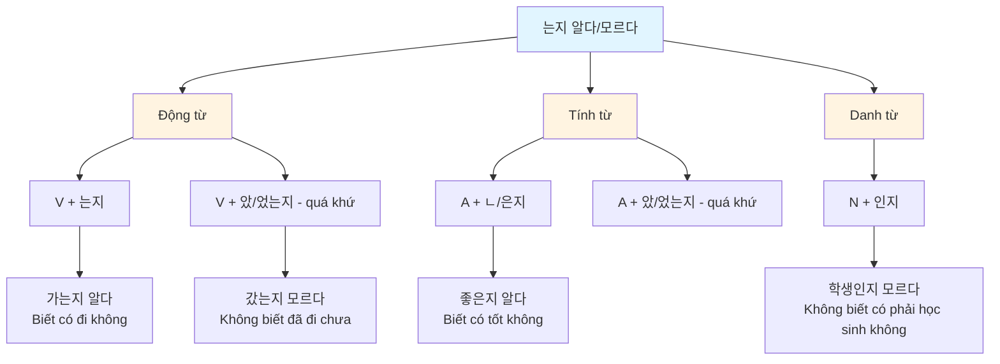
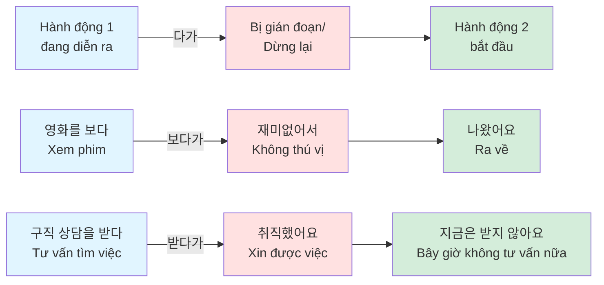
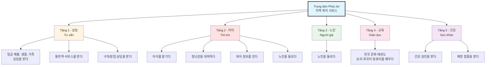
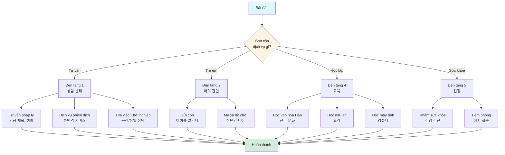
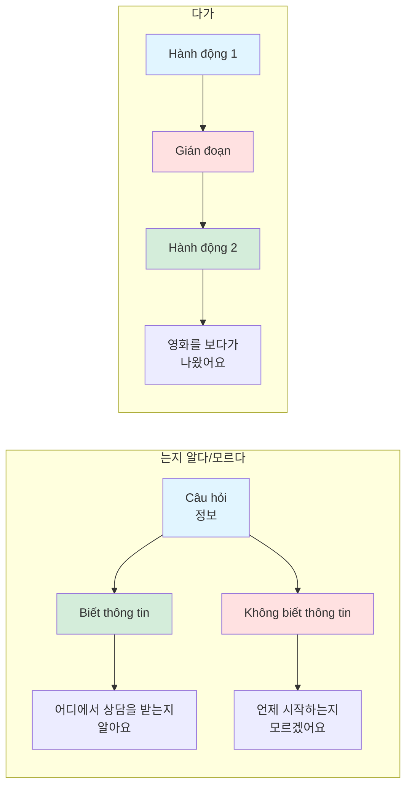
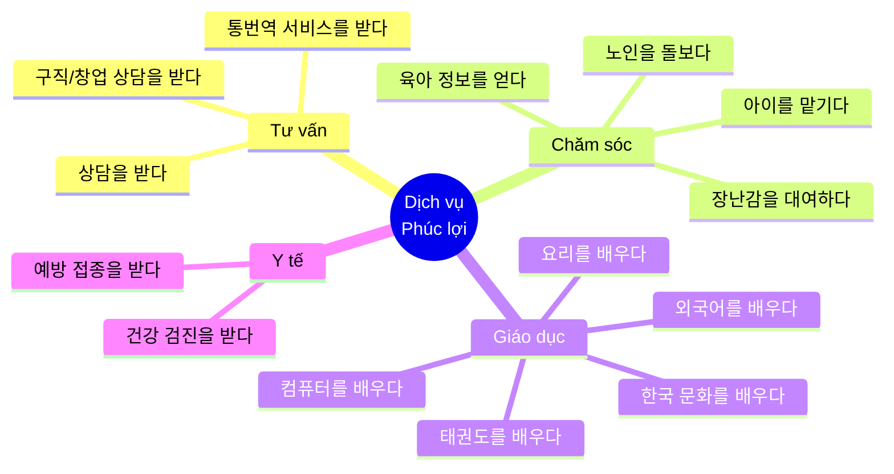
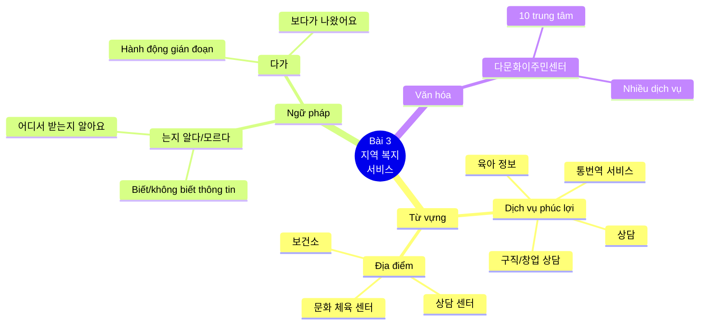

# BÀI 3: DỊCH VỤ PHÚC LỢI TẠI ĐỊA PHƯƠNG

## MỤC TIÊU HỌC TẬP

- **Từ vựng**: Học các từ vựng về dịch vụ phúc lợi và sử dụng dịch vụ
- **Ngữ pháp**:
  - `동형-는지 알다/모르다`: Biết/không biết liệu có...
  - `동-다가`: Diễn tả hành động bị gián đoạn và chuyển sang hành động khác
- **Văn hóa & Thông tin**: Tìm hiểu về Trung tâm Đa văn hóa Người nhập cư

---

## GIỚI THIỆU

### Câu hỏi mở đầu

**이 사람들은 지금 어디에서 무엇을 하고 있어요?**
> *Những người này đang làm gì ở đâu?*

**여러분은 복지 서비스를 이용해 본 적이 있어요?**
> *Bạn đã từng sử dụng dịch vụ phúc lợi chưa?*

---

### 1. 한국 생활을 도와주는 서비스에는 무엇이 있어요?

**Ở Hàn Quốc có những dịch vụ nào giúp đỡ cuộc sống?**

#### Các dịch vụ theo tầng:

**상담 (Tư vấn - Tầng 1):**
- (임금 체불, 생활, 가족 등) 상담을 받다
  > *Nhận tư vấn về (nợ lương, sinh hoạt, gia đình, v.v.)*
- 통번역 서비스를 받다
  > *Nhận dịch vụ phiên dịch*
- 구직/창업 상담을 받다
  > *Nhận tư vấn tìm việc/khởi nghiệp*

**아이 (Trẻ em - Tầng 2):**
- 아이를 맡기다
  > *Gửi con*
- 장난감을 대여하다
  > *Mượn đồ chơi*
- 육아 정보를 얻다
  > *Nhận thông tin nuôi dạy con*

**노인 (Người già - Tầng 3):**
- 노인을 돌보다
  > *Chăm sóc người già*

**교육 (Giáo dục - Tầng 4):**
- 한국 문화·태권도·요리·외국어·컴퓨터를 배우다
  > *Học văn hóa Hàn Quốc, Taekwondo, nấu ăn, ngoại ngữ, máy tính*

**건강 (Sức khỏe - Tầng 5):**
- 건강 검진을 받다
  > *Khám sức khỏe*
- 예방 접종을 받다
  > *Tiêm phòng*

---

### 2. 여러분은 무슨 복지 서비스를 이용해 봤어요? 무엇을 이용해 보고 싶어요?

**Bạn đã sử dụng dịch vụ phúc lợi nào? Bạn muốn sử dụng dịch vụ gì?**

**Ví dụ:**

저는 나중에 커피숍을 하고 싶어요. 그래서 상담 센터에 가서 창업 상담을 받고 싶어요.

**Dịch:**

Tôi muốn mở quán cà phê sau này. Vì vậy tôi muốn đến trung tâm tư vấn để được tư vấn về khởi nghiệp.

---

## I. TỪ VỰNG

### 1.1. Từ vựng về Dịch vụ Phúc lợi

| Tiếng Hàn | Nghĩa tiếng Việt | Ví dụ |
|-----------|------------------|-------|
| 상담 | Tư vấn, tham vấn | 어디에서 상담을 받을 수 있는지 아세요? (Bạn có biết có thể tư vấn ở đâu không?) |
| 통번역 서비스 | Dịch vụ phiên dịch và thông dịch | 외국인도 복지 서비스를 이용할 수 있는지 아는 사람이 많지 않다. (Không nhiều người biết người nước ngoài cũng có thể sử dụng dịch vụ phúc lợi.) |
| 구직/창업 상담 | Tư vấn tìm việc/khởi nghiệp | 요즘도 외국인 인력 지원 센터에서 구직 상담을 받으세요? (Gần đây bạn có đến Trung tâm Hỗ trợ Lao động nước ngoài để được tư vấn tìm việc không?) |
| 아이를 맡기다 | Gửi con, nhờ trông con | 저는 우리 동네 그런 시설이 있는지 몰랐어요. 수업은 언제 해요? (Tôi không biết khu phố mình có cơ sở như vậy. Lớp học khi nào?) |
| 장난감을 대여하다 | Cho thuê/mượn đồ chơi | 어디에서 장난감을 빌릴 수 있어요? (Có thể mượn đồ chơi ở đâu?) |
| 육아 정보 | Thông tin nuôi dạy con | 육아 정보를 얻다 (Nhận thông tin nuôi dạy con) |
| 노인을 돌보다 | Chăm sóc người già | 노인을 돌보다 (Chăm sóc người già) |
| 한국 문화를 배우다 | Học văn hóa Hàn Quốc | 한국 문화·태권도·요리·외국어·컴퓨터를 배우다 (Học văn hóa Hàn Quốc, Taekwondo, nấu ăn, ngoại ngữ, máy tính) |
| 건강 검진을 받다 | Khám sức khỏe | 건강 검진을 받다 (Khám sức khỏe) |
| 예방 접종을 받다 | Tiêm phòng | 어디에서 예방 접종을 하는지 알아요? 네, 알아요. 보건소에서 해요. (Bạn có biết tiêm phòng ở đâu không? Vâng, biết. Ở trạm y tế.) |
| 임금 체불 | Nợ lương, chậm trả lương | (임금 체불, 생활, 가족 등) 상담을 받다 (Nhận tư vấn về nợ lương, sinh hoạt, gia đình, v.v.) |
| 산업 재해 | Tai nạn lao động | 산업 재해 (Tai nạn lao động) |
| 근무 조건 | Điều kiện làm việc | 근무 조건 (Điều kiện làm việc) |
| 의료 상담 | Tư vấn y tế | 의료 상담 (Tư vấn y tế) |
| 참가 자격 | Điều kiện tham gia | 참가 자격 (Điều kiện tham gia) |
| 정착 | Định cư, hội nhập | 정착 (Định cư) |
| 교류실 | Phòng giao lưu | 교류실 (Phòng giao lưu) |

### 1.2. Từ vựng về Địa điểm và Dịch vụ

| Tiếng Hàn | Nghĩa tiếng Việt | Ví dụ |
|-----------|------------------|-------|
| 상담 센터 | Trung tâm tư vấn | 네, 알아요. 4층 상담 센터에요. (Vâng, biết. Trung tâm tư vấn tầng 4.) |
| 통번역 서비스 센터 | Trung tâm dịch vụ phiên dịch | 통번역 서비스를 받다 (Nhận dịch vụ phiên dịch) |
| 문화 체육 센터 | Trung tâm văn hóa thể thao | 문화 체육 센터에서 무엇을 배우는지 알아요? (Bạn có biết học gì ở Trung tâm Văn hóa Thể thao không?) |
| 육아 종합 지원 센터 | Trung tâm hỗ trợ nuôi dạy con tổng hợp | 육아 종합 지원 센터 (Trung tâm hỗ trợ nuôi dạy con tổng hợp) |
| 보건소 | Trạm y tế, trung tâm y tế | 네, 알아요. 보건소에서 해요. (Vâng, biết. Ở trạm y tế.) |
| 4층 상담 센터 | Trung tâm tư vấn tầng 4 | 네, 알아요. 4층 상담 센터에요. (Vâng, biết. Trung tâm tư vấn tầng 4.) |
| 태권도, 요리 | Taekwondo, nấu ăn | 한국 문화·태권도·요리·외국어·컴퓨터를 배우다 (Học văn hóa Hàn Quốc, Taekwondo, nấu ăn, ngoại ngữ, máy tính) |
| 한국 요리 | Ẩm thực Hàn Quốc | 한국 요리를 어디에서 배울 수 있는지 알아요? (Bạn có biết học nấu ăn Hàn Quốc ở đâu không?) |

### 1.3. Từ vựng bổ sung

| Tiếng Hàn | Nghĩa tiếng Việt | Ví dụ |
|-----------|------------------|-------|
| 무료 | Miễn phí | 1회 무료 체험 가능. 65세 이상은 50% 할인 (Có thể dùng thử miễn phí 1 lần. Người trên 65 tuổi được giảm 50%) |
| 컴퓨터를 배우다 | Học máy tính | 어머, 미호 씨, 컴퓨터를 배우세요? (Ôi, chị Miho, chị học máy tính à?) |
| 체육관 | Phòng tập thể dục | 체육관 (Phòng tập thể dục) |
| 창 | Cửa sổ | 창 (Cửa sổ) |
| 활용되다 | Được sử dụng, được ứng dụng | 활용되다 (Được sử dụng) |
| 고충 | Khó khăn, vướng mắc | 고충 (Khó khăn) |
| 교류실 | Phòng giao lưu | 교류실 (Phòng giao lưu) |
| 된장 | Tương đậu (gia vị Hàn Quốc) | 된장 (Tương đậu) |
| 취직하다 | Xin được việc, có việc làm | 지난달까지 구직 상담을 받다가 얼마 전에 취직해서 지금은 받지 않아요. (Đến tháng trước tôi được tư vấn tìm việc rồi vừa mới xin được việc nên bây giờ không tư vấn nữa.) |
| 쏟다 | Đổ, làm đổ | 책을 읽다가 커피를 쏟았어요. (Đang đọc sách rồi làm đổ cà phê.) |
| 따라하다 | Làm theo, bắt chước | 요리책을 보고 요리를 하다가 따라하기 어렵다. (Xem sách nấu ăn và nấu rồi khó theo.) |
| 문의 | Thắc mắc, hỏi đáp | 다른 문의 사항은 없으세요? (Bạn có thắc mắc gì khác không?) |
| 편의 | Tiện lợi | 공항에 무슨 편의 시설이 있어요? (Ở sân bay có tiện ích gì?) |
| 논의 | Thảo luận | 그 문제에 대해서는 현재 논의가 활발하다. (Vấn đề đó đang được thảo luận sôi nổi.) |
| 회의 | Họp, hội nghị | 회의 (Họp) |
| 운영하다 | Vận hành | 운영하다 (Vận hành) |
| 등록하다 | Đăng ký | 등록하다 (Đăng ký) |
| 프로그램 | Chương trình | 요리, 수영, 컴퓨터 등 다양한 프로그램이 있으니까 한번 알아보세요. (Có nhiều chương trình như nấu ăn, bơi lội, máy tính nên hãy tìm hiểu thử.) |

---

## II. NGỮ PHÁP

### 2.1. Ngữ pháp `동형-는지 알다/모르다`: Biết/không biết liệu...

#### 📚 Khái niệm

Cấu trúc **`동형-는지 알다/모르다`** được sử dụng để diễn tả việc **biết hay không biết** về một thông tin, sự việc, hoặc khả năng thực hiện một hành động nào đó. Cấu trúc này thường được dùng để hỏi hoặc trả lời về việc có nắm được thông tin hay không.

#### 🔧 Cấu tạo

**Với động từ/tính từ:**

```
Động từ/Tính từ + -는지/-ㄴ지/-은지 알다/모르다
```

**Quy tắc biến đổi:**

| Loại từ | Cách kết hợp | Ví dụ |
|---------|--------------|-------|
| Động từ (hiện tại) | V + 는지 | 가다 → 가는지 알다 |
| Động từ (quá khứ) | V + 았/었는지 | 갔는지 알다 |
| Tính từ | A + ㄴ/은지 | 좋다 → 좋은지 알다 |

**Với danh từ:**

```
Danh từ + 인지 알다/모르다
```

#### 📊 Bảng phân loại chi tiết

| Thì | Động từ | Tính từ | Danh từ |
|-----|---------|---------|---------|
| Hiện tại | V + 는지 알다 | A + ㄴ/은지 알다 | N + 인지 알다 |
| Quá khứ | V + 았/었는지 알다 | A + 았/었는지 알다 | N + 이었/였는지 알다 |

#### ✍️ Ví dụ minh họa

**Ví dụ với động từ:**

| Động từ gốc | Hiện tại | Quá khứ |
|-------------|----------|---------|
| 가다 (đi) | 가는지 알다 | 갔는지 알다 |
| 오다 (đến) | 오는지 모르다 | 왔는지 모르다 |
| 먹다 (ăn) | 먹는지 알다 | 먹었는지 알다 |

**Ví dụ với tính từ:**

| Tính từ gốc | Hiện tại | Quá khứ |
|-------------|----------|---------|
| 좋다 (tốt) | 좋은지 알다 | 좋았는지 알다 |
| 크다 (to) | 큰지 모르다 | 컸는지 모르다 |

#### 📝 Câu ví dụ

| Tiếng Hàn | Nghĩa tiếng Việt |
|-----------|------------------|
| 문화 체육 센터에서 무엇을 배우는지 알아요? | Bạn có biết học gì ở Trung tâm Văn hóa Thể thao không? |
| 네, 체육 수업하고 한식 조리를 배울 수 있어요. | Vâng, mình có thể học thể dục và nấu món Hàn. |
| 어디에서 예방 접종을 하는지 알아요? | Bạn có biết tiêm phòng ở đâu không? |
| 고쳔: 네, 알아요. 보건소에서 해요. | Vâng, biết. Ở trạm y tế. |
| 한국 요리를 어디에서 배울 수 있는지 알아요? | Bạn có biết học nấu ăn Hàn Quốc ở đâu không? |
| 네, 학교 근처에 있는 문화 체육 센터에서 배울 수 있어요. | Vâng, có thể học ở Trung tâm Văn hóa Thể thao gần trường. |

---

### 2.2. Ngữ pháp `동-다가`: Làm gì đó rồi chuyển sang làm việc khác

#### 📚 Khái niệm

Cấu trúc **`동-다가`** được sử dụng để diễn tả một hành động đang diễn ra **bị gián đoạn hoặc dừng lại**, sau đó **chuyển sang** thực hiện một hành động khác. Nó nhấn mạnh sự chuyển tiếp giữa hai hành động.

#### 🔧 Cấu tạo

```
Động từ gốc + -다가
```

**Quy tắc biến đổi:**

| Loại động từ | Cách kết hợp | Ví dụ |
|-------------|--------------|-------|
| Động từ thường | Gốc + 다가 | 가다 → 가다가 |
| Động từ có patchim | Gốc + 다가 | 먹다 → 먹다가 |
| Động từ kết thúc bằng ㄹ | Gốc + 다가 | 살다 → 살다가 |

**Lưu ý đặc biệt:**
- Với động từ kết thúc bằng ㅂ bất quy tắc: 춥다 → 춥다가 (không đổi)

#### 📊 Bảng biến đổi

| Động từ gốc | Kết hợp với -다가 | Nghĩa |
|-------------|-------------------|-------|
| 가다 | 가다가 | Đi rồi... |
| 먹다 | 먹다가 | Ăn rồi... |
| 청소하다 | 청소하다가 | Dọn dẹp rồi... |

#### ✍️ Ví dụ minh họa

**So sánh với -는 대신(에):**

| Ngữ pháp | Ví dụ | Ý nghĩa |
|----------|-------|---------|
| -다가 | 영화를 보다가 재미없어서 나왔어요. | Xem phim rồi vì không thú vị nên ra về. |
| -는 대신(에) | 영화를 보는 대신에 책을 읽었어요. | Thay vì xem phim thì đọc sách. |

#### 📝 Câu ví dụ

| Tiếng Hàn | Nghĩa tiếng Việt |
|-----------|------------------|
| 요즘도 외국인 인력 지원 센터에서 구직 상담을 받으세요? | Gần đây bạn có đến Trung tâm Hỗ trợ Lao động nước ngoài để được tư vấn tìm việc không? |
| 아니요. 지난달까지 구직 상담을 받다가 얼마 전에 취직해서 지금은 받지 않아요. | Không. Đến tháng trước tôi được tư vấn tìm việc rồi vừa mới xin được việc nên bây giờ không tư vấn nữa. |
| 컴퓨터를 학원에 다니다가 어려워서 요리 수업으로 바꿨어요. | Tôi học máy tính ở trung tâm rồi vì khó quá nên đổi sang lớp nấu ăn. |
| 책을 읽다가 친구가 와서 밖에 나갔어요. | Đang đọc sách rồi bạn đến nên ra ngoài. |

---

## III. BIỂU ĐỒ MINH HỌA

### 3.1. Biểu đồ cấu trúc ngữ pháp `-는지 알다/모르다`



### 3.2. Biểu đồ cấu trúc ngữ pháp `-다가`



### 3.3. Sơ đồ các dịch vụ tại Trung tâm Phúc lợi



### 3.4. Quy trình sử dụng dịch vụ phúc lợi



### 3.5. So sánh `-는지 알다/모르다` và `-다가`



---

## III-A. NÓI (말하기)

### 1. 후엔 씨와 미호 씨가 복지 시설 이용에 대해 이야기합니다. 다음 대화처럼 이야기해 보세요.

**Chị Huyền và chị Miho đang nói chuyện về việc sử dụng các cơ sở phúc lợi. Hãy nói chuyện như đoạn hội thoại sau:**

#### 📝 Hội thoại

**후엔:** 어머, 미호 씨, 컴퓨터를 배우세요?
> *Ôi, chị Miho, chị học máy tính à?*

**미호:** 네, 혼자 책 보고 공부하다가 요즘은 동네에 있는 문화 체육 센터에서 배우고 있어요.
> *Vâng, tôi tự đọc sách học rồi gần đây đang học ở Trung tâm Văn hóa Thể thao trong khu phố.*

**후엔:** 와, 저는 우리 동네에 그런 시설이 있는지 몰랐어요. 수업은 언제 해요?
> *Wao, tôi không biết khu phố mình có cơ sở như vậy. Lớp học khi nào?*

**미호:** 매주 화요일과 목요일 오후 7시부터 8시까지 해요. 요리, 수영, 컴퓨터 등 다양한 프로그램이 있으니까 한번 알아보세요.
> *Mỗi tuần thứ Ba và thứ Năm từ 7 giờ đến 8 giờ tối. Có nhiều chương trình như nấu ăn, bơi lội, máy tính nên hãy tìm hiểu thử.*

**후엔:** 그렇군요. 저도 알아봐야겠어요.
> *Vậy à. Tôi cũng phải tìm hiểu mới được.*

**미호:** 매달 마지막 주에 일주일 동안 신청을 받아요. 자세한 것은 문화 체육 센터 홈페이지에 나와 있으니까 들어가 보세요.
> *Mỗi tháng họ nhận đăng ký trong một tuần vào tuần cuối cùng. Chi tiết có trên trang web Trung tâm Văn hóa Thể thao nên hãy vào xem.*

---

#### 💡 Ghi chú hội thoại

**1) 컴퓨터를 배우다** | 혼자 책 보고 공부하다, 문화 체육 센터에서 배우다
> *Học máy tính | Tự đọc sách học, học ở Trung tâm Văn hóa Thể thao*

**2) 요리를 배우다** | 집에서 동영상을 보고 운동하다, 무료 체육 시설에서 배우다
> *Học nấu ăn | Xem video tại nhà và tập, học ở cơ sở thể dục miễn phí*

---

### 2. 아래는 프로그램 안내문입니다. 무엇을 수강하고 싶은지 이야기해 보세요.

**Dưới đây là tờ hướng dẫn chương trình. Hãy nói chuyện về bạn muốn học gì:**

#### ⭐ 행복 문화 체육 센터 프로그램

**Chương trình Trung tâm Văn hóa Thể thao Hạnh phúc**

| 프로그램 | 요일 | 시간 | 내용 | 금액 |
|---------|------|------|------|------|
| **수영** | 월~금 | 오전 6~7시 | 초급 | 5만 원 |
| **컴퓨터 1** | 화, 목 | 오후 7~8시 | 초급 | 3만 원 |
| **컴퓨터 2** | 화, 목 | 오후 8~9시 | 중급 | 3만 원 |
| **한국 요리** | 수 | 오전 10~11시 | 일반 가정식 | 재료비 |
| **태권도** | 월~금 | 오전 8~9시 | 초급 | 5만 원 |
| **K-POP 댄스** | 월, 수, 금 | 오후 5~6시 | 취미반 | 3만 원 |

*\*1회 무료 체험 가능. 65세 이상은 50% 할인*
> *\*Có thể dùng thử miễn phí 1 lần. Người trên 65 tuổi được giảm 50%*

---

## IV. BÀI TẬP THỰC HÀNH

### Bài 1: Hoàn thành câu với `-는지 알다/모르다`

Sử dụng cấu trúc `-는지 알다/모르다` để hoàn thành các câu sau:

1. **어디에서 상담을 받을 수 있는지 아세요?**
   > *Bạn có biết có thể tư vấn ở đâu không?*

   → 네, 알아요. 4층 상담 센터에요.

2. **아이의 예방 접종 비용이 얼마예요?**
   > *Chi phí tiêm phòng cho trẻ là bao nhiêu?*

   → 무료 / 태권도, 요리

3. **문화 체육 센터에서 무슨 수업이 있어요?**
   > *Ở Trung tâm Văn hóa Thể thao có lớp học gì?*

   → 어디에서 장난감을 빌릴 수 있어요?

---

### Bài 2: Hoàn thành câu với `-다가`

Kết hợp các câu sau sử dụng `-다가`:

1. **공부하다 + 모르는 단어가 있어서 사전을 찾았어요**
   > *Học rồi có từ không biết nên tra từ điển*

   → 공부하다가 모르는 단어가 있어서 사전을 찾았어요.

2. **텔레비전을 보다 + 재미가 없다**
   > *Xem TV rồi không thú vị*

   → 텔레비전을 **_____________** 재미가 없어요.

3. **책을 읽다 + 커피를 쏟다**
   > *Đọc sách rồi làm đổ cà phê*

   → 책을 **_____________** 커피를 쏟았어요.

4. **요리책을 보고 요리를 하다 + 따라하기 어렵다**
   > *Xem sách nấu ăn và nấu rồi khó theo*

   → 요리책을 보고 요리를 **_____________** 문화 체육 센터에서 요리 수업을 듣다.

---

### Bài 3: Điền từ vựng về dịch vụ phúc lợi

Chọn từ thích hợp điền vào chỗ trống:

**Ngân hàng từ vựng:**
- 건강 검진, 예방 접종, 상담, 통번역 서비스, 구직, 창업, 장난감 대여, 육아 정보

1. 후엔: 어머, 미호 씨, 컴퓨터를 **_____________** 배우세요?

2. 미호: 네, 혼자 책 보고 공부하다가 요즘은 동네에 있는 문화 체육 센터에서 **_____________** 있어요.

3. 후엔: 와, 저는 우리 동네에 그런 시설이 있는지 몰랐어요. 수업은 언제 해요?

4. 미호: 매주 화요일과 목요일 오후 7시부터 8시까지 해요. 요리, 수영, 컴퓨터 등 다양한 프로그램이 있으니까 한번 알아보세요.

---

## IV-A. NGHE (듣기)

### 1. 여러분은 강좌를 신청해 본 적이 있습니까? 강좌를 신청하기 전에 무엇을 확인하고 싶습니까?

**Bạn đã từng đăng ký khóa học chưa? Trước khi đăng ký khóa học, bạn muốn xác nhận điều gì?**

**Các câu hỏi mẫu:**
- 지금 등록 가능해요?
  > *Bây giờ có thể đăng ký không?*

- 등록비는 얼마인지 좀 알려 주세요.
  > *Cho tôi biết học phí là bao nhiêu.*

- 교육 내용이 뭔지 좀 알 수 있을까요?
  > *Tôi có thể biết nội dung giáo dục là gì không?*

---

### 2. 후엔 씨와 외국인 종합 복지 센터 직원이 이야기합니다. 잘 듣고 질문에 답해 보세요.

**Chị Huyền và nhân viên Trung tâm Phúc lợi Tổng hợp cho Người nước ngoài đang nói chuyện. Hãy nghe kỹ và trả lời câu hỏi:**

#### 📻 Bài nghe 3-1.mp3

**1) 후엔 씨는 어느 프로그램에 등록하고 싶었습니까?**
> *Chị Huyền muốn đăng ký chương trình nào?*

_________________________________

**2) 등록비는 얼마입니까?**
> *Học phí là bao nhiêu?*

_________________________________

**3) 들은 내용과 같으면 O, 다르면 X 하세요.**
> *Nếu giống với nội dung nghe thì đánh O, khác thì đánh X:*

① 초급 컴퓨터 프로그램은 지금 자리가 있다.     (      )

② 중급 컴퓨터 프로그램은 신청할 수 있다.     (      )

③ 수업은 화요일과 목요일에 한다.     (      )

---

### 3. Phát âm: 문의 → [무니, 무니]

#### 📚 Quy tắc phát âm

**문의** (thắc mắc, hỏi đáp) được phát âm là **[무니]**

**Các ví dụ khác:**

| Từ gốc | Phát âm | Nghĩa |
|--------|---------|-------|
| 문의 | [무니, 무니] | Thắc mắc, hỏi đáp |
| 편의 | [편ː니] | Tiện lợi |
| 논의 | [논ː니, 노니] | Thảo luận |

**Quy tắc:**
- Khi **ㄴ** đứng trước **의**, âm **의** thường được phát âm là **이**
- Cấu trúc: **ㄴ + 의 → [니]**

#### 📝 Ví dụ câu - Hãy nghe và nói theo

**다음을 듣고 따라 읽으세요.**

**1) 다른 문의 사항은 없으세요?**
> *Bạn có thắc mắc gì khác không?*

**2) 공항에 무슨 편의 시설이 있어요?**
> *Ở sân bay có tiện ích gì?*

**3) 그 문제에 대해서는 현재 논의가 활발하다.**
> *Vấn đề đó đang được thảo luận sôi nổi.*

---

## IV-B. ĐỌC (읽기)

### 1. 다음의 포스터를 보고 무슨 복지 서비스에 대한 포스터인지 이야기해 보세요.

**Hãy xem các poster sau và nói về dịch vụ phúc lợi nào:**

**Các loại poster:**
- **1억원 독감 예방 접종**: Tiêm phòng cúm miễn phí
  > *어린이, 임산부, 어르신 무료로 받으세요!*
  > *Trẻ em, phụ nữ mang thai, người cao tuổi nhận miễn phí!*

- **무료 외국인 주민 통역 상담**: Tư vấn phiên dịch miễn phí cho cư dân nước ngoài
  > *입금 체불, 퇴직금, 산업 재해, 출입국, 근무 조건, 의료 상담*
  > *Nợ lương, trợ cấp thôi việc, tai nạn lao động, xuất nhập cảnh, điều kiện làm việc, tư vấn y tế*
  > *통번역 상담 가능*
  > *Có thể tư vấn với phiên dịch*
  > *온라인 및 전화 신청*
  > *Đăng ký trực tuyến hoặc qua điện thoại*

- **외국인 취업 교육 프로그램**: Chương trình giáo dục việc làm cho người nước ngoài
  > *기간: 7월 2일~7월 19일*
  > *Thời gian: 2/7 ~ 19/7*
  > *참가 자격: OOA 자격 외국인 30명 TOPIK 3급 또는 KIIP 3단계 이상*
  > *Điều kiện tham gia: 30 người nước ngoài có tư cách OOA, TOPIK cấp 3 hoặc KIIP giai đoạn 3 trở lên*
  > *프로그램 내용: 비즈니스 한국어 취업 교육(이력서 작성법, 면접) 선배와의 대화*
  > *Nội dung chương trình: Tiếng Hàn kinh doanh, Giáo dục việc làm (Cách viết CV, phỏng vấn), Đối thoại với tiền bối*
  > *신청 방법: 이메일 접수*
  > *Cách đăng ký: Nộp qua email*

---

### 2. 다음 제목을 보고 무엇에 대한 기사인지 이야기해 보세요.

**Hãy xem các tiêu đề sau và nói về bài báo là về điều gì:**

**Các tiêu đề báo:**

**① 찾아가는 방문 상담으로 '완전한 정착' 돕는다**
> *Giúp 'định cư hoàn toàn' bằng dịch vụ tư vấn tận nhà*

**② 결혼 이민자 및 외국인을 위한 '생활 통역 서비스' 시작**
> *Bắt đầu 'dịch vụ phiên dịch sinh hoạt' cho người nhập cư kết hôn và người nước ngoài*

**③ 복지시 복지 재단, 창공로, 숙박비 등 다문화 가정 친정 방문 지원**
> *Quỹ Phúc lợi thành phố Bokji hỗ trợ gia đình đa văn hóa thăm nhà ngoại: vé máy bay, tiền ở, v.v.*

**④ 창업을 준비하는 외국인 근로자를 위한 창업 상담 서비스 시작**
> *Bắt đầu dịch vụ tư vấn khởi nghiệp cho người lao động nước ngoài chuẩn bị khởi nghiệp*

---

### 3. 다음은 복지 센터에 대한 기사입니다. 잘 읽고 질문에 답해 보세요.

**Sau đây là bài báo về trung tâm phúc lợi. Hãy đọc kỹ và trả lời câu hỏi:**

#### 📰 Bài đọc

**OO신문 | 20XX년 9월 15일**

## 이민자와 다문화 가족을 위한 복지 센터 문 열어

**OO시 외국인 복지 센터가 오는 9일 문을 연다.** 이민자와 다문화 가족을 위한 복지 센터는 국제 문화 교류실, 공동체 모임방, 상담실, 교육실, 강당 등 다양한 시설을 갖추고 있다.

**1층은 국가별 영화 상영과 전시 등을 통해 지역 주민들에게 세계 문화를 소개하고 서로의 문화를 이해하는 사회 통합의 장으로 활용된다.** 현재 2층과 3층에는 종합 복지 센터와 글로벌 아동 센터가 각각 운영되고 있다.

**종합 복지 센터는 이민자들을 대상으로 개인·가족 상담, 방문 서비스 교육, 한국어 교육, 취업 교육 등을 운영하고 있다.** 글로벌 아동 센터는 12세 이하 아동과 18세 이하 중도 입국 청소년을 대상으로 복지·교육·보건 등의 서비스를 제공 중이다. 같은 건물에 위치한 보건소에서는 이민자들과 지역 주민들에게 건강 검진, 예방 접종 등의 의료 서비스를 제공한다.

**OO신문 | 김기영 기자**

---

**Dịch:**

**Báo OO | Ngày 15 tháng 9 năm 20XX**

## Trung tâm phúc lợi cho người nhập cư và gia đình đa văn hóa mở cửa

**Trung tâm Phúc lợi Người nước ngoài thành phố OO sẽ mở cửa vào ngày 9 sắp tới.** Trung tâm phúc lợi cho người nhập cư và gia đình đa văn hóa được trang bị nhiều cơ sở khác nhau như phòng giao lưu văn hóa quốc tế, phòng họp cộng đồng, phòng tư vấn, phòng giáo dục, hội trường, v.v.

**Tầng 1 được sử dụng như một nơi hội nhập xã hội giới thiệu văn hóa thế giới cho cư dân địa phương và hiểu biết văn hóa của nhau thông qua chiếu phim theo quốc gia và triển lãm.** Hiện tại ở tầng 2 và tầng 3 có Trung tâm Phúc lợi Tổng hợp và Trung tâm Trẻ em Toàn cầu đang hoạt động.

**Trung tâm Phúc lợi Tổng hợp đang vận hành tư vấn cá nhân, gia đình, giáo dục dịch vụ thăm hỏi, giáo dục tiếng Hàn, giáo dục việc làm, v.v. dành cho người nhập cư.** Trung tâm Trẻ em Toàn cầu đang cung cấp các dịch vụ như phúc lợi, giáo dục, y tế cho trẻ em dưới 12 tuổi và thanh thiếu niên nhập cảnh giữa chừng dưới 18 tuổi. Trạm y tế nằm trong cùng tòa nhà cung cấp dịch vụ y tế như khám sức khỏe, tiêm phòng cho người nhập cư và cư dân địa phương.

**Báo OO | Phóng viên Kim Ki-young**

---

#### 💭 Câu hỏi

**1) 무엇에 대한 기사입니까?**
> *Bài báo về điều gì?*

_________________________________

**2) 종합 복지 센터에서 제공하는 서비스가 아닌 것을 고르세요.**
> *Hãy chọn dịch vụ KHÔNG phải do Trung tâm Phúc lợi Tổng hợp cung cấp:*

① 가족 상담      ② 통번역 교육

③ 한국어 교육      ④ 방문 서비스

**3) 맞글의 내용과 같으면 O, 다르면 X 하세요.**
> *Nếu giống với nội dung bài đọc thì đánh O, khác thì đánh X:*

① 새로 문을 연 복지 서비스 시설에서는 영화를 볼 수 있다.     (      )

② 종합 복지 센터는 2층에 있다.     (      )

③ 글로벌 아동 센터는 12세 이하 어린이만 이용할 수 있다.     (      )

**Ghi chú:**
- 단어장: Sổ từ vựng
- 교류실: Phòng giao lưu
- 활용되다: Được sử dụng, được ứng dụng
- 고충: Khó khăn, vướng mắc

---

## IV-C. VIẾT (쓰기)

### 1. 여러분이 이용해 본 지역 복지 서비스는 무엇이 있습니까?

**Bạn đã sử dụng dịch vụ phúc lợi địa phương nào?**

| Câu hỏi | Câu trả lời |
|---------|-------------|
| **• 무슨 복지 서비스를 이용해 봤습니까?** <br> *Bạn đã sử dụng dịch vụ phúc lợi nào?* | |
| **• 어떻게 그 서비스를 알았습니까?** <br> *Bạn biết dịch vụ đó như thế nào?* | |
| **• 그 서비스는 무엇이 좋습니까?** <br> *Điều gì tốt ở dịch vụ đó?* | |
| **• 그 서비스를 이용하는 방법은 무엇입니까?** <br> *Phương pháp sử dụng dịch vụ đó là gì?* | |

---

### 2. 위의 내용을 바탕으로 여러분이 다른 사람에게 소개하고 싶은 복지 서비스에 대해 소개하는 글을 써 보세요.

**Dựa trên nội dung trên, hãy viết bài giới thiệu về dịch vụ phúc lợi mà bạn muốn giới thiệu cho người khác:**

_________________________________________________________________

_________________________________________________________________

_________________________________________________________________

_________________________________________________________________

_________________________________________________________________

_________________________________________________________________

_________________________________________________________________

_________________________________________________________________

_________________________________________________________________

_________________________________________________________________

_________________________________________________________________

_________________________________________________________________

_________________________________________________________________

_________________________________________________________________

_________________________________________________________________

_________________________________________________________________

_________________________________________________________________

_________________________________________________________________

_________________________________________________________________

_________________________________________________________________

---

## V. VẤN ĐỀ VĂN HÓA & THÔNG TIN

### 5.1. Trung tâm Đa văn hóa Người nhập cư (다문화이주민센터)

**다문화이주민센터 (Trung tâm Đa văn hóa Người nhập cư)** là một dịch vụ đa dạng dành cho người nước ngoài hoặc những gia đình đa văn hóa sinh sống tại Hàn Quốc. Trung tâm cung cấp các dịch vụ được phân loại theo từng khu vực như tư vấn, pháp lý, hành chính và giáo dục.

#### 📋 Các dịch vụ chính

Trung tâm Đa văn hóa Người nhập cư cung cấp:

- **Tư vấn pháp lý và hành chính**: Tư vấn về pháp luật, giấy tờ, thủ tục hành chính
- **Giáo dục và đào tạo**: Giáo dục ngôn ngữ Hàn Quốc, văn hóa, kỹ năng nghề nghiệp
- **Dịch vụ phiên dịch và thông dịch**: Hỗ trợ giao tiếp cho người không thông thạo tiếng Hàn
- **Tư vấn tìm việc và khởi nghiệp**: Giúp người nhập cư tìm việc làm phù hợp
- **Dịch vụ chăm sóc gia đình và con cái**: Hỗ trợ nuôi dạy con, chăm sóc người già

#### 🏢 Địa điểm hoạt động

Hiện tại, có khoảng **10 trung tâm** hoạt động tại các khu vực như:
- Gyeonggi (경기)
- Incheon (인천)
- Busan (부산)
- Daegu (대구)
- Ulsan (울산)
- Naju (나주)
- Seoul (서울)

Người nhập cư có thể tham gia các hoạt động và dịch vụ tại các trung tâm này.

---

### 5.2. Danh sách các dịch vụ có thể nhận được



---

### 5.3. Bảng chương trình văn hóa thể thao mẫu

| Chương trình | Ngày | Thời gian | Nội dung | Giá |
|--------------|------|-----------|----------|-----|
| 수영 (Bơi lội) | Thứ 2-Thứ 6 | 6:00-7:00 sáng | Sơ cấp | 5만 원 |
| 컴퓨터 1 | Thứ 3, Thứ 5 | 7:00-8:00 chiều | Sơ cấp | 3만 원 |
| 컴퓨터 2 | Thứ 3, Thứ 5 | 8:00-9:00 chiều | Trung cấp | 3만 원 |
| 한국 요리 | Thứ 4 | 10:00-11:00 sáng | Ẩm thực truyền thống | 제료비 (Chi phí nguyên liệu) |
| 태권도 | Thứ 2-Thứ 6 | 8:00-9:00 sáng | Sơ cấp | 5만 원 |
| K-POP 댄스 | Thứ 2, Thứ 4, Thứ 6 | 5:00-6:00 chiều | Buổi tối | 3만 원 |

*Lưu ý: Giá có thể thay đổi. Người trên 65 tuổi được giảm 50%*

---

### 5.4. Câu hỏi thường gặp về Trung tâm

**Q1: 다문화이주민센터는 어떤 기관입니까?**
> *Trung tâm Đa văn hóa Người nhập cư là cơ quan gì?*

**A:** Trung tâm hỗ trợ đa dạng dành cho người nước ngoài và gia đình đa văn hóa.

**Q2: 이곳에서는 어떤 서비스를 받을 수 있습니까?**
> *Ở đây có thể nhận được dịch vụ gì?*

**A:** Tư vấn pháp lý, dịch vụ phiên dịch, tìm việc, giáo dục, chăm sóc con cái, v.v.

**Q3: 여러분이 필요로 하는 서비스는 무엇입니까?**
> *Dịch vụ mà bạn cần là gì?*

**A:** (Tùy vào nhu cầu cá nhân)

---

## VI. TÓM TẮT BÀI HỌC

### 6.1. Điểm chính cần ghi nhớ



### 6.2. Tóm tắt ngữ pháp

| Ngữ pháp | Ý nghĩa | Cấu trúc | Ví dụ |
|----------|---------|----------|-------|
| **-는지 알다/모르다** | Biết/không biết thông tin | V/A + 는지/ㄴ지/은지 | 어디서 받는지 알아요 |
| **-다가** | Gián đoạn rồi chuyển sang | V + 다가 | 보다가 나왔어요 |

---

## VII. HƯỚNG DẪN HỌC TẬP

### 7.1. Cách học từ vựng hiệu quả

1. **Phân loại theo chủ đề**: Nhóm từ vựng về dịch vụ, địa điểm, hành động
2. **Tạo câu thực tế**: Viết câu với ngữ cảnh thực tế khi sử dụng dịch vụ
3. **Luyện tập hội thoại**: Tập nói các tình huống hỏi về dịch vụ phúc lợi
4. **Ghi nhớ theo cụm**: Học theo cụm từ (예: 건강 검진을 받다, 상담을 받다)

### 7.2. Cách luyện ngữ pháp

1. **Hiểu nguyên tắc**: Nắm vững cách dùng `-는지 알다/모르다` và `-다가`
2. **So sánh sự khác biệt**: Phân biệt giữa hai ngữ pháp này
3. **Thực hành viết**: Tạo 10 câu cho mỗi ngữ pháp
4. **Áp dụng thực tế**: Sử dụng trong giao tiếp hàng ngày

---

## VIII. ĐÁP ÁN BÀI TẬP

### Đáp án Bài 1:

1. 네, 알아요. 4층 상담 센터에요.
2. 무료 / 태권도, 요리
3. 어디에서 장난감을 빌릴 수 있는지 알아요?

### Đáp án Bài 2:

1. 공부하다가 모르는 단어가 있어서 사전을 찾았어요.
2. 텔레비전을 **보다가** 재미가 없어요.
3. 책을 **읽다가** 커피를 쏟았어요.
4. 요리책을 보고 요리를 **하다가** 문화 체육 센터에서 요리 수업을 듣다.

### Đáp án Bài 3:

1. 어디에서 컴퓨터를 배우세요?
2. 문화 체육 센터에서 배우고 있어요.
3. 우리 동네에 그런 시설이 있는지 몰랐어요.
4. 한번 알아보세요.

---

## IX. BẢNG KIỂM TRA TỪ VỰNG ĐÃ HỌC

### 📍 배운 어휘 확인 (Kiểm tra từ vựng đã học)

**Hãy đánh dấu ✓ vào các từ vựng mà bạn đã học và nắm vững:**

#### Dịch vụ & Hành động

- ☐ 상담을 받다 (Nhận tư vấn)
- ☐ 창 (Cửa sổ)
- ☐ 통번역 서비스를 받다 (Nhận dịch vụ phiên dịch)
- ☐ 활용되다 (Được sử dụng)
- ☐ 구직/창업 상담을 받다 (Nhận tư vấn tìm việc/khởi nghiệp)
- ☐ 고충 (Khó khăn)
- ☐ 아이를 맡기다 (Gửi con)
- ☐ 교류실 (Phòng giao lưu)
- ☐ 장난감을 대여하다 (Mượn đồ chơi)
- ☐ 노인을 돌보다 (Chăm sóc người già)
- ☐ 한국 문화를 배우다 (Học văn hóa Hàn Quốc)
- ☐ 건강 검진을 받다 (Khám sức khỏe)
- ☐ 예방 접종을 받다 (Tiêm phòng)
- ☐ 입금 체불 (Nợ lương)
- ☐ 산업 재해 (Tai nạn lao động)
- ☐ 근무 조건 (Điều kiện làm việc)
- ☐ 의료 상담 (Tư vấn y tế)
- ☐ 참가 자격 (Điều kiện tham gia)
- ☐ 정착 (Định cư)

---

## X. TÀI LIỆU THAM KHẢO

- Trung tâm Đa văn hóa Người nhập cư (다문화이주민센터)
- Trang thông tin dịch vụ phúc lợi địa phương
- Giáo trình Tiếng Hàn Tổng hợp trung cấp 1

---

**Chúc bạn học tốt!**
