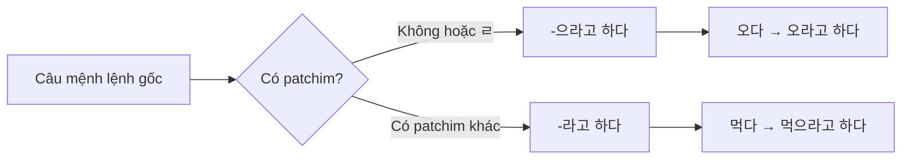
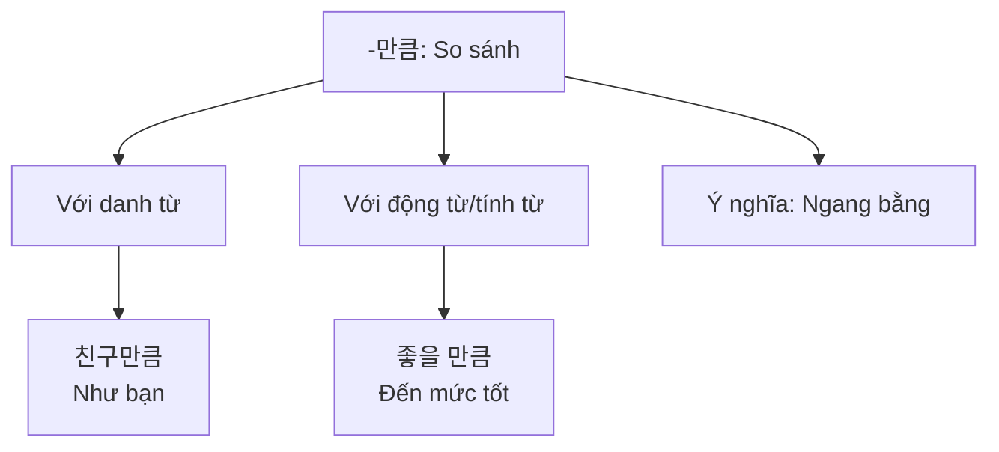
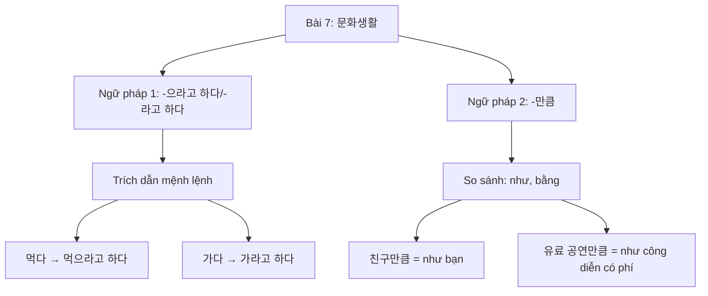

# Bài 7: 문화생활 (Văn hóa - Sinh hoạt)

## 📚 Mục tiêu học tập

Sau khi hoàn thành bài học này, bạn sẽ có khả năng:

- Nói về các hoạt động văn hóa, công diễn, triển lãm và buổi hòa nhạc
- Sử dụng các động từ ghép với **-으라고 하다** và **-라고 하다** (dạng trích dẫn mệnh lệnh)
- Sử dụng **-만큼** (so sánh: như, bằng)
- Mua vé và tìm thông tin về các sự kiện văn hóa

---

## 💬 Câu hỏi khởi động

### 1. 이 사람은 어디에서 무엇을 보고 있어요?
> *Người này đang xem gì ở đâu?*

**Hãy quan sát các hình ảnh:**

#### 🎭 Concert K-pop
- Buổi biểu diễn K-pop với nhiều người hâm mộ
- Ánh sáng sân khấu rực rỡ

#### 🖼️ Triển lãm nghệ thuật
- Nhiều bức tranh treo trên tường
- Không gian yên tĩnh để thưởng thức nghệ thuật

### 2. 여러분은 시간이 있을 때 무엇을 보러 가고 싶어요?
> *Khi có thời gian, bạn muốn đi xem gì?*

**Câu trả lời mẫu:**
- 저는 뮤지컬을 보러 가고 싶어요. (Tôi muốn đi xem nhạc kịch.)
- 저는 미술 전시회에 가고 싶어요. (Tôi muốn đi triển lãm mỹ thuật.)

---

## 📖 I. TỪ VỰNG (어휘)

### 1. Các loại công diễn và sự kiện văn hóa

| **Từ tiếng Hàn** | **Nghĩa tiếng Việt** | **Ví dụ (từ PDF)** |
|------------------|----------------------|-------------------|
| 공연 | Công diễn | 나는 '문화가 있는 날'에 전시회나 **공연**을 보러 간다. |
| 뮤지컬 | Nhạc kịch (Musical) | 이번 주말 **뮤지컬** 표를 예매하고 싶은데요. |
| 연극 | Kịch | 오늘 본 **연극** 어땠어요? |
| 연주회 | Buổi hòa nhạc, buổi biểu diễn | __ |
| 난타 | Nanta (Công diễn trống Hàn Quốc) | __ |
| 사물놀이 | Samulnori (Âm nhạc truyền thống Hàn Quốc) | __ |
| 길거리 공연 | Biểu diễn đường phố (Busking) | __ |
| 전시회 | Triển lãm | 지난달에 나는 그림 **전시회**를 보고 왔다. |
| 미술 전시회 | Triển lãm mỹ thuật | 저는 학생들의 **미술 전시회**에 가 봤어요. |
| 사진 전시회 | Triển lãm ảnh | __ |
| 공예 전시회 | Triển lãm thủ công mỹ nghệ | __ |
| 콘서트 | Buổi hòa nhạc, Concert | 이번 달 '문화가 있는 날'에는 재즈 **콘서트** 티켓을 예매했다. |
| 케이팝 콘서트 | Concert K-pop | _(Có hình ảnh trong PDF nhưng không có câu ví dụ)_ |
| 재즈 콘서트 | Concert Jazz | 이번 달 '문화가 있는 날'에는 **재즈 콘서트** 티켓을 예매했다. |
| 토크 콘서트 | Talk concert (Buổi giao lưu) | __ |

### 2. Động từ liên quan đến công diễn

| **Từ tiếng Hàn** | **Nghĩa tiếng Việt** | **Ví dụ (từ PDF)** |
|------------------|----------------------|-------------------|
| 공연 정보를 검색하다 | Tìm kiếm thông tin công diễn | **공연 정보를 검색**하다 (từ sơ đồ quy trình trang 3) |
| 표를 예매하다 | Đặt vé trước | 이번 주말 뮤지컬 **표를 예매**하고 싶은데요. |
| 예매하다 | Đặt trước | 좋은 기회라서 나는 친구들에게도 **예매**하라고 했다. |
| 티켓을 수령하다 | Nhận vé | 공연 당일 30분 전에 오셔서 **티켓을 수령**하세요. |
| 좌석을 찾다 | Tìm chỗ ngồi | **좌석을 찾**다 (từ sơ đồ quy trình trang 3) |
| 공연을 관람하다 | Xem công diễn | **공연을 관람**하다 (từ sơ đồ quy trình trang 3) |
| 입장하다 | Vào, nhập trường | 직원이 관객들에게 지금 공연장에 **입장**하라고 했어요. |
| 감상 소감을 말하다 | Nói cảm tưởng, cảm nhận | **감상 소감을 말**하다 (từ sơ đồ quy trình trang 3) |
| 기대하다 | Mong đợi | **기대**하다 (từ sơ đồ quy trình trang 3) |
| 기대되다 | Được mong đợi | 공연이 **기대**돼요. |
| 감동적이다 | Cảm động | **감동**적이다 (từ sơ đồ quy trình trang 3) |
| 인상적이다 | Ấn tượng | 어떤 장면이 가장 **인상적**이었어요? |
| 추천하다 | Giới thiệu, khuyên | 제 친구가 이 연극을 **추천**할 때 꼭 앞좌석에서 보라고 했거든요. |
| 참석하다 | Tham dự | __ |
| 헤어지다 | Chia tay, rời xa | __ |

### 3. Từ vựng liên quan đến vé và buổi biểu diễn

| **Từ tiếng Hàn** | **Nghĩa tiếng Việt** | **Ví dụ (từ PDF)** |
|------------------|----------------------|-------------------|
| 공연 시간 | Thời gian công diễn | **공연 시간**: 20**년 10월 3일 오후 3시 00분 (từ thông tin vé trang 8) |
| 공연 장소 | Địa điểm công diễn | **공연 장소**: 한강스퀘어 뮤지컬홀 (từ thông tin vé trang 8) |
| 공연 내용 | Nội dung công diễn | __ |
| 느낀 점 | Điều cảm nhận được | __ |
| 예약 번호 | Số đặt trước | __ |
| 입장권 | Vé vào cửa | __ |
| 초대권 | Vé mời | __ |
| 할인 | Giảm giá | 50% **할인**을 받았다. |
| 할인을 받다 | Được giảm giá | 50% **할인을 받았**다. |
| 좌석 | Chỗ ngồi | **좌석**은 어디로 하시겠어요? |
| 관람 연령 | Độ tuổi xem | **관람 연령**: 12세 이상 관람가 (từ thông tin vé trang 8) |
| 연령 | Tuổi, độ tuổi | 관람 **연령** (từ trang 8) |
| 관람객 | Khán giả | 직원이 **관객**들에게 지금 공연장에 입장하라고 했어요. _(Lưu ý: PDF dùng 관객)_ |
| 무료 | Miễn phí | 잘 찾아보면 **무료** 공연도 유료 공연만큼 좋은 게 많아요. |
| 유의 사항 | Lưu ý | 안내 및 **유의 사항** (từ thông tin vé trang 8) |
| 부담이 없다 | Không gánh nặng, không áp lực | 그래서 **부담 없이** 문화생활을 즐길 수 있다. |

### 4. Từ vựng bổ sung

| **Từ tiếng Hàn** | **Nghĩa tiếng Việt** | **Ví dụ (từ PDF)** |
|------------------|----------------------|-------------------|
| 안내 방송 | Thông báo hướng dẫn | __ |
| 전원을 끄다 | Tắt nguồn điện, tắt máy | __ |
| 작가 | Tác giả | 작가의 미술 전시회만큼 아주 멋있었어요. (từ trang 5) |
| 장면 | Cảnh, khung hình | 어떤 **장면**이 가장 인상적이었어요? |
| 표정 | Biểu cảm, nét mặt | 저는 배우들의 **표정**까지 다 볼 수 있어서 좋았어요. |
| 행사 | Sự kiện | 박물관에도 재미있는 **행사**가 많은데 아직 한 번도 간 적이 없기 때문이다. |
| 박물관 | Bảo tàng | 다음 달 '문화가 있는 날'에는 **박물관**에 가 보고 싶다. |
| 경험이 쌓이다 | Tích lũy kinh nghiệm | 그리고 내 **경험이 쌓이는** 것만큼 한국 생활에도 점점 익숙해지고 있는 것 같다. |
| 유창하다 | Lưu loát | 미호는 한국 사람만큼 한국어가 **유창**해요. (từ bài tập trang 4) |
| 택배 | Giao hàng tận nơi | __ |

---

## 📘 II. NGỮ PHÁP (문법)

### 1. **-으라고 하다, -라고 하다** (Trích dẫn mệnh lệnh/yêu cầu)

#### 📌 Ý nghĩa
Cấu trúc này được sử dụng để truyền đạt lại lời mệnh lệnh hoặc yêu cầu của người khác.

#### 📌 Cách sử dụng

- **-으라고 하다**: Dùng với động từ không có patchim hoặc có patchim **ㄹ**
- **-라고 하다**: Dùng với động từ có patchim (trừ **ㄹ**)

#### 📌 Bảng quy tắc

| **Động từ gốc** | **Dạng trích dẫn** |
|----------------|-------------------|
| 오다 (đến) | 오라고 하다 |
| 먹다 (ăn) | 먹으라고 하다 |
| 앉다 (ngồi) | 앉으라고 하다 |
| 가다 (đi) | 가라고 하다 |
| 살다 (sống) | 살라고 하다 |

#### 📌 Ví dụ

| **Câu trực tiếp** | **Câu trích dẫn** | **Nghĩa** |
|-------------------|-------------------|-----------|
| 한국어를 열심히 공부해요. | 한국어를 열심히 공부하라고 해요. | (Họ) bảo học tiếng Hàn chăm chỉ. |
| 친구가 케이팝 공연에 가세요. | 친구가 케이팝 공연에 가라고 했어요. | Bạn bảo đi xem concert K-pop. |
| 직원이 관객들에게 지금 공연장에 입장하세요. | 직원이 관객들에게 지금 공연장에 입장하라고 했어요. | Nhân viên bảo khán giả vào phòng công diễn ngay bây giờ. |

#### 💡 Lưu ý

- Dạng viết tắt thân mật: **-으래, -래**
  - 오라고 해요 → 오래요
  - 먹으라고 해요 → 먹으래요

#### 📋 Sơ đồ minh họa



---

### 2. **-만큼** (So sánh: như, bằng)

#### 📌 Ý nghĩa
**-만큼** được sử dụng để biểu thị mức độ so sánh, có nghĩa là "như, bằng, đến mức".

#### 📌 Cấu trúc

```
Danh từ + 만큼
Động từ/Tính từ + -(으)ㄹ 만큼
```

#### 📌 Cách sử dụng

| **Loại từ** | **Cấu trúc** | **Ví dụ** |
|------------|-------------|-----------|
| Danh từ | N + 만큼 | 친구**만큼** (như bạn) |
| Động từ/Tính từ | V/A + (으)ㄹ 만큼 | 좋**을 만큼** (đến mức tốt) |

#### 📌 Ví dụ

| **Câu** | **Nghĩa** |
|---------|-----------|
| 잘 찾아보면 무료 공연도 유료 공연**만큼** 좋은 게 많아요. | Nếu tìm kỹ thì cũng có nhiều buổi biểu diễn miễn phí hay **như** buổi biểu diễn có phí. |
| 회사 앞 식당은 고향 음식**만큼** 맛있어서 자주 간다. | Nhà hàng trước công ty ngon **như** đồ ăn quê hương nên tôi hay đến. |
| 평일은 주말**만큼** 시내에 사람이 많지 않다. | Ngày thường không đông người trong thành phố **bằng** cuối tuần. |
| 저는 이번**만큼** 무대 가까이에서 연극을 본 적이 없어요. | Tôi chưa bao giờ xem kịch gần sân khấu **như** lần này. |

#### 💡 Lưu ý

- **-만큼** dùng để so sánh mức độ tương đương
- Có thể kết hợp với các cấu trúc phủ định: ~지 않다/못하다

#### 📌 Các mẫu câu thường gặp

1. **A만큼 B하다**: B đến mức như A
   - 예: 그만큼 열심히 공부했어요. (Đã học chăm chỉ đến mức đó.)

2. **A는 B만큼 ~지 않다**: A không ... bằng B
   - 예: 오늘은 어제만큼 춥지 않아요. (Hôm nay không lạnh bằng hôm qua.)

#### 📋 So sánh các cấu trúc tương tự

| Ngữ pháp | Ý nghĩa | Ví dụ |
|---------|---------|-------|
| **-만큼** | Như, bằng (so sánh ngang bằng) | 친구**만큼** 키가 크다 |
| **-보다** | Hơn (so sánh cao hơn) | 친구**보다** 키가 크다 |
| **-처럼** | Như, giống như (so sánh cách thức) | 친구**처럼** 행동하다 |

#### 📋 Sơ đồ minh họa



---

## 🗣️ III. HỘI THOẠI (말하기)

### 🎭 Hội thoại 1: Nói về công diễn đã xem

**라민**: 오늘 본 연극 어땠어요?

**아나이스**: 저는 계속 웃다가 울다가 했어요.

**라민**: 어떤 장면이 가장 인상적이었어요?

**아나이스**: 제일 마지막에 배우들이 모두 같이 춤추는 장면이 기억에 남아요.

**라민**: 저는 배우들의 표정까지 다 볼 수 있어서 좋았어요.

**아나이스**: 맞아요, 저도 이번만큼 무대 가까이에서 연극을 본 적이 없어요.

**라민**: 제 친구가 이 연극을 추천할 때 꼭 앞좌석에서 보라고 했거든요.

**아나이스**: 앞좌석은 정말 좋은 선택이었어요. 우리 또 공연 같이 봐요.

---

**Dịch:**

**Ramin**: Vở kịch hôm nay xem thế nào?

**Anaïs**: Tôi cứ cười rồi lại khóc liên tục.

**Ramin**: Cảnh nào ấn tượng nhất?

**Anaïs**: Cảnh cuối cùng khi tất cả diễn viên cùng nhảy rất đáng nhớ.

**Ramin**: Tôi thích vì có thể nhìn rõ cả biểu cảm của diễn viên.

**Anaïs**: Đúng vậy, tôi chưa bao giờ xem kịch gần sân khấu như lần này.

**Ramin**: Bạn tôi đã khuyên khi xem vở kịch này nhất định phải ngồi ghế trước.

**Anaïs**: Ghế trước quả là lựa chọn tốt. Chúng ta cùng xem công diễn lần nữa nhé.

---

### 🎫 Hội thoại 2: Đặt vé xem công diễn

**직원**: 안녕하세요. 무엇을 도와드릴까요?

**후엔**: 이번 주말 뮤지컬 표를 예매하고 싶은데요.

**직원**: 토요일과 일요일 중 언제가 좋으세요?

**후엔**: 토요일 오후 공연으로 두 장 주세요.

**직원**: 좌석은 어디로 하시겠어요?

**후엔**: 친구가 앞좌석에서 보라고 했는데 앞자리 있어요?

**직원**: 네, 앞자리도 있습니다. 5열 6번, 7번 어떠세요?

**후엔**: 좋아요. 그걸로 주세요.

**직원**: 예매하셨습니다. 공연 당일 30분 전에 오셔서 티켓을 수령하세요.

---

**Dịch:**

**Nhân viên**: Xin chào. Tôi có thể giúp gì cho bạn?

**Huyền**: Tôi muốn đặt vé xem nhạc kịch cuối tuần này.

**Nhân viên**: Bạn muốn xem thứ Bảy hay Chủ Nhật?

**Huyền**: Cho tôi hai vé buổi chiều thứ Bảy.

**Nhân viên**: Chỗ ngồi bạn muốn ở đâu?

**Huyền**: Bạn tôi bảo xem ở ghế trước, có chỗ trước không?

**Nhân viên**: Vâng, có ghế trước. Hàng 5 số 6, 7 thế nào?

**Huyền**: Tốt. Cho tôi vé đó.

**Nhân viên**: Đã đặt xong. Ngày diễn vui lòng đến trước 30 phút để nhận vé.

---

## 👂 Phần 4: Luyện nghe (듣기)

### 📻 Bài nghe 1: 여러분은 공연에 친구를 초대하거나 초대받을 때 보통 무슨 이야기를 합니까?

**Câu hỏi khởi động:**

1. **여러분은 공연에 친구를 초대하거나 초대받을 때 보통 무슨 이야기를 합니까?**
   > *Khi mời bạn đi xem công diễn hoặc được mời, bạn thường nói chuyện gì?*

**Hình ảnh minh họa:**
- Một người đang gọi điện mời bạn đi xem công diễn
- Người kia đang cân nhắc và trả lời

**Câu trả lời mẫu:**
- 초대해 줘서 고마워요. (Cảm ơn vì đã mời.)
- 공연이 기대돼요. (Tôi mong chờ buổi công diễn.)

---

### 🎧 Bài nghe 2: 고천 씨와 후엔 씨가 공연에 대해 이야기합니다

**Nghe và trả lời các câu hỏi sau:**

#### Câu hỏi 1: 두 사람은 무슨 공연을 보려고 합니까?

**📝 Ghi chú:**
- Hãy viết câu trả lời của bạn vào đây
- ___________________________________________

#### Câu hỏi 2: 듣은 내용과 같으면 O, 다르면 X 하세요.

| Câu | Nội dung | Đáp án |
|-----|---------|--------|
| ① | 후엔 씨가 고천 씨를 공연에 초대했다.<br/>*Huyền đã mời Go-cheon đi xem công diễn.* | ( ) |
| ② | 고천 씨는 친구에게 공연에 올 수 있냐고 물어볼 것이다.<br/>*Go-cheon sẽ hỏi bạn xem có thể đến xem công diễn không.* | ( ) |
| ③ | 고천 씨는 이 공연을 본 적이 있다.<br/>*Go-cheon đã từng xem công diễn này.* | ( ) |

---

### 🗣️ Phần phát âm (발음)

#### 📌 Quy tắc phát âm: [ㄱ, ㄷ, ㅂ] + [ㄱ, ㄷ, ㅂ, ㅅ, ㅈ]

Khi các âm cuối **ㄱ, ㄷ, ㅂ** gặp các âm đầu **ㄱ, ㄷ, ㅂ, ㅅ, ㅈ**, chúng sẽ được phát âm thành **[ㄲ, ㄸ, ㅃ, ㅆ, ㅉ]** (âm căng).

**Quy tắc:**

```
[ㄱ, ㄷ, ㅂ] + [ㄱ, ㄷ, ㅂ, ㅅ, ㅈ] → [ㄲ, ㄸ, ㅃ, ㅆ, ㅉ]
```

**Ví dụ minh họa:**

| Từ | Cách viết | Phát âm | Nghĩa |
|----|----------|---------|-------|
| 입장권 | 입 + 장권 | [입**짱**권] | Vé vào cửa |
| 앞좌석 | 앞 + 좌석 | [압**쪼**석] | Ghế trước |
| 택배 | 택 + 배 | [택**빼**] | Giao hàng tận nơi |

**Câu ví dụ đầy đủ:**

💬 **다음을 듣고 따라 읽으세요.**
> *Nghe và đọc theo.*

1. **공연 입장권을 보여 주세요.** [공연 입**짱**꾀늘 보여 주세요]
   > *Vui lòng xuất trình vé vào cửa công diễn.*

2. **앞좌석에 없어 있어요.** [압**쪼**서게 없써 있어요]
   > *Ngồi ở ghế trước.*

3. **부모님은 고향이 좋다고 하세요.** [부모니믄 고향이 조**타**고 하세요]
   > *Bố mẹ nói rằng thích quê hương.*

---

## ✍️ IV. BÀI TẬP (연습)

### Bài tập 1: Chuyển đổi câu trực tiếp sang trích dẫn

Hãy chuyển các câu mệnh lệnh sau sang dạng trích dẫn với **-으라고 하다/-라고 하다**.

1. 엄마가 "방을 청소해." → 엄마가 방을 청소**하라고 했어요**.
2. 선생님이 "숙제를 내일까지 내." → 선생님이 숙제를 내일까지 **내라고 했어요**.
3. 친구가 "같이 영화 보러 가자." → 친구가 같이 영화 보러 **가자고 했어요**.
4. 아버지가 "일찍 집에 와." → 아버지가 일찍 집에 **오라고 했어요**.

---

### Bài tập 2: Điền vào chỗ trống với **-만큼**

Sử dụng từ vựng cho sẵn để hoàn thành câu với cấu trúc **-만큼**.

| **보기** | 안젤라 | 노래를 잘하다 | 가수 |
|---------|-------|-------------|------|

→ 안젤라는 가수**만큼** 노래를 잘해요.

1) **하늘이** / **교통이 복잡하다** / **서울**
   → 하늘이는 서울**만큼** 교통이 복잡해요.

2) **기말시험** / **성적이 좋다** / **중간시험**
   → 기말시험은 중간시험**만큼** 성적이 좋아요.

3) **미호** / **한국어가 유창하다** / **한국 사람**
   → 미호는 한국 사람**만큼** 한국어가 유창해요.

4) **떡볶이** / **자주 먹다** / **라면**
   → 떡볶이를 라면**만큼** 자주 먹어요.

---

### Bài tập 3: Trả lời câu hỏi

Hãy trả lời các câu hỏi sau về công diễn hoặc triển lãm bạn đã xem.

1. **무료로 볼 수 있는 공연이 뭐예요?**
   → (Trả lời tự do)

2. **금요일 저녁에 시간이 나면 어디에 가면 좋을까요?**
   → (Trả lời tự do)

3. **그림 전시회 티켓을 할인 받으려면 몇 시에 가야 해요?**
   → (Trả lời tự do)

4. **서울숲에서는 어떤 공연을 해요? 그 공연을 언제 볼 수 있어요?**
   → (Trả lời tự do)

---

## 📝 V. ĐỌC HIỂU (읽기)

### 📰 Bài đọc 1: Thông tin vé công diễn

#### 🎫 뮤지컬 폿솔 그대에게 초대권

**공연 시간**: 20**년 10월 3일 오후 3시 00분

**공연 장소**: 한강스퀘어 뮤지컬홀
- ① VIP석 1층 3열 12
- ② 12세 이상 관람가

**※ 안내 및 유의 사항**

티켓의 환불은 하루 전까지 인터넷으로 가능하며 당일에는 변경이나 취소가 되지 않습니다.

또한 무료 및 ④ _________ 티켓의 환불은 불가능합니다.

---

#### ❓ Câu hỏi hiểu bài

**Chọn từ phù hợp điền vào ô trống:**

| 보기 | 예약 번호 | 할인 | 좌석 | 관람 연령 |
|------|----------|-----|------|----------|

**Đáp án:** ④ 할인 (giảm giá)

---

### 📰 Bài đọc 2: Thông tin về triển lãm và công diễn

#### 🎬 1. 글요 시네마

**매달 마지막 주 금요일**에

**별별박골을 간다**에서

**"심심한 후 우표를 훑어 보세요."**

**기간**: 1. 1.~12. 31.
**시간**: 저녁 6시 30분
**장소**: 별별박골관 강당
**관람료**: 무료

**문의**: 별별박골관 (02-4321-1234)

---

#### 🎨 2. 고흐展(전)

"극적인 대비와 색채의 반향효과 작품을 감상해 보세요!"

**오후 4시 이후 입장 시에는 관람료가 20% 할인됩니다.**

**일시**: 9. 1.~9. 30.(입장 마감: 오후 5시)
**장소**: 아트갤러리
**관람료**: 25,000원

**※ 유의 사항**
미술관 내에서 사진 촬영 불가능

---

#### 🎭 3. 서울거리예술제

**K-pop 댄스, 마술, 서커스 등 다양한 무료 공연을 볼 수 있습니다.**

**기간**: 4. 1.~5. 30.
**시간**: 매주 토요일 오후 1시
**장소**: 서울숲 공연장
**관람료**: 무료

**문의**: 서울거리예술제 홈페이지 www.seoulart.co.kr

---

#### ❓ Câu hỏi hiểu bài

**1) 무료로 볼 수 있는 공연이 뭐예요?**
> *Công diễn nào có thể xem miễn phí?*

**Đáp án:** 글요 시네마, 서울거리예술제

**2) 금요일 저녁에 시간이 나면 어디에 가면 좋을까요?**
> *Nếu tối thứ Sáu có thời gian thì nên đi đâu?*

**Đáp án:** 글요 시네마 (별별박골관)

**3) 그림 전시회 티켓을 할인 받으려면 몇 시에 가야 해요?**
> *Muốn được giảm giá vé triển lãm tranh thì phải đi lúc mấy giờ?*

**Đáp án:** 오후 4시 이후 (Sau 4 giờ chiều)

**4) 서울숲에서는 어떤 공연을 해요? 그 공연을 언제 볼 수 있어요?**
> *Ở Seoul Forest có công diễn gì? Khi nào có thể xem công diễn đó?*

**Đáp án:** K-pop 댄스, 마술, 서커스 등 / 매주 토요일 오후 1시 (K-pop dance, ảo thuật, xiếc / Chiều thứ Bảy hàng tuần lúc 1 giờ)

---

### 📰 Bài đọc 3: "Văn hóa có ngày"

**문화가 있는 날**

나는 '문화가 있는 날'에 전시회나 공연을 보러 간다. '문화가 있는 날'은 매월 마지막 주 수요일이다. 이날은 보통 때보다 싼 가격이나 무료로 문화생활을 할 수 있다. 그래서 부담 없이 문화생활을 즐길 수 있다.

지난달에 나는 그림 전시회를 보고 왔다. 나는 그림을 잘 그리지는 못하지만 보는 것을 좋아한다. 그림을 보고 있으면 기분이 좋아진다. 이번 달 '문화가 있는 날'에는 재즈(Jazz) 콘서트 티켓을 예매했다. 50% 할인을 받았다. 좋은 기회라서 나는 친구들에게도 예매하라고 했다.

다음 달 '문화가 있는 날'에는 박물관에 가 보고 싶다. 박물관에도 재미있는 행사가 많은데 아직 한 번도 간 적이 없기 때문이다. 이렇게 새로운 문화생활을 하면 좋은 경험이 된다. 그리고 내 경험이 쌓이는 것만큼 한국 생활에도 점점 익숙해지고 있는 것 같다.

---

**Dịch:**

Tôi đi xem triển lãm hoặc công diễn vào "Ngày có Văn hóa". "Ngày có Văn hóa" là thứ Tư tuần cuối cùng của mỗi tháng. Vào ngày này, có thể tham gia sinh hoạt văn hóa với giá rẻ hơn bình thường hoặc miễn phí. Vì vậy, có thể tận hưởng văn hóa sinh hoạt một cách thoải mái.

Tháng trước, tôi đã đi xem triển lãm tranh. Tôi không vẽ giỏi nhưng thích xem. Khi xem tranh, tâm trạng tôi trở nên vui vẻ. "Ngày có Văn hóa" tháng này, tôi đã đặt vé concert Jazz. Tôi được giảm giá 50%. Vì là cơ hội tốt nên tôi cũng bảo bạn bè đặt vé.

"Ngày có Văn hóa" tháng sau, tôi muốn đi bảo tàng. Vì bảo tàng cũng có nhiều sự kiện thú vị nhưng tôi chưa từng đi lần nào. Tham gia các hoạt động văn hóa mới như thế này là trải nghiệm tốt. Và tôi cảm thấy càng quen với cuộc sống Hàn Quốc nhiều như kinh nghiệm của tôi tích lũy.

**1) 윗글의 내용과 같으면 O, 다르면 X 하세요.**

① 나는 이번 달에 그림 전시회에 갈 것이다. ( X )
② 재즈 콘서트 티켓은 무료이다. ( X )
③ 나는 박물관에 다녀온 적이 있다. ( X )
④ 문화생활 경험은 한국 생활에 도움이 된다. ( O )

**2) '문화가 있는 날'에 전시회나 공연을 보면 좋은 점이 무엇입니까?**

→ **부담이 없다 / 할인을 받다 / 행사 / 박물관 / 경험이 쌓이다**

---

## 📚 VI. VĂN HÓA VÀ THÔNG TIN (문화와 정보)

### 🎭 Cách tìm thông tin công diễn

Có nhiều cách để tìm kiếm thông tin về văn hóa sinh hoạt tại Hàn Quốc. Phương pháp phổ biến nhất là tìm kiếm thông tin về công diễn trực tuyến hoặc qua trang web bán vé. Gần đây, việc tìm thông tin về công diễn ngay cả tại trang web **문화포털 (Culture Portal)** (www.culture.go.kr) cũng trở nên phổ biến.

'**문화포털**' không chỉ cung cấp thông tin về các loại công diễn như kịch, ca nhạc, triển lãm mà còn giới thiệu cả các thông tin về văn hóa quốc gia và văn hóa địa phương. Trang web cung cấp thông tin chi tiết để có thể chọn công diễn phù hợp khi muốn xem công diễn nào đó. Ngoài ra, bạn cũng có thể tìm thông tin văn hóa dễ dàng hơn thông qua trang portal này.

---

### ❓ Ba câu hỏi quan trọng khi tìm công diễn:

1. **'문화포털'에서는 어떤 정보를 제공합니까?**
   → Cung cấp thông tin về công diễn, triển lãm, văn hóa quốc gia và địa phương.

2. **'문화포털'에서 공연 후기를 보면 어떤 점에서 도움이 됩니까?**
   → Giúp chọn công diễn phù hợp hơn.

3. **여러분은 어떤 방법으로 문화 정보를 찾습니까?**
   → (Trả lời tự do của người học)

---

## 🎯 VII. LUYỆN TẬP TỔNG HỢP (쓰기)

### ✍️ Bài tập viết 1: 여러분은 공연이나 콘서트, 전시회를 좋아합니까?

**지금까지 본 것 중에서 가장 기억에 남는 것이 무엇입니까? 간단히 메모해 보세요.**

| Nội dung | Ghi chú |
|----------|---------|
| **공연 이름**<br/>Tên công diễn | _____________________________________________________________________  |
| **공연 장소**<br/>Địa điểm công diễn | _____________________________________________________________________ |
| **공연 내용**<br/>Nội dung công diễn | _____________________________________________________________________ <br/> _____________________________________________________________________ <br/> _____________________________________________________________________ |
| **느낀 점**<br/>Điều cảm nhận | _____________________________________________________________________ <br/> _____________________________________________________________________ <br/> _____________________________________________________________________ <br/> _____________________________________________________________________ |

---

### ✍️ Bài tập viết 2: 여러분의 공연 감상 이야기를 써 보세요

**Hãy viết một đoạn văn (7-10 câu) kể về trải nghiệm xem công diễn của bạn.**

**Gợi ý từ vựng:**
- 인상적이다 (ấn tượng)
- 감동적이다 (cảm động)
- 기대하다 (mong đợi)
- 관람하다 (xem, quan sát)
- 추천하다 (giới thiệu, khuyên)
- 장면 (cảnh, khung hình)
- 표정 (biểu cảm)
- 예매하다 (đặt vé trước)
- 할인을 받다 (được giảm giá)

**Dòng để viết:**

_______________________________________________________________________________

_______________________________________________________________________________

_______________________________________________________________________________

_______________________________________________________________________________

_______________________________________________________________________________

_______________________________________________________________________________

_______________________________________________________________________________

_______________________________________________________________________________

_______________________________________________________________________________

_______________________________________________________________________________

---

## 🔑 VIII. TÓM TẮT VÀ ĐIỂM NHẤN

### 📌 Ngữ pháp chính



### 🎯 Từ vựng trọng tâm

- **공연, 전시회, 콘서트**: Công diễn, triển lãm, concert
- **검색하다, 예매하다, 수령하다, 관람하다**: Tìm kiếm, đặt trước, nhận, xem
- **인상적이다, 감동적이다**: Ấn tượng, cảm động

### 💬 Mẫu câu giao tiếp hữu ích

1. **공연이 기대돼요.** → Tôi mong chờ buổi công diễn.
2. **초대해 줘서 고마워요.** → Cảm ơn vì đã mời.
3. **표를 예매하라고 했어요.** → (Họ) bảo đặt vé trước.

---

## 📋 IX. BẢNG TỔNG HỢP TỪ VỰNG (배운 어휘 확인)

### 배운 어휘 확인 - CHECK LIST ✓

**Hãy đánh dấu ✓ vào các từ vựng bạn đã học:**

| ☐ | Từ vựng | Nghĩa | ☐ | Từ vựng | Nghĩa |
|---|---------|-------|---|---------|-------|
| ☐ | 공연 | Công diễn | ☐ | 인상적이다 | Ấn tượng |
| ☐ | 뮤지컬 | Nhạc kịch | ☐ | 안내 방송 | Thông báo hướng dẫn |
| ☐ | 연극 | Kịch | ☐ | 전원을 끄다 | Tắt nguồn |
| ☐ | 연주회 | Buổi hòa nhạc | ☐ | 작가 | Tác giả |
| ☐ | 난타 | Nanta | ☐ | 택배 | Giao hàng |
| ☐ | 사물놀이 | Samulnori | ☐ | 유창하다 | Lưu loát |
| ☐ | 길거리 공연 | Biểu diễn đường phố (Busking) | ☐ | 장면 | Cảnh |
| ☐ | 전시회 | Triển lãm | ☐ | 표정 | Biểu cảm |
| ☐ | 미술 | Mỹ thuật | ☐ | 표정 | Biểu cảm |
| ☐ | 사진 | Ảnh | ☐ | 해어지다 | Chia tay |
| ☐ | 공예 | Thủ công mỹ nghệ | ☐ | 초대권 | Vé mời |
| ☐ | 콘서트 | Concert | ☐ | 예약 번호 | Số đặt trước |
| ☐ | 케이팝(K-pop) | K-pop | ☐ | 무료 | Miễn phí |
| ☐ | 재즈(Jazz) 콘서트 | Concert Jazz | ☐ | 부담이 없다 | Không gánh nặng |
| ☐ | 토크 콘서트 | Talk concert | ☐ | 할인을 받다 | Được giảm giá |
| ☐ | 정보를 검색하다 | Tìm kiếm thông tin | ☐ | 경험이 쌓이다 | Tích lũy kinh nghiệm |
| ☐ | 예매하다 | Đặt trước | ☐ | 박물관 | Bảo tàng |
| ☐ | 수령하다 | Nhận | ☐ | 행사 | Sự kiện |
| ☐ | 관람하다 | Xem, quan sát | ☐ | 관람객 | Khán giả |
| ☐ | 입장하다 | Vào, nhập trường | ☐ | 연령 | Tuổi |
| ☐ | 추천하다 | Giới thiệu, khuyên | ☐ | 유의 사항 | Lưu ý |
| ☐ | 참석하다 | Tham dự | ☐ | 입장권 | Vé vào cửa |
| ☐ | 기대하다 | Mong đợi | ☐ | 좌석 | Chỗ ngồi |
| ☐ | 기대되다 | Được mong đợi | ☐ | 할인 | Giảm giá |
| ☐ | 감동적이다 | Cảm động | ☐ | | |

---

**🎓 Chúc các bạn học tốt!**