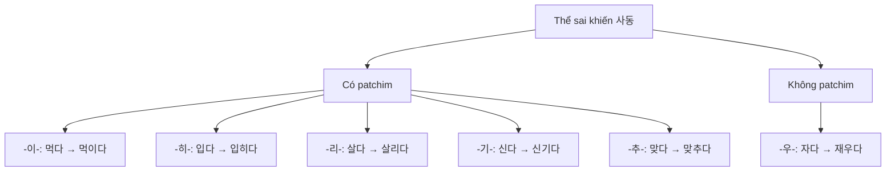
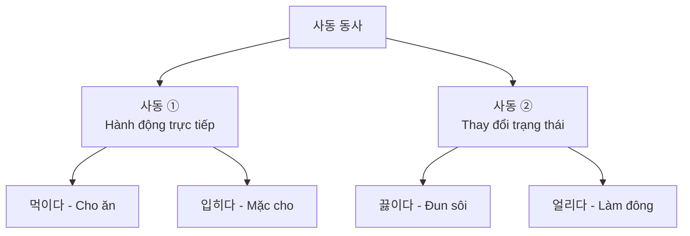
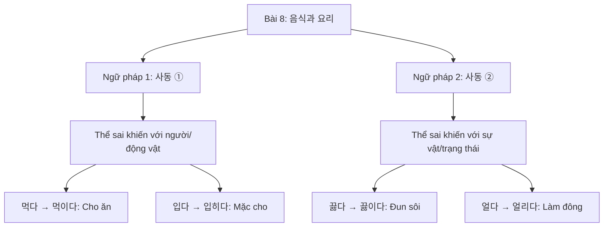

# Bài 8: 음식과 요리 (Ẩm thực và Nấu ăn)

## 📚 Mục tiêu học tập

Sau khi hoàn thành bài học này, bạn sẽ có khả năng:

- Nói về các loại gia vị và phương pháp nấu ăn
- Sử dụng cấu trúc **사동 (Thể sai khiến)** để diễn đạt hành động khiến người khác làm việc gì
- Mô tả quy trình nấu ăn và cách chế biến món ăn
- Hiểu về hạn sử dụng thực phẩm tại Hàn Quốc

---

## 🎯 Câu hỏi khởi động

### 1. 무슨 양념이에요? 맛이 어때요?
**Đây là gia vị gì? Vị như thế nào?**

- **고추장** (Tương ớt Hàn Quốc)
- **간장** (Nước tương)
- **된장** (Tương đậu)
- **참기름** (Dầu mè)
- **식초** (Giấm)
- **고춧가루** (Bột ớt)
- **깨** (Mè)
- **후추** (Hạt tiêu)

### 2. 무슨 요리를 해요? 요리 준비를 어떻게 해요?
**Làm món gì? Chuẩn bị nguyên liệu như thế nào?**

#### Các hành động chuẩn bị và nấu ăn:

- **당근을 씻다** - Rửa cà rốt
- **양파 껍질을 벗기다** - Bóc vỏ hành tây
- **감자를 칼로 썰다** - Thái khoai tây bằng dao
- **마늘을 다지다** - Băm tỏi
- **물을 끓이다** - Đun sôi nước
- **기름에 튀기다** - Rán (chiên) trong dầu
- **만두를 찌다** - Hấp bánh bao
- **계란을 삶다** - Luộc trứng
- **밥을 볶다** - Xào cơm
- **나물을 무치다** - Trộn rau
- **고기를 굽다** - Nướng thịt
- **시금치를 데치다** - Chần rau bina

---

## 📖 I. TỪ VỰNG (어휘)

### 1. Gia vị và nguyên liệu nấu ăn (양념과 재료)

#### A. Gia vị (양념)

| **Từ tiếng Hàn** | **Nghĩa tiếng Việt** | **Ví dụ** |
|------------------|----------------------|-----------|
| 고추장 | Tương ớt Hàn Quốc | 고추장, 사과 식초, 다진 마늘, 참기름 (Tương ớt, giấm táo, tỏi băm, dầu mè) |
| 간장 | Nước tương | 양념(설탕, 간장, 고춧가루)을 넣고 볶다가 김치를 넣고 볶는다 (Cho gia vị (đường, nước tương, bột ớt) vào xào rồi cho kimchi vào xào) |
| 된장 | Tương đậu | |
| 참기름 | Dầu mè | 참기름, 깨를 뿌린다 (Rắc dầu mè, mè) |
| 식초 | Giấm | |
| 고춧가루 | Bột ớt | 양념(설탕, 간장, 고춧가루)을 넣고 볶다가 김치를 넣고 볶는다 (Cho gia vị (đường, nước tương, bột ớt) vào xào rồi cho kimchi vào xào) |
| 깨 | Mè | 참기름, 깨를 뿌린다 (Rắc dầu mè, mè) |
| 후추 | Hạt tiêu | |
| 설탕 | Đường | 양념(설탕, 간장, 고춧가루)을 넣고 볶다가 김치를 넣고 볶는다 (Cho gia vị (đường, nước tương, bột ớt) vào xào rồi cho kimchi vào xào) |
| 식용유 | Dầu ăn | 프라이팬에 식용유를 두르고 돼지고기를 먼저 볶는다 (Đổ dầu vào chảo rồi xào thịt heo trước) |

#### B. Nguyên liệu (재료)

| **Từ tiếng Hàn** | **Nghĩa tiếng Việt** | **Ví dụ** |
|------------------|----------------------|-----------|
| 당근 | Cà rốt | 양파, 당근은 작게 각각 썬다 (Hành tây, cà rốt thái nhỏ từng loại riêng) |
| 양파 | Hành tây | 돼지고기를 볶은 후 양파, 당근을 넣고 볶는다 (Sau khi xào thịt heo, cho hành tây, cà rốt vào xào) |
| 감자 | Khoai tây | |
| 마늘 | Tỏi | 김치, 양파, 참기름, 설탕, 부침 가루 (Kimchi, hành tây, dầu mè, đường, bột chiên) |
| 만두 | Bánh bao | |
| 계란 | Trứng | 김치, 밥, 계란, 양파, 당근, 돼지고기 (Kimchi, cơm, trứng, hành tây, cà rốt, thịt heo) |
| 나물 | Rau luộc trộn | |
| 고기 | Thịt | 남은 고기는 어떻게 할까요? (Thịt còn lại thì làm thế nào?) |
| 시금치 | Rau bina | |
| 돼지고기 | Thịt heo | 프라이팬에 식용유를 두르고 돼지고기를 먼저 볶는다 (Đổ dầu vào chảo rồi xào thịt heo trước) |
| 채소 | Rau củ | 먼저 밥에 물을 넣고 끓인 다음 채소를 썰어 넣고 끓여요 (Trước tiên cho nước vào cơm rồi đun sôi, sau đó thái rau bỏ vào đun tiếp) |
| 밥 | Cơm | 2~3분 뒤 밥을 넣고 볶으면서 간을 맞춘다 (Sau 2~3 phút cho cơm vào xào và nêm nếm) |
| 계란프라이 | Trứng chiên/ốp la | 완성된 볶음밥을 접시에 담고 계란프라이를 부쳐서 밥 위에 올린다 (Cho cơm rang đã hoàn thành vào đĩa, chiên trứng ốp la rồi đặt lên trên cơm) |

#### C. Dụng cụ nấu ăn (조리 도구)

| **Từ tiếng Hàn** | **Nghĩa tiếng Việt** | **Ví dụ** |
|------------------|----------------------|-----------|
| 프라이팬 | Chảo | 프라이팬에 식용유를 두르고 돼지고기를 먼저 볶는다 (Đổ dầu vào chảo rồi xào thịt heo trước) |
| 냄비 | Nồi | |
| 칼 | Dao | |

### 2. Động từ nấu ăn và chuẩn bị nguyên liệu (요리 동사)

| **Từ tiếng Hàn** | **Nghĩa tiếng Việt** | **Ví dụ** |
|------------------|----------------------|-----------|
| 당근을 씻다 | Rửa cà rốt | |
| 양파 껍질을 벗기다 | Bóc vỏ hành tây | 제이슨은 씨가 양파 껍질을 벗겼요 (Jason đã bóc vỏ hành tây) |
| 감자를 칼로 썰다 | Thái khoai tây bằng dao | |
| 마늘을 다지다 | Băm tỏi | |
| 물을 끓이다 | Đun sôi nước | |
| 기름에 튀기다 | Rán (chiên) trong dầu | |
| 만두를 찌다 | Hấp bánh bao | |
| 계란을 삶다 | Luộc trứng | |
| 밥을 볶다 | Xào cơm | 저는 채소로 볶음밥을 만들어서 아이한테 먹여요 (Tôi làm cơm rang rau và cho bé ăn) |
| 나물을 무치다 | Trộn rau | |
| 고기를 굽다 | Nướng thịt | |
| 시금치를 데치다 | Chần rau bina | |

### 3. Phương pháp nấu ăn (조리 방법)

| **Từ tiếng Hàn** | **Nghĩa tiếng Việt** | **Ví dụ** |
|------------------|----------------------|-----------|
| 뿌리다 | Rắc, rưới | 참기름, 깨를 뿌린다 (Rắc dầu mè, mè) |
| 썰다 | Cắt, thái | 양파, 당근은 작게 각각 썬다 (Hành tây, cà rốt thái nhỏ từng loại riêng) |
| 절이다 | Muối, ngâm muối | |
| 담다 | Đựng (vào bát/đĩa) | 완성된 볶음밥을 접시에 담고 (Cho cơm rang đã hoàn thành vào đĩa) |
| 맞추다 | Nêm nếm, điều chỉnh vị | 2~3분 뒤 밥을 넣고 볶으면서 간을 맞춘다 (Sau 2~3 phút cho cơm vào xào và nêm nếm) |
| 간을 맞추다 | Điều chỉnh vị | 2~3분 뒤 밥을 넣고 볶으면서 간을 맞춘다 (Sau 2~3 phút cho cơm vào xào và nêm nếm) |
| 양을 맞추다 | Điều chỉnh lượng | 채소의 양에 맞춰 김치는 먹기 좋은 크기로 썬다 (Kimchi cắt vừa miếng ăn theo lượng rau) |
| 시간을 맞추다 | Điều chỉnh thời gian | |
| 두르다 | Phết (dầu vào chảo) | 프라이팬에 식용유를 두르고 돼지고기를 먼저 볶는다 (Đổ dầu vào chảo rồi xào thịt heo trước) |
| 익다 | Chín | 채소가 익을 때까지 끓이면 돼요 (Đun đến khi rau chín là được) |
| 익히다 | Làm chín | |
| 섞다 | Trộn, trộn lẫn | |

### 4. Các loại món ăn và nhà hàng (음식과 식당)

| **Từ tiếng Hàn** | **Nghĩa tiếng Việt** | **Ví dụ** |
|------------------|----------------------|-----------|
| 뷔페 | Buffet | |
| 한정식집 | Nhà hàng món Hàn truyền thống | Bữa ăn theo bộ |
| 중국집 | Nhà hàng Trung Quốc | |
| 분식집 | Quán đồ ăn nhẹ | Kimbap, tteokbokki... |
| 김치볶음밥 | Cơm rang kimchi | 누구나 좋아하는 '김치볶음밥'을 만들어 봅시다 (Hãy cùng làm món 'cơm rang kimchi' mà ai cũng thích) |

### 5. Từ vựng bổ sung

| **Từ tiếng Hàn** | **Nghĩa tiếng Việt** | **Ví dụ** |
|------------------|----------------------|-----------|
| 죽 | Cháo | |
| 야채죽 | Cháo rau | 소화가 잘 되는 야채죽은 어때요? (Cháo rau dễ tiêu thì sao?) |
| 이유식 | Đồ ăn dặm | |
| 환자 | Bệnh nhân | |
| 믹서기 | Máy xay sinh tố | |
| 냉동실 | Ngăn đông | 냉동실에 넣어서 얼리세요 (Bỏ vào ngăn đông để làm đông lạnh) |
| 토끼 | Thỏ | 성민은 토끼한테 당근을 먹이고 있어요 (Seongmin đang cho thỏ ăn cà rốt) |
| 유모차 | Xe đẩy em bé | |

---

## 📘 II. NGỮ PHÁP (문법)

### 1. **사동 ① (Thể sai khiến loại 1)**

#### 📌 Ý nghĩa
Thể sai khiến được sử dụng khi chủ ngữ khiến hoặc giúp người khác thực hiện một hành động nào đó.

#### 📌 Cấu trúc

Thêm các hậu tố sau vào động từ gốc:

- **-이-**: Dùng với động từ có patchim (trừ ㄹ)
- **-히-**: Dùng với động từ có patchim cuối ㅂ, ㄷ, ㅈ
- **-리-**: Dùng với động từ kết thúc bằng ㄹ
- **-기-**: Dùng với động từ có patchim cuối ㄱ
- **-우-**: Dùng với động từ không có patchim
- **-추-**: Dùng với động từ có patchim cuối ㅁ, ㄴ

#### 📌 Bảng quy tắc và ví dụ

| **Hậu tố** | **Động từ gốc** | **Dạng sai khiến** | **Nghĩa** |
|-----------|----------------|-------------------|-----------|
| **-이-** | 먹다 (ăn) | 먹**이**다 | Cho ăn |
| **-히-** | 입다 (mặc) | 입**히**다 | Mặc cho (ai đó) |
| **-히-** | 밝다 (sáng) | 밝**히**다 | Làm sáng, làm rõ |
| **-리-** | 살다 (sống) | 살**리**다 | Cứu sống |
| **-기-** | 신다 (đi giày) | 신**기**다 | Đi giày cho (ai đó) |
| **-우-** | 자다 (ngủ) | 재**우**다 | Ru ngủ |
| **-우-** | 타다 (cháy, đi) | 태**우**다 | Đốt, chở (cho ai đi) |
| **-추-** | 맞다 (khớp) | 맞**추**다 | Cho khớp, điều chỉnh |
| **Đặc biệt** | 맡다 (gửi) | 맡**기**다 | Gửi, ủy thác |

#### 📌 Ví dụ hội thoại

**보기** (Ví dụ):

**가**: 아기랑 같이 산책하러 갈까요?
**나**: 네. 날씨가 조금 추우니까 옷을 따뜻하게 **입히세요**.

- 겨울 코트는 세탁소에 **맡기세요**.
- 저는 아이를 자동차 뒷자리에 **태워요**.

**Dịch:**

**A**: Đi dạo cùng bé nhé?
**B**: Vâng. Thời tiết hơi lạnh nên hãy mặc ấm cho bé.

- Hãy gửi áo khoác mùa đông đến tiệm giặt.
- Tôi cho con ngồi vào ghế sau ô tô.

#### 📌 Ví dụ trong câu

| **Câu** | **Nghĩa** |
|---------|-----------|
| 아기가 추우니까 옷을 따뜻하게 **입히세요**. | Vì bé lạnh nên hãy mặc ấm cho bé. |
| 저는 아이를 자동차 뒷자리에 **태웠어요**. | Tôi đã cho bé ngồi vào ghế sau ô tô. |
| 겨울 코트를 세탁소에 **맡기세요**. | Hãy gửi áo khoác mùa đông đến tiệm giặt. |

#### 💡 Lưu ý

- Không phải tất cả động từ đều có dạng sai khiến
- Một số động từ có nghĩa hoàn toàn khác khi chuyển sang dạng sai khiến:
  - 보다 (xem) → 보이다 (được nhìn thấy, trông thấy)
  - 들다 (nghe) → 들리다 (được nghe thấy)

#### 📋 Sơ đồ minh họa

---

### 2. **사동 ② (Thể sai khiến loại 2)**

#### 📌 Ý nghĩa
Dạng sai khiến loại 2 với các hậu tố đặc biệt, diễn tả việc khiến ai đó thực hiện hành động hoặc thay đổi trạng thái.

#### 📌 Cấu trúc

Các hậu tố chính:

- **-이-**: 끓다 → 끓이다 (đun sôi)
- **-히-**: 얼다 → 얼리다 (làm đông lạnh)
- **-리-**: 날다 → 날리다 (làm bay)
- **-기-**: 넘다 → 넘기다 (vượt qua)
- **-우-**: 깨다 → 깨우다 (đánh thức)
- **-추-**: 낮다 → 낮추다 (hạ thấp)

#### 📌 Bảng quy tắc và ví dụ

| **Hậu tố** | **Động từ gốc** | **Dạng sai khiến** | **Nghĩa** |
|-----------|----------------|-------------------|-----------|
| **-이-** | 끓다 (sôi) | 끓**이**다 | Đun sôi |
| **-히-** | 얼다 (đông) | 얼**리**다 | Làm đông lạnh |
| **-리-** | 날다 (bay) | 날**리**다 | Làm bay |
| **-기-** | 넘다 (vượt) | 넘**기**다 | Vượt qua, bỏ qua |
| **-우-** | 깨다 (thức) | 깨**우**다 | Đánh thức |
| **-추-** | 낮다 (thấp) | 낮**추**다 | Hạ thấp |
| **-이-** | 줄다 (giảm) | 줄**이**다 | Làm giảm |
| **-기-** | 남다 (còn lại) | 남**기**다 | Để lại |

#### 📌 Ví dụ hội thoại

**보기** (Ví dụ):

**라**: 만: 지금 차를 마시려고 하는데 같이 마실래요?
**아나이스**: 그래. 제가 물을 **끓일게요**.

**Dịch:**

**Laman**: Tôi định uống trà, cùng uống nhé?
**Anais**: Được. Tôi sẽ đun sôi nước.

**Thêm ví dụ:**

- 음악 소리가 너무 크니까 소리를 **낮춰** 주시겠어요?
- 음식이 맛있어서 **남기지** 않고 다 **먹었어요**.
- 배가 불러서 다 못 **먹었어요**.

#### 📌 Ví dụ trong câu

| **Câu** | **Nghĩa** |
|---------|-----------|
| 가: 남은 고기는 어떻게 **할까요**? 나: 냉동실에 **넣어서 얼리세요**. | A: Thịt còn lại thì làm thế nào? B: Bỏ vào ngăn đông để làm đông lạnh. |
| 음악 소리가 너무 크니까 소리를 **줄여** 주시겠어요? | Âm nhạc to quá, bạn có thể giảm âm lượng xuống được không? |
| 음식이 맛있어서 **남기지** 않고 다 **먹었어요**. | Thức ăn ngon nên tôi ăn hết không để lại. |
| 채소가 **익을** 때까지 끓이면 돼요. | Đun đến khi rau chín là được. |

#### 💡 So sánh 사동 ① và 사동 ②

| **Động từ gốc** | **사동 ①** | **사동 ②** | **Ghi chú** |
|----------------|-----------|-----------|------------|
| 먹다 | 먹이다 (cho ăn) | - | Chỉ có dạng ① |
| 입다 | 입히다 (mặc cho) | - | Chỉ có dạng ① |
| 끓다 | - | 끓이다 (đun sôi) | Chỉ có dạng ② |
| 얼다 | - | 얼리다 (làm đông) | Chỉ có dạng ② |

#### 📋 Sơ đồ phân loại

---

## 🗣️ III. HỘI THOẠI (말하기)

### 🍳 Hội thoại 1: Chăm sóc trẻ nhỏ

**엄마**: 우리 아이는 채소를 잘 안 먹어서 걱정이에요.

**안젤라**: 그래요? 저는 채소로 볶음밥을 만들어서 아이한테 **먹여요**. 그러면 잘 먹어요.

**엄마**: 좋은 방법이네요. 저도 한번 해 봐야겠어요.

**안젤라**: 그리고 아기가 추우니까 옷을 따뜻하게 **입히세요**.

**엄마**: 네, 알겠어요. 겨울 코트는 세탁소에 **맡길게요**.

**안젤라**: 아이 **재우고** 나서 같이 커피 한잔 할까요?

**엄마**: 좋아요!

---

**Dịch:**

**Mẹ**: Con tôi không chịu ăn rau nên tôi lo lắm.

**Angela**: Vậy à? Tôi làm cơm rang rau và cho bé ăn. Như vậy bé ăn ngoan.

**Mẹ**: Đó là cách hay đấy. Tôi cũng phải thử xem.

**Angela**: Và vì bé lạnh nên hãy mặc ấm cho bé nhé.

**Mẹ**: Vâng, tôi biết rồi. Áo khoác mùa đông tôi sẽ gửi tiệm giặt.

**Angela**: Sau khi ru bé ngủ, chúng ta cùng uống cà phê nhé?

**Mẹ**: Được đấy!

---

### 🥘 Hội thoại 2: Nấu món cháo rau

**후엔**: 제가 요즘 몸이 좋지 않아 밥을 못 먹는데 어떤 음식을 만들어 먹으면 좋을까요?

**고찬**: 소화가 잘 되는 야채죽은 어때요? 요리하기도 아주 쉬워요.

**후엔**: 어떻게 만들어요? 좀 가르쳐 주세요.

**고찬**: 먼저 밥에 물을 넣고 끓인 다음 채소를 썰어 넣고 끓여요.

**후엔**: 얼마나요?

**고찬**: 채소가 익을 때까지 끓이면 돼요. 오래 걸리지 않아요. 간단해요.

**후엔**: 우와! 생각보다 어렵지 않네요. 집에서 만들어 먹어야겠어요.

**고찬**: 그래요. 만들다가 모르는 게 있으면 언제든지 저한테 물어보세요.

---

**Dịch:**

**Huyền**: Dạo này tôi không được khỏe nên không ăn được cơm. Nên làm món gì ăn thì tốt?

**Go-chan**: Cháo rau dễ tiêu thì sao? Nấu cũng rất dễ.

**Huyền**: Nấu như thế nào? Chỉ cho tôi chút được không?

**Go-chan**: Trước tiên cho nước vào cơm rồi đun sôi, sau đó thái rau bỏ vào đun tiếp.

**Huyền**: Bao lâu?

**Go-chan**: Đun đến khi rau chín là được. Không mất nhiều thời gian đâu. Đơn giản thôi.

**Huyền**: Wow! Không khó như tôi nghĩ. Tôi phải về nhà làm thử.

**Go-chan**: Ừ. Lúc làm nếu có gì không biết thì cứ hỏi tôi bất cứ lúc nào.

---

### 🗣️ Hội thoại 3: Bài tập mở rộng

**2. 아기나 환자에게 음식을 만들어 주려고 합니다. 친구와 함께 요리 방법을 이야기해 보세요. 그리고 여러분 고향에서의 요리 방법도 이야기해 보세요.**

**Bạn định làm đồ ăn cho trẻ em hoặc bệnh nhân. Hãy nói với bạn bè về cách nấu. Và hãy nói về cách nấu ăn ở quê hương của bạn.**

#### Mẫu hội thoại:

| **음식** | **요리 방법** | **익을 때까지** |
|---------|-------------|----------------|
| 야채죽 | 밥에 물을 넣고 끓인 다음 채소를 썰어 넣고 끓이다 | 익을 때까지 끓이다 |
| 양배추수프 | 양배추, 브로콜리, 당근을 씻어 삶은 다음 믹서기에 넣고 갈다 | 없어질 때까지 갈다 |

#### Ví dụ:

**가**: 소화가 잘 되는 야채죽은 어때요?
**나**: 좋아요. 어떻게 만들어요?
**가**: 먼저 밥에 물을 넣고 끓인 다음 채소를 썰어 넣고 끓여요.
**나**: 얼마나요?
**가**: 채소가 익을 때까지 끓이면 돼요.

**Dịch:**

**A**: Cháo rau dễ tiêu thì sao?
**B**: Được đấy. Làm thế nào?
**A**: Trước tiên cho nước vào cơm rồi đun sôi, sau đó thái rau bỏ vào đun tiếp.
**B**: Đun bao lâu?
**A**: Đun đến khi rau chín là được.

---

## 👂 IV. LUYỆN NGHE (듣기)

### 🎧 Bài nghe 1: Các loại nhà hàng

**1. 여러분이 자주 가는 식당은 어디입니까? 그 식당에는 어떤 음식이 있습니까?**
**Các bạn thường đến nhà hàng nào? Ở nhà hàng đó có những món ăn gì?**

#### Các loại nhà hàng phổ biến:

| **Từ tiếng Hàn** | **Nghĩa tiếng Việt** | **Đặc điểm** |
|------------------|----------------------|--------------|
| 뷔페 | Buffet | Ăn tự chọn |
| 한정식집 | Nhà hàng món Hàn truyền thống | Bữa ăn theo bộ |
| 중국집 | Nhà hàng Trung Quốc | Món Trung Quốc |
| 분식집 | Quán đồ ăn nhẹ | Kimbap, tteokbokki... |

---

### 🎧 Bài nghe 2: 후엔 씨와 제이슨 씨가 이야기합니다

**잘 듣고 질문에 답해 보세요.**

#### Câu hỏi:

**1) 제이슨 씨가 어제 간 식당은 어디입니까?**
→ _________________________________

**2) 제이슨 씨가 만드는 소스에는 어떤 양념이 필요합니까?**
→ _________________________________

**3) 들은 내용과 같으면 ○, 다르면 X 하세요.**

① 후엔 씨는 간장 양념 고기를 좋아한다. ( )
② 후엔 씨는 요즘 이 식당에 자주 간다. ( )
③ 이 식당은 고기만 있어서 다른 음식을 먹을 수 없다. ( )

---

### 📝 Từ vựng bổ sung (듣기)

| **Từ tiếng Hàn** | **Nghĩa tiếng Việt** |
|------------------|----------------------|
| 뷔페 | Buffet |
| 군침이 돌다 | Chảy nước miếng |

---

### 🗣️ Luyện phát âm (발음)

#### Quy tắc phát âm:

- **뭐하요** → [보가요]
- **볶음밥을** → [보금바블]
- **껍질은** → [껍찌른]

#### Luyện tập:

**다음을 듣고 따라 읽으세요.**

1) 감자하고 당근을 **볶아요**.
   → Xào khoai tây và cà rốt.

2) **가**: 오늘 저녁에는 뭐 **먹어요**?
   **나**: 쇠고기 **볶음밥**을 만들어 **볼까요**.

   **Dịch:**
   A: Tối nay ăn gì?
   B: Làm cơm rang thịt bò nhé?

3) **가**: 양파 **껍질**은 한 개만 **벗기면** **될까요**?
   **나**: 네, 한 개만 **벗기면** **돼요**.

   **Dịch:**
   A: Bóc vỏ hành tây một lớp là được chứ?
   B: Vâng, bóc một lớp là được.

---

## ✍️ V. BÀI TẬP (연습)

### Bài tập 1: Chuyển đổi sang dạng sai khiến

Chuyển các động từ sau sang dạng sai khiến thích hợp.

| **Động từ gốc** | **Dạng sai khiến** | **Nghĩa** |
|----------------|-------------------|-----------|
| 먹다 | 먹이다 | Cho ăn |
| 입다 | 입히다 | Mặc cho |
| 신다 | 신기다 | Đi giày cho |
| 자다 | 재우다 | Ru ngủ |
| 맞다 | 맞추다 | Cho khớp |
| 끓다 | 끓이다 | Đun sôi |
| 얼다 | 얼리다 | Làm đông |

---

### Bài tập 2: Điền vào chỗ trống

Hoàn thành các câu sau với dạng sai khiến thích hợp.

**보기**: 성민이 저금 뭐 해요? → 성민은 토끼한테 당근을 **먹이고** 있어요.

1) **민수** / **아이** / **모자** / **씌우다**
   → 민수가 아이에게 모자를 **씌우고** 있어요.

2) **유진** / **엄마** / **종이비행기** / **날리다**
   → 유진이 엄마와 종이비행기를 **날리고** 있어요.

3) **선생님** / **학생** / **한국어책** / **읽게 하다**
   → 선생님이 학생에게 한국어책을 **읽게 하고** 있어요.

---

### Bài tập 3: Trả lời câu hỏi về món ăn

**Đọc bài giới thiệu về cơm rang kimchi và trả lời câu hỏi:**

**1) '김치볶음밥' 요리 방법 순서대로 번호를 써 보세요.**

① 양파, 당근은 작게 각각 썬다.
② 채소의 양에 맞춰 김치는 먹기 좋은 크기로 썬다.
③ 프라이팬에 식용유를 두르고 돼지고기를 먼저 볶는다.
④ 돼지고기를 볶은 후 양파, 당근을 넣고 볶는다.
⑤ 양념을 넣고 볶다가 김치를 볶는다.
⑥ 2~3분 뒤 밥을 넣고 볶으면서 간을 맞춘다.

**2) '정말 맛있다'라는 말을 어떻게 표현합니까?**

→ **들이 먹다가 하나가 죽어도 모르다** (Ngon đến mức ăn mãi không biết chán)

**3) 다음 사람 중 요리 방법을 잘 이해한 사람을 찾아보세요.**

① 제이슨: 재료는 모두 채를 썬다.
② 라민: 볶음밥은 냄비에 해야 한다.
③ 이란: 모든 재료는 꼭 있어야 한다.
④ 라흐만: 재료를 볶은 후에 밥을 넣고 볶는다.

**Đáp án**: ④

---

## 📝 VI. ĐỌC HIỂU (읽기)

### 📖 Bài đọc 1: Phương pháp nấu ăn

**1. 다음 그림을 보고 요리 방법에 대해 이야기해 보세요.**
**Hãy xem hình và nói về phương pháp nấu ăn.**

#### 뿌리다 (Rắc, rưới)

- **소스를 뿌리다** - Rưới sốt
- **후추를 뿌리다** - Rắc hạt tiêu
- **깨를 뿌리다** - Rắc mè

#### 썰다 (Cắt, thái)

- **채를 썰다** - Thái sợi
- **양파 썰다** - Thái hành tây
- **깍둑썰다** - Thái hạt lựu

#### 절이다 (Muối, ngâm muối)

- **양념에 절이다** - Ngâm gia vị
- **소금에 절이다** - Muối
- **식초에 절이다** - Ngâm giấm

#### 담다 (Đựng vào bát/đĩa)

- **통에 담다** - Đựng vào hộp
- **접시에 담다** - Đựng vào đĩa
- **그릇에 담다** - Đựng vào bát

#### 맞추다 (Nêm nếm, điều chỉnh)

- **간을 맞추다** - Nêm nếm vị
- **양을 맞추다** - Điều chỉnh lượng
- **시간을 맞추다** - Điều chỉnh thời gian

---

### 📖 Bài đọc 2: Món ăn làm từ kimchi

**2. 다음은 김치로 만들 수 있는 요리입니다. 요리 이름과 요리 방법을 이야기해 보세요.**
**Sau đây là các món ăn có thể làm từ kimchi. Hãy nói về tên món và cách làm.**

#### 🍜 이것은 무엇일까요? (Đây là món gì?)

**Món 1: 김치찌개**

**재료** (Nguyên liệu):
- 김치, 양파, 참기름, 설탕, 부침 가루

**방법** (Cách làm):
① 김치와 양파는 알게 썰어 준비하세요.
② 준비된 재료의 양에 맞춰 김치는 먹기 좋은 크기로 썰어 부침 가루 2컵에 물 1컵을 넣어 잘 섞어 주세요.
③ 프라이팬에 부치고 접시에 예쁘게 담으세요.

**Món 2: 김치볶음**

**재료** (Nguyên liệu):
- 고추장, 사과 식초, 다진 마늘, 참기름, 고춧가루, 비빔국수면

**방법** (Cách làm):
① 국수를 4분 정도 삶고 물을 빼세요.
② 국수에 상추, 깻잎을 채 썰어 넣고 양념 재료를 넣고 비비세요.
③ 완성되면 그릇에 담고 삶은 계란을 잘라 위에 놓으세요.

---

### 🍳 Bài đọc 3: "Món cơm rang kimchi"

**들이 먹다가 하나가 죽어도 모르는, '김치볶음밥'!**

**20XX. 10. 20. 12:01**

오늘 반찬이 없나요? 걱정하지 마세요. 누구나 좋아하는 '김치볶음밥'을 만들어 봅시다.

**◆ 재료**: 김치, 밥, 계란, 양파, 당근, 돼지고기, 식용유, 고춧가루, 설탕, 간장, 참기름, 깨
(※ 집에 있는 재료만 넣어도 됩니다.)

**◆ 방법**:
① 양파, 당근은 작게 각각 썬다.
② 채소의 양에 맞춰 김치는 먹기 좋은 크기로 썬다.
③ 프라이팬에 식용유를 두르고 돼지고기를 먼저 볶는다.
④ 돼지고기를 볶은 후 양파, 당근을 넣고 볶는다.
⑤ 양념(설탕, 간장, 고춧가루)을 넣고 볶다가 김치를 볶는다.
⑥ 2~3분 뒤 밥을 넣고 볶으면서 간을 맞춘다.
⑦ 완성된 볶음밥을 접시에 담고 계란프라이를 부쳐서 밥 위에 올린다.
⑧ 참기름, 깨를 뿌린다.
⑨ 맛있는 볶음밥 완성!

---

**Dịch:**

**Cơm rang kimchi - Ngon đến mức ăn mãi không biết chán!**

Hôm nay không có món ăn kèm sao? Đừng lo. Hãy cùng làm món 'cơm rang kimchi' mà ai cũng thích.

**◆ Nguyên liệu**: Kimchi, cơm, trứng, hành tây, cà rốt, thịt heo, dầu ăn, bột ớt, đường, nước tương, dầu mè, mè
(※ Chỉ cần bỏ nguyên liệu có sẵn ở nhà cũng được.)

**◆ Cách làm**:
① Hành tây, cà rốt thái nhỏ từng loại riêng.
② Kimchi cắt vừa miếng ăn theo lượng rau.
③ Đổ dầu vào chảo rồi xào thịt heo trước.
④ Sau khi xào thịt heo, cho hành tây, cà rốt vào xào.
⑤ Cho gia vị (đường, nước tương, bột ớt) vào xào rồi cho kimchi vào xào.
⑥ Sau 2~3 phút cho cơm vào xào và nêm nếm.
⑦ Cho cơm rang đã hoàn thành vào đĩa, chiên trứng ốp la rồi đặt lên trên cơm.
⑧ Rắc dầu mè, mè.
⑨ Hoàn thành món cơm rang ngon!

---

## 📚 VII. VĂN HÓA VÀ THÔNG TIN (문화와 정보)

### 🗓️ Hạn sử dụng thực phẩm (식품의 유통 기한)

**'유통 기한'**은 판매자가 식품 등의 제품을 소비자에게 팔 수 있는 날짜를 말한다. 이 날짜가 지나면 상하지 않은 제품도 더 이상 판매할 수 없다. 이러한 유통 기한은 년, 월, 일로 표시하는데 식품에 따라서는 시간까지 표시를 하기도 한다.

그런데 최근에는 제품에 '유통 기한'과 함께 '소비 기한'을 표시하기도 한다. '소비 기한'은 유통 기한이 지나도 일정 기간 이후까지 우리가 음식을 먹을 수 있는 날짜를 말한다. 소비 기한은 제품에 따라서 18개월 이상도 가능하기 때문에 보관 방법을 잘 지킨다면 유통 기한이 지난 음식을 아깝게 버리는 일을 줄일 수 있다. 다만 올바른 방법으로 보관하지 않으면 유통 기한 이내에도 식품은 변질 수 있다는 사실을 꼭 기억해야 한다.

---

**Dịch:**

**'Hạn sử dụng'** là ngày mà người bán có thể bán sản phẩm thực phẩm cho người tiêu dùng. Nếu qua ngày này thì không thể bán được nữa dù sản phẩm chưa hỏng. Hạn sử dụng này được ghi theo năm, tháng, ngày và tùy thực phẩm có thể ghi cả giờ.

Gần đây, trên sản phẩm ngoài 'hạn sử dụng' còn ghi cả '**hạn tiêu thụ**'. 'Hạn tiêu thụ' là ngày mà chúng ta có thể ăn thức ăn đến một khoảng thời gian nhất định sau khi hạn sử dụng đã qua. Vì hạn tiêu thụ tùy sản phẩm có thể kéo dài đến 18 tháng trở lên, nên nếu bảo quản đúng cách thì có thể giảm việc vứt bỏ lãng phí thực phẩm đã hết hạn sử dụng. Tuy nhiên cần nhớ rằng nếu không bảo quản đúng cách thì ngay cả trong hạn sử dụng, thực phẩm cũng có thể bị biến chất.

---

### 📅 Bảng hạn sử dụng các loại thực phẩm phổ biến

| **Thực phẩm** | **Tiếng Hàn** | **Hạn sử dụng** |
|--------------|--------------|-----------------|
| Sữa | 우유 | 10일 |
| Sữa chua | 요거트 | 14일 |
| Trứng | 계란 | 20일 |
| Bánh mì | 식빵 | 3일 |
| Mì gói | 라면 | 6개월 |
| Phô mai | 치즈 | 6개월 |
| Đậu phụ | 두부 | 14일 |
| Cà phê | 커피 | 11주 |
| Thực phẩm đông lạnh | 냉동식품 | 9개월 |
| Tương ớt | 고추장 | 1~3년 |

---

### ❓ Ba câu hỏi quan trọng:

1. **'유통 기한'은 무엇을 말합니까?**
   → Hạn sử dụng là ngày mà người bán có thể bán sản phẩm cho người tiêu dùng.

2. **식품 보관 방법을 잘 지켜야 하는 이유는 무엇입니까?**
   → Vì nếu không bảo quản đúng cách thì thực phẩm có thể bị biến chất ngay cả trong hạn sử dụng.

3. **여러분은 고향에서는 식품의 유통 기한이 어떻게 표시됩니까?**
   → (Trả lời tự do của người học)

---

## 🎯 VIII. LUYỆN TẬP TỔNG HỢP (쓰기)

### ✍️ Bài tập viết 1: Giới thiệu món ăn yêu thích

Hãy viết về một món ăn mà bạn thích làm. Trả lời các câu hỏi sau:

1. **음식 이름**: _____________________
2. **재료**: _____________________
3. **요리 방법**: _____________________

---

### ✍️ Bài tập viết 2: Viết công thức nấu ăn

Hãy viết một đoạn văn ngắn (5-7 câu) giới thiệu cách nấu món ăn của đất nước bạn.

_Gợi ý từ vựng: 썰다, 볶다, 끓이다, 넣다, 섞다, 익히다_

---

## 🔑 IX. TÓM TẮT VÀ ĐIỂM NHẤN

### 📌 Ngữ pháp chính

### 🎯 Từ vựng trọng tâm

**Gia vị**: 고추장, 간장, 된장, 참기름, 식초, 고춧가루, 설탕, 식용유

**Nguyên liệu**: 당근, 양파, 감자, 마늘, 계란, 돼지고기, 채소, 시금치

**Động từ nấu ăn**: 썰다, 볶다, 끓이다, 튀기다, 찌다, 삶다, 굽다, 데치다, 무치다

**Phương pháp**: 뿌리다, 절이다, 담다, 맞추다, 두르다, 익다, 섞다

**Động từ sai khiến**: 먹이다, 입히다, 재우다, 맡기다, 태우다, 끓이다, 얼리다, 줄이다, 남기다

### 💬 Mẫu câu giao tiếp hữu ích

1. **아이한테 밥을 먹여요.** → Tôi cho bé ăn cơm.
2. **옷을 따뜻하게 입히세요.** → Hãy mặc ấm cho bé.
3. **간을 맞춰 주세요.** → Xin hãy nêm nếm lại vị.
4. **냉동실에 넣어서 얼리세요.** → Cho vào ngăn đông để làm đông lạnh.

---

## 📋 X. KIỂM TRA TỪ VỰNG ĐÃ HỌC (배운 어휘 확인)

### Danh sách từ vựng cần nhớ:

#### Gia vị và nguyên liệu:
- 고추장, 간장, 된장, 참기름, 식초, 고춧가루, 깨, 후추
- 당근을 씻다, 양파 껍질을 벗기다, 감자를 칼로 썰다, 마늘을 다지다
- 물을 끓이다, 기름에 튀기다, 만두를 찌다, 계란을 삶다
- 밥을 볶다, 나물을 무치다, 고기를 굽다, 시금치를 데치다

#### Phương pháp nấu ăn:
- 뿌리다, 채를 썰다, 양파 껍질을 벗기다, 감자를 칼로 썰다
- 마늘을 다지다, 절이다, 담다, 간을 맞추다
- 양을 맞추다, 시간을 맞추다, 들이 먹다가 하나가 죽어도 모르다
- 식용유를 두르다

#### Động từ sai khiến:
- 먹이다, 입히다, 재우다, 맡기다, 태우다
- 끓이다, 얼리다, 남기다, 줄이다, 낮추다

#### Thực phẩm và nhà hàng:
- 죽, 익다, 믹서기, 환자, 이유식
- 뷔페, 부치다
- 토끼, 유모차, 냉동실

---

**🎓 Chúc các bạn học tốt!**