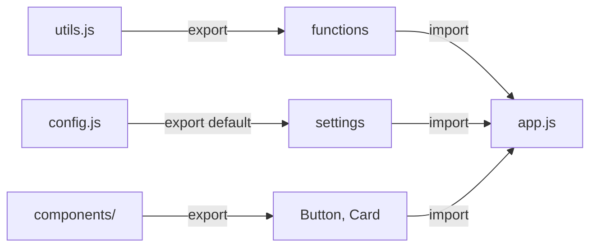
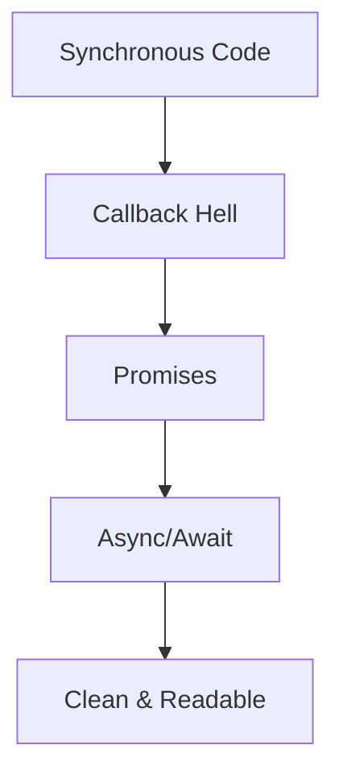
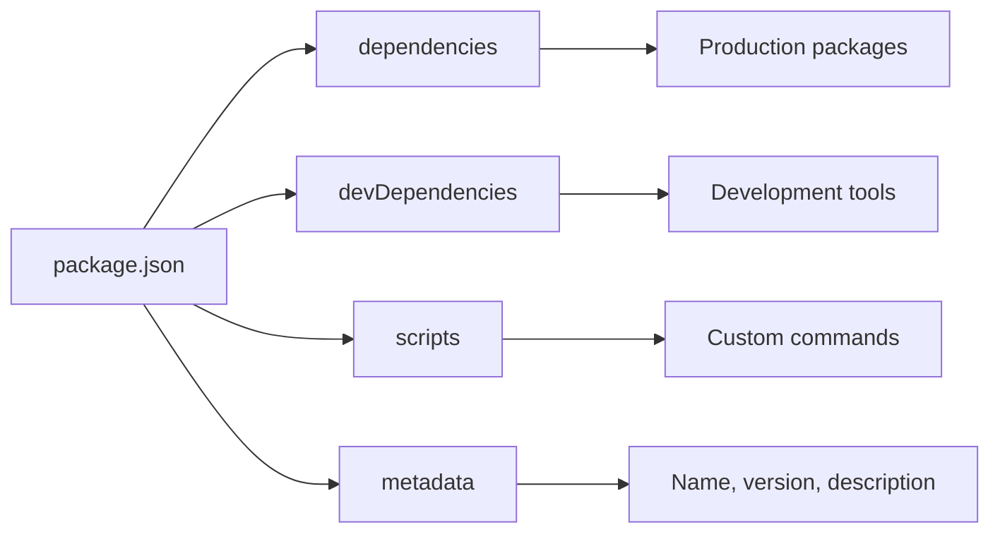
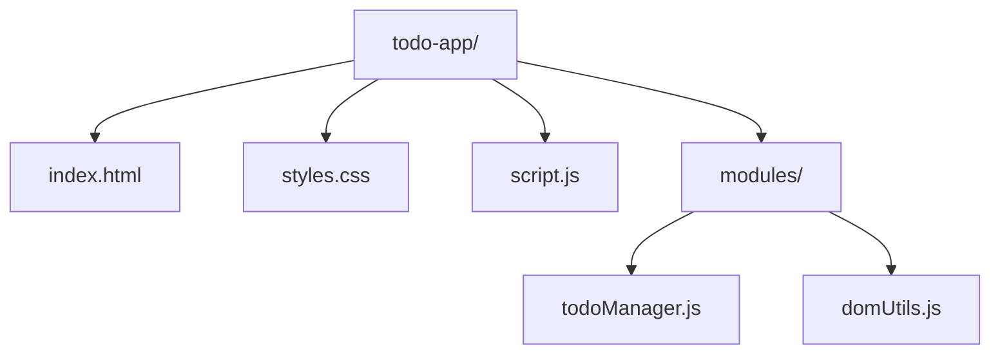

# Bài 1: Giới thiệu và JavaScript Basics

<div className="bg-blue-50 border-l-4 border-blue-400 p-6 mb-8">
  <h2 className="text-2xl font-bold text-blue-800 mb-3">🎯 Mục tiêu bài học</h2>
  <p className="text-blue-700">Nắm vững kiến thức JavaScript ES6+ và thiết lập môi trường phát triển để chuẩn bị cho việc học Next.js</p>
</div>

## 📚 I. JavaScript ES6+ Fundamentals

### 1.1 Arrow Functions

**Cú pháp truyền thống vs ES6:**

| Cách viết            | Cú pháp                    | Ví dụ                                  |
| -------------------- | -------------------------- | -------------------------------------- |
| Function Declaration | `function name() {}`       | `function add(a, b) { return a + b; }` |
| Arrow Function       | `const name = () => {}`    | `const add = (a, b) => a + b;`         |
| Arrow với 1 tham số  | `const name = param => {}` | `const square = x => x * x;`           |

<div className="bg-gray-50 p-4 rounded-lg border-l-4 border-green-400 my-4">
  <h4 className="font-semibold text-green-800">💡 Lưu ý quan trọng</h4>
  <p className="text-gray-700">Arrow functions không có <code>this</code> binding riêng, rất hữu ích trong React components</p>
</div>

```javascript
// Traditional function
function getUserData() {
  return fetch("/api/user")
    .then((response) => response.json())
    .then((data) => {
      this.userData = data; // 'this' có thể undefined
    });
}

// Arrow function
const getUserData = () => {
  return fetch("/api/user")
    .then((response) => response.json())
    .then((data) => {
      this.userData = data; // 'this' từ lexical scope
    });
};
```

### 1.2 Destructuring

**Object Destructuring:**

| Cách viết cũ                            | ES6 Destructuring                   | Kết quả              |
| --------------------------------------- | ----------------------------------- | -------------------- |
| `const name = user.name`                | `const { name } = user`             | Lấy thuộc tính name  |
| `const name = user.name \|\| 'Default'` | `const { name = 'Default' } = user` | Với giá trị mặc định |
| -                                       | `const { name: userName } = user`   | Đổi tên biến         |

```javascript
// Ví dụ thực tế trong React/Next.js
const UserProfile = ({ user }) => {
  const { name, email, avatar = "/default-avatar.png" } = user;

  return (
    <div>
      
      <h2>{name}</h2>
      <p>{email}</p>
    </div>
  );
};
```

### 1.3 Modules (Import/Export)



**Các loại Export/Import:**

| Loại           | Export                        | Import                                   |
| -------------- | ----------------------------- | ---------------------------------------- |
| Named Export   | `export const add = () => {}` | `import { add } from './utils'`          |
| Default Export | `export default Calculator`   | `import Calculator from './Calculator'`  |
| Multiple       | `export { add, subtract }`    | `import { add, subtract } from './math'` |
| All            | -                             | `import * as mathUtils from './math'`    |

### 1.4 Promises và Async/Await



**So sánh các cách xử lý bất đồng bộ:**

| Phương pháp | Ưu điểm          | Nhược điểm        | Sử dụng trong Next.js |
| ----------- | ---------------- | ----------------- | --------------------- |
| Callbacks   | Đơn giản         | Callback hell     | Hiếm khi              |
| Promises    | Chainable        | Syntax phức tạp   | Thỉnh thoảng          |
| Async/Await | Dễ đọc, dễ debug | Cần hiểu Promises | **Chủ yếu**           |

```javascript
// Data fetching trong Next.js với async/await
async function getServerSideProps() {
  try {
    const [users, posts] = await Promise.all([
      fetch("/api/users").then((res) => res.json()),
      fetch("/api/posts").then((res) => res.json()),
    ]);

    return {
      props: { users, posts },
    };
  } catch (error) {
    return {
      props: { users: [], posts: [] },
    };
  }
}
```

## 🌐 II. DOM Manipulation & Event Handling

### 2.1 Modern DOM APIs

| Phương thức          | Mục đích            | Ví dụ                                    |
| -------------------- | ------------------- | ---------------------------------------- |
| `querySelector()`    | Chọn 1 element      | `document.querySelector('.btn-primary')` |
| `querySelectorAll()` | Chọn nhiều elements | `document.querySelectorAll('.card')`     |
| `addEventListener()` | Thêm event listener | `btn.addEventListener('click', handler)` |
| `createElement()`    | Tạo element mới     | `document.createElement('div')`          |

<div className="bg-yellow-50 border-l-4 border-yellow-400 p-4 my-4">
  <h4 className="font-semibold text-yellow-800">⚠️ Lưu ý</h4>
  <p className="text-yellow-700">Trong React/Next.js, bạn sẽ ít khi thao tác DOM trực tiếp. Hiểu DOM giúp debug và tối ưu hóa</p>
</div>

### 2.2 Event Handling Patterns

```javascript
// Pattern thường dùng trong Next.js
const ContactForm = () => {
  const handleSubmit = async (event) => {
    event.preventDefault();

    const formData = new FormData(event.target);
    const data = Object.fromEntries(formData);

    try {
      const response = await fetch("/api/contact", {
        method: "POST",
        headers: { "Content-Type": "application/json" },
        body: JSON.stringify(data),
      });

      if (response.ok) {
        // Handle success
      }
    } catch (error) {
      // Handle error
    }
  };

  return <form onSubmit={handleSubmit}>{/* Form fields */}</form>;
};
```

## 📦 III. NPM và Package Management

### 3.1 NPM Commands Essentials

| Command          | Mục đích             | Ví dụ                            |
| ---------------- | -------------------- | -------------------------------- |
| `npm init`       | Khởi tạo project     | `npm init -y`                    |
| `npm install`    | Cài dependencies     | `npm install react next`         |
| `npm install -D` | Cài dev dependencies | `npm install -D eslint prettier` |
| `npm run`        | Chạy scripts         | `npm run dev`                    |
| `npm update`     | Update packages      | `npm update`                     |

### 3.2 Package.json Structure



**Ví dụ package.json cho Next.js:**

```json
{
  "name": "my-nextjs-app",
  "version": "1.0.0",
  "scripts": {
    "dev": "next dev",
    "build": "next build",
    "start": "next start"
  },
  "dependencies": {
    "next": "^14.0.0",
    "react": "^18.0.0",
    "react-dom": "^18.0.0"
  },
  "devDependencies": {
    "eslint": "^8.0.0",
    "prettier": "^3.0.0"
  }
}
```

## 🛠️ IV. Thiết lập Môi trường Development

### 4.1 Cài đặt Node.js

<div className="overflow-x-auto">

| Hệ điều hành | Cách cài đặt                                | Phiên bản khuyến nghị |
| ------------ | ------------------------------------------- | --------------------- |
| Windows      | Download từ nodejs.org hoặc dùng Chocolatey | Node.js 18+           |
| macOS        | Download từ nodejs.org hoặc dùng Homebrew   | Node.js 18+           |
| Linux        | Package manager hoặc NodeSource             | Node.js 18+           |

</div>

```bash
# Kiểm tra phiên bản
node --version
npm --version

# Cài đặt qua Homebrew (macOS)
brew install node

# Cài đặt qua Chocolatey (Windows)
choco install nodejs
```

### 4.2 Visual Studio Code Setup

**Extensions cần thiết cho Next.js:**

| Extension                              | Mục đích           | Độ ưu tiên |
| -------------------------------------- | ------------------ | ---------- |
| ES7+ React/Redux/React-Native snippets | Code snippets      | **Cao**    |
| Prettier - Code formatter              | Format code        | **Cao**    |
| ESLint                                 | Lint JavaScript    | **Cao**    |
| Auto Rename Tag                        | Rename HTML tags   | Trung bình |
| Bracket Pair Colorizer                 | Highlight brackets | Trung bình |

### 4.3 Git Configuration

```bash
# Cấu hình Git
git config --global user.name "Your Name"
git config --global user.email "your.email@example.com"

# Tạo SSH key
ssh-keygen -t ed25519 -C "your.email@example.com"
```

## 🚀 V. Thực hành: Todo App với JavaScript ES6+

### 5.1 Cấu trúc Project



### 5.2 Implementation

**HTML Structure:**

```html
<!DOCTYPE html>
<html lang="vi">
  <head>
    <meta charset="UTF-8" />
    <meta name="viewport" content="width=device-width, initial-scale=1.0" />
    <title>Todo App - ES6+</title>
    <link rel="stylesheet" href="styles.css" />
  </head>
  <body>
    <div class="container">
      <h1>Todo App</h1>
      <form id="todoForm">
        <input
          type="text"
          id="todoInput"
          placeholder="Nhập công việc mới..."
          required
        />
        <button type="submit">Thêm</button>
      </form>
      <ul id="todoList"></ul>
    </div>
    <script type="module" src="script.js"></script>
  </body>
</html>
```

**JavaScript Modules:**

```javascript
// modules/todoManager.js
export class TodoManager {
  constructor() {
    this.todos = this.loadTodos();
  }

  addTodo = (text) => {
    const todo = {
      id: Date.now(),
      text,
      completed: false,
      createdAt: new Date().toISOString(),
    };

    this.todos.push(todo);
    this.saveTodos();
    return todo;
  };

  toggleTodo = (id) => {
    const todo = this.todos.find((todo) => todo.id === id);
    if (todo) {
      todo.completed = !todo.completed;
      this.saveTodos();
    }
  };

  deleteTodo = (id) => {
    this.todos = this.todos.filter((todo) => todo.id !== id);
    this.saveTodos();
  };

  loadTodos = () => {
    try {
      return JSON.parse(localStorage.getItem("todos")) || [];
    } catch {
      return [];
    }
  };

  saveTodos = () => {
    localStorage.setItem("todos", JSON.stringify(this.todos));
  };
}

// modules/domUtils.js
export const createTodoElement = (todo, { onToggle, onDelete }) => {
  const li = document.createElement("li");
  li.className = `todo-item ${todo.completed ? "completed" : ""}`;

  li.innerHTML = `
    <span class="todo-text">${todo.text}</span>
    <div class="todo-actions">
      <button class="toggle-btn">${todo.completed ? "Hoàn tác" : "Hoàn thành"}</button>
      <button class="delete-btn">Xóa</button>
    </div>
  `;

  li.querySelector(".toggle-btn").addEventListener("click", () =>
    onToggle(todo.id)
  );
  li.querySelector(".delete-btn").addEventListener("click", () =>
    onDelete(todo.id)
  );

  return li;
};

// script.js
import { TodoManager } from "./modules/todoManager.js";
import { createTodoElement } from "./modules/domUtils.js";

class TodoApp {
  constructor() {
    this.todoManager = new TodoManager();
    this.todoForm = document.getElementById("todoForm");
    this.todoInput = document.getElementById("todoInput");
    this.todoList = document.getElementById("todoList");

    this.init();
  }

  init = () => {
    this.todoForm.addEventListener("submit", this.handleSubmit);
    this.render();
  };

  handleSubmit = (event) => {
    event.preventDefault();
    const text = this.todoInput.value.trim();

    if (text) {
      this.todoManager.addTodo(text);
      this.todoInput.value = "";
      this.render();
    }
  };

  handleToggle = (id) => {
    this.todoManager.toggleTodo(id);
    this.render();
  };

  handleDelete = (id) => {
    this.todoManager.deleteTodo(id);
    this.render();
  };

  render = () => {
    this.todoList.innerHTML = "";

    this.todoManager.todos.forEach((todo) => {
      const todoElement = createTodoElement(todo, {
        onToggle: this.handleToggle,
        onDelete: this.handleDelete,
      });
      this.todoList.appendChild(todoElement);
    });
  };
}

// Khởi tạo ứng dụng
new TodoApp();
```

## 📋 VI. Tổng kết và Chuẩn bị cho Next.js

<div className="bg-green-50 border-l-4 border-green-400 p-6 my-6">
  <h3 className="text-xl font-bold text-green-800 mb-3">✅ Kiến thức đã học</h3>
  <ul className="text-green-700 space-y-2">
    <li>• ES6+ features: Arrow functions, Destructuring, Modules, Async/Await</li>
    <li>• DOM manipulation và Event handling</li>
    <li>• NPM và package management</li>
    <li>• Thiết lập môi trường development</li>
    <li>• Thực hành với Todo App sử dụng ES6+ modules</li>
  </ul>
</div>

### Chuẩn bị cho bài tiếp theo

| Kỹ năng cần củng cố | Tài nguyên                    | Thời gian |
| ------------------- | ----------------------------- | --------- |
| JavaScript ES6+     | MDN Web Docs, JavaScript.info | 2-3 ngày  |
| Async Programming   | Promises/A+ specification     | 1-2 ngày  |
| Module Systems      | ES6 Modules Guide             | 1 ngày    |
| NPM Ecosystem       | NPM Documentation             | 1 ngày    |

<div className="border border-blue-200 rounded-lg p-6 mt-8">
  <h3 className="text-lg font-semibold text-blue-800 mb-3">🔜 Bài học tiếp theo</h3>
  <p className="text-blue-700">
    <strong>Bài 2: React Fundamentals và Frontend Frameworks</strong><br>
    Chúng ta sẽ tìm hiểu về React, Virtual DOM, và tại sao cần sử dụng Frontend Frameworks.
  </p>
</div>
