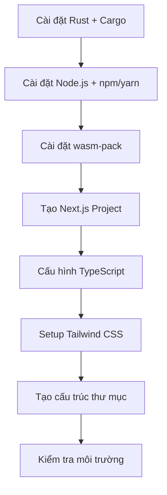
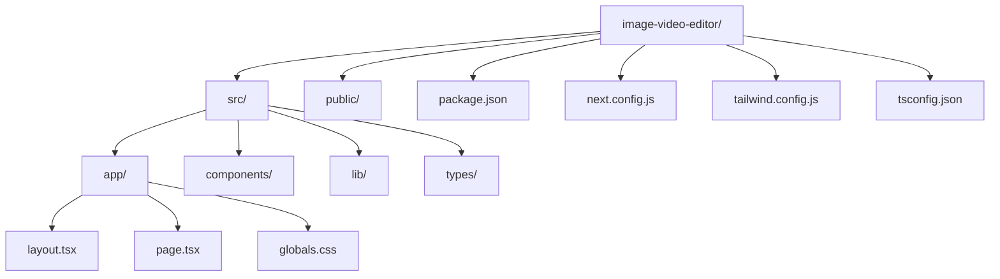

# Bài 1: Thiết Lập Môi Trường Phát Triển

<div className="border-l-4 border-blue-500 pl-4 mb-6">
  <h2 className="text-xl font-bold text-blue-700 mb-2">🎯 Mục Tiêu Bài Học</h2>
  <p className="text-gray-700">Sau bài học này, học viên sẽ có được môi trường phát triển hoàn chỉnh để xây dựng ứng dụng Bevy Rust WASM + Next.js và hiểu rõ cấu trúc project chuẩn.</p>
</div>

## 📋 Danh Sách Công Nghệ Cần Cài Đặt

| Công Nghệ        | Phiên Bản | Mục Đích                       | Ghi Chú                       |
| ---------------- | --------- | ------------------------------ | ----------------------------- |
| **Rust**         | ≥ 1.70    | Ngôn ngữ chính cho Bevy Engine | Bao gồm Cargo package manager |
| **Node.js**      | ≥ 18.17   | Runtime cho Next.js            | Khuyến nghị sử dụng LTS       |
| **wasm-pack**    | Latest    | Compile Rust to WebAssembly    | Tool chính cho WASM           |
| **Next.js**      | 14+       | React framework với App Router | Sử dụng create-next-app       |
| **TypeScript**   | ≥ 5.0     | Type safety cho JavaScript     | Tích hợp sẵn trong Next.js    |
| **Tailwind CSS** | ≥ 3.3     | Utility-first CSS framework    | Styling chính                 |

## 🔧 Quy Trình Cài Đặt



## 📦 Bước 1: Cài Đặt Rust và Cargo

### 1.1 Tải và Cài Đặt Rust

<div className="rounded-lg border border-gray-300 p-4 mb-4">
  <h4 className="font-semibold text-green-700 mb-2">🌐 Truy cập trang chủ Rust</h4>
  <p>Vào <strong>https://rustup.rs/</strong> và làm theo hướng dẫn cho hệ điều hành của bạn.</p>
</div>

**Windows:**

```bash
# Tải và chạy rustup-init.exe
curl --proto '=https' --tlsv1.2 -sSf https://sh.rustup.rs | sh
```

**macOS/Linux:**

```bash
curl --proto '=https' --tlsv1.2 -sSf https://sh.rustup.rs | sh
source ~/.cargo/env
```

### 1.2 Thêm WASM Target

```bash
# Thêm WebAssembly target cho Rust
rustup target add wasm32-unknown-unknown
```

### 1.3 Kiểm Tra Cài Đặt

| Lệnh              | Kết Quả Mong Đợi        | Mục Đích                 |
| ----------------- | ----------------------- | ------------------------ |
| `rustc --version` | rustc 1.70+             | Kiểm tra Rust compiler   |
| `cargo --version` | cargo 1.70+             | Kiểm tra package manager |
| `rustup show`     | Hiển thị toolchain info | Xác nhận cài đặt         |

## 📦 Bước 2: Cài Đặt Node.js và Package Manager

### 2.1 Cài Đặt Node.js

<div className="grid grid-cols-1 md:grid-cols-2 gap-4 mb-4">
  <div className="border rounded-lg p-4">
    <h4 className="font-semibold text-blue-700 mb-2">💡 Bevy 0.16 Updates</h4>
    <p className="text-sm">Phiên bản mới nhất với Required Components và cải tiến hiệu năng</p>
  </div>
  <div className="border rounded-lg p-4">
    <h4 className="font-semibold text-orange-700 mb-2">⚠️ Rust 2024</h4>
    <p className="text-sm">Bevy 0.16 yêu cầu Rust 1.82+ với Rust 2024 edition</p>
  </div>
</div>

```bash
# Sử dụng nvm (khuyến nghị)
nvm install 18.17.0
nvm use 18.17.0

# Hoặc tải trực tiếp từ nodejs.org
```

### 2.2 Chọn Package Manager

| Package Manager | Lệnh Cài Đặt          | Ưu Điểm               | Nhược Điểm   |
| --------------- | --------------------- | --------------------- | ------------ |
| **npm**         | Đi kèm Node.js        | Mặc định, ổn định     | Chậm hơn     |
| **yarn**        | `npm install -g yarn` | Nhanh, lock file tốt  | Cần cài thêm |
| **pnpm**        | `npm install -g pnpm` | Tiết kiệm disk, nhanh | Ít phổ biến  |

## 📦 Bước 3: Cài Đặt wasm-pack

```bash
# Cài đặt wasm-pack (công cụ chính để build Rust -> WASM)
curl https://rustwasm.github.io/wasm-pack/installer/init.sh -sSf | sh

# Kiểm tra cài đặt
wasm-pack --version
```

## 📦 Bước 4: Tạo Next.js Project với App Router

### 4.1 Tạo Project Mới

```bash
# Tạo Next.js project với TypeScript và Tailwind
npx create-next-app@latest image-video-editor \
  --typescript \
  --tailwind \
  --app \
  --src-dir \
  --import-alias "@/*"

cd image-video-editor
```

### 4.2 Cấu Trúc Project Được Tạo



## 📁 Bước 5: Tạo Cấu Trúc Thư Mục Chuẩn

### 5.1 Cấu Trúc Thư Mục Hoàn Chỉnh

```
image-video-editor/
├── 📁 src/
│   ├── 📁 app/                    # Next.js App Router
│   │   ├── layout.tsx
│   │   ├── page.tsx
│   │   ├── globals.css
│   │   └── 📁 editor/             # Editor routes
│   ├── 📁 components/             # React components
│   │   ├── 📁 ui/                 # Base UI components
│   │   ├── 📁 editor/             # Editor-specific components
│   │   └── 📁 common/             # Common components
│   ├── 📁 lib/                    # Utility functions
│   │   ├── utils.ts
│   │   └── 📁 wasm/               # WASM integration
│   ├── 📁 types/                  # TypeScript type definitions
│   ├── 📁 hooks/                  # Custom React hooks
│   └── 📁 store/                  # State management
├── 📁 rust-wasm/                  # Rust WASM code
│   ├── Cargo.toml
│   ├── src/
│   │   ├── lib.rs
│   │   └── 📁 image_processing/
│   └── 📁 pkg/                    # Generated WASM files
├── 📁 public/                     # Static files
├── package.json
├── next.config.js
├── tailwind.config.js
└── tsconfig.json
```

### 5.2 Tạo Thư Mục Rust WASM

```bash
# Tạo thư mục cho Rust code
mkdir rust-wasm
cd rust-wasm

# Khởi tạo Rust library project
cargo init --lib

# Quay về thư mục gốc
cd ..
```

### 5.3 Cấu Hình Cargo.toml

```toml
[package]
name = "image-video-editor-wasm"
version = "0.1.0"
edition = "2021"

[lib]
crate-type = ["cdylib"]

[dependencies]
wasm-bindgen = "0.2"
bevy = { version = "0.12", default-features = false, features = [
    "bevy_render",
    "bevy_core_pipeline",
    "bevy_sprite",
    "bevy_asset",
    "bevy_winit",
] }
console_error_panic_hook = "0.1"
wee_alloc = "0.4"

[dependencies.web-sys]
version = "0.3"
features = [
    "console",
    "HtmlCanvasElement",
    "WebGl2RenderingContext",
]
```

## ⚙️ Bước 6: Cấu Hình Nâng Cao

### 6.1 Cấu Hình Next.js cho WASM

<div className="border-2 border-yellow-400 rounded-lg p-4 mb-4">
  <h4 className="font-semibold text-yellow-700 mb-2">📝 Cập nhật next.config.js</h4>
</div>

```javascript
/** @type {import('next').NextConfig} */
const nextConfig = {
  experimental: {
    appDir: true,
  },
  webpack: (config) => {
    // Cấu hình cho WASM
    config.experiments = {
      ...config.experiments,
      asyncWebAssembly: true,
    };

    // Xử lý WASM files
    config.module.rules.push({
      test: /\.wasm$/,
      type: "webassembly/async",
    });

    return config;
  },
};

module.exports = nextConfig;
```

### 6.2 Cấu Hình TypeScript

```json
{
  "compilerOptions": {
    "target": "es5",
    "lib": ["dom", "dom.iterable", "es6"],
    "allowJs": true,
    "skipLibCheck": true,
    "strict": true,
    "forceConsistentCasingInFileNames": true,
    "noEmit": true,
    "esModuleInterop": true,
    "module": "esnext",
    "moduleResolution": "bundler",
    "resolveJsonModule": true,
    "isolatedModules": true,
    "jsx": "preserve",
    "incremental": true,
    "plugins": [
      {
        "name": "next"
      }
    ],
    "baseUrl": ".",
    "paths": {
      "@/*": ["./src/*"]
    }
  },
  "include": ["next-env.d.ts", "**/*.ts", "**/*.tsx", ".next/types/**/*.ts"],
  "exclude": ["node.js"]
}
```

### 6.3 Cấu Hình Tailwind CSS

```javascript
/** @type {import('tailwindcss').Config} */
module.exports = {
  content: [
    "./src/pages/**/*.{js,ts,jsx,tsx,mdx}",
    "./src/components/**/*.{js,ts,jsx,tsx,mdx}",
    "./src/app/**/*.{js,ts,jsx,tsx,mdx}",
  ],
  theme: {
    extend: {
      colors: {
        primary: {
          50: "#eff6ff",
          500: "#3b82f6",
          600: "#2563eb",
          700: "#1d4ed8",
        },
        secondary: {
          50: "#f8fafc",
          500: "#64748b",
          600: "#475569",
        },
      },
    },
  },
  plugins: [],
};
```

## 🧪 Bước 7: Kiểm Tra Môi Trường

### 7.1 Script Kiểm Tra (package.json)

```json
{
  "scripts": {
    "dev": "next dev",
    "build": "next build",
    "start": "next start",
    "lint": "next lint",
    "build-wasm": "cd rust-wasm && wasm-pack build --target web --out-dir pkg",
    "check-env": "node scripts/check-environment.js"
  }
}
```

### 7.2 Tạo Script Kiểm Tra Môi Trường

```javascript
// scripts/check-environment.js
const { execSync } = require("child_process");

const checks = [
  { name: "Node.js", cmd: "node --version", min: "v18.17" },
  { name: "Rust", cmd: "rustc --version", min: "1.70" },
  { name: "Cargo", cmd: "cargo --version", min: "1.70" },
  { name: "wasm-pack", cmd: "wasm-pack --version", min: "0.10" },
];

console.log("🔍 Kiểm tra môi trường phát triển...\n");

checks.forEach((check) => {
  try {
    const result = execSync(check.cmd, { encoding: "utf8" });
    console.log(`✅ ${check.name}: ${result.trim()}`);
  } catch (error) {
    console.log(`❌ ${check.name}: Chưa được cài đặt`);
  }
});
```

### 7.3 Bảng Kiểm Tra Cuối Cùng

| Kiểm Tra    | Lệnh                                | Kết Quả Mong Đợi      | Trạng Thái |
| ----------- | ----------------------------------- | --------------------- | ---------- |
| Node.js     | `node --version`                    | v18.17+               | ⬜         |
| Rust        | `rustc --version`                   | 1.70+                 | ⬜         |
| Cargo       | `cargo --version`                   | 1.70+                 | ⬜         |
| wasm-pack   | `wasm-pack --version`               | 0.10+                 | ⬜         |
| WASM Target | `rustup target list \| grep wasm32` | installed             | ⬜         |
| Next.js Dev | `npm run dev`                       | Server chạy port 3000 | ⬜         |

## 📚 Tài Liệu Tham Khảo

<div className="grid grid-cols-1 md:grid-cols-2 lg:grid-cols-3 gap-4 mt-6">
  <div className="border rounded-lg p-4 hover:shadow-md transition-shadow">
    <h4 className="font-semibold text-blue-600 mb-2">🦀 Rust</h4>
    <p className="text-sm text-gray-600">rust-lang.org</p>
  </div>
  <div className="border rounded-lg p-4 hover:shadow-md transition-shadow">
    <h4 className="font-semibold text-green-600 mb-2">⚡ Next.js</h4>
    <p className="text-sm text-gray-600">nextjs.org/docs</p>
  </div>
  <div className="border rounded-lg p-4 hover:shadow-md transition-shadow">
    <h4 className="font-semibold text-purple-600 mb-2">🌐 WASM</h4>
    <p className="text-sm text-gray-600">rustwasm.github.io</p>
  </div>
  <div className="border rounded-lg p-4 hover:shadow-md transition-shadow">
    <h4 className="font-semibold text-cyan-600 mb-2">🎨 Tailwind</h4>
    <p className="text-sm text-gray-600">tailwindcss.com</p>
  </div>
  <div className="border rounded-lg p-4 hover:shadow-md transition-shadow">
    <h4 className="font-semibold text-blue-500 mb-2">📘 TypeScript</h4>
    <p className="text-sm text-gray-600">typescriptlang.org</p>
  </div>
  <div className="border rounded-lg p-4 hover:shadow-md transition-shadow">
    <h4 className="font-semibold text-orange-600 mb-2">🎮 Bevy</h4>
    <p className="text-sm text-gray-600">bevyengine.org</p>
  </div>
</div>

## 🎯 Bài Tập Thực Hành

<div className="border-l-4 border-green-500 pl-4 mt-6">
  <h3 className="font-bold text-green-700 mb-2">✏️ Bài Tập 1: Tạo Component Hello World</h3>
  <p className="text-gray-700 mb-2">Tạo component Next.js đầu tiên để kiểm tra môi trường:</p>
  <ol className="list-decimal list-inside text-sm text-gray-600 space-y-1">
    <li>Tạo file <code>src/components/HelloWorld.tsx</code></li>
    <li>Implement component với TypeScript và Tailwind</li>
    <li>Import và sử dụng trong <code>src/app/page.tsx</code></li>
    <li>Chạy <code>npm run dev</code> và kiểm tra kết quả</li>
  </ol>
</div>

<div className="border-l-4 border-blue-500 pl-4 mt-4">
  <h3 className="font-bold text-blue-700 mb-2">✏️ Bài Tập 2: Build WASM Module Đầu Tiên</h3>
  <p className="text-gray-700 mb-2">Tạo và build Rust module cơ bản:</p>
  <ol className="list-decimal list-inside text-sm text-gray-600 space-y-1">
    <li>Implement function đơn giản trong <code>rust-wasm/src/lib.rs</code></li>
    <li>Build WASM với <code>npm run build-wasm</code></li>
    <li>Kiểm tra file được tạo trong <code>rust-wasm/pkg/</code></li>
  </ol>
</div>

## 🏁 Kết Luận

Sau bài học này, bạn đã có:

- ✅ Môi trường phát triển hoàn chỉnh
- ✅ Project Next.js với TypeScript và Tailwind
- ✅ Cấu trúc thư mục chuẩn
- ✅ Rust WASM toolchain sẵn sàng
- ✅ Kiểm tra và validation môi trường

<div className="border border-blue-200 rounded-lg p-4 mt-6 text-center">
  <h4 className="font-bold text-blue-700 mb-2">🚀 Sẵn Sàng Cho Bài Tiếp Theo</h4>
  <p className="text-gray-700">Bài 2: Giới Thiệu Bevy Engine và WebAssembly</p>
</div>
