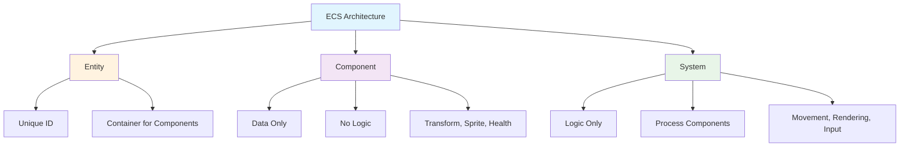
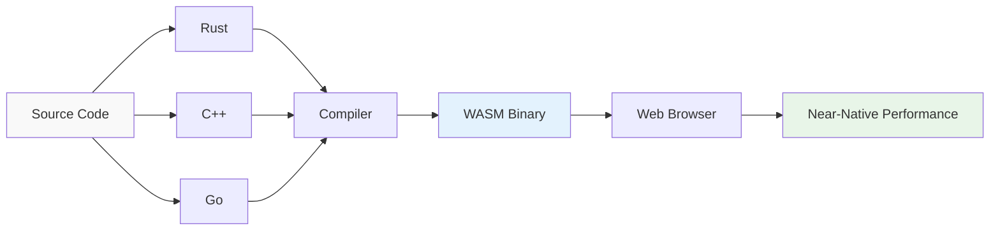
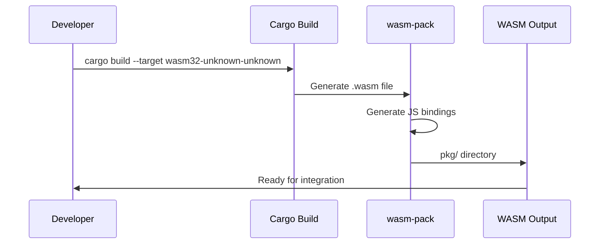
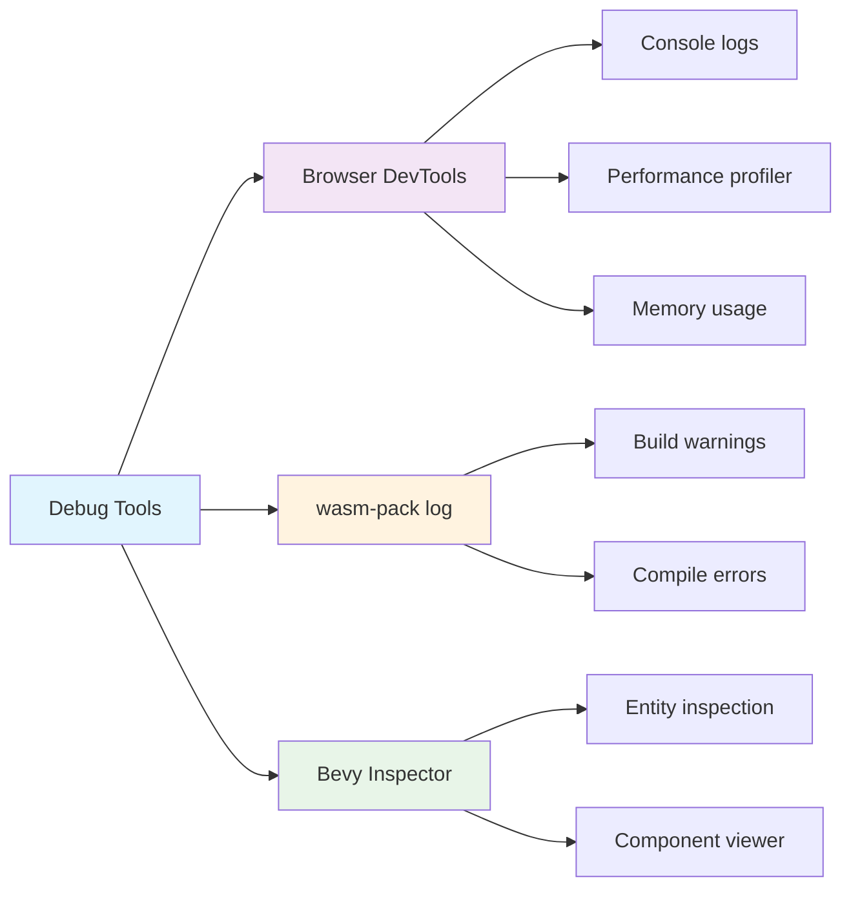

# Bài 2: Giới Thiệu Bevy Engine và WebAssembly

<div className="border-l-4 border-blue-500 pl-6 py-4 mb-8">
  <h2 className="text-xl font-bold text-blue-700 mb-2">🎯 Mục tiêu bài học</h2>
  <ul className="list-disc ml-6 space-y-2">
    <li>Hiểu cơ bản về Bevy Engine và kiến trúc ECS</li>
    <li>Nắm vững khái niệm WebAssembly và lợi ích của Rust</li>
    <li>Tạo được Bevy app đơn giản đầu tiên</li>
    <li>Compile Rust code thành WASM thành công</li>
    <li>Tích hợp WASM vào Next.js project</li>
    <li>Thực hiện debug và kiểm tra performance cơ bản</li>
  </ul>
</div>

## 📚 Nội dung chính

### 1. Tìm hiểu Bevy Engine

<div className="bg-gray-50 p-6 rounded-lg mb-6">
  <h3 className="text-lg font-semibold mb-4">💡 Bevy Engine là gì?</h3>
  <p className="mb-4">Bevy là một game engine hiện đại được viết bằng Rust, sử dụng kiến trúc ECS (Entity Component System) và có khả năng compile thành WebAssembly để chạy trên web browser.</p>
</div>

#### 1.1 Kiến trúc ECS (Entity Component System)



| Thành phần    | Vai trò                               | Ví dụ                        |
| ------------- | ------------------------------------- | ---------------------------- |
| **Entity**    | ID duy nhất, không chứa dữ liệu       | Player, Enemy, Bullet        |
| **Component** | Dữ liệu thuần túy, không có logic     | Position, Velocity, Health   |
| **System**    | Logic xử lý, thao tác trên Components | MovementSystem, RenderSystem |

#### 1.2 Ưu điểm của kiến trúc ECS

<div className="grid grid-cols-1 md:grid-cols-2 gap-4 mb-6">
  <div className="border rounded-lg p-4">
    <h4 className="font-semibold text-green-600 mb-2">✅ Ưu điểm</h4>
    <ul className="text-sm space-y-1">
      <li>• Performance cao</li>
      <li>• Dễ mở rộng</li>
      <li>• Tái sử dụng code tốt</li>
      <li>• Parallel processing</li>
    </ul>
  </div>
  <div className="border rounded-lg p-4">
    <h4 className="font-semibold text-orange-600 mb-2">⚠️ Thách thức</h4>
    <ul className="text-sm space-y-1">
      <li>• Learning curve cao</li>
      <li>• Debugging phức tạp</li>
      <li>• Thiết kế system cần kỹ năng</li>
    </ul>
  </div>
</div>

### 2. Khái niệm WebAssembly (WASM)

#### 2.1 WebAssembly là gì?



| Đặc điểm              | Mô tả                             |
| --------------------- | --------------------------------- |
| **Performance**       | Tốc độ gần như native code        |
| **Security**          | Chạy trong sandbox environment    |
| **Portability**       | Chạy trên mọi platform có browser |
| **Language Agnostic** | Hỗ trợ nhiều ngôn ngữ lập trình   |

#### 2.2 Tại sao chọn Rust cho WASM?

<div className="bg-gradient-to-r from-orange-50 to-red-50 p-6 rounded-lg mb-6">
  <h4 className="font-semibold text-red-700 mb-3">🦀 Rust + WASM = Perfect Match</h4>
  <div className="grid grid-cols-1 md:grid-cols-2 gap-4">
    <div>
      <h5 className="font-medium mb-2">Memory Safety</h5>
      <p className="text-sm">Không có garbage collection, zero-cost abstractions</p>
    </div>
    <div>
      <h5 className="font-medium mb-2">Small Bundle Size</h5>
      <p className="text-sm">WASM output nhỏ gọn, tối ưu cho web</p>
    </div>
    <div>
      <h5 className="font-medium mb-2">Excellent Tooling</h5>
      <p className="text-sm">wasm-pack, wasm-bindgen ecosystem</p>
    </div>
    <div>
      <h5 className="font-medium mb-2">Performance</h5>
      <p className="text-sm">Tốc độ xử lý gần như native C/C++</p>
    </div>
  </div>
</div>

### 3. Tạo Bevy App Đầu Tiên

#### 3.1 Cấu trúc project Rust

```
bevy-image-editor/
├── wasm/
│   ├── Cargo.toml
│   ├── src/
│   │   ├── lib.rs
│   │   ├── app.rs
│   │   └── utils.rs
│   └── pkg/ (generated)
└── nextjs-frontend/
    ├── components/
    ├── hooks/
    └── wasm/ (symlink to ../wasm/pkg)
```

#### 3.2 Cargo.toml Configuration

```toml
[package]
name = "bevy-image-editor-wasm"
version = "0.1.0"
edition = "2021"

[lib]
crate-type = ["cdylib"]

[dependencies]
bevy = { version = "0.12", default-features = false, features = [
    "bevy_core_pipeline",
    "bevy_render",
    "bevy_sprite",
    "bevy_asset",
    "bevy_winit",
    "webgl2"
]}
wasm-bindgen = "0.2"
web-sys = "0.3"
console_error_panic_hook = "0.1"

[dependencies.wasm-bindgen-futures]
version = "0.4"
```

#### 3.3 Bevy App cơ bản (lib.rs)

```rust
use bevy::prelude::*;
use wasm_bindgen::prelude::*;

#[wasm_bindgen]
pub struct BevyImageEditor {
    app: Option<App>,
}

#[wasm_bindgen]
impl BevyImageEditor {
    #[wasm_bindgen(constructor)]
    pub fn new() -> Self {
        console_error_panic_hook::set_once();

        let mut app = App::new();
        app.add_plugins(DefaultPlugins.set(WindowPlugin {
            primary_window: Some(Window {
                canvas: Some("#bevy-canvas".to_string()),
                ..default()
            }),
            ..default()
        }))
        .add_systems(Startup, setup)
        .add_systems(Update, (image_system, input_system));

        Self { app: Some(app) }
    }

    #[wasm_bindgen]
    pub fn run(&mut self) {
        if let Some(app) = self.app.take() {
            app.run();
        }
    }
}

fn setup(mut commands: Commands, asset_server: Res<AssetServer>) {
    commands.spawn(Camera2dBundle::default());

    // Spawn a simple sprite
    commands.spawn(SpriteBundle {
        texture: asset_server.load("sample_image.png"),
        ..default()
    });
}

fn image_system(/* parameters */) {
    // Image processing logic
}

fn input_system(/* parameters */) {
    // Input handling logic
}
```

### 4. Compile Rust thành WASM

#### 4.1 Các bước build process



#### 4.2 Build commands

| Command                           | Mục đích                     |
| --------------------------------- | ---------------------------- |
| `wasm-pack build --target web`    | Build cho web browsers       |
| `wasm-pack build --target nodejs` | Build cho Node.js            |
| `wasm-pack build --dev`           | Development build (debug)    |
| `wasm-pack build --release`       | Production build (optimized) |

#### 4.3 Package.json scripts

```json
{
  "scripts": {
    "build:wasm": "cd wasm && wasm-pack build --target web --out-dir pkg",
    "build:wasm:dev": "cd wasm && wasm-pack build --target web --dev --out-dir pkg",
    "dev": "npm run build:wasm:dev && next dev",
    "build": "npm run build:wasm && next build"
  }
}
```

### 5. Tích hợp WASM vào Next.js

#### 5.1 WASM Hook (useBevy.ts)

```typescript
"use client";

import { useEffect, useRef, useState } from "react";

interface BevyImageEditor {
  new (): BevyImageEditor;
  run(): void;
}

export const useBevy = () => {
  const [bevyEditor, setBevyEditor] = useState<BevyImageEditor | null>(null);
  const [isLoading, setIsLoading] = useState(true);
  const [error, setError] = useState<string | null>(null);

  useEffect(() => {
    const initializeBevy = async () => {
      try {
        // Dynamic import để tránh SSR issues
        const wasmModule = await import("@/wasm/bevy_image_editor_wasm");
        const editor = new wasmModule.BevyImageEditor();
        setBevyEditor(editor);
        setIsLoading(false);
      } catch (err) {
        setError("Failed to load WASM module");
        setIsLoading(false);
      }
    };

    initializeBevy();
  }, []);

  const runBevy = () => {
    if (bevyEditor) {
      bevyEditor.run();
    }
  };

  return { bevyEditor, isLoading, error, runBevy };
};
```

#### 5.2 Bevy Canvas Component

```typescript
'use client';

import { useBevy } from '@/hooks/useBevy';
import { useEffect } from 'react';

export default function BevyCanvas() {
  const { bevyEditor, isLoading, error, runBevy } = useBevy();

  useEffect(() => {
    if (bevyEditor) {
      runBevy();
    }
  }, [bevyEditor]);

  if (isLoading) {
    return (
      <div className="flex items-center justify-center h-64 bg-gray-100 rounded-lg">
        <div className="animate-spin rounded-full h-8 w-8 border-b-2 border-blue-500"></div>
        <span className="ml-2">Loading Bevy Engine...</span>
      </div>
    );
  }

  if (error) {
    return (
      <div className="bg-red-50 border border-red-200 rounded-lg p-4">
        <p className="text-red-700">Error: {error}</p>
      </div>
    );
  }

  return (
    <div className="relative">
      <canvas
        id="bevy-canvas"
        className="w-full h-64 border border-gray-300 rounded-lg"
        style={{ maxWidth: '100%' }}
      />
    </div>
  );
}
```

### 6. Debug và Performance

#### 6.1 Debug Tools



#### 6.2 Performance Monitoring

| Metric               | Normal Range | Tool             |
| -------------------- | ------------ | ---------------- |
| **WASM Bundle Size** | < 2MB        | wasm-pack        |
| **Init Time**        | < 500ms      | Performance API  |
| **Frame Rate**       | 60 FPS       | Browser DevTools |
| **Memory Usage**     | < 100MB      | Memory profiler  |

#### 6.3 Common Issues & Solutions

<div className="space-y-4">
  <div className="border-l-4 border-yellow-500 pl-4 py-2">
    <h4 className="font-semibold text-yellow-700">⚠️ WASM not loading</h4>
    <p className="text-sm">Solution: Check file paths and CORS settings</p>
  </div>
  
  <div className="border-l-4 border-red-500 pl-4 py-2">
    <h4 className="font-semibold text-red-700">🚫 Canvas not rendering</h4>
    <p className="text-sm">Solution: Verify canvas ID matches Bevy config</p>
  </div>
  
  <div className="border-l-4 border-blue-500 pl-4 py-2">
    <h4 className="font-semibold text-blue-700">💡 Performance issues</h4>
    <p className="text-sm">Solution: Use release build, optimize asset loading</p>
  </div>
</div>

## 🔬 Thực hành

### Bài tập 1: Setup cơ bản

1. Tạo Rust project với Bevy dependencies
2. Compile thành WASM thành công
3. Tích hợp vào Next.js component

### Bài tập 2: Debug và Test

1. Thêm console logging
2. Measure load time và performance
3. Test trên different browsers

## 📋 Checklist

- [ ] Hiểu kiến trúc ECS của Bevy
- [ ] Compile Rust code thành WASM
- [ ] Tích hợp WASM vào Next.js
- [ ] Canvas render thành công
- [ ] Debug tools hoạt động
- [ ] Performance đạt yêu cầu

## 🎯 Tổng kết

<div className="bg-green-50 border border-green-200 rounded-lg p-6 mt-8">
  <h3 className="text-lg font-semibold text-green-800 mb-3">✅ Kiến thức đã học</h3>
  <div className="grid grid-cols-1 md:grid-cols-2 gap-4 text-sm">
    <div>
      <h4 className="font-medium mb-2">Technical Skills</h4>
      <ul className="space-y-1 text-green-700">
        <li>• Bevy Engine ECS architecture</li>
        <li>• Rust to WASM compilation</li>
        <li>• Next.js integration patterns</li>
      </ul>
    </div>
    <div>
      <h4 className="font-medium mb-2">Practical Skills</h4>
      <ul className="space-y-1 text-green-700">
        <li>• Debug WASM applications</li>
        <li>• Performance optimization</li>
        <li>• Cross-platform compatibility</li>
      </ul>
    </div>
  </div>
</div>

**Bài tiếp theo:** Bài 3 - Tạo UI cơ bản với Next.js App Router, chúng ta sẽ xây dựng giao diện người dùng hoàn chỉnh cho ứng dụng chỉnh sửa hình ảnh.
