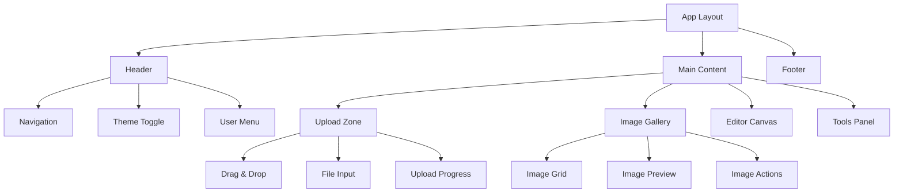
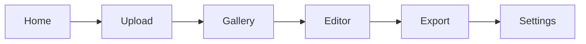
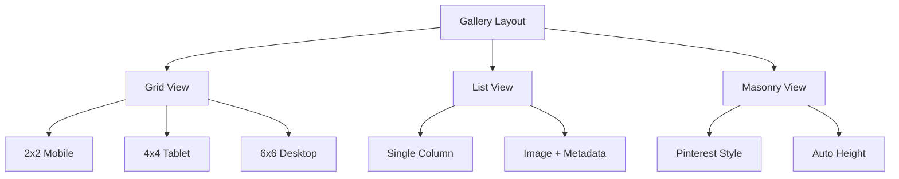
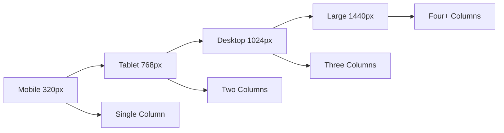
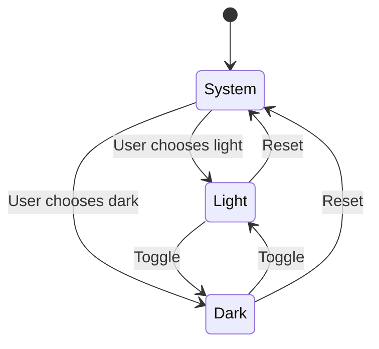

# Bài 3: Tạo UI Cơ Bản với Next.js App Router
## Khóa Học Bevy Rust WASM + Next.js - Ứng Dụng Chỉnh Sửa Hình Ảnh & Tạo Video

---

## 🎯 Mục Tiêu Bài Học

Sau bài học này, học viên sẽ:
- Thiết kế được layout chính của ứng dụng chỉnh sửa hình ảnh
- Tạo được navigation và header responsive
- Implement file upload component với drag & drop
- Xây dựng image gallery component hiển thị hình ảnh
- Áp dụng Tailwind CSS cho styling chuyên nghiệp
- Thiết kế responsive cho mobile và desktop
- Tích hợp dark/light mode toggle

---

## 📚 Kiến Thức Cần Có

| Công Nghệ | Mức Độ Yêu Cầu | Ghi Chú |
|-----------|----------------|---------|
| Next.js App Router | Cơ bản | Layout, components, routing |
| TypeScript | Cơ bản | Types, interfaces, props |
| Tailwind CSS | Cơ bản | Utility classes, responsive |
| React Hooks | Cơ bản | useState, useEffect, useRef |

---

## 🏗️ Kiến Trúc Ứng Dụng



---

## 📁 Cấu Trúc Thư Mục

```
src/
├── app/
│   ├── globals.css
│   ├── layout.tsx
│   ├── page.tsx
│   └── components/
├── components/
│   ├── ui/
│   │   ├── Header.tsx
│   │   ├── Navigation.tsx
│   │   └── ThemeToggle.tsx
│   ├── upload/
│   │   ├── UploadZone.tsx
│   │   └── FileInput.tsx
│   └── gallery/
│       ├── ImageGallery.tsx
│       └── ImageCard.tsx
├── types/
│   └── index.ts
└── utils/
    └── theme.ts
```

---

## 🎨 Thiết Kế Layout Chính

### Layout Root Component

<div className="border border-gray-300 rounded-lg p-4 my-4">
<h4 className="text-lg font-semibold mb-3 text-blue-600">📋 Checklist Layout Design</h4>
<ul className="space-y-2">
<li className="flex items-center gap-2">
<span className="text-green-500">✓</span> Header với navigation
</li>
<li className="flex items-center gap-2">
<span className="text-green-500">✓</span> Main content area flexible
</li>
<li className="flex items-center gap-2">
<span className="text-green-500">✓</span> Sidebar cho tools (tuỳ chọn)
</li>
<li className="flex items-center gap-2">
<span className="text-green-500">✓</span> Footer minimal
</li>
</ul>
</div>

### Responsive Breakpoints

| Device | Screen Size | Layout Behavior |
|--------|-------------|-----------------|
| Mobile | < 768px | Single column, collapsed nav |
| Tablet | 768px - 1024px | Two columns, expandable sidebar |
| Desktop | > 1024px | Multi-column, full sidebar |

---

## 🧭 Navigation System

### Navigation Structure



### Navigation Features

| Feature | Desktop | Mobile | Ghi Chú |
|---------|---------|---------|---------|
| Menu Items | Horizontal | Hamburger | Responsive behavior |
| Logo | Left align | Center | Brand positioning |
| Theme Toggle | Right | Menu | Easy access |
| User Menu | Right | Menu | Authentication |

---

## 📤 File Upload Component

### Upload Strategies

<div className="grid grid-cols-1 md:grid-cols-2 gap-4 my-4">
<div className="border border-gray-200 rounded-lg p-4">
<h4 className="font-semibold text-purple-600 mb-2">Drag & Drop Upload</h4>
<ul className="text-sm space-y-1">
<li>• Drag hình ảnh vào zone</li>
<li>• Visual feedback khi hover</li>
<li>• Multi-file support</li>
<li>• File type validation</li>
</ul>
</div>
<div className="border border-gray-200 rounded-lg p-4">
<h4 className="font-semibold text-purple-600 mb-2">Traditional Upload</h4>
<ul className="text-sm space-y-1">
<li>• Click to select files</li>
<li>• File browser integration</li>
<li>• Progress indicators</li>
<li>• Error handling</li>
</ul>
</div>
</div>

### File Validation Rules

| Tiêu Chí | Giới Hạn | Xử Lý Lỗi |
|----------|-----------|------------|
| File Types | JPG, PNG, WebP, GIF | Show error toast |
| File Size | Max 10MB per file | Progress with warning |
| Total Files | 2-30 files | Counter with limit |
| Total Size | Max 100MB | Batch size warning |

---

## 🖼️ Image Gallery Component

### Gallery Layout Options



### Gallery Features Map

| Feature | Component | Props | Functionality |
|---------|-----------|--------|---------------|
| Image Preview | `ImageCard` | `src, alt, size` | Thumbnail display |
| Image Actions | `ActionMenu` | `onEdit, onDelete` | Quick actions |
| Selection Mode | `SelectableCard` | `selected, onChange` | Multi-select |
| Lazy Loading | `LazyImage` | `loading="lazy"` | Performance |

---

## 🎨 Styling với Tailwind CSS

### Color Palette

<div className="grid grid-cols-2 md:grid-cols-4 gap-3 my-4">
<div className="text-center p-3 bg-blue-500 text-white rounded">Primary<br/><code className="text-xs">blue-500</code></div>
<div className="text-center p-3 bg-purple-500 text-white rounded">Secondary<br/><code className="text-xs">purple-500</code></div>
<div className="text-center p-3 bg-green-500 text-white rounded">Success<br/><code className="text-xs">green-500</code></div>
<div className="text-center p-3 bg-red-500 text-white rounded">Danger<br/><code className="text-xs">red-500</code></div>
</div>

### Component Styling Standards

| Component Type | Base Classes | Responsive | Dark Mode |
|----------------|--------------|------------|-----------|
| Buttons | `px-4 py-2 rounded-lg font-medium` | `sm:px-6` | `dark:bg-gray-800` |
| Cards | `border rounded-xl shadow-sm` | `md:p-6` | `dark:border-gray-700` |
| Inputs | `border rounded-lg px-3 py-2` | `sm:text-sm` | `dark:bg-gray-900` |
| Icons | `w-5 h-5` | `md:w-6 md:h-6` | `dark:text-gray-300` |

---

## 📱 Responsive Design Strategy

### Mobile-First Approach



### Responsive Utilities

| Screen | Tailwind Prefix | Layout Changes |
|--------|----------------|----------------|
| Default | `(none)` | Mobile layout |
| Small | `sm:` | Minor adjustments |
| Medium | `md:` | Tablet layout |
| Large | `lg:` | Desktop layout |
| XL | `xl:` | Large desktop |

---

## 🌓 Dark/Light Mode Implementation

### Theme Configuration

| Element | Light Mode | Dark Mode | CSS Variables |
|---------|------------|-----------|---------------|
| Background | `bg-white` | `bg-gray-900` | `--bg-primary` |
| Text | `text-gray-900` | `text-gray-100` | `--text-primary` |
| Border | `border-gray-200` | `border-gray-700` | `--border-color` |
| Card | `bg-gray-50` | `bg-gray-800` | `--bg-secondary` |

### Theme Toggle States



---

## 🔧 Implementation Code Examples

### Basic Layout Structure

```typescript
// app/layout.tsx
export default function RootLayout({
  children,
}: {
  children: React.ReactNode;
}) {
  return (
    <html lang="vi" suppressHydrationWarning>
      <body className="min-h-screen bg-gray-50 dark:bg-gray-900">
        <ThemeProvider>
          <div className="flex flex-col min-h-screen">
            <Header />
            <main className="flex-1 container mx-auto px-4 py-8">
              {children}
            </main>
            <Footer />
          </div>
        </ThemeProvider>
      </body>
    </html>
  );
}
```

### Upload Zone Component

```typescript
// components/upload/UploadZone.tsx
interface UploadZoneProps {
  onFilesSelected: (files: File[]) => void;
  maxFiles?: number;
  acceptedTypes?: string[];
}

export function UploadZone({ 
  onFilesSelected, 
  maxFiles = 30,
  acceptedTypes = ['image/jpeg', 'image/png', 'image/webp']
}: UploadZoneProps) {
  // Implementation details...
}
```

---

## ✅ Checklist Hoàn Thành Bài 3

<div className="border-l-4 border-green-500 pl-4 my-4">
<h4 className="font-semibold text-green-700 mb-2">🎯 Mục Tiêu Đã Đạt Được</h4>

**Layout & Navigation:**
- [ ] Root layout với header, main, footer
- [ ] Responsive navigation với mobile menu
- [ ] Logo và branding elements

**Upload Functionality:**
- [ ] Drag & drop upload zone
- [ ] File selection dialog
- [ ] File type và size validation
- [ ] Upload progress indicators

**Image Gallery:**
- [ ] Grid layout responsive
- [ ] Image thumbnails với lazy loading
- [ ] Image selection và actions
- [ ] Empty state handling

**Styling & Theme:**
- [ ] Tailwind CSS integration
- [ ] Dark/light mode toggle
- [ ] Consistent color palette
- [ ] Mobile-responsive design

**Code Quality:**
- [ ] TypeScript types định nghĩa
- [ ] Component props interfaces
- [ ] Error boundaries
- [ ] Loading states
</div>

---

## 🚀 Bài Học Tiếp Theo

**Bài 4: Xử Lý File Upload và Image Processing**
- Implement drag & drop functionality chi tiết
- Client-side image resizing và optimization
- File validation và error handling nâng cao
- Progress tracking và user feedback

---

## 📖 Tài Liệu Tham Khảo

| Chủ Đề | Link | Ghi Chú |
|--------|------|---------|
| Next.js App Router | [nextjs.org/docs](https://nextjs.org/docs) | Official documentation |
| Tailwind CSS | [tailwindcss.com](https://tailwindcss.com) | Utility-first CSS |
| React TypeScript | [react-typescript-cheatsheet.netlify.app](https://react-typescript-cheatsheet.netlify.app) | Best practices |
| File API | [developer.mozilla.org](https://developer.mozilla.org/en-US/docs/Web/API/File) | Browser file handling |

---

<div className="text-center p-6 bg-gradient-to-r from-blue-50 to-purple-50 rounded-xl border">
<h3 className="text-xl font-bold text-gray-800 mb-2">🎉 Chúc Mừng!</h3>
<p className="text-gray-600">Bạn đã hoàn thành Bài 3 - Tạo UI Cơ Bản với Next.js App Router</p>
<p className="text-sm text-gray-500 mt-2">Tiếp theo: Bài 4 - Xử Lý File Upload và Image Processing</p>
</div>