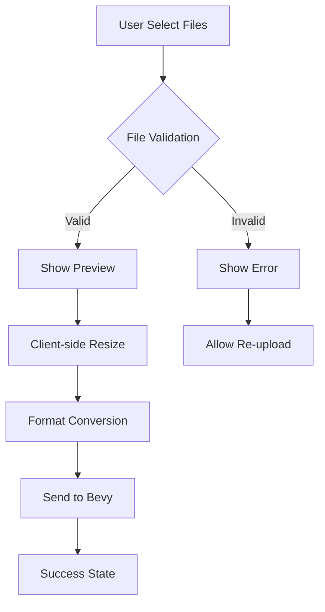
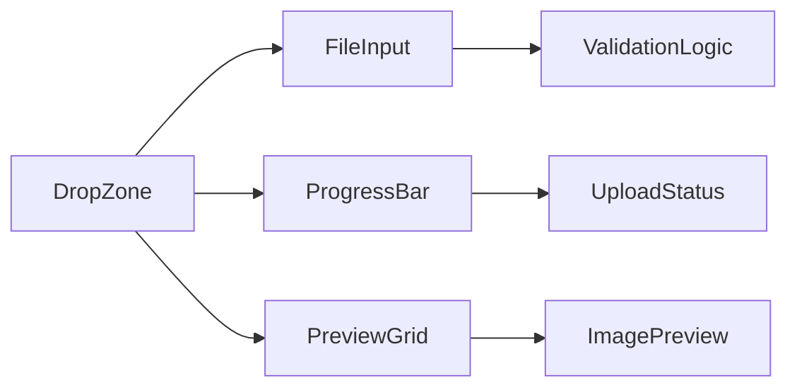
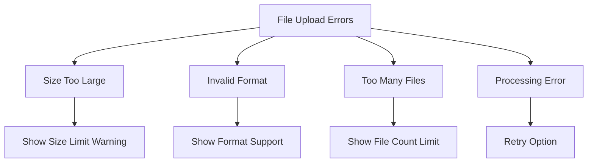

# Bài 4: Xử Lý File Upload và Image Processing

## Mục Tiêu Bài Học

<div className="bg-blue-50 border-l-4 border-blue-400 p-4 mb-6">
  <h3 className="text-lg font-semibold text-blue-800 mb-2">🎯 Sau bài học này, bạn sẽ:</h3>
  <ul className="text-blue-700 space-y-1">
    <li>• Triển khai được drag & drop file upload</li>
    <li>• Thực hiện validation file types chuyên nghiệp</li>
    <li>• Hiển thị preview hình ảnh real-time</li>
    <li>• Xử lý client-side image resizing</li>
    <li>• Convert images cho Bevy engine</li>
    <li>• Implement error handling và loading states</li>
  </ul>
</div>

## I. Tổng Quan Về File Processing Pipeline



## II. Thiết Lập File Types và Validation

### Bảng Hỗ Trợ File Formats

| Format | MIME Type | Kích Thước Max | Bevy Support | Ghi Chú |
|--------|-----------|----------------|--------------|---------|
| JPEG | image/jpeg | 10MB | ✅ | Tối ưu cho photos |
| PNG | image/png | 15MB | ✅ | Hỗ trợ transparency |
| WebP | image/webp | 12MB | ✅ | Modern format |
| GIF | image/gif | 5MB | ⚠️ | Static only |
| BMP | image/bmp | 20MB | ❌ | Convert required |

### TypeScript Interfaces

```typescript
// types/upload.ts
export interface ImageFile {
  id: string;
  file: File;
  preview: string;
  status: 'uploading' | 'processing' | 'ready' | 'error';
  dimensions: {
    width: number;
    height: number;
  };
  processedData?: ArrayBuffer;
}

export interface UploadConfig {
  maxFiles: number;
  maxSize: number;
  acceptedTypes: string[];
  autoResize: boolean;
  targetResolution: {
    maxWidth: number;
    maxHeight: number;
  };
}
```

## III. Drag & Drop Upload Component

### Cấu Trúc Component



### Implementation

```typescript
'use client';

import { useState, useCallback, useRef } from 'react';
import { useDropzone } from 'react-dropzone';

interface FileUploadProps {
  onFilesProcessed: (files: ImageFile[]) => void;
  maxFiles?: number;
}

export default function FileUpload({ onFilesProcessed, maxFiles = 30 }: FileUploadProps) {
  const [uploadedFiles, setUploadedFiles] = useState<ImageFile[]>([]);
  const [isProcessing, setIsProcessing] = useState(false);
  const canvasRef = useRef<HTMLCanvasElement>(null);

  const config: UploadConfig = {
    maxFiles,
    maxSize: 15 * 1024 * 1024, // 15MB
    acceptedTypes: ['image/jpeg', 'image/jpg', 'image/png', 'image/webp'],
    autoResize: true,
    targetResolution: {
      maxWidth: 2048,
      maxHeight: 2048
    }
  };

  const onDrop = useCallback(async (acceptedFiles: File[]) => {
    setIsProcessing(true);
    
    try {
      const processedFiles = await Promise.all(
        acceptedFiles.map(file => processFile(file, config))
      );
      
      setUploadedFiles(prev => [...prev, ...processedFiles]);
      onFilesProcessed(processedFiles);
    } catch (error) {
      console.error('File processing error:', error);
    } finally {
      setIsProcessing(false);
    }
  }, [onFilesProcessed]);

  const { getRootProps, getInputProps, isDragActive } = useDropzone({
    onDrop,
    accept: {
      'image/*': ['.jpeg', '.jpg', '.png', '.webp']
    },
    maxFiles: config.maxFiles,
    maxSize: config.maxSize
  });

  return (
    <div className="w-full max-w-4xl mx-auto">
      <div
        {...getRootProps()}
        className={`
          border-2 border-dashed rounded-lg p-8 text-center cursor-pointer
          transition-colors duration-200
          ${isDragActive 
            ? 'border-blue-400 bg-blue-50' 
            : 'border-gray-300 hover:border-gray-400'
          }
        `}
      >
        <input {...getInputProps()} />
        <div className="space-y-4">
          <svg className="w-12 h-12 mx-auto text-gray-400" fill="none" viewBox="0 0 24 24" stroke="currentColor">
            <path strokeLinecap="round" strokeLinejoin="round" strokeWidth={2} d="M7 16a4 4 0 01-.88-7.903A5 5 0 1115.9 6L16 6a5 5 0 011 9.9M15 13l-3-3m0 0l-3 3m3-3v12" />
          </svg>
          <div>
            <p className="text-lg font-medium text-gray-900">
              {isDragActive ? 'Thả file vào đây...' : 'Kéo thả file hoặc click để chọn'}
            </p>
            <p className="text-sm text-gray-500 mt-2">
              Hỗ trợ JPEG, PNG, WebP • Tối đa {maxFiles} files • Mỗi file &lt; 15MB
            </p>
          </div>
        </div>
      </div>

      {isProcessing && (
        <div className="mt-4 p-4 bg-yellow-50 rounded-lg">
          <div className="flex items-center space-x-3">
            <div className="animate-spin w-5 h-5 border-2 border-yellow-600 border-t-transparent rounded-full"></div>
            <span className="text-yellow-700">Đang xử lý files...</span>
          </div>
        </div>
      )}

      <PreviewGrid files={uploadedFiles} onRemove={removeFile} />
    </div>
  );
}
```

## IV. File Processing Logic

### Image Processing Functions

```typescript
// utils/imageProcessor.ts
export async function processFile(file: File, config: UploadConfig): Promise<ImageFile> {
  const id = crypto.randomUUID();
  
  // Validate file
  if (!validateFile(file, config)) {
    throw new Error(`Invalid file: ${file.name}`);
  }

  // Create preview URL
  const preview = URL.createObjectURL(file);
  
  // Get image dimensions
  const dimensions = await getImageDimensions(file);
  
  // Resize if needed
  const processedData = config.autoResize 
    ? await resizeImage(file, config.targetResolution)
    : await fileToArrayBuffer(file);

  return {
    id,
    file,
    preview,
    status: 'ready',
    dimensions,
    processedData
  };
}

function validateFile(file: File, config: UploadConfig): boolean {
  // Check file type
  if (!config.acceptedTypes.includes(file.type)) {
    throw new Error(`Unsupported file type: ${file.type}`);
  }
  
  // Check file size
  if (file.size > config.maxSize) {
    throw new Error(`File too large: ${(file.size / 1024 / 1024).toFixed(1)}MB`);
  }
  
  return true;
}

async function getImageDimensions(file: File): Promise<{width: number, height: number}> {
  return new Promise((resolve, reject) => {
    const img = new Image();
    img.onload = () => {
      resolve({
        width: img.naturalWidth,
        height: img.naturalHeight
      });
      URL.revokeObjectURL(img.src);
    };
    img.onerror = reject;
    img.src = URL.createObjectURL(file);
  });
}
```

### Client-side Image Resizing

```typescript
async function resizeImage(
  file: File, 
  targetResolution: {maxWidth: number, maxHeight: number}
): Promise<ArrayBuffer> {
  return new Promise((resolve, reject) => {
    const canvas = document.createElement('canvas');
    const ctx = canvas.getContext('2d');
    const img = new Image();

    img.onload = () => {
      const { width, height } = calculateNewDimensions(
        img.naturalWidth, 
        img.naturalHeight,
        targetResolution
      );

      canvas.width = width;
      canvas.height = height;

      ctx?.drawImage(img, 0, 0, width, height);

      canvas.toBlob((blob) => {
        if (blob) {
          blob.arrayBuffer().then(resolve).catch(reject);
        } else {
          reject(new Error('Canvas to blob conversion failed'));
        }
      }, 'image/jpeg', 0.9);

      URL.revokeObjectURL(img.src);
    };

    img.onerror = reject;
    img.src = URL.createObjectURL(file);
  });
}

function calculateNewDimensions(
  originalWidth: number,
  originalHeight: number,
  target: {maxWidth: number, maxHeight: number}
): {width: number, height: number} {
  const aspectRatio = originalWidth / originalHeight;

  let width = originalWidth;
  let height = originalHeight;

  if (width > target.maxWidth) {
    width = target.maxWidth;
    height = width / aspectRatio;
  }

  if (height > target.maxHeight) {
    height = target.maxHeight;
    width = height * aspectRatio;
  }

  return {
    width: Math.round(width),
    height: Math.round(height)
  };
}
```

## V. Preview Grid Component

### Layout Design Map

| Grid Size | Columns | Item Size | Responsive |
|-----------|---------|-----------|------------|
| Mobile | 2 | 150px | sm:grid-cols-2 |
| Tablet | 3 | 180px | md:grid-cols-3 |
| Desktop | 4 | 200px | lg:grid-cols-4 |
| Large | 5 | 220px | xl:grid-cols-5 |

```typescript
interface PreviewGridProps {
  files: ImageFile[];
  onRemove: (id: string) => void;
}

export default function PreviewGrid({ files, onRemove }: PreviewGridProps) {
  if (files.length === 0) return null;

  return (
    <div className="mt-6">
      <h3 className="text-lg font-semibold mb-4">
        Hình ảnh đã upload ({files.length})
      </h3>
      
      <div className="grid grid-cols-2 md:grid-cols-3 lg:grid-cols-4 xl:grid-cols-5 gap-4">
        {files.map((imageFile) => (
          <ImagePreviewCard
            key={imageFile.id}
            imageFile={imageFile}
            onRemove={onRemove}
          />
        ))}
      </div>
    </div>
  );
}

function ImagePreviewCard({ imageFile, onRemove }: {
  imageFile: ImageFile;
  onRemove: (id: string) => void;
}) {
  const getStatusColor = (status: ImageFile['status']) => {
    const colors = {
      uploading: 'border-yellow-400 bg-yellow-50',
      processing: 'border-blue-400 bg-blue-50',
      ready: 'border-green-400 bg-green-50',
      error: 'border-red-400 bg-red-50'
    };
    return colors[status];
  };

  return (
    <div className={`
      relative rounded-lg overflow-hidden border-2 transition-colors
      ${getStatusColor(imageFile.status)}
    `}>
      <div className="aspect-square">
        
      </div>
      
      {/* Overlay with info */}
      <div className="absolute inset-0 bg-black bg-opacity-0 hover:bg-opacity-50 transition-opacity">
        <div className="absolute top-2 right-2">
          <button
            onClick={() => onRemove(imageFile.id)}
            className="w-6 h-6 bg-red-500 text-white rounded-full text-xs hover:bg-red-600 transition-colors"
          >
            ×
          </button>
        </div>
        
        <div className="absolute bottom-0 left-0 right-0 p-2 text-white text-xs">
          <div className="truncate">{imageFile.file.name}</div>
          <div className="text-gray-300">
            {imageFile.dimensions.width} × {imageFile.dimensions.height}
          </div>
        </div>
      </div>

      {/* Status indicator */}
      {imageFile.status !== 'ready' && (
        <div className="absolute inset-0 flex items-center justify-center bg-white bg-opacity-80">
          {imageFile.status === 'uploading' && (
            <div className="text-center">
              <div className="animate-spin w-6 h-6 border-2 border-yellow-600 border-t-transparent rounded-full mx-auto mb-2"></div>
              <div className="text-sm text-yellow-700">Uploading...</div>
            </div>
          )}
          {imageFile.status === 'processing' && (
            <div className="text-center">
              <div className="animate-pulse w-6 h-6 bg-blue-600 rounded-full mx-auto mb-2"></div>
              <div className="text-sm text-blue-700">Processing...</div>
            </div>
          )}
          {imageFile.status === 'error' && (
            <div className="text-center">
              <div className="w-6 h-6 bg-red-600 rounded-full mx-auto mb-2">!</div>
              <div className="text-sm text-red-700">Error</div>
            </div>
          )}
        </div>
      )}
    </div>
  );
}
```

## VI. Error Handling và Loading States

### Error Types Map



### Error Handling Implementation

```typescript
// hooks/useFileUpload.ts
export function useFileUpload() {
  const [errors, setErrors] = useState<UploadError[]>([]);
  const [isLoading, setIsLoading] = useState(false);

  const addError = (error: UploadError) => {
    setErrors(prev => [...prev, { ...error, id: Date.now().toString() }]);
  };

  const removeError = (id: string) => {
    setErrors(prev => prev.filter(error => error.id !== id));
  };

  const clearErrors = () => setErrors([]);

  return {
    errors,
    addError,
    removeError,
    clearErrors,
    isLoading,
    setIsLoading
  };
}

interface UploadError {
  id: string;
  type: 'size' | 'format' | 'count' | 'processing';
  message: string;
  fileName?: string;
}
```

### Progress Tracking Component

```typescript
export function UploadProgress({ files }: { files: ImageFile[] }) {
  const totalFiles = files.length;
  const readyFiles = files.filter(f => f.status === 'ready').length;
  const errorFiles = files.filter(f => f.status === 'error').length;
  const progress = totalFiles > 0 ? (readyFiles / totalFiles) * 100 : 0;

  if (totalFiles === 0) return null;

  return (
    <div className="mt-4 p-4 border rounded-lg">
      <div className="flex justify-between text-sm mb-2">
        <span>Tiến độ xử lý</span>
        <span>{readyFiles}/{totalFiles} files</span>
      </div>
      
      <div className="w-full bg-gray-200 rounded-full h-2">
        <div 
          className="bg-blue-600 h-2 rounded-full transition-all duration-300"
          style={{ width: `${progress}%` }}
        ></div>
      </div>
      
      {errorFiles > 0 && (
        <div className="text-red-600 text-sm mt-2">
          {errorFiles} file(s) gặp lỗi
        </div>
      )}
    </div>
  );
}
```

## VII. Integration với Bevy Engine

### Data Format Conversion

| Bevy Format | JavaScript | Conversion | Performance |
|-------------|------------|------------|-------------|
| Vec&lt;u8&gt; | ArrayBuffer | Direct copy | ⚡ Fast |
| ImageFormat::Jpeg | Blob | encode() | 🔄 Medium |
| Texture2D | Canvas | getImageData() | 🐌 Slow |

```typescript
// utils/bevyIntegration.ts
export function prepareForBevy(imageFile: ImageFile): BevyImageData {
  if (!imageFile.processedData) {
    throw new Error('Image not processed yet');
  }

  return {
    id: imageFile.id,
    data: new Uint8Array(imageFile.processedData),
    width: imageFile.dimensions.width,
    height: imageFile.dimensions.height,
    format: detectImageFormat(imageFile.file.type)
  };
}

function detectImageFormat(mimeType: string): string {
  const formatMap: Record<string, string> = {
    'image/jpeg': 'Jpeg',
    'image/png': 'Png',
    'image/webp': 'WebP'
  };
  
  return formatMap[mimeType] || 'Jpeg';
}
```

## VIII. Performance Optimization

### Optimization Checklist

<div className="bg-green-50 border border-green-200 rounded-lg p-4">
  <h4 className="font-semibold text-green-800 mb-3">⚡ Performance Best Practices</h4>
  <div className="space-y-2 text-green-700">
    <div className="flex items-center space-x-2">
      <span className="text-green-500">✓</span>
      <span>Lazy load preview images</span>
    </div>
    <div className="flex items-center space-x-2">
      <span className="text-green-500">✓</span>
      <span>Use Web Workers for heavy processing</span>
    </div>
    <div className="flex items-center space-x-2">
      <span className="text-green-500">✓</span>
      <span>Implement virtual scrolling for large lists</span>
    </div>
    <div className="flex items-center space-x-2">
      <span className="text-green-500">✓</span>
      <span>Cache processed images</span>
    </div>
    <div className="flex items-center space-x-2">
      <span className="text-green-500">✓</span>
      <span>Cleanup object URLs</span>
    </div>
  </div>
</div>

### Memory Management

```typescript
// Cleanup function
export function cleanupImageFiles(files: ImageFile[]) {
  files.forEach(imageFile => {
    if (imageFile.preview) {
      URL.revokeObjectURL(imageFile.preview);
    }
  });
}

// Use in component cleanup
useEffect(() => {
  return () => {
    cleanupImageFiles(uploadedFiles);
  };
}, [uploadedFiles]);
```

## IX. Bài Tập Thực Hành

### Bài Tập 1: Basic Upload

<div className="border-l-4 border-blue-400 pl-4 py-2 mb-4">
  <h4 className="font-semibold text-gray-800">📝 Nhiệm vụ:</h4>
  <p className="text-gray-600 mt-1">Tạo component upload hỗ trợ drag & drop với validation cơ bản</p>
</div>

**Yêu cầu:**
- Hỗ trợ JPEG, PNG files
- Giới hạn 5MB per file
- Hiển thị preview grid
- Error handling cơ bản

### Bài Tập 2: Advanced Features

<div className="border-l-4 border-orange-400 pl-4 py-2 mb-4">
  <h4 className="font-semibold text-gray-800">🚀 Nâng cao:</h4>
  <p className="text-gray-600 mt-1">Thêm tính năng resize và progress tracking</p>
</div>

**Yêu cầu:**
- Auto-resize images > 1920px
- Progress bar cho từng file
- Batch operations (remove all, clear)
- File metadata display

## X. Tổng Kết

### Kiến Thức Đã Học

| Chủ Đề | Kỹ Năng | Ứng Dụng |
|--------|---------|----------|
| File Upload | Drag & Drop, Validation | User Experience |
| Image Processing | Resize, Format Convert | Performance |
| Error Handling | User Feedback | Reliability |
| State Management | React Hooks | Code Organization |

### Chuẩn Bị Bài Tiếp Theo

<div className="bg-purple-50 border border-purple-200 rounded-lg p-4 mt-6">
  <h4 className="font-semibold text-purple-800 mb-2">🔮 Bài 5: Khởi Tạo Bevy Canvas</h4>
  <p className="text-purple-700">Chúng ta sẽ tích hợp uploaded images vào Bevy rendering pipeline và tạo interactive canvas.</p>
</div>

### Checklist Hoàn Thành

- [ ] Drag & drop upload working
- [ ] File validation implemented  
- [ ] Preview grid responsive
- [ ] Error handling comprehensive
- [ ] Progress tracking functional
- [ ] Performance optimized
- [ ] Ready for Bevy integration