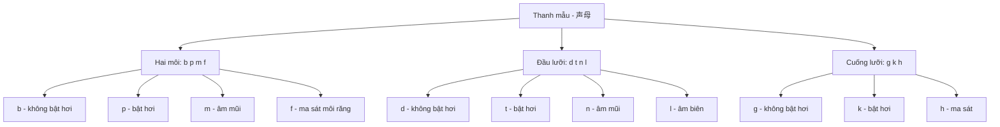
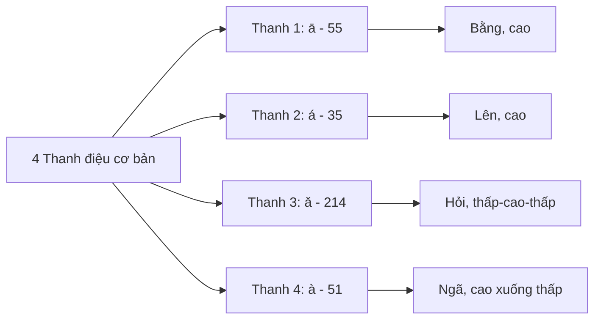
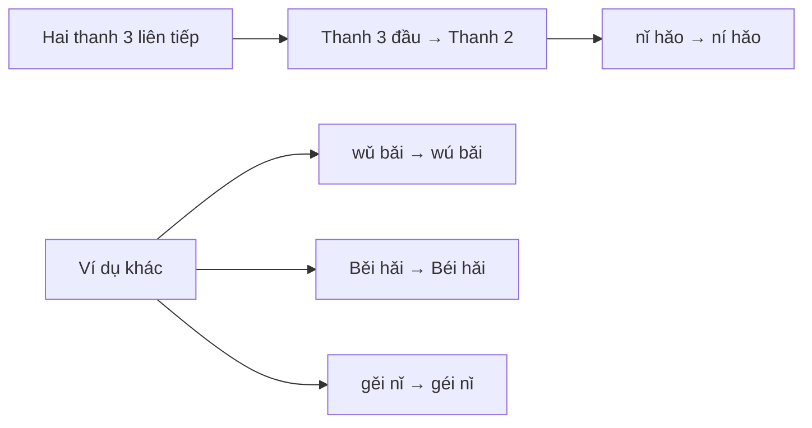
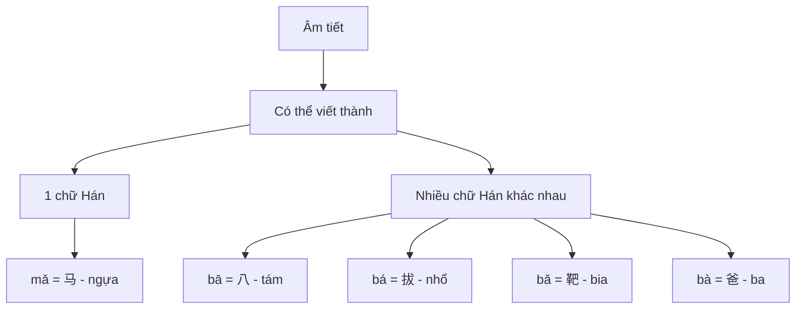
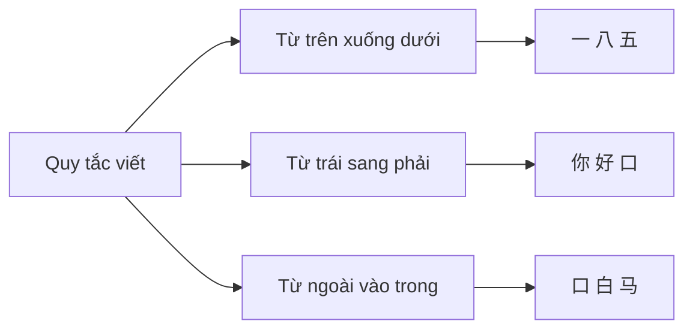
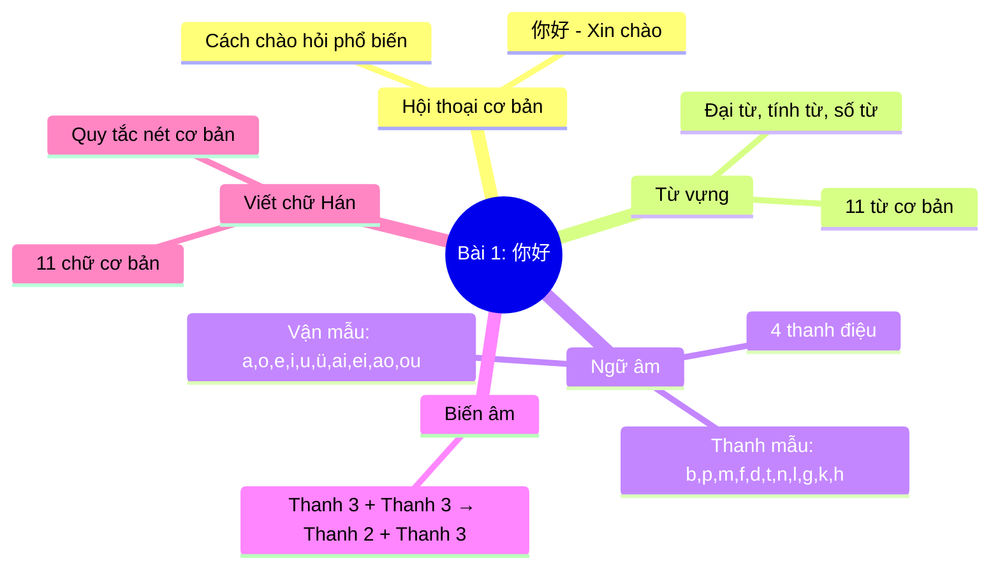

# Bài 1: 你好 (Xin Chào)

## Giáo trình Tiếng Trung Sơ Cấp 1 cho người Việt Nam

---

## I. BÀI ĐỌC (课文 - Kèwén)

  <h3 className="text-lg font-semibold text-blue-700 mb-2">Hội thoại cơ bản</h3>
  

    

      A:
      你好！
      Nǐ hǎo!
    

    

      B:
      你好！
      Nǐ hǎo!
    

  

**Ý nghĩa:** Đây là cách chào hỏi cơ bản và phổ biến nhất trong tiếng Trung, tương đương với "Xin chào" trong tiếng Việt.

---

## II. TỪ VỰNG (生词 - Shēngcí)

### Bảng từ vựng bài 1

| STT | Chữ Hán | Pinyin | Từ loại          | Nghĩa tiếng Việt                 | Ví dụ  |
| --- | ------- | ------ | ---------------- | -------------------------------- | ------ |
| 1   | 你      | nǐ     | đại từ           | anh, chị, bạn (ngôi thứ 2 số ít) | 你好   |
| 2   | 好      | hǎo    | tính từ          | tốt, dùng để chào                | 你好   |
| 3   | 一      | yī     | số từ            | một                              | 一个人 |
| 4   | 五      | wǔ     | số từ            | năm                              | 五个   |
| 5   | 八      | bā     | số từ            | tám                              | 八月   |
| 6   | 大      | dà     | tính từ          | lớn                              | 大学   |
| 7   | 不      | bù     | phó từ           | không                            | 不好   |
| 8   | 口      | kǒu    | danh từ/lượng từ | miệng                            | 一口水 |
| 9   | 白      | bái    | tính từ          | trắng                            | 白色   |
| 10  | 女      | nǚ     | tính từ          | nữ                               | 女人   |
| 11  | 马      | mǎ     | danh từ          | ngựa                             | 一匹马 |

  <h4 className="font-semibold text-purple-700 mb-2">💡 Lưu ý quan trọng:</h4>
  

    <strong>你好 (nǐ hǎo)</strong> là cụm từ cố định dùng để chào hỏi. Từ "好" ở đây không mang nghĩa "tốt" mà là một phần của lời chào.
  

---

## III. NGỮ ÂM (语音 - Yǔyīn)

### 1. Thanh mẫu (声母 - Shēngmǔ)

### 2. Vận mẫu (韵母 - Yùnmǔ)

  

    <h4 className="font-semibold text-blue-600 mb-3">Vận mẫu đơn</h4>
    

      
<strong>a [A]:</strong> miệng mở lớn nhất, lưỡi hạ thấp

      
<strong>o [o]:</strong> miệng mở vừa, môi tròn

      
<strong>e [γ]:</strong> miệng mở vừa, môi không tròn

      
<strong>i [i]:</strong> miệng mở nhỏ nhất, môi bẹt

      
<strong>u [u]:</strong> miệng mở nhỏ, môi tròn nhất

      
<strong>ü [y]:</strong> như [i] nhưng môi tròn

    

  

  
  

    <h4 className="font-semibold text-green-600 mb-3">Vận mẫu ghép</h4>
    

      
<strong>ai [ai]:</strong> từ [a] trượt sang [i]

      
<strong>ei [ei]:</strong> từ [e] trượt sang [i]

      
<strong>ao [ao]:</strong> từ [a] trượt sang [o]

      
<strong>ou [ou]:</strong> từ [o] trượt sang [u]

    

  

### 3. Bảng phiên âm cơ bản

| Thanh mẫu | a   | o   | e   | i   | u     | ai  | ei  | ao  | ou  |
| --------- | --- | --- | --- | --- | ----- | --- | --- | --- | --- |
| **b**     | ba  | bo  |     | bi  | bu    | bai | bei | bao |     |
| **p**     | pa  | po  |     | pi  | pu    | pai | pei | pao | pou |
| **m**     | ma  | mo  | me  | mi  | mu    | mai | mei | mao | mou |
| **f**     | fa  | fo  |     |     | fu    |     | fei |     | fou |
| **d**     | da  |     | de  | di  | du    | dai | dei | dao | dou |
| **t**     | ta  |     | te  | ti  | tu    | tai |     | tao | tou |
| **n**     | na  |     | ne  | ni  | nu/nü | nai | nei | nao | nou |
| **l**     | la  |     | le  | li  | lu/lü | lai | lei | lao | lou |
| **g**     | ga  |     | ge  |     | gu    | gai | gei | gao | gou |
| **k**     | ka  |     | ke  |     | ku    | kai | kei | kao | kou |
| **h**     | ha  |     | he  |     | hu    | hai | hei | hao | hou |

---

## IV. THANH ĐIỆU (声调 - Shēngdiào)

### Ví dụ minh họa thanh điệu

  <table className="min-w-full border-collapse border border-gray-300">
    <thead>
      <tr className="border border-gray-300">
        <th className="border border-gray-300 px-4 py-2">Thanh điệu</th>
        <th className="border border-gray-300 px-4 py-2">Ký hiệu</th>
        <th className="border border-gray-300 px-4 py-2">Ví dụ 1</th>
        <th className="border border-gray-300 px-4 py-2">Ví dụ 2</th>
        <th className="border border-gray-300 px-4 py-2">Ví dụ 3</th>
      </tr>
    </thead>
    <tbody>
      <tr className="border border-gray-300">
        <td className="border border-gray-300 px-4 py-2 font-semibold">Thanh 1</td>
        <td className="border border-gray-300 px-4 py-2">¯</td>
        <td className="border border-gray-300 px-4 py-2">bā 八 (tám)</td>
        <td className="border border-gray-300 px-4 py-2">mā 妈 (mẹ)</td>
        <td className="border border-gray-300 px-4 py-2">yī 一 (một)</td>
      </tr>
      <tr className="border border-gray-300">
        <td className="border border-gray-300 px-4 py-2 font-semibold">Thanh 2</td>
        <td className="border border-gray-300 px-4 py-2">´</td>
        <td className="border border-gray-300 px-4 py-2">bá 拔 (nhổ)</td>
        <td className="border border-gray-300 px-4 py-2">má 麻 (tê)</td>
        <td className="border border-gray-300 px-4 py-2">yí 移 (dời)</td>
      </tr>
      <tr className="border border-gray-300">
        <td className="border border-gray-300 px-4 py-2 font-semibold">Thanh 3</td>
        <td className="border border-gray-300 px-4 py-2">ˇ</td>
        <td className="border border-gray-300 px-4 py-2">bǎ 靶 (bia)</td>
        <td className="border border-gray-300 px-4 py-2">mǎ 马 (ngựa)</td>
        <td className="border border-gray-300 px-4 py-2">yǐ 椅 (ghế)</td>
      </tr>
      <tr className="border border-gray-300">
        <td className="border border-gray-300 px-4 py-2 font-semibold">Thanh 4</td>
        <td className="border border-gray-300 px-4 py-2">`</td>
        <td className="border border-gray-300 px-4 py-2">bà 爸 (ba)</td>
        <td className="border border-gray-300 px-4 py-2">mà 骂 (mắng)</td>
        <td className="border border-gray-300 px-4 py-2">yì 亿 (100 triệu)</td>
      </tr>
    </tbody>
  </table>

### Quy tắc đánh dấu thanh điệu

  <h4 className="font-semibold text-orange-700 mb-2">📝 Quy tắc quan trọng:</h4>
  <ol className="list-decimal list-inside space-y-1 text-gray-700">
    <li>Dấu thanh điệu đánh trên nguyên âm chính</li>
    <li>Khi có nguyên âm <strong>i</strong>, bỏ dấu chấm: nǐ, bí</li>
    <li>Khi có nhiều nguyên âm, đánh dấu trên nguyên âm mở miệng nhất: hǎo, mèi, lóu</li>
  </ol>

---

## V. QUY TẮC BIẾN ÂM

### Biến âm thanh 3

**Quy tắc:** Khi hai âm tiết mang thanh 3 đọc liền nhau, thanh 3 thứ nhất đọc thành thanh 2.

---

## VI. QUY TẮC VIẾT

### 1. Viết âm tiết độc lập

  

    
i → yi

    
khi đứng độc lập

  

  

    
u → wu

    
khi đứng độc lập

  

  

    
ü → yu

    
khi đứng độc lập

  

### 2. Mối quan hệ âm tiết và chữ Hán

---

## VII. BÀI TẬP LUYỆN TẬP

### Bài tập 1: Luyện thanh điệu

  <h4 className="font-semibold text-indigo-700 mb-3">🎵 Đọc theo từng hàng ngang</h4>
  
  **Nhóm 1:**
  - yī - yí - yǐ - yì
  - wū - wú - wǔ - wù  
  - yū - yú - yǔ - yù
  
  **Nhóm 2:**
  - bā - bá - bǎ - bà (八 - tám)
  - dā - dá - dǎ - dà (大 - lớn)
  - bū - bú - bǔ - bù (不 - không)
  
  **Nhóm 3:**
  - nū - nú - nǔ - nù (女 - nữ)
  - kōu - kóu - kǒu - kòu (口 - miệng)
  - bāi - bái - bǎi - bài (白 - trắng)

### Bài tập 2: Luyện biến âm

  <h4 className="font-semibold text-green-700 mb-3">🔄 Thực hành biến âm thanh 3</h4>
  
  | Viết | Đọc | Nghĩa |
  |------|-----|--------|
  | nǐ hǎo | ní hǎo | xin chào |
  | wǔ bǎi | wú bǎi | năm trăm |
  | Běi hǎi | Béi hǎi | Bắc Hải |
  | gěi nǐ | géi nǐ | cho bạn |

### Bài tập 3: Phân biệt âm

  

    <h4 className="font-semibold text-red-600 mb-3">Phân biệt thanh mẫu</h4>
    

      
<strong>b - p:</strong> ba/pa, bu/pu, bai/pai, bao/pao

      
<strong>d - t:</strong> da/ta, du/tu, dai/tai, dou/tou

      
<strong>g - k:</strong> ga/ka, gu/ku, gai/kai, gao/kao

    

  

  
  

    <h4 className="font-semibold text-blue-600 mb-3">Phân biệt vận mẫu</h4>
    

      
<strong>a - o:</strong> ba/bo, ma/mo, fa/fo

      
<strong>ai - ei:</strong> bai/bei, mai/mei, gai/gei

      
<strong>ao - ou:</strong> pao/pou, hao/hou, gao/gou

    

  

### Bài tập 4: Đọc từ và cụm từ

  <h4 className="font-semibold text-purple-700 mb-3">📖 Thực hành đọc</h4>
  
  **Từ đơn:**
  - 一 (yī) - một
  - 五 (wǔ) - năm  
  - 八 (bā) - tám
  - 大 (dà) - lớn
  - 不 (bù) - không
  - 口 (kǒu) - miệng
  - 白 (bái) - trắng
  - 女 (nǚ) - nữ
  - 马 (mǎ) - ngựa
  - 好 (hǎo) - tốt
  
  **Cụm từ:**
  - 你好 (nǐ hǎo) - xin chào
  - 不好 (bù hǎo) - không tốt
  - 大马 (dà mǎ) - ngựa lớn
  - 白马 (bái mǎ) - ngựa trắng

---

## VIII. TẬP VIẾT CHỮ HÁN

### Thứ tự nét cơ bản

  <h4 className="font-semibold text-gray-800 mb-4">🖊️ Luyện viết các chữ Hán cơ bản:</h4>
  

    

      
一

      
yī - một

    

    

      
五

      
wǔ - năm

    

    

      
八

      
bā - tám

    

    

      
大

      
dà - lớn

    

    

      
不

      
bù - không

    

    

      
口

      
kǒu - miệng

    

    

      
白

      
bái - trắng

    

    

      
女

      
nǚ - nữ

    

    

      
你

      
nǐ - bạn

    

    

      
好

      
hǎo - tốt

    

    

      
马

      
mǎ - ngựa

    

  

---

## IX. TÓM TẮT BÀI HỌC

### Mục tiêu đạt được sau bài 1:

  <h4 className="font-semibold text-green-700 mb-2">✅ Sau bài học này, học viên có thể:</h4>
  <ul className="list-disc list-inside space-y-1 text-gray-700">
    <li>Sử dụng "你好" để chào hỏi trong các tình huống đơn giản</li>
    <li>Nhận biết và phát âm chính xác 11 thanh mẫu cơ bản</li>
    <li>Phân biệt và phát âm 4 thanh điệu chính xác</li>
    <li>Áp dụng quy tắc biến âm thanh 3</li>
    <li>Viết được 11 chữ Hán cơ bản theo đúng thứ tự nét</li>
    <li>Đọc và hiểu nghĩa của 11 từ vựng cơ bản</li>
  </ul>

---

## X. BÀI TẬP VỀ NHÀ

  <h4 className="font-semibold text-orange-700 mb-3">📚 Nhiệm vụ học tập tại nhà:</h4>
  
  

    

      <strong>1. Luyện phát âm (15 phút/ngày):</strong>
      

        
• Đọc bảng thanh điệu 3 lần

        
• Luyện biến âm với các cụm từ đã học

      

    

    
    

      <strong>2. Viết chữ Hán (10 phút/ngày):</strong>
      

        
• Mỗi chữ viết 10 lần theo đúng thứ tự nét

        
• Ghi nhớ nghĩa của từng chữ

      

    

    
    

      <strong>3. Ứng dụng thực tế:</strong>
      

        
• Thực hành chào "你好" với ít nhất 3 người mỗi ngày

        
• Ghi âm bản thân đọc toàn bộ từ vựng bài 1

      

    

  

---

_Chúc các bạn học tập hiệu quả và thành công với bài đầu tiên trong hành trình chinh phục tiếng Trung!_ 🎯
