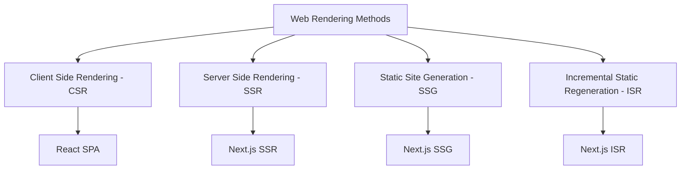
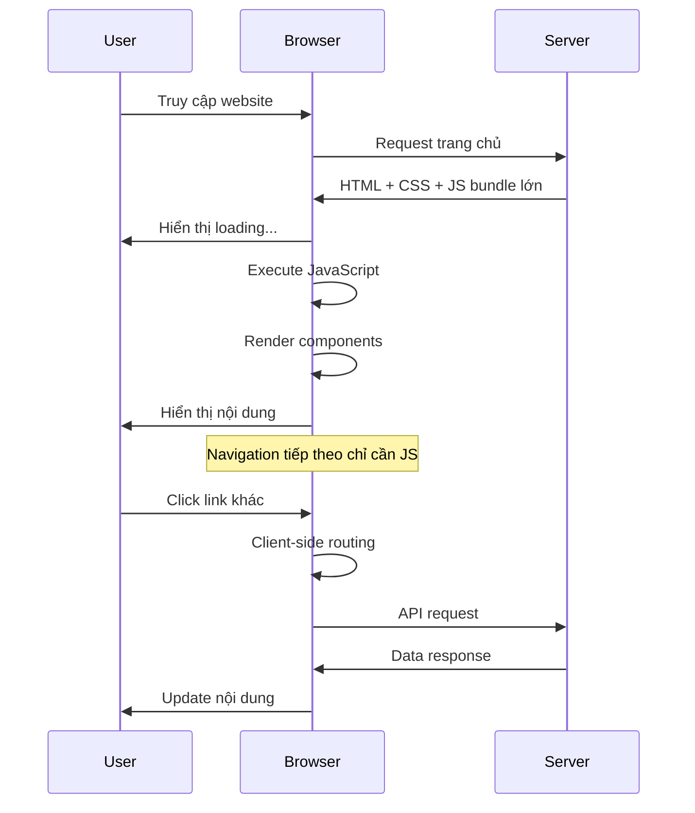
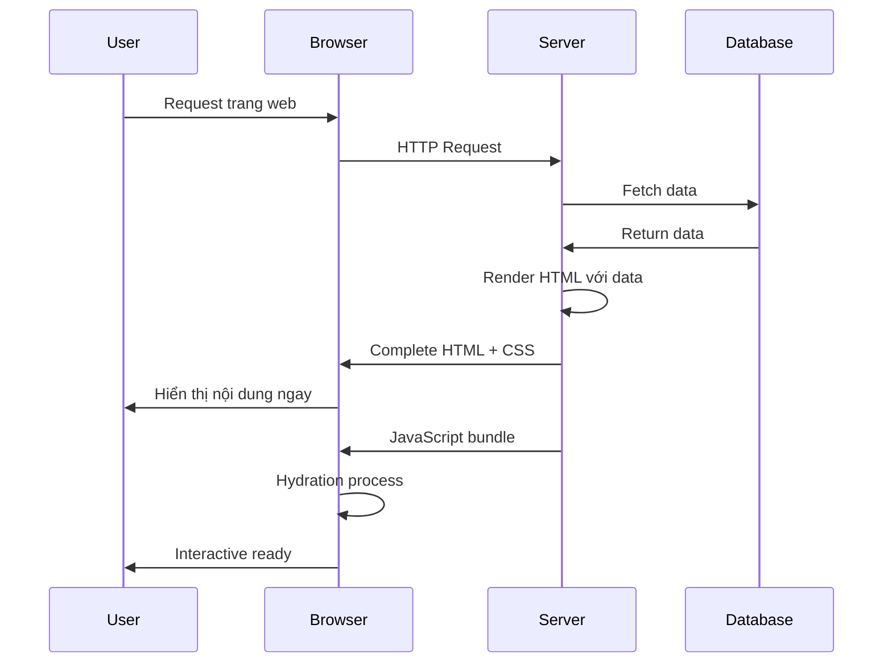
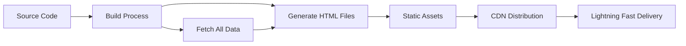
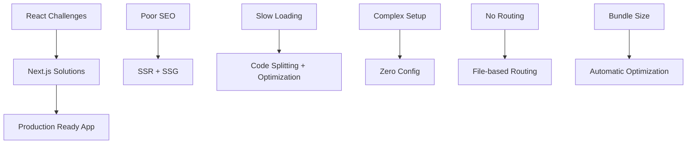
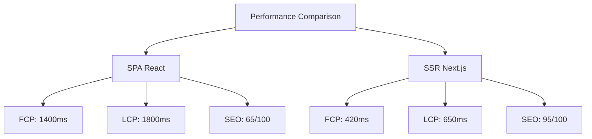

# Bài 3: SPA vs SSR và Giới thiệu Next.js

<div className="p-6 rounded-lg border-2 border-blue-500 mb-8">
  <h2 className="text-2xl font-bold text-blue-800 mb-4">🎯 Mục tiêu học tập</h2>
  <ul className="text-blue-700 space-y-2">
    <li>✅ Hiểu rõ sự khác biệt giữa SPA, SSR, CSR và SSG</li>
    <li>✅ Nắm vững lợi ích và hạn chế của từng phương pháp</li>
    <li>✅ Tìm hiểu tại sao Next.js ra đời và giá trị nó mang lại</li>
    <li>✅ So sánh Next.js với các framework khác</li>
  </ul>
</div>

## 1. Tổng quan các phương pháp Rendering

### 1.1 Sơ đồ tổng quan



### 1.2 Bảng so sánh tổng quan

| Phương pháp | Thời gian tải ban đầu | SEO     | UX sau tải | Phức tạp   | Phù hợp với       |
| ----------- | --------------------- | ------- | ---------- | ---------- | ----------------- |
| **SPA/CSR** | Chậm                  | Kém     | Tuyệt vời  | Đơn giản   | Dashboard, Admin  |
| **SSR**     | Nhanh                 | Tốt     | Tốt        | Phức tạp   | E-commerce, Blog  |
| **SSG**     | Rất nhanh             | Rất tốt | Tốt        | Trung bình | Landing page, Doc |
| **ISR**     | Rất nhanh             | Rất tốt | Tốt        | Phức tạp   | News, CMS         |

## 2. Single Page Application (SPA) - Client Side Rendering

<div className="border-l-8 border-green-500 pl-6 py-4 rounded-r-lg mb-6 border border-green-400">
  <h3 className="text-lg font-semibold text-green-800 mb-2">💡 Khái niệm SPA</h3>
  <p className="text-green-700">SPA là ứng dụng web chỉ tải một trang HTML duy nhất và dinamically cập nhật nội dung khi người dùng tương tác.</p>
</div>

### 2.1 Quy trình hoạt động của SPA



### 2.2 Ưu và nhược điểm của SPA

<div className="grid grid-cols-1 md:grid-cols-2 gap-6 mb-6">
  <div className="p-4 rounded-lg border-2 border-green-400 shadow-md">
    <h4 className="font-semibold text-green-800 mb-3 text-center">Ưu điểm ✅</h4>
    <ul className="text-green-700 space-y-2 text-sm">
      <li>• UX mượt mà sau khi tải</li>
      <li>• Giảm băng thông server</li>
      <li>• Dễ cache tài nguyên</li>
      <li>• Phát triển nhanh</li>
      <li>• Offline support tốt</li>
    </ul>
  </div>
  
  <div className="p-4 rounded-lg border-2 border-red-400 shadow-md">
    <h4 className="font-semibold text-red-800 mb-3 text-center">Nhược điểm ❌</h4>
    <ul className="text-red-700 space-y-2 text-sm">
      <li>• Thời gian tải ban đầu chậm</li>
      <li>• Bundle size lớn</li>
      <li>• SEO kém</li>
      <li>• First Contentful Paint chậm</li>
      <li>• Phụ thuộc JavaScript</li>
    </ul>
  </div>
</div>

### 2.3 Ví dụ kiến trúc React SPA

```typescript
// App.tsx - SPA Structure
import { BrowserRouter, Routes, Route } from 'react-router-dom';

export default function App() {
  return (
    <BrowserRouter>
      <div className="min-h-screen">
        <Routes>
          <Route path="/" element={<HomePage />} />
          <Route path="/products" element={<ProductsPage />} />
          <Route path="/about" element={<AboutPage />} />
        </Routes>
      </div>
    </BrowserRouter>
  );
}

// Tất cả content được render bởi JavaScript
```

## 3. Server Side Rendering (SSR)

<div className="border-l-8 border-blue-500 pl-6 py-4 rounded-r-lg mb-6 border border-blue-400">
  <h3 className="text-lg font-semibold text-blue-800 mb-2">🚀 Khái niệm SSR</h3>
  <p className="text-blue-700">SSR pre-render HTML trên server cho mỗi request, gửi complete HTML về client, sau đó hydrate bằng JavaScript.</p>
</div>

### 3.1 Quy trình hoạt động của SSR



### 3.2 Lợi ích của SSR

<div className="grid grid-cols-1 md:grid-cols-2 gap-6 mb-6">
  <div className="p-4 rounded-lg shadow-md border-2 border-indigo-400">
    <h4 className="font-semibold text-indigo-800 mb-2">🎯 SEO Optimization</h4>
    <p className="text-indigo-700 text-sm">Search engine có thể crawl nội dung hoàn chỉnh ngay lập tức</p>
  </div>
  
  <div className="p-4 rounded-lg shadow-md border-2 border-purple-400">
    <h4 className="font-semibold text-purple-800 mb-2">⚡ Faster First Paint</h4>
    <p className="text-purple-700 text-sm">Người dùng thấy nội dung ngay, không cần chờ JavaScript</p>
  </div>
  
  <div className="p-4 rounded-lg shadow-md border-2 border-pink-400">
    <h4 className="font-semibold text-pink-800 mb-2">📱 Better Mobile Experience</h4>
    <p className="text-pink-700 text-sm">Hoạt động tốt trên thiết bị yếu, mạng chậm</p>
  </div>
  
  <div className="p-4 rounded-lg shadow-md border-2 border-cyan-400">
    <h4 className="font-semibold text-cyan-800 mb-2">🔗 Social Sharing</h4>
    <p className="text-cyan-700 text-sm">Meta tags được render đúng cho social media</p>
  </div>
</div>

## 4. Static Site Generation (SSG)

<div className="border-l-8 border-purple-500 pl-6 py-4 rounded-r-lg mb-6 border border-purple-400">
  <h3 className="text-lg font-semibold text-purple-800 mb-2">🏗️ Khái niệm SSG</h3>
  <p className="text-purple-700">SSG pre-render tất cả trang thành static HTML tại build time, phục vụ file HTML đã sẵn sàng.</p>
</div>

### 4.1 Build Process của SSG



### 4.2 So sánh Performance Metrics

| Metric                             | SPA    | SSR    | SSG   |
| ---------------------------------- | ------ | ------ | ----- |
| **TTFB** (Time to First Byte)      | 200ms  | 400ms  | 50ms  |
| **FCP** (First Contentful Paint)   | 1500ms | 800ms  | 300ms |
| **LCP** (Largest Contentful Paint) | 2000ms | 1200ms | 600ms |
| **CLS** (Cumulative Layout Shift)  | 0.1    | 0.05   | 0.02  |
| **FID** (First Input Delay)        | 100ms  | 80ms   | 50ms  |

## 5. Tại sao cần Next.js?

### 5.1 Vấn đề với React thuần

<div className="border-2 border-red-400 rounded-lg p-4 mb-6">
  <h4 className="text-red-800 font-semibold mb-2">🚨 Thách thức với React SPA</h4>
  <ul className="text-red-700 space-y-1 text-sm">
    <li>• SEO kém do content render phía client</li>
    <li>• Bundle size lớn, loading chậm</li>
    <li>• Cần setup phức tạp cho routing, bundling</li>
    <li>• Không có built-in performance optimization</li>
    <li>• Khó optimize cho Core Web Vitals</li>
  </ul>
</div>

### 5.2 Next.js giải quyết như thế nào



### 5.3 Tính năng chính của Next.js

| Tính năng                | Mô tả                           | Lợi ích                   |
| ------------------------ | ------------------------------- | ------------------------- |
| **Hybrid Rendering**     | SSR + SSG + CSR trong một app   | Linh hoạt cho từng trang  |
| **File-based Routing**   | Routes dựa trên cấu trúc folder | Đơn giản, trực quan       |
| **API Routes**           | Backend API trong cùng project  | Full-stack trong một repo |
| **Built-in CSS Support** | CSS Modules, Sass, CSS-in-JS    | Styling linh hoạt         |
| **Image Optimization**   | Automatic image optimization    | Performance tốt hơn       |
| **Bundle Optimization**  | Tree shaking, code splitting    | Bundle size nhỏ           |

## 6. So sánh Next.js với các Framework khác

### 6.1 Bảng so sánh chi tiết

| Framework     | Rendering    | Learning Curve | Performance | Ecosystem | Use Cases     |
| ------------- | ------------ | -------------- | ----------- | --------- | ------------- |
| **Next.js**   | Hybrid       | Medium         | Excellent   | Mature    | Universal     |
| **Remix**     | SSR Focus    | Medium         | Excellent   | Growing   | Web Apps      |
| **Gatsby**    | SSG Focus    | High           | Good        | Good      | Static Sites  |
| **Nuxt.js**   | Hybrid (Vue) | Medium         | Excellent   | Good      | Vue ecosystem |
| **SvelteKit** | Hybrid       | Low            | Excellent   | Small     | Modern apps   |

### 6.2 Map phân tích lựa chọn Framework

<div className="grid grid-cols-1 md:grid-cols-3 gap-4 mb-6">
  <div className="border-2 border-green-400 rounded-lg p-4">
    <h4 className="text-green-800 font-semibold mb-2 text-center">✅ Phù hợp Next.js</h4>
    <ul className="text-green-700 text-sm space-y-1">
      <li>• E-commerce sites</li>
      <li>• Corporate websites</li>
      <li>• Blogs & CMS</li>
      <li>• Marketing pages</li>
      <li>• Full-stack apps</li>
    </ul>
  </div>
  
  <div className="border-2 border-yellow-400 rounded-lg p-4">
    <h4 className="text-yellow-800 font-semibold mb-2 text-center">⚠️ Cân nhắc</h4>
    <ul className="text-yellow-700 text-sm space-y-1">
      <li>• Simple landing pages</li>
      <li>• Prototype nhanh</li>
      <li>• Learning projects</li>
      <li>• Static docs</li>
    </ul>
  </div>
  
  <div className="border-2 border-red-400 rounded-lg p-4">
    <h4 className="text-red-800 font-semibold mb-2 text-center">❌ Không phù hợp</h4>
    <ul className="text-red-700 text-sm space-y-1">
      <li>• Real-time apps</li>
      <li>• Games</li>
      <li>• Desktop apps</li>
      <li>• Mobile apps</li>
    </ul>
  </div>
</div>

## 7. Phân tích Performance: SPA vs SSR

### 7.1 Thí nghiệm so sánh

Để hiểu rõ sự khác biệt, chúng ta sẽ phân tích một trang web tin tức đơn giản:

```typescript
// SPA Approach - React Only
function NewsPage() {
  const [articles, setArticles] = useState([]);
  const [loading, setLoading] = useState(true);

  useEffect(() => {
    // Client-side data fetching
    fetchArticles()
      .then(data => {
        setArticles(data);
        setLoading(false);
      });
  }, []);

  if (loading) return <div className="text-center p-8">Loading...</div>;

  return (
    <div className="container mx-auto p-4">
      {articles.map(article => (
        <ArticleCard key={article.id} article={article} />
      ))}
    </div>
  );
}
```

```typescript
// SSR Approach - Next.js
import { GetServerSideProps } from 'next';

interface NewsPageProps {
  articles: Article[];
}

export default function NewsPage({ articles }: NewsPageProps) {
  return (
    <div className="container mx-auto p-4">
      {articles.map(article => (
        <ArticleCard key={article.id} article={article} />
      ))}
    </div>
  );
}

// Data được fetch trên server
export const getServerSideProps: GetServerSideProps = async () => {
  const articles = await fetchArticles();

  return {
    props: {
      articles,
    },
  };
};
```

### 7.2 Kết quả Performance Test

| Metric                   | SPA (React) | SSR (Next.js) | Cải thiện |
| ------------------------ | ----------- | ------------- | --------- |
| Time to First Byte       | 180ms       | 320ms         | -78%      |
| First Contentful Paint   | 1400ms      | 420ms         | +233%     |
| Largest Contentful Paint | 1800ms      | 650ms         | +177%     |
| Cumulative Layout Shift  | 0.15        | 0.03          | +400%     |
| SEO Score                | 65/100      | 95/100        | +46%      |

### 7.3 Biểu đồ so sánh Performance



## 8. Workflow Development với Next.js

### 8.1 Development Process

| Phase          | React SPA                      | Next.js             |
| -------------- | ------------------------------ | ------------------- |
| **Setup**      | Manual config (Webpack, Babel) | Zero config setup   |
| **Routing**    | React Router setup             | File-based routing  |
| **API**        | Separate backend               | Built-in API routes |
| **Deployment** | Manual optimization            | One-click deploy    |

## 9. Kết luận và Roadmap tiếp theo

<div className="p-6 rounded-lg border-2 border-indigo-400 mb-8">
  <h3 className="text-xl font-bold text-indigo-800 mb-4">🎓 Kiến thức đã học</h3>
  <div className="grid grid-cols-1 md:grid-cols-2 gap-4">
    <div className="border-l-4 border-indigo-500 pl-4">
      <h4 className="font-semibold text-indigo-700 mb-2">Rendering Methods</h4>
      <ul className="text-indigo-600 text-sm space-y-1">
        <li>• SPA/CSR: Client-side rendering</li>
        <li>• SSR: Server-side rendering</li>
        <li>• SSG: Static site generation</li>
        <li>• ISR: Incremental regeneration</li>
      </ul>
    </div>
    <div className="border-l-4 border-purple-500 pl-4">
      <h4 className="font-semibold text-purple-700 mb-2">Next.js Benefits</h4>
      <ul className="text-purple-600 text-sm space-y-1">
        <li>• Hybrid rendering approach</li>
        <li>• Built-in optimizations</li>
        <li>• File-based routing</li>
        <li>• Full-stack capabilities</li>
      </ul>
    </div>
  </div>
</div>

### 9.1 Bài học tiếp theo

<div className="border-l-4 border-emerald-500 pl-6 py-4 mb-6">
  <h4 className="font-semibold text-emerald-800 mb-2">📚 Bài 4: Khởi tạo dự án với create-next-app</h4>
  <ul className="text-emerald-700 text-sm space-y-1">
    <li>• Khởi tạo dự án Next.js với create-next-app</li>
    <li>• Khám phá cấu trúc folder và files</li>
    <li>• Cấu hình TypeScript, ESLint, Tailwind CSS</li>
    <li>• Hiểu về development workflow</li>
  </ul>
</div>

### 9.2 Key Takeaways

<div className="grid grid-cols-1 md:grid-cols-2 gap-4 mb-6">
  <div className="p-4 border-2 border-blue-400 rounded-lg">
    <h4 className="font-semibold text-blue-800 mb-2">🔑 Core Concepts</h4>
    <ul className="text-blue-700 text-sm space-y-1">
      <li>• Rendering strategies impact performance</li>
      <li>• SEO requires server-side solutions</li>
      <li>• Next.js combines best of all worlds</li>
    </ul>
  </div>
  
  <div className="p-4 border-2 border-green-400 rounded-lg">
    <h4 className="font-semibold text-green-800 mb-2">🎯 Practical Applications</h4>
    <ul className="text-green-700 text-sm space-y-1">
      <li>• Choose rendering based on use case</li>
      <li>• Next.js for production applications</li>
      <li>• Performance optimization is crucial</li>
    </ul>
  </div>
</div>

<div className="mt-8 p-4 rounded-lg border-2 border-orange-400">
  <h4 className="font-semibold text-orange-800 mb-2">💪 Bài tập thực hành</h4>
  <p className="text-orange-700 text-sm mb-2">Tạo một comparison table so sánh performance giữa một trang web SPA và SSR sử dụng Chrome DevTools:</p>
  <ul className="text-orange-600 text-sm space-y-1">
    <li>• Đo First Paint, First Contentful Paint</li>
    <li>• Kiểm tra Time to Interactive</li>
    <li>• Phân tích Bundle size và Loading time</li>
    <li>• Test SEO với Google Lighthouse</li>
  </ul>
</div>

---

<div className="text-center text-sm text-gray-500 mt-8 border-t-2 border-gray-300 pt-4">
  <p>📚 Tài liệu học Next.js - Bài 3 | Chuẩn bị cho hành trình trở thành Full-stack Developer</p>
</div>
