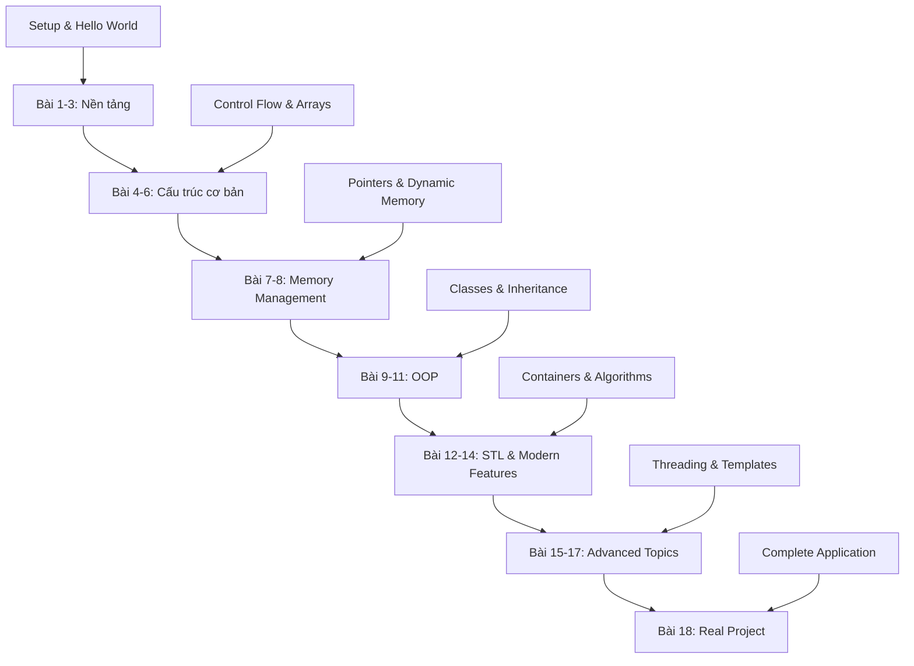
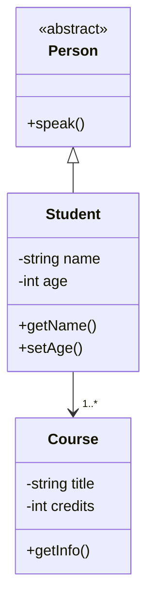
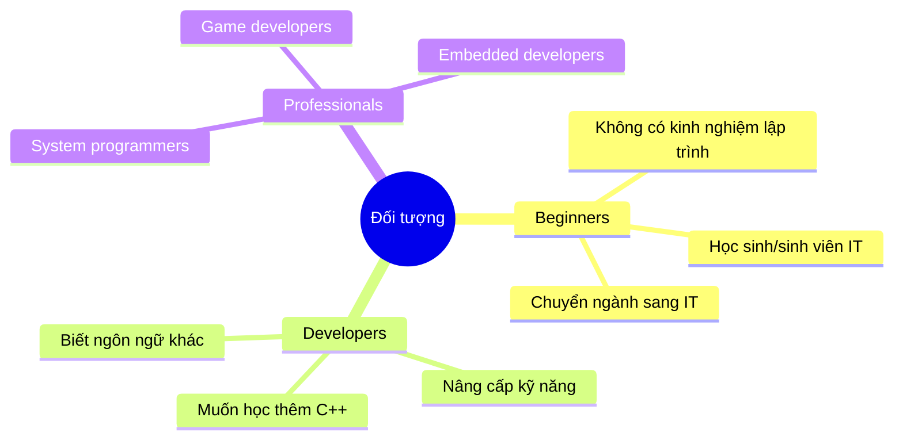
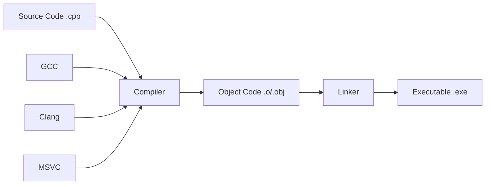
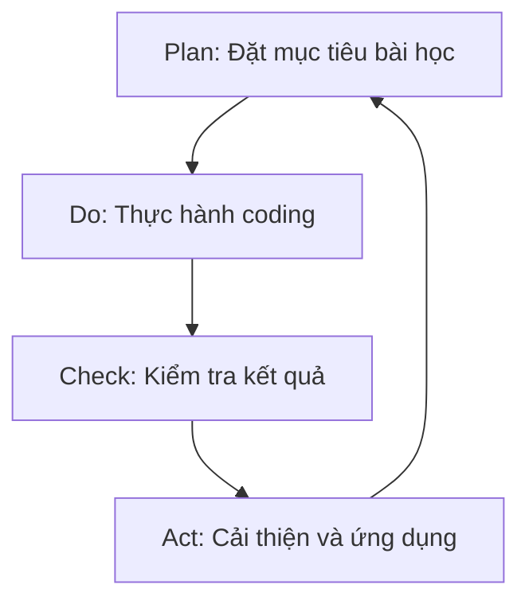

# Bài 0: Giới thiệu khóa học C++ - Hành trình từ Zero đến Hero

  <h2 className="text-2xl font-bold mb-4">🚀 Chào mừng bạn đến với hành trình chinh phục C++!</h2>
  
Khóa học này sẽ đưa bạn từ một người mới bắt đầu hoàn toàn đến một lập trình viên C++ có thể tự tin xây dựng các ứng dụng phức tạp.

## 🎯 Mục tiêu khóa học

  

    <h3 className="font-bold text-green-800 mb-2">📚 Kiến thức cơ bản</h3>
    
Nắm vững syntax, concepts và paradigms của C++

  

  

    <h3 className="font-bold text-blue-800 mb-2">⚙️ Lập trình thực tế</h3>
    
Xây dựng ứng dụng real-world với best practices

  

  

    <h3 className="font-bold text-purple-800 mb-2">🔧 Kỹ năng debug</h3>
    
Học cách tìm và sửa lỗi hiệu quả

  

  

    <h3 className="font-bold text-orange-800 mb-2">🚀 Modern C++</h3>
    
Sử dụng các tính năng C++11/14/17/20

  

## 🗺️ Lộ trình học tập 18 bài

## 📋 Cấu trúc chi tiết khóa học

### 🏗️ Phần I: Nền tảng (Bài 1-3)

| Bài học | Nội dung chính | Thời lượng | Độ khó |
|---------|---------------|------------|--------|
| **Bài 1** | Thiết lập môi trường, Hello World | 3h | ⭐ |
| **Bài 2** | Kiểu dữ liệu, biến, const/auto | 3h | ⭐ |
| **Bài 3** | Toán tử, biểu thức, máy tính | 3h | ⭐⭐ |

### 🔄 Phần II: Cấu trúc điều khiển (Bài 4-6)

| Bài học | Nội dung chính | Thời lượng | Độ khó |
|---------|---------------|------------|--------|
| **Bài 4** | If/else, loops, switch-case | 3h | ⭐⭐ |
| **Bài 5** | Functions, scope, overloading | 3h | ⭐⭐ |
| **Bài 6** | Arrays, strings, algorithms | 3h | ⭐⭐⭐ |

### 🧠 Phần III: Memory & Pointers (Bài 7-8)

| Bài học | Nội dung chính | Thời lượng | Độ khó |
|---------|---------------|------------|--------|
| **Bài 7** | Pointers, references, functions | 3h | ⭐⭐⭐ |
| **Bài 8** | Dynamic memory, new/delete | 3h | ⭐⭐⭐⭐ |

### 🏛️ Phần IV: Object-Oriented Programming (Bài 9-11)

| Bài học | Nội dung chính | Thời lượng | Độ khó |
|---------|---------------|------------|--------|
| **Bài 9** | Struct, class, constructor/destructor | 3h | ⭐⭐⭐ |
| **Bài 10** | Inheritance, polymorphism, virtual | 3h | ⭐⭐⭐⭐ |
| **Bài 11** | Operator overloading, templates | 3h | ⭐⭐⭐⭐ |

### 🔧 Phần V: Modern C++ & STL (Bài 12-14)

| Bài học | Nội dung chính | Thời lượng | Độ khó |
|---------|---------------|------------|--------|
| **Bài 12** | Exception handling, RAII | 3h | ⭐⭐⭐⭐ |
| **Bài 13** | STL containers, iterators | 3h | ⭐⭐⭐ |
| **Bài 14** | Algorithms, lambda functions | 3h | ⭐⭐⭐⭐ |

### 🚀 Phần VI: Advanced Topics (Bài 15-17)

| Bài học | Nội dung chính | Thời lượng | Độ khó |
|---------|---------------|------------|--------|
| **Bài 15** | Smart pointers, memory safety | 3h | ⭐⭐⭐⭐ |
| **Bài 16** | Advanced templates, metaprogramming | 3h | ⭐⭐⭐⭐⭐ |
| **Bài 17** | Multithreading, concurrency | 3h | ⭐⭐⭐⭐⭐ |

### 🏆 Phần VII: Capstone Project (Bài 18)

  <h4 className="text-xl font-bold text-yellow-800 mb-3">🎓 Dự án tốt nghiệp</h4>
  
Xây dựng một ứng dụng hoàn chỉnh sử dụng tất cả kiến thức đã học

  <ul className="list-disc list-inside text-yellow-700 space-y-2">
    <li>Build system với CMake</li>
    <li>External libraries integration</li>
    <li>Unit testing & debugging</li>
    <li>Performance optimization</li>
  </ul>

## 🎯 Đối tượng học viên

## 📚 Yêu cầu trước khóa học

### ✅ Bắt buộc

| Yêu cầu | Mô tả | Ghi chú |
|---------|-------|---------|
| **Máy tính** | Windows/macOS/Linux | RAM ≥ 4GB |
| **Internet** | Tốc độ ổn định | Download tools/libraries |
| **Thời gian** | 3-5h/tuần | Consistency quan trọng |

### 🎯 Tùy chọn (có càng tốt)

| Kiến thức | Mức độ | Lợi ích |
|-----------|--------|---------|
| **Logic học** | Cơ bản | Tư duy thuật toán |
| **Toán học** | Cấp 3 | Hiểu algorithms |
| **Tiếng Anh** | Đọc hiểu | Đọc documentation |

## 🛠️ Công cụ và môi trường

### 💻 Development Environment

| Tool | Platform | Mô tả | Khuyến nghị |
|------|----------|--------|-------------|
| **Visual Studio** | Windows | IDE đầy đủ tính năng | ⭐⭐⭐⭐⭐ |
| **VS Code** | Cross-platform | Lightweight, extensible | ⭐⭐⭐⭐ |
| **Code::Blocks** | Cross-platform | Free, đơn giản | ⭐⭐⭐ |
| **CLion** | Cross-platform | JetBrains IDE (paid) | ⭐⭐⭐⭐ |

### 🔨 Compilers

| Compiler | Platform | Đặc điểm | Standard Support |
|----------|----------|----------|------------------|
| **GCC** | Linux/Windows | Open source, powerful | C++20 |
| **Clang** | Cross-platform | Fast compilation | C++20 |
| **MSVC** | Windows | Microsoft official | C++20 |

## 📈 Phương pháp học tập hiệu quả

  

    
📖

    <h4 className="font-bold text-blue-800">Đọc hiểu</h4>
    
Theory + Examples

  

  

    
💻

    <h4 className="font-bold text-green-800">Thực hành</h4>
    
Coding + Debugging

  

  

    
🔄

    <h4 className="font-bold text-purple-800">Lặp lại</h4>
    
Review + Practice

  

### 🎓 Học tập theo chu trình PDCA

## 🏆 Kết quả mong đợi sau khóa học

### 💪 Kỹ năng kỹ thuật

- **Viết code C++ clean và hiệu quả**
- **Debug và troubleshoot complex issues**  
- **Sử dụng STL và modern C++ features**
- **Apply OOP principles correctly**
- **Manage memory safely**
- **Work with multithreading**

### 🧠 Kỹ năng soft skills

- **Problem-solving systematically**
- **Read and understand documentation**
- **Code review và collaboration**
- **Self-learning advanced topics**

## 📞 Hỗ trợ học tập

  <h4 className="text-lg font-bold text-gray-800 mb-4">🤝 Các kênh hỗ trợ</h4>
  

    

      <h5 className="font-semibold text-gray-700">📧 Email Support</h5>
      
Q&A, assignment review

    

    

      <h5 className="font-semibold text-gray-700">💬 Discussion Forum</h5>
      
Peer learning, code sharing

    

    

      <h5 className="font-semibold text-gray-700">🎥 Office Hours</h5>
      
1-on-1 mentoring

    

    

      <h5 className="font-semibold text-gray-700">📱 Study Groups</h5>
      
Collaborative learning

    

  

---

  <h3 className="text-xl font-bold mb-4">🎉 Sẵn sàng bắt đầu?</h3>
  
Hành trình 1000 dặm bắt đầu bằng một bước chân. Bước tiếp theo của bạn là <strong>Bài 1: Thiết lập môi trường và Hello World</strong>!

  
💡 <em>Tip: Hãy chuẩn bị sẵn máy tính và tinh thần học hỏi. Success = Consistency + Practice!</em>

