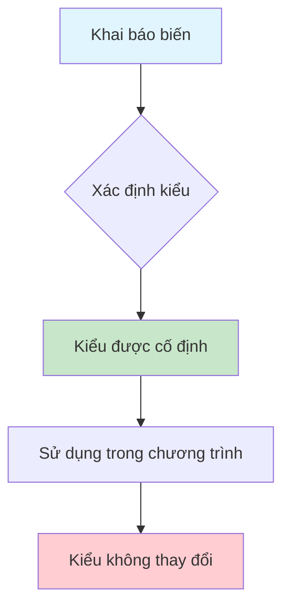
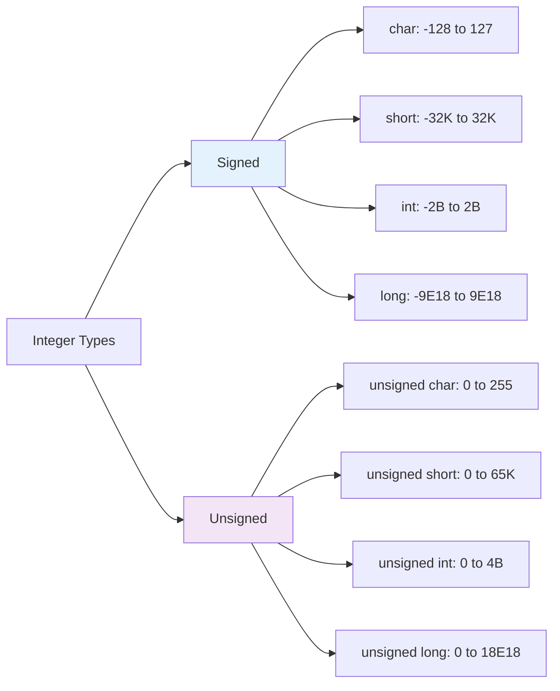
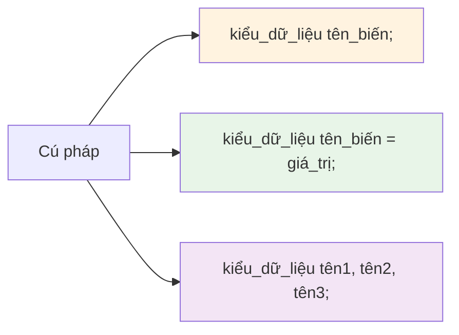
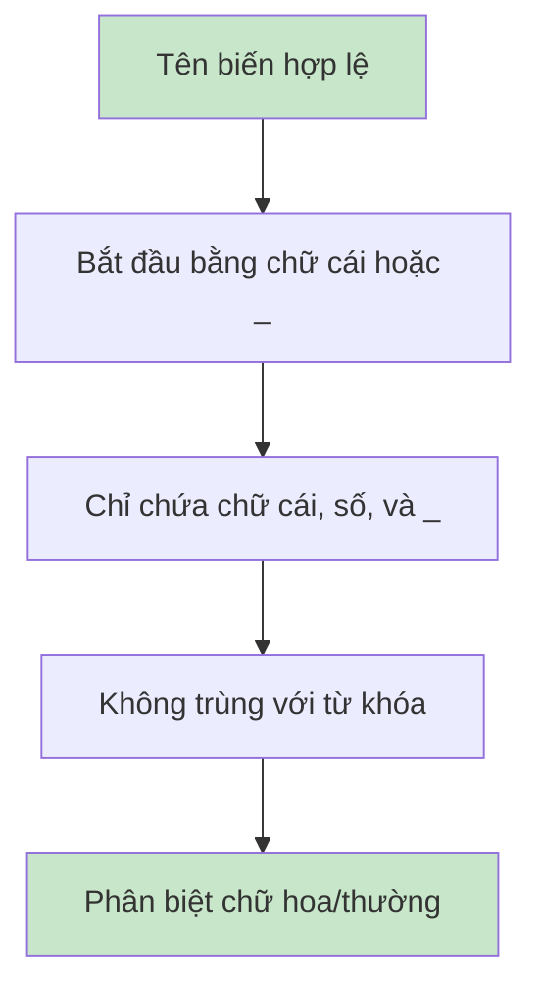
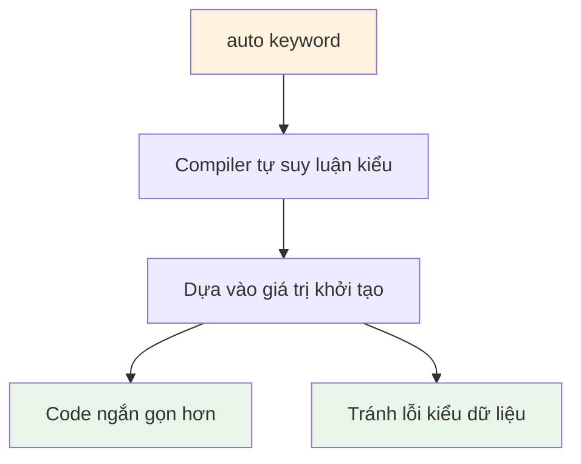

# Bài 2: Kiểu Dữ Liệu và Biến trong C++

<div className="bg-gradient-to-r from-blue-50 to-indigo-100 p-6 rounded-lg border-l-4 border-blue-500 mb-8">
  <h2 className="text-2xl font-bold text-blue-800 mb-3">📚 Mục Tiêu Bài Học</h2>
  <div className="grid grid-cols-1 md:grid-cols-2 gap-4 text-blue-700">
    <ul className="space-y-2">
      <li>✅ Hiểu các kiểu dữ liệu cơ bản trong C++</li>
      <li>✅ Thành thạo cách khai báo và khởi tạo biến</li>
      <li>✅ Nắm vững quy tắc đặt tên biến</li>
    </ul>
    <ul className="space-y-2">
      <li>✅ Hiểu khái niệm Static Typing</li>
      <li>✅ Sử dụng từ khóa <code>const</code> và <code>auto</code></li>
      <li>✅ Áp dụng kiến thức vào bài tập thực tế</li>
    </ul>
  </div>
</div>

## 1. Khái Niệm Cơ Bản Về Kiểu Dữ Liệu

### 1.1 Static Typing trong C++

<div className="bg-yellow-50 p-4 rounded-lg border border-yellow-200 mb-4">
  <h4 className="font-semibold text-yellow-800 mb-2">💡 Khái Niệm Quan Trọng</h4>
  <div className="text-yellow-700">
    <strong>Static Typing</strong> có nghĩa là kiểu dữ liệu của mỗi biến phải được xác định tại thời điểm biên dịch và không thể thay đổi trong quá trình thực thi chương trình.
  </div>
</div>



### 1.2 Ưu Điểm của Static Typing

| Ưu điểm | Giải thích | Ví dụ |
|---------|------------|--------|
| **Phát hiện lỗi sớm** | Compiler kiểm tra kiểu dữ liệu | `int x = "hello";` → Lỗi biên dịch |
| **Hiệu suất cao** | Không cần kiểm tra kiểu tại runtime | Truy cập bộ nhớ trực tiếp |
| **Code rõ ràng** | Dễ đọc và hiểu ý định lập trình viên | `int age;` → Biết ngay là số nguyên |
| **IDE hỗ trợ tốt** | Gợi ý code và kiểm tra lỗi | IntelliSense, auto-completion |

## 2. Các Kiểu Dữ Liệu Cơ Bản

### 2.1 Bảng Tổng Quan Kiểu Dữ Liệu

| Kiểu | Kích thước (byte) | Phạm vi giá trị | Mục đích sử dụng |
|------|-------------------|-----------------|------------------|
| `bool` | 1 | `true` / `false` | Giá trị logic |
| `char` | 1 | -128 → 127 | Ký tự ASCII |
| `short` | 2 | -32,768 → 32,767 | Số nguyên nhỏ |
| `int` | 4 | -2,147,483,648 → 2,147,483,647 | Số nguyên thông thường |
| `long` | 8 | -(2^63) → (2^63-1) | Số nguyên lớn |
| `float` | 4 | ±3.4E±38 (7 chữ số) | Số thực độ chính xác đơn |
| `double` | 8 | ±1.7E±308 (15 chữ số) | Số thực độ chính xác kép |

### 2.2 Kiểu Số Nguyên (Integer Types)



**Ví dụ thực tế:**

```cpp
#include <iostream>
using namespace std;

int main() {
    // Kiểu số nguyên có dấu
    int age = 25;           // Tuổi của một người
    short year = 2024;      // Năm (tiết kiệm bộ nhớ)
    long population = 98000000L; // Dân số Việt Nam
    
    // Kiểu số nguyên không dấu
    unsigned int distance = 3500u;    // Khoảng cách (km)
    unsigned char grade = 85;         // Điểm số (0-100)
    
    cout << "Tuổi: " << age << endl;
    cout << "Năm: " << year << endl;
    cout << "Dân số: " << population << endl;
    cout << "Khoảng cách: " << distance << " km" << endl;
    cout << "Điểm: " << grade << endl;
    
    return 0;
}
```

### 2.3 Kiểu Số Thực (Floating-Point Types)

<div className="bg-green-50 p-4 rounded-lg border border-green-200 mb-4">
  <h4 className="font-semibold text-green-800 mb-2">🎯 Lưu Ý Quan Trọng</h4>
  <div className="text-green-700 space-y-2">
    <p><strong>float:</strong> Sử dụng khi cần tiết kiệm bộ nhớ, độ chính xác không quá cao</p>
    <p><strong>double:</strong> Sử dụng cho tính toán khoa học, tài chính cần độ chính xác cao</p>
  </div>
</div>

```cpp
#include <iostream>
#include <iomanip>
using namespace std;

int main() {
    float pi_float = 3.14159265f;      // Chữ f để chỉ định float
    double pi_double = 3.14159265358979; // Không cần hậu tố
    
    cout << fixed << setprecision(10);  // Hiển thị 10 chữ số thập phân
    cout << "Pi (float):  " << pi_float << endl;
    cout << "Pi (double): " << pi_double << endl;
    
    // So sánh độ chính xác
    cout << "\nSự khác biệt về độ chính xác:" << endl;
    cout << "float có thể lưu: 3.1415927" << endl;
    cout << "double có thể lưu: 3.1415926535897900" << endl;
    
    return 0;
}
```

### 2.4 Kiểu Ký Tự và Boolean

```cpp
#include <iostream>
using namespace std;

int main() {
    // Kiểu char
    char grade = 'A';           // Ký tự đơn
    char newline = '\n';        // Ký tự đặc biệt
    char tab = '\t';            // Tab
    
    // Kiểu bool
    bool isStudent = true;
    bool hasLicense = false;
    
    cout << "Điểm: " << grade << endl;
    cout << "Là sinh viên: " << isStudent << endl;      // In ra 1
    cout << "Có bằng lái: " << hasLicense << endl;      // In ra 0
    
    // Chuyển đổi bool thành text
    cout << boolalpha;  // Hiển thị true/false thay vì 1/0
    cout << "Là sinh viên: " << isStudent << endl;      // In ra true
    cout << "Có bằng lái: " << hasLicense << endl;      // In ra false
    
    return 0;
}
```

## 3. Khai Báo và Khởi Tạo Biến

### 3.1 Cú Pháp Khai Báo Biến



### 3.2 Các Cách Khởi Tạo Biến

| Cách khởi tạo | Cú pháp | Ví dụ | Ghi chú |
|----------------|---------|-------|---------|
| **Assignment** | `type var = value;` | `int x = 10;` | Cách truyền thống |
| **Direct** | `type var(value);` | `int x(10);` | Giống constructor |
| **Uniform** | `type var{value};` | `int x{10};` | C++11, an toàn hơn |
| **Default** | `type var{};` | `int x{};` | Khởi tạo giá trị mặc định |

```cpp
#include <iostream>
using namespace std;

int main() {
    // Các cách khởi tạo khác nhau
    int a = 10;        // Assignment initialization
    int b(20);         // Direct initialization  
    int c{30};         // Uniform initialization (C++11)
    int d{};           // Default initialization (d = 0)
    
    // Khai báo nhiều biến cùng lúc
    int x = 1, y = 2, z = 3;
    
    // Khai báo mà không khởi tạo (không khuyến khích)
    int uninitialized;  // Giá trị không xác định!
    
    cout << "a = " << a << ", b = " << b 
         << ", c = " << c << ", d = " << d << endl;
    cout << "x = " << x << ", y = " << y 
         << ", z = " << z << endl;
    
    return 0;
}
```

### 3.3 Uniform Initialization - Tính Năng C++11

<div className="bg-blue-50 p-4 rounded-lg border border-blue-200 mb-4">
  <h4 className="font-semibold text-blue-800 mb-2">⭐ Tính Năng Nổi Bật</h4>
  <div className="text-blue-700">
    Uniform Initialization (sử dụng dấu {}) giúp tránh các vấn đề chuyển đổi kiểu không mong muốn và tạo cú pháp thống nhất.
  </div>
</div>

```cpp
#include <iostream>
using namespace std;

int main() {
    // Uniform initialization ngăn chặn narrowing conversion
    int safe_int{10};           // ✓ OK
    // int narrow{3.14};        // ✗ Error: không thể chuyển double sang int
    
    // So sánh với cách cũ
    int old_way = 3.14;         // ⚠️ Warning: mất dữ liệu (3.14 → 3)
    
    // Khởi tạo với giá trị mặc định
    int default_int{};          // 0
    double default_double{};    // 0.0
    bool default_bool{};        // false
    char default_char{};        // '\0'
    
    cout << "Safe int: " << safe_int << endl;
    cout << "Old way (nguy hiểm): " << old_way << endl;
    cout << "Giá trị mặc định:" << endl;
    cout << "  int: " << default_int << endl;
    cout << "  double: " << default_double << endl;
    cout << "  bool: " << default_bool << endl;
    cout << "  char: '" << default_char << "'" << endl;
    
    return 0;
}
```

## 4. Quy Tắc Đặt Tên Biến

### 4.1 Quy Tắc Bắt Buộc



### 4.2 Bảng Ví Dụ Tên Biến

| Loại | Hợp lệ ✅ | Không hợp lệ ❌ | Lý do |
|------|-----------|-----------------|-------|
| **Bắt đầu** | `age`, `_count`, `name2` | `2name`, `@age` | Phải bắt đầu bằng chữ cái hoặc _ |
| **Ký tự** | `user_name`, `maxValue` | `user-name`, `max Value` | Chỉ được dùng chữ cái, số, _ |
| **Từ khóa** | `myInt`, `number` | `int`, `return` | Không được trùng từ khóa C++ |
| **Phân biệt** | `Age`, `age`, `AGE` | - | Ba biến khác nhau |

### 4.3 Quy Ước Đặt Tên Tốt

<div className="grid grid-cols-1 md:grid-cols-2 gap-6 mb-6">
  <div className="bg-green-50 p-4 rounded-lg border border-green-200">
    <h4 className="font-semibold text-green-800 mb-3">✅ Nên Làm</h4>
    <ul className="text-green-700 space-y-1 text-sm">
      <li>• Sử dụng tên có ý nghĩa: <code>studentAge</code></li>
      <li>• CamelCase cho biến: <code>firstName</code></li>
      <li>• Snake_case: <code>student_count</code></li>
      <li>• Tên ngắn gọn nhưng rõ ràng</li>
    </ul>
  </div>
  <div className="bg-red-50 p-4 rounded-lg border border-red-200">
    <h4 className="font-semibold text-red-800 mb-3">❌ Không Nên</h4>
    <ul className="text-red-700 space-y-1 text-sm">
      <li>• Tên mơ hồ: <code>x</code>, <code>data</code>, <code>temp</code></li>
      <li>• Tên quá dài: <code>theCurrentStudentAgeInYears</code></li>
      <li>• Chữ viết tắt khó hiểu: <code>stdtAg</code></li>
      <li>• Ký tự đặc biệt hoặc dấu</li>
    </ul>
  </div>
</div>

```cpp
#include <iostream>
using namespace std;

int main() {
    // ✅ Tên biến tốt
    int studentAge = 20;
    double accountBalance = 1500.75;
    bool isLoggedIn = true;
    char gradeLevel = 'A';
    
    // ❌ Tên biến không tốt (nhưng hợp lệ)
    int a = 20;           // Không biết a là gì
    double money = 1500.75;   // Mơ hồ, không biết loại tiền nào
    bool flag = true;     // Flag gì?
    char c = 'A';         // c đại diện cho gì?
    
    cout << "Thông tin sinh viên:" << endl;
    cout << "Tuổi: " << studentAge << endl;
    cout << "Số dư tài khoản: $" << accountBalance << endl;
    cout << "Trạng thái: " << (isLoggedIn ? "Đã đăng nhập" : "Chưa đăng nhập") << endl;
    cout << "Cấp độ: " << gradeLevel << endl;
    
    return 0;
}
```

## 5. Từ Khóa `const` - Hằng Số

### 5.1 Khái Niệm và Ứng Dụng

<div className="bg-purple-50 p-4 rounded-lg border border-purple-200 mb-4">
  <h4 className="font-semibold text-purple-800 mb-2">🔒 Từ Khóa const</h4>
  <div className="text-purple-700">
    <code>const</code> tạo ra các hằng số - biến có giá trị không thể thay đổi sau khi khởi tạo. Giúp code an toàn hơn và ý định rõ ràng hơn.
  </div>
</div>

```cpp
#include <iostream>
#include <cmath>
using namespace std;

int main() {
    // Khai báo hằng số
    const double PI = 3.14159265359;
    const int MAX_STUDENTS = 100;
    const char GRADE_A = 'A';
    
    // Sử dụng hằng số trong tính toán
    double radius = 5.0;
    double area = PI * radius * radius;
    double circumference = 2 * PI * radius;
    
    cout << "Bán kính: " << radius << endl;
    cout << "Diện tích: " << area << endl;
    cout << "Chu vi: " << circumference << endl;
    cout << "Số sinh viên tối đa: " << MAX_STUDENTS << endl;
    
    // PI = 3.14;  // ✗ Error: không thể thay đổi const
    
    return 0;
}
```

### 5.2 So Sánh const và biến thường

| Khía cạnh | Biến thường | Hằng số (const) |
|-----------|-------------|------------------|
| **Khởi tạo** | Có thể khởi tạo sau | Phải khởi tạo ngay |
| **Thay đổi** | Có thể thay đổi | Không thể thay đổi |
| **Mục đích** | Dữ liệu biến thiên | Dữ liệu cố định |
| **Ví dụ** | `int count = 0;` | `const double PI = 3.14;` |

## 6. Từ Khóa `auto` - Suy Luận Kiểu

### 6.1 Giới Thiệu auto (C++11)



```cpp
#include <iostream>
#include <vector>
#include <string>
using namespace std;

int main() {
    // Cách truyền thống
    int number1 = 42;
    double price1 = 99.99;
    string name1 = "John";
    
    // Sử dụng auto - compiler tự suy luận
    auto number2 = 42;        // int
    auto price2 = 99.99;      // double  
    auto name2 = "John";      // const char*
    auto name3 = string("John"); // string
    
    // auto với biểu thức phức tạp
    auto result = number1 * price1;    // double
    auto length = name3.length();      // size_t
    
    cout << "Số: " << number2 << endl;
    cout << "Giá: " << price2 << endl;
    cout << "Tên: " << name2 << endl;
    cout << "Kết quả: " << result << endl;
    cout << "Độ dài: " << length << endl;
    
    return 0;
}
```

### 6.2 Khi Nào Nên Sử Dụng auto

<div className="grid grid-cols-1 md:grid-cols-2 gap-6 mb-6">
  <div className="bg-green-50 p-4 rounded-lg border border-green-200">
    <h4 className="font-semibold text-green-800 mb-3">✅ Nên Dùng auto Khi</h4>
    <ul className="text-green-700 space-y-1 text-sm">
      <li>• Kiểu dữ liệu phức tạp, dài</li>
      <li>• Kết quả từ template functions</li>
      <li>• Iterator trong STL</li>
      <li>• Lambda expressions</li>
    </ul>
  </div>
  <div className="bg-yellow-50 p-4 rounded-lg border border-yellow-200">
    <h4 className="font-semibold text-yellow-800 mb-3">⚠️ Cẩn Thận Khi</h4>
    <ul className="text-yellow-700 space-y-1 text-sm">
      <li>• Muốn kiểu cụ thể (int vs double)</li>
      <li>• Code cần rõ ràng cho người khác</li>
      <li>• Tham số hàm</li>
      <li>• Return type của hàm</li>
    </ul>
  </div>
</div>

## 7. Bài Tập Thực Hành

### 7.1 Bài Tập 1: Thông Tin Sinh Viên Cơ Bản

<div className="bg-gray-50 p-4 rounded-lg border border-gray-200 mb-4">
  <h4 className="font-semibold text-gray-800 mb-2">📝 Đề Bài</h4>
  <div className="text-gray-700">
    Viết chương trình khai báo các biến để lưu thông tin sinh viên và hiển thị ra màn hình.
  </div>
</div>

```cpp
#include <iostream>
#include <string>
using namespace std;

int main() {
    // Khai báo thông tin sinh viên
    const string UNIVERSITY = "Đại học Bách Khoa";
    auto studentId = 2024001;           // Mã sinh viên
    string fullName = "Nguyễn Văn An";
    int age = 20;
    double gpa = 3.75;                  // GPA thang 4.0
    char gradeClass = 'A';              // Loại học lực
    bool hasScholarship = true;         // Có học bổng
    
    // Hiển thị thông tin
    cout << "=== THÔNG TIN SINH VIÊN ===" << endl;
    cout << "Trường: " << UNIVERSITY << endl;
    cout << "Mã SV: " << studentId << endl;
    cout << "Họ tên: " << fullName << endl;
    cout << "Tuổi: " << age << " tuổi" << endl;
    cout << "GPA: " << gpa << "/4.0" << endl;
    cout << "Học lực: " << gradeClass << endl;
    cout << "Học bổng: " << (hasScholarship ? "Có" : "Không") << endl;
    
    // Tính toán thêm
    const int GRADUATION_YEAR = 2028;
    int yearsToGraduate = GRADUATION_YEAR - 2024;
    cout << "Số năm còn lại: " << yearsToGraduate << " năm" << endl;
    
    return 0;
}
```

### 7.2 Bài Tập 2: Máy Tính Đơn Giản

```cpp
#include <iostream>
using namespace std;

int main() {
    cout << "=== MÁY TÍNH ĐƠN GIẢN ===" << endl;
    
    // Nhập dữ liệu từ người dùng
    double num1, num2;
    cout << "Nhập số thứ nhất: ";
    cin >> num1;
    cout << "Nhập số thứ hai: ";
    cin >> num2;
    
    // Thực hiện các phép tính
    auto sum = num1 + num2;
    auto difference = num1 - num2;
    auto product = num1 * num2;
    auto quotient = (num2 != 0) ? num1 / num2 : 0;
    
    // Hiển thị kết quả
    cout << "\n=== KẾT QUẢ ===" << endl;
    cout << num1 << " + " << num2 << " = " << sum << endl;
    cout << num1 << " - " << num2 << " = " << difference << endl;
    cout << num1 << " × " << num2 << " = " << product << endl;
    
    if (num2 != 0) {
        cout << num1 << " ÷ " << num2 << " = " << quotient << endl;
    } else {
        cout << "Không thể chia cho 0!" << endl;
    }
    
    return 0;
}
```

### 7.3 Bài Tập 3: Chuyển Đổi Nhiệt Độ

```cpp
#include <iostream>
using namespace std;

int main() {
    cout << "=== CHUYỂN ĐỔI NHIỆT ĐỘ ===" << endl;
    
    // Hằng số chuyển đổi
    const double CELSIUS_TO_FAHRENHEIT = 9.0/5.0;
    const double FAHRENHEIT_OFFSET = 32.0;
    const double CELSIUS_TO_KELVIN = 273.15;
    
    // Nhập nhiệt độ Celsius
    double celsius;
    cout << "Nhập nhiệt độ (°C): ";
    cin >> celsius;
    
    // Chuyển đổi
    auto fahrenheit = celsius * CELSIUS_TO_FAHRENHEIT + FAHRENHEIT_OFFSET;
    auto kelvin = celsius + CELSIUS_TO_KELVIN;
    
    // Hiển thị kết quả
    cout << "\n=== KẾT QUẢ CHUYỂN ĐỔI ===" << endl;
    cout << celsius << "°C = " << fahrenheit << "°F" << endl;
    cout << celsius << "°C = " << kelvin << "K" << endl;
    
    // Thông tin thêm
    const int WATER_BOILING = 100;
    const int WATER_FREEZING = 0;
    
    if (celsius >= WATER_BOILING) {
        cout << "Nước đã sôi ở nhiệt độ này!" << endl;
    } else if (celsius <= WATER_FREEZING) {
        cout << "Nước đã đóng băng ở nhiệt độ này!" << endl;
    } else {
        cout << "Nước ở trạng thái lỏng ở nhiệt độ này." << endl;
    }
    
    return 0;
}
```

## 8. Tóm Tắt Bài Học

<div className="bg-blue-50 p-6 rounded-lg border-l-4 border-blue-500">
  <h3 className="text-xl font-bold text-blue-800 mb-4">📋 Kiến Thức Đã Học</h3>
  
  <div className="grid grid-cols-1 md:grid-cols-2 gap-6">
    <div className="space-y-3">
      <h4 className="font-semibold text-blue-700">🎯 Kiểu Dữ Liệu</h4>
      <ul className="text-blue-600 space-y-1 text-sm">
        <li>• Các kiểu cơ bản: int, double, char, bool</li>
        <li>• Kích thước và phạm vi giá trị</li>
        <li>• Sự khác biệt giữa float và double</li>
        <li>• Kiểu signed và unsigned</li>
      </ul>
      
      <h4 className="font-semibold text-blue-700">🔧 Khai Báo Biến</h4>
      <ul className="text-blue-600 space-y-1 text-sm">
        <li>• Cú pháp khai báo và khởi tạo</li>
        <li>• Uniform initialization với {}</li>
        <li>• Quy tắc đặt tên biến</li>
      </ul>
    </div>
    
    <div className="space-y-3">
      <h4 className="font-semibold text-blue-700">⭐ Tính Năng Nâng Cao</h4>
      <ul className="text-blue-600 space-y-1 text-sm">
        <li>• Từ khóa const cho hằng số</li>
        <li>• Từ khóa auto cho suy luận kiểu</li>
        <li>• Static typing trong C++</li>
        <li>• Best practices</li>
      </ul>
      
      <h4 className="font-semibold text-blue-700">💡 Ứng Dụng</h4>
      <ul className="text-blue-600 space-y-1 text-sm">
        <li>• Quản lý thông tin sinh viên</li>
        <li>• Máy tính đơn giản</li>
        <li>• Chuyển đổi nhiệt độ</li>
      </ul>
    </div>
  </div>
</div>

### 8.1 Bảng So Sánh Nhanh

| Khái niệm | Cú pháp | Ví dụ | Ghi chú |
|-----------|---------|-------|---------|
| **Khai báo cơ bản** | `type name;` | `int age;` | Chưa khởi tạo |
| **Khởi tạo** | `type name = value;` | `int age = 20;` | Cách truyền thống |
| **Uniform init** | `type name{value};` | `int age{20};` | An toàn hơn |
| **Hằng số** | `const type name = value;` | `const double PI = 3.14;` | Không thay đổi |
| **Auto** | `auto name = value;` | `auto age = 20;` | Suy luận kiểu |

### 8.2 Lỗi Thường Gặp và Cách Khắc Phục

```mermaid
graph TD
    A[Lỗi Thường Gặp] --> B[Không khởi tạo biến]
    A --> C[Sai kiểu dữ liệu]
    A --> D[Tên biến không hợp lệ]
    A --> E[Thay đổi const]
    
    B --> F[Sử dụng {} để khởi tạo mặc định]
    C --> G[Kiểm tra phạm vi giá trị]
    D --> H[Tuân thủ quy tắc đặt tên]
    E --> I[Kiểm tra const trước khi dùng]
    
    style A fill:#ffcdd2
    style F fill:#c8e6c9
    style G fill:#c8e6c9
    style H fill:#c8e6c9
    style I fill:#c8e6c9
```

## 9. Bài Tập Về Nhà

### 9.1 Bài Tập Cơ Bản

<div className="bg-yellow-50 p-4 rounded-lg border border-yellow-200 mb-4">
  <h4 className="font-semibold text-yellow-800 mb-2">📚 Bài Tập 1: Quản Lý Sản Phẩm</h4>
  <div className="text-yellow-700 mb-2">
    Viết chương trình quản lý thông tin một sản phẩm trong cửa hàng:
  </div>
  <ul className="text-yellow-700 text-sm space-y-1">
    <li>• Mã sản phẩm (số nguyên)</li>
    <li>• Tên sản phẩm (chuỗi)</li>
    <li>• Giá bán (số thực)</li>
    <li>• Số lượng tồn kho (số nguyên)</li>
    <li>• Trạng thái còn hàng (bool)</li>
  </ul>
</div>

### 9.2 Bài Tập Nâng Cao

<div className="bg-green-50 p-4 rounded-lg border border-green-200 mb-4">
  <h4 className="font-semibold text-green-800 mb-2">🚀 Bài Tập 2: Tính Toán Hình Học</h4>
  <div className="text-green-700 mb-2">
    Viết chương trình tính toán cho các hình học cơ bản:
  </div>
  <ul className="text-green-700 text-sm space-y-1">
    <li>• Nhập bán kính hình tròn</li>
    <li>• Tính diện tích và chu vi</li>
    <li>• Sử dụng const cho PI</li>
    <li>• Sử dụng auto cho kết quả tính toán</li>
    <li>• Hiển thị kết quả với độ chính xác 2 chữ số thập phân</li>
  </ul>
</div>

### 9.3 Template Code cho Bài Tập

```cpp
#include <iostream>
#include <string>
#include <iomanip>
using namespace std;

int main() {
    cout << "=== QUẢN LÝ SẢN PHẨM ===" << endl;
    
    // TODO: Khai báo các biến cần thiết
    // Gợi ý: sử dụng const cho mã cửa hàng
    // Gợi ý: sử dụng auto cho các tính toán
    
    
    // TODO: Nhập thông tin sản phẩm từ người dùng
    
    
    // TODO: Tính toán giá trị tổng (giá × số lượng)
    
    
    // TODO: Hiển thị thông tin đầy đủ
    
    
    return 0;
}
```

## 10. Câu Hỏi Ôn Tập

### 10.1 Câu Hỏi Trắc Nghiệm

<div className="space-y-4">
  <div className="bg-gray-50 p-4 rounded-lg border">
    <p className="font-semibold">1. Kiểu dữ liệu nào sau đây có kích thước 8 byte?</p>
    <div className="mt-2 space-y-1 text-sm">
      <p>A) int</p>
      <p>B) float</p>
      <p>C) double</p>
      <p>D) char</p>
    </div>
    <details className="mt-2">
      <summary className="cursor-pointer text-blue-600">Xem đáp án</summary>
      <p className="text-green-600 mt-1"><strong>Đáp án: C</strong> - double có kích thước 8 byte</p>
    </details>
  </div>
  
  <div className="bg-gray-50 p-4 rounded-lg border">
    <p className="font-semibold">2. Cách khởi tạo nào sau đây là Uniform Initialization?</p>
    <div className="mt-2 space-y-1 text-sm">
      <p>A) int x = 10;</p>
      <p>B) int x(10);</p>
      <p>C) int x{10};</p>
      <p>D) int x;</p>
    </div>
    <details className="mt-2">
      <summary className="cursor-pointer text-blue-600">Xem đáp án</summary>
      <p className="text-green-600 mt-1"><strong>Đáp án: C</strong> - Sử dụng dấu {} là Uniform Initialization</p>
    </details>
  </div>
  
  <div className="bg-gray-50 p-4 rounded-lg border">
    <p className="font-semibold">3. Tên biến nào sau đây KHÔNG hợp lệ?</p>
    <div className="mt-2 space-y-1 text-sm">
      <p>A) _count</p>
      <p>B) student2</p>
      <p>C) 2student</p>
      <p>D) maxValue</p>
    </div>
    <details className="mt-2">
      <summary className="cursor-pointer text-blue-600">Xem đáp án</summary>
      <p className="text-green-600 mt-1"><strong>Đáp án: C</strong> - Không được bắt đầu bằng số</p>
    </details>
  </div>
</div>

### 10.2 Câu Hỏi Tự Luận

<div className="space-y-4">
  <div className="bg-blue-50 p-4 rounded-lg border border-blue-200">
    <p className="font-semibold text-blue-800">1. Giải thích sự khác biệt giữa float và double?</p>
    <details className="mt-2">
      <summary className="cursor-pointer text-blue-600">Gợi ý trả lời</summary>
      <div className="text-blue-700 mt-2 text-sm">
        <p>• <strong>Kích thước:</strong> float 4 byte, double 8 byte</p>
        <p>• <strong>Độ chính xác:</strong> float ~7 chữ số, double ~15 chữ số</p>
        <p>• <strong>Phạm vi:</strong> double có phạm vi lớn hơn</p>
        <p>• <strong>Sử dụng:</strong> double cho tính toán khoa học, float cho game/graphics</p>
      </div>
    </details>
  </div>
  
  <div className="bg-purple-50 p-4 rounded-lg border border-purple-200">
    <p className="font-semibold text-purple-800">2. Khi nào nên sử dụng const và khi nào nên sử dụng auto?</p>
    <details className="mt-2">
      <summary className="cursor-pointer text-purple-600">Gợi ý trả lời</summary>
      <div className="text-purple-700 mt-2 text-sm">
        <p>• <strong>const:</strong> Khi giá trị không đổi (PI, MAX_SIZE, etc.)</p>
        <p>• <strong>auto:</strong> Khi kiểu phức tạp hoặc kết quả từ template</p>
        <p>• <strong>Kết hợp:</strong> const auto cho hằng số suy luận kiểu</p>
      </div>
    </details>
  </div>
</div>

---

<div className="bg-gradient-to-r from-green-50 to-blue-50 p-6 rounded-lg border-l-4 border-green-500 mt-8">
  <h3 className="text-xl font-bold text-green-800 mb-3">🎉 Chúc Mừng!</h3>
  <div className="text-green-700 mb-4">
    Bạn đã hoàn thành Bài 2: Kiểu dữ liệu và biến trong C++. Đây là nền tảng quan trọng cho các bài học tiếp theo.
  </div>
  <div className="grid grid-cols-1 md:grid-cols-3 gap-4 text-sm">
    <div className="bg-white p-3 rounded border">
      <h4 className="font-semibold text-green-800">📖 Bài Tiếp Theo</h4>
      <p className="text-green-600">Bài 3: Toán tử và biểu thức</p>
    </div>
    <div className="bg-white p-3 rounded border">
      <h4 className="font-semibold text-blue-800">💡 Lời Khuyên</h4>
      <p className="text-blue-600">Thực hành nhiều với các kiểu dữ liệu khác nhau</p>
    </div>
    <div className="bg-white p-3 rounded border">
      <h4 className="font-semibold text-purple-800">🎯 Mục Tiêu</h4>
      <p className="text-purple-600">Hoàn thành tất cả bài tập về nhà</p>
    </div>
  </div>
</div>