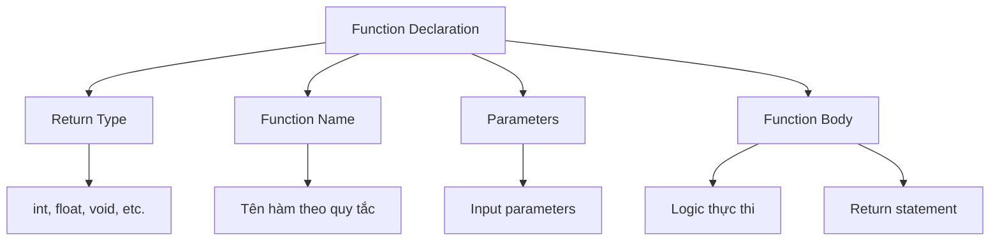
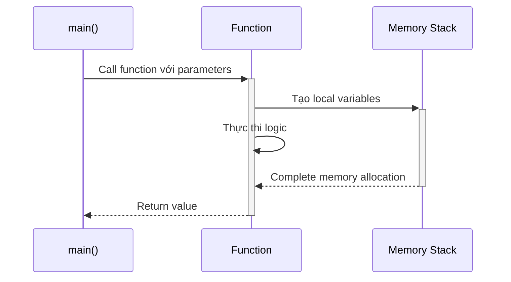
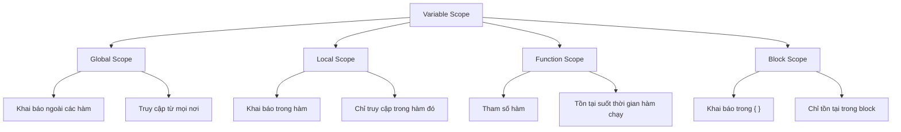
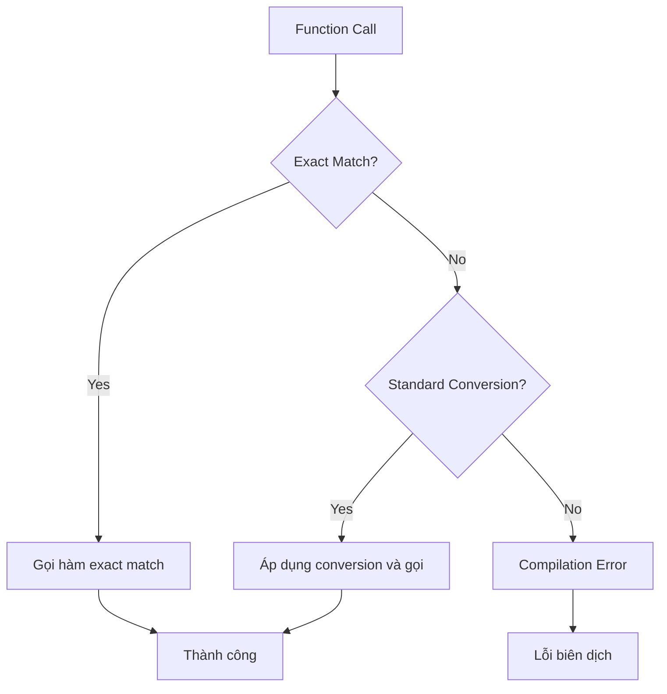

# Bài 5: Hàm và Phạm vi Biến trong C++

<div className="bg-gradient-to-r from-blue-500 to-purple-600 text-white p-6 rounded-lg shadow-lg mb-8">
  <h2 className="text-3xl font-bold mb-2">🎯 Mục tiêu học tập</h2>
  <ul className="list-disc list-inside space-y-2 text-lg">
    <li>Hiểu và sử dụng thành thạo các hàm trong C++</li>
    <li>Nắm vững cách truyền tham số và giá trị trả về</li>
    <li>Phân biệt các loại phạm vi biến khác nhau</li>
    <li>Áp dụng function overloading hiệu quả</li>
    <li>Tối ưu hóa code với inline functions</li>
  </ul>
</div>

## 1. Khái niệm về Hàm (Functions)

### Định nghĩa
**Hàm** là một khối code được đặt tên, thực hiện một nhiệm vụ cụ thể và có thể được gọi từ các phần khác của chương trình. Hàm giúp:
- **Tái sử dụng code**: Viết một lần, dùng nhiều lần
- **Modular Programming**: Chia chương trình thành các phần nhỏ dễ quản lý
- **Dễ debug**: Tìm và sửa lỗi dễ dàng hơn
- **Teamwork**: Nhiều người có thể làm việc trên các hàm khác nhau

### Cấu trúc cơ bản của hàm



## 2. Khai báo và Định nghĩa Hàm

### 2.1 Syntax cơ bản

| Thành phần | Mô tả | Ví dụ |
|------------|-------|-------|
| **Return Type** | Kiểu dữ liệu trả về | `int`, `float`, `void`, `string` |
| **Function Name** | Tên hàm (theo quy tắc đặt tên) | `calculateSum`, `printMessage` |
| **Parameters** | Danh sách tham số đầu vào | `(int a, int b)`, `()` |
| **Function Body** | Khối code thực thi | `{ ... }` |

### 2.2 Ví dụ thực tế

<div className="bg-gray-100 p-4 rounded-lg">

```cpp
// Khai báo hàm (Function Declaration/Prototype)
int add(int a, int b);
void greetUser(string name);
double calculateAverage(int numbers[], int size);

// Định nghĩa hàm (Function Definition)
int add(int a, int b) {
    return a + b;  // Trả về tổng của a và b
}

void greetUser(string name) {
    cout << "Xin chào, " << name << "!" << endl;
    // Hàm void không cần return
}

double calculateAverage(int numbers[], int size) {
    int sum = 0;
    for(int i = 0; i < size; i++) {
        sum += numbers[i];
    }
    return static_cast<double>(sum) / size;
}
```

</div>

### 2.3 Quy trình thực thi hàm



## 3. Tham số Hàm và Cách Truyền Dữ liệu

### 3.1 Pass by Value (Truyền theo giá trị)

<div className="bg-green-50 border-l-4 border-green-500 p-4 mb-4">
  <h4 className="text-green-800 font-semibold">✅ Đặc điểm của Pass by Value:</h4>
  <ul className="list-disc list-inside mt-2 text-green-700">
    <li>Tạo bản copy của biến gốc</li>
    <li>Thay đổi trong hàm không ảnh hưởng biến gốc</li>
    <li>An toàn nhưng tốn bộ nhớ với dữ liệu lớn</li>
  </ul>
</div>

```cpp
#include <iostream>
using namespace std;

void modifyValue(int x) {
    x = x * 2;  // Chỉ thay đổi bản copy
    cout << "Trong hàm: x = " << x << endl;
}

int main() {
    int number = 10;
    cout << "Trước khi gọi hàm: number = " << number << endl;
    
    modifyValue(number);
    
    cout << "Sau khi gọi hàm: number = " << number << endl;
    // number vẫn bằng 10!
    
    return 0;
}
```

### 3.2 Pass by Reference (Truyền theo tham chiếu)

<div className="bg-blue-50 border-l-4 border-blue-500 p-4 mb-4">
  <h4 className="text-blue-800 font-semibold">🔄 Đặc điểm của Pass by Reference:</h4>
  <ul className="list-disc list-inside mt-2 text-blue-700">
    <li>Làm việc trực tiếp với biến gốc</li>
    <li>Thay đổi trong hàm ảnh hưởng biến gốc</li>
    <li>Tiết kiệm bộ nhớ, hiệu quả cao</li>
  </ul>
</div>

```cpp
#include <iostream>
using namespace std;

// Sử dụng & để pass by reference
void swapNumbers(int& a, int& b) {
    int temp = a;
    a = b;
    b = temp;
}

void updateArray(int arr[], int size) {
    // Mảng luôn được truyền by reference
    for(int i = 0; i < size; i++) {
        arr[i] *= 2;
    }
}

int main() {
    int x = 5, y = 10;
    cout << "Trước swap: x = " << x << ", y = " << y << endl;
    
    swapNumbers(x, y);
    
    cout << "Sau swap: x = " << x << ", y = " << y << endl;
    
    return 0;
}
```

### 3.3 So sánh Pass by Value vs Pass by Reference

| Tiêu chí | Pass by Value | Pass by Reference |
|----------|---------------|-------------------|
| **Bộ nhớ** | Tạo copy → tốn bộ nhớ | Dùng chung → tiết kiệm |
| **Tốc độ** | Chậm với dữ liệu lớn | Nhanh |
| **An toàn** | An toàn (không thay đổi gốc) | Cần cẩn thận |
| **Sử dụng** | Tính toán đơn giản | Thay đổi dữ liệu, đối tượng lớn |

## 4. Phạm vi Biến (Variable Scope)

### 4.1 Các loại Scope



### 4.2 Ví dụ minh họa các loại Scope

<div className="bg-gray-100 p-4 rounded-lg">

```cpp
#include <iostream>
using namespace std;

// GLOBAL SCOPE - có thể truy cập từ mọi nơi
int globalVar = 100;
string programName = "Quản lý sinh viên";

void demonstrateScope() {
    // LOCAL SCOPE - chỉ tồn tại trong hàm này
    int localVar = 20;
    
    cout << "Trong hàm:" << endl;
    cout << "Global var: " << globalVar << endl;
    cout << "Local var: " << localVar << endl;
    
    // BLOCK SCOPE - chỉ tồn tại trong khối {}
    if (localVar > 10) {
        int blockVar = 30;
        cout << "Block var: " << blockVar << endl;
        
        // Có thể truy cập tất cả: global, local, block
        cout << "Tổng: " << globalVar + localVar + blockVar << endl;
    }
    
    // blockVar không thể truy cập ở đây!
    // cout << blockVar << endl;  // LỖI!
}

int main() {
    cout << "Trong main:" << endl;
    cout << "Global var: " << globalVar << endl;
    
    // localVar không thể truy cập ở đây!
    // cout << localVar << endl;  // LỖI!
    
    demonstrateScope();
    
    return 0;
}
```

</div>

### 4.3 Static Variables

**Static variables** có đặc điểm đặc biệt: giữ giá trị giữa các lần gọi hàm.

<div className="bg-yellow-50 border-l-4 border-yellow-500 p-4 mb-4">
  <h4 className="text-yellow-800 font-semibold">⚡ Đặc điểm Static Variables:</h4>
  <ul className="list-disc list-inside mt-2 text-yellow-700">
    <li>Khởi tạo chỉ một lần duy nhất</li>
    <li>Giữ giá trị giữa các lần gọi hàm</li>
    <li>Có thể là global hoặc local static</li>
  </ul>
</div>

```cpp
#include <iostream>
using namespace std;

void countFunction() {
    static int count = 0;  // Chỉ khởi tạo lần đầu
    count++;
    cout << "Hàm được gọi " << count << " lần" << endl;
}

int getNextID() {
    static int nextID = 1000;
    return nextID++;
}

int main() {
    // Gọi hàm nhiều lần
    countFunction();  // In: 1
    countFunction();  // In: 2
    countFunction();  // In: 3
    
    // Tạo ID duy nhất
    cout << "ID 1: " << getNextID() << endl;  // 1000
    cout << "ID 2: " << getNextID() << endl;  // 1001
    cout << "ID 3: " << getNextID() << endl;  // 1002
    
    return 0;
}
```

## 5. Function Overloading (Nạp chồng hàm)

### 5.1 Khái niệm

**Function Overloading** cho phép nhiều hàm có cùng tên nhưng khác nhau về:
- Số lượng tham số
- Kiểu dữ liệu tham số
- Thứ tự tham số

### 5.2 Các cách Overload hàm

| Cách Overload | Ví dụ | Ghi chú |
|---------------|--------|---------|
| **Số lượng tham số** | `print(int)`, `print(int, int)` | Khác số lượng |
| **Kiểu dữ liệu** | `print(int)`, `print(string)` | Khác kiểu |
| **Thứ tự tham số** | `print(int, string)`, `print(string, int)` | Khác thứ tự |

### 5.3 Ví dụ thực tế

<div className="bg-gray-100 p-4 rounded-lg">

```cpp
#include <iostream>
#include <string>
using namespace std;

class MathUtility {
public:
    // Overload theo số lượng tham số
    static int add(int a, int b) {
        cout << "Cộng 2 số nguyên: ";
        return a + b;
    }
    
    static int add(int a, int b, int c) {
        cout << "Cộng 3 số nguyên: ";
        return a + b + c;
    }
    
    // Overload theo kiểu dữ liệu
    static double add(double a, double b) {
        cout << "Cộng 2 số thực: ";
        return a + b;
    }
    
    static string add(string a, string b) {
        cout << "Nối chuỗi: ";
        return a + b;
    }
    
    // Overload theo thứ tự tham số
    static void printInfo(string name, int age) {
        cout << "Tên: " << name << ", Tuổi: " << age << endl;
    }
    
    static void printInfo(int age, string name) {
        cout << "Tuổi: " << age << ", Tên: " << name << endl;
    }
};

int main() {
    // Compiler tự động chọn hàm phù hợp
    cout << MathUtility::add(5, 3) << endl;           // int + int
    cout << MathUtility::add(5, 3, 2) << endl;        // 3 int
    cout << MathUtility::add(5.5, 3.2) << endl;       // double + double
    cout << MathUtility::add("Hello", " World") << endl; // string + string
    
    MathUtility::printInfo("Nam", 25);  // string, int
    MathUtility::printInfo(30, "Linh"); // int, string
    
    return 0;
}
```

</div>

### 5.4 Quy tắc Resolution



## 6. Inline Functions

### 6.1 Khái niệm và Lợi ích

**Inline function** là hàm được compiler "nhúng" trực tiếp vào nơi gọi thay vì tạo function call thông thường.

<div className="bg-green-50 border-l-4 border-green-500 p-4 mb-4">
  <h4 className="text-green-800 font-semibold">🚀 Lợi ích của Inline Functions:</h4>
  <ul className="list-disc list-inside mt-2 text-green-700">
    <li><strong>Tăng tốc độ:</strong> Loại bỏ overhead của function call</li>
    <li><strong>Tối ưu hóa:</strong> Compiler có thể optimize tốt hơn</li>
    <li><strong>Phù hợp:</strong> Với các hàm nhỏ, đơn giản</li>
  </ul>
</div>

### 6.2 Cách sử dụng Inline

```cpp
#include <iostream>
using namespace std;

// Khai báo inline function
inline int square(int x) {
    return x * x;
}

inline int max(int a, int b) {
    return (a > b) ? a : b;
}

// Inline function phức tạp hơn
inline double calculateBMI(double weight, double height) {
    return weight / (height * height);
}

int main() {
    int number = 5;
    
    // Các lời gọi này sẽ được "nhúng" trực tiếp
    cout << "Bình phương của " << number << " = " << square(number) << endl;
    cout << "Max của 10 và 20 = " << max(10, 20) << endl;
    cout << "BMI = " << calculateBMI(70.0, 1.75) << endl;
    
    return 0;
}
```

### 6.3 Khi nào nên và không nên dùng Inline

| Nên dùng Inline | Không nên dùng Inline |
|-----------------|------------------------|
| ✅ Hàm nhỏ (1-3 dòng) | ❌ Hàm lớn, phức tạp |
| ✅ Hàm được gọi thường xuyên | ❌ Hàm có vòng lặp phức tạp |
| ✅ Phép tính đơn giản | ❌ Hàm đệ quy |
| ✅ Getter/Setter functions | ❌ Hàm có nhiều logic phức tạp |

## 7. Thực hành và Ví dụ Tổng hợp

### 7.1 Chương trình Quản lý Sinh viên

<div className="bg-gray-100 p-4 rounded-lg">

```cpp
#include <iostream>
#include <string>
#include <vector>
using namespace std;

// Struct để lưu thông tin sinh viên
struct Student {
    string name;
    int id;
    double gpa;
};

// Global variables
vector<Student> students;
int nextID = 1001;

// Function prototypes
void displayMenu();
bool addStudent(string name, double gpa);
void displayAllStudents();
Student* findStudentById(int id);
double calculateAverageGPA();
void displayStudentStats();

// Inline functions cho các phép tính đơn giản
inline bool isValidGPA(double gpa) {
    return gpa >= 0.0 && gpa <= 4.0;
}

inline string getGradeLevel(double gpa) {
    if (gpa >= 3.5) return "Xuất sắc";
    if (gpa >= 3.0) return "Giỏi";
    if (gpa >= 2.5) return "Khá";
    if (gpa >= 2.0) return "Trung bình";
    return "Yếu";
}

// Function implementations
void displayMenu() {
    cout << "\n=== QUẢN LÝ SINH VIÊN ===" << endl;
    cout << "1. Thêm sinh viên mới" << endl;
    cout << "2. Hiển thị danh sách sinh viên" << endl;
    cout << "3. Tìm sinh viên theo ID" << endl;
    cout << "4. Thống kê GPA" << endl;
    cout << "0. Thoát" << endl;
    cout << "Lựa chọn: ";
}

bool addStudent(string name, double gpa) {
    if (!isValidGPA(gpa)) {
        cout << "GPA không hợp lệ! (0.0 - 4.0)" << endl;
        return false;
    }
    
    Student newStudent = {name, nextID++, gpa};
    students.push_back(newStudent);
    
    cout << "Thêm sinh viên thành công! ID: " << newStudent.id << endl;
    return true;
}

void displayAllStudents() {
    if (students.empty()) {
        cout << "Chưa có sinh viên nào!" << endl;
        return;
    }
    
    cout << "\n--- DANH SÁCH SINH VIÊN ---" << endl;
    cout << "ID\tTên\t\tGPA\tXếp loại" << endl;
    cout << "----------------------------------------" << endl;
    
    for (const auto& student : students) {
        cout << student.id << "\t" << student.name << "\t\t" 
             << student.gpa << "\t" << getGradeLevel(student.gpa) << endl;
    }
}

Student* findStudentById(int id) {
    for (auto& student : students) {
        if (student.id == id) {
            return &student;
        }
    }
    return nullptr;  // Không tìm thấy
}

double calculateAverageGPA() {
    if (students.empty()) return 0.0;
    
    double sum = 0.0;
    for (const auto& student : students) {
        sum += student.gpa;
    }
    return sum / students.size();
}

void displayStudentStats() {
    if (students.empty()) {
        cout << "Chưa có dữ liệu để thống kê!" << endl;
        return;
    }
    
    cout << "\n--- THỐNG KÊ ---" << endl;
    cout << "Tổng số sinh viên: " << students.size() << endl;
    cout << "GPA trung bình: " << calculateAverageGPA() << endl;
    
    // Đếm theo xếp loại
    int excellent = 0, good = 0, fair = 0, average = 0, poor = 0;
    
    for (const auto& student : students) {
        string grade = getGradeLevel(student.gpa);
        if (grade == "Xuất sắc") excellent++;
        else if (grade == "Giỏi") good++;
        else if (grade == "Khá") fair++;
        else if (grade == "Trung bình") average++;
        else poor++;
    }
    
    cout << "Phân bố xếp loại:" << endl;
    cout << "- Xuất sắc: " << excellent << endl;
    cout << "- Giỏi: " << good << endl;
    cout << "- Khá: " << fair << endl;
    cout << "- Trung bình: " << average << endl;
    cout << "- Yếu: " << poor << endl;
}

int main() {
    int choice;
    string name;
    double gpa;
    int searchID;
    Student* foundStudent;
    
    do {
        displayMenu();
        cin >> choice;
        
        switch (choice) {
            case 1:
                cout << "Nhập tên sinh viên: ";
                cin.ignore();
                getline(cin, name);
                cout << "Nhập GPA (0.0-4.0): ";
                cin >> gpa;
                addStudent(name, gpa);
                break;
                
            case 2:
                displayAllStudents();
                break;
                
            case 3:
                cout << "Nhập ID cần tìm: ";
                cin >> searchID;
                foundStudent = findStudentById(searchID);
                if (foundStudent) {
                    cout << "Tìm thấy: " << foundStudent->name 
                         << " (ID: " << foundStudent->id 
                         << ", GPA: " << foundStudent->gpa 
                         << ", Xếp loại: " << getGradeLevel(foundStudent->gpa) 
                         << ")" << endl;
                } else {
                    cout << "Không tìm thấy sinh viên với ID " << searchID << endl;
                }
                break;
                
            case 4:
                displayStudentStats();
                break;
                
            case 0:
                cout << "Cảm ơn bạn đã sử dụng chương trình!" << endl;
                break;
                
            default:
                cout << "Lựa chọn không hợp lệ!" << endl;
        }
        
    } while (choice != 0);
    
    return 0;
}
```

</div>

## 8. Bài Tập Thực Hành

<div className="bg-blue-50 p-6 rounded-lg">
  <h3 className="text-blue-800 font-bold text-xl mb-4">🎯 Bài Tập Bắt Buộc</h3>
  
  ### **Bài 1: Máy Tính Khoa Học**
  Viết chương trình máy tính với các yêu cầu:
  - Sử dụng function overloading cho các phép toán cơ bản
  - Có menu lựa chọn phép tính
  - Hàm tính toán phức tạp (căn bậc n, lũy thừa, giai thừa)
  - Sử dụng static variable để đếm số phép tính đã thực hiện
  
  ### **Bài 2: Quản Lý Thư Viện**
  Xây dựng hệ thống quản lý thư viện đơn giản:
  - Struct Book với thông tin: tên, tác giả, năm xuất bản, trạng thái
  - Các hàm: thêm sách, tìm kiếm, mượn/trả sách
  - Function overloading cho tìm kiếm (theo tên, tác giả, năm)
  - Thống kê số sách có sẵn/đã mượn
  
  ### **Bài 3: Tối Ưu Hóa với Inline**
  - Viết các inline function cho các phép tính toán học thường dùng
  - So sánh hiệu năng giữa inline và function thông thường
  - Áp dụng vào chương trình tính toán intensive
</div>

## 9. Tổng Kết và Kiến Thức Cần Nhớ

<div className="bg-gradient-to-r from-green-500 to-blue-500 text-white p-6 rounded-lg">
  <h3 className="text-2xl font-bold mb-4">📚 Kiến Thức Cốt Lõi</h3>
  
  ### **Functions:**
  - Cách khai báo, định nghĩa và gọi hàm
  - Pass by value vs Pass by reference
  - Return values và void functions
  
  ### **Variable Scope:**
  - Global, Local, Function, Block scope
  - Static variables và ứng dụng
  - Lifetime của variables
  
  ### **Advanced Concepts:**
  - Function overloading và resolution rules
  - Inline functions và khi nào sử dụng
  - Best practices trong việc thiết kế hàm
</div>

---

<div className="mt-8 p-4 bg-gray-200 rounded-lg text-center">
  <p className="text-gray-700"><strong>Bài tiếp theo:</strong> Bài 6 - Mảng và Chuỗi</p>
  <p className="text-sm text-gray-600 mt-2">Chuẩn bị khám phá cách làm việc với collections và string manipulation!</p>
</div>