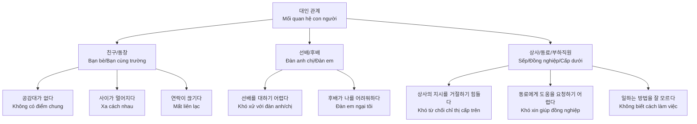
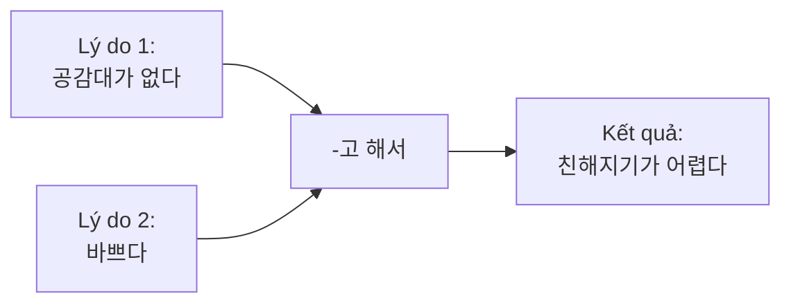
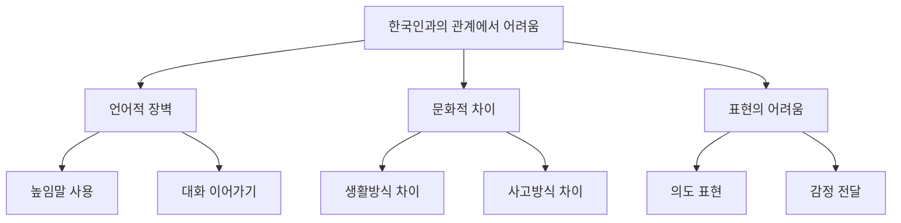
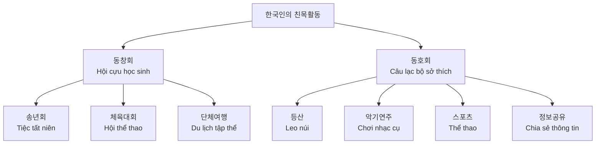

# Bài 1: Mối quan hệ con người (대인 관계)

## Mục tiêu bài học

**Từ vựng:** Các từ vựng về mối quan hệ con người  
**Ngữ pháp:**  
- `-고 해서` (Biểu thị lý do)
- `-으면 되다` (Biểu thị điều kiện đủ)

**Hoạt động:**  
- Nói về những khó khăn và lời khuyên trong mối quan hệ con người
- Viết bài tư vấn về mối quan hệ con người

**Văn hóa và thông tin:** Các hoạt động gắn kết của người Hàn Quốc

---

## I. TỪ VỰNG (어휘)

### 1. Các khó khăn trong mối quan hệ

| Tiếng Hàn | Nghĩa tiếng Việt |
|-----------|------------------|
| 공감대가 없다 | không có điểm chung |
| 사이가 멀어지다 | xa cách nhau |
| 연락이 끊기다 | mất liên lạc |
| 선배를 대하기 어렵다 | khó xử với đàn anh/chị |
| 후배가 나를 어려워하다 | đàn em ngại tôi |
| 상사의 지시를 거절하기 힘들다 | khó từ chối chỉ thị của cấp trên |
| 동료에게 도움을 요청하기 어렵다 | khó xin giúp đỡ đồng nghiệp |
| 일하는 방법을 잘 모르다 | không biết cách làm việc |

### 2. Cách duy trì mối quan hệ tốt

| Tiếng Hàn | Nghĩa tiếng Việt |
|-----------|------------------|
| 자주 연락을 주고받다 | thường xuyên liên lạc |
| 이야기를 잘 들어 주다 | lắng nghe tốt |
| 의견을 솔직하게 말하다 | nói ý kiến thẳng thắn |
| 서로 예의를 지키다 | tôn trọng lẫn nhau |
| 공감을 잘해주다 | đồng cảm tốt |
| 함께 시간을 보내다 | dành thời gian bên nhau |

---

## II. NGỮ PHÁP (문법)

### 1. `-고 해서` - Biểu thị lý do (một trong nhiều lý do)

**Ý nghĩa:** Dùng để chỉ rằng nội dung phía trước là một trong những lý do của nội dung phía sau.

**Cấu trúc:**
- Động từ/Tính từ + `-고 해서`
- `명이다` → `명이고 해서`

#### Bảng hoạt dụng:

| Dạng gốc | Cách dùng | Ví dụ |
|----------|-----------|-------|
| 먹다 | 먹고 해서 | 점심도 먹고 해서 배불러요 |
| 바쁘다 | 바쁘고 해서 | 바쁘고 해서 못 갔어요 |
| 학생이다 | 학생이고 해서 | 학생이고 해서 할인받았어요 |

#### Ví dụ minh họa:

**대화:**
- 민수: 여보, 새로 사귄 친구하고 친해졌어요?
- 후엔: 서로 공감대도 없고 바쁘고 해서 친해지기가 어려워요.

**Các ví dụ khác:**
- 점심시간인데 식사하러 안 가세요? → 조금 전에 샌드위치도 먹고 해서 그냥 사무실에 있으려고요.
- 초등학교 동창들하고 자주 연락을 주고받고 해서 아직도 만나요.

### 2. `-으면 되다` - Biểu thị điều kiện đủ

**Ý nghĩa:** Dùng để chỉ rằng nội dung phía trước là điều kiện đủ để thực hiện việc gì đó.

**Cấu trúc:**
- Không có 받침: `-면 되다`
- Có 받침: `-으면 되다`
- Đặc biệt: `알다` → `알면 되다`

#### Bảng hoạt dụng:

| Dạng gốc | Cách dùng | Ví dụ |
|----------|-----------|-------|
| 찾다 | 찾으면 되다 | 좋은 걸 찾으면 돼요 |
| 있다 | 있으면 되다 | 시간이 있으면 돼요 |
| 가다 | 가면 되다 | 일찍 가면 돼요 |
| 크다 | 크면 되다 | 조금만 크면 돼요 |

#### Ví dụ minh họa:

**대화:**
- 잠시드: 새 직장 동료들하고 가깝게 지내고 싶은데 어떻게 해야 할까요?
- 안젤라: 웃으면서 먼저 인사하고 서로 예의를 지키면 돼요.

**Các ví dụ khác:**
- 찾으시는 휴대 전화 있으세요? → 기능이 다양하고 속도가 빠르면 돼요.
- 이 약은 식사 후에 드시면 됩니다.

---

## III. LUYỆN TẬP (연습)

### Bài tập 1: Sử dụng `-고 해서`

**Hoàn thành các câu sau theo mẫu:**

**보기:** 고향 친구와 자주 못 만나다 + 연락을 자주 못하다  
→ 고향 친구와 자주 못 만나고 연락도 자주 못하고 해서 사이가 멀어졌어요.

1. 새로 사귄 친구와 성격이 다르다 + 공감대가 없다
2. 학교에서 선배를 대하기 어렵다 + 한국어가 부족하다  
3. 외국 친구와 언어가 다르다 + 문화가 다르다
4. 한국 사람과 생각이 다르다 + 말하는 방법을 잘 모르다

### Bài tập 2: Sử dụng `-으면 되다`

**Đưa ra lời khuyên theo mẫu:**

**보기:** 부부가 사이좋게 지내는 방법  
→ 서로 관심을 갖고 상대방의 이야기를 잘 들어 주면 돼요.

1. 친구를 위로하는 방법 (공감해 주고 같이 고민해 주다)
2. 선배와 친하게 지내는 방법 (인사를 잘하고 예의를 지키면서 말하다)
3. 직장 동료와 의견 차이를 줄이는 방법 (의견을 솔직하게 말하고 조금씩 양보하다)
4. 고향 친구와 사이가 멀어지지 않는 방법 (자주 안부를 묻고 연락을 주고받다)

---

## IV. HỘI THOẠI THỰC HÀNH (말하기)

### 상황 1: Tư vấn về khó khăn trong công việc

**반장님:** 잠시드씨, 우리 회사에 온 지 일주일 됐지요? 이제 적응 다 했어요?  
**잠시드:** 좀 힘들지만 적응하려고 노력 중입니다.  
**반장님:** 힘든 게 있어요? 힘든 게 있으면 말해 봐요.  
**잠시드:** 아직 사람들을 대하기가 어렵고 일하는 방법도 잘 모르고 해서 좀 힘듭니다.  
**반장님:** 여기 온 지 얼마 안 돼서 그래요. 좀 익숙해지고 동료들하고 함께 시간을 보내면 될 거예요.  
**잠시드:** 네, 반장님. 시간이 지나면 괜찮아지겠지요. 신경 써 주셔서 감사합니다.

### 상황 2: Cho lời khuyên về mối quan hệ

**A:** 친구의 대인 관계 고민을 듣고 조언을 해 보세요.  
**B:** 여러분의 경험을 바탕으로 이야기해 보세요.

**고민 예시:**
- 고등학교 친구와 연락이 끊기다
- 직장 상사를 대하기 어렵다

**조언 예시:**
- 다시 연락해서 만나 보다
- 인사를 잘하고 예의를 지키다

---

## V. LUYỆN NGHE (듣기)

### 🎧 Audio 1-1: Tự giới thiệu về mối quan hệ

**Câu hỏi:** 여러분은 주변 사람들과의 관계가 어떻습니까?

**Phần nghe:** <audio controls src="https://viedesk.sgp1.cdn.digitaloceanspaces.com/kiip/beginner1/audio_exercise/track26.mp3" title="[Audio 1-1.mp3]"></audio>

### 🎧 Audio 1-2: Cuộc trí chuyện giữa bố và con

**고천 씨가 아들 성민과 이야기합니다. 잘 듣고 질문에 답해 보세요.**

**Phần nghe:** [Audio 1-2.mp3]

#### Bài tập nghe:

1. **들은 내용과 같으면 ○, 다르면 X 하세요.**
   - 성민은 새 학교에서 친구들을 많이 사귀었다. ( )
   - 성민은 주변에 앉은 친구들과 내일 약속이 있다. ( )
   - 성민의 친구들은 중국에 관심이 많아서 질문이 많다. ( )

2. **성민이 엄마에게 들은 이야기가 아닌 것을 고르세요.**
   - "친구들 이야기를 잘 들어 주면 된다."
   - "친구들하고 함께 시간을 보내면 된다."
   - "친구들하고 싸우지 말고 사이좋게 지내야 한다."
   - "중국에 대해서 친구들에게 많이 이야기해 주면 좋다."

---

## VI. ĐỌC HIỂU (읽기)

### Đọc 1: Khó khăn với người Hàn Quốc

**여러분은 한국 사람과의 관계에서 어떤 어려움이 있습니까? 체크해 보세요.**

- [ ] 문화가 다르다
- [ ] (서로에게) 편견을 갖고 있다  
- [ ] 생활방식이 다르다
- [ ] 높임말 사용이 어렵다
- [ ] 무슨 말을 어떻게 해야 하는지 잘 모르겠다
- [ ] 내 의도를 정확하게 표현하기 어렵다
- [ ] 대화를 이어 나가기 힘들다
- [ ] 한국 사람은 사전과 다른 의미의 말을 많이 한다

### Đọc 2: Diễn đàn tư vấn online

**인터넷 상담 게시판에 올라온 이민자들의 대인 관계에 대한 고민과 댓글입니다.**

#### 글 1: 기숙사 룸메이트 문제
**제목:** 기숙사 룸메이트가 한국 사람인데 생활 방식이 달라서 자주 말다툼을 해요.  
**댓글:** 문화가 다르니까 당연히 생활 방식이나 의견에 차이가 있죠. 룸메이트하고 솔직한 대화를 나눠 보는 건 어떨까요?

#### 글 2: 높임말 어려움
**제목:** 한국에서는 높임말 사용이 중요한데 저는 높임말이 너무 어려워요.  
**댓글 1:** 맞아요. 높임말을 배웠지만 그것만으로는 부족해요.  
**댓글 2:** 저도 한국에서 오래 살았지만 아직도 어려워요. 그래서 평소에 한국 사람들이 이야기하는 것을 신경 써서 듣고 많이 연습해요.

---

## VII. VIẾT (쓰기)

### Bài viết 1: Chia sẻ khó khăn và cách khắc phục

**여러분은 한국인과의 관계에서 어려운 점이 있었습니까? 어려운 점을 어떻게 극복했는지 써 보세요.**

| 한국인과의 관계에서 어려운 점 | 극복방법 |
|---------------------------|----------|
| | |
| | |
| | |

### Bài viết 2: Lời khuyên cho người mới

**한국에 온 지 얼마 안 된 이민자 후배에게 한국인 친구를 잘 사귀는 방법에 대해서 조언하는 글을 써 보세요.**

**Gợi ý cấu trúc:**
1. Mở bài: Chào hỏi và đặt vấn đề
2. Thân bài: Đưa ra 3-4 lời khuyên cụ thể
3. Kết bài: Động viên và chúc tốt đẹp

---

## VIII. VĂN HÓA VÀ THÔNG TIN (문화와 정보)

### Các hoạt động gắn kết của người Hàn Quốc

Người Hàn Quốc có hai hình thức gắn kết quan trọng trong đời sống xã hội: **"동창회"** (hội đồng hương/cùng trường) và **"동호회"** (câu lạc bộ sở thích).

#### 동창회 (Hội cựu học sinh)
- **정의:** Tổ chức của những người cùng tốt nghiệp một trường
- **활동:** Tổ chức tiệc tất niên, hội thể thao, du lịch tập thể
- **목적:** Duy trì tình bạn và giữ liên lạc với trường

#### 동호회 (Câu lạc bộ sở thích)  
- **정의:** Nhóm người có chung sở thích
- **형성:** Qua trường học, địa phương, công việc, cộng đồng online
- **활동:** Leo núi, chơi nhạc cụ, thể thao, chia sẻ thông tin
- **lợi ích:** Học hỏi, thu thập thông tin, kết bạn mới

**Câu hỏi thảo luận:**
1. 동창회는 어떤 모임입니까?
2. 동호회에 가입하면 어떤 점이 좋습니까?
3. 여러분 고향에는 어떤 모임이 있습니까?

---

## IX. TỪ VỰNG TỔNG HỢP

### Bảng từ vựng quan trọng

| Tiếng Hàn | Loại từ | Nghĩa tiếng Việt |
|-----------|---------|------------------|
| 대인 관계 | N | mối quan hệ con người |
| 공감대 | N | điểm chung, sự đồng cảm |
| 사이가 멀어지다 | V | xa cách nhau |
| 연락이 끊기다 | V | mất liên lạc |
| 선배 | N | đàn anh/chị |
| 후배 | N | đàn em |
| 상사 | N | cấp trên |
| 동료 | N | đồng nghiệp |
| 지시 | N | chỉ thị |
| 거절하다 | V | từ chối |
| 요청 | N | yêu cầu |
| 방법 | N | phương pháp |
| 솔직하다 | Adj | thẳng thắn |
| 예의 | N | phép lịch sự |
| 공감 | N | sự đồng cảm |
| 사귀다 | V | kết bạn |
| 부족하다 | Adj | thiếu, không đủ |
| 내성적이다 | Adj | hướng nội |
| 적응하다 | V | thích nghi |
| 노력 중이다 | V | đang cố gắng |

---

## X. ĐÁNH GIÁ TỔNG KẾT

### Bài kiểm tra tự đánh giá

1. **Ngữ pháp:** Viết 3 câu sử dụng `-고 해서` và 3 câu sử dụng `-으면 되다`
2. **Từ vựng:** Giải thích 5 khó khăn thường gặp trong mối quan hệ với người Hàn
3. **Giao tiếp:** Đóng vai tư vấn cho bạn có khó khăn trong mối quan hệ
4. **Văn hóa:** So sánh 동창회 và 동호회 ở Hàn Quốc với các tổ chức tương tự ở Việt Nam

### Mức độ hoàn thành bài học

- [ ] Thuộc lòng từ vựng về mối quan hệ con người
- [ ] Sử dụng thành thạo `-고 해서` và `-으면 되다`
- [ ] Có thể tư vấn về các vấn đề mối quan hệ
- [ ] Hiểu về văn hóa gắn kết của người Hàn Quốc
- [ ] Viết được bài tư vấn hoàn chỉnh

---

**📚 Kết thúc Bài 1: 대인 관계 (Mối quan hệ con người)**

*Chúc các bạn học tập hiệu quả và xây dựng được những mối quan hệ tốt đẹp!*