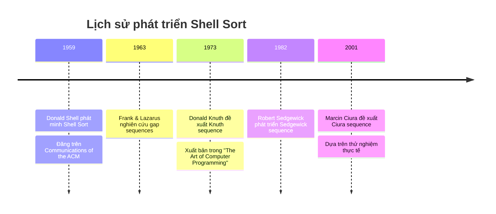
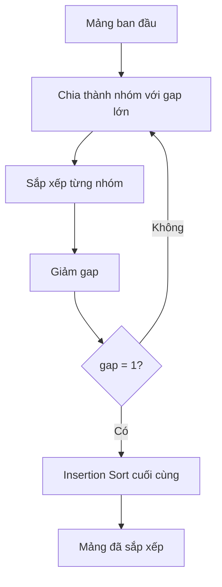
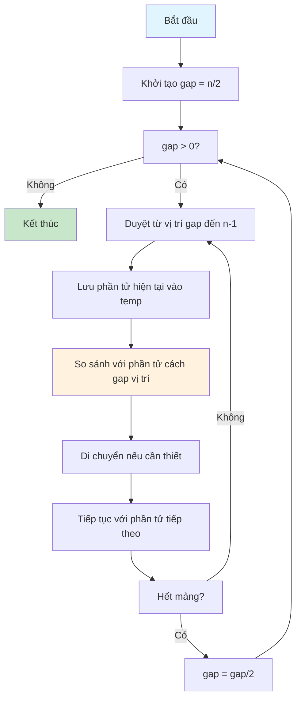
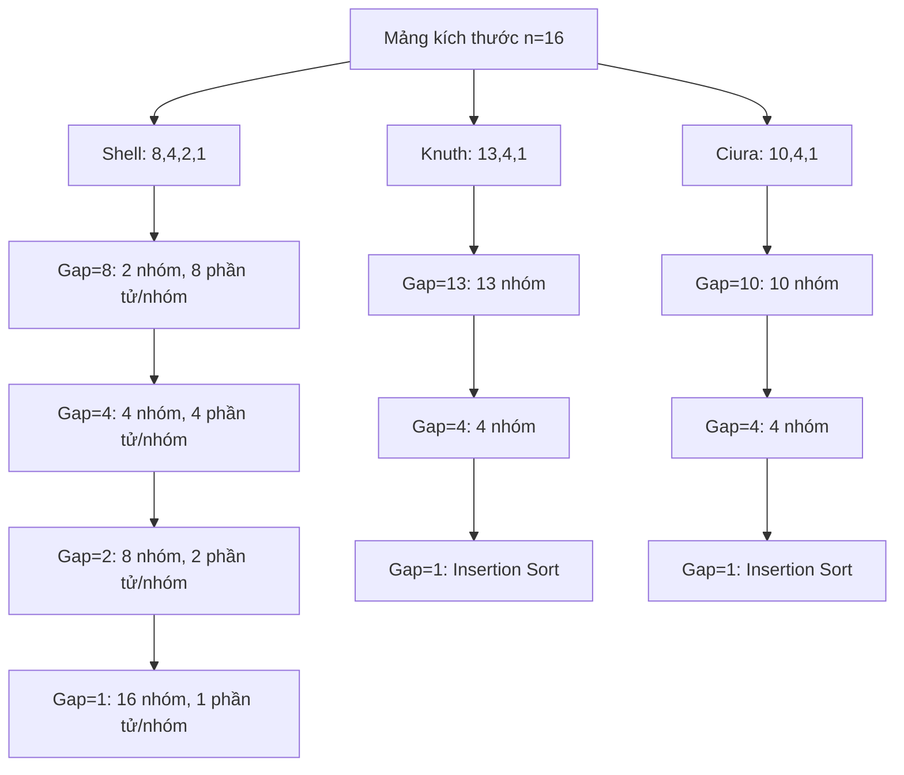
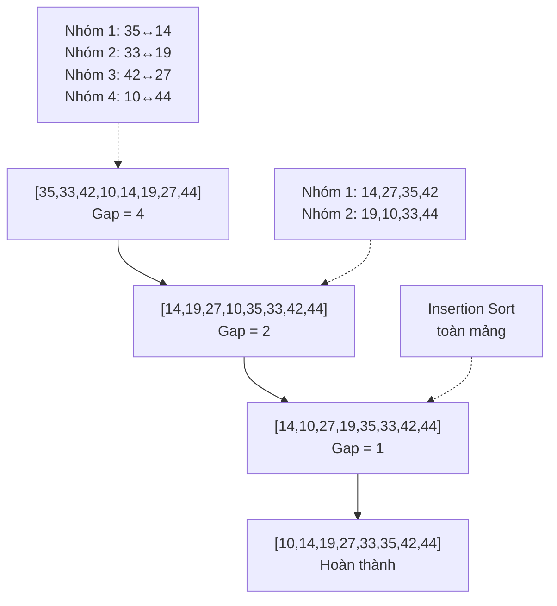

# GIÁO TRÌNH THUẬT TOÁN SẮP XẾP SHELL (SHELL SORT)

## MỤC LỤC
1. [Lịch sử và giới thiệu](#1-lịch-sử-và-giới-thiệu)
2. [Nguyên lý hoạt động](#2-nguyên-lý-hoạt-động)
3. [Phân tích thuật toán](#3-phân-tích-thuật-toán)
4. [Triển khai thực tế](#4-triển-khai-thực-tế)
5. [Các dãy khoảng cách](#5-các-dãy-khoảng-cách)
6. [Ví dụ minh họa](#6-ví-dụ-minh-họa)
7. [So sánh và ứng dụng](#7-so-sánh-và-ứng-dụng)
8. [Bài tập thực hành](#8-bài-tập-thực-hành)

---

## 1. LỊCH SỬ VÀ GIỚI THIỆU

### 1.1 Bối cảnh lịch sử

Thuật toán Shell Sort được phát minh bởi **Donald Lewis Shell** vào năm **1959** tại Bell Labs. Đây là một trong những cải tiến quan trọng đầu tiên của thuật toán Insertion Sort, ra đời trong bối cảnh:

- **Thời kỳ 1950s**: Máy tính còn rất hạn chế về bộ nhớ và tốc độ xử lý
- **Nhu cầu thực tế**: Cần sắp xếp dữ liệu lớn với tài nguyên hạn chế
- **Tính đột phá**: Là thuật toán đầu tiên phá vỡ rào cản O(n²) của các thuật toán sắp xếp đơn giản



### 1.2 Định nghĩa và đặc điểm

**Shell Sort** là một thuật toán sắp xếp so sánh, hoạt động tại chỗ (in-place), được phát triển như một cải tiến của Insertion Sort.

**Đặc điểm chính:**
- **Ý tưởng cốt lõi**: Chia mảng thành các nhóm con theo khoảng cách (gap), sắp xếp từng nhóm, sau đó giảm dần khoảng cách
- **Cải tiến**: Cho phép các phần tử "nhảy" xa trong mảng thay vì chỉ di chuyển từng vị trí một
- **Hiệu quả**: Tạo ra mảng "gần như đã sắp xếp" trước khi thực hiện Insertion Sort cuối cùng



---

## 2. NGUYÊN LY HOẠT ĐỘNG

### 2.1 Khái niệm khoảng cách (Gap)

**Khoảng cách (Gap)** là khoảng cách giữa các phần tử được so sánh và hoán đổi trong Shell Sort.

| Khái niệm | Mô tả | Ví dụ |
|-----------|-------|-------|
| **Gap** | Khoảng cách giữa các phần tử so sánh | gap = 4: so sánh phần tử tại vị trí 0 với 4 |
| **Nhóm con** | Tập các phần tử cách đều nhau gap đơn vị | [a[0], a[4], a[8], ...] |
| **h-sorted** | Mảng được sắp xếp với khoảng cách h | Mọi dãy con cách đều h đã được sắp xếp |

### 2.2 Quy trình thực hiện



### 2.3 Minh họa bằng hình ảnh


**Giải thích hình ảnh:**
- Các màu khác nhau đại diện cho các nhóm con với cùng gap
- Phần tử di chuyển từ vị trí này sang vị trí khác trong cùng nhóm
- Gap giảm dần cho đến khi bằng 1

---

## 3. PHÂN TÍCH THUẬT TOÁN

### 3.1 Độ phức tạp thời gian

| Gap Sequence | Tốt nhất | Trung bình | Xấu nhất | Ghi chú |
|--------------|----------|------------|----------|---------|
| Shell Original (n/2^k) | O(n log n) | O(n²) | O(n²) | Đơn giản nhưng không tối ưu |
| Knuth (3k+1)/2 | O(n log n) | O(n^1.5) | O(n^1.5) | Phổ biến, hiệu quả tốt |
| Sedgewick | O(n log n) | O(n^1.33) | O(n^1.33) | Tối ưu lý thuyết |
| Ciura | O(n log n) | O(n^1.3) | O(n^1.3) | Tốt cho mảng < 4000 |

```mermaid
graph LR
    A[O(n²)] --> B[O(n^1.5)]
    B --> C[O(n^1.33)]
    C --> D[O(n log n)]
    
    A -.->|Shell Original| A1[Đơn giản]
    B -.->|Knuth| B1[Phổ biến]
    C -.->|Sedgewick| C1[Lý thuyết]
    D -.->|Tối ưu| D1[Mục tiêu]
```

### 3.2 Độ phức tạp không gian

**Shell Sort luôn có độ phức tạp không gian O(1)** vì:
- Sắp xếp tại chỗ (in-place)
- Chỉ cần một số biến tạm thời
- Không cần thêm mảng phụ

### 3.3 Tính ổn định

**Shell Sort KHÔNG ổn định** vì:
- Các phần tử có thể "nhảy" qua nhau với khoảng cách lớn
- Thứ tự tương đối của các phần tử bằng nhau có thể bị thay đổi

**Ví dụ mất tính ổn định:**
```
Ban đầu: [4a, 2, 4b, 1] (4a xuất hiện trước 4b)
Gap = 2: [4a, 1, 4b, 2] → [1, 4a, 2, 4b]
Kết quả: 4b xuất hiện trước 4a → Mất tính ổn định
```

---

## 4. TRIỂN KHAI THỰC TẾ

### 4.1 Triển khai cơ bản (JavaScript)

```javascript
class ShellSort {
  constructor(comparator = null) {
    this.comparator = comparator || this.defaultComparator;
  }
  
  defaultComparator(a, b) {
    if (a < b) return -1;
    if (a > b) return 1;
    return 0;
  }
  
  sort(originalArray) {
    // Sao chép mảng để tránh thay đổi mảng gốc
    const array = [...originalArray];
    const n = array.length;
    
    // Bắt đầu với gap = n/2, giảm dần cho đến 1
    for (let gap = Math.floor(n / 2); gap > 0; gap = Math.floor(gap / 2)) {
      // Thực hiện insertion sort cho từng nhóm con
      for (let i = gap; i < n; i++) {
        const temp = array[i];
        let j = i;
        
        // Di chuyển các phần tử lớn hơn temp về phía sau
        while (j >= gap && this.comparator(array[j - gap], temp) > 0) {
          array[j] = array[j - gap];
          j -= gap;
        }
        
        array[j] = temp;
      }
    }
    
    return array;
  }
}
```

### 4.2 Triển khai với nhiều gap sequence

```javascript
class ShellSortAdvanced extends ShellSort {
  // Shell's original sequence: n/2, n/4, n/8, ..., 1
  generateShellSequence(n) {
    const sequence = [];
    for (let gap = Math.floor(n / 2); gap > 0; gap = Math.floor(gap / 2)) {
      sequence.push(gap);
    }
    return sequence;
  }

  // Knuth's sequence: 1, 4, 13, 40, 121, ...
  generateKnuthSequence(n) {
    const sequence = [];
    let gap = 1;
    while (gap < n) {
      sequence.push(gap);
      gap = gap * 3 + 1;
    }
    return sequence.reverse();
  }

  // Ciura's sequence (tốt cho n < 4000)
  generateCiuraSequence() {
    return [1750, 701, 301, 132, 57, 23, 10, 4, 1];
  }

  sort(originalArray, sequenceType = 'shell') {
    const array = [...originalArray];
    const n = array.length;
    let gapSequence;

    // Chọn gap sequence
    switch (sequenceType) {
      case 'knuth':
        gapSequence = this.generateKnuthSequence(n);
        break;
      case 'ciura':
        gapSequence = this.generateCiuraSequence().filter(gap => gap < n);
        break;
      default:
        gapSequence = this.generateShellSequence(n);
    }

    // Thực hiện sắp xếp với từng gap
    for (const gap of gapSequence) {
      for (let i = gap; i < n; i++) {
        const temp = array[i];
        let j = i;

        while (j >= gap && this.comparator(array[j - gap], temp) > 0) {
          array[j] = array[j - gap];
          j -= gap;
        }
        array[j] = temp;
      }
    }

    return array;
  }
}
```

---

## 5. CÁC DÃY KHOẢNG CÁCH (GAP SEQUENCES)

### 5.1 Bảng so sánh các Gap Sequences

| Sequence | Công thức | Ví dụ | Độ phức tạp | Ưu điểm | Nhược điểm |
|----------|-----------|-------|-------------|---------|------------|
| **Shell** | n/2^k | 8,4,2,1 | O(n²) | Đơn giản | Không tối ưu |
| **Knuth** | (3^k-1)/2 | 13,4,1 | O(n^1.5) | Hiệu quả tốt | Phức tạp hơn |
| **Sedgewick** | 4^k+3×2^k-1 | 15,5,1 | O(n^1.33) | Tối ưu lý thuyết | Khó tính |
| **Ciura** | Thực nghiệm | 23,10,4,1 | O(n^1.3) | Thực tế tốt | Chỉ đến 4000 |

### 5.2 Minh họa Gap Sequences



### 5.3 Code sinh Gap Sequences

```javascript
class GapSequenceGenerator {
  static shell(n) {
    const gaps = [];
    for (let gap = Math.floor(n / 2); gap > 0; gap = Math.floor(gap / 2)) {
      gaps.push(gap);
    }
    return gaps;
  }
  
  static knuth(n) {
    const gaps = [];
    let gap = 1;
    while (gap < n) {
      gaps.push(gap);
      gap = gap * 3 + 1;
    }
    return gaps.reverse();
  }
  
  static sedgewick(n) {
    const gaps = [];
    let i = 0;
    while (true) {
      let gap;
      if (i % 2 === 0) {
        gap = 9 * Math.pow(2, i) - 9 * Math.pow(2, i / 2) + 1;
      } else {
        gap = 8 * Math.pow(2, i) - 6 * Math.pow(2, (i + 1) / 2) + 1;
      }
      if (gap >= n) break;
      gaps.push(gap);
      i++;
    }
    return gaps.reverse();
  }
  
  static ciura() {
    return [1750, 701, 301, 132, 57, 23, 10, 4, 1];
  }
}
```

---

## 6. VÍ DỤ MINH HỌA

### 6.1 Ví dụ chi tiết: Sắp xếp mảng [35, 33, 42, 10, 14, 19, 27, 44]

#### Bước chuẩn bị
```
Mảng ban đầu: [35, 33, 42, 10, 14, 19, 27, 44]
Chỉ số:        [ 0,  1,  2,  3,  4,  5,  6,  7]
Kích thước n = 8
Gap sequence (Shell): [4, 2, 1]
```

#### Bước 1: Gap = 4

| Nhóm | Chỉ số | Phần tử | Sau sắp xếp |
|------|--------|---------|-------------|
| 1 | 0, 4 | 35, 14 | 14, 35 |
| 2 | 1, 5 | 33, 19 | 19, 33 |
| 3 | 2, 6 | 42, 27 | 27, 42 |
| 4 | 3, 7 | 10, 44 | 10, 44 |

```
Trước: [35, 33, 42, 10, 14, 19, 27, 44]
       |----gap=4----|  |----gap=4----|
Sau:   [14, 19, 27, 10, 35, 33, 42, 44]
```

#### Bước 2: Gap = 2

| Nhóm | Chỉ số | Phần tử | Sau sắp xếp |
|------|--------|---------|-------------|
| 1 | 0,2,4,6 | 14,27,35,42 | 14,27,35,42 |
| 2 | 1,3,5,7 | 19,10,33,44 | 10,19,33,44 |

```
Trước: [14, 19, 27, 10, 35, 33, 42, 44]
       |--gap=2--|  |--gap=2--|
Sau:   [14, 10, 27, 19, 35, 33, 42, 44]
```

#### Bước 3: Gap = 1 (Insertion Sort)

```
[14, 10, 27, 19, 35, 33, 42, 44]
→ [10, 14, 27, 19, 35, 33, 42, 44] (hoán đổi 14,10)
→ [10, 14, 19, 27, 35, 33, 42, 44] (chèn 19)
→ [10, 14, 19, 27, 33, 35, 42, 44] (chèn 33)
→ [10, 14, 19, 27, 33, 35, 42, 44] (đã sắp xếp)
```

### 6.2 Bảng theo dõi từng bước

| Bước | Gap | Mảng | Ghi chú |
|------|-----|------|---------|
| Ban đầu | - | [35,33,42,10,14,19,27,44] | Mảng gốc |
| 1 | 4 | [14,19,27,10,35,33,42,44] | 4 nhóm được sắp xếp |
| 2 | 2 | [14,10,27,19,35,33,42,44] | 2 nhóm được sắp xếp |
| 3 | 1 | [10,14,19,27,33,35,42,44] | Insertion sort cuối |

### 6.3 Visualização với Mermaid



---

## 7. SO SÁNH VÀ ỨNG DỤNG

### 7.1 So sánh với các thuật toán khác

```mermaid
graph LR
    A[Thuật toán sắp xếp] --> B[O(n²)]
    A --> C[O(n log n)]
    A --> D[O(n^1.3)]
    
    B --> B1[Bubble Sort]
    B --> B2[Selection Sort]
    B --> B3[Insertion Sort]
    
    C --> C1[Quick Sort]
    C --> C2[Merge Sort]
    C --> C3[Heap Sort]
    
    D --> D1[Shell Sort]
    
    style D1 fill:#ffeb3b
```

### 7.2 Bảng so sánh chi tiết

| Thuật toán | Thời gian TB | Bộ nhớ | Ổn định | In-place | Phù hợp |
|------------|-------------|---------|---------|----------|---------|
| **Shell Sort** | O(n^1.3) | O(1) | ❌ | ✅ | Mảng trung bình |
| **Insertion Sort** | O(n²) | O(1) | ✅ | ✅ | Mảng nhỏ/gần sắp xếp |
| **Quick Sort** | O(n log n) | O(log n) | ❌ | ✅ | Mảng lớn |
| **Merge Sort** | O(n log n) | O(n) | ✅ | ❌ | Cần ổn định |
| **Heap Sort** | O(n log n) | O(1) | ❌ | ✅ | Đảm bảo hiệu suất |

### 7.3 Khi nào nên sử dụng Shell Sort

#### ✅ Nên sử dụng khi:
- **Mảng cỡ trung bình** (100 - 10,000 phần tử)
- **Bộ nhớ hạn chế** (cần sắp xếp in-place)
- **Hiệu suất ổn định** hơn Quick Sort
- **Code đơn giản** hơn Merge Sort
- **Dữ liệu gần như đã sắp xếp**

#### ❌ Không nên sử dụng khi:
- **Mảng rất lớn** (> 100,000 phần tử)
- **Cần tính ổn định** (stable sort)
- **Yêu cầu hiệu suất tối ưu** O(n log n)
- **Mảng rất nhỏ** (< 50 phần tử)

### 7.4 Ứng dụng thực tế

```javascript
// 1. Sắp xếp danh sách sản phẩm
class ProductSorter {
  sortByPrice(products) {
    const shellSort = new ShellSort((a, b) => a.price - b.price);
    return shellSort.sort(products);
  }
}

// 2. Tiền xử lý cho thuật toán khác
class HybridSorter {
  sort(array) {
    if (array.length < 1000) {
      return new ShellSort().sort(array);
    } else {
      // Shell Sort làm tiền xử lý, sau đó Quick Sort
      const preSorted = new ShellSort().sort(array);
      return new QuickSort().sort(preSorted);
    }
  }
}

// 3. Xử lý real-time
class RealTimeProcessor {
  constructor() {
    this.buffer = [];
    this.shellSort = new ShellSort();
  }
  
  addData(newData) {
    this.buffer.push(...newData);
    if (this.buffer.length > 1000) {
      this.buffer = this.shellSort.sort(this.buffer);
      this.processBuffer();
    }
  }
}
```

---

## 8. BÀI TẬP THỰC HÀNH

### 8.1 Câu hỏi lý thuyết

1. **Cơ bản**: Giải thích tại sao Shell Sort hiệu quả hơn Insertion Sort?
2. **Trung bình**: So sánh ưu nhược điểm của các gap sequence khác nhau.
3. **Nâng cao**: Phân tích độ phức tạp của Shell Sort với Knuth sequence.

### 8.2 Bài tập lập trình

#### Bài 1: Triển khai cơ bản
```javascript
// Triển khai Shell Sort cơ bản
function shellSort(arr) {
  // TODO: Viết code ở đây
}

// Test case
const testArray = [64, 34, 25, 12, 22, 11, 90];
console.log(shellSort(testArray)); // [11, 12, 22, 25, 34, 64, 90]
```

#### Bài 2: So sánh Gap Sequences
```javascript
// So sánh hiệu suất các gap sequence
function compareGapSequences(arr) {
  const sequences = ['shell', 'knuth', 'ciura'];
  const results = {};
  
  sequences.forEach(seq => {
    const start = performance.now();
    // TODO: Chạy Shell Sort với sequence này
    const end = performance.now();
    results[seq] = end - start;
  });
  
  return results;
}
```

#### Bài 3: Shell Sort cho đối tượng
```javascript
// Sắp xếp mảng sinh viên theo điểm
const students = [
  { name: 'An', score: 85 },
  { name: 'Bình', score: 92 },
  { name: 'Chi', score: 78 }
];

function sortStudentsByScore(students) {
  // TODO: Sử dụng Shell Sort để sắp xếp theo điểm
}
```

### 8.3 Bài tập phân tích

1. **Trace Algorithm**: Vẽ sơ đồ thực hiện Shell Sort cho mảng [5,2,8,1,9,3]
2. **Gap Analysis**: Tính toán gap sequence cho mảng 1000 phần tử với các phương pháp khác nhau
3. **Performance Test**: So sánh thời gian thực thi của Shell Sort và Insertion Sort

### 8.4 Đáp án gợi ý

#### Đáp án Bài 1:
```javascript
function shellSort(arr) {
  const n = arr.length;
  
  for (let gap = Math.floor(n / 2); gap > 0; gap = Math.floor(gap / 2)) {
    for (let i = gap; i < n; i++) {
      let temp = arr[i];
      let j = i;
      
      while (j >= gap && arr[j - gap] > temp) {
        arr[j] = arr[j - gap];
        j -= gap;
      }
      
      arr[j] = temp;
    }
  }
  
  return arr;
}
```

---

## TÀI LIỆU THAM KHẢO

### Sách và bài báo khoa học
1. **Donald L. Shell** (1959). "A High-Speed Sorting Procedure". Communications of the ACM
2. **Donald E. Knuth** (1973). "The Art of Computer Programming, Volume 3: Sorting and Searching"
3. **Robert Sedgewick** (1982). "Algorithms". Addison-Wesley
4. **Marcin Ciura** (2001). "Best Increments for the Average Case of Shell Sort"

### Tài nguyên trực tuyến
- [Wikipedia - Shell Sort](https://en.wikipedia.org/wiki/Shellsort)
- [Visualgo - Shell Sort Visualization](https://visualgo.net/en/sorting)
- [GeeksforGeeks - Shell Sort](https://www.geeksforgeeks.org/shellsort/)
- [YouTube - Shell Sort Explained](https://www.youtube.com/watch?v=ddeLSDsYVp8)

### Thử nghiệm và benchmark
- [Online Encyclopedia of Integer Sequences - Gap Sequences](https://oeis.org/A000670)
- [Sorting Algorithm Animations](https://www.toptal.com/developers/sorting-algorithms)

---

**Ghi chú**: Tài liệu này được biên soạn cho mục đích giảng dạy và học