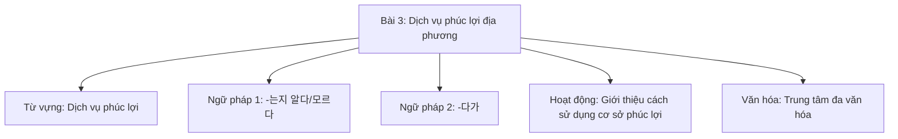
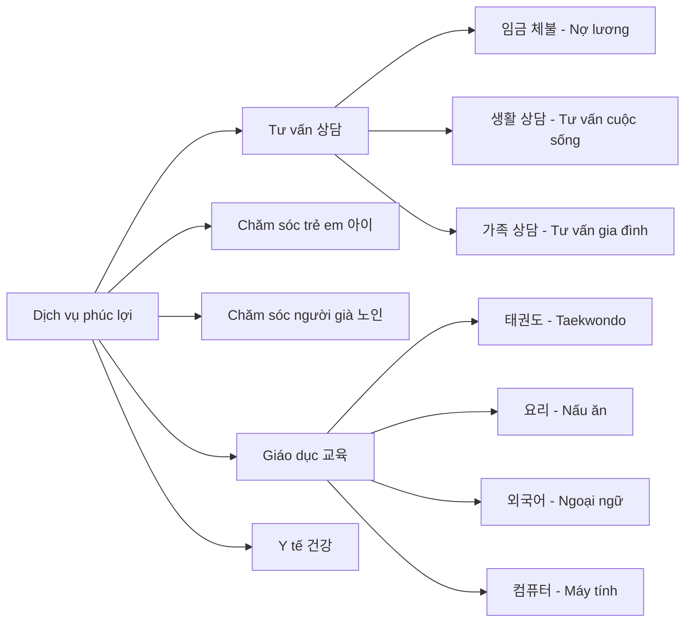
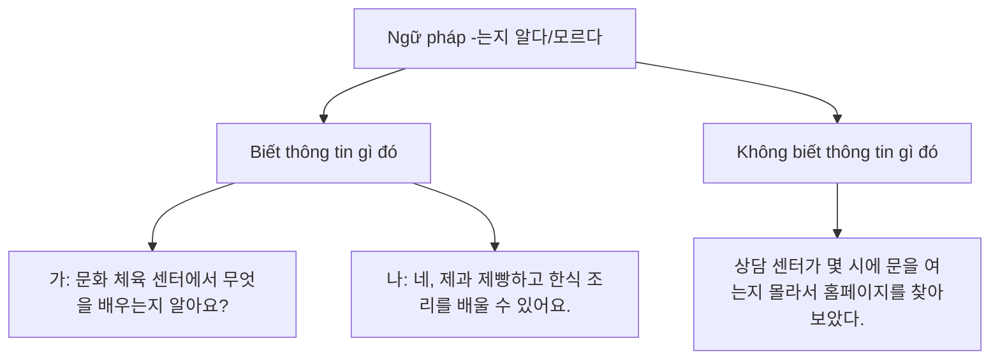
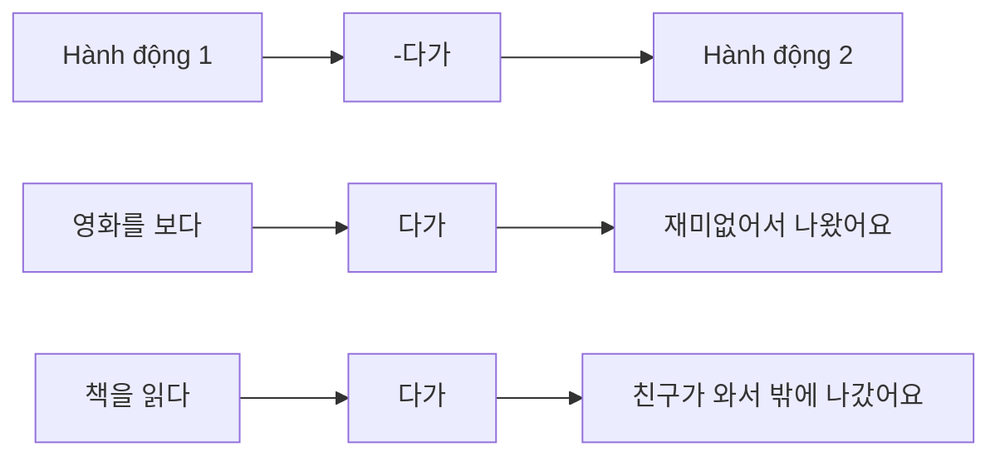
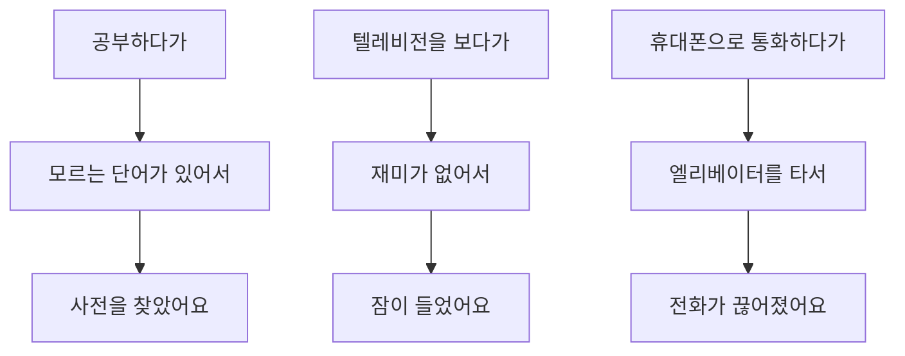
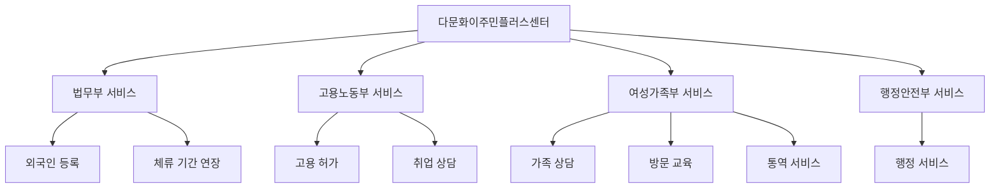
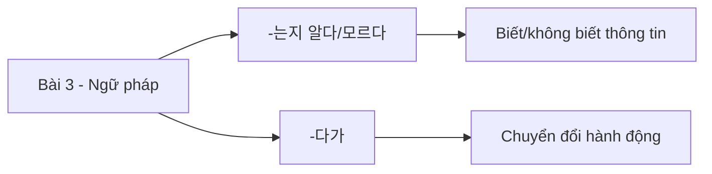

# Bài 3: Dịch vụ phúc lợi địa phương
## 지역 복지 서비스

### 📋 Mục tiêu bài học

---

## 📚 I. TỪ VỰNG (어휘)

### 1. Các dịch vụ hỗ trợ cuộc sống tại Hàn Quốc

| Từ vựng tiếng Hàn | Nghĩa tiếng Việt | Ví dụ |
|---|---|---|
| 상담을 받다 | Nhận tư vấn | 취업 상담을 받다 (nhận tư vấn việc làm) |
| 통번역 서비스를 받다 | Nhận dịch vụ phiên dịch | 병원에서 통번역 서비스를 받다 |
| 구직/창업상담을 받다 | Nhận tư vấn tìm việc/khởi nghiệp | 외국인 지원 센터에서 창업상담을 받다 |
| 아이를 맡기다 | Gửi con | 어린이집에 아이를 맡기다 |
| 장난감을 대여하다 | Thuê đồ chơi | 육아 종합지원센터에서 장난감을 대여하다 |
| 육아 정보를 얻다 | Nhận thông tin nuôi dạy con | 보건소에서 육아 정보를 얻다 |
| 노인을 돌보다 | Chăm sóc người già | 요양원에서 노인을 돌보다 |
| 한국문화를 배우다 | Học văn hóa Hàn Quốc | 문화센터에서 한국문화를 배우다 |
| 건강 검진을 받다 | Khám sức khỏe | 보건소에서 건강 검진을 받다 |
| 예방 접종을 받다 | Tiêm phòng | 아이가 예방 접종을 받다 |

### 2. Các từ vựng chuyên ngành

---

## 📖 II. NGỮ PHÁP (문법)

### 1. Ngữ pháp 1: -는지 알다/모르다

**Ý nghĩa**: Dùng để diễn tả việc biết hay không biết về một thông tin nào đó.

**Cách sử dụng**:

| Dạng động từ | Cách chia | Ví dụ |
|---|---|---|
| Động từ có 받침 | V + 는지 알다/모르다 | 읽다 → 읽는지 알다 |
| Động từ không có 받침 | V + 는지 알다/모르다 | 가다 → 가는지 알다 |
| Tính từ có 받침 | V + 은지 알다/모르다 | 좋다 → 좋은지 알다 |
| Tính từ không có 받침 | V + ㄴ지 알다/모르다 | 싸다 → 싼지 알다 |

**Ví dụ thực tế**:
- 어디에서 예방 접종을 하는지 알아요? (Bạn có biết ở đâu tiêm phòng không?)
- 외국인도 복지 서비스를 이용할 수 있는지 아는 사람이 많지 않다. (Không nhiều người biết người nước ngoài cũng có thể sử dụng dịch vụ phúc lợi.)

### 2. Ngữ pháp 2: -다가

**Ý nghĩa**: Diễn tả việc một hành động hay trạng thái bị ngắt quãng và chuyển sang việc khác.

**Cách sử dụng**:
- Động từ + 다가

**Ví dụ thực tế**:
- 지난달까지 구직 상담을 받다가 얼마 전에 취직해서 지금은 받지 않아요. (Đến tháng trước tôi còn nhận tư vấn tìm việc, nhưng vừa rồi tôi đã xin được việc nên bây giờ không nhận nữa.)
- 컴퓨터 학원에 다니다가 어려워서 요리 수업으로 바꿨어요. (Tôi học máy tính ở học viện nhưng vì khó quá nên đã chuyển sang học nấu ăn.)

---

## 🗣️ III. HOẠT ĐỘNG THỰC HÀNH

### 1. Luyện tập ngữ pháp -는지 알다/모르다

**Bài tập 1**: Hoàn thành câu hỏi và trả lời theo mẫu

| Câu hỏi | Trả lời |
|---|---|
| 어디에서 상담을 받을 수 있는지 아세요? | 네, 알아요. 4층 상담 센터예요. |
| 아이의 예방 접종 비용이 얼마____ 아세요? | 무료예요. |
| 문화 체육 센터에 무슨 수업이 있는지 ____? | 태권도, 요리 수업이 있어요. |
| 어디에서 장난감을 빌릴 수 있는지 ____? | 육아 종합지원센터에서 빌릴 수 있어요. |

### 2. Luyện tập ngữ pháp -다가

**Bài tập 2**: Kết hợp các tình huống theo mẫu

---

## 👥 IV. HOẠT ĐỘNG GIAO TIẾP

### 1. Hội thoại mẫu: Hỏi về dịch vụ phúc lợi

**🎧 [Audio 3-1]** *(Đường dẫn file nghe sẽ được cập nhật)*

**후엔**: 어머, 미호 씨. 컴퓨터를 배우세요?

**미호**: 네, 혼자 책 보고 공부하다가 요즘은 동네에 있는 문화 체육 센터에서 배우고 있어요.

**후엔**: 와, 저는 우리 동네에 그런 시설이 있는지 몰랐어요. 수업은 언제 해요?

**미호**: 매주 화요일과 목요일 오후 7시부터 8시까지 해요. 요리, 수영, 컴퓨터 등 다양한 프로그램이 있으니까 한번 알아보세요.

### 2. Bảng thông tin chương trình

| 요일 | 시간 | 내용 | 금액 |
|---|---|---|---|
| 수영 | 월~금 오전 6~7시 | 초급 | 5만 원 |
| 컴퓨터 1 | 화, 목 오후 7~8시 | 초급 | 3만 원 |
| 컴퓨터 2 | 화, 목 오후 8~9시 | 중급 | 3만 원 |
| 한국요리 | 수 오전 10~11시 | 일반 가정식 | 재료비 |
| 태권도 | 월~금 오전 8~9시 | 초급 | 5만 원 |
| K-POP 댄스 | 월, 수, 금 오후 5~6시 | 취미반 | 3만 원 |

*※ 1회 무료 체험 가능. 65세 이상은 50% 할인*

---

## 👂 V. LUYỆN NGHE (듣기)

### Bài nghe 1: Đăng ký khóa học

**🎧 [Audio 3-P.mp3]** *(Đường dẫn file nghe sẽ được cập nhật)*

**Câu hỏi**:
1. 후엔 씨는 어느 프로그램에 등록하고 싶었습니까?
2. 등록비는 얼마입니까?
3. 들은 내용과 같으면 ○, 다르면 × 하세요:
   - 초급 컴퓨터 프로그램은 지금 자리가 있다. ( )
   - 중급 컴퓨터 프로그램은 신청할 수 있다. ( )
   - 수업은 화요일과 목요일에 한다. ( )

### Phát âm: 문의 [무늬, 무니]

**🎧 [Audio 3-L.mp3]** *(Đường dẫn file nghe sẽ được cập nhật)*

| Từ gốc | Cách phát âm |
|---|---|
| 문의 | [무늬, 무니] |
| 편의 | [펴늬, 펴니] |
| 논의 | [노늬, 노니] |

---

## 📖 VI. LUYỆN ĐỌC (읽기)

### 1. Đọc poster thông tin

#### Poster 1: Tiêm phòng cúm mùa đông
> **겨울철 독감 예방 접종**
> 
> 어린이, 임산부, 어르신
> **무료로 받으세요!**

#### Poster 2: Chương trình đào tạo việc làm cho người nước ngoài
> **외국인 취업 교육 프로그램**
> 
> - **기간**: 7월 2일~7월 19일
> - **참가 자격**: ○○시 거주 외국인 30명, TOPIK 3급 또는 KIIP 3단계 이상
> - **프로그램 내용**: 비즈니스 한국어, 취업교육(이력서 작성법, 면접), 선배와의 대화
> - **신청 방법**: 이메일 접수

### 2. Đọc hiểu bài báo

**Tiêu đề**: 이민자와 다문화 가족을 위한 복지 센터 문 열어

○○시 외국인 복지 센터가 오는 9일 문을 연다. 이민자와 다문화 가족을 위한 복지 센터는 국제 문화 교류실, 공동체 모임방, 상담실, 교육실, 강당 등 다양한 시설을 갖추고 있다.

1층은 국가별 영화 상영과 전시 등을 통해 지역 주민들에게 세계 문화를 소개하고 서로의 문화를 이해하는 사회 통합의 장으로 활용된다.

**Câu hỏi**:
1. 무엇에 대한 기사입니까?
2. 종합 복지 센터에서 제공하는 서비스가 아닌 것을 고르세요.
   ① 가족상담 ② 통번역교육 ③ 한국어교육 ④ 방문 서비스

---

## ✍️ VII. LUYỆN VIẾT (쓰기)

### Viết giới thiệu dịch vụ phúc lợi

**Hướng dẫn**: Hãy viết một đoạn văn giới thiệu về dịch vụ phúc lợi mà bạn đã sử dụng hoặc muốn giới thiệu cho người khác.

**Gợi ý cấu trúc**:
1. 무슨 복지 서비스를 이용해 봤습니까?
2. 어떻게 그 서비스를 알았습니까?
3. 그 서비스는 무엇이 좋습니까?
4. 그 서비스를 이용하는 방법은 무엇입니까?

---

## 🌐 VIII. VĂN HÓA VÀ THÔNG TIN

### Trung tâm đa văn hóa (다문화이주민플러스센터)

**Tại đây bạn có thể nhận được**:
- Đăng ký người nước ngoài và gia hạn thời gian lưu trú
- Tư vấn việc làm và cấp phép lao động
- Tư vấn gia đình, giáo dục tại nhà, dịch vụ phiên dịch
- Các dịch vụ hành chính khác

**Địa điểm**: Hiện tại đang hoạt động tại 10 khu vực thí điểm như Yangju, Icheon, Paju, Ansan, Suwon, Namyangju, Siheung (Gyeonggi), Jung-gu (Incheon), Asan (Chungnam), Yangsan (Gyeongnam) và đang mở rộng dần.

---

## 📝 IX. TỰ KIỂM TRA

### Bảng từ vựng cần nhớ

| ✓ | Từ vựng | ✓ | Từ vựng |
|---|---|---|---|
| □ | 상담을 받다 | □ | 장 |
| □ | 통번역 서비스를 받다 | □ | 활용되다 |
| □ | 구직/창업상담을 받다 | □ | 고충 |
| □ | 아이를 맡기다 | □ | 임금체불 |
| □ | 장난감을 대여하다 | □ | 산업재해 |
| □ | 육아 정보를 얻다 | □ | 근무조건 |
| □ | 노인을 돌보다 | □ | 의료상담 |
| □ | 한국문화를 배우다 | □ | 참가자격 |
| □ | 건강검진을 받다 | □ | 정착 |
| □ | 예방접종을 받다 | □ | 교류실 |

### Điểm ngữ pháp chính

**Ôn tập**:
- Sử dụng -는지 알다/모르다 để hỏi và trả lời về thông tin
- Sử dụng -다가 để diễn tả việc thay đổi hoặc ngừng hành động
- Từ vựng về các dịch vụ phúc lợi xã hội
- Cách hỏi thông tin và đăng ký dịch vụ

---

*Hết bài 3: Dịch vụ phúc lợi địa phương*