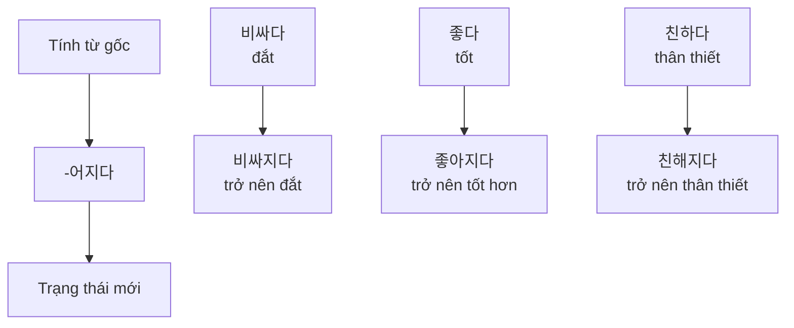
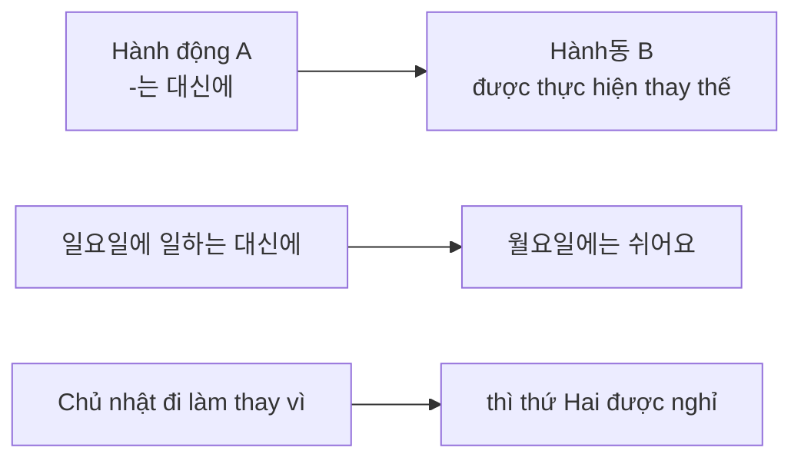
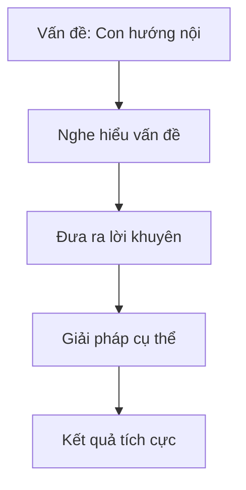
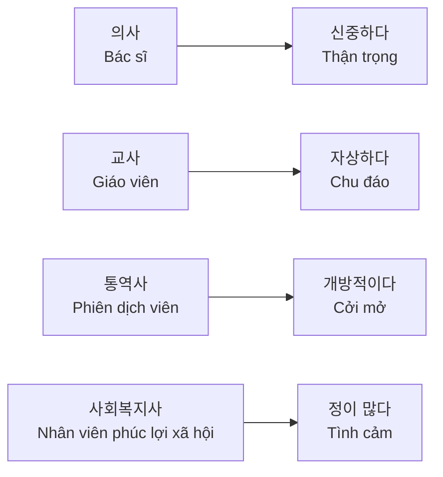
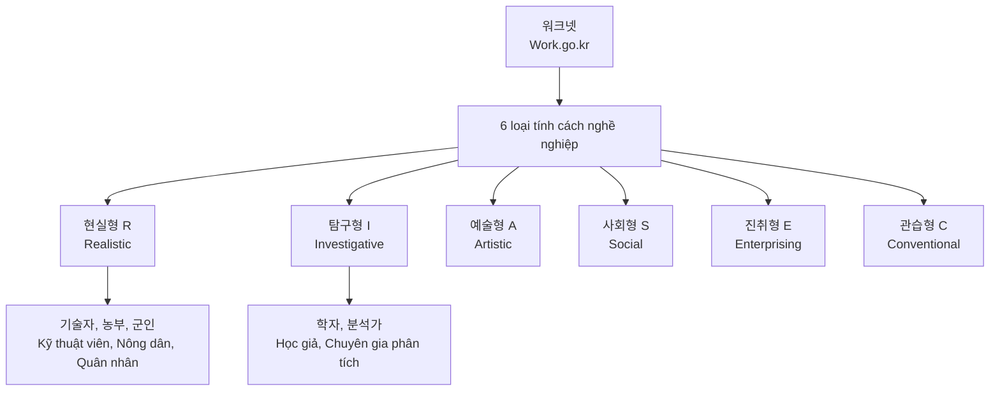

# BÀI 2: TÍNH CÁCH (성격)
*Chương trình Hội nhập Xã hội Hàn Quốc (KIIP) - Tiếng Hàn và Văn hóa Hàn Quốc Trung cấp 1*

---

## 🎯 MỤC TIÊU HỌC TẬP

Sau khi hoàn thành bài học này, học viên sẽ có thể:
- Mô tả tính cách bản thân và người khác
- Sử dụng ngữ pháp **-어지다** để diễn tả sự thay đổi
- Sử dụng ngữ pháp **-는 대신(에)** để biểu thị sự thay thế
- Viết đoạn văn giới thiệu tính cách
- Hiểu mối quan hệ giữa tính cách và nghề nghiệp

---

## 📚 TỪ VỰNG CHÍNH (어휘)

### Bảng từ vựng về tính cách

| Tiếng Hàn | Nghĩa tiếng Việt | Từ trái nghĩa |
|-----------|------------------|---------------|
| 외향적이다 | hướng ngoại | 내성적이다 (hướng nội) |
| 적극적이다 | tích cực | 소극적이다 (tiêu cực) |
| 꼼꼼하다 | tỉ mỉ, cẩn thận | 덜렁거리다 (hấp tấp) |
| 다정하다 | ân cần, tử tế | 무뚝뚝하다 (khô khan) |
| 느긋하다 | chậm rãi, thong thả | 급하다 (vội vàng) |
| 활발하다 | năng động, sôi nổi | |
| 개방적이다 | cởi mở | 보수적이다 (bảo thủ) |
| 신중하다 | thận trọng | |
| 예민하다 | nhạy cảm | |
| 자상하다 | chu đáo | |
| 책임감이 강하다 | có tinh thần trách nhiệm | |
| 호기심이 많다 | tò mò | |

### Từ vựng bổ sung

| Tiếng Hàn | Nghĩa tiếng Việt |
|-----------|------------------|
| 동아리 | câu lạc bộ |
| 봉사 | tình nguyện |
| 습관 | thói quen |
| 장기자랑 | biểu diễn tài năng |
| 동호회 | hội đồng hương |
| 설레다 | hồi hộp, xúc động |
| 다투다 | cãi nhau |

---

## 📖 NGỮ PHÁP (문법)

### 1. **-어지다**: Diễn tả sự thay đổi trạng thái

#### Cách chia động từ:
- **-아지다**: khi âm tiết cuối có nguyên âm ㅏ, ㅗ
  - 비싸다 → 비싸지다 (trở nên đắt)
- **-어지다**: khi âm tiết cuối có nguyên âm khác
  - 길다 → 길어지다 (trở nên dài)
- **-해지다**: động từ kết thúc bằng 하다
  - 익숙하다 → 익숙해지다 (trở nên quen thuộc)

#### Các ví dụ thực tế:

| Trường hợp | Ví dụ |
|------------|-------|
| **Tính cách thay đổi** | 태권도를 배운 후부터 많이 **활발해졌어요**. *Sau khi học taekwondo thì trở nên năng động hơn nhiều.* |
| **Cuộc sống thay đổi** | 한국에 와서 많이 **급해졌어요**. *Đến Hàn Quốc rồi trở nên vội vàng hơn nhiều.* |
| **Kỹ năng cải thiện** | 요즘은 많이 **꼼꼼해졌네요**. *Dạo này anh/chị cẩn thận hơn nhiều rồi nhỉ.* |

### 2. **-는 대신(에)**: Diễn tả sự thay thế, đền bù

#### Cách chia:
- **-는 대신에**: với động từ
  - 먹다 → 먹는 대신에
  - 일하다 → 일하는 대신에
- **-은 대신에**: với tính từ có phụ âm cuối
  - 많다 → 많은 대신에
  - 작다 → 작은 대신에  
- **-ㄴ 대신에**: với tính từ có nguyên âm cuối
  - 싸다 → 싼 대신에
  - 바쁘다 → 바쁜 대신에

#### Ví dụ ứng dụng:

| Tình huống | Câu ví dụ |
|------------|-----------|
| **Công việc** | 일이 힘든 **대신에** 월급이 많아요. *Công việc vất vả nhưng bù lại lương cao.* |
| **Gia đình** | 부모님을 자주 찾아뵙지 못하는 **대신에** 전화를 자주 드려요. *Không thể thường xuyên về thăm bố mẹ nhưng bù lại thường xuyên gọi điện.* |
| **Sức khỏe** | 엘리베이터를 타는 **대신에** 계단을 자주 이용해요. *Thay vì đi thang máy thì tôi thường xuyên đi cầu thang.* |

---

## 🗣️ LUYỆN TẬP HỘI THOẠI (말하기)

### Tình huống 1: Tư vấn về tính cách của con em

**🎧 Audio: Conversation_2-1.mp3**

**대화 예시:**

**후엔**: 고천씨, 무슨 일이 있어요? 얼굴이 안 좋아 보여요.
*Chú Gao Chen, có chuyện gì vậy? Trông mặt chú không được tốt.*

**고천**: 우리 아이 성격 때문에 고민이에요.
*Tôi đang lo lắng về tính cách của con tôi.*

**후엔**: 성민이 성격요?
*Tính cách của Sung Min ạ?*

**고천**: 네, 애가 저를 닮아 성격이 많이 내성적이거든요. 한국에 온 지 두 달이 넘었는데 학교 친구들과 아직 못 어울리는 것 같아요.
*Vâng, con bé giống tôi, tính cách khá hướng nội. Đến Hàn Quốc đã hơn hai tháng rồi mà có vẻ vẫn chưa hòa nhập được với bạn bè ở trường.*

**후엔**: 그래요? 걱정되시겠어요. 그럼 아이한테 동아리나 봉사 활동을 시키면 어떨까요? 우리 아이는 봉사 활동을 한 후부터 성격이 외향적이고 밝아진 것 같아요.
*Vậy ạ? Chú lo lắng lắm nhỉ. Vậy cho con tham gia câu lạc bộ hoặc hoạt động tình nguyện thì sao? Con tôi từ khi tham gia hoạt động tình nguyện thì tính cách trở nên hướng ngoại và vui vẻ hơn.*

**고천**: 그렇군요. 이따 집에 가서 우리 아이하고 얘기해 볼게요. 고마워요.
*Thế ạ. Tối về nhà tôi sẽ nói chuyện với con. Cảm ơn chị.*

### Bài tập thực hành hội thoại

**연습 1**: Hãy thay thế các tình huống sau theo mẫu trên:

1. **Vấn đề**: Tính cách vội vàng → **Giải pháp**: Lập kế hoạch
2. **Vấn đề**: Tính cách tiêu cực → **Giải pháp**: Tham gia thể thao
3. **Vấn đề**: Tính cách khô khan → **Giải pháp**: Học giao tiếp

---

## 👂 LUYỆN NGHE (듣기)

**🎧 Audio: Listening_2-1.mp3**

### Bài nghe 1: 애나 씨와 제이슨 씨의 대화

**듣기 전 활동**: 두 사람의 모습을 보고 어떤 성격인지 추측하고 이야기해 보세요.

**듣기 후 질문**:
1. 애나 씨의 성격은 어떻습니까?
2. 제이슨 씨는 성격이 왜, 어떻게 달라졌습니까?
3. 들은 내용과 같으면 ○, 다르면 ✗ 하세요:
   - 제이슨 씨는 행사에 참여할 것이다. (    )
   - 애나 씨는 제이슨 씨의 성격을 부러워한다. (    )
   - 제이슨 씨는 한국에 와서 성격이 달라졌다. (    )

### Luyện phát âm

**🎧 Audio: Pronunciation_2-1.mp3**

**Quy tắc phát âm**: [ㄱ, ㄷ, ㅂ, ㅈ] + [ㅋ, ㅌ, ㅍ, ㅊ]

1. 결혼 전에는 무뚝뚝했어요.
2. 저는 성격이 급해서 실수를 많이 해요.
3. 고향에 있을 때는 성격이 급했어요. 그러나 요즘은 느긋해졌어요.

---

## 📝 LUYỆN ĐỌC (읽기)

### Bài đọc 1: Tính cách và nghề nghiệp

**Hoạt động 1**: Nối nghề nghiệp với tính cách phù hợp

**Ngân hàng từ vựng**:
- 개방적이다 (cởi mở) ↔ 보수적이다 (bảo thủ)
- 신중하다 (thận trọng)
- 예민하다 (nhạy cảm)
- 유머 감각이 많다 (có khiếu hài hước)
- 자상하다 (chu đáo)
- 정이 많다 (tình cảm)
- 책임감이 강하다 (có tinh thần trách nhiệm cao)
- 호기심이 많다 (tò mò)
- 활발하다 (năng động)
- 꼼꼼하다 (tỉ mỉ)

### Bài đọc 2: Tư vấn tính cách

**Q1**: *Câu hỏi từ happy님*

저는 화장품 판매원입니다. 저는 한 달 전에 입사한 신입 사원입니다. 제 성격 때문에 고민이 있습니다. 저는 친한 사람들과 대화할 때는 말도 잘 하고 다정한 편인데 업무로 만나는 사람들하고는 이야기를 나누는 것이 힘듭니다. 제 일이 화장품을 판매하는 것이라서 손님들과 적극적이고 활발하게 대화해야 하는데 그게 잘 안 됩니다. 저 어떻게 해야 할까요?

*Tôi là nhân viên bán mỹ phẩm. Tôi là nhân viên mới vào làm một tháng trước. Tôi đang lo lắng về tính cách của mình. Khi nói chuyện với những người thân thì tôi nói chuyện tốt và khá ân cần, nhưng với những người gặp trong công việc thì việc trò chuyện rất khó khăn. Công việc của tôi là bán mỹ phẩm nên phải nói chuyện tích cực và năng động với khách hàng nhưng tôi không làm được điều đó. Tôi phải làm thế nào?*

**Hoạt động**: Hãy viết lời khuyên cho happy님.

### Bài đọc 3: Câu chuyện gia đình của Lachman

**🎧 Audio: Reading_2-3.mp3**

*[Văn bản dài về chuyến về quê của Lachman và cách gia đình hòa giải sau cuộc cãi vã của bố mẹ]*

**읽기 후 질문**:
1. 라흐만 씨가 고향 집에 갔을 때 가족에게 무슨 일이 있었습니까?
2. 아버지의 직업은 무엇입니까? 또 성격은 어떻습니까?
3. 윗글의 내용과 같으면 ○, 다르면 ✗ 하세요:
   - 라흐만 씨 가족은 보통 조용한 편이다. (    )
   - 라흐만 씨 아버지와 동생은 어머니 선물을 샀다. (    )
   - 라흐만 씨는 밖에 나가는 대신에 저녁 식사를 준비했다. (    )
   - 라흐만 씨는 부모님 결혼기념일에 같이 저녁 식사를 했다. (    )

---

## ✍️ LUYỆN VIẾT (쓰기)

### Hoạt động 1: Lập bảng tính cách cá nhân

| Khía cạnh | Nội dung |
|-----------|----------|
| **성격** (Tính cách) | |
| **장점** (Ưu điểm) | |
| **단점** (Nhược điểm) | |
| **구체적인 상황·예시** (Tình huống cụ thể·Ví dụ) | |

### Hoạt động 2: Viết đoạn văn giới thiệu tính cách

**Cấu trúc đề xuất**:
1. **Mở đầu**: Giới thiệu chung về tính cách của bản thân
2. **Thân bài**: 
   - Miêu tả ưu điểm kèm ví dụ cụ thể
   - Thừa nhận nhược điểm và cách khắc phục
3. **Kết luận**: Tóm tắt và hướng phát triển

**유용한 표현**:
- 저는 성격이... *Tôi có tính cách...*
- ...한 편이에요. *có khuynh hướng...*
- 장점은...입니다. *Ưu điểm là...*
- 단점은...지만 *Nhược điểm là... nhưng*
- ...하려고 노력하고 있어요. *đang cố gắng...*

---

## 🏛️ VĂN HÓA VÀ THÔNG TIN (문화와 정보)

### Tính cách và nghề nghiệp trong xã hội Hàn Quốc

**Giới thiệu về hệ thống phân loại tính cách nghề nghiệp Hàn Quốc**:

Hiểu rõ tính cách của bản thân sẽ giúp ích rất nhiều khi lựa chọn nghề nghiệp. Trang web WorkNet (www.work.go.kr) cung cấp nhiều bài test tính cách để tìm ra nghề nghiệp phù hợp với bản thân.

#### 6 loại tính cách nghề nghiệp:

| Loại | Đặc điểm | Nghề nghiệp phù hợp |
|------|----------|---------------------|
| **현실형 (R)** | Thích sự rõ ràng, có trật tự. Thực tế, thận trọng, thật thà nhưng có phần cứng đầu | Kỹ thuật viên, nông dân, quân nhân, cảnh sát, vận động viên |
| **탐구형 (I)** | Thích quan sát và hoạt동 trí tuệ. Có tính phân tích, độc lập nhưng hướng nội | Học giả, chuyên gia phân tích |
| **예술형 (A)** | Sáng tạo, có khiếu nghệ thuật | Nghệ sĩ, nhà thiết kế |
| **사회형 (S)** | Thích giúp đỡ người khác | Giáo viên, nhân viên xã hội |
| **진취형 (E)** | Năng động, thích lãnh đạo | Doanh nhân, quản lý |
| **관습형 (C)** | Thích làm việc có tổ chức, theo quy tắc | Nhân viên văn phòng, kế toán |

---

## 🎯 Bài tập trắc nghiệm tương tác

<MultiChoiceQuiz
  title="Bài tập về Tính cách - Bài 2"
  questions={[
    {
      id: 1,
      question: "'요즘은 많이 꼼꼼해졌네요.' 여기서 '-어지다'의 의미는?",
      options: [
        "Hành động đang tiếp tục",
        "Sự thay đổi trạng thái",
        "Nguyên nhân kết quả",
        "Điều kiện giả định"
      ],
      correctAnswer: 1,
      explanation: "'-어지다' được sử dụng để diễn tả sự thay đổi trạng thái từ không cẩn thận đến cẩn thận hơn."
    },
    {
      id: 2,
      question: "'일이 힘든 대신에 월급이 많아요.' 구조 '-는 대신에'는 무슨 뜻입니까?",
      options: [
        "Thời gian tiếp theo",
        "Nguyên nhân",
        "Sự thay thế, đền bù",
        "Mục đích"
      ],
      correctAnswer: 2,
      explanation: "'-는 대신에' biểu thị sự thay thế hoặc đền bù: công việc vất vả nhưng bù lại lương cao."
    },
    {
      id: 3,
      question: "'외향적이다'의 반대말은 무엇입니까?",
      options: [
        "적극적이다",
        "내성적이다",
        "소극적이다",
        "활발하다"
      ],
      correctAnswer: 1,
      explanation: "'외향적이다' (hướng ngoại) có từ trái nghĩa là '내성적이다' (hướng nội)."
    },
    {
      id: 4,
      question: "'봉사 활동을 한 후부터 성격이 외향적이고 밝아진 것 같아요.' 이 문장의 의미는?",
      options: [
        "Tính cách không thay đổi",
        "Tính cách xấu đi",
        "Tính cách tốt lên sau hoạt động tình nguyện",
        "Không thích hoạt động tình nguyện"
      ],
      correctAnswer: 2,
      explanation: "Sau khi tham gia hoạt động tình nguyện, tính cách trở nên hướng ngoại và vui vẻ hơn (tích cực)."
    },
    {
      id: 5,
      question: "'꼼꼼하다'의 의미는?",
      options: [
        "Vội vàng, hấp tấp",
        "Tỉ mỉ, cẩn thận",
        "Lười biếng",
        "Khô khan"
      ],
      correctAnswer: 1,
      explanation: "'꼼꼼하다' có nghĩa là tỉ mỉ, cẩn thận, từ trái nghĩa với '덜렁거리다' (hấp tấp)."
    },
    {
      id: 6,
      question: "'엘리베이터를 타는 대신에 계단을 자주 이용해요.' 이 문장에서 화자는 무엇을 합니까?",
      options: [
        "Chỉ đi thang máy",
        "Chỉ đi cầu thang",
        "Thay vì đi thang máy thì đi cầu thang",
        "Vừa đi thang máy vừa đi cầu thang"
      ],
      correctAnswer: 2,
      explanation: "Người nói thay thế việc đi thang máy bằng việc đi cầu thang (sự thay thế)."
    },
    {
      id: 7,
      question: "'동아리'의 뜻은 무엇입니까?",
      options: [
        "Lớp học",
        "Câu lạc bộ",
        "Công ty",
        "Gia đình"
      ],
      correctAnswer: 1,
      explanation: "'동아리' có nghĩa là câu lạc bộ - nơi tập hợp những người có cùng sở thích, mục đích."
    },
    {
      id: 8,
      question: "한국의 직업 성격 유형 중 '현실형 (R)'의 특징은?",
      options: [
        "Sáng tạo, nghệ thuật",
        "Thích sự rõ ràng, thực tế",
        "Thích nghiên cứu",
        "Thích giúp đỡ người khác"
      ],
      correctAnswer: 1,
      explanation: "'현실형 (R)' là loại tính cách thích sự rõ ràng, có trật tự, thực tế và thận trọng."
    },
    {
      id: 9,
      question: "'다정하다'의 반대말은?",
      options: [
        "무뚝뚝하다",
        "느긋하다",
        "적극적이다",
        "꼼꼼하다"
      ],
      correctAnswer: 0,
      explanation: "'다정하다' (ân cần, tử tế) có từ trái nghĩa là '무뚝뚝하다' (khô khan, lạnh lùng)."
    },
    {
      id: 10,
      question: "'예민하다'의 의미는?",
      options: [
        "Thận trọng",
        "Nhạy cảm",
        "Năng động",
        "Tò mò"
      ],
      correctAnswer: 1,
      explanation: "'예민하다' có nghĩa là nhạy cảm, dễ bị tác động bởi những thay đổi nhỏ."
    },
    {
      id: 11,
      question: "'부모님을 자주 찾아뵙지 못하는 대신에 전화를 자주 드려요.' 이 행동의 목적은?",
      options: [
        "Tránh gặp bố mẹ",
        "Tiết kiệm thời gian",
        "Bù đắp việc không thể thường xuyên về thăm",
        "Lười biếng"
      ],
      correctAnswer: 2,
      explanation: "Việc gọi điện thường xuyên là để bù đắp cho việc không thể thường xuyên về thăm bố mẹ."
    },
    {
      id: 12,
      question: "'활발하다'와 의미가 가장 가까운 단어는?",
      options: [
        "조용하다",
        "느긋하다",
        "적극적이다",
        "신중하다"
      ],
      correctAnswer: 2,
      explanation: "'활발하다' (năng động, sôi nổi) có nghĩa gần với '적극적이다' (tích cực)."
    }
  ]}
/>

---

## 📋 TỔNG KẾT BÀI HỌC

### Điểm ngữ pháp chính
1. **-어지다**: Diễn tả sự thay đổi trạng thái
2. **-는 대신(에)**: Biểu thị sự thay thế, đền bù

### Từ vựng cốt lõi
- Tính cách: 외향적/내성적, 적극적/소극적, 꼼꼼하다/덜렁거리다
- Hoạt động: 동아리, 봉사, 장기자랑

### Kỹ năng giao tiếp
- Mô tả tính cách bản thân và người khác
- Tư vấn về vấn đề tính cách
- Viết đoạn văn giới thiệu tính cách

---

## 📚 TÀI LIỆU THAM KHẢO

- **File âm thanh**: 
  - 🎧 Conversation_2-1.mp3 (Hội thoại chính)
  - 🎧 Listening_2-1.mp3 (Bài nghe)
  - 🎧 Pronunciation_2-1.mp3 (Luyện phát âm)
  - 🎧 Reading_2-3.mp3 (Bài đọc 3)

- **Website tham khảo**: 
  - WorkNet: www.work.go.kr (Test tính cách nghề nghiệp)

---

*© Chương trình Hội nhập Xã hội Hàn Quốc (KIIP) - Tái biên soạn cho học viên Việt Nam*