# Bài 3: Dịch vụ phúc lợi địa phương
## 지역 복지 서비스

### 📋 Mục tiêu bài học

```mermaid
graph TD
    A[Bài 3: Dịch vụ phúc lợi địa phương] --> B[Từ vựng: Dịch vụ phúc lợi]
    A --> C[Ngữ pháp 1: -는지 알다/모르다]
    A --> D[Ngữ pháp 2: -다가]
    A --> E[Hoạt động: Giới thiệu cách sử dụng cơ sở phúc lợi]
    A --> F[Văn hóa: Trung tâm đa văn hóa]
```

---

## 📚 I. TỪ VỰNG (어휘)

### 1. Các dịch vụ hỗ trợ cuộc sống tại Hàn Quốc

| Từ vựng tiếng Hàn | Nghĩa tiếng Việt | Ví dụ |
|---|---|---|
| 상담을 받다 | Nhận tư vấn | 취업 상담을 받다 (nhận tư vấn việc làm) |
| 통번역 서비스를 받다 | Nhận dịch vụ phiên dịch | 병원에서 통번역 서비스를 받다 |
| 구직/창업상담을 받다 | Nhận tư vấn tìm việc/khởi nghiệp | 외국인 지원 센터에서 창업상담을 받다 |
| 아이를 맡기다 | Gửi con | 어린이집에 아이를 맡기다 |
| 장난감을 대여하다 | Thuê đồ chơi | 육아 종합지원센터에서 장난감을 대여하다 |
| 육아 정보를 얻다 | Nhận thông tin nuôi dạy con | 보건소에서 육아 정보를 얻다 |
| 노인을 돌보다 | Chăm sóc người già | 요양원에서 노인을 돌보다 |
| 한국문화를 배우다 | Học văn hóa Hàn Quốc | 문화센터에서 한국문화를 배우다 |
| 건강 검진을 받다 | Khám sức khỏe | 보건소에서 건강 검진을 받다 |
| 예방 접종을 받다 | Tiêm phòng | 아이가 예방 접종을 받다 |

### 2. Các từ vựng chuyên ngành

```mermaid
graph LR
    A[Dịch vụ phúc lợi] --> B[Tư vấn 상담]
    A --> C[Chăm sóc trẻ em 아이]
    A --> D[Chăm sóc người già 노인]
    A --> E[Giáo dục 교육]
    A --> F[Y tế 건강]
    
    B --> B1[임금 체불 - Nợ lương]
    B --> B2[생활 상담 - Tư vấn cuộc sống]
    B --> B3[가족 상담 - Tư vấn gia đình]
    
    E --> E1[태권도 - Taekwondo]
    E --> E2[요리 - Nấu ăn]
    E --> E3[외국어 - Ngoại ngữ]
    E --> E4[컴퓨터 - Máy tính]
```

---

## 📖 II. NGỮ PHÁP (문법)

### 1. Ngữ pháp 1: -는지 알다/모르다

**Ý nghĩa**: Dùng để diễn tả việc biết hay không biết về một thông tin nào đó.

**Cách sử dụng**:

| Dạng động từ | Cách chia | Ví dụ |
|---|---|---|
| Động từ có 받침 | V + 는지 알다/모르다 | 읽다 → 읽는지 알다 |
| Động từ không có 받침 | V + 는지 알다/모르다 | 가다 → 가는지 알다 |
| Tính từ có 받침 | V + 은지 알다/모르다 | 좋다 → 좋은지 알다 |
| Tính từ không có 받침 | V + ㄴ지 알다/모르다 | 싸다 → 싼지 알다 |

```mermaid
graph TD
    A[Ngữ pháp -는지 알다/모르다] --> B[Biết thông tin gì đó]
    A --> C[Không biết thông tin gì đó]
    B --> D[가: 문화 체육 센터에서 무엇을 배우는지 알아요?]
    B --> E[나: 네, 제과 제빵하고 한식 조리를 배울 수 있어요.]
    C --> F[상담 센터가 몇 시에 문을 여는지 몰라서 홈페이지를 찾아보았다.]
```

**Ví dụ thực tế**:
- 어디에서 예방 접종을 하는지 알아요? (Bạn có biết ở đâu tiêm phòng không?)
- 외국인도 복지 서비스를 이용할 수 있는지 아는 사람이 많지 않다. (Không nhiều người biết người nước ngoài cũng có thể sử dụng dịch vụ phúc lợi.)

### 2. Ngữ pháp 2: -다가

**Ý nghĩa**: Diễn tả việc một hành động hay trạng thái bị ngắt quãng và chuyển sang việc khác.

**Cách sử dụng**:
- Động từ + 다가

```mermaid
graph LR
    A[Hành động 1] --> B[-다가] --> C[Hành động 2]
    A1[영화를 보다] --> B1[다가] --> C1[재미없어서 나왔어요]
    A2[책을 읽다] --> B2[다가] --> C2[친구가 와서 밖에 나갔어요]
```

**Ví dụ thực tế**:
- 지난달까지 구직 상담을 받다가 얼마 전에 취직해서 지금은 받지 않아요. (Đến tháng trước tôi còn nhận tư vấn tìm việc, nhưng vừa rồi tôi đã xin được việc nên bây giờ không nhận nữa.)
- 컴퓨터 학원에 다니다가 어려워서 요리 수업으로 바꿨어요. (Tôi học máy tính ở học viện nhưng vì khó quá nên đã chuyển sang học nấu ăn.)

---

## 🗣️ III. HOẠT ĐỘNG THỰC HÀNH

### 1. Luyện tập ngữ pháp -는지 알다/모르다

**Bài tập 1**: Hoàn thành câu hỏi và trả lời theo mẫu

| Câu hỏi | Trả lời |
|---|---|
| 어디에서 상담을 받을 수 있는지 아세요? | 네, 알아요. 4층 상담 센터예요. |
| 아이의 예방 접종 비용이 얼마____ 아세요? | 무료예요. |
| 문화 체육 센터에 무슨 수업이 있는지 ____? | 태권도, 요리 수업이 있어요. |
| 어디에서 장난감을 빌릴 수 있는지 ____? | 육아 종합지원센터에서 빌릴 수 있어요. |

### 2. Luyện tập ngữ pháp -다가

**Bài tập 2**: Kết hợp các tình huống theo mẫu

```mermaid
graph TD
    A[공부하다가] --> B[모르는 단어가 있어서] --> C[사전을 찾았어요]
    D[텔레비전을 보다가] --> E[재미가 없어서] --> F[잠이 들었어요]
    G[휴대폰으로 통화하다가] --> H[엘리베이터를 타서] --> I[전화가 끊어졌어요]
```

---

## 👥 IV. HOẠT ĐỘNG GIAO TIẾP

### 1. Hội thoại mẫu: Hỏi về dịch vụ phúc lợi

**🎧 [Audio 3-1]** *(Đường dẫn file nghe sẽ được cập nhật)*

**후엔**: 어머, 미호 씨. 컴퓨터를 배우세요?

**미호**: 네, 혼자 책 보고 공부하다가 요즘은 동네에 있는 문화 체육 센터에서 배우고 있어요.

**후엔**: 와, 저는 우리 동네에 그런 시설이 있는지 몰랐어요. 수업은 언제 해요?

**미호**: 매주 화요일과 목요일 오후 7시부터 8시까지 해요. 요리, 수영, 컴퓨터 등 다양한 프로그램이 있으니까 한번 알아보세요.

### 2. Bảng thông tin chương trình

| 요일 | 시간 | 내용 | 금액 |
|---|---|---|---|
| 수영 | 월~금 오전 6~7시 | 초급 | 5만 원 |
| 컴퓨터 1 | 화, 목 오후 7~8시 | 초급 | 3만 원 |
| 컴퓨터 2 | 화, 목 오후 8~9시 | 중급 | 3만 원 |
| 한국요리 | 수 오전 10~11시 | 일반 가정식 | 재료비 |
| 태권도 | 월~금 오전 8~9시 | 초급 | 5만 원 |
| K-POP 댄스 | 월, 수, 금 오후 5~6시 | 취미반 | 3만 원 |

*※ 1회 무료 체험 가능. 65세 이상은 50% 할인*

---

## 👂 V. LUYỆN NGHE (듣기)

### Bài nghe 1: Đăng ký khóa học

**🎧 [Audio 3-P.mp3]** *(Đường dẫn file nghe sẽ được cập nhật)*

**Câu hỏi**:
1. 후엔 씨는 어느 프로그램에 등록하고 싶었습니까?
2. 등록비는 얼마입니까?
3. 들은 내용과 같으면 ○, 다르면 × 하세요:
   - 초급 컴퓨터 프로그램은 지금 자리가 있다. ( )
   - 중급 컴퓨터 프로그램은 신청할 수 있다. ( )
   - 수업은 화요일과 목요일에 한다. ( )

### Phát âm: 문의 [무늬, 무니]

**🎧 [Audio 3-L.mp3]** *(Đường dẫn file nghe sẽ được cập nhật)*

| Từ gốc | Cách phát âm |
|---|---|
| 문의 | [무늬, 무니] |
| 편의 | [펴늬, 펴니] |
| 논의 | [노늬, 노니] |

---

## 📖 VI. LUYỆN ĐỌC (읽기)

### 1. Đọc poster thông tin

#### Poster 1: Tiêm phòng cúm mùa đông
> **겨울철 독감 예방 접종**
> 
> 어린이, 임산부, 어르신
> **무료로 받으세요!**

#### Poster 2: Chương trình đào tạo việc làm cho người nước ngoài
> **외국인 취업 교육 프로그램**
> 
> - **기간**: 7월 2일~7월 19일
> - **참가 자격**: ○○시 거주 외국인 30명, TOPIK 3급 또는 KIIP 3단계 이상
> - **프로그램 내용**: 비즈니스 한국어, 취업교육(이력서 작성법, 면접), 선배와의 대화
> - **신청 방법**: 이메일 접수

### 2. Đọc hiểu bài báo

**Tiêu đề**: 이민자와 다문화 가족을 위한 복지 센터 문 열어

○○시 외국인 복지 센터가 오는 9일 문을 연다. 이민자와 다문화 가족을 위한 복지 센터는 국제 문화 교류실, 공동체 모임방, 상담실, 교육실, 강당 등 다양한 시설을 갖추고 있다.

1층은 국가별 영화 상영과 전시 등을 통해 지역 주민들에게 세계 문화를 소개하고 서로의 문화를 이해하는 사회 통합의 장으로 활용된다.

**Câu hỏi**:
1. 무엇에 대한 기사입니까?
2. 종합 복지 센터에서 제공하는 서비스가 아닌 것을 고르세요.
   ① 가족상담 ② 통번역교육 ③ 한국어교육 ④ 방문 서비스

---

## ✍️ VII. LUYỆN VIẾT (쓰기)

### Viết giới thiệu dịch vụ phúc lợi

**Hướng dẫn**: Hãy viết một đoạn văn giới thiệu về dịch vụ phúc lợi mà bạn đã sử dụng hoặc muốn giới thiệu cho người khác.

**Gợi ý cấu trúc**:
1. 무슨 복지 서비스를 이용해 봤습니까?
2. 어떻게 그 서비스를 알았습니까?
3. 그 서비스는 무엇이 좋습니까?
4. 그 서비스를 이용하는 방법은 무엇입니까?

---

## 🌐 VIII. VĂN HÓA VÀ THÔNG TIN

### Trung tâm đa văn hóa (다문화이주민플러스센터)

```mermaid
graph TD
    A[다문화이주민플러스센터] --> B[법무부 서비스]
    A --> C[고용노동부 서비스]
    A --> D[여성가족부 서비스]
    A --> E[행정안전부 서비스]
    
    B --> B1[외국인 등록]
    B --> B2[체류 기간 연장]
    
    C --> C1[고용 허가]
    C --> C2[취업 상담]
    
    D --> D1[가족 상담]
    D --> D2[방문 교육]
    D --> D3[통역 서비스]
    
    E --> E1[행정 서비스]
```

**Tại đây bạn có thể nhận được**:
- Đăng ký người nước ngoài và gia hạn thời gian lưu trú
- Tư vấn việc làm và cấp phép lao động
- Tư vấn gia đình, giáo dục tại nhà, dịch vụ phiên dịch
- Các dịch vụ hành chính khác

**Địa điểm**: Hiện tại đang hoạt động tại 10 khu vực thí điểm như Yangju, Icheon, Paju, Ansan, Suwon, Namyangju, Siheung (Gyeonggi), Jung-gu (Incheon), Asan (Chungnam), Yangsan (Gyeongnam) và đang mở rộng dần.

---

## 🎯 Bài tập trắc nghiệm tương tác

<MultiChoiceQuiz
  title="Bài tập Dịch vụ phúc lợi địa phương - Bài 3"
  questions={[
    {
      id: 1,
      question: "'어디에서 예방 접종을 하는지 알아요?' 여기서 '-는지 알다'의 용법은?",
      options: [
        "Hỏi về nguyên nhân",
        "Hỏi về thông tin mà người khác có biết không",
        "Diễn tả ý kiến cá nhân",
        "Biểu thị thời gian"
      ],
      correctAnswer: 1,
      explanation: "'-는지 알다/모르다' được dùng để hỏi hoặc nói về việc biết hay không biết một thông tin nào đó."
    },
    {
      id: 2,
      question: "'컴퓨터 학원에 다니다가 어려워서 요리 수업으로 바꿨어요.' 구조 '-다가'는 무슨 뜻입니까?",
      options: [
        "Hành động song song",
        "Hành động bị ngắt quãng và chuyển sang việc khác", 
        "Hành động liên tục",
        "Hành động trong tương lai"
      ],
      correctAnswer: 1,
      explanation: "'-다가' diễn tả việc một hành động bị ngắt quãng và chuyển sang làm việc khác. Ở đây là học máy tính rồi chuyển sang học nấu ăn."
    },
    {
      id: 3,
      question: "'상담을 받다'의 의미는?",
      options: [
        "Cho lời khuyên",
        "Nhận tư vấn",
        "Hỏi thông tin",
        "Giải quyết vấn đề"
      ],
      correctAnswer: 1,
      explanation: "'상담을 받다' có nghĩa là nhận tư vấn từ chuyên gia hoặc người có kinh nghiệm về vấn đề nào đó."
    },
    {
      id: 4,
      question: "'아이를 맡기다'는 어디에서 할 수 있습니까?",
      options: [
        "보건소",
        "어린이집",
        "문화센터", 
        "상담센터"
      ],
      correctAnswer: 1,
      explanation: "'아이를 맡기다' (gửi con) thường được thực hiện tại '어린이집' (nhà trẻ)."
    },
    {
      id: 5,
      question: "'외국인도 복지 서비스를 이용할 수 있는지 아는 사람이 많지 않다.' 이 문장의 의미는?",
      options: [
        "Người nước ngoài không được sử dụng dịch vụ phúc lợi",
        "Tất cả mọi người đều biết quyền của người nước ngoài",
        "Không nhiều người biết người nước ngoài cũng có thể sử dụng dịch vụ phúc lợi",
        "Chỉ người Hàn mới được sử dụng dịch vụ"
      ],
      correctAnswer: 2,
      explanation: "Câu này cho biết không nhiều người biết rằng người nước ngoài cũng có quyền sử dụng các dịch vụ phúc lợi xã hội."
    },
    {
      id: 6,
      question: "'통번역 서비스'는 어디에서 유용합니까?",
      options: [
        "쇼핑할 때",
        "병원에서 진료 받을 때",
        "친구와 놀 때",
        "혼자 공부할 때"
      ],
      correctAnswer: 1,
      explanation: "통번역 서비스 (dịch vụ phiên dịch) rất hữu ích khi đi khám bệnh tại bệnh viện để giao tiếp với bác sĩ."
    },
    {
      id: 7,
      question: "'육아 종합지원센터'에서 할 수 있는 것은?",
      options: [
        "건강 검진을 받다",
        "장난감을 대여하다",
        "취업 상담을 받다",
        "한국어를 배우다"
      ],
      correctAnswer: 1,
      explanation: "육아 종합지원센터 (trung tâm hỗ trợ nuôi dạy con tổng hợp) có thể '장난감을 대여하다' (thuê đồ chơi)."
    },
    {
      id: 8,
      question: "'다문화이주민플러스센터'에서 받을 수 없는 서비스는?",
      options: [
        "외국인 등록",
        "취업 상담", 
        "가족 상담",
        "의료 진료"
      ],
      correctAnswer: 3,
      explanation: "다문화이주민플러스센터는 행정, 취업, 상담 서비스를 제공하지만 의료 진료는 병원에서 받아야 합니다."
    },
    {
      id: 9,
      question: "'지난달까지 구직 상담을 받다가 취직해서 지금은 받지 않아요.' 이 상황을 설명하면?",
      options: [
        "계속 구직 상담을 받고 있다",
        "구직 상담을 받다가 취업하여 중단했다",
        "처음부터 구직 상담을 받지 않았다",
        "앞으로 구직 상담을 받을 예정이다"
      ],
      correctAnswer: 1,
      explanation: "'-다가' 구조로 구직 상담을 받는 행동이 취업으로 인해 중단되었음을 나타냅니다."
    },
    {
      id: 10,
      question: "'문의 [무늬, 무니]'와 같은 발음 규칙이 적용되는 단어는?",
      options: [
        "논의",
        "회의",
        "정의",
        "모든 답이 맞다"
      ],
      correctAnswer: 3,
      explanation: "'ㅢ' 받침은 상황에 따라 [늬] 또는 [니]로 발음됩니다. 논의[노늬/노니], 회의[회늬/회니], 정의[정늬/정니] 모두 같은 규칙입니다."
    },
    {
      id: 11,
      question: "'65세 이상은 50% 할인'이라는 정보에서 70세 할아버지의 수영 수업료는?",
      options: [
        "5만 원",
        "3만 원",
        "2만 5천 원",
        "무료"
      ],
      correctAnswer: 2,
      explanation: "수영 수업료가 5만 원이고, 65세 이상 50% 할인이므로 70세 할아버지는 2만 5천 원을 내야 합니다."
    },
    {
      id: 12,
      question: "'TOPIK 3급 또는 KIIP 3단계 이상'은 무엇의 조건입니까?",
      options: [
        "예방 접종",
        "장난감 대여",
        "외국인 취업 교육 프로그램 참가",
        "건강 검진"
      ],
      correctAnswer: 2,
      explanation: "외국인 취업 교육 프로그램에 참가하려면 TOPIK 3급 또는 KIIP 3단계 이상의 한국어 실력이 필요합니다."
    }
  ]}
/>

---

## 📝 IX. TỰ KIỂM TRA

### Bảng từ vựng cần nhớ

| ✓ | Từ vựng | ✓ | Từ vựng |
|---|---|---|---|
| □ | 상담을 받다 | □ | 장 |
| □ | 통번역 서비스를 받다 | □ | 활용되다 |
| □ | 구직/창업상담을 받다 | □ | 고충 |
| □ | 아이를 맡기다 | □ | 임금체불 |
| □ | 장난감을 대여하다 | □ | 산업재해 |
| □ | 육아 정보를 얻다 | □ | 근무조건 |
| □ | 노인을 돌보다 | □ | 의료상담 |
| □ | 한국문화를 배우다 | □ | 참가자격 |
| □ | 건강검진을 받다 | □ | 정착 |
| □ | 예방접종을 받다 | □ | 교류실 |

### Điểm ngữ pháp chính

```mermaid
graph LR
    A[Bài 3 - Ngữ pháp] --> B[-는지 알다/모르다]
    A --> C[-다가]
    B --> D[Biết/không biết thông tin]
    C --> E[Chuyển đổi hành động]
```

**Ôn tập**:
- Sử dụng -는지 알다/모르다 để hỏi và trả lời về thông tin
- Sử dụng -다가 để diễn tả việc thay đổi hoặc ngừng hành động
- Từ vựng về các dịch vụ phúc lợi xã hội
- Cách hỏi thông tin và đăng ký dịch vụ

---

*Hết bài 3: Dịch vụ phúc lợi địa phương*