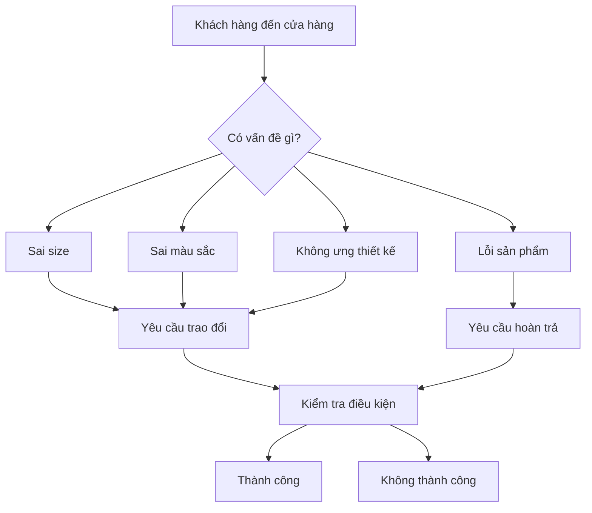
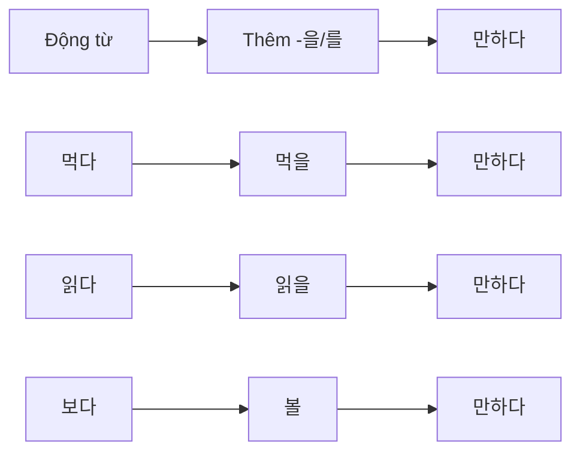
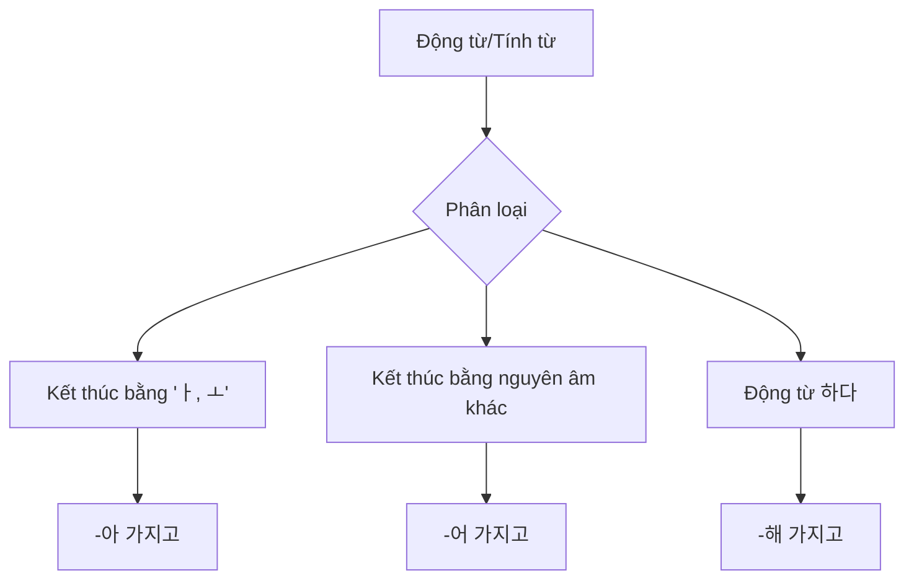
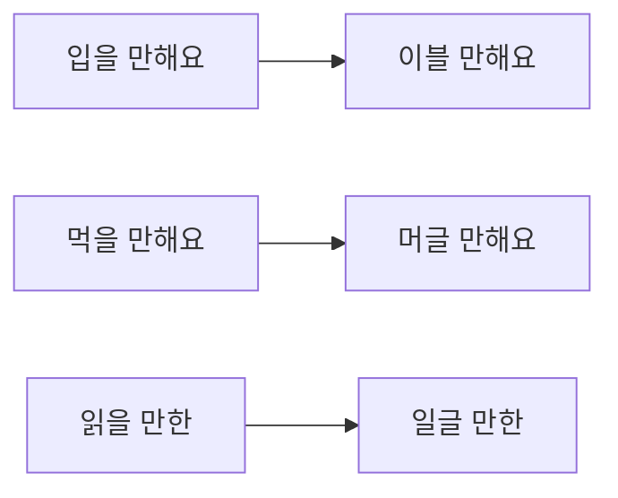
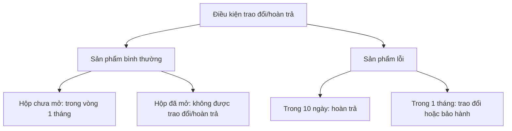
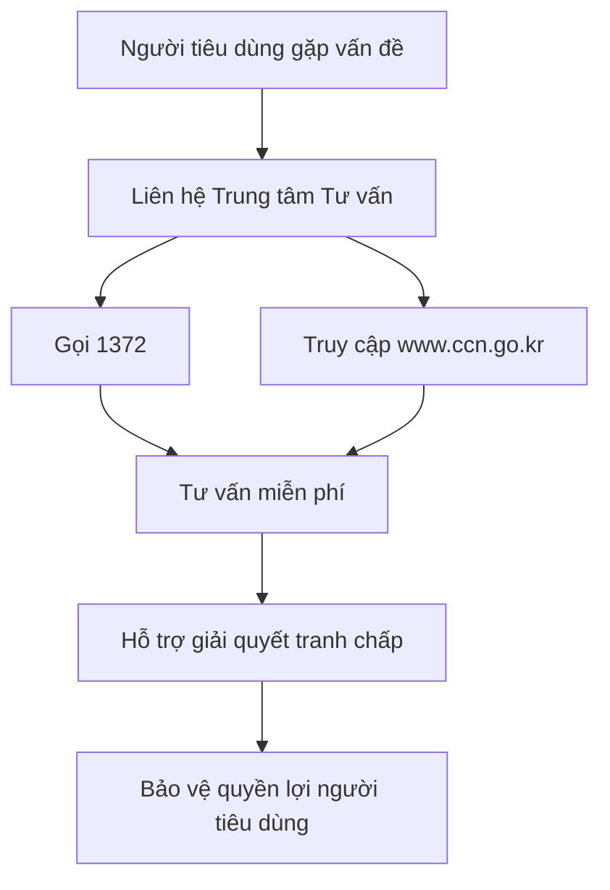

# BÀI 4: TRAO ĐỔI VÀ HOÀN TRẢ
## 교환과 환불

---

## MỤC TIÊU BÀI HỌC

Sau khi hoàn thành bài học này, học viên sẽ có khả năng:

1. **Từ vựng**: Sử dụng thành thạo các từ vựng liên quan đến trao đổi và hoàn trả hàng hóa
2. **Ngữ pháp**: 
   - Sử dụng cấu trúc "-을/를 만하다" để diễn tả khả năng hoặc giá trị
   - Sử dụng cấu trúc "동형-어 가지고" để diễn tả nguyên nhân, lý do
3. **Giao tiếp**: Thực hiện các tình huống trao đổi, hoàn trả hàng hóa trong cửa hàng
4. **Văn hóa**: Hiểu về hệ thống tư vấn tiêu dùng tại Hàn Quốc

---

## I. GIỚI THIỆU TÌNH HUỐNG



### Câu hỏi khởi động:
- 이 사람들은 지금 뭘 하려고 해요? (Những người này đang định làm gì?)
- 여러분도 이런 경험이 있어요? (Các bạn có kinh nghiệm như thế này không?)

### Quy định trao đổi/hoàn trả:

| **Điều kiện** | **Yêu cầu** |
|---------------|-------------|
| Thời gian | Trong vòng 7 ngày từ ngày mua (có hóa đơn) |
| Tình trạng sản phẩm | Chưa sử dụng, không hư hỏng |
| Nhãn mác | Không được tháo bỏ tag, nhãn |

**🔊 Audio 4-1** *(Tệp âm thanh minh họa tình huống)*

---

## II. TỪ VỰNG - 어휘

### 1. Các vấn đề thường gặp với sản phẩm

| **Từ vựng** | **Nghĩa tiếng Việt** | **Ví dụ** |
|-------------|---------------------|-----------|
| 사이즈가 작다 | Size nhỏ | 신발 사이즈가 작아요. |
| 색상이 다르다 | Màu sắc khác | 온라인에서 본 색상이 달라요. |
| 바지가 헐렁하다 | Quần rộng | 바지가 너무 헐렁해요. |
| 바지가 끼다 | Quần chật | 바지가 너무 껴요. |
| 얼룩이 있다 | Có vết bẩn | 셔츠에 얼룩이 있어요. |
| 단추가 떨어지다 | Cúc áo bị rơi | 새 옷인데 단추가 떨어졌어요. |
| 바느질이 잘못되다 | May sai | 바느질이 잘못되어 있어요. |
| 디자인이 마음에 안 들다 | Không thích thiết kế | 생각했던 것과 달라요. |

### 2. Các hành động xử lý

| **Từ vựng** | **Nghĩa tiếng Việt** | **Ví dụ** |
|-------------|---------------------|-----------|
| 교환하다 | Trao đổi | 다른 사이즈로 교환하고 싶어요. |
| 환불하다 | Hoàn trả | 마음에 안 들어서 환불하려고요. |
| 고객센터에 문의하다 | Hỏi tại trung tâm khách hàng | 고객센터에 문의해 보세요. |
| 소비자 상담센터에 상담하다 | Tư vấn tại trung tâm tư vấn người tiêu dùng | 1372로 전화해서 상담받으세요. |

---

## III. NGỮ PHÁP - 문법

### 1. Cấu trúc "-을/를 만하다"

#### Ý nghĩa:
- Diễn tả rằng một hành động nào đó có thể thực hiện được
- Diễn tả rằng một việc gì đó có giá trị, đáng làm

#### Cách sử dụng:



#### Bảng chia động từ:

| **Động từ gốc** | **Kết hợp** | **Ví dụ** |
|-----------------|-------------|-----------|
| 먹다 | 먹을 만하다 | 이 음식은 먹을 만해요. |
| 읽다 | 읽을 만하다 | 재미있는 책이니까 읽을 만해요. |
| 보다 | 볼 만하다 | 그 영화는 볼 만해요. |
| 입다 | 입을 만하다 | 바지가 짧지만 입을 만해요. |
| 가다 | 갈 만하다 | 거리가 멀지 않아서 걸어갈 만해요. |

#### Ví dụ hội thoại:
```
가: 사회통합프로그램 3단계 공부가 어때요?
나: 2단계보다 어렵지만 공부할 만해요.

가: 바지가 짧지요?
나: 바지가 짧지만 입을 만해요.
```

### 2. Cấu trúc "동형-어 가지고"

#### Ý nghĩa:
- Diễn tả nguyên nhân, lý do (chủ yếu dùng trong văn nói)
- Diễn tả phương pháp, cách thức

#### Cách sử dụng:



#### Bảng chia động từ/tính từ:

| **Loại** | **Ví dụ** | **Kết hợp** |
|----------|-----------|-------------|
| -아 가지고 | 사다 | 사 가지고 |
| | 많다 | 많아 가지고 |
| -어 가지고 | 먹다 | 먹어 가지고 |
| | 예쁘다 | 예뻐 가지고 |
| -해 가지고 | 환불하다 | 환불해 가지고 |
| | 친절하다 | 친절해 가지고 |

#### Ví dụ hội thoại:
```
직원: 무슨 일로 오셨어요?
이린: 사이즈가 좀 작아 가지고 큰 사이즈로 교환하려고요.

가: 왜 환불했어요?
나: 얼룩이 있어 가지고 환불했어요.
```

---

## IV. HỘI THOẠI MẪU - 말하기

### Tình huống 1: Trao đổi áo do lỗi cúc áo

```
직원: 어서 오세요. 무엇을 도와드릴까요?
라흐만: 어제 산 건데 단추가 떨어져 가지고 교환하고 싶은데요.
직원: 아, 그러세요? 잠시 제품 먼저 확인해 보겠습니다.
      (잠시 후) 이거 새 제품인데 색상이나 디자인이 맞는지 확인해 보시겠어요?
라흐만: 이거 좋습니다.
직원: 그럼 이걸로 교환해 드리겠습니다. 결제하신 카드하고 영수증은 가지고 오셨지요?
라흐만: 네, 여기요.
직원: 이 제품도 교환이나 환불 원하시면 일주일 이내에 가격표 제거하지 마시고 가져오세요.
```

**🔊 Audio 4-2** *(Tệp âm thanh hội thoại)*

### Các tình huống thực hành:

| **Sản phẩm** | **Lý do trao đổi** |
|--------------|-------------------|
| 티셔츠 (áo thun) | 디자인이 마음에 안 들다 (không thích thiết kế) |
| 바지 (quần) | 바지가 끼다 (quần chật) |
| 가방 (túi xách) | 사이즈가 작다 (size nhỏ) |

---

## V. LUYỆN NGHE - 듣기

### Bài 1: Mua sắm trực tuyến

**🔊 Audio 4-3** *(Cuộc hội thoại giữa Ramin và Irin về mua sắm trực tuyến)*

#### Câu hỏi:
1. 라민 씨는 어디에서 쇼핑을 자주 합니까?
2. 이린 씨는 무엇을 가장 걱정하고 있습니까?
3. 들은 내용과 같으면 ○, 다르면 × 하세요:
   - 라민 씨는 시간이 있을 때 백화점에 가서 쇼핑을 한다. ( )
   - 인터넷 쇼핑은 교환은 쉽지만 환불하기는 어렵다. ( )
   - 인터넷 쇼핑에서는 교환과 환불이 모두 공짜이다. ( )

### Từ vựng bổ sung:
- 실수: lỗi, nhầm lẫn
- 택배비: phí giao hàng
- 추천하다: giới thiệu, khuyên

---

## VI. LUYỆN PHÁT ÂM - 발음

### Quy tắc phát âm: [ㄹ] + [ㅁ]



**🔊 Audio 4-4** *(Luyện phát âm)*

#### Câu luyện tập:
1. 이 옷은 따뜻해서 환절기에 입을 만해요.
2. 가: 사람들에게 인기가 많은 식당인데 맛이 어때요?
   나: 많은 사람들이 줄을 서서 먹을 만해요.
3. 가: 한국 소설 중에서 읽을 만한 책 좀 소개해 주세요.
   나: 이 책을 읽어 보세요. 요즘 베스트셀러예요.

---

## VII. LUYỆN ĐỌC - 읽기

### Bài 1: Điều kiện trao đổi/hoàn trả

#### Quy định chung:



#### Thông tin chi tiết:

**정상제품 (Sản phẩm bình thường):**
- 박스 미개봉의 경우 1개월 이내 교환, 환불이 가능합니다.
- 박스 개봉 시 교환 환불 불가능

**불량제품 (Sản phẩm lỗi):**
- 10일 이내 매장을 방문할 경우 환불이 가능합니다.
- 1달 이내 매장을 방문할 경우 교환 또는 A/S가 가능합니다.
- 단, 영수증 지참

### Bài 2: Q&A về trao đổi/hoàn trả

#### Câu hỏi của khách hàng:
3일 전 백화점 세일 기간에 청바지를 구입했습니다. 매장에서 입었을 때는 괜찮았는데 집에 와서 다시 입어 보니 사이즈가 좀 작은 것 같습니다. 영수증에 세일 상품은 환불 불가, 교환은 3일 이내라는 안내가 있었습니다. 제가 교환 또는 환불을 받을 수 있는 방법이 있을까요?

#### Phản hồi:
물건을 사신 후 보통 영수증을 가지고 한 달 이내로 오시면 교환, 환불이 가능합니다. 하지만 매장에서 판매자로부터 교환 혹은 환불에 대해 특별한 내용을 안내받았다면 그 내용에 따라야 합니다.

---

## VIII. LUYỆN VIẾT - 쓰기

### Bài tập: Viết về kinh nghiệm trao đổi/hoàn trả

#### Template:

| **Mục** | **Nội dung** |
|---------|-------------|
| ① 구입 물품 | (Sản phẩm đã mua) |
| ② 구입 시기 | (Thời gian mua) |
| ③ 교환 또는 환불 이유 | (Lý do trao đổi/hoàn trả) |

#### Ví dụ mẫu:
```
작년에 온라인에서 운동화를 샀는데, 사이즈가 작아 가지고 
교환을 했습니다. 처음에는 사이즈를 잘못 주문한 줄 알았는데, 
매장에서 직접 신어보니 정말 작았습니다. 
다행히 영수증이 있어서 쉽게 교환할 수 있었습니다.
```

---

## IX. VĂN HÓA VÀ THÔNG TIN - 문화와 정보

### Trung tâm Tư vấn Người tiêu dùng - 소비자 상담센터



#### Chức năng chính:
- 접수 (Tiếp nhận): Tiếp nhận các khiếu nại từ người tiêu dùng
- 상담 (Tư vấn): Cung cấp tư vấn về quyền lợi người tiêu dùng
- 조정 (Hòa giải): Làm trung gian giải quyết tranh chấp
- 구제 (Cứu tế): Hỗ trợ bồi thường thiệt hại

#### Cách liên hệ:
- **Điện thoại**: 1372 (miễn phí)
- **Website**: www.ccn.go.kr
- **Thời gian**: 24/7

---

## X. BÀI TẬP TỔNG HỢP

### Bài 1: Nối các biểu hiện có liên quan

| **Ý nghĩa** | **Biểu hiện** |
|-------------|---------------|
| 물건을 사용하지 못하게 하다 | 가능하다 |
| 닫힌 것을 드디어 열다 | 개봉하다 |
| 할 수 있거나 될 수 있다 | 훼손하다 |

### Bài 2: Hoàn thành hội thoại

```
A: 왜 환불했어요?
B: 얼룩이 ______ 가지고 환불했어요.

A: 바지가 짧지요?
B: 바지가 짧지만 ______ 만해요.
```

### Bài 3: Tình huống thực tế

Bạn mua một chiếc áo trực tuyến nhưng khi nhận được thì màu sắc khác với hình ảnh. Hãy viết một đoạn hội thoại ngắn với nhân viên cửa hàng để yêu cầu trao đổi.

---

## XI. TỪ VỰNG TỔNG HỢP

### Bảng từ vựng theo chủ đề:

| **Chủ đề** | **Từ vựng** | **Nghĩa** |
|------------|-------------|-----------|
| **Vấn đề sản phẩm** | 사이즈가 작다 | Size nhỏ |
| | 색상이 다르다 | Màu sắc khác |
| | 훼손하다 | Hư hỏng |
| **Hành động** | 교환하다 | Trao đổi |
| | 환불하다 | Hoàn trả |
| | 구입하다 | Mua |
| **Điều kiện** | 영수증 | Hóa đơn |
| | 가격표 | Nhãn giá |
| | 포장 | Bao bì |
| **Cửa hàng** | 고객센터 | Trung tâm khách hàng |
| | 판매자 | Người bán |
| | 구매점 | Cửa hàng mua |

---

## 🎯 Bài tập trắc nghiệm tương tác

<MultiChoiceQuiz
  title="Bài tập Trao đổi và Hoàn trả - Bài 4"
  questions={[
    {
      id: 1,
      question: "'이 음식은 먹을 만해요.' 구조 '-을/를 만하다'의 의미는?",
      options: [
        "Hành động đã hoàn thành",
        "Có thể thực hiện được, có giá trị làm",
        "Hành động trong tương lai",
        "Hành động bắt buộc"
      ],
      correctAnswer: 1,
      explanation: "'-을/를 만하다' diễn tả rằng một hành động có thể thực hiện được hoặc có giá trị, đáng để làm."
    },
    {
      id: 2,
      question: "'사이즈가 좀 작아 가지고 큰 사이즈로 교환하려고요.' 구조 '-어 가지고'의 용법은?",
      options: [
        "Diễn tả thời gian",
        "Diễn tả nguyên nhân, lý do",
        "Diễn tả mục đích",
        "Diễn tả điều kiện"
      ],
      correctAnswer: 1,
      explanation: "'-어 가지고' được dùng để diễn tả nguyên nhân, lý do. Ở đây lý do trao đổi là vì size nhỏ."
    },
    {
      id: 3,
      question: "'단추가 떨어지다'의 의미는?",
      options: [
        "Cúc áo bị rơi",
        "Áo bị rách",
        "Màu áo phai",
        "Áo bị nhăn"
      ],
      correctAnswer: 0,
      explanation: "'단추가 떨어지다' có nghĩa là cúc áo bị rơi, bị tuột ra khỏi áo."
    },
    {
      id: 4,
      question: "교환이나 환불을 위한 조건이 아닌 것은?",
      options: [
        "영수증 지참",
        "7일 이내",
        "가격표 제거하지 않기",
        "친구와 함께 오기"
      ],
      correctAnswer: 3,
      explanation: "Trao đổi/hoàn trả cần có hóa đơn, trong vòng 7 ngày, không tháo nhãn giá. Không cần thiết phải đi cùng bạn."
    },
    {
      id: 5,
      question: "'바지가 헐렁하다'의 의미는?",
      options: [
        "Quần chật",
        "Quần rộng",
        "Quần ngắn",
        "Quần dài"
      ],
      correctAnswer: 1,
      explanation: "'헐렁하다' có nghĩa là rộng, lỏng lẻo. Trái nghĩa với '끼다' (chật)."
    },
    {
      id: 6,
      question: "'바지가 짧지만 입을 만해요.' 이 문장의 의미는?",
      options: [
        "Quần ngắn nên không thể mặc được",
        "Quần ngắn nhưng vẫn có thể mặc được",
        "Quần dài nên mặc tốt",
        "Quần vừa phải"
      ],
      correctAnswer: 1,
      explanation: "'입을 만하다' nghĩa là có thể mặc được. Mặc dù quần ngắn nhưng vẫn đủ để mặc."
    },
    {
      id: 7,
      question: "소비자 상담센터의 전화번호는?",
      options: [
        "1372",
        "1588",
        "119",
        "112"
      ],
      correctAnswer: 0,
      explanation: "소비자 상담센터 (Trung tâm Tư vấn Người tiêu dùng) có số điện thoại 1372, miễn phí 24/7."
    },
    {
      id: 8,
      question: "'얼룩이 있어 가지고 환불했어요.' 여기서 환불 이유는?",
      options: [
        "Size không vừa",
        "Màu sắc không đúng",
        "Có vết bẩn",
        "Thiết kế không ưng"
      ],
      correctAnswer: 2,
      explanation: "'얼룩이 있다' có nghĩa là có vết bẩn, đây là lý do hoàn trả sản phẩm."
    },
    {
      id: 9,
      question: "'바느질이 잘못되다'는 어떤 문제입니까?",
      options: [
        "Vấn đề về màu sắc",
        "Vấn đề về may vá",
        "Vấn đề về size",
        "Vấn đề về chất liệu"
      ],
      correctAnswer: 1,
      explanation: "'바느질이 잘못되다' có nghĩa là may sai, có lỗi trong quá trình may."
    },
    {
      id: 10,
      question: "불량제품의 경우 10일 이내에 매장 방문하면 무엇이 가능합니까?",
      options: [
        "교환만 가능",
        "환불만 가능", 
        "A/S만 가능",
        "환불이 가능"
      ],
      correctAnswer: 3,
      explanation: "Sản phẩm lỗi trong vòng 10 ngày có thể được hoàn trả (환불), còn trong vòng 1 tháng có thể trao đổi hoặc bảo hành."
    },
    {
      id: 11,
      question: "'읽을 만한 책'에서 '만한'의 역할은?",
      options: [
        "Sách đã đọc",
        "Sách đáng đọc", 
        "Sách không thể đọc",
        "Sách đang đọc"
      ],
      correctAnswer: 1,
      explanation: "'읽을 만한 책' có nghĩa là 'sách đáng đọc', diễn tả rằng cuốn sách có giá trị để đọc."
    },
    {
      id: 12,
      question: "온라인 쇼핑에서 교환 시 주의할 점은?",
      options: [
        "택배비를 확인해야 한다",
        "반드시 매장에 가야 한다",
        "전화로만 신청할 수 있다",
        "현금으로만 환불 가능하다"
      ],
      correctAnswer: 0,
      explanation: "Mua sắm online khi trao đổi cần chú ý về phí giao hàng (택배비), vì có thể phải trả phí vận chuyển."
    }
  ]}
/>

---

## XII. ĐÁNH GIÁ VÀ TỰ KIỂM TRA

### Checklist kiến thức:

- [ ] Tôi có thể sử dụng thành thạo cấu trúc "-을/를 만하다"
- [ ] Tôi có thể sử dụng cấu trúc "동형-어 가지고" để diễn tả nguyên nhân
- [ ] Tôi có thể thực hiện hội thoại trao đổi/hoàn trả hàng hóa
- [ ] Tôi hiểu về quy định trao đổi/hoàn trả tại Hàn Quốc
- [ ] Tôi biết cách liên hệ trung tâm tư vấn người tiêu dùng

### Bài kiểm tra cuối bài:

1. **Ngữ pháp**: Hoàn thành câu với "-을/를 만하다"
   - 이 책은 재미있어서 _______ (읽다)

2. **Từ vựng**: Điền từ thích hợp
   - 바지가 너무 _______ 가지고 큰 사이즈로 교환하고 싶어요. (작다)

3. **Giao tiếp**: Viết một câu yêu cầu trao đổi sản phẩm do lỗi may

---

**Lưu ý**: Các file âm thanh được đánh dấu bằng 🔊 sẽ được bổ sung sau. Học viên có thể tham khảo phần phiên âm trong bảng từ vựng để tự luyện phát âm.