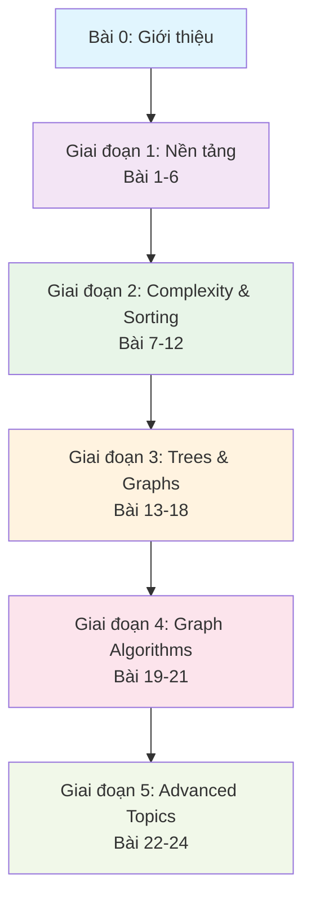
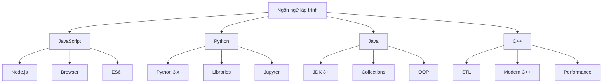
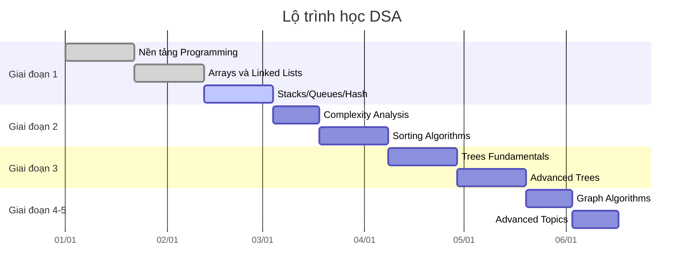
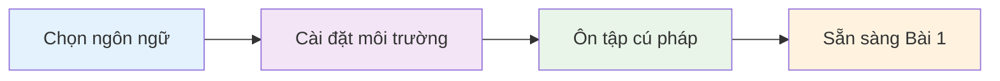

# Bài 0: Giới thiệu Khóa học Data Structures & Algorithms

  <h2 className="text-2xl font-bold text-blue-800 mb-4">🎯 Mục tiêu khóa học</h2>
  

    Khóa học này được thiết kế để giúp bạn nắm vững kiến thức nền tảng về Cấu trúc dữ liệu và Thuật toán, 
    từ cơ bản đến nâng cao, với phương pháp học tập thực hành và ứng dụng thực tế.
  

## 📚 Tổng quan khóa học

Khóa học **Data Structures & Algorithms** bao gồm **24 bài học** được chia thành **5 giai đoạn** học tập có hệ thống:

## 🗺️ Lộ trình học tập chi tiết

| Giai đoạn | Bài học | Nội dung chính | Thời gian ước tính |
|-----------|---------|----------------|-------------------|
| **1. Nền tảng** | 1-6 | Arrays, Linked Lists, Stacks/Queues, Hash Tables | 3-4 tuần |
| **2. Complexity & Sorting** | 7-12 | Big-O, Sorting algorithms, Searching | 2-3 tuần |
| **3. Trees & Graphs** | 13-18 | Binary Trees, BST, AVL Trees, Graph basics | 3-4 tuần |
| **4. Graph Algorithms** | 19-21 | BFS/DFS, Shortest Path, MST | 2 tuần |
| **5. Advanced Topics** | 22-24 | Dynamic Programming, Advanced DS, Patterns | 2-3 tuần |

## 🎯 Đối tượng học viên

  

    <h3 className="text-lg font-semibold text-green-800 mb-3">✅ Phù hợp với:</h3>
    <ul className="text-green-700 space-y-2">
      <li>• Sinh viên ngành CNTT</li>
      <li>• Lập trình viên mới bắt đầu</li>
      <li>• Người chuẩn bị phỏng vấn tech</li>
      <li>• Ai muốn củng cố kiến thức nền tảng</li>
    </ul>
  

  
  

    <h3 className="text-lg font-semibold text-orange-800 mb-3">⚠️ Yêu cầu tiên quyết:</h3>
    <ul className="text-orange-700 space-y-2">
      <li>• Biết ít nhất 1 ngôn ngữ lập trình</li>
      <li>• Hiểu cấu trúc điều khiển cơ bản</li>
      <li>• Có kiến thức OOP căn bản</li>
      <li>• Tư duy logic và toán học</li>
    </ul>
  

## 🛠️ Ngôn ngữ lập trình được hỗ trợ

| Ngôn ngữ | Ưu điểm | Nhược điểm | Khuyến nghị |
|----------|---------|------------|-------------|
| **JavaScript** | Dễ học, linh hoạt, web development | Performance thấp hơn | ⭐⭐⭐⭐⭐ Người mới |
| **Python** | Cú pháp đơn giản, thư viện phong phú | Chậm hơn, GIL | ⭐⭐⭐⭐⭐ Người mới |
| **Java** | Mạnh mẽ, enterprise, JVM ecosystem | Verbose, setup phức tạp | ⭐⭐⭐⭐ Trung cấp |
| **C++** | Performance cao, memory control | Khó học, phức tạp | ⭐⭐⭐ Nâng cao |

## 📈 Tiến trình học tập

## 🎖️ Hệ thống đánh giá và chứng chỉ

  <h3 className="text-xl font-bold text-blue-800 mb-4">📊 Tiêu chí đánh giá</h3>
  

    

      <strong>Bài tập thực hành:</strong> 40% 
      <strong>Project cuối khóa:</strong> 30% 
    

    

      <strong>Quiz định kỳ:</strong> 20% 
      <strong>Tham gia lớp:</strong> 10% 
    

  

## 🔧 Công cụ và tài nguyên học tập

| Loại công cụ | Tên công cụ | Mục đích sử dụng |
|--------------|-------------|------------------|
| **IDE/Editor** | VS Code, IntelliJ, PyCharm | Viết và debug code |
| **Platform** | LeetCode, HackerRank | Luyện tập bài tập |
| **Visualization** | Algorithm Visualizer, VisuAlgo | Hiểu thuật toán trực quan |
| **Documentation** | MDN, Python Docs, Java Docs | Tham khảo syntax |

## 🎉 Kết quả mong đợi

Sau khi hoàn thành khóa học, bạn sẽ:

  

    
🧠

    <h4 className="font-semibold text-purple-800">Tư duy thuật toán</h4>
    
Phân tích và thiết kế thuật toán hiệu quả

  

  
  

    
⚡

    <h4 className="font-semibold text-green-800">Tối ưu hiệu suất</h4>
    
Chọn cấu trúc dữ liệu phù hợp

  

  
  

    
💼

    <h4 className="font-semibold text-blue-800">Sẵn sàng phỏng vấn</h4>
    
Tự tin với coding interview

  

## 📋 Chuẩn bị cho bài học tiếp theo

  

    
💡

    

      <strong>Lời khuyên:</strong> Hãy chọn một ngôn ngữ và kiên trì với nó trong suốt khóa học. 
      Việc chuyển đổi ngôn ngữ giữa chừng sẽ làm gián đoạn quá trình học tập.
    

  

---

  <h3 className="text-xl font-bold text-gray-800 mb-2">🚀 Sẵn sàng bắt đầu hành trình?</h3>
  
Chuyển sang <strong>Bài 1: Programming Fundamentals & Language Selection</strong> để bắt đầu!

