```mermaid
gantt
    title Lá»™ trình há»c DSA
    dateFormat YYYY-MM-DD
    axisFormat %m/%d
    
    section Giai đoạn 1
    Ná»n tảng Programming    :done, stage1, 2024-01-01, 3w
    Arrays và Linked Lists   :done, stage1b, after stage1, 3w
    Stacks/Queues/Hash      :active, stage1c, after stage1b, 3w
    
    section Giai đoạn 2
    Complexity Analysis     :stage2a, after stage1c, 2w
    Sorting Algorithms      :stage2b, after stage2a, 3w
    
    section Giai đoạn 3
    Trees Fundamentals      :stage3a, after stage2b, 3w
    Advanced Trees          :stage3b, after stage3a, 3w
    
    section Giai đoạn 4-5
    Graph Algorithms        :stage4, after stage3b, 2w
    Advanced Topics         :stage5, after stage4, 2w
```

```mermaid
flowchart LR
    A[Chá»n ngôn ngữ] --> B[Cài đặt môi trÆ°á»ng]
    B --> C[Ôn tập cú pháp]
    C --> D[Sẵn sàng Bài 1]
    
    style A fill:#e3f2fd
    style B fill:#f3e5f5  
    style C fill:#e8f5e8
    style D fill:#fff3e0
```

# Bài 0: Giới thiệu Khóa học Data Structures & Algorithms

  <h2 className="text-2xl font-bold text-blue-800 mb-4">🎯 Mục tiêu khóa học</h2>
  

    Khóa học này được thiết kế để giúp bạn nắm vững kiến thức nền tảng về Cấu trúc dữ liệu và Thuật toán, 
    từ cơ bản đến nâng cao, với phương pháp học tập thực hành và ứng dụng thực tế.
  

## 1. 🗺️ Sơ đồ tổng quan khóa học

```mermaid
flowchart TD
    Start([📚 Bắt đầu khóa học DSA]) --> Foundation{🏗️ Giai đoạn 1<br/>Nền tảng<br/>3-4 tuần}

    Foundation --> B1[Bài 1: Programming Fundamentals<br/>🔧 Language Selection →]
    Foundation --> B2[Bài 2: Data Structures Intro<br/>📝 Basic concepts →]
    Foundation --> B3[Bài 3: Arrays<br/>🔢 First data structure →]
    Foundation --> B4[Bài 4: Linked Lists<br/>🔗 Dynamic structures →]
    Foundation --> B5[Bài 5: Stacks & Queues<br/>📚 LIFO & FIFO →]
    Foundation --> B6[Bài 6: Hash Tables<br/>🗂️ Key-value pairs →]

    B1 --> Complexity{⚖️ Giai đoạn 2<br/>Complexity & Sorting<br/>2-3 tuần}
    B2 --> Complexity
    B3 --> Complexity
    B4 --> Complexity
    B5 --> Complexity
    B6 --> Complexity

    Complexity --> B7[Bài 7: Complexity Analysis<br/>📊 Performance metrics →]
    Complexity --> B8[Bài 8: Big-O Notation<br/>⏱️ Time & space complexity →]
    Complexity --> B9[Bài 9: Simple Sorting<br/>🔀 Bubble, Selection, Insertion →]
    Complexity --> B10[Bài 10: Advanced Sorting<br/>🚀 Merge, Quick, Heap →]
    Complexity --> B11[Bài 11: Heap Sort & Priority Queue<br/>🏔️ Heap data structure →]
    Complexity --> B12[Bài 12: Searching Algorithms<br/>🔍 Linear, Binary search →]

    B7 --> Trees{🌳 Giai đoạn 3<br/>Trees & Graphs<br/>3-4 tuần}
    B8 --> Trees
    B9 --> Trees
    B10 --> Trees
    B11 --> Trees
    B12 --> Trees

    Trees --> B13[Bài 13: Tree Basics<br/>🌲 Tree fundamentals →]
    Trees --> B14[Bài 14: Tree Traversal<br/>🚶 DFS, BFS algorithms →]
    Trees --> B15[Bài 15: Binary Search Trees<br/>🔍 BST operations →]
    Trees --> B16[Bài 16: AVL Trees<br/>⚖️ Balanced trees →]
    Trees --> B17[Bài 17: B-Trees<br/>🌴 Advanced structures →]
    Trees --> B18[Bài 18: Graph Basics<br/>🕸️ Graph representation →]

    B13 --> GraphAlgo{🛤️ Giai đoạn 4<br/>Graph Algorithms<br/>2-3 tuần}
    B14 --> GraphAlgo
    B15 --> GraphAlgo
    B16 --> GraphAlgo
    B17 --> GraphAlgo
    B18 --> GraphAlgo

    GraphAlgo --> B19[Bài 19: Graph Search<br/>🔍 BFS, DFS on graphs →]
    GraphAlgo --> B20[Bài 20: Shortest Path<br/>🛣️ Dijkstra, Floyd-Warshall →]
    GraphAlgo --> B21[Bài 21: Minimum Spanning Tree<br/>🌲 Kruskal, Prim →]

    B19 --> Advanced{🚀 Giai đoạn 5<br/>Advanced Topics<br/>2-3 tuần}
    B20 --> Advanced
    B21 --> Advanced

    Advanced --> B22[Bài 22: Advanced Problem Solving<br/>💡 Techniques & patterns →]
    Advanced --> B23[Bài 23: Advanced Data Structures<br/>🏗️ Specialized structures →]
    Advanced --> B24[Bài 24: Pattern Recognition<br/>🎯 Problem solving mastery →]

    B22 --> Complete([🎉 Hoàn thành khóa học])
    B23 --> Complete
    B24 --> Complete

    %% Click events for navigation
    click B1 "/desktop-docs/soft-skills/dsa/bai-1" "Đi đến Bài 1"
    click B2 "/desktop-docs/soft-skills/dsa/bai-2" "Đi đến Bài 2"
    click B3 "/desktop-docs/soft-skills/dsa/bai-3" "Đi đến Bài 3"
    click B4 "/desktop-docs/soft-skills/dsa/bai-4" "Đi đến Bài 4"
    click B5 "/desktop-docs/soft-skills/dsa/bai-5" "Đi đến Bài 5"
    click B6 "/desktop-docs/soft-skills/dsa/bai-6" "Đi đến Bài 6"
    click B7 "/desktop-docs/soft-skills/dsa/bai-7" "Đi đến Bài 7"
    click B8 "/desktop-docs/soft-skills/dsa/bai-8" "Đi đến Bài 8"
    click B9 "/desktop-docs/soft-skills/dsa/bai-9" "Đi đến Bài 9"
    click B10 "/desktop-docs/soft-skills/dsa/bai-10" "Đi đến Bài 10"
    click B11 "/desktop-docs/soft-skills/dsa/bai-11" "Đi đến Bài 11"
    click B12 "/desktop-docs/soft-skills/dsa/bai-12" "Đi đến Bài 12"
    click B13 "/desktop-docs/soft-skills/dsa/bai-13" "Đi đến Bài 13"
    click B14 "/desktop-docs/soft-skills/dsa/bai-14" "Đi đến Bài 14"
    click B15 "/desktop-docs/soft-skills/dsa/bai-15" "Đi đến Bài 15"
    click B16 "/desktop-docs/soft-skills/dsa/bai-16" "Đi đến Bài 16"
    click B17 "/desktop-docs/soft-skills/dsa/bai-17" "Đi đến Bài 17"
    click B18 "/desktop-docs/soft-skills/dsa/bai-18" "Đi đến Bài 18"
    click B19 "/desktop-docs/soft-skills/dsa/bai-19" "Đi đến Bài 19"
    click B20 "/desktop-docs/soft-skills/dsa/bai-20" "Đi đến Bài 20"
    click B21 "/desktop-docs/soft-skills/dsa/bai-21" "Đi đến Bài 21"
    click B22 "/desktop-docs/soft-skills/dsa/bai-22" "Đi đến Bài 22"
    click B23 "/desktop-docs/soft-skills/dsa/bai-23" "Đi đến Bài 23"
    click B24 "/desktop-docs/soft-skills/dsa/bai-24" "Đi đến Bài 24"

    %% Styling
    classDef phaseBox fill:#e1f5fe,stroke:#01579b,stroke-width:3px,color:#000
    classDef lessonBox fill:#f3e5f5,stroke:#4a148c,stroke-width:2px,color:#000,cursor:pointer
    classDef startEnd fill:#c8e6c9,stroke:#1b5e20,stroke-width:3px,color:#000

    class Foundation,Complexity,Trees,GraphAlgo,Advanced phaseBox
    class B1,B2,B3,B4,B5,B6,B7,B8,B9,B10,B11,B12,B13,B14,B15,B16,B17,B18,B19,B20,B21,B22,B23,B24 lessonBox
    class Start,Complete startEnd
```

### 📚 Phân chia giai đoạn học tập

| Giai đoạn | Bài học | Trọng tâm | Thời gian ước tính |
|-----------|---------|-----------|-------------------|
| **Foundation** | 1-6 | Cấu trúc dữ liệu cơ bản, arrays, linked lists | 3-4 tuần |
| **Complexity & Sorting** | 7-12 | Big-O, thuật toán sắp xếp và tìm kiếm | 2-3 tuần |
| **Trees & Graphs** | 13-18 | Cây, duyệt cây, BST, AVL, đồ thị cơ bản | 3-4 tuần |
| **Graph Algorithms** | 19-21 | BFS/DFS, đường đi ngắn nhất, MST | 2-3 tuần |
| **Advanced Topics** | 22-24 | Kỹ thuật giải quyết vấn đề nâng cao | 2-3 tuần |

## 🎯 Đối tượng học viên

  

    <h3 className="text-lg font-semibold text-green-800 mb-3">✅ Phù hợp với:</h3>
    <ul className="text-green-700 space-y-2">
      <li>• Sinh viên ngành CNTT</li>
      <li>• Lập trình viên mới bắt đầu</li>
      <li>• Người chuẩn bị phỏng vấn tech</li>
      <li>• Ai muốn củng cố kiến thức nền tảng</li>
    </ul>
  

  
  

    <h3 className="text-lg font-semibold text-orange-800 mb-3">⚠️ Yêu cầu tiên quyết:</h3>
    <ul className="text-orange-700 space-y-2">
      <li>• Biết ít nhất 1 ngôn ngữ lập trình</li>
      <li>• Hiểu cấu trúc điều khiển cơ bản</li>
      <li>• Có kiến thức OOP căn bản</li>
      <li>• Tư duy logic và toán học</li>
    </ul>
  

## 🛠️ Ngôn ngữ lập trình được hỗ trợ

| Ngôn ngữ | Ưu điểm | Nhược điểm | Khuyến nghị |
|----------|---------|------------|-------------|
| **JavaScript** | Dễ học, linh hoạt, web development | Performance thấp hơn | ⭐⭐⭐⭐⭐ Người mới |
| **Python** | Cú pháp đơn giản, thư viện phong phú | Chậm hơn, GIL | ⭐⭐⭐⭐⭐ Người mới |
| **Java** | Mạnh mẽ, enterprise, JVM ecosystem | Verbose, setup phức tạp | ⭐⭐⭐⭐ Trung cấp |
| **C++** | Performance cao, memory control | Khó học, phức tạp | ⭐⭐⭐ Nâng cao |

## 📈 Tiến trình học tập

## 🎖️ Hệ thống đánh giá và chứng chỉ

  <h3 className="text-xl font-bold text-blue-800 mb-4">📊 Tiêu chí đánh giá</h3>
  

    

      <strong>Bài tập thực hành:</strong> 40% 
      <strong>Project cuối khóa:</strong> 30% 
    

    

      <strong>Quiz định kỳ:</strong> 20% 
      <strong>Tham gia lớp:</strong> 10% 
    

  

## 🔧 Công cụ và tài nguyên học tập

| Loại công cụ | Tên công cụ | Mục đích sử dụng |
|--------------|-------------|------------------|
| **IDE/Editor** | VS Code, IntelliJ, PyCharm | Viết và debug code |
| **Platform** | LeetCode, HackerRank | Luyện tập bài tập |
| **Visualization** | Algorithm Visualizer, VisuAlgo | Hiểu thuật toán trực quan |
| **Documentation** | MDN, Python Docs, Java Docs | Tham khảo syntax |

## 🎉 Kết quả mong đợi

Sau khi hoàn thành khóa học, bạn sẽ:

  

    
🧠

    <h4 className="font-semibold text-purple-800">Tư duy thuật toán</h4>
    
Phân tích và thiết kế thuật toán hiệu quả

  

  
  

    
⚡

    <h4 className="font-semibold text-green-800">Tối ưu hiệu suất</h4>
    
Chá»n cấu trúc dữ liệu phù hợp

  

  
  

    
💼

    <h4 className="font-semibold text-blue-800">Sẵn sàng phỏng vấn</h4>
    
Tự tin với coding interview

  

## 📋 Chuẩn bị cho bài học tiếp theo

  

    
💡

    

      <strong>Lời khuyên:</strong> Hãy chọn một ngôn ngữ và kiên trì với nó trong suốt khóa học. 
      Việc chuyển đổi ngôn ngữ giữa chừng sẽ làm gián đoạn quá trình học tập.
    

  

---

  <h3 className="text-xl font-bold text-gray-800 mb-2">🚀 Sẵn sàng bắt đầu hành trình?</h3>
  
Chuyển sang <strong>Bài 1: Programming Fundamentals & Language Selection</strong> để bắt đầu!

