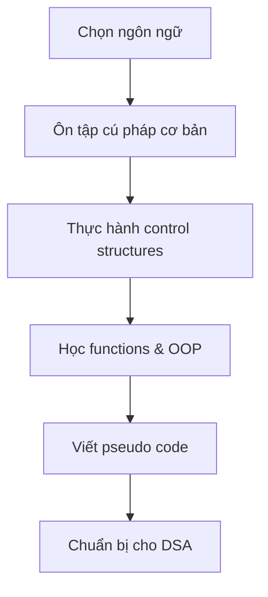
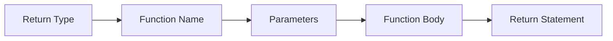
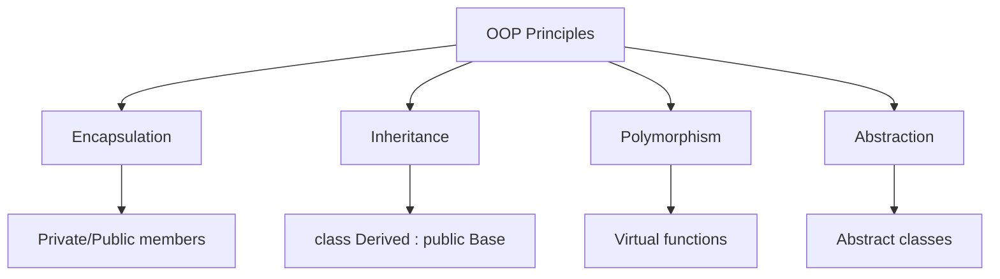

# Bài 1: Programming Fundamentals & Language Selection

<div className="border-l-4 border-blue-500 pl-4 mb-6">
  <br />
  <h2 className="text-xl font-bold text-blue-700 mb-2">🎯 Mục tiêu học tập</h2>
  <ul className="list-disc list-inside text-gray-700">
    <li>Chọn ngôn ngữ lập trình phù hợp cho việc học DSA</li>
    <li>Nắm vững cú pháp cơ bản và cấu trúc điều khiển</li>
    <li>Hiểu về functions và OOP basics</li>
    <li>Thực hành viết pseudo code</li>
  </ul>
</div>

## 1. Lựa chọn ngôn ngữ lập trình

### 1.1 So sánh các ngôn ngữ phổ biến

| Ngôn ngữ       | Ưu điểm                             | Nhược điểm         | Phù hợp cho             |
| -------------- | ----------------------------------- | ------------------ | ----------------------- |
| **C++**        | Performance cao, Memory control     | Syntax phức tạp    | Competitive Programming |
| **Python**     | Syntax đơn giản, Thư viện phong phú | Chậm hơn           | Beginners, Prototyping  |
| **Java**       | Cross-platform, Strong typing       | Verbose syntax     | Enterprise development  |
| **JavaScript** | Web-friendly, Dynamic               | Type safety issues | Web development         |

<div className="bg-green-50 border border-green-200 rounded-lg p-4 my-4">
  <h3 className="font-bold text-green-800 mb-2">💡 Khuyến nghị</h3>
  <p className="text-green-700">Chúng ta sẽ sử dụng <strong>C++</strong> trong khóa học này vì:</p>
  <ul className="list-disc list-inside text-green-700 mt-2">
    <li>Performance cao, phù hợp cho thuật toán phức tạp</li>
    <li>Memory management tốt</li>
    <li>Được sử dụng rộng rãi trong competitive programming</li>
    <li>STL (Standard Template Library) hỗ trợ nhiều data structures</li>
  </ul>
</div>

### 1.2 Quy trình học tập



## 2. Cú pháp cơ bản C++

### 2.1 Cấu trúc chương trình cơ bản

```cpp
#include <iostream>
#include <vector>
#include <string>

using namespace std;

int main() {
    // Code chính
    cout << "Hello DSA!" << endl;
    return 0;
}
```

### 2.2 Khai báo biến và kiểu dữ liệu

| Kiểu dữ liệu | Kích thước | Phạm vi        | Ví dụ                           |
| ------------ | ---------- | -------------- | ------------------------------- |
| `int`        | 4 bytes    | -2³¹ đến 2³¹-1 | `int n = 100;`                  |
| `long long`  | 8 bytes    | -2⁶³ đến 2⁶³-1 | `long long big = 1000000000LL;` |
| `double`     | 8 bytes    | ±1.7e±308      | `double pi = 3.14159;`          |
| `char`       | 1 byte     | -128 đến 127   | `char grade = 'A';`             |
| `bool`       | 1 byte     | true/false     | `bool isValid = true;`          |

```cpp
// Ví dụ khai báo
int size = 10;
double average = 85.5;
string name = "Alice";
vector<int> numbers = {1, 2, 3, 4, 5};
```

## 3. Cấu trúc điều khiển

### 3.1 Conditional Statements

<div className="grid grid-cols-1 md:grid-cols-2 gap-4 my-4">
  <div className="border rounded-lg p-4">
    <h4 className="font-bold mb-2">If-else</h4>
    <h4 className="font-bold mb-2">If-else</h4>
    ```cpp
if (score >= 90) {
    grade = 'A';
} else if (score >= 80) {
    grade = 'B';
} else {
    grade = 'C';
}
    ```
  </div>
  <div className="border rounded-lg p-4">
    <h4 className="font-bold mb-2">Switch</h4>
    ```cpp
switch (choice) {
    case 1:
        cout << "Option 1";
        break;
    case 2:
        cout << "Option 2";
        break;
    default:
        cout << "Invalid";
}
    ```
  </div>
</div>

### 3.2 Loops

| Loại loop    | Cú pháp                     | Khi nào sử dụng       |
| ------------ | --------------------------- | --------------------- |
| **for**      | `for(int i=0; i<n; i++)`    | Biết trước số lần lặp |
| **while**    | `while(condition)`          | Điều kiện phức tạp    |
| **do-while** | `do {...} while(condition)` | Chạy ít nhất 1 lần    |

```cpp
// For loop - duyệt array
for (int i = 0; i < arr.size(); i++) {
    cout << arr[i] << " ";
}

// Range-based for (C++11)
for (int element : arr) {
    cout << element << " ";
}

// While loop - tìm kiếm
int target = 5, index = 0;
while (index < arr.size() && arr[index] != target) {
    index++;
}
```

## 4. Functions

### 4.1 Cấu trúc function



### 4.2 Các loại functions

<div className="overflow-x-auto">
  <table className="min-w-full border-collapse border">
    <thead>
      <tr className="bg-gray-50">
        <th className="border px-4 py-2">Loại</th>
        <th className="border px-4 py-2">Ví dụ</th>
        <th className="border px-4 py-2">Mô tả</th>
      </tr>
    </thead>
    <tbody>
      <tr>
        <td className="border px-4 py-2 font-mono">void function</td>
        <td className="border px-4 py-2 font-mono">void printArray(vector&lt;int&gt; arr)</td>
        <td className="border px-4 py-2">Không trả về giá trị</td>
      </tr>
      <tr>
        <td className="border px-4 py-2 font-mono">return function</td>
        <td className="border px-4 py-2 font-mono">int findMax(vector&lt;int&gt; arr)</td>
        <td className="border px-4 py-2">Trả về giá trị</td>
      </tr>
      <tr>
        <td className="border px-4 py-2 font-mono">recursive</td>
        <td className="border px-4 py-2 font-mono">int factorial(int n)</td>
        <td className="border px-4 py-2">Gọi chính nó</td>
      </tr>
    </tbody>
  </table>
</div>

```cpp
// Function tìm phần tử lớn nhất
int findMax(vector<int>& arr) {
    if (arr.empty()) return -1;

    int maxVal = arr[0];
    for (int i = 1; i < arr.size(); i++) {
        if (arr[i] > maxVal) {
            maxVal = arr[i];
        }
    }
    return maxVal;
}

// Function đệ quy tính giai thừa
int factorial(int n) {
    if (n <= 1) return 1;
    return n * factorial(n - 1);
}
```

## 5. OOP Basics

### 5.1 Class và Object

```cpp
class Student {
private:
    string name;
    int age;
    double gpa;

public:
    // Constructor
    Student(string n, int a, double g) : name(n), age(a), gpa(g) {}

    // Getter methods
    string getName() const { return name; }
    int getAge() const { return age; }
    double getGPA() const { return gpa; }

    // Setter methods
    void setGPA(double newGPA) { gpa = newGPA; }

    // Method
    void displayInfo() {
        cout << "Name: " << name << ", Age: " << age << ", GPA: " << gpa << endl;
    }
};
```

### 5.2 Tính chất của OOP



## 6. Pseudo Code

### 6.1 Quy tắc viết Pseudo Code

<div className="bg-blue-50 border border-blue-200 rounded-lg p-4 my-4">
  <h3 className="font-bold text-blue-800 mb-2">📝 Nguyên tắc Pseudo Code</h3>
  <ul className="list-disc list-inside text-blue-700">
    <li>Sử dụng ngôn ngữ tự nhiên kết hợp ký hiệu toán học</li>
    <li>Indentation để thể hiện cấu trúc</li>
    <li>Tránh chi tiết cú pháp cụ thể</li>
    <li>Focus vào logic algorithm</li>
  </ul>
</div>

### 6.2 Ví dụ Pseudo Code

**Bài toán:** Tìm phần tử lớn nhất trong array

```
ALGORITHM FindMaximum
INPUT: array A[1...n]
OUTPUT: maximum value in A

BEGIN
    max ← A[1]
    FOR i ← 2 TO n DO
        IF A[i] > max THEN
            max ← A[i]
        END IF
    END FOR
    RETURN max
END
```

**Tương ứng C++ code:**

```cpp
int findMaximum(vector<int>& A) {
    int max = A[0];
    for (int i = 1; i < A.size(); i++) {
        if (A[i] > max) {
            max = A[i];
        }
    }
    return max;
}
```

## 7. Bài tập thực hành

### Bài tập 1: Kiểm tra số nguyên tố

```cpp
bool isPrime(int n) {
    if (n <= 1) return false;
    if (n <= 3) return true;
    if (n % 2 == 0 || n % 3 == 0) return false;

    for (int i = 5; i * i <= n; i += 6) {
        if (n % i == 0 || n % (i + 2) == 0) {
            return false;
        }
    }
    return true;
}
```

### Bài tập 2: Reverse array

```cpp
void reverseArray(vector<int>& arr) {
    int left = 0, right = arr.size() - 1;
    while (left < right) {
        swap(arr[left], arr[right]);
        left++;
        right--;
    }
}
```

<div className="bg-yellow-50 border border-yellow-200 rounded-lg p-4 my-4">
  <h3 className="font-bold text-yellow-800 mb-2">🔧 Thực hành</h3>
  <p className="text-yellow-700">Hãy thực hiện các bài tập sau:</p>
  <ol className="list-decimal list-inside text-yellow-700 mt-2">
    <li>Viết function tính tổng các phần tử trong array</li>
    <li>Tìm phần tử xuất hiện nhiều nhất</li>
    <li>Sắp xếp array theo thứ tự tăng dần (bubble sort)</li>
    <li>Viết class Calculator với các phép toán cơ bản</li>
  </ol>
</div>

## 8. Tổng kết

### Checklist hoàn thành bài 1:

- ✅ Hiểu cú pháp cơ bản C++
- ✅ Thành thạo control structures
- ✅ Viết được functions cơ bản
- ✅ Nắm được OOP basics
- ✅ Có thể viết pseudo code
- ✅ Hoàn thành các bài tập thực hành

### Chuẩn bị cho bài 2:

- Đọc trước về Data Structures
- Ôn lại pointer và memory management
- Thực hành thêm với STL containers

---

<div className="text-center text-gray-600 text-sm mt-8">
  <strong>Bài tiếp theo:</strong> Introduction to Data Structures<br />
  <em>Khóa học Data Structures & Algorithms - 24 Bài học</em>
</div>
