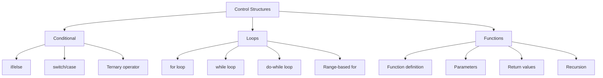
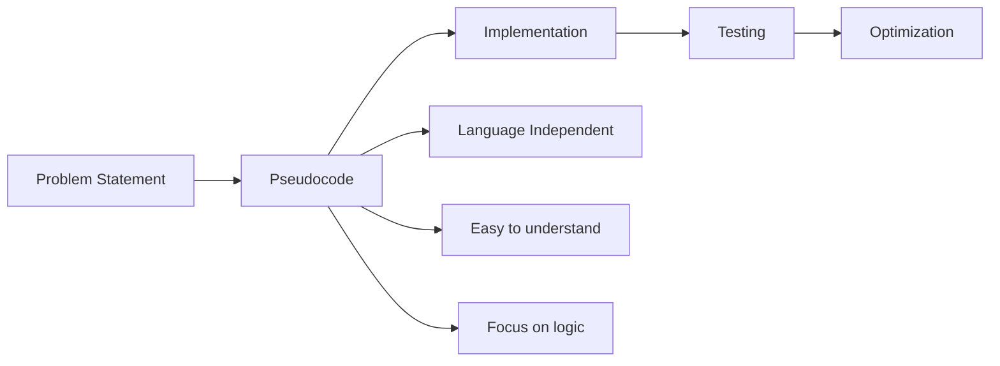

# Programming Fundamentals & Language Selection

<div className="bg-blue-50 border-l-4 border-blue-500 p-4 mb-6">
  <h3 className="text-lg font-semibold text-blue-800">Mục tiêu học tập</h3>
  <ul className="mt-2 text-blue-700">
    <li>✓ Lựa chọn ngôn ngữ lập trình phù hợp cho DSA</li>
    <li>✓ Nắm vững các khái niệm cơ bản trong lập trình</li>
    <li>✓ Thực hành viết pseudocode mô tả thuật toán</li>
    <li>✓ Hiểu được tầm quan trọng của nền tảng vững chắc</li>
  </ul>
</div>

## 1. Lựa chọn ngôn ngữ lập trình

Việc chọn ngôn ngữ lập trình phù hợp là bước đầu quan trọng trong hành trình học DSA. Mỗi ngôn ngữ có những ưu thế riêng:

| Ngôn ngữ       | Ưu điểm                                                                | Nhược điểm                                      | Phù hợp cho                                  |
| -------------- | ---------------------------------------------------------------------- | ----------------------------------------------- | -------------------------------------------- |
| **C++**        | - Hiệu năng cao<br>- Quản lý bộ nhớ linh hoạt<br>- STL phong phú       | - Syntax phức tạp<br>- Dễ gây lỗi memory        | Competitive Programming, System Programming  |
| **Java**       | - OOP mạnh mẽ<br>- Platform independent<br>- Collections framework tốt | - Verbose<br>- Chậm hơn C++                     | Enterprise applications, Android development |
| **Python**     | - Syntax đơn giản<br>- Rapid prototyping<br>- Thư viện phong phú       | - Chậm hơn so với C++/Java<br>- GIL limitations | Data Science, Machine Learning, Prototyping  |
| **JavaScript** | - Không cần setup<br>- Phổ biến<br>- Async programming                 | - Dynamically typed<br>- Inconsistent behavior  | Web Development, Full-stack                  |

<div className="bg-green-50 border-l-4 border-green-500 p-4 my-4">
  <p className="text-green-800"><strong>Khuyến nghị:</strong> Chúng ta sẽ sử dụng <strong>C++</strong> trong khóa học này để tận dụng hiệu năng cao và sự phổ biến trong competitive programming.</p>
</div>

## 2. Ôn tập C++ Cơ bản

### 2.1 Cấu trúc chương trình C++ cơ bản

```cpp
#include <iostream>
#include <vector>
#include <algorithm>
using namespace std;

int main() {
    // Code của bạn ở đây
    cout << "Hello, DSA World!" << endl;
    return 0;
}
```

### 2.2 Các thư viện quan trọng trong DSA

```cpp
// Thư viện cơ bản
#include <iostream>     // Input/Output
#include <vector>       // Dynamic arrays
#include <stack>        // Stack data structure
#include <queue>        // Queue data structure
#include <map>          // Hash table/Red-Black tree
#include <set>          // Sorted set
#include <algorithm>    // Sorting, searching algorithms
#include <climits>      // Constants như INT_MAX, INT_MIN
```

## 3. Cấu trúc điều khiển trong DSA

### 3.1 Bản đồ tư duy về Control Structures



### 3.2 Ví dụ thực hành

```cpp
// 1. Conditional statements
int findMax(int a, int b, int c) {
    if (a >= b && a >= c) return a;
    else if (b >= a && b >= c) return b;
    else return c;
}

// 2. Loops - duyệt mảng
void printArray(vector<int>& arr) {
    // Traditional for loop
    for (int i = 0; i < arr.size(); i++) {
        cout << arr[i] << " ";
    }
    cout << endl;

    // Range-based for loop (C++11)
    for (int element : arr) {
        cout << element << " ";
    }
    cout << endl;
}

// 3. Function với reference parameter
void swapValues(int& a, int& b) {
    int temp = a;
    a = b;
    b = temp;
}
```

## 4. Object-Oriented Programming Basics

### 4.1 Tầm quan trọng của OOP trong DSA

<div className="bg-yellow-50 border-l-4 border-yellow-500 p-4 my-4">
  <p className="text-yellow-800"><strong>Lưu ý:</strong> Hiểu OOP giúp bạn thiết kế các cấu trúc dữ liệu tùy chỉnh một cách hiệu quả và có tổ chức.</p>
</div>

```cpp
// Ví dụ: Class cho một Node trong Linked List
class ListNode {
public:
    int data;
    ListNode* next;

    // Constructor
    ListNode(int value) : data(value), next(nullptr) {}

    // Destructor
    ~ListNode() {
        // Cleanup nếu cần
    }
};

// Sử dụng class
ListNode* head = new ListNode(10);
head->next = new ListNode(20);
```

### 4.2 Các khái niệm OOP cần thiết

| Khái niệm         | Mô tả                               | Ví dụ trong DSA                            |
| ----------------- | ----------------------------------- | ------------------------------------------ |
| **Encapsulation** | Đóng gói dữ liệu và methods         | Private members trong Stack class          |
| **Inheritance**   | Kế thừa từ class cha                | Binary Tree → Binary Search Tree           |
| **Polymorphism**  | Một interface, nhiều implementation | Virtual functions cho different sorting    |
| **Abstraction**   | Ẩn chi tiết implementation          | Interface cho Queue (array vs linked list) |

## 5. Pseudocode - Ngôn ngữ mô tả thuật toán

### 5.1 Tại sao cần Pseudocode?



### 5.2 Quy tắc viết Pseudocode

<div className="overflow-x-auto">

| Cấu trúc      | Pseudocode                                                               | C++ Implementation                                                        |
| ------------- | ------------------------------------------------------------------------ | ------------------------------------------------------------------------- |
| **Sequence**  | `BEGIN`<br>`statement1`<br>`statement2`<br>`END`                         | `{`<br>`statement1;`<br>`statement2;`<br>`}`                              |
| **Selection** | `IF condition THEN`<br>`statement1`<br>`ELSE`<br>`statement2`<br>`ENDIF` | `if (condition) {`<br>`statement1;`<br>`} else {`<br>`statement2;`<br>`}` |
| **Iteration** | `WHILE condition DO`<br>`statement`<br>`ENDWHILE`                        | `while (condition) {`<br>`statement;`<br>`}`                              |

</div>

### 5.3 Ví dụ thực tế: Tìm kiếm tuyến tính

**Pseudocode:**

```
ALGORITHM LinearSearch
INPUT: array A[0..n-1], target value x
OUTPUT: index of x in A, or -1 if not found

BEGIN
    FOR i = 0 TO n-1 DO
        IF A[i] = x THEN
            RETURN i
        ENDIF
    ENDFOR
    RETURN -1
END
```

**C++ Implementation:**

```cpp
int linearSearch(vector<int>& arr, int target) {
    for (int i = 0; i < arr.size(); i++) {
        if (arr[i] == target) {
            return i;
        }
    }
    return -1; // Not found
}
```

## 6. Thực hành & Bài tập

### 6.1 Bài tập cơ bản

<div className="bg-gray-50 border border-gray-300 p-4 rounded-lg my-4">
  <h4 className="font-semibold mb-3">Bài tập 1: Viết hàm đếm số chẵn trong mảng</h4>
  
  <strong>Yêu cầu:</strong>
  <ol className="ml-4 list-decimal">
    <li>Viết pseudocode</li>
    <li>Implement bằng C++</li>
    <li>Test với ít nhất 3 test cases</li>
  </ol>
</div>

**Pseudocode:**

```
ALGORITHM CountEvenNumbers
INPUT: array A[0..n-1]
OUTPUT: count of even numbers

BEGIN
    count = 0
    FOR i = 0 TO n-1 DO
        IF A[i] MOD 2 = 0 THEN
            count = count + 1
        ENDIF
    ENDFOR
    RETURN count
END
```

**C++ Solution:**

```cpp
int countEvenNumbers(vector<int>& arr) {
    int count = 0;
    for (int num : arr) {
        if (num % 2 == 0) {
            count++;
        }
    }
    return count;
}

// Test cases
int main() {
    vector<int> test1 = {1, 2, 3, 4, 5, 6};    // Expected: 3
    vector<int> test2 = {1, 3, 5, 7};          // Expected: 0
    vector<int> test3 = {2, 4, 6, 8};          // Expected: 4

    cout << "Test 1: " << countEvenNumbers(test1) << endl;
    cout << "Test 2: " << countEvenNumbers(test2) << endl;
    cout << "Test 3: " << countEvenNumbers(test3) << endl;

    return 0;
}
```

### 6.2 Checkpoint kiến thức

| Concept            | Bạn đã nắm chắc chưa? | Ghi chú                                   |
| ------------------ | :-------------------: | ----------------------------------------- |
| C++ Syntax cơ bản  |           ☐           | Includes, namespaces, main function       |
| Control structures |           ☐           | if/else, loops, switch                    |
| Functions          |           ☐           | Parameters, return values, references     |
| OOP basics         |           ☐           | Classes, objects, constructors            |
| Pseudocode         |           ☐           | Can translate problem → pseudocode → code |

## 7. Tổng kết và chuẩn bị cho bài tiếp theo

### 7.1 Key Takeaways

<div className="bg-indigo-50 border-l-4 border-indigo-500 p-4 my-4">
  <ul className="text-indigo-800">
    <li><strong>Nền tảng vững chắc</strong> về ngôn ngữ lập trình là điều kiện tiên quyết</li>
    <li><strong>Pseudocode</strong> giúp bạn tư duy thuật toán trước khi code</li>
    <li><strong>C++</strong> cung cấp hiệu năng và linh hoạt cần thiết cho DSA</li>
    <li><strong>OOP</strong> giúp thiết kế cấu trúc dữ liệu có tổ chức</li>
  </ul>
</div>

### 7.2 Chuẩn bị cho Bài 2

Bài tiếp theo chúng ta sẽ học về **"Introduction to Data Structures"**. Hãy đảm bảo bạn:

- [ ] Cài đặt C++ compiler và IDE
- [ ] Thực hành viết và chạy chương trình C++ cơ bản
- [ ] Hoàn thành tất cả bài tập trong bài này
- [ ] Ôn lại khái niệm về memory và pointers

### 7.3 Tài liệu tham khảo

- **C++ Reference**: https://cppreference.com/
- **Online C++ Compiler**: https://godbolt.org/
- **Practice Platform**: https://leetcode.com/ (Easy problems để làm quen)
