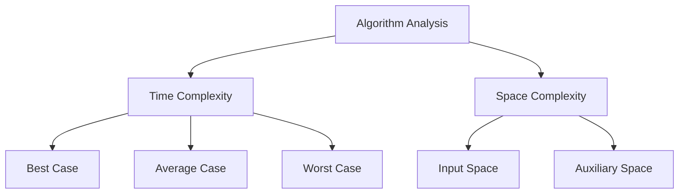

# Bài 1: Programming Fundamentals & Language Selection

<div className="bg-gradient-to-r from-blue-50 to-indigo-50 p-6 rounded-lg border-l-4 border-blue-500 mb-8">
  <h2 className="text-2xl font-bold text-blue-800 mb-2">🎯 Mục tiêu học tập</h2>
  <p className="text-gray-700">Nắm vững các khái niệm cơ bản về lập trình và chọn ngôn ngữ phù hợp để học Data Structures & Algorithms hiệu quả.</p>
</div>

## 1. Chọn Ngôn Ngữ Lập Trình Phù Hợp

### 1.1 So Sánh Các Ngôn Ngữ Phổ Biến

| Ngôn ngữ | Ưu điểm | Nhược điểm | Phù hợp cho |
|----------|---------|------------|-------------|
| **Python** | Cú pháp đơn giản, thư viện phong phú | Tốc độ chậm | Người mới bắt đầu, Data Science |
| **Java** | OOP mạnh, tài liệu phong phú | Verbose, cần JVM | Enterprise, Android |
| **C++** | Tốc độ cao, kiểm soát bộ nhớ | Phức tạp, dễ lỗi | Competitive Programming, System |
| **JavaScript** | Web-friendly, linh hoạt | Động typing, quirks | Web Development |
| **Rust** | Hiệu năng cao, memory safety | Steep learning curve | System Programming, Performance |

### 1.2 Lý Do Chọn Rust Cho Khóa Học Này

<div className="bg-yellow-50 p-4 rounded-lg border border-yellow-200 mb-6">
  <h4 className="font-semibold text-yellow-800 mb-2">⚡ Tại sao chọn Rust?</h4>
  <ul className="text-sm text-yellow-700 space-y-1">
    <li>• <strong>Performance:</strong> Tốc độ tương đương C/C++ nhưng an toàn hơn</li>
    <li>• <strong>Memory Safety:</strong> Tránh được các lỗi phổ biến như buffer overflow</li>
    <li>• <strong>Modern Syntax:</strong> Cú pháp hiện đại, dễ đọc</li>
    <li>• <strong>Growing Ecosystem:</strong> Đang phát triển mạnh trong industry</li>
  </ul>
</div>

## 2. Ôn Tập Cú Pháp Cơ Bản Rust

### 2.1 Variables và Data Types

```rust
fn main() {
    // Immutable variable (default)
    let x = 5;
    println!("x = {}", x);
    
    // Mutable variable
    let mut y = 10;
    y = 15;
    println!("y = {}", y);
    
    // Explicit types
    let integer: i32 = 42;
    let floating: f64 = 3.14;
    let boolean: bool = true;
    let character: char = 'A';
    let string: String = String::from("Hello");
    
    // Arrays và Vectors
    let array: [i32; 3] = [1, 2, 3];
    let mut vector: Vec<i32> = vec![1, 2, 3];
    vector.push(4);
}
```

### 2.2 Control Flow Structures

```rust
fn demonstrate_control_flow() {
    let number = 6;
    
    // If-else statements
    if number % 4 == 0 {
        println!("number is divisible by 4");
    } else if number % 3 == 0 {
        println!("number is divisible by 3");
    } else {
        println!("number is not divisible by 4 or 3");
    }
    
    // Loop structures
    let mut counter = 0;
    
    // Infinite loop with break
    loop {
        counter += 1;
        if counter == 3 {
            break;
        }
    }
    
    // While loop
    let mut number = 3;
    while number != 0 {
        println!("{}!", number);
        number -= 1;
    }
    
    // For loop
    let a = [10, 20, 30, 40, 50];
    for element in a {
        println!("the value is: {}", element);
    }
    
    // Range-based for loop
    for number in 1..4 {
        println!("{}!", number);
    }
}
```

### 2.3 Match Statements (Similar to Switch)

```rust
fn match_example(x: i32) -> String {
    match x {
        1 => String::from("one"),
        2 => String::from("two"),
        3 => String::from("three"),
        4..=9 => String::from("between four and nine"),
        _ => String::from("something else"),
    }
}

// Pattern matching với enums
#[derive(Debug)]
enum Direction {
    North,
    South,
    East,
    West,
}

fn move_direction(direction: Direction) {
    match direction {
        Direction::North => println!("Moving North"),
        Direction::South => println!("Moving South"),
        Direction::East => println!("Moving East"),
        Direction::West => println!("Moving West"),
    }
}
```

## 3. Functions, Parameters và Return Values

### 3.1 Function Fundamentals

```rust
// Basic function
fn greet() {
    println!("Hello, world!");
}

// Function with parameters
fn greet_person(name: &str) {
    println!("Hello, {}!", name);
}

// Function with return value
fn add(a: i32, b: i32) -> i32 {
    a + b  // No semicolon = return value
}

// Function with multiple return values (using tuple)
fn calculate(a: i32, b: i32) -> (i32, i32, i32) {
    (a + b, a - b, a * b)
}

// Function with Option return type (for error handling)
fn divide(a: f64, b: f64) -> Option<f64> {
    if b != 0.0 {
        Some(a / b)
    } else {
        None
    }
}
```

### 3.2 Ownership và Borrowing

<div className="bg-green-50 p-4 rounded-lg border border-green-200 mb-6">
  <h4 className="font-semibold text-green-800 mb-2">🔑 Khái niệm quan trọng: Ownership</h4>
  <p className="text-sm text-green-700">Rust sử dụng hệ thống ownership để quản lý bộ nhớ mà không cần garbage collector.</p>
</div>

```rust
fn ownership_example() {
    let s1 = String::from("hello");
    let s2 = s1;  // s1 is moved to s2, s1 is no longer valid
    // println!("{}", s1);  // This would cause a compile error
    println!("{}", s2);  // This is fine
    
    // Borrowing (references)
    let s3 = String::from("world");
    let len = calculate_length(&s3);  // s3 is borrowed
    println!("The length of '{}' is {}.", s3, len);  // s3 is still valid
}

fn calculate_length(s: &String) -> usize {
    s.len()
}  // s goes out of scope, but it's just a reference, so nothing happens
```

## 4. Object-Oriented Programming Basics

### 4.1 Structs và Implementation

```rust
// Define a struct
#[derive(Debug, Clone)]
struct Rectangle {
    width: u32,
    height: u32,
}

// Implementation block
impl Rectangle {
    // Associated function (like static method)
    fn new(width: u32, height: u32) -> Rectangle {
        Rectangle { width, height }
    }
    
    // Method (takes &self)
    fn area(&self) -> u32 {
        self.width * self.height
    }
    
    // Method that modifies the struct
    fn scale(&mut self, factor: u32) {
        self.width *= factor;
        self.height *= factor;
    }
    
    // Method that compares with another Rectangle
    fn can_hold(&self, other: &Rectangle) -> bool {
        self.width > other.width && self.height > other.height
    }
}
```

### 4.2 Traits (Similar to Interfaces)

```rust
// Define a trait
trait Shape {
    fn area(&self) -> f64;
    fn perimeter(&self) -> f64;
}

// Implement trait for Rectangle
impl Shape for Rectangle {
    fn area(&self) -> f64 {
        (self.width * self.height) as f64
    }
    
    fn perimeter(&self) -> f64 {
        2.0 * (self.width + self.height) as f64
    }
}

// Circle struct
struct Circle {
    radius: f64,
}

impl Shape for Circle {
    fn area(&self) -> f64 {
        std::f64::consts::PI * self.radius * self.radius
    }
    
    fn perimeter(&self) -> f64 {
        2.0 * std::f64::consts::PI * self.radius
    }
}

// Generic function using trait
fn print_shape_info<T: Shape>(shape: &T) {
    println!("Area: {:.2}", shape.area());
    println!("Perimeter: {:.2}", shape.perimeter());
}
```

## 5. Pseudo Code và Algorithm Description

### 5.1 Tầm Quan Trọng của Pseudo Code

<div className="bg-purple-50 p-4 rounded-lg border border-purple-200 mb-6">
  <h4 className="font-semibold text-purple-800 mb-2">📝 Pseudo Code Benefits</h4>
  <ul className="text-sm text-purple-700 space-y-1">
    <li>• Tập trung vào logic thay vì cú pháp</li>
    <li>• Dễ dàng communicate với team</li>
    <li>• Platform-independent thinking</li>
    <li>• Chuẩn bị tốt cho coding interviews</li>
  </ul>
</div>

### 5.2 Ví Dụ Pseudo Code

```
ALGORITHM: Find Maximum Element in Array
INPUT: array A of size n
OUTPUT: maximum element

BEGIN
    IF n = 0 THEN
        RETURN "Array is empty"
    END IF
    
    max ← A[0]
    FOR i ← 1 TO n-1 DO
        IF A[i] > max THEN
            max ← A[i]
        END IF
    END FOR
    
    RETURN max
END
```

### 5.3 Chuyển Đổi Sang Rust Code

```rust
fn find_maximum(arr: &[i32]) -> Option<i32> {
    if arr.is_empty() {
        return None;
    }
    
    let mut max = arr[0];
    for &element in arr.iter().skip(1) {
        if element > max {
            max = element;
        }
    }
    
    Some(max)
}

// Usage example
fn main() {
    let numbers = vec![3, 7, 2, 9, 1, 5];
    
    match find_maximum(&numbers) {
        Some(max) => println!("Maximum element: {}", max),
        None => println!("Array is empty"),
    }
}
```

## 6. Complexity Analysis Framework

### 6.1 Hiểu về Algorithm Complexity



### 6.2 Bảng Phân Tích Complexity

| Complexity | Name | Example Operations |
|------------|------|-------------------|
| O(1) | Constant | Array access, Hash table lookup |
| O(log n) | Logarithmic | Binary search, Tree operations |
| O(n) | Linear | Array traversal, Linear search |
| O(n log n) | Log-linear | Merge sort, Heap sort |
| O(n²) | Quadratic | Bubble sort, Nested loops |
| O(2ⁿ) | Exponential | Recursive fibonacci, Subset generation |

### 6.3 Complexity Analysis Example

```rust
// O(1) - Constant time
fn get_first_element(arr: &[i32]) -> Option<i32> {
    arr.first().copied()
}

// O(n) - Linear time
fn sum_array(arr: &[i32]) -> i32 {
    arr.iter().sum()
}

// O(n²) - Quadratic time
fn bubble_sort(arr: &mut [i32]) {
    let n = arr.len();
    for i in 0..n {
        for j in 0..n-1-i {
            if arr[j] > arr[j+1] {
                arr.swap(j, j+1);
            }
        }
    }
}

// O(log n) - Logarithmic time
fn binary_search(arr: &[i32], target: i32) -> Option<usize> {
    let mut left = 0;
    let mut right = arr.len();
    
    while left < right {
        let mid = left + (right - left) / 2;
        
        match arr[mid].cmp(&target) {
            std::cmp::Ordering::Equal => return Some(mid),
            std::cmp::Ordering::Less => left = mid + 1,
            std::cmp::Ordering::Greater => right = mid,
        }
    }
    
    None
}
```

## 7. Best Practices và Coding Standards

### 7.1 Rust Coding Conventions

<div className="bg-blue-50 p-4 rounded-lg border border-blue-200 mb-6">
  <h4 className="font-semibold text-blue-800 mb-2">✨ Rust Best Practices</h4>
  <ul className="text-sm text-blue-700 space-y-1">
    <li>• Use <code>snake_case</code> for variables and functions</li>
    <li>• Use <code>PascalCase</code> for types and traits</li>
    <li>• Use <code>SCREAMING_SNAKE_CASE</code> for constants</li>
    <li>• Prefer <code>Vec&lt;T&gt;</code> over arrays for dynamic data</li>
    <li>• Use <code>Option&lt;T&gt;</code> and <code>Result&lt;T, E&gt;</code> for error handling</li>
  </ul>
</div>

### 7.2 Error Handling Patterns

```rust
// Using Option for nullable values
fn safe_divide(a: f64, b: f64) -> Option<f64> {
    if b != 0.0 {
        Some(a / b)
    } else {
        None
    }
}

// Using Result for operations that might fail
#[derive(Debug)]
enum MathError {
    DivisionByZero,
    NegativeSquareRoot,
}

fn sqrt_divide(a: f64, b: f64) -> Result<f64, MathError> {
    if b == 0.0 {
        return Err(MathError::DivisionByZero);
    }
    
    let result = a / b;
    if result < 0.0 {
        return Err(MathError::NegativeSquareRoot);
    }
    
    Ok(result.sqrt())
}
```

## 8. Development Environment Setup

### 8.1 Installation Steps

```bash
# Install Rust
curl --proto '=https' --tlsv1.2 -sSf https://sh.rustup.rs | sh

# Update PATH
source ~/.cargo/env

# Verify installation
rustc --version
cargo --version

# Create new project
cargo new dsa_practice
cd dsa_practice

# Build and run
cargo build
cargo run
```

### 8.2 Essential Cargo Commands

| Command | Description |
|---------|-------------|
| `cargo new <name>` | Create new project |
| `cargo build` | Compile project |
| `cargo run` | Build and run |
| `cargo test` | Run tests |
| `cargo check` | Check code without building |
| `cargo fmt` | Format code |
| `cargo clippy` | Lint code |

## 9. Practice Problems

### 9.1 LeetCode Problems Related to This Lesson

<div className="bg-gray-50 p-4 rounded-lg border border-gray-200">
  <h4 className="font-semibold text-gray-800 mb-3">🏋️ Practice Problems on LeetCode</h4>
  
  <div className="grid grid-cols-1 md:grid-cols-2 gap-4 text-sm">
    <div>
      <h5 className="font-medium text-green-700 mb-2">Easy Level:</h5>
      <ul className="space-y-1 text-gray-600">
        <li>• <a href="#" className="text-blue-600 hover:underline">1. Two Sum</a></li>
        <li>• <a href="#" className="text-blue-600 hover:underline">9. Palindrome Number</a></li>
        <li>• <a href="#" className="text-blue-600 hover:underline">13. Roman to Integer</a></li>
        <li>• <a href="#" className="text-blue-600 hover:underline">20. Valid Parentheses</a></li>
        <li>• <a href="#" className="text-blue-600 hover:underline">21. Merge Two Sorted Lists</a></li>
      </ul>
    </div>
    
    <div>
      <h5 className="font-medium text-orange-700 mb-2">Medium Level:</h5>
      <ul className="space-y-1 text-gray-600">
        <li>• <a href="#" className="text-blue-600 hover:underline">2. Add Two Numbers</a></li>
        <li>• <a href="#" className="text-blue-600 hover:underline">3. Longest Substring Without Repeating</a></li>
        <li>• <a href="#" className="text-blue-600 hover:underline">7. Reverse Integer</a></li>
        <li>• <a href="#" className="text-blue-600 hover:underline">8. String to Integer (atoi)</a></li>
      </ul>
    </div>
  </div>
</div>

### 9.2 Hands-on Exercise

```rust
// Exercise: Implement a simple calculator
struct Calculator;

impl Calculator {
    fn new() -> Self {
        Calculator
    }
    
    fn add(&self, a: f64, b: f64) -> f64 {
        a + b
    }
    
    fn subtract(&self, a: f64, b: f64) -> f64 {
        a - b
    }
    
    fn multiply(&self, a: f64, b: f64) -> f64 {
        a * b
    }
    
    fn divide(&self, a: f64, b: f64) -> Result<f64, String> {
        if b == 0.0 {
            Err("Division by zero".to_string())
        } else {
            Ok(a / b)
        }
    }
}

#[cfg(test)]
mod tests {
    use super::*;
    
    #[test]
    fn test_calculator() {
        let calc = Calculator::new();
        
        assert_eq!(calc.add(2.0, 3.0), 5.0);
        assert_eq!(calc.subtract(5.0, 3.0), 2.0);
        assert_eq!(calc.multiply(4.0, 3.0), 12.0);
        assert!(calc.divide(10.0, 2.0).is_ok());
        assert!(calc.divide(10.0, 0.0).is_err());
    }
}
```

## 10. Tổng Kết

<div className="bg-gradient-to-r from-green-50 to-blue-50 p-6 rounded-lg border-l-4 border-green-500 mt-8">
  <h3 className="text-xl font-bold text-green-800 mb-3">🎯 Key Takeaways</h3>
  <ul className="text-gray-700 space-y-2">
    <li>• Rust cung cấp hiệu năng cao và memory safety cho DSA</li>
    <li>• Ownership system giúp quản lý bộ nhớ hiệu quả</li>
    <li>• Pattern matching và enums mạnh mẽ cho algorithm design</li>
    <li>• Error handling với Option và Result types</li>
    <li>• Pseudo code là công cụ quan trọng cho việc thiết kế thuật toán</li>
  </ul>
</div>

### Next Steps

Trong bài học tiếp theo, chúng ta sẽ tìm hiểu về **Introduction to Data Structures** - các khái niệm cơ bản về cấu trúc dữ liệu và cách chọn lựa cấu trúc phù hợp cho từng bài toán cụ thể.

---

<div className="text-center text-gray-500 text-sm mt-8 p-4 border-t">
  <p>📚 <strong>Data Structures & Algorithms với Rust</strong> | Bài 1/24</p>
  <p>Được biên soạn theo phong cách giáo trình sư phạm hiện đại</p>
</div>