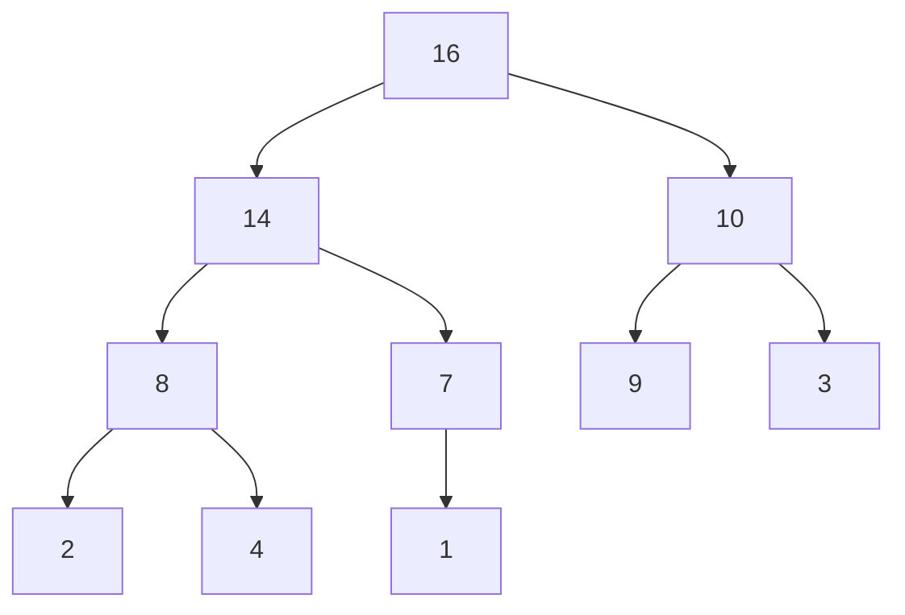
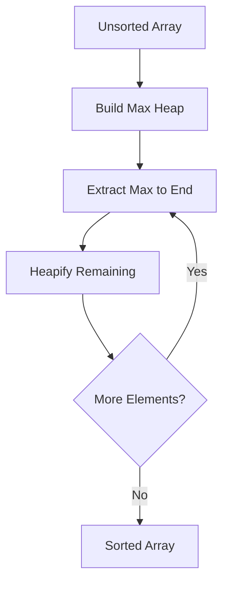

# Bài 11: Heap Sort & Priority Queue

<div className="bg-gradient-to-r from-blue-50 to-purple-50 p-6 rounded-lg border-l-4 border-blue-500 mb-6">
  <h2 className="text-2xl font-bold text-gray-800 mb-2">🎯 Mục tiêu bài học</h2>
  <ul className="text-gray-700 space-y-2">
    <li>• Hiểu cấu trúc dữ liệu Heap và tính chất của nó</li>
    <li>• Nắm vững các thuật toán heapify và heap operations</li>
    <li>• Cài đặt thuật toán Heap Sort hoàn chỉnh</li>
    <li>• Xây dựng Priority Queue sử dụng heap</li>
    <li>• Áp dụng vào các bài toán thực tế</li>
  </ul>
</div>

## 1. Giới thiệu về Heap

Heap là một cấu trúc dữ liệu dạng cây nhị phân hoàn chỉnh có tính chất đặc biệt về thứ tự các phần tử.

### 1.1. Định nghĩa và Tính chất

| Thuộc tính | Max-Heap | Min-Heap |
|------------|----------|----------|
| **Tính chất chính** | Parent ≥ Children | Parent ≤ Children |
| **Root element** | Phần tử lớn nhất | Phần tử nhỏ nhất |
| **Ứng dụng** | Heap Sort giảm dần | Priority Queue |
| **Complexity insert** | O(log n) | O(log n) |
| **Complexity extract** | O(log n) | O(log n) |

### 1.2. Biểu diễn Heap trong Array



<div className="bg-gray-50 p-4 rounded-lg mt-4">
  <h4 className="font-semibold text-gray-800 mb-2">Array Representation:</h4>
  <div className="grid grid-cols-10 gap-2 text-center">
    <div className="bg-blue-100 p-2 rounded">Index</div>
    <div className="bg-blue-100 p-2 rounded">0</div>
    <div className="bg-blue-100 p-2 rounded">1</div>
    <div className="bg-blue-100 p-2 rounded">2</div>
    <div className="bg-blue-100 p-2 rounded">3</div>
    <div className="bg-blue-100 p-2 rounded">4</div>
    <div className="bg-blue-100 p-2 rounded">5</div>
    <div className="bg-blue-100 p-2 rounded">6</div>
    <div className="bg-blue-100 p-2 rounded">7</div>
    <div className="bg-blue-100 p-2 rounded">8</div>
    <div className="bg-yellow-100 p-2 rounded">Value</div>
    <div className="bg-yellow-100 p-2 rounded">16</div>
    <div className="bg-yellow-100 p-2 rounded">14</div>
    <div className="bg-yellow-100 p-2 rounded">10</div>
    <div className="bg-yellow-100 p-2 rounded">8</div>
    <div className="bg-yellow-100 p-2 rounded">7</div>
    <div className="bg-yellow-100 p-2 rounded">9</div>
    <div className="bg-yellow-100 p-2 rounded">3</div>
    <div className="bg-yellow-100 p-2 rounded">2</div>
    <div className="bg-yellow-100 p-2 rounded">4</div>
  </div>
</div>

### 1.3. Công thức quan hệ Parent-Child

| Quan hệ | Công thức |
|---------|-----------|
| **Parent của node i** | `(i - 1) / 2` |
| **Left child của node i** | `2 * i + 1` |
| **Right child của node i** | `2 * i + 2` |

## 2. Cài đặt Heap bằng Rust

### 2.1. Cấu trúc dữ liệu cơ bản

```rust
pub struct MaxHeap {
    data: Vec<i32>,
}

impl MaxHeap {
    pub fn new() -> Self {
        MaxHeap {
            data: Vec::new(),
        }
    }
    
    pub fn with_capacity(capacity: usize) -> Self {
        MaxHeap {
            data: Vec::with_capacity(capacity),
        }
    }
    
    pub fn len(&self) -> usize {
        self.data.len()
    }
    
    pub fn is_empty(&self) -> bool {
        self.data.is_empty()
    }
    
    // Helper functions
    fn parent_index(&self, index: usize) -> Option<usize> {
        if index == 0 { None } else { Some((index - 1) / 2) }
    }
    
    fn left_child_index(&self, index: usize) -> usize {
        2 * index + 1
    }
    
    fn right_child_index(&self, index: usize) -> usize {
        2 * index + 2
    }
}
```

### 2.2. Thuật toán Heapify

#### Heapify Up (Bubble Up)
```rust
impl MaxHeap {
    fn heapify_up(&mut self, mut index: usize) {
        while let Some(parent_idx) = self.parent_index(index) {
            if self.data[index] <= self.data[parent_idx] {
                break;
            }
            self.data.swap(index, parent_idx);
            index = parent_idx;
        }
    }
}
```

#### Heapify Down (Bubble Down)
```rust
impl MaxHeap {
    fn heapify_down(&mut self, mut index: usize) {
        loop {
            let mut largest = index;
            let left = self.left_child_index(index);
            let right = self.right_child_index(index);
            
            // Tìm phần tử lớn nhất trong 3 node: parent, left, right
            if left < self.len() && self.data[left] > self.data[largest] {
                largest = left;
            }
            
            if right < self.len() && self.data[right] > self.data[largest] {
                largest = right;
            }
            
            if largest == index {
                break;
            }
            
            self.data.swap(index, largest);
            index = largest;
        }
    }
}
```

### 2.3. Heap Operations

```rust
impl MaxHeap {
    // Chèn phần tử mới
    pub fn push(&mut self, value: i32) {
        self.data.push(value);
        let last_index = self.len() - 1;
        self.heapify_up(last_index);
    }
    
    // Lấy phần tử lớn nhất (root)
    pub fn peek(&self) -> Option<&i32> {
        self.data.first()
    }
    
    // Loại bỏ và trả về phần tử lớn nhất
    pub fn pop(&mut self) -> Option<i32> {
        if self.is_empty() {
            return None;
        }
        
        if self.len() == 1 {
            return self.data.pop();
        }
        
        let max = self.data[0];
        self.data[0] = self.data.pop().unwrap();
        self.heapify_down(0);
        Some(max)
    }
}
```

## 3. Heap Sort Algorithm

### 3.1. Quy trình Heap Sort



### 3.2. Cài đặt Heap Sort

```rust
pub fn heap_sort(arr: &mut [i32]) {
    let len = arr.len();
    if len <= 1 {
        return;
    }
    
    // Bước 1: Xây dựng max heap
    build_max_heap(arr);
    
    // Bước 2: Trích xuất từng phần tử
    for i in (1..len).rev() {
        arr.swap(0, i);  // Di chuyển max về cuối
        heapify_down_range(arr, 0, i);  // Heapify phần còn lại
    }
}

fn build_max_heap(arr: &mut [i32]) {
    let len = arr.len();
    // Bắt đầu từ node không phải lá cuối cùng
    for i in (0..len/2).rev() {
        heapify_down_range(arr, i, len);
    }
}

fn heapify_down_range(arr: &mut [i32], mut index: usize, heap_size: usize) {
    loop {
        let mut largest = index;
        let left = 2 * index + 1;
        let right = 2 * index + 2;
        
        if left < heap_size && arr[left] > arr[largest] {
            largest = left;
        }
        
        if right < heap_size && arr[right] > arr[largest] {
            largest = right;
        }
        
        if largest == index {
            break;
        }
        
        arr.swap(index, largest);
        index = largest;
    }
}
```

### 3.3. Phân tích Complexity

| Thao tác | Time Complexity | Space Complexity |
|----------|-----------------|------------------|
| **Build Heap** | O(n) | O(1) |
| **Heapify Down** | O(log n) | O(1) |
| **Heap Sort** | O(n log n) | O(1) |
| **Best Case** | O(n log n) | O(1) |
| **Worst Case** | O(n log n) | O(1) |

## 4. Priority Queue với Heap

### 4.1. Khái niệm Priority Queue

<div className="bg-green-50 p-4 rounded-lg border-l-4 border-green-500">
  <h4 className="font-semibold text-green-800">Priority Queue</h4>
  <p className="text-green-700">Cấu trúc dữ liệu cho phép thêm phần tử và lấy ra phần tử có độ ưu tiên cao nhất.</p>
</div>

### 4.2. Cài đặt Priority Queue

```rust
use std::cmp::Ordering;

#[derive(Debug, Clone)]
pub struct PriorityItem<T> {
    pub priority: i32,
    pub data: T,
}

impl<T> PartialEq for PriorityItem<T> {
    fn eq(&self, other: &Self) -> bool {
        self.priority == other.priority
    }
}

impl<T> Eq for PriorityItem<T> {}

impl<T> PartialOrd for PriorityItem<T> {
    fn partial_cmp(&self, other: &Self) -> Option<Ordering> {
        Some(self.cmp(other))
    }
}

impl<T> Ord for PriorityItem<T> {
    fn cmp(&self, other: &Self) -> Ordering {
        self.priority.cmp(&other.priority)
    }
}

pub struct PriorityQueue<T> {
    heap: Vec<PriorityItem<T>>,
}

impl<T> PriorityQueue<T> {
    pub fn new() -> Self {
        PriorityQueue {
            heap: Vec::new(),
        }
    }
    
    pub fn push(&mut self, priority: i32, data: T) {
        let item = PriorityItem { priority, data };
        self.heap.push(item);
        self.bubble_up(self.heap.len() - 1);
    }
    
    pub fn pop(&mut self) -> Option<PriorityItem<T>> {
        if self.heap.is_empty() {
            return None;
        }
        
        if self.heap.len() == 1 {
            return self.heap.pop();
        }
        
        let result = self.heap.swap_remove(0);
        self.bubble_down(0);
        Some(result)
    }
    
    pub fn peek(&self) -> Option<&PriorityItem<T>> {
        self.heap.first()
    }
    
    pub fn len(&self) -> usize {
        self.heap.len()
    }
    
    pub fn is_empty(&self) -> bool {
        self.heap.is_empty()
    }
}
```

## 5. Ứng dụng thực tế

### 5.1. So sánh thuật toán sắp xếp

| Algorithm | Time Complexity | Space | Stable | In-place |
|-----------|----------------|--------|---------|----------|
| **Heap Sort** | O(n log n) | O(1) | No | Yes |
| **Merge Sort** | O(n log n) | O(n) | Yes | No |
| **Quick Sort** | O(n log n)* | O(log n) | No | Yes |
| **Bubble Sort** | O(n²) | O(1) | Yes | Yes |

*Average case, worst case O(n²)

### 5.2. Khi nào sử dụng Heap Sort?

<div className="grid grid-cols-1 md:grid-cols-2 gap-4">
  <div className="bg-blue-50 p-4 rounded-lg">
    <h4 className="font-semibold text-blue-800 mb-2">✅ Ưu điểm</h4>
    <ul className="text-blue-700 space-y-1">
      <li>• Complexity ổn định O(n log n)</li>
      <li>• In-place sorting (O(1) space)</li>
      <li>• Không có worst case như Quick Sort</li>
      <li>• Tốt cho embedded systems</li>
    </ul>
  </div>
  <div className="bg-red-50 p-4 rounded-lg">
    <h4 className="font-semibold text-red-800 mb-2">❌ Nhược điểm</h4>
    <ul className="text-red-700 space-y-1">
      <li>• Không stable</li>
      <li>• Cache performance kém</li>
      <li>• Chậm hơn Quick Sort trung bình</li>
      <li>• Implementation phức tạp</li>
    </ul>
  </div>
</div>

## 6. Bài tập thực hành

### 6.1. Bài tập cơ bản

```rust
fn main() {
    // Test heap operations
    let mut heap = MaxHeap::new();
    let numbers = vec![4, 1, 3, 2, 16, 9, 10, 14, 8, 7];
    
    // Insert all numbers
    for num in numbers {
        heap.push(num);
        println!("Inserted {}, heap top: {:?}", num, heap.peek());
    }
    
    // Extract all numbers
    while !heap.is_empty() {
        println!("Extracted: {:?}", heap.pop());
    }
    
    // Test heap sort
    let mut arr = vec![64, 34, 25, 12, 22, 11, 90];
    println!("Original: {:?}", arr);
    heap_sort(&mut arr);
    println!("Sorted: {:?}", arr);
}
```

### 6.2. LeetCode Problems

| Problem | Difficulty | Topic |
|---------|------------|-------|
| [215. Kth Largest Element in an Array](https://leetcode.com/problems/kth-largest-element-in-an-array/) | Medium | Heap |
| [23. Merge k Sorted Lists](https://leetcode.com/problems/merge-k-sorted-lists/) | Hard | Priority Queue |
| [347. Top K Frequent Elements](https://leetcode.com/problems/top-k-frequent-elements/) | Medium | Heap |
| [295. Find Median from Data Stream](https://leetcode.com/problems/find-median-from-data-stream/) | Hard | Two Heaps |
| [703. Kth Largest Element in a Stream](https://leetcode.com/problems/kth-largest-element-in-a-stream/) | Easy | Min Heap |
| [973. K Closest Points to Origin](https://leetcode.com/problems/k-closest-points-to-origin/) | Medium | Heap |
| [1046. Last Stone Weight](https://leetcode.com/problems/last-stone-weight/) | Easy | Max Heap |

<div className="bg-yellow-50 p-4 rounded-lg border-l-4 border-yellow-500 mt-6">
  <h4 className="font-semibold text-yellow-800 mb-2">💡 Mẹo giải bài tập</h4>
  <ul className="text-yellow-700 space-y-1">
    <li>• Sử dụng Min Heap khi cần tìm K largest elements</li>
    <li>• Sử dụng Max Heap khi cần tìm K smallest elements</li>
    <li>• Two heaps technique cho median problems</li>
    <li>• Priority Queue cho scheduling problems</li>
  </ul>
</div>

## 7. Tóm tắt

### 7.1. Key Takeaways

- **Heap** là cấu trúc cây nhị phân hoàn chỉnh với tính chất thứ tự đặc biệt
- **Heap Sort** có complexity O(n log n) ổn định và sắp xếp in-place  
- **Priority Queue** được implement hiệu quả bằng heap
- **Applications**: Dijkstra's algorithm, task scheduling, top-K problems

### 7.2. Next Steps

Trong bài tiếp theo, chúng ta sẽ học về **Searching Algorithms** để hoàn thành phần thuật toán sắp xếp và tìm kiếm cơ bản.

---

<div className="text-center mt-6 p-4 bg-gray-50 rounded-lg">
  <p className="text-gray-600">🚀 <strong>Thành thạo Heap Sort là bước quan trọng để hiểu các thuật toán graph phức tạp!</strong></p>
</div>